## The Swiss Cheese Model of Accident Causation

### Overview

The Swiss Cheese Model, developed by James Reason and introduced in his 1990 book *Human Error*, is the organizing conceptual model that formalizes the active failure/latent condition distinction covered in the previous item into a complete depiction of how organizational accidents occur. Where the previous item established the vocabulary (active failures versus latent conditions), this item covers the model itself in depth — its structure, its formal mechanics, its direct relationship to Barrier Analysis, and its influence on how modern RCA methodologies are structured. The model's central, often-cited claim is that major accidents are rarely caused by a single failure; they occur when weaknesses across multiple independent layers of organizational defense align simultaneously, allowing a trajectory of accident opportunity to pass through all of them at once.

### Origin and Purpose

**Key Points**

- Reason developed the model while studying the causal patterns behind major organizational accidents (including, in subsequent work, the Chernobyl disaster and the Piper Alpha oil platform explosion), observing that these incidents consistently involved multiple simultaneous defensive failures rather than one single catastrophic error
- The model's defining metaphor — slices of Swiss cheese, each representing a layer of organizational defense, each containing holes representing weaknesses — visually communicates a specific claim: **no single layer of defense is expected to be perfect**, but a well-designed system relies on multiple independent layers so that a hole in any one layer alone does not result in an accident, because subsequent layers should catch what earlier layers missed
- An accident occurs specifically when the holes across multiple layers **momentarily align**, creating a clear trajectory through the entire system — Reason's framework treats this alignment as the defining, and comparatively rare, condition producing a major incident, distinguishing it from the far more common situation where a hole in one layer exists but is caught by a subsequent layer

### The Formal Structure of the Model

| Element | Definition |
| --- | --- |
| **Defense layer** | An organizational or engineered barrier intended to prevent a hazard from reaching a target — analogous to, and the direct conceptual origin of, the "barrier" concept in Barrier Analysis covered earlier in this series |
| **Hole (latent condition)** | A weakness in a given defense layer, often invisible until tested, corresponding to the latent conditions defined in the previous item |
| **Hole (active failure)** | A momentary, transient weakness introduced by a specific human action or decision at the point of operation |
| **Trajectory of accident opportunity** | The path a hazard follows when it successfully passes through aligned holes across multiple layers, ultimately reaching the target and producing harm |

```mermaid
flowchart LR
    H["Hazard
    (mechanical wear/
    contamination process) (svg_diagram)"] -.trajectory.-> L1

    subgraph L1["Layer 1: Design/
    Engineering"]
    direction TB
    H1a["intact"]
    H1b["HOLE: no
    vibration alarm"]
    end

    subgraph L2["Layer 2:
    Procedures"]
    direction TB
    H2a["intact"]
    H2b["HOLE: no seal-
    replacement spec"]
    end

    subgraph L3["Layer 3:
    Supervision/
    Escalation"]
    direction TB
    H3a["intact"]
    H3b["HOLE: no
    threshold defined"]
    end

    subgraph L4["Layer 4:
    Front-line
    Action"]
    direction TB
    H4a["intact"]
    H4b["HOLE: noise not
    escalated (active)"]
    end

    L1 --> L2 --> L3 --> L4 --> T["Target:
    Motor trips,
    production halted"]
```

Note that each layer in this diagram is drawn with both an "intact" region and a "hole" — this is deliberate and central to the model: the same layer that failed in this specific incident also succeeds in preventing many other, different incidents most of the time. The model does not depict any layer as uniformly broken; it depicts layers with **specific, often narrow** weaknesses that happen to align on this occasion.

### Why Multiple Layers Exist: Defense in Depth

The Swiss Cheese Model formalizes the safety-engineering principle of **defense in depth**: because no single layer can be made perfectly reliable, systems are deliberately designed with multiple, ideally independent layers, so that the *combined* probability of a hazard passing through all layers is dramatically lower than the probability of it passing through any single layer alone. This principle directly explains why the corrective actions proposed throughout this series' worked examples typically span multiple layers simultaneously (a vibration alarm at the design layer, a revised procedure at the procedural layer, an escalation threshold at the supervision layer) rather than concentrating all remediation on a single layer — consistent with the direct/systemic corrective-action balance discussed in the previous chapter's items.

### The Model's Direct Relationship to Barrier Analysis

**Key Points**

- **Barrier Analysis, covered earlier in this series, is essentially a practical, worksheet-based application of the Swiss Cheese Model** — each "barrier" identified in that technique corresponds to a "defense layer" here, and the exercise of determining each barrier's status (functioning, degraded, absent, bypassed) is functionally equivalent to asking "how large is the hole in this layer, and is it aligned with holes in the other layers on this occasion?"
- The Swiss Cheese Model provides the underlying **theoretical justification** for why Barrier Analysis is structured the way it is — Barrier Analysis does not merely happen to resemble the model; it is a direct operationalization of it, translating the visual metaphor into an investigable worksheet
- The model's emphasis on documenting layers that **functioned correctly**, not just the ones that failed, mirrors the Barrier Analysis construction guidance from earlier in this series (Step 5: "identify barriers that functioned correctly and analyze why") — this is a direct methodological consequence of the Swiss Cheese Model's premise that most layers hold most of the time, and understanding why they held on this occasion (when they didn't fail) is informative for reinforcing them elsewhere

### Relationship to Other Concepts in This Chapter

| Concept | Relationship to the Swiss Cheese Model |
| --- | --- |
| Active failures vs. latent conditions | The model's two types of "holes" — this chapter's previous item is the direct vocabulary this model uses |
| Direct causes vs. systemic causes | Holes at layers closer to the front line (procedures, front-line action) tend to align with direct causes; holes at layers further back (design, organizational policy) tend to align with systemic causes |
| Necessary/sufficient conditions | Each individual hole is typically necessary but not sufficient for the accident; the **simultaneous alignment** of holes across all layers is what becomes jointly sufficient — a direct parallel to the AND-gate logic in Fault Tree Analysis, with each layer's hole functioning as one input to the gate |
| Root vs. proximate cause | The proximate cause typically corresponds to the final layer's hole (the active failure nearest the target); root causes are typically found in the earlier layers' latent conditions |

### Practical Application: Using the Model to Guide an Investigation

**Step 1 — Identify the relevant defense layers for the system or process under investigation.** These typically correspond to organizational function: engineering/design, procedures, training, supervision, and front-line operation, though the specific layer set should be tailored to the actual system.

**Step 2 — For each layer, determine whether a hole was present at the time of the incident**, and whether that hole is better characterized as a latent condition (present well before the incident, often invisible) or an active failure (introduced at or near the moment of the incident).

**Step 3 — Trace the trajectory of accident opportunity through the aligned holes**, documenting how the hazard passed through each layer in sequence — this step closely parallels Event and Causal Factor Charting's sequencing discipline, covered earlier in this series, and the two techniques are often used together.

**Step 4 — For each latent-condition hole, investigate its own origin** using an appropriate cause-identification tool from this series (5 Whys, Fishbone, Apollo) — the Swiss Cheese Model identifies *where* the holes are, but not *why* they exist, which remains the job of the cause-identification tools covered elsewhere in this series.

**Step 5 — Propose corrective actions distributed across multiple layers**, consistent with the defense-in-depth principle — rather than concentrating all remediation on the layer closest to the incident (often the front-line/active-failure layer), a Swiss-Cheese-informed corrective action plan typically strengthens several layers simultaneously, reducing the probability of future alignment even if any single layer's hole is not perfectly closed.

### Common Pitfalls

- **Treating a single layer's hole as sufficient explanation for the accident** — the model's central point is that accidents require *alignment* across multiple layers; attributing the incident to a single layer's failure (most often the front-line active failure, since it is the most visible) misrepresents the model's own logic and typically produces an incomplete corrective action
- **Assuming holes are static and permanently aligned** — holes in different layers are often independent and shift over time (a procedure gap may persist for years while a specific operator's momentary lapse is a one-time event); treating the alignment as a permanent, fixed condition rather than a probabilistic, occasionally-occurring event can lead to over- or under-estimating future risk
- **Focusing corrective action only on the layer nearest the incident** — as with the active failure/latent condition distinction in the previous item, concentrating remediation on the front-line layer (retraining, disciplinary action) while leaving earlier layers' holes unaddressed leaves the system vulnerable to a similar alignment recurring through a different specific active failure
- **Applying the model without following up with a specific cause-identification technique** — the Swiss Cheese Model is a structural, diagnostic framework for understanding *how* an accident became possible; it does not itself explain *why* any given hole exists, which requires the tools covered elsewhere in this series (5 Whys, Fishbone, Apollo, TapRooT) applied to each identified hole
- **Overextending the model to situations with a genuinely single point of failure** — not every incident requires multi-layer alignment; some incidents genuinely result from a single, catastrophic, independently sufficient failure (as an OR-gate branch in Fault Tree Analysis would represent) rather than the AND-like alignment the Swiss Cheese Model depicts; forcing every incident into a multi-layer narrative when the evidence shows a single sufficient cause can obscure rather than clarify the actual causal structure

**Related Topics**

- Active failures versus latent conditions
- Barrier analysis and change analysis
- Fault tree analysis fundamentals
- Direct causes versus systemic causes
- Event and causal factor charting
- Failure mode and effects analysis