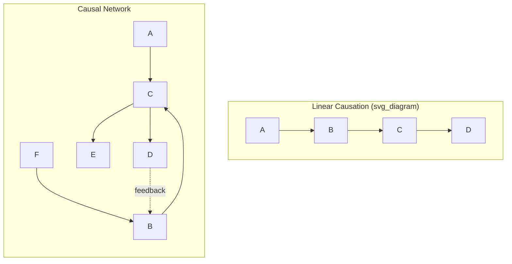
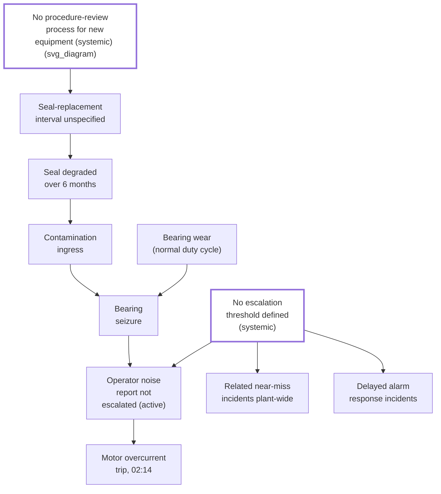

## Linear Causation versus Causal Networks

### Overview

This item is the conceptual synthesis point for the entire Causal Theory and Terminology chapter, and it directly parallels the structural argument made in "Cause mapping versus linear why chains" from the earlier mapping-tools chapter — but here the comparison is elevated from a tool-selection question to a foundational question about **what kind of thing causation actually is** in complex sociotechnical systems. Linear causation models an incident as a single sequential chain: A causes B causes C causes D. Causal network models represent the same incident as a graph of interacting nodes and edges, where multiple causes converge, diverge, feed back, and interact — a structure that better reflects how most real, complex-system incidents actually unfold, and which underlies why nearly every advanced tool covered in this series (Fault Tree Analysis, the Apollo method, the Current Reality Tree, the Swiss Cheese Model) rejects strict linearity in favor of some form of network or branching representation.

### Defining the Two Models

**Linear causation** represents an incident as a single, ordered sequence of cause-effect pairs, where each event has exactly one identified cause, which itself has exactly one cause, and so on — the structure a strict, undisciplined 5 Whys chain naturally produces.

**Causal network** (also called a causal web or causal graph) represents an incident as a directed graph: nodes represent events or conditions, and edges represent causal influence, with **multiple edges permitted into and out of any single node** — meaning a single effect can have multiple causes (convergence), a single cause can produce multiple effects (divergence), and causal influence can loop back on itself over time (feedback).

### Why Real Sociotechnical Systems Produce Networks, Not Chains

**Key Points**

- **Convergence** — most real effects have multiple genuine contributing causes rather than one, as demonstrated repeatedly throughout this series (the bearing seizure required both wear AND contamination; the plant's three symptoms converged on a single escalation-threshold core problem in the Current Reality Tree example)
- **Divergence** — a single cause frequently produces multiple downstream effects simultaneously, not just the one effect under investigation; the missing procedure-review process (identified as a systemic cause in this chapter's earlier item) plausibly affects equipment classes and failure modes well beyond the single bearing incident used as this series' running example
- **Feedback loops** — in ongoing operational systems, downstream effects can loop back to influence earlier conditions over time (e.g., repeated near-misses from a latent condition may eventually trigger a policy change, which itself becomes a new condition in the network) — a genuinely cyclical structure that a strictly acyclic linear chain cannot represent at all
- **Shared/common-cause nodes** — a single latent condition (per the previous items in this chapter) can sit at the root of multiple superficially unrelated causal paths simultaneously, which is precisely the structural signature the Current Reality Tree is built to detect

### How Each Tool in This Series Relates to the Linear/Network Spectrum

| Tool (from earlier in this series) | Position on the Linear–Network Spectrum |
| --- | --- |
| Linear 5 Whys | Strictly linear by construction — one cause per level |
| Fishbone/Ishikawa | Locally divergent (branches from one problem), but branches are typically not interconnected — a "star" rather than a full network |
| Cause Mapping | Explicitly networked — supports both convergence (AND) and divergence (OR) at every level |
| Fault Tree Analysis | Formally networked, using AND/OR gates to encode convergence and alternate pathways precisely |
| Event and Causal Factor Charting | Networked in the sense of multiple parallel timelines intersecting, though organized primarily by chronology rather than pure causal structure |
| Current Reality Tree | Explicitly networked — built specifically to detect convergence of multiple UDEs onto shared core problems |
| Apollo Method | Mandatorily networked — the Action/Condition rule guarantees at least two parents at every node, structurally preventing a linear chain from ever forming |
| Swiss Cheese Model | Networked across parallel layers, with the "trajectory" representing one specific path through a network of possible hole-alignments |

This table makes visible a pattern running through the entire series: **the progression from simpler to more sophisticated RCA tools is, in large part, a progression from linear to networked causal representation.** The earliest, simplest tool covered (linear 5 Whys) is the only one in this entire series that is strictly and exclusively linear by design; every other tool either explicitly supports network structure or, in the case of Fishbone, at least supports local divergence beyond a single chain.

### The Practical Risk of Defaulting to Linear Thinking

**Key Points**

- Linear causal thinking is **cognitively natural and narratively satisfying** — a single chain of "why" produces a clean, tellable story with a clear beginning, middle, and end, which is part of why it remains the most commonly taught and most commonly misapplied RCA structure
- This narrative appeal creates a systematic bias toward **premature convergence**: when an investigator or team finds one plausible cause at a given level, the linear format offers no natural prompt to ask "what else contributed?" — a gap the Cause Mapping technique's explicit branching discipline (covered earlier in this series) was specifically designed to correct
- Networked causal structures are **harder to communicate simply**, which creates organizational pressure to compress a genuinely networked causal reality back into a linear narrative for reporting purposes — this is part of why formats like 8D and A3, covered earlier in this chapter, still typically present a summarized, largely linear narrative in their reports even when the underlying investigation (in Discipline 4 or the A3's root cause section) used a networked tool like Fishbone or Cause Mapping to actually conduct the analysis
- **Reporting linearity and analytical linearity are different failures with different consequences**: presenting a networked finding through a simplified, linear narrative for communication purposes is a reasonable compression, provided the underlying investigation was genuinely networked; conducting the *investigation itself* linearly — never testing for convergence, divergence, or feedback — is the more consequential error, since it can cause genuine causal structure to go undetected rather than merely under-communicated

### Diagnostic Questions for Detecting When a Network Structure Is Present

Applying these questions during an investigation, regardless of which specific tool is being used, helps detect when a linear representation is inadequate:

1. **Convergence check:** "Are there other credible contributing factors at this level, beyond the one I've identified?" (If yes, per the Cause Mapping discipline, branch rather than continuing linearly.)
2. **Divergence check:** "Does this same cause plausibly explain other effects beyond the one currently under investigation?" (If yes, this may be a shared node worth investigating at the systemic level, as in a Current Reality Tree.)
3. **Feedback check:** "Has this system produced a similar effect before, and did that prior occurrence change any conditions still present today?" (If yes, a purely one-directional chain will misrepresent the system's actual dynamics over time.)
4. **Common-cause check:** "If I look across multiple recent incidents or near-misses (not just this one), does the same underlying condition appear in more than one?" (If yes, per the Current Reality Tree methodology, a shared node/core problem likely exists.)

### Worked Illustration: The Full Network Behind This Series' Running Example

Consolidating the causal elements surfaced across this series' worked examples into a single network view (rather than the linear chains or partial branches shown in individual earlier items) makes the convergence, divergence, and shared-node structure explicit:

This consolidated network shows both node N1 and node N3 functioning as **shared, systemic root causes** feeding into multiple downstream branches simultaneously — N3 in particular converges into three distinct effects (the specific incident, plus two other plant-wide symptom categories), exactly the pattern that a linear 5 Whys chain applied only to the single 02:14 incident would never surface, and exactly the pattern the Current Reality Tree methodology, introduced earlier in this series, was purpose-built to detect.

### Common Pitfalls

- **Defaulting to a linear write-up because it is easier to narrate** — compressing a genuinely networked investigation into a linear report is acceptable for communication, but only after the investigation itself has tested for convergence, divergence, and shared nodes; skipping that testing and simply writing the first plausible chain found is the actual failure
- **Treating every investigation as requiring full network analysis regardless of complexity** — as established in the tool-selection items earlier in this series, a genuinely single-threaded, low-stakes incident may not warrant the additional effort of full network mapping; the diagnostic questions above exist to help distinguish when network structure is actually present, not to mandate its use universally
- **Missing feedback loops by treating investigations as always forward-looking** — an investigation that only asks "what led to this" and never asks "has this system's state been shaped by its own prior incidents or near-misses" can miss genuinely cyclical dynamics, particularly in the Current Reality Tree's systemic, multi-incident context
- **Confusing correlation-driven convergence with genuine shared causation** — two branches appearing to converge on a similar-sounding cause does not guarantee they share the literal same root cause; the same fact/assumption and cross-referencing discipline established at the start of this series applies to validating apparent convergence, not just to individual cause claims
- **Assuming network complexity is always deeper or more sophisticated than linear analysis** — a network representation that is built without evidentiary rigor is not more reliable than a well-evidenced linear chain; structural sophistication does not substitute for the evidentiary discipline that underlies every tool covered in this series, from the simplest to the most complex

**Related Topics**

- Cause mapping versus linear why chains
- Current reality tree from theory of constraints
- Fault tree analysis fundamentals
- The Swiss cheese model of accident causation
- Direct causes versus systemic causes
- Distinguishing fact from assumption (evidentiary tagging discipline)