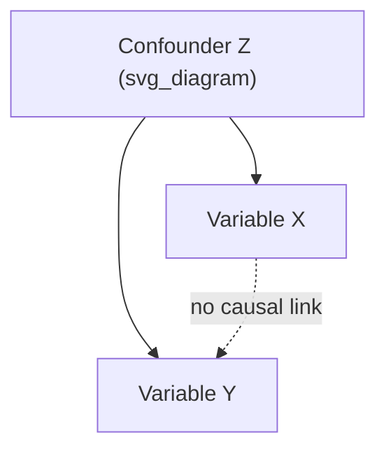
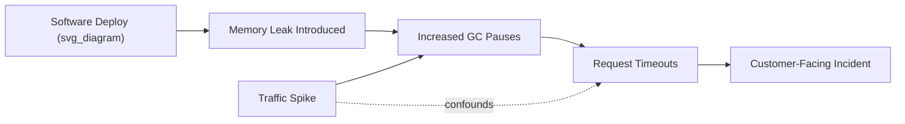

## Correlation versus Causation

### Definitions

**Correlation** is a statistical relationship between two variables in which changes in one variable tend to be associated with changes in another. Correlation is measured on a scale, most commonly using the Pearson correlation coefficient:

$$r = \frac{\sum (x_i - \bar{x})(y_i - \bar{y})}{\sqrt{\sum (x_i - \bar{x})^2 \sum (y_i - \bar{y})^2}}$$

Where $r$ ranges from $-1$ to $1$. A value near $1$ indicates strong positive correlation, near $-1$ indicates strong negative correlation, and near $0$ indicates little to no linear relationship.

**Causation** (or causality) means that a change in one variable directly produces a change in another. Formally, $X$ causes $Y$ if manipulating $X$ (holding all else constant) reliably changes $Y$. Causation implies a mechanism, a direction, and — critically — the ability to predict the effect of an intervention, not merely an observation.

The core distinction: correlation is a property of observed data; causation is a claim about the data-generating process.

### Why This Distinction Matters in RCA

Root Cause Analysis exists specifically to find causal chains that explain why a problem occurred, so that intervening on the root cause prevents recurrence. If an RCA team mistakes a correlated factor for a causal one:

- The "fix" addresses a symptom or a coincidental co-occurrence, not the actual mechanism.
- The real root cause remains active and the problem recurs.
- Resources are spent on an intervention that has no effect on the outcome.
- Worse, the false fix can create a false sense of resolution, delaying further investigation.

This is why frameworks like the 5 Whys, Fishbone/Ishikawa diagrams, and Fault Tree Analysis all include validation steps — to test whether a suspected cause is actually causal, not just co-occurring.

### Common Reasons Correlation Is Mistaken for Causation

**1. Confounding variable (common cause)**

A third variable $Z$ independently influences both $X$ and $Y$, producing a spurious correlation between them even though neither causes the other.



*Example:* Ice cream sales and drowning incidents are strongly correlated. The confounder is hot weather — it increases both ice cream purchases and swimming (and thus drownings). Ice cream does not cause drowning.

**2. Reverse causation**

$Y$ actually causes $X$, but the analysis assumes the arrow runs the other way.

*Example:* In an RCA context, a team observes that "servers with higher CPU usage have more error logs" and concludes high CPU causes errors. In reality, the error-handling routine itself is CPU-intensive (retries, logging, stack trace generation) — the errors are causing the CPU spike, not the reverse.

**3. Coincidence / small sample size**

With enough variables and limited data, spurious correlations arise by chance. This is formalized in the "multiple comparisons problem" — testing many pairs of variables increases the probability that some will correlate strongly purely by chance.

*Example:* Tyler Vigen's "Spurious Correlations" project famously shows datasets such as per-capita cheese consumption correlating at $r > 0.9$ with deaths by bedsheet entanglement — a coincidental statistical artifact with no causal mechanism.

**4. Selection bias**

The sample itself is not representative, creating an artificial relationship that would not hold in the full population.

*Example:* An RCA into "why do customers who contact support churn more" may be biased if only churned customers were sampled — support contact might actually reduce churn in the full population, but the analysis only saw the subset where it failed.

**5. Bidirectional / feedback causation**

$X$ and $Y$ cause each other in a loop, so a simple unidirectional causal claim oversimplifies the system.

*Example:* System latency increases queue depth, and increased queue depth further increases latency — a reinforcing feedback loop rather than a single-direction cause.

### Criteria for Establishing Causation

Several frameworks exist to move from "these are correlated" to "this is causal." The most widely referenced in epidemiology and applied statistically to engineering/operational RCA is **Bradford Hill's criteria** (1965), still commonly cited as a checklist:

| Criterion | Description | RCA Application Example |
| --- | --- | --- |
| Strength | Larger effect size is more likely causal | A 90% correlation is more suggestive than a 10% one |
| Consistency | Effect reproduces across different contexts/samples | The failure pattern repeats across multiple environments |
| Specificity | A specific cause leads to a specific effect | Isolating that only one code path produces the error |
| Temporality | Cause must precede effect | Deploy timestamp must precede the incident onset |
| Biological/Dose-response gradient | More "dose" of cause yields more effect | Higher load correlates monotonically with higher error rate |
| Plausibility | A credible mechanism exists | A known race condition in the code explains the behavior |
| Coherence | Fits with existing knowledge/data | Matches prior incident patterns and system architecture |
| Experiment | Intervening on the cause changes the effect | Rolling back the change eliminates the error |
| Analogy | Similar cause-effect relationships are known elsewhere | Comparable to a previously diagnosed memory-leak pattern |

In RCA, **temporality** and **experiment** (intervention) are the two most decisive, practically actionable criteria: does the cause precede the effect, and does removing/changing the cause change the outcome?

### Practical Validation Techniques in RCA

**1. Timeline reconstruction**

Build a precise, timestamped sequence of events. A candidate cause that occurs *after* the observed effect cannot be the cause (violates temporality) — this alone eliminates many spurious correlations quickly.

```mermaid
timeline
    title Incident Timeline Validation (svg_diagram)
    14:00 : Deploy pushed
    14:05 : Config change applied
    14:12 : Error rate begins rising
    14:15 : Alert fires
```

**2. Counterfactual / intervention testing**

Ask: "If we reverse or remove this factor, does the effect disappear?" This is the practical equivalent of a controlled experiment.

*Example:* Roll back a suspected causal deployment in a staging environment and observe whether the defect reproduces. If it does not reproduce, causal linkage is supported; if the defect persists, the deployment is likely just correlated (e.g., both triggered by the same underlying config push).

**3. Isolating confounders**

Hold other variables constant (or statistically control for them) to see if the correlation persists.

*Example:* If "Friday deploys" correlate with more incidents, check whether it's the day of week itself or simply that Friday deploys happen to bundle more changes per release. Controlling for change volume may eliminate the "Friday" correlation entirely.

**4. Mechanistic explanation requirement**

Require every proposed root cause to include a plausible mechanism — a step-by-step technical explanation of *how* $X$ produces $Y$. If no one on the team can explain the mechanism, treat the finding as correlation only, not a validated root cause.

**5. Statistical control methods**

For larger datasets, formal methods can help distinguish correlation from causation:

- **Regression with control variables** — isolates the effect of one variable while holding others fixed.
- **A/B testing / randomized controlled trials** — the gold standard; random assignment eliminates confounding by construction.
- **Granger causality tests** — used in time-series data to assess whether past values of $X$ help predict future values of $Y$ beyond what $Y$'s own history predicts. [Inference: Granger causality indicates predictive precedence, not true mechanistic causation — it is a necessary but not sufficient signal.]
- **Instrumental variables** — used when a confounder cannot be directly measured, by finding a variable that affects $X$ but not $Y$ except through $X$.

### Directed Acyclic Graphs (DAGs) for Causal Reasoning

DAGs are widely used to visually and formally represent hypothesized causal structures, making confounders and mediators explicit before analysis.



This structure clarifies that the deploy is the root cause acting through a specific mechanistic chain, while traffic spike is a contributing/confounding factor that amplifies — but does not originate — the failure.

### Common Pitfalls in RCA Teams

- **Anchoring on the first correlated factor found**, especially if it is convenient or matches a prior bias ("it's always the network").
- **Stopping the 5 Whys at a correlated symptom** rather than continuing to ask "why" until a mechanistic, actionable cause is reached.
- **Confusing "was present during the incident" with "caused the incident."** Many systems have dozens of concurrent changes/events; presence alone is not evidence.
- **Ignoring base rates.** If a factor is present in 80% of all normal operation too, its presence during an incident is weak evidence of causation.
- **Overfitting to a single incident.** A one-off correlation observed in a single case should be treated as a hypothesis, not a conclusion, until repeated or tested.

### Worked Example

**Observation:** "Incidents are more frequent on days when the on-call engineer is a specific individual, Engineer A."

**Naive (incorrect) conclusion:** Engineer A is causing more incidents (e.g., through mistakes).

**Correlation-vs-causation analysis:**

1. **Check temporality** — do incidents occur during A's shifts, or were they triggered earlier and merely detected during A's shift?
2. **Check confounders** — is Engineer A scheduled on-call during high-traffic periods (e.g., weekends, releases) more often than other engineers? Shift scheduling could be the true confounding cause.
3. **Check mechanism** — is there a specific action A takes (e.g., a manual deployment step) that differs from other engineers' process, or is A just present when the same automated pipeline runs?
4. **Check reverse causation** — could high-incident periods be *why* A is scheduled (e.g., a senior engineer intentionally placed on-call during known-risky windows)?

**Resolution:** Statistical control reveals A is disproportionately scheduled during release weeks. Once release-week frequency is controlled for, the correlation between "Engineer A on-call" and incident rate disappears — the true root cause is the release process, not the individual.

### Key Points

- Correlation indicates statistical association; causation indicates a directional, mechanistic relationship where changing one variable changes another.
- All causation produces correlation, but not all correlation implies causation — this asymmetry is the central trap in RCA.
- Confounding variables, reverse causation, coincidence, selection bias, and feedback loops are the primary sources of spurious correlation.
- Bradford Hill's criteria — especially temporality and experimental intervention — provide a practical checklist for validating causal claims.
- Every proposed root cause should be paired with a plausible, explicit mechanism; absence of mechanism is a red flag that the "cause" may only be a correlate.
- Timeline reconstruction and counterfactual testing (rollback/reproduction) are the two most immediately actionable validation techniques in operational RCA.

### Related Topics

- The 5 Whys technique and its failure modes (stopping too early, single-cause bias)
- Fishbone (Ishikawa) diagrams for multi-causal factor mapping
- Fault Tree Analysis (FTA) and Boolean causal logic
- Confounding variables and Simpson's Paradox
- Bradford Hill criteria in depth
- Directed Acyclic Graphs (DAGs) and formal causal inference (Judea Pearl's causal calculus)
- A/B testing and randomized controlled trials as causal validation tools
- Counterfactual reasoning in incident post-mortems
- Base rate neglect and cognitive biases in RCA (confirmation bias, anchoring)