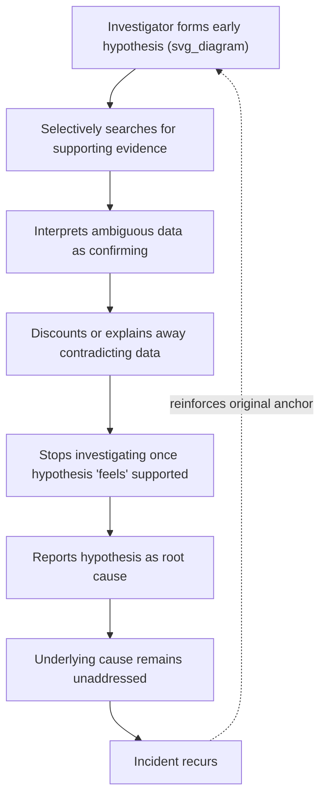
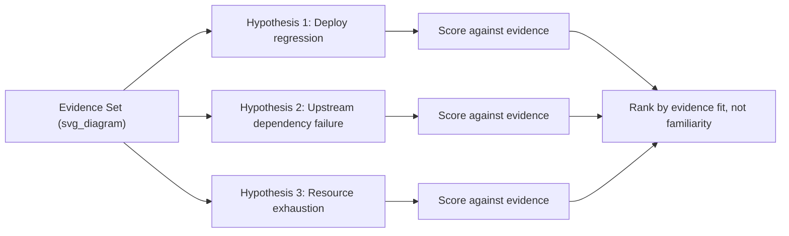
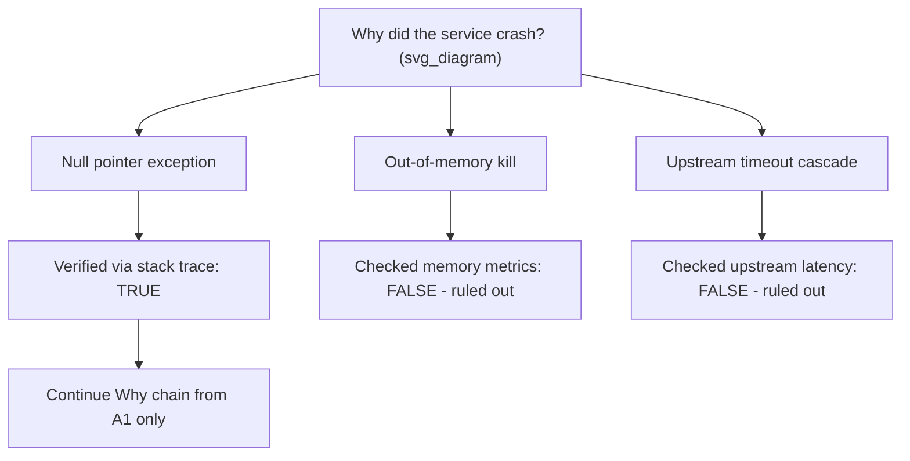

## Confirmation Bias in Root Cause Investigations

### Definition

**Confirmation bias** is the tendency to search for, interpret, favor, and recall information in a way that confirms a pre-existing belief or hypothesis, while disproportionately discounting evidence that contradicts it. In RCA, this manifests as an investigator forming an early hypothesis about the root cause and then unconsciously steering the investigation — the questions asked, the data pulled, the interviews conducted — toward confirming that hypothesis rather than genuinely testing it.

Formally, confirmation bias violates the principle of falsification: a scientifically sound investigation should actively seek evidence that could *disprove* a hypothesis, not merely evidence that supports it. An investigation dominated by confirmation bias will feel rigorous (data was collected, a report was written) while being structurally unsound (only supporting data was collected).

### Why RCA Is Especially Vulnerable

Root Cause Analysis has several structural features that make it more susceptible to confirmation bias than many other analytical tasks:

- **Time pressure** — incidents demand fast resolution, pushing investigators toward the first plausible explanation rather than the most correct one.
- **Prior incident memory** — "it's always DNS" or "it's always that flaky service" creates an anchor before any data is reviewed.
- **Narrow ownership** — the person investigating often owns or built the system, creating a motivated incentive to find a cause outside their own code/design.
- **The 5 Whys' linear structure** — a single chain of "why" questions can lock onto one causal path early and never branch out to test alternatives.
- **Incomplete or ambiguous telemetry** — when logs and metrics are noisy, it is easy to selectively notice the data points that fit the leading theory.

### The Mechanism: How Confirmation Bias Distorts an Investigation

This creates a self-reinforcing loop: because the wrong cause was "confirmed" and fixed, the next occurrence of the same underlying issue is again attributed to the same familiar suspect, strengthening the anchor further.

### Common Manifestations in RCA Practice

**1. Anchoring on a familiar past cause**

*Example:* A service experienced a memory leak six months ago. A new incident with rising response times is immediately attributed to "the memory leak issue again" without checking current memory metrics, because the pattern-match feels intuitively correct.

**2. Cherry-picking log evidence**

*Example:* An investigator believes a specific microservice is the cause and searches logs *for that service* during the incident window, finding errors (which exist in almost any service under load) and treating this as proof, while never examining upstream or downstream services with equal scrutiny.

**3. Leading questions in interviews**

*Example:* Asking a teammate "Was the database slow when you deployed that change?" presupposes both the timing and the causal direction, rather than the neutral "Walk me through what happened during your deployment."

**4. Premature closure of the 5 Whys**

*Example:* The chain stops at "Why did the service crash? → Because of a null pointer exception in the payment module" — matching the investigator's suspicion that the payment team's code is fragile — without continuing to ask why the null was possible in the first place (e.g., a missing validation contract from an upstream API change).

**5. Dismissing disconfirming data as noise**

*Example:* A metric that contradicts the leading theory (e.g., CPU was actually normal during the incident) gets labeled "probably a monitoring glitch" and excluded from the report, without any independent verification that it was in fact a glitch.

**6. Post-hoc rationalization**

*Example:* After the incident is resolved by an unrelated action (e.g., a service restart), the investigator retroactively attributes success to their favored hypothesis ("see, restarting fixed the config issue") even though the restart could have cleared an unrelated resource leak.

### Distinguishing Confirmation Bias from Legitimate Hypothesis-Driven Investigation

It is normal and efficient to form an initial hypothesis — RCA cannot proceed by brute-force examining every possible cause with equal weight. The distinction is *how* the hypothesis is treated afterward:

| Legitimate Hypothesis-Driven Approach | Confirmation-Biased Approach |
| --- | --- |
| Hypothesis is treated as tentative and falsifiable | Hypothesis is treated as the presumed answer |
| Actively seeks disconfirming evidence | Only seeks confirming evidence |
| Multiple competing hypotheses are tracked in parallel | Only one hypothesis is seriously pursued |
| Ambiguous data is flagged as ambiguous | Ambiguous data is interpreted in favor of the hypothesis |
| Investigation continues until root mechanism is proven | Investigation stops once a plausible story exists |
| Evidence gaps are explicitly noted | Evidence gaps are filled in with assumption |

### Mitigation Techniques

**1. Explicit multiple-hypothesis tracking**

Require the investigation to generate and document at least 2–3 competing hypotheses before evaluating any of them, and require each to be scored independently against the same evidence set. This is the core discipline behind the **Analysis of Competing Hypotheses (ACH)** method developed for intelligence analysis and increasingly applied to technical postmortems.

**2. Assign a designated "devil's advocate"**

Have a team member — ideally someone without a stake in the outcome or prior familiarity with the system — explicitly argue against the leading hypothesis and attempt to find disconfirming evidence.

**3. Blind or masked data review**

Where feasible, review raw logs/metrics before being told which hypothesis is favored, so pattern recognition isn't primed by the leading theory.

**4. Require a stated falsification test**

Before accepting a hypothesis as the root cause, require the team to answer: *"What evidence would prove this hypothesis wrong?"* If no one can articulate a disconfirming test, the hypothesis has not been rigorously validated — it has only been rationalized.

**5. Timeline-first, hypothesis-second discipline**

Build the complete, objective event timeline (see the related "correlation versus causation" methodology of temporality-checking) *before* forming or discussing a leading theory. This delays hypothesis formation until more neutral data has been gathered.

**6. Structured "Five Whys" branching**

Instead of a single linear chain, use a tree structure at each "why," listing multiple plausible answers before selecting which to pursue, and documenting why alternatives were ruled out (with evidence, not intuition).

**7. Independent peer review of the final RCA report**

Have someone not involved in the investigation review the evidence-to-conclusion chain and explicitly check whether alternative explanations were considered and ruled out with evidence, not assumption.

**8. Blameless postmortem culture**

Confirmation bias is often amplified by the incentive to find a cause that doesn't implicate the investigator's own team or decisions. A blameless postmortem culture — focusing on systemic factors rather than individual fault — reduces the motivated reasoning that drives investigators toward externally-attributed causes.

### Related Cognitive Biases That Compound Confirmation Bias in RCA

- **Anchoring bias** — over-weighting the first piece of information encountered (e.g., the first log line reviewed).
- **Availability heuristic** — over-weighting causes that are easy to recall (recent or memorable past incidents) over statistically more likely but less memorable causes.
- **Hindsight bias** — after the cause is known, believing it was "obvious" all along, which retroactively distorts how thoroughly alternatives were actually considered.
- **Groupthink** — team consensus forming around the loudest or most senior voice's early hypothesis, suppressing dissenting evidence.
- **Outcome bias** — judging the quality of the investigation process by whether the incident stopped recurring, rather than by whether the causal mechanism was actually proven.

### Worked Example

**Scenario:** An e-commerce checkout service begins failing intermittently. The on-call engineer previously dealt with a database connection pool exhaustion issue and immediately suspects the same cause.

**Confirmation-biased path:**

1. Pulls only database connection metrics.
2. Sees connection count is "somewhat elevated" (though within normal range) and interprets this as confirming.
3. Restarts the connection pool; failures temporarily stop (coincidentally, due to unrelated cache clearing).
4. Reports "database connection exhaustion" as root cause. Closes investigation.
5. Two weeks later, the same failure recurs — the actual cause (a race condition in a new feature flag rollout) was never examined.

**Bias-mitigated path:**

1. Documents 3 hypotheses: DB connection exhaustion, feature flag race condition, and downstream payment gateway latency.
2. Builds full timeline first: confirms failures began exactly when the feature flag rollout started, *before* connection metrics showed any elevation.
3. Assigns a teammate to test the DB hypothesis by attempting to reproduce failures under high connection load in staging — fails to reproduce.
4. Tests feature flag hypothesis by disabling the flag — failures stop immediately and reproducibly.
5. Root cause confirmed via successful falsification test on the alternative hypothesis and successful intervention test on the correct one.

### Key Points

- Confirmation bias causes investigators to seek, favor, and remember evidence that supports a pre-formed hypothesis while discounting contradicting evidence.
- RCA is structurally vulnerable due to time pressure, prior-incident anchoring, and the linear nature of default methodologies like the 5 Whys.
- The critical differentiator between sound hypothesis-driven analysis and confirmation bias is whether disconfirming evidence is actively sought and taken seriously.
- Mitigation requires structural discipline: multiple competing hypotheses, devil's advocate roles, timeline-first investigation, explicit falsification tests, and independent peer review.
- A blameless postmortem culture reduces the motivated reasoning that often underlies confirmation bias in technical investigations.

### Related Topics

- Correlation versus causation in RCA validation
- Analysis of Competing Hypotheses (ACH) methodology
- Anchoring bias and the availability heuristic in incident response
- Hindsight bias and its effect on postmortem quality
- Blameless postmortem culture and psychological safety
- Structured branching variants of the 5 Whys technique
- Groupthink and dissent suppression in incident review meetings
- Falsifiability as a criterion for valid root cause claims