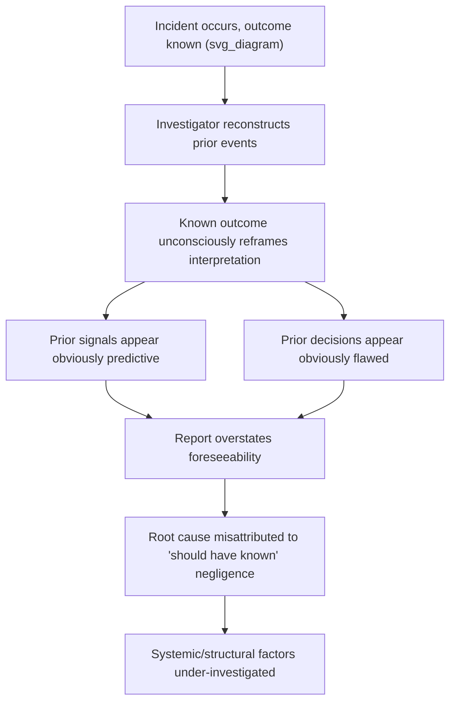
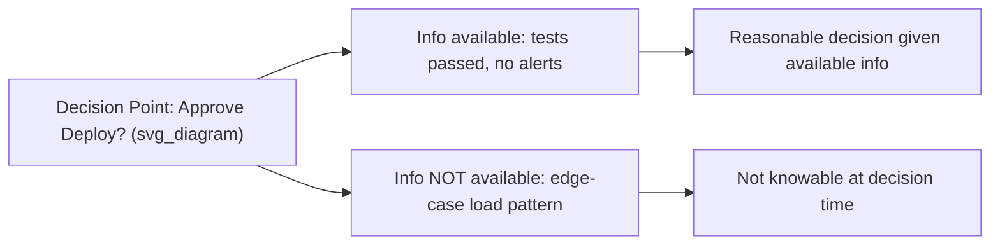

## Hindsight Bias and Outcome Knowledge Distortion

### Definition

**Hindsight bias** — often summarized as the "knew-it-all-along" effect — is the tendency, once an outcome is known, to perceive that outcome as having been predictable or even obvious *before* it occurred. In RCA, hindsight bias systematically distorts how investigators reconstruct the decisions, signals, and conditions that preceded an incident, because the investigation is always conducted *after* the outcome is already known.

**Outcome knowledge distortion** is the broader mechanism underlying hindsight bias: knowledge of how events turned out contaminates the evaluation of the decisions and information available *at the time*, making prior actions look more negligent or more obviously flawed than they actually were given the information available in the moment.

Formally, this is a failure to separate two distinct evaluative frames:

- **Ex ante** (before the outcome was known) — what was reasonable given the information, uncertainty, and constraints present *at the time*.
- **Ex post** (after the outcome is known) — what appears reasonable now, with full knowledge of the outcome and the causal chain that produced it.

RCA is inherently an ex post activity, which makes it structurally exposed to this distortion.

### The Psychological Mechanism

Hindsight bias operates through several documented sub-mechanisms:

1. **Memory reconstruction** — people unconsciously update their memory of what they "knew" or "expected" beforehand to be more consistent with the known outcome.
2. **Inevitability framing** — the causal chain leading to the incident is narrated as a deterministic sequence ("X was bound to cause Y") rather than as one possible path among many that could have unfolded differently.
3. **Foreseeability inflation** — signals that were ambiguous or low-salience at the time (e.g., a minor log warning) are retroactively treated as "clear warning signs that were missed," when in context they were one of hundreds of similarly ambiguous signals, most of which never precede an incident.

### Why This Is Especially Damaging in RCA

Hindsight bias does not just distort the *narrative* of an incident — it distorts the *conclusions*, which in turn distorts the *corrective actions*. Two failure modes result:

**1. Overattribution to individual error ("should have caught it")**

Once the outcome is known, a specific decision (e.g., approving a deployment, dismissing an alert) looks like an obvious mistake. But at the time, the engineer was evaluating that decision under uncertainty, alongside dozens of other similarly ambiguous signals that did *not* lead to incidents. Judging the decision by the outcome rather than by the information available at the time is sometimes called **outcome bias** — a closely related and often co-occurring distortion.

**2. Understating systemic and organizational factors**

Because a single "obvious" proximate trigger is identified in hindsight, the investigation stops there rather than asking why the system made that single point of failure possible in the first place (missing safeguards, ambiguous alert thresholds, absent runbooks, understaffed on-call rotations). This directly undermines the goal of RCA — finding *systemic* root causes rather than a scapegoat trigger.

### Distinguishing Hindsight Bias from Legitimate Retrospective Analysis

| Legitimate Retrospective Analysis | Hindsight-Biased Analysis |
| --- | --- |
| Evaluates decisions using only information available at the time | Evaluates decisions using full outcome knowledge |
| Treats ambiguous signals as ambiguous in context | Treats ambiguous signals as "clear warnings in hindsight" |
| Asks "was this a reasonable decision given the uncertainty?" | Asks "how could they not have seen this?" |
| Reconstructs the full distribution of possible outcomes at each decision point | Reconstructs only the single path that led to the actual outcome |
| Attributes causes to systemic conditions that made the error possible | Attributes causes to individual failure to predict the outcome |
| Uses the incident to improve signal quality/detection systems | Uses the incident to assign blame retroactively |

### Manifestations in RCA Practice

**1. "The logs clearly showed X" retrospective framing**

*Example:* A postmortem states "the error rate graph clearly showed an upward trend an hour before the outage." In reality, the graph showed normal noise-level fluctuation that only becomes visually "obvious" once you know where to look and what it eventually led to — dozens of similar fluctuations occur weekly without incident.

**2. Blaming the approver of a change**

*Example:* "The reviewer should have caught this bug in code review" ignores that the reviewer evaluated the diff under the same information constraints as any other review that week, none of which had visibly higher risk markers at review time.

**3. Ignoring near-misses and non-events**

Hindsight bias causes investigators to focus exclusively on the one instance where a condition led to failure, without checking how often the same condition occurred *without* incident — a critical denominator for assessing true foreseeability.

**4. Simplified causal narratives in postmortem documents**

Reports often present a single, clean "Root Cause → Effect" arrow, omitting the branching uncertainty and multiple viable paths that existed at each decision point, because the known outcome collapses the narrative into a single inevitable-seeming story.

### Mitigation Techniques

**1. Pre-mortem framing during interviews**

When interviewing individuals involved in the events leading to an incident, deliberately ask them to reconstruct their state of knowledge *at the time*, e.g., "What did you know at 2:00 PM, before the deploy, not what you know now?" This forces separation of ex ante from ex post reasoning.

**2. Base-rate comparison for "warning signs"**

For any signal flagged as a "missed warning," explicitly check its historical base rate: how often did this same signal occur *without* leading to an incident? A signal that occurs 200 times a month with only 1 incident has very low predictive/foreseeability value, regardless of how obvious it looks in hindsight.

**3. Decision-point reconstruction, not outcome-point reconstruction**

Structure the investigation around each decision point, documenting the full set of options and information available at that moment — not just the option that was chosen and its consequence.

**4. Use of "Safety-II" / resilience engineering framing**

Rather than only analyzing what went wrong, analyze how the system usually succeeds under similar conditions ("Safety-II" thinking, per Erik Hollnagel's resilience engineering framework), which surfaces why the same-looking signal normally does *not* lead to failure — reducing the sense of retrospective inevitability. [Inference: this framing is a widely cited approach in high-reliability-organization literature but its adoption varies significantly by industry and organization.]

**5. Blameless, structured postmortem templates**

Standardized templates that explicitly separate "timeline of events" from "contributing factors" from "systemic improvements" reduce the tendency to collapse everything into a single "obvious cause" narrative.

**6. Independent facilitator for postmortem meetings**

A facilitator not involved in the incident can redirect language that implies foreseeability ("they should have known") back toward information-available-at-the-time framing, and can explicitly ask "was this knowable at the time, or only in retrospect?"

**7. Explicit "counterfactual difficulty" documentation**

For each corrective action proposed, document how it would have needed to be different — e.g., "this requires a new alert threshold that did not exist" rather than implying the existing threshold should have obviously caught the issue.

### Worked Example

**Scenario:** A payment service experiences a 45-minute outage caused by a database migration that locked a critical table under high write load.

**Hindsight-biased postmortem:**

> "The migration script clearly should not have been run during peak hours. The engineer running the migration should have checked the traffic dashboard first. This was an easily avoidable human error."

This framing implies the engineer had an obvious, low-cost way to know the risk and simply failed to check — a conclusion only obvious *because* the outcome is known.

**Bias-mitigated postmortem:**

> "At the time of the migration, there was no documented policy requiring a peak-hours traffic check before running schema migrations, and no automated guardrail blocking migrations during high-write-load windows. The engineer had run 30+ similar migrations previously without this class of lock contention occurring, because table size and lock duration had not previously crossed the threshold that caused blocking under this specific write pattern. The systemic gap is the absence of (a) automated migration safety checks and (b) load-aware migration tooling — not an individual's failure to intuit an undocumented risk."

The second version identifies actionable systemic root causes (missing tooling, missing policy) rather than an individual "should have known" narrative that produces no durable fix.

### Relationship to Other Biases

- **Outcome bias** — judging the quality of a decision by its result rather than the information available when it was made; frequently co-occurs with and reinforces hindsight bias.
- **Confirmation bias** — once a "should have known" narrative forms, evidence is selectively gathered to support it (see the dedicated treatment of confirmation bias in RCA investigations).
- **Availability heuristic** — the single known outcome becomes cognitively dominant over the many unknown non-outcomes that also followed similar prior conditions.
- **Fundamental attribution error** — attributing the incident to individual disposition/carelessness rather than situational/systemic factors.

### Key Points

- Hindsight bias causes investigators to perceive a known outcome as having been more predictable and preventable than it actually was given information available at the time.
- This distortion typically manifests as overattributing incidents to individual "missed warning signs" or negligence, and underattributing them to systemic/structural gaps.
- The core mitigation is strict separation of ex ante (decision-time) and ex post (outcome-known) evaluation frames throughout the investigation.
- Base-rate analysis of "warning signals" is essential — a signal's foreseeability must be judged by how often it precedes incidents versus how often it doesn't, not by how it looks after the fact.
- Structured, blameless postmortem processes with independent facilitation substantially reduce hindsight-driven narrative distortion.

### Next Steps

- Confirmation bias in root cause investigations (closely related and often co-occurring)
- Outcome bias versus process-quality evaluation
- Blameless postmortem culture and psychological safety
- Safety-II and resilience engineering (Hollnagel)
- Fundamental attribution error in incident review
- Designing base-rate-aware alerting and signal thresholds
- Structured postmortem templates and facilitation practices