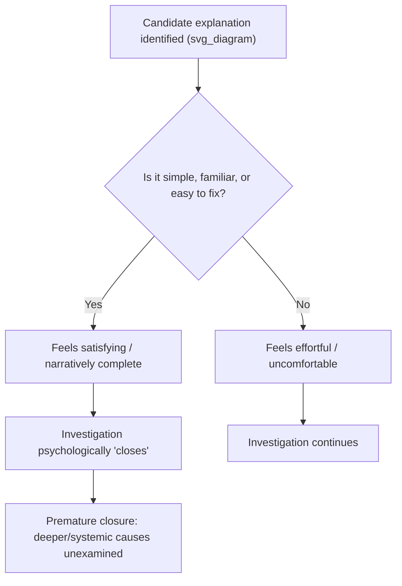
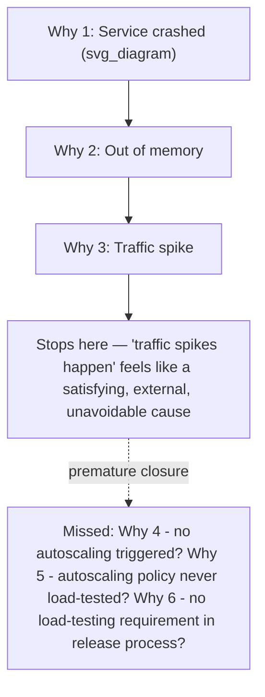

## Root Cause Seduction and Premature Closure

### Definition

**Root cause seduction** describes the phenomenon in which an investigator becomes psychologically committed to a particular explanation because it is elegant, simple, emotionally satisfying, or narratively compelling — independent of whether it is the most evidentially supported explanation. The "seduction" is the pull toward explanations that feel *good to arrive at* (a single clear villain, a tidy causal story, a fix that is easy to implement) rather than explanations that are merely *true*.

**Premature closure** is the resulting behavioral failure: the investigation is terminated once a plausible-sounding cause is identified, before alternative hypotheses have been adequately tested or ruled out, and before the causal chain has been traced to a level that is genuinely actionable.

These two concepts are tightly coupled — root cause seduction is the cognitive pull, premature closure is the procedural failure it produces. Together they represent one of the most common reasons RCA efforts fail to prevent recurrence.

### The Appeal of a "Satisfying" Root Cause

Certain classes of explanation are disproportionately attractive to investigators and stakeholders, regardless of their evidentiary strength:

- **Single-point explanations** — "it was that one bad config value" is easier to communicate and act on than "a combination of five marginal factors aligned."
- **Human-error explanations** — attributing the cause to a specific person's mistake provides narrative closure and a clear point of accountability, even when systemic factors were equally or more responsible.
- **Novel/recent-change explanations** — "it must be the thing that changed most recently" is intuitively appealing (and often correct) but can short-circuit investigation of other contributing factors.
- **Familiar/previously-seen explanations** — a cause similar to a past incident feels immediately credible because it pattern-matches prior experience.
- **Explanations with an easy fix** — if a candidate cause has a simple, low-cost remediation, there is organizational pressure (consciously or not) to accept it, because the alternative may require expensive, disruptive, or politically difficult structural change.

### Relationship to Other Investigative Pitfalls

Root cause seduction functions as an amplifier that interacts with several previously covered biases:

- It supplies the initial hypothesis that **confirmation bias** then defends.
- It is reinforced by **hindsight bias**, which makes the seductive explanation look more "obviously correct" after the fact than it was during the investigation.
- It is a special case of the **availability heuristic** — the most cognitively available explanation (recent, familiar, simple) is treated as the most probable one without evidentiary justification.
- It often produces **outcome bias** in reverse: because the fix "worked" (symptoms stopped), the explanation is retroactively validated even though the mechanism was never proven.

### Symptoms of Premature Closure

**1. Stopping the 5 Whys at a symptom, not a mechanism**

*Example:* "Why did the service go down? → Because it ran out of memory. Why did it run out of memory? → Because traffic spiked." Stopping here treats "traffic spiked" as the root cause, when the deeper systemic question — *why does a traffic spike, which is a normal and expected occurrence, cause an unrecoverable failure rather than graceful degradation?* — remains unasked. The real root cause may be the absence of autoscaling, backpressure, or circuit breaking.

**2. Accepting the first hypothesis that survives a cursory check**

*Example:* A single log line appearing to support a hypothesis is treated as sufficient confirmation, without checking whether that log line also appears routinely during normal operation (a base-rate check), and without testing competing hypotheses against the same evidence.

**3. Converging around the most senior or vocal opinion**

*Example:* A senior engineer proposes a plausible cause early in the incident review; the team consciously or unconsciously stops generating alternatives because dissenting further feels socially costly — a form of groupthink that accelerates premature closure.

**4. Closing the investigation once "the fix works"**

*Example:* A restart or rollback resolves the immediate symptom, and this operational success is treated as proof that the underlying hypothesis was correct — conflating symptom relief with causal validation. Many fixes work for reasons unrelated to the stated root cause (e.g., a restart may clear an unrelated resource leak that coincidentally aligns with the timing of the "fix").

**5. Treating "no further questions from stakeholders" as investigative completeness**

*Example:* A postmortem is considered "done" once it produces a report that satisfies organizational reporting requirements (a deadline, a template, a meeting), rather than once the causal chain is actually verified to an actionable and falsifiable level.

### The "5 Whys" Structural Vulnerability

The 5 Whys technique is particularly exposed to root cause seduction because of its linear, single-path structure. Each "why" typically produces only one answer before proceeding to the next level, so:

- An easy, socially comfortable, or first-available answer at any level determines the entire remaining chain.
- There is no built-in mechanism to branch, compare, or falsify alternative explanations at each level.
- The arbitrary stopping point (traditionally 5 iterations) is treated as inherently sufficient depth, when the actual number of "whys" needed to reach a systemic, actionable cause varies per incident — sometimes fewer, often more.

### Distinguishing a Legitimate Stopping Point from Premature Closure

| Legitimate Stopping Point | Premature Closure |
| --- | --- |
| The cause identified is actionable and within the organization's control | The cause identified is external, inevitable, or unowned ("traffic happens," "the internet is unreliable") |
| Further "whys" would leave the causal domain of the investigation (e.g., reaching outside organizational scope) | Further "whys" were simply not attempted |
| Multiple independent lines of evidence converge on the same explanation | A single piece of evidence was treated as sufficient |
| The explanation was tested against falsification (could this be wrong? how would we know?) | The explanation was accepted because no one objected |
| The fix directly addresses the verified mechanism | The fix addresses the symptom and "seems to have worked" |
| Systemic/process gaps that allowed the failure are identified, not just the triggering event | Only the triggering event is documented |

### Mitigation Techniques

**1. Mandatory "is this actionable and systemic?" checkpoint**

At each candidate stopping point in a Why-chain, require an explicit test: *Is this cause within our control to change? Does addressing it prevent this entire class of failure, or just this one instance?* If the answer to either is no, continue the chain.

**2. Require a minimum of two independently-derived corroborating evidence sources**

Before accepting any explanation as final, require evidence from at least two independent sources (e.g., logs *and* a reproduction test; a metric *and* a code review finding) rather than a single data point.

**3. Structured branching instead of linear chains**

As covered in the confirmation bias mitigation, force each "why" step to enumerate multiple candidate answers and explicitly rule out alternatives with evidence, rather than committing to the first plausible answer.

**4. "Second why-chain" exercise**

After reaching a stopping point via the 5 Whys, deliberately restart the chain from the same initial symptom but forbid using the first chain's chosen answer at each step — forcing an alternative causal path to be explored. Compare both chains before finalizing.

**5. Cost-of-fix independence check**

Explicitly separate "how easy is this to fix" from "how well-supported is this by evidence" in the postmortem discussion. A cause should not be favored merely because its proposed remediation is convenient.

**6. Explicit falsification requirement (shared with confirmation bias mitigation)**

Require every finalized root cause to be accompanied by a stated test that could have disproven it, and evidence that this test was actually run.

**7. Independent review / "cold read"**

Have someone uninvolved in the investigation read only the evidence (not the conclusion) and independently assess whether it supports the stated root cause, or whether alternative explanations remain equally plausible.

**8. Time-boxed "premature closure check-in"**

For significant incidents, schedule a deliberate pause partway through the investigation specifically to ask: "Are we closing on this because it's correct, or because it's comfortable/convenient/timely?"

### Worked Example

**Scenario:** A nightly batch job fails intermittently, corrupting a small percentage of records.

**Seduced/premature investigation:**

> "Why did records get corrupted? Because of a race condition in the job's parallel writer threads. Fix: add a mutex lock around the write operation." Investigation closes; the fix is deployed; corruption stops for several weeks.

This is satisfying — a specific, technical, easily-explained bug with a clean code fix. But the investigation never asked: *why did a race condition of this kind exist undetected in production for months? Why did code review not catch a shared-resource write without synchronization? Why does the test suite not include concurrency stress tests for this job?*

**Extended investigation avoiding premature closure:**

> Continuing the chain reveals that the team's code review checklist has no explicit concurrency-safety criterion, and the CI pipeline has no load/concurrency test stage for batch jobs — meaning this class of bug (not just this specific instance) can recur in any future job using the same pattern. The systemic fix (adding a concurrency-safety review checklist item and a concurrency test stage to CI) prevents the *category* of failure, not just this one instance.

Months later, without the extended fix, a similar race condition surfaces in a different job — the narrowly-scoped "satisfying" fix addressed only the specific symptom, not the systemic gap that made it possible.

### Key Points

- Root cause seduction is the psychological pull toward explanations that are simple, familiar, or easy to fix, independent of their actual evidentiary support.
- Premature closure is the procedural consequence: the investigation stops once a "good enough" explanation is found, rather than once the causal chain reaches a genuinely systemic and actionable level.
- The 5 Whys technique's linear structure makes it especially prone to this failure, since each level typically commits to a single answer without branching or falsification.
- A legitimate stopping point is characterized by actionability, systemic scope, and multiple corroborating evidence sources — not by the absence of further objections.
- Structured branching, mandatory falsification tests, cost-of-fix independence checks, and independent "cold reads" are the primary structural defenses against premature closure.

### Related Topics

- Confirmation bias in root cause investigations
- Hindsight bias and outcome knowledge distortion
- Structured/branching variants of the 5 Whys technique
- Analysis of Competing Hypotheses (ACH) methodology
- Groupthink and dissent suppression in incident review
- Systemic versus proximate cause classification
- Falsifiability as a criterion for valid root cause claims
- Blameless postmortem culture and its effect on investigative depth