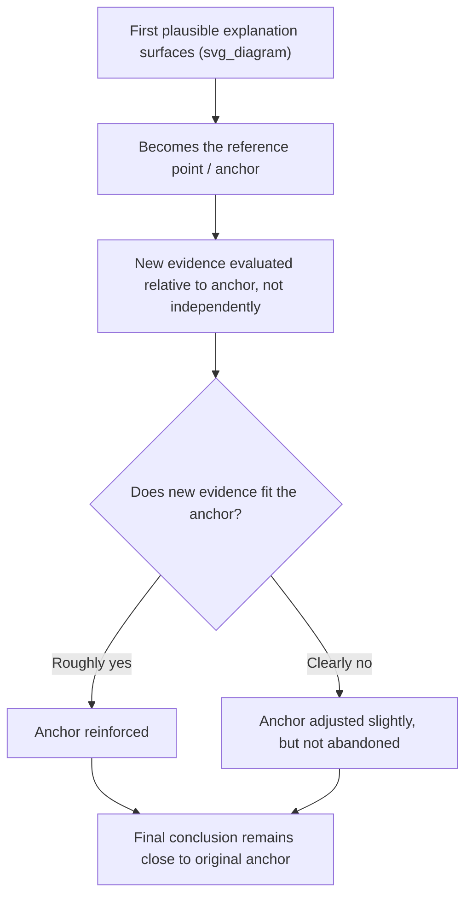

## Anchoring on the First Plausible Explanation

### Definition

**Anchoring bias** is the general cognitive tendency to rely disproportionately on the first piece of information encountered (the "anchor") when forming judgments, even when that information is arbitrary, incomplete, or later contradicted by better evidence. Applied specifically to RCA, **anchoring on the first plausible explanation** describes the pattern where the earliest hypothesis that seems reasonable — often generated within minutes of an incident starting — disproportionately shapes the entire remaining investigation, regardless of whether it was ever the strongest candidate among the available alternatives.

Critically, anchoring is distinct from root cause seduction and confirmation bias, though the three frequently co-occur:

- **Anchoring** is about *which* hypothesis gets disproportionate weight because of *when* it arrived (first), independent of how satisfying it is.
- **Root cause seduction** is about *why* a hypothesis is attractive (simple, familiar, easy to fix).
- **Confirmation bias** is about *how* evidence is subsequently gathered and interpreted once a hypothesis (anchored or not) is held.

Anchoring can occur even with an unsatisfying or uncomfortable hypothesis — the defining feature is simply that it arrived first and subsequent judgment is calibrated relative to it rather than independently.

### The Mechanism

Anchoring operates through an **insufficient adjustment** process: once an initial reference point is set, people adjust away from it when new evidence arrives, but the adjustment is typically too small — the final judgment remains pulled toward the anchor even after significant contradicting evidence has accumulated.

In incident response specifically, the anchor is often set within the first few minutes — sometimes by an offhand comment in a chat channel ("didn't we just deploy something?") — long before any systematic evidence review has occurred.

### Sources of Early Anchors in Technical Incidents

**1. The most recent change**

*Example:* Any deployment, config change, or infrastructure modification within the preceding hours becomes an instant anchor ("it must be the thing that changed"), which is a reasonable heuristic but can prevent consideration of pre-existing latent conditions that were merely triggered, not caused, by the recent change.

**2. The loudest or most visible alert**

*Example:* If a database CPU alert fires prominently while a subtler, earlier network packet-loss signal goes unnoticed, the CPU alert anchors the investigation even if it is a downstream symptom rather than the originating condition.

**3. The first responder's initial assessment**

*Example:* The engineer who first acknowledges the incident often posts an initial theory in the incident channel ("looks like it might be the cache layer") purely as a starting point for further investigation — but this provisional guess frequently calcifies into the team's working assumption for the remainder of the incident, cited and re-cited by later responders as if it were established fact.

**4. Historical precedent**

*Example:* "This looks like the outage we had in March" anchors the entire investigation to the March postmortem's conclusions, even when the current incident's symptoms only superficially resemble the prior one.

**5. Vendor or third-party status pages**

*Example:* A cloud provider's status dashboard showing "investigating elevated error rates" for an unrelated service becomes an anchor ("it's probably their outage, not ours"), delaying investigation of an internal cause that happens to coincide in time.

### Why Anchoring Persists Even With Contradicting Evidence

Anchoring is particularly resistant to correction because of several reinforcing dynamics:

- **Sunk cost of investigation effort** — once time has been invested pursuing the anchor (writing queries, checking dashboards specific to that theory), abandoning it feels like wasted effort, creating reluctance to pivot.
- **Communication cost** — in a live incident, an anchor is often communicated to stakeholders early ("we believe it's related to the recent deploy"); reversing this creates a perceived credibility cost, generating pressure to make the anchor "work" rather than admit it was wrong.
- **Partial evidence fit** — most incidents have some evidence that is at least loosely consistent with almost any reasonably plausible hypothesis, especially under time pressure when evidence review is shallow; this partial fit is enough to avoid triggering a full reassessment.
- **Coordination cost of reopening alternatives** — as more responders join an incident already anchored on a theory, each new person inherits and reinforces the existing frame rather than independently generating alternatives, compounding the anchor's grip.

### Distinguishing Reasonable Initial Hypotheses from Harmful Anchoring

| Reasonable Initial Hypothesis | Harmful Anchoring |
| --- | --- |
| Used to guide the *first* round of data collection | Used to interpret *all* data collection for the remainder of the investigation |
| Explicitly labeled as provisional/unconfirmed | Treated as established fact once stated aloud |
| Revisited and re-weighted as new evidence arrives | Adjustment to new evidence is minimal or absent |
| Coexists with actively-pursued alternative hypotheses | Alternatives are not seriously investigated in parallel |
| Abandoned promptly when directly contradicted | Persists despite direct contradiction, via reinterpretation |
| Cost of being wrong is treated as low (it's just a starting point) | Cost of being wrong feels high (credibility, sunk effort), creating resistance to reversal |

### Mitigation Techniques

**1. Explicit "working hypothesis" labeling**

Require any early theory to be explicitly flagged in incident channels as a **working hypothesis**, distinct from a **confirmed finding**, using consistent terminology (e.g., a required prefix like "HYPOTHESIS:" versus "CONFIRMED:") so that later responders do not inherit it as settled fact.

**2. Delayed hypothesis commitment for the lead investigator**

For non-time-critical (post-incident) RCA specifically, deliberately delay stating any single leading hypothesis until a baseline of evidence (timeline, logs, metrics across multiple systems) has been gathered — mirroring the "timeline-first, hypothesis-second" discipline used to counter confirmation bias.

**3. Parallel hypothesis generation before evidence review**

Before anyone examines dashboards or logs, have each team member independently (without discussing with others first) write down their own candidate explanation. This prevents the first person to speak from anchoring everyone else's independent judgment — a technique borrowed from structured forecasting and the **Delphi method**.

**4. Periodic anchor-reassessment checkpoints**

At fixed intervals during a live incident (e.g., every 15–20 minutes) or at defined stages of a post-incident investigation, explicitly ask: "If we were starting this investigation fresh right now, with everything we currently know, would we still pick this as our leading theory?"

**5. Assign an explicit "alternative hypothesis owner"**

Distinct from the devil's advocate role (used against confirmation bias), assign someone specifically responsible for generating and pursuing hypotheses *unrelated* to the current anchor, ensuring investigative bandwidth is not entirely consumed by the first theory.

**6. Track and weight evidence quality, not evidence order**

Maintain an explicit evidence log with timestamps of when each piece of evidence was found, separate from a running hypothesis-ranking — the ranking should be re-derived from the full evidence set at each review point, not updated incrementally in a way that continues to favor whichever theory was ranked first.

**7. Reduce social cost of hypothesis reversal**

Establish team norms (ideally documented in incident response playbooks) that explicitly frame hypothesis reversal as a sign of investigative rigor, not investigative failure — directly counteracting the communication-cost dynamic that entrenches anchors.

### Worked Example

**Scenario:** An API begins returning elevated 500 errors at 09:14. A deployment to an unrelated internal admin tool completed at 09:10.

**Anchored investigation:**

1. First responder notices the 09:10 deploy timestamp and posts: "Probably related to the 09:10 deploy."
2. Subsequent responders focus their log queries on the deployed service and its immediate dependencies.
3. A subtle but present signal — a certificate expiration warning on an internal load balancer, first appearing at 08:55 — is visible in the logs but not investigated, because attention is concentrated on the deploy-related theory.
4. The deploy is rolled back at 09:40; errors continue at the same rate, weakly contradicting the anchor.
5. Rather than abandoning the theory, the team hypothesizes a "partial rollback" or caching issue delaying the fix — reinterpreting the contradicting evidence to preserve the anchor.
6. Root cause is eventually found at 10:20 (the certificate expiration), 40 minutes after the disconfirming rollback evidence first appeared.

**Anchoring-mitigated investigation:**

1. First responder posts: "HYPOTHESIS (unconfirmed): possibly related to 09:10 deploy — investigating."
2. In parallel, a second responder is assigned to review all system health signals across the full stack in the 30 minutes preceding 09:14, independent of the deploy theory.
3. The certificate expiration warning is surfaced within the first 10 minutes as an equally-weighted alternative hypothesis.
4. Both hypotheses are tested in parallel: the deploy is rolled back (09:25) while the certificate is simultaneously checked.
5. Errors persist after rollback — immediately triggering an explicit checkpoint: "The deploy hypothesis is now contradicted; re-ranking hypotheses now favors the certificate signal."
6. Root cause (certificate expiration) confirmed and resolved by 09:35 — roughly 45 minutes faster than the anchored path, because the alternative hypothesis was already actively investigated rather than needing to be generated from scratch after disconfirmation.

### Relationship to Other Investigative Pitfalls

- **Confirmation bias** governs how evidence is treated *after* an anchor is set; anchoring governs *which* hypothesis becomes the reference point in the first place. They compound: an anchor supplies the hypothesis that confirmation bias then defends.
- **Root cause seduction** explains why certain anchors (simple, familiar, easy-to-fix) are especially sticky once anchored.
- **Hindsight bias** can retroactively make an anchored-but-wrong theory look like it was a "reasonable guess given what was known," obscuring how much investigative time was lost to insufficient adjustment.
- **Availability heuristic** frequently determines what becomes the anchor in the first place — the most recent or most memorable event is most likely to be proposed first.

### Key Points

- Anchoring bias causes the first plausible explanation encountered to disproportionately shape the rest of an investigation, regardless of its actual evidentiary strength relative to alternatives.
- The anchor is often set within minutes of an incident, frequently based on the most recent change, the loudest alert, or an offhand initial guess — long before systematic evidence review occurs.
- Anchors persist due to sunk-cost effects, communication/credibility costs, partial evidence fit, and inherited framing from later responders joining an already-anchored investigation.
- The key differentiator from a reasonable initial hypothesis is whether the theory remains explicitly provisional, is actively weighed against alternatives, and is promptly abandoned when directly contradicted.
- Mitigation relies on structural techniques: explicit hypothesis labeling, parallel independent hypothesis generation, periodic reassessment checkpoints, and team norms that reduce the social cost of reversing an early theory.

### Related Topics

- Confirmation bias in root cause investigations
- Root cause seduction and premature closure
- Hindsight bias and outcome knowledge distortion
- Availability heuristic in incident triage
- Delphi method and structured forecasting techniques
- Parallel hypothesis tracking / Analysis of Competing Hypotheses (ACH)
- Incident response playbooks and hypothesis-labeling conventions
- Sunk cost fallacy in ongoing technical investigations