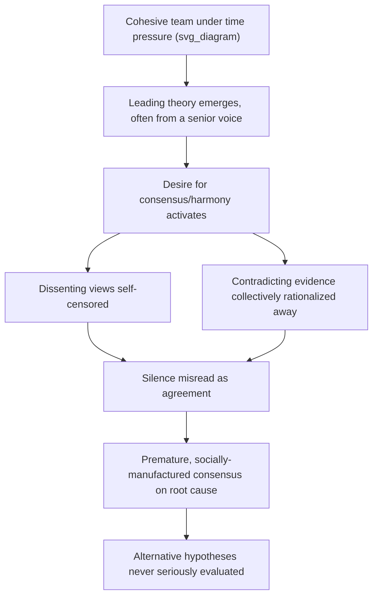

## Groupthink in Team-Based Investigations

### Definition

**Groupthink**, a term coined by psychologist Irving Janis in 1972, describes a mode of thinking that occurs within cohesive groups when the desire for consensus and harmony overrides the members' motivation to realistically evaluate alternative courses of action. In the context of RCA, groupthink manifests as a team-based investigation converging prematurely on a shared conclusion not because the evidence strongly supports it, but because social pressures — the desire to agree, avoid conflict, defer to authority, or maintain team cohesion — suppress critical evaluation and dissent.

Groupthink is distinct from the individually-scoped biases covered previously (confirmation bias, hindsight bias, anchoring): those describe distortions within a single investigator's reasoning. Groupthink is an *emergent, social-level* phenomenon that arises specifically from group dynamics and can occur even when individual members privately hold doubts.

### Janis's Core Symptoms, Applied to RCA

Janis identified eight classic symptoms of groupthink. Mapped onto technical incident investigation:

| Symptom | RCA Manifestation |
| --- | --- |
| Illusion of invulnerability | "Our review process is thorough, so if the team agrees, it must be right" |
| Collective rationalization | Dismissing contradicting data as "probably a monitoring artifact" as a group, without individual verification |
| Belief in inherent morality of the group | "We're a strong engineering team, we wouldn't miss something obvious" — discouraging self-scrutiny |
| Stereotyping outsiders/dissenters | Treating a dissenting junior engineer's alternative theory as naive or uninformed without evaluating it |
| Direct pressure on dissenters | A team lead visibly frowning or redirecting when someone raises a contrary point, discouraging further pushback |
| Self-censorship | An engineer with doubts about the leading theory stays silent rather than risk seeming disruptive or unprepared |
| Illusion of unanimity | Silence is interpreted as agreement, when it may reflect self-censorship, not genuine consensus |
| Self-appointed "mindguards" | A senior member steers the conversation away from lines of inquiry that might contradict the emerging consensus, often with good intentions (efficiency, avoiding "going down rabbit holes") |

### Why RCA Teams Are Structurally Vulnerable

Several features of typical incident review and postmortem processes increase groupthink risk beyond baseline group settings:

- **Time pressure** — live incidents demand fast alignment, leaving little room for the friction of structured dissent.
- **Status hierarchies** — postmortems frequently include engineers of varying seniority; junior members are statistically less likely to openly contradict a senior engineer's stated theory.
- **High cohesion / familiarity** — teams that work closely together, which is generally valuable for collaboration, are specifically the condition Janis identified as most susceptible to groupthink, because social cohesion itself is the driving variable.
- **External pressure to resolve quickly** — leadership or customers awaiting an explanation creates pressure toward *any* consensus over a *correct* one.
- **Blame-sensitive culture** — in non-blameless environments, dissenting from a consensus that avoids implicating any one person's work can carry a social cost, incentivizing convergence on an externally-attributed or diffuse cause.
- **Physical/virtual meeting dynamics** — in synchronous meetings (especially video calls), the first strong opinion voiced tends to dominate the floor, and turn-taking norms rarely surface quiet disagreement without deliberate facilitation.

### Groupthink vs. Legitimate Team Consensus

| Legitimate Consensus | Groupthink-Driven Consensus |
| --- | --- |
| Reached after all members have independently stated a view | Reached after only the first/loudest view is discussed |
| Dissenting views were actively solicited | Dissenting views were never explicitly asked for |
| Disagreement was evaluated on evidence, not deferred to seniority | Disagreement deferred to whoever has the most authority/experience |
| Silence was checked ("does anyone see this differently?") rather than assumed to mean agreement | Silence assumed to mean agreement |
| Alternative hypotheses were documented even if not selected | No record exists that alternatives were ever considered |
| The process would tolerate a "no, I don't think so" without social cost | Disagreement is implicitly or explicitly discouraged |

### Manifestations in RCA Practice

**1. The "senior engineer says" effect**

*Example:* A staff engineer states in the first five minutes of a postmortem meeting, "I think this is a scaling issue," and no further alternative hypotheses are seriously raised for the remainder of the 45-minute meeting, despite two junior engineers privately having noted an unrelated configuration anomaly in the pre-meeting chat.

**2. False unanimity from meeting silence**

*Example:* A facilitator asks "does everyone agree this is the root cause?" and receives no verbal objection — interpreted as full agreement — when in fact two attendees had unaddressed questions they did not feel comfortable raising in the large group setting.

**3. Suppression of the "annoying" thorough investigator**

*Example:* A team member who insists on continuing to verify a hypothesis after most of the team is satisfied is subtly socially discouraged ("we already know it's X, let's move on") — even when their additional check would have surfaced disconfirming evidence.

**4. Convergence accelerated by external stakeholders**

*Example:* A leadership request for "a root cause and fix by end of day" pressures the team to converge on *a* conclusion rather than *the correct* conclusion, with groupthink providing the psychological path of least resistance to reach consensus quickly.

**5. In-group protective rationalization**

*Example:* When evidence suggests the team's own architecture decision contributed to the incident, the group collectively gravitates toward an external or upstream explanation (a third-party outage, "unusual" customer behavior) that does not implicate the team's own design choices.

### Mitigation Techniques

**1. Structured, anonymous initial hypothesis collection**

Before any group discussion begins, collect each team member's independent hypothesis via an anonymous or asynchronous channel (a shared document, a poll, written submissions). This surfaces the true range of views before status hierarchy or first-mover framing can suppress them — directly analogous to the **Delphi method** used in structured forecasting.

**2. Explicit designated dissenter / "red team" role**

Formally assign a rotating team member each investigation to argue against the emerging consensus, regardless of their personal view — removing the social risk of *spontaneous* dissent by making structured dissent an expected part of the process, not a deviation from it.

**3. Facilitator-enforced round-robin input**

Rather than open-floor discussion (which favors the first/loudest voice), a facilitator explicitly goes around the group and solicits each individual's view before any synthesis or consensus-building begins.

**4. Seniority-blind evidence review**

Where feasible, present evidence and candidate hypotheses without attribution to who proposed them, so evaluation is based on the argument's merit rather than the proposer's status — reducing deference-driven convergence.

**5. Explicit "silence ≠ agreement" norm**

Facilitators explicitly ask, rather than assume: "I want to hear if anyone sees this differently, even a minor doubt — silence will be treated as 'I haven't fully thought this through yet,' not as agreement." Direct, individually-addressed follow-up questions ("[Name], any concerns from your side?") surface latent disagreement more reliably than open questions to the group.

**6. Second, independent reviewing group**

For significant incidents, have a *separate* team or individual — with no involvement in the original investigation or its internal group dynamics — review the evidence and conclusion independently before it is finalized, functioning as an external check on the primary group's internal consensus.

**7. Documented alternative hypotheses requirement**

Require every RCA report to explicitly list hypotheses that were considered and why they were ruled out — this creates an artifact-level forcing function that makes it visible (and reviewable) whether genuine alternative consideration occurred or whether the group converged immediately on a single theory.

**8. Psychological safety as a precondition**

Groupthink is substantially reduced in teams with high **psychological safety** (per Amy Edmondson's research) — an environment where team members believe they can raise concerns, admit uncertainty, or disagree without interpersonal risk. This is a cultural precondition that structural techniques alone cannot fully substitute for. [Inference: while psychological safety is broadly supported in organizational research as reducing groupthink-like suppression, the degree of effect varies by team and organizational context and is not fully quantifiable as a general rule.]

### Worked Example

**Scenario:** A checkout failure incident is being reviewed by a team of six, including one staff engineer and two recently onboarded engineers.

**Groupthink-affected investigation:**

1. The staff engineer opens with, "This has the signature of the caching bug we saw last quarter."
2. The team nods; discussion proceeds to confirm this theory using cache-related logs.
3. One newer engineer privately notices the failure timestamps don't align well with the cache invalidation schedule, but does not raise it, uncertain whether their read of the system is correct and reluctant to contradict the senior engineer's confident opening statement.
4. The meeting concludes with "caching bug (recurrence)" as the documented root cause; the fix (adjusting a cache TTL) is applied.
5. Weeks later, the same failure recurs; the true cause (a race condition in an unrelated order-processing queue) is eventually found, and the earlier consensus is revealed to have been socially, not evidentially, reached.

**Groupthink-mitigated investigation:**

1. Prior to the meeting, all six team members submit their initial hypothesis anonymously in a shared document.
2. Three distinct hypotheses emerge, including the newer engineer's timestamp-misalignment observation, now visible without attribution.
3. The facilitator presents all three hypotheses to the group without indicating who proposed which, and the group evaluates each against the evidence in turn.
4. The timestamp-misalignment hypothesis prompts further investigation into the order-processing queue, which is ultimately confirmed as the actual root cause.
5. The final report documents all three hypotheses and the evidence that ruled out the two incorrect ones, creating a reviewable record of genuine alternative consideration.

### Relationship to Other Investigative Pitfalls

- **Anchoring** often supplies the specific theory around which groupthink converges — whoever speaks first sets the anchor that the group's desire for consensus then locks onto.
- **Confirmation bias** operates at the individual level once groupthink has established a shared theory; the group collectively seeks confirming evidence for the socially-endorsed conclusion.
- **Root cause seduction** makes certain group-endorsed explanations especially sticky, since a simple, comfortable explanation is also the one least likely to generate social friction by contradicting it.
- **Hindsight bias** can later make the group's converged-upon (but incorrect) explanation seem like it was obviously reasonable at the time, obscuring that dissent was actually present but suppressed.

### Key Points

- Groupthink is a social/group-level phenomenon distinct from individual cognitive biases, arising when the desire for consensus and harmony suppresses critical evaluation and dissent.
- RCA teams are structurally vulnerable due to time pressure, status hierarchies, high team cohesion, and blame-sensitive cultures.
- Key symptoms include self-censorship of dissenting views, mistaking silence for agreement, collective rationalization of disconfirming evidence, and deference to senior voices over evidence.
- The core differentiator from legitimate consensus is whether dissent was actively solicited and evaluated on merit, versus simply absent or suppressed.
- Effective mitigations include anonymous initial hypothesis collection, formally assigned dissenter roles, seniority-blind evidence review, and independent second-group review — underpinned by a broader culture of psychological safety.

### Related Topics

- Anchoring on the first plausible explanation
- Confirmation bias in root cause investigations
- Psychological safety in engineering teams (Amy Edmondson)
- Delphi method and anonymous structured forecasting
- Blameless postmortem culture
- Facilitation techniques for incident review meetings
- Analysis of Competing Hypotheses (ACH) methodology
- Status hierarchy effects on technical decision-making