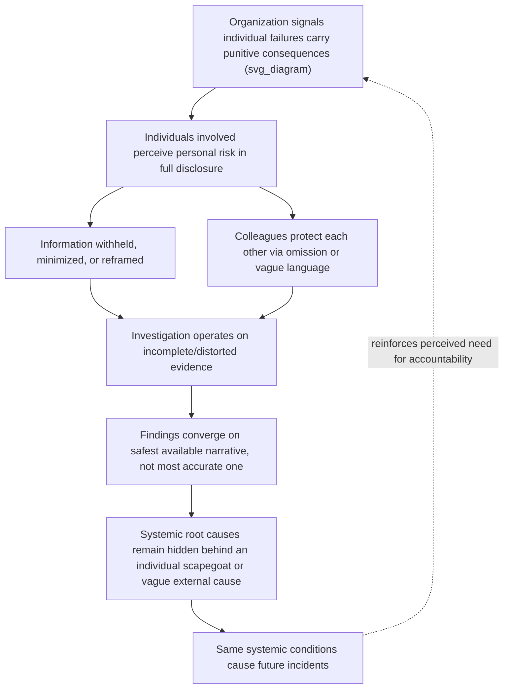

## Blame Culture and Its Distorting Effect on Findings

### Definition

**Blame culture** refers to an organizational environment in which the primary response to failure is to identify and hold accountable the individual(s) perceived as responsible, often accompanied by disciplinary, reputational, or career consequences. In the context of RCA, blame culture does not merely coexist with an investigation — it actively distorts the investigation's process and conclusions, because participants (both the potentially-blamed individuals and their colleagues) are incentivized to shape the narrative toward self-protection rather than toward evidentiary accuracy.

This distinguishes blame culture from the previously covered cognitive biases, which are largely unconscious distortions of reasoning. Blame culture introduces **motivated reasoning under incentive pressure** — participants may be partially or fully aware that the investigation is being shaped, but organizational, social, or career incentives make honest disclosure costly, producing systematically biased findings even when individual investigators are acting rationally given their incentives.

### The Causal Mechanism

This forms a self-reinforcing cycle: each incident attributed to individual fault (rather than the systemic conditions that made the individual action possible or likely) reinforces the organizational belief that individual accountability is the correct lens, justifying further blame-oriented responses to the next incident.

### Two Distinct Distortion Patterns

Blame culture does not distort findings in a single direction — it produces two opposing, context-dependent failure modes:

**1. Scapegoating — blame concentrated onto an individual**

*Example:* An engineer who executed a database migration during an outage is formally cited as "the cause" in the postmortem, even though the migration was approved through the standard process, no policy prohibited peak-hours migrations, and the team's tooling provided no warning. The individual becomes the documented root cause because it produces a clean, closeable narrative and satisfies organizational pressure for accountability — while the systemic gaps (missing tooling, missing policy) that actually made the failure possible go unaddressed.

**2. Diffusion — blame deliberately spread thin or externalized**

*Example:* In a team culture where any individual attribution is reflexively resisted (sometimes as an overcorrection to prior scapegoating), findings are phrased so vaguely ("a combination of factors contributed") that no specific, actionable causal mechanism is ever identified, and no concrete corrective action follows. This is distinct from a *legitimately* systemic finding — the diffusion pattern uses vagueness specifically to avoid any conclusion that could be traced back to a decision, team, or process owner who might feel implicated.

Both patterns share the same root distortion: **the investigation's stopping point and framing are determined by social/political safety, not by evidentiary completeness.**

### Manifestations in RCA Practice

**1. Selective omission in interviews**

*Example:* An engineer being interviewed about an incident omits that they bypassed a code review step under time pressure, because disclosing this could result in disciplinary action, leaving the investigation without a critical piece of the causal chain.

**2. Defensive framing in written reports**

*Example:* A report states "the deployment process allowed this change to reach production" (passive, systemic framing) rather than "the on-call engineer approved a deployment without running the required test suite" (specific, individual framing) — not because the passive framing is more accurate, but because it is less personally exposing for whoever wrote or reviewed the report.

**3. Reluctance to name specific decisions in meetings**

*Example:* During a postmortem meeting, participants avoid stating "X decided to skip the canary rollout stage," instead using diffuse language like "the canary stage was skipped" — obscuring who made the decision and why, which may itself be important root-cause information (e.g., was there pressure from a manager to skip it for a deadline?).

**4. Self-censorship extending beyond the directly involved individual**

*Example:* A colleague who witnessed a risky shortcut being taken does not mention it in the investigation, not because they personally fear blame, but because they do not want to implicate a teammate — producing the same evidentiary gap as if the information genuinely did not exist.

**5. Management-driven narrative pressure**

*Example:* A manager, anticipating how a finding will be received by their own leadership, subtly steers the investigation toward conclusions that reflect well on their team or organization, independent of the individual contributors' own honesty.

**6. "Vague enough to be safe" corrective actions**

*Example:* A corrective action is recorded as "improve communication between teams" — a statement too unspecific to be implemented, verified, or later audited for completion — because a more specific action (e.g., "Team A must notify Team B before any schema change") would explicitly assign a systemic gap to a particular team.

### Distinguishing Legitimate Accountability from Blame Culture Distortion

Accountability itself is not the problem — clear ownership of corrective actions is essential for RCA to produce durable improvement. The distortion specifically arises when the *threat* of personal consequence for disclosure shapes what evidence surfaces and how findings are framed.

| Healthy Accountability | Blame Culture Distortion |
| --- | --- |
| Individuals disclose actions/decisions fully, including mistakes, without fear of punitive consequence | Individuals withhold or reframe information to avoid personal risk |
| Root cause findings can name specific decisions and their context without assigning personal blame | Findings either scapegoat an individual or become vague specifically to avoid implication |
| Corrective actions are specific and assigned to a role/process owner | Corrective actions are vague enough to avoid pointing at any specific team or decision |
| The question asked is "what needs to change so this class of failure can't happen again?" | The question effectively asked is "who is responsible, and how do we manage the consequence?" |
| Psychological safety allows admitting uncertainty or error during the investigation itself | Participants perform certainty or deflect uncertainty to avoid appearing at fault |

### The Distinction from "Blameless" as a Slogan

It is worth noting explicitly that declaring a postmortem "blameless" in name does not automatically eliminate blame culture's distorting effects. If the broader organizational incentive structure (performance reviews, promotion criteria, management response patterns) still attaches real consequences to being named in a postmortem, individuals will rationally continue to under-disclose regardless of the stated meeting norms. **Blameless postmortem practice is a process design; blame culture is an organizational incentive structure — the former can only be effective if it is backed by the latter being genuinely absent.** [Inference: this gap between stated policy and lived incentive structure is widely discussed in the site-reliability and safety-engineering literature, though the degree of gap varies significantly across organizations and is difficult to measure directly.]

### Mitigation Techniques

**1. Explicit organizational commitment to blameless investigation, backed by policy**

The commitment must extend beyond the postmortem meeting itself to performance review processes, ensuring that being named or involved in an incident's causal chain is explicitly excluded from negative performance evaluation, and this exclusion is communicated and consistently honored over time — not merely stated once.

**2. Separate the investigation function from the disciplinary function**

Where an individual's conduct genuinely does warrant separate review (e.g., a policy violation unrelated to the technical root cause), that review should be structurally and procedurally separate from the RCA investigation, so participants in the RCA are not implicitly being asked to build a disciplinary case against themselves or colleagues.

**3. Focus report language on decisions and conditions, not people**

Adopt a consistent reporting convention that describes *what happened and under what conditions* rather than *who did what* — e.g., "the deployment was approved under a policy that did not require a peak-hours traffic check" rather than naming the approver — while still preserving enough specificity that the systemic gap is clearly actionable.

**4. Anonymize or aggregate sensitive disclosure where appropriate**

For information likely to trigger defensive withholding (e.g., "did you feel rushed or pressured?"), consider anonymous or aggregated collection methods (surveys, written submissions reviewed by a neutral facilitator) rather than requiring real-time, attributable disclosure in a group meeting.

**5. Train facilitators to actively de-personalize discussion**

A skilled facilitator redirects blame-oriented language in real time (e.g., reframing "why did you skip the test?" to "what made skipping the test feel like the right call at the time, and what would need to be true for that decision to be different next time?") — directly counteracting the hindsight-bias-driven "should have known" framing that often accompanies blame.

**6. Require specificity in corrective actions as a structural check**

Mandate that every corrective action include a named owner, a concrete deliverable, and a verification method. This structural requirement makes the "vague enough to be safe" diffusion pattern immediately visible and harder to submit as a completed finding, since vague actions cannot satisfy the completion criteria.

**7. Track long-term incident recurrence as a culture health signal**

If the same class of incident recurs repeatedly despite "resolved" postmortems, this is a strong indicator that findings are being distorted toward safe-but-shallow conclusions rather than genuine systemic causes — recurrence rate can serve as an indirect, outcome-based metric for whether blame culture is compromising investigation quality. [Inference: recurrence rate is a reasonable proxy signal but is confounded by many other factors (system complexity, change rate) and should not be treated as a precise or sole measure of blame culture's presence.]

### Worked Example

**Scenario:** A production incident is traced to a manual database change made outside of the standard deployment pipeline.

**Blame-culture-distorted investigation:**

> The report states: "The incident was caused by [Engineer Name] making an unauthorized manual database change." The engineer, aware that this framing could affect their upcoming performance review, does not disclose that they had raised concerns about the pipeline's inability to handle this type of change two weeks earlier, and that a manager had verbally approved the manual workaround as a stopgap under a deadline. This context — arguably the actual systemic root cause — never enters the record. The corrective action is simply "reminder to follow standard deployment process," which does not address the underlying pipeline limitation or the pressure dynamics that led to the workaround.

**Blame-culture-mitigated investigation:**

> The report states: "A manual database change was made outside the standard pipeline due to a known limitation in the pipeline's handling of [specific change type], which had been flagged two weeks prior. Under deadline pressure, a manual workaround was used as an accepted stopgap, without an accompanying safety check that the standard pipeline would have enforced." The engineer felt safe disclosing the full context, including the prior manager approval, because the investigation's stated and lived purpose was understood to be systemic improvement, not individual attribution. Corrective actions specifically target the pipeline limitation and establish a formal stopgap-approval process that includes the missing safety check — addressing the actual systemic root cause.

### Relationship to Other Investigative Pitfalls

- **Root cause seduction** is compounded by blame culture: scapegoating a single individual is often the most narratively "satisfying" and organizationally convenient explanation, making it doubly attractive.
- **Hindsight bias** frequently supplies the justification for blame ("they should have known better"), which blame culture then converts into a documented, consequential finding rather than a distorted retrospective judgment.
- **Groupthink** can be actively weaponized or reinforced by blame culture, as teams converge on a consensus narrative specifically because it is the "safest" collectively agreed story, independent of accuracy.
- **Confirmation bias** may be directed not just at technical hypotheses but at a preferred *social* narrative — e.g., investigators may selectively notice evidence supporting "it was an individual mistake" over "it was a process gap," depending on organizational incentive.

### Key Points

- Blame culture distorts RCA findings through incentive-driven motivated reasoning, not merely unconscious cognitive bias — participants withhold, reframe, or minimize disclosure because of real or perceived personal consequences.
- Two opposing distortion patterns result: scapegoating (blame concentrated on an individual to produce a closeable narrative) and diffusion (findings kept deliberately vague to avoid implicating anyone).
- The distinguishing factor from healthy accountability is whether disclosure and framing are shaped by personal risk avoidance rather than evidentiary completeness.
- A "blameless" postmortem meeting format is insufficient on its own; it must be backed by genuine organizational incentive structures (performance review policy, disciplinary separation) to actually change disclosure behavior.
- Structural mitigations include separating investigation from disciplinary process, decision-focused (not person-focused) report language, anonymized sensitive disclosure channels, and mandatory specificity in corrective actions.

### Related Topics

- Blameless postmortem culture and psychological safety
- Hindsight bias and outcome knowledge distortion
- Groupthink in team-based investigations
- Root cause seduction and premature closure
- Systemic versus individual root cause classification
- Just Culture frameworks (Sidney Dekker) in safety-critical industries
- Corrective action tracking and verification practices
- Organizational incentive design and its effect on incident transparency