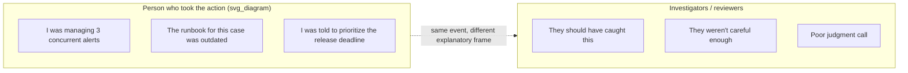
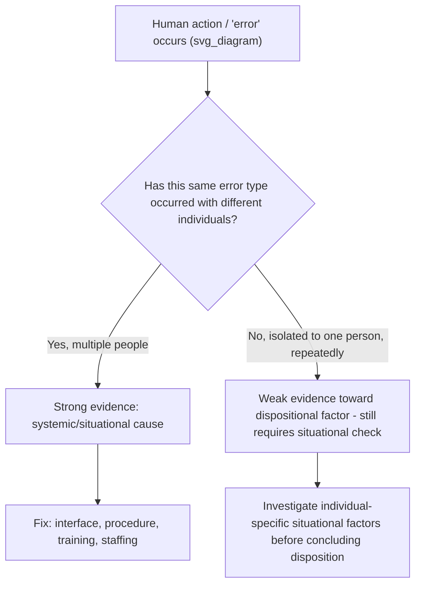

## Fundamental Attribution Error in Human Factor Causes

### Definition

The **fundamental attribution error** (FAE), first characterized by psychologist Lee Ross in 1977, is the pervasive tendency to overemphasize dispositional (personality- or character-based) explanations for another person's behavior while underemphasizing situational (contextual, environmental, systemic) explanations. Applied to RCA, FAE causes investigators to attribute human-involved incidents to traits of the individual — carelessness, incompetence, poor judgment — rather than to the situational and systemic conditions (workload, tooling, time pressure, unclear procedures, conflicting incentives) that shaped the individual's behavior in that moment.

FAE is distinct from blame culture, though the two compound each other: blame culture is an *organizational incentive structure* that pressures people to withhold information or scapegoat; FAE is a *cognitive default* that occurs even in the absence of any punitive incentive, purely because dispositional explanations are cognitively more available and narratively simpler than situational ones. FAE can therefore distort findings even in a genuinely blameless, psychologically safe environment, making it a persistent pitfall requiring its own deliberate countermeasures.

### The Actor-Observer Asymmetry

FAE is closely tied to the **actor-observer asymmetry**: when explaining *our own* behavior, we tend to cite situational factors ("I missed the alert because I was juggling three other incidents"), but when explaining *someone else's* identical behavior, we tend to cite dispositional factors ("they missed the alert because they weren't paying attention"). This asymmetry means that in a team-based RCA, the person whose actions are under the most scrutiny experiences the incident very differently (situationally) than their colleagues and reviewers, who see only the outcome and default to a dispositional read.

### Why RCA Is Especially Vulnerable to FAE

**1. Investigators observe only the outcome, not the full situational context**

By the time an RCA reviews a "human error," the reviewer typically sees a log entry, a decision, or an action stripped of the surrounding context — competing priorities, ambiguous information, fatigue, unclear ownership — that shaped why that action seemed reasonable at the time. Without deliberately reconstructing that context, the default explanatory frame collapses to disposition ("they made a mistake").

**2. Hindsight bias directly feeds FAE**

As covered in the treatment of hindsight bias, knowledge of the outcome makes a decision look more obviously wrong than it was under the original uncertainty — and "obviously wrong in retrospect" is readily reinterpreted as "should have known better," which is a dispositional judgment about the individual's competence or attentiveness rather than a situational judgment about the information environment.

**3. Systemic factors are less visible and more effortful to trace**

Identifying that "the on-call rotation left this engineer covering an unfamiliar system with no updated runbook" requires investigating scheduling history, documentation currency, and training records — meaningfully more investigative effort than simply noting "the engineer made an incorrect judgment call." FAE is partly an artifact of cognitive economy: dispositional explanations are cheaper to reach.

**4. Language defaults reinforce dispositional framing**

Common incident-review phrasing — "human error," "operator mistake," "failed to follow procedure" — is inherently dispositional in structure, framing the person as the causal unit, even when the intent is descriptive rather than evaluative.

### Manifestations in RCA Practice

**1. "Operator error" as a terminal finding**

*Example:* A postmortem concludes "the on-call engineer entered the wrong command" without further investigation into why the command interface made that error easy to make (e.g., two visually similar commands with destructive versus safe effects, no confirmation prompt for the destructive one). This is the human-factors equivalent of the "premature closure" pattern — stopping at the human action rather than continuing to ask why the environment made that action likely.

**2. Selective scrutiny of the individual's competence**

*Example:* Following an incident, colleagues informally discuss whether the involved engineer is "reliable" or "detail-oriented enough," rather than discussing whether the system design made a slip statistically likely for *any* engineer under those conditions — an FAE-driven shift from situational to dispositional framing at the social level, independent of the formal report's language.

**3. Ignoring workload and fatigue as systemic factors**

*Example:* An engineer who missed a critical alert had been on-call continuously for 30 hours due to a colleague's illness; the postmortem does not examine on-call scheduling policy as a contributing factor, focusing instead on "the alert was missed" as an isolated dispositional lapse.

**4. Treating procedure deviation as inherently a character flaw**

*Example:* "The engineer deviated from the runbook" is recorded without investigating whether the runbook was itself outdated, contradictory, or impractical to follow under the actual conditions encountered — situational information that would reframe the deviation as a reasonable adaptation rather than a lapse in discipline.

**5. Underweighting design and interface factors**

*Example:* A configuration error is attributed to "insufficient attention to detail" rather than to a configuration interface that presents dangerous and safe options with visually identical styling and no differentiated confirmation flow — a classic human-factors/usability root cause that FAE causes investigators to overlook in favor of blaming the individual's carelessness.

### The Human Factors / Safety Engineering Counter-Framework

Human factors engineering and resilience engineering (drawing on aviation and industrial safety research, notably Sidney Dekker's work on "Just Culture" and James Reason's "Swiss Cheese Model") explicitly reframe human error as a *symptom* of systemic conditions rather than a root cause in itself. This tradition provides RCA with structured questions designed specifically to counteract FAE:

- **Was the action a reasonable response given the information, training, and tools available at the time?**
- **Would a similarly trained person, in the same situation, likely have made the same choice?**
- **What in the system (interface, procedure, staffing, incentive) made this error possible or likely, rather than merely possible in the abstract?**
- **Is this the first time this class of error has occurred, or does it recur across different individuals?** — recurrence across different people is strong evidence the cause is situational/systemic, not dispositional, since it is unlikely that many different individuals independently share the same character flaw.

Notably, even in the "isolated to one individual, repeatedly" branch, a rigorous investigation still checks for individual-specific situational factors (e.g., consistently assigned to the most ambiguous edge cases, inadequate onboarding for that specific person) before concluding a dispositional explanation — because even repeated individual involvement can have a situational explanation.

### Distinguishing Legitimate Individual Factors from FAE Distortion

It would be its own error to claim that individual factors are *never* relevant — skill gaps, training needs, and occasionally genuine negligence are real and sometimes require individual-level corrective action (e.g., additional training, closer initial supervision). FAE is not the claim that individual factors are always irrelevant; it is the *default, unexamined* preference for dispositional explanation without situational investigation.

| Legitimate Individual-Level Finding | FAE-Distorted Finding |
| --- | --- |
| Reached only after situational factors were explicitly investigated and ruled insufficient | Reached as the default first explanation without situational investigation |
| Distinguishes a specific, addressable skill/knowledge gap (e.g., "not yet trained on this subsystem") | Uses vague character language ("careless," "not detail-oriented") |
| Corrective action is proportionate and constructive (targeted training, updated onboarding) | Corrective action is punitive or purely cautionary ("be more careful next time") |
| Checked against recurrence across other individuals in similar conditions | Not checked against whether other people would likely make the same choice |
| Coexists with system-level findings, not instead of them | Substitutes for system-level findings, closing the investigation |

### Mitigation Techniques

**1. Mandatory situational reconstruction before dispositional conclusion**

Require every RCA involving a human action to explicitly document the situational context — concurrent workload, information available, time pressure, procedural clarity, prior training — *before* any conclusion about the individual's judgment is finalized. This mirrors the "decision-point reconstruction" technique used against hindsight bias, applied specifically to human-factors findings.

**2. The "would a reasonable person" test**

Explicitly ask: "Given the same information, training, and time pressure, would most similarly-situated team members likely have made the same choice?" If the honest answer is yes, the finding should be reframed as systemic (the situation made this choice likely for anyone), not dispositional (this person specifically erred).

**3. Ban vague dispositional language in written reports**

Institute a reporting convention that disallows terms like "careless," "should have paid more attention," or "human error" as terminal findings, requiring instead a specific description of the situational or systemic condition that shaped the action (e.g., replace "operator error" with "the interface allowed a destructive command to be issued without confirmation, under time pressure from a live incident").

**4. Cross-individual recurrence check**

Before finalizing an individual-attributed finding, check historical incident data for whether the same error type has occurred with other individuals under similar conditions — treating multi-person recurrence as strong evidence the cause is systemic rather than a trait of the specific person involved this time.

**5. Involve human factors / UX perspective in technical RCA**

Where the "human error" involves interacting with a tool, interface, or procedure, include someone with a design/usability lens in the investigation, since interface and procedural design flaws are precisely the class of systemic cause that pure engineering-focused investigators may be less trained to identify.

**6. Explicitly separate "what happened" from "was it reasonable"**

Structure reports with distinct sections — a neutral factual account of the action taken, followed by a separate situational-reasonableness assessment — to prevent the factual description itself from being colored by an implicit judgment of the person's competence.

### Worked Example

**Scenario:** An engineer manually deleted a production database table while intending to delete a staging table, causing a significant outage.

**FAE-distorted investigation:**

> "The engineer ran a destructive command against production due to insufficient care in verifying the target environment before execution. Recommended action: engineer to be more careful when running destructive commands; additional review of engineer's recent work for similar risks."

This framing treats the incident as a trait-level lapse specific to this engineer, implicitly suggesting a competence or attentiveness deficit, and produces a non-actionable corrective action ("be more careful") that does nothing to reduce the likelihood of recurrence — by this engineer or anyone else.

**FAE-mitigated investigation:**

> "The command-line tool used for database maintenance does not visually distinguish between staging and production connections in its prompt, and does not require a typed confirmation (e.g., re-entering the environment name) before executing destructive commands. The engineer was executing a routine staging cleanup task, had successfully completed 40+ similar staging operations previously, and was working from a terminal session that had been connected to production earlier in the day for an unrelated read-only query, with no visual indicator that the active connection had changed. A cross-team check found two prior near-miss incidents (caught before execution) involving different engineers under the same conditions — indicating this is a systemic interface risk, not an isolated instance of individual carelessness. Recommended action: implement environment-aware prompt styling and mandatory typed confirmation for destructive commands against production, regardless of which engineer is operating the tool."

The second version identifies an actionable, systemic root cause (interface design) supported by cross-individual recurrence evidence, producing a fix that reduces risk for the entire team rather than placing unproductive pressure on a single individual.

### Relationship to Other Investigative Pitfalls

- **Hindsight bias** is a primary driver of FAE in RCA — the retrospective "obviousness" of an error makes dispositional explanations (they should have known) feel more justified than they were at decision time.
- **Blame culture** and FAE reinforce each other: an organizational incentive to find someone accountable makes the cognitively-default dispositional explanation doubly attractive, since it also satisfies the organizational demand for a named responsible party.
- **Root cause seduction** applies directly here: "the engineer made a mistake" is a simple, easily-communicated, narratively complete explanation compared to the more effortful systemic alternative, making it seductive independent of blame-culture pressure.
- **Premature closure** frequently occurs at exactly the point where a human action is identified — the investigation stops at "who did it" rather than continuing to "why did the system make this likely."

### Key Points

- Fundamental attribution error causes investigators to default to dispositional (character-based) explanations for human-involved incidents over situational/systemic explanations, even absent any punitive incentive.
- The actor-observer asymmetry means the person who took the action typically has full situational context that outside investigators do not automatically see or reconstruct.
- FAE is reinforced by hindsight bias, cognitive economy (dispositional explanations require less investigative effort), and default dispositional language ("human error," "operator mistake") in reporting conventions.
- The human factors / safety engineering tradition provides a direct countermeasure: treating human error as a symptom of systemic conditions and checking whether a "reasonable person" in the same situation would likely have acted similarly.
- Cross-individual recurrence of the same error type is one of the strongest available signals that a finding should be reframed from dispositional to systemic.

### Related Topics

- Hindsight bias and outcome knowledge distortion
- Blame culture and its distorting effect on findings
- Root cause seduction and premature closure
- Just Culture frameworks (Sidney Dekker)
- Swiss Cheese Model of accident causation (James Reason)
- Human factors and usability engineering in incident causation
- Actor-observer asymmetry in social psychology
- Systemic versus individual root cause classification