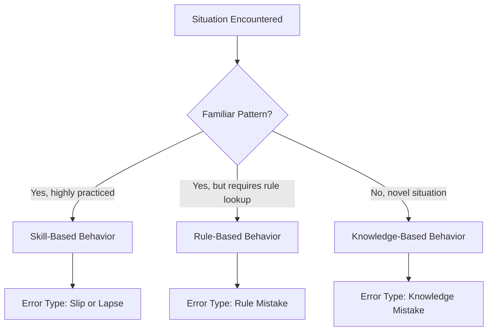
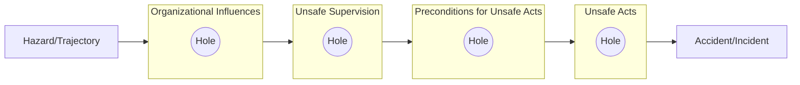
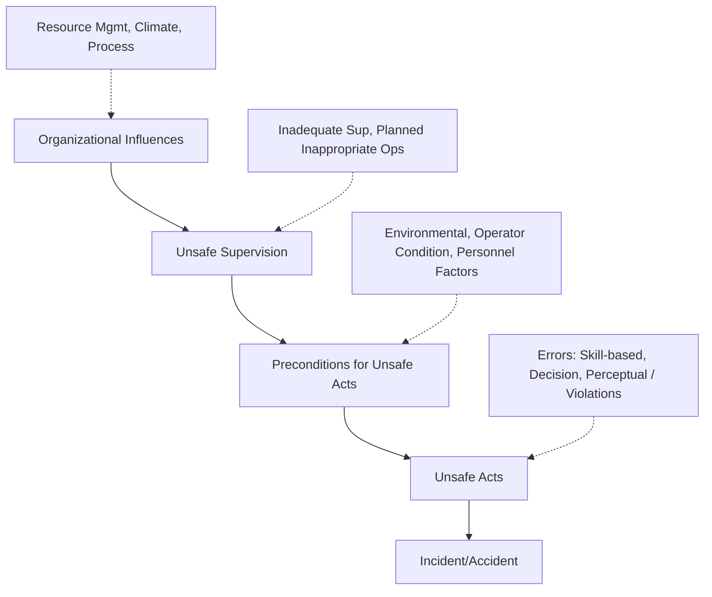

## Human error classification models

### Overview

Human error classification models provide structured taxonomies for understanding why people make mistakes within complex sociotechnical systems. In Root Cause Analysis (RCA), these models prevent investigators from stopping at superficial conclusions like "operator error" and instead push toward identifying the underlying cognitive, organizational, and systemic contributors. The core premise across these models is that human error is rarely random; it follows predictable patterns rooted in the nature of the task, the design of the system, and the conditions under which the person was working.

### Why Classification Matters in RCA

**Key Points**

- Labeling an incident "human error" without further classification is a investigative dead end — it identifies a symptom, not a cause.
- Classification models allow investigators to distinguish between errors that originate in the individual's cognitive processing versus errors that originate in system design, training, or organizational culture.
- Different error types demand different corrective actions: a slip requires a different fix than a mistake rooted in a flawed mental model.
- Most modern RCA frameworks (including the "5 Whys" when applied to human-involved incidents) benefit from pairing with a formal error taxonomy to avoid the "blame the operator" trap.

### Rasmussen's Skill-Rule-Knowledge (SRK) Framework

Developed by Jens Rasmussen, this model classifies human performance—and by extension, human error—based on the level of cognitive control being exercised at the time of the action.

- **Skill-based behavior**: Highly practiced, automatic actions requiring little conscious attention (e.g., an experienced driver shifting gears). Errors here are typically **slips** (action doesn't go as planned) or **lapses** (memory failures).
- **Rule-based behavior**: Actions governed by learned rules or procedures ("if X, then do Y"). Errors here are **rule-based mistakes**—applying a good rule to the wrong situation, or applying a bad/outdated rule.
- **Knowledge-based behavior**: Novel or unfamiliar situations requiring conscious problem-solving from first principles. Errors here are **knowledge-based mistakes**, often due to incomplete or incorrect mental models of the system.

**Example**

A nurse who has administered a specific injection thousands of times pulls the wrong vial from a habitually memorized shelf location after the pharmacy silently rearranged stock. This is a **skill-based slip**: the action sequence executed as automatically intended, but the environment changed underneath the automatic behavior.

### Reason's Generic Error Modelling System (GEMS) and the Swiss Cheese Model

James Reason built on Rasmussen's SRK framework and introduced two influential contributions.

#### Slips, Lapses, and Mistakes

Reason's taxonomy divides **unsafe acts** into two broad families:

- **Unintentional actions**
  - **Slips**: Attention failures during execution of a correct plan (e.g., pressing the wrong button despite knowing the right one).
  - **Lapses**: Memory failures (e.g., forgetting a step in a checklist).
- **Intentional actions that go wrong**
  - **Mistakes**: The plan itself was flawed.
    - *Rule-based mistakes*: Misapplication of a good rule or application of a bad rule.
    - *Knowledge-based mistakes*: Errors in reasoning under novel conditions.
  - **Violations**: Deliberate deviations from known safe procedures, further subdivided into:
    - *Routine violations*: Habitual shortcuts (e.g., skipping a lockout/tagout step because "everyone does it").
    - *Situational violations*: Deviating due to specific situational pressures (e.g., time constraints).
    - *Exceptional violations*: Rare deviations under unusual, high-stakes circumstances.
    - *Sabotage*: Intentional harm (rare, and typically treated outside standard RCA into disciplinary/security processes).

#### The Swiss Cheese Model

Reason's Swiss Cheese Model reframes accidents as the alignment of failures across multiple defensive layers, rather than the product of a single human error.

Each layer represents a defense (procedures, supervision, training, equipment design). Holes in each layer represent latent weaknesses. An accident occurs only when holes in multiple layers momentarily align, allowing the hazard trajectory to pass through uninterrupted. This model directly informs RCA practice: the "5 Whys" applied under this framework should trace failure through each layer rather than stopping at the front-line "unsafe act."

**Key Points**

- Active failures (the unsafe act itself) are the last layer, closest in time to the incident — but rarely the most useful lever for prevention.
- Latent conditions (poor design, inadequate staffing, weak safety culture) reside in the upper layers and are typically the most productive targets for corrective action, since fixing them closes holes across many future scenarios, not just one.

### Human Error Assessment and Reduction Technique (HEART)

HEART is a quantitative human reliability assessment (HRA) method used primarily in high-risk industries (nuclear, aviation, process safety) to estimate the probability of human error for a given task.

- Tasks are classified into **Generic Task Types (GTTs)**, each with a nominal human error probability (e.g., "totally unfamiliar task performed at speed with no idea of likely consequences" carries a much higher nominal error rate than "a well-practiced, routine task").
- **Error-Producing Conditions (EPCs)** are then applied as multipliers to the nominal probability — factors such as time pressure, inexperience, poor human-machine interface, or conflicting objectives.
- The output is a calculated probability of failure, useful for quantitative risk assessment and for prioritizing which tasks warrant redesign.

**Example**

A GTT with a nominal error probability of 0.02, combined with an EPC for "high time pressure" (multiplier of ×4, applied at 0.6 proportion of effect), yields an adjusted probability substantially above baseline — flagging the task for redesign, additional checks, or procedural simplification.

### The Human Factors Analysis and Classification System (HFACS)

Developed by Wiegmann and Shappell for aviation (built on Reason's Swiss Cheese Model), HFACS provides one of the most widely adopted structured taxonomies for RCA involving human error, now used well beyond aviation in healthcare, rail, and industrial safety.

HFACS organizes causal factors into four tiers:

1. **Unsafe Acts** (the operator level)
   - Errors: Skill-based, Decision, Perceptual
   - Violations: Routine, Exceptional
2. **Preconditions for Unsafe Acts**
   - Environmental factors (physical/technological)
   - Condition of the operator (adverse mental states, physiological states, physical/mental limitations)
   - Personnel factors (crew resource management issues, personal readiness)
3. **Unsafe Supervision**
   - Inadequate supervision
   - Planned inappropriate operations
   - Failure to correct known problems
   - Supervisory violations
4. **Organizational Influences**
   - Resource management
   - Organizational climate
   - Organizational process

**Key Points**

- HFACS is diagnostic, not merely descriptive: each category maps to specific, actionable intervention types.
- When paired with the "5 Whys," HFACS gives each "why" a structured landing zone — e.g., the first "why" might identify a skill-based error (Tier 1), while successive "whys" trace upward into inadequate supervision (Tier 3) and resource allocation decisions (Tier 4).

### Norman's Action Cycle and Slip/Mistake Distinction

Donald Norman's Seven Stages of Action model examines error from a cognitive/design perspective, useful for RCA in user-interface and product-design contexts.

The cycle: Goal → Plan → Specify → Execute → Perceive → Interpret → Compare.

- Errors in the **execution** stages (plan, specify, execute) tend to produce **slips** — the goal was correct, but execution failed.
- Errors in the **evaluation** stages (perceive, interpret, compare) tend to produce **mistakes** — the goal itself, or the interpretation of feedback, was flawed.

This model is particularly useful in RCA for human-machine interface failures, where the investigator must determine whether the root cause lies in poor affordances/design (making correct execution difficult) or poor feedback (making correct evaluation difficult).

### Comparative Summary of Models

| Model | Primary Domain | Core Distinction | RCA Utility |
| --- | --- | --- | --- |
| Rasmussen (SRK) | Cognitive psychology | Skill / Rule / Knowledge-based control | Identifies cognitive level at which failure occurred |
| Reason (GEMS/Swiss Cheese) | Organizational safety | Slips/Lapses vs. Mistakes vs. Violations; layered defenses | Traces active failures to latent organizational conditions |
| HEART | Quantitative HRA | Generic Task Types × Error-Producing Conditions | Probabilistic prioritization of high-risk tasks |
| HFACS | Aviation/multi-industry | Four-tier causal hierarchy | Structures "5 Whys" ladder from act to organization |
| Norman's Action Cycle | HCI/design | Execution-side slips vs. evaluation-side mistakes | Diagnoses interface and feedback design flaws |

### Applying Classification Within the "5 Whys"

**Example**

- **Why 1**: Why did the wrong medication reach the patient? → The nurse selected the wrong vial. *(Unsafe Act — skill-based slip, per HFACS Tier 1)*
- **Why 2**: Why was the wrong vial available for selection? → Look-alike packaging was stored adjacent to the correct medication. *(Precondition — environmental factor, HFACS Tier 2)*
- **Why 3**: Why was look-alike packaging stored adjacently? → No formal high-alert medication segregation policy existed. *(Unsafe Supervision — failure to correct known problem, HFACS Tier 3)*
- **Why 4**: Why did no such policy exist? → Pharmacy leadership had not prioritized medication-safety redesign against competing budget demands. *(Organizational Influence — resource management, HFACS Tier 4)*
- **Why 5**: Why was this deprioritized? → No formal risk-scoring process elevated near-miss reports to leadership attention. *(Organizational Process failure)*

[Inference] The specific number of "whys" needed to reach an organizational-tier cause varies by incident; some chains resolve in three iterations, others require more, and rigid adherence to exactly five steps is a common practical misapplication of the technique.

### Common Pitfalls in Classification-Based RCA

**Key Points**

- **Hindsight bias**: Classifying an action as an "obvious mistake" after the outcome is known, when it was a reasonable decision given the information available at the time (the "local rationality" principle).
- **Stopping at the individual**: Terminating the analysis at Tier 1 (Unsafe Acts) without tracing upward into preconditions, supervision, and organizational tiers.
- **Conflating violations with errors**: Treating a deliberate procedural shortcut (violation) the same as an unintentional slip, which leads to mismatched corrective actions (disciplinary vs. systemic redesign).
- **Over-reliance on a single model**: Each framework emphasizes different aspects; complex incidents often benefit from cross-referencing multiple models (e.g., HFACS for organizational tracing, SRK for cognitive-level diagnosis of the specific act).

### Related Topics

- Swiss Cheese Model in depth (latent vs. active failures)
- Just Culture frameworks and the error/violation distinction in disciplinary policy
- Crew Resource Management (CRM) and its link to HFACS Tier 2 preconditions
- Human Reliability Analysis (HRA) techniques beyond HEART (e.g., THERP, CREAM)
- Cognitive Reliability and Error Analysis Method (CREAM)
- Local rationality principle and hindsight bias mitigation in investigation interviews
- Designing procedural and environmental controls (forcing functions, poka-yoke) informed by error classification