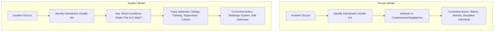
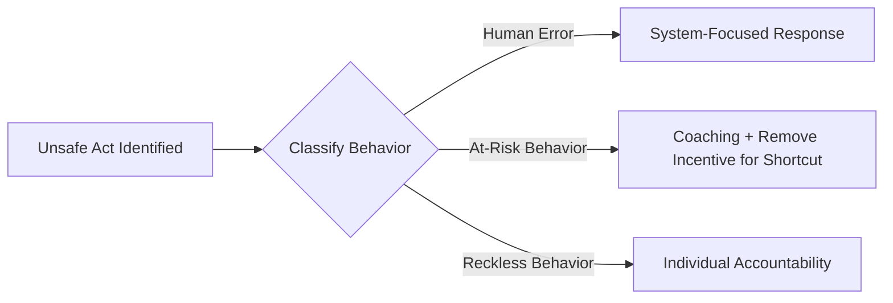

## Individual blame versus systemic failure perspective

### Overview

The tension between the "person model" and the "system model" of accident causation is one of the most consequential conceptual divides in Root Cause Analysis. How an investigation frames this tension determines whether the resulting corrective actions treat the symptom (a fallible individual) or the disease (a flawed system that made failure likely, if not inevitable). Reason (2000) formalized this as two contrasting approaches, and most modern RCA methodologies, including structured application of the "5 Whys," are explicitly built to resist the gravitational pull toward individual blame.

### The Person Model (Individual Blame Perspective)

**Key Points**

- Focuses on the unsafe acts of individuals closest in time and space to the incident — operators, nurses, pilots, technicians.
- Attributes error to forgetfulness, inattention, poor motivation, carelessness, negligence, or recklessness.
- Treats errors as moral failings, leading naturally to counter-measures aimed at the individual: reprimand, retraining, threat of litigation, shaming, procedure reissuance, or termination.
- Is psychologically appealing because it is emotionally satisfying (someone is held accountable), cognitively simple (a single, identifiable cause), and legally convenient (isolates liability).
- Is deeply rooted in what social psychology calls the **fundamental attribution error**: the tendency to overweight dispositional (personality/character) explanations for others' behavior while underweighting situational factors.

**Example**

A warehouse worker is injured operating a forklift without a seatbelt. Under a pure person model, the investigation concludes "worker failed to follow safety procedure" and the corrective action is a written warning plus a safety refresher — without examining whether the seatbelt was damaged, whether supervisors routinely tolerated unbelted operation to maintain throughput targets, or whether the shift schedule left workers fatigued.

### The System Model (Systemic Failure Perspective)

**Key Points**

- Starts from the premise that humans are fallible and errors are to be expected even in the best organizations — error is a **normal byproduct of normal human cognition operating within imperfect systems**, not a moral aberration.
- Treats errors as **consequences**, not causes — the individual's action is the last visible link in a much longer causal chain.
- Focuses on the conditions under which individuals work: the design of tools and interfaces, the clarity and workability of procedures, staffing levels, scheduling, training adequacy, organizational culture, and the presence (or absence) of system defenses.
- Accepts that individual actions are the proximate trigger but insists that systems should be designed to be robust to human variability — anticipating that people will, on occasion, be tired, distracted, or under pressure.
- Directs corrective action upstream: redesigning interfaces, changing staffing models, revising procedures for actual workability (not just theoretical compliance), and building in barriers, redundancies, and recovery mechanisms.

**Example**

Applying the system model to the same forklift incident: investigators ask why the seatbelt was in disrepair (maintenance backlog), why supervisors did not enforce the policy (production pressure conflicting with safety messaging), and why fatigue-inducing schedules were tolerated (staffing shortages). Corrective action targets maintenance scheduling, supervisor incentive structures, and staffing — changes that reduce risk for every future operator, not just this one.

### Why RCA Methodology Defaults Toward the System Model

**Key Points**

- **Recurrence prevention**: Disciplining or retraining one individual does nothing to prevent the next person, in the same role, under the same conditions, from making a similar error. The system model targets the conditions themselves.
- **Local rationality principle**: At the moment of action, the individual's behavior almost always made sense to them given the information, time pressure, and competing goals they faced. Reconstructing that local rationality — rather than judging the action against a hindsight-informed "correct" answer — is central to legitimate root cause investigation.
- **Reporting culture preservation**: If investigations reliably end in blame, personnel stop reporting near-misses and errors, starving the organization of the data needed to detect latent weaknesses before they cause harm. This is the foundational argument for a **Just Culture**.
- **Compatibility with the "5 Whys"**: Each successive "why" is explicitly designed to move the inquiry further from the individual act and closer to the systemic and organizational conditions that enabled it. A "5 Whys" chain that terminates at "the operator was careless" has failed to complete the method — it has stopped at the first layer rather than pursuing the causal chain to an actionable, systemic level.

### The Boundary Case: Just Culture

The system model does not mean individuals are never accountable. A **Just Culture** framework (Dekker, Marx) draws an explicit line between behaviors that warrant systemic correction and behaviors that warrant individual accountability.

| Behavior Type | Description | Appropriate Response |
| --- | --- | --- |
| Human error (slip/lapse/mistake) | Unintentional; the person did not intend the outcome and would not have predicted it | System-focused: redesign, retrain, adjust conditions |
| At-risk behavior | A deviation where the risk was not recognized or was mistakenly believed to be justified/negligible (often normalized by peer/organizational drift) | Coaching, removing incentives for the risky shortcut, closing the gap between procedure and practice |
| Reckless behavior | Conscious disregard of a substantial and unjustifiable risk | Disciplinary/remedial action targeted at the individual |

[Inference] The precise boundary between "at-risk" and "reckless" behavior often requires organizational judgment and is one of the more contested areas in Just Culture implementation, since the same action can be classified differently depending on context, intent assessment, and organizational precedent.

### Common Failure Modes in Applying This Distinction

**Key Points**

- **False systemic language masking blame**: Investigations sometimes adopt system-model vocabulary ("we need better training") while the underlying corrective action is still individually punitive (retraining is assigned only to the person involved, and the broader training program is left unchanged).
- **Overcorrection into "no accountability"**: Swinging fully to the system model can be misapplied to excuse genuinely reckless behavior, eroding trust in the investigation process among staff who perceive certain individuals as never being held responsible.
- **Stopping the "5 Whys" prematurely**: A chain that halts at "the technician didn't follow the checklist" without asking why the checklist was skipped (unworkable checklist design, time pressure, normalized deviation) reproduces the person model under the appearance of systemic analysis.
- **Hindsight bias contaminating "why" statements**: Framing a why-answer as "the operator should have known" imports judgment unavailable to the person at the time, which is a hallmark of person-model reasoning creeping into system-model methodology.

### Practical Application Within the "5 Whys"

**Example**

- **Why 1**: Why did the incident occur? → The operator bypassed an interlock. *(Surface-level act — risk of stopping here)*
- **Why 2**: Why was the interlock bypassed? → It triggered false alarms during normal operation, so operators routinely bypassed it. *(Moves from act to condition)*
- **Why 3**: Why did the interlock produce false alarms? → It was calibrated for an earlier equipment configuration that had since changed. *(System/design cause)*
- **Why 4**: Why was the calibration never updated after the equipment change? → No change-management process required a safety-system review upon equipment modification. *(Organizational process gap)*
- **Why 5**: Why did no such process exist? → Safety-system commissioning was treated as a one-time project deliverable rather than an ongoing operational responsibility. *(Organizational/cultural root cause)*

This chain illustrates the discipline the system perspective imposes: each "why" is prohibited from resolving into a character judgment about the operator and is instead required to identify a condition, decision, or process that can be redesigned.

### Related Topics

- Just Culture models (Dekker's Just Culture, Marx's Substitution Test)
- Local rationality and the "new view" of human error (Dekker, Woods)
- Normalization of deviance (Vaughan) and its role in at-risk behavior drift
- Reporting culture and psychological safety in incident disclosure
- HFACS as a structured bridge between individual acts and organizational causes
- Blame-free vs. blame-aware incident investigation policy design
- Fundamental attribution error and its influence on investigator bias