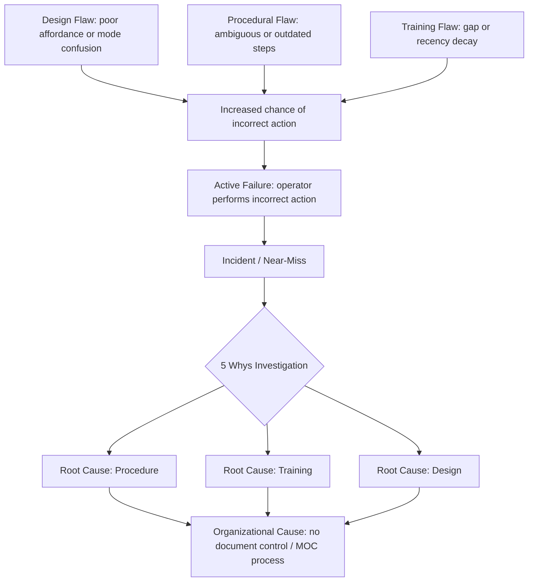

## Procedural, Training, and Design Related Causes

### Definition and Scope

Procedural, training, and design-related causes occupy the middle tier of most root cause hierarchies — beneath immediate unsafe acts, but above the organizational/management decisions that ultimately fund and permit them. This category asks: even with a competent, well-intentioned worker, did the procedure, training program, or physical/system design make the error likely or the correct action difficult?

Unlike organizational causes (policy, staffing, budget), these are the *local, tangible artifacts* the worker directly interacts with: the written instruction, the training they received, and the interface, tool, or environment they operate in.

### Key Points

- **Procedures, training, and design are mutually reinforcing failure points** — a bad procedure can be partially compensated for by good training, and a bad interface can be partially compensated for by a good procedure, but when all three degrade simultaneously, failure becomes highly probable.
- **The "human error" label is often a symptom, not a cause** — investigators who stop at "operator error" frequently miss that the procedure was ambiguous, the training never covered the edge case, or the interface made the wrong action easier than the right one.
- **Design failures are the hardest to detect** because they are usually invisible until an unusual combination of conditions exposes them (a "latent design flaw").

### 1. Procedural Root Causes

#### Common Failure Patterns

- **Ambiguity**: Steps open to multiple interpretations, especially under time pressure
- **Obsolescence**: Procedure not updated after equipment, software, or process changes ("procedural drift")
- **Inaccessibility**: Correct procedure exists but is buried, hard to search, or not available at point of use
- **Over-specification vs. under-specification**: Either too rigid to handle normal variation, or too vague to guide action in non-routine situations
- **Missing contingency steps**: Covers the happy path but not common deviations or failure states
- **Conflicting procedures**: Two documents (e.g., a safety SOP and a production SOP) give contradictory guidance for the same situation

#### Diagnostic Questions

- Was the procedure followed exactly as written, and did following it correctly still lead to the incident? (This points to a procedural, not human, root cause.)
- When was this procedure last reviewed against actual current practice?
- Is there a gap between the "procedure as written" and the "procedure as actually performed" (workarounds)? Persistent workarounds are a strong signal of a procedural design fault.

**Example:** A maintenance technician followed the lockout/tagout procedure exactly as documented, but the document listed an outdated valve numbering scheme after a plant retrofit. The energy source was not actually isolated. Root cause: procedural document control failure, not technician negligence.

### 2. Training-Related Root Causes

#### Common Failure Patterns

- **Content gaps**: Training never covered the specific failure scenario or edge case
- **Recency decay**: Skill was trained once, long ago, and never refreshed (relevant for low-frequency, high-consequence tasks)
- **Training-task mismatch**: Training conducted in a simulated or simplified environment that doesn't match real operating conditions
- **Passive delivery**: Lecture/slide-based training for tasks requiring hands-on proficiency (procedural knowledge without procedural skill)
- **No verification of competency**: Attendance recorded, but no assessment confirms the worker can actually perform the task correctly
- **Tribal knowledge substitution**: Formal training is thin, and workers rely on informally passed-down (and sometimes incorrect) practices from peers

#### Diagnostic Questions

- Could a worker who completed all required training have predicted the correct action in this specific scenario?
- Is competency verified through demonstration, or only through attendance/quiz completion?
- How long ago was the relevant training completed, and has anything about the task changed since?

**Example:** An operator misconfigured a rarely-used emergency shutdown sequence. Investigation found the training program covered normal shutdown extensively but allocated no hands-on practice time to the emergency variant, which occurs less than once a year. Root cause: training curriculum did not weight practice time toward failure-scenario frequency-weighted risk, only toward routine-task frequency.

### 3. Design-Related Root Causes

#### Common Failure Patterns

- **Poor affordances**: The physical or digital interface makes the incorrect action as easy or easier than the correct one (e.g., identical-looking controls with different functions)
- **Mode confusion**: System behaves differently depending on an unclear or poorly indicated operating mode
- **Alarm/signal design flaws**: Alarm floods, poor prioritization, or alerts that don't clearly indicate required action
- **Inadequate feedback**: System doesn't clearly confirm whether an action succeeded or failed
- **Violation of population stereotypes**: Controls that go against widely learned conventions (e.g., a valve that opens clockwise when nearly everything else in the facility opens counterclockwise)
- **Forcing functions absent**: No physical or logical barrier prevents an unsafe sequence of actions (e.g., no interlock preventing two incompatible valves from being open simultaneously)

#### Diagnostic Questions

- Does the design assume a level of vigilance or memory that is unrealistic under real operating conditions (fatigue, time pressure, distraction)?
- Would a redesign that makes the unsafe action physically or logically impossible be feasible (a "forcing function")?
- Has this same design flaw contributed to near-misses before, under different apparent causes?

**Example:** Two adjacent software buttons — "Save Draft" and "Submit Final" — were visually near-identical and positioned where the primary action button usually sits. Multiple users prematurely submitted incomplete records. Root cause: interface design violated the convention of visually distinguishing reversible from irreversible actions, not "user carelessness."

### The 5 Whys Applied Across This Tier

1. **Why** did the incorrect valve get opened? → The technician selected the wrong valve from the panel.
2. **Why** was the wrong valve selected? → Valve labels were inconsistent with the P&ID diagram used in training.
3. **Why** were labels inconsistent with the diagram? → The physical labeling was never updated after a valve replacement six months prior.
4. **Why** wasn't the training material or physical labeling reconciled? → No procedure requires cross-checking field labels against engineering drawings after a physical modification.
5. **Why** does no such procedure exist? → (This is where the chain transitions into an organizational root cause: no management-of-change process ties field changes to documentation and training updates.)

This illustrates how procedural/training/design causes frequently sit *between* the immediate human action and the organizational root cause — they are often the mechanism through which an organizational gap becomes a real-world failure.

### Diagram: Three-Legged Failure Model (svg_diagram)

<svg xmlns="http://www.w3.org/2000/svg" viewBox="0 0 800 420">
<text x="400" y="30" text-anchor="middle" font-size="18" font-weight="bold" fill="#1a1a1a">Procedural / Training / Design Interaction (svg_diagram)</text>
<circle cx="250" cy="180" r="110" fill="#e0edfa" fill-opacity="0.7" stroke="#2a6fa8" stroke-width="2" />
<text x="250" y="130" text-anchor="middle" font-size="14" font-weight="bold" fill="#1a3a5c">Procedure</text>
<text x="250" y="150" text-anchor="middle" font-size="10" fill="#333">Ambiguous, outdated,</text>
<text x="250" y="164" text-anchor="middle" font-size="10" fill="#333">or inaccessible steps</text>
<circle cx="550" cy="180" r="110" fill="#fef3d6" fill-opacity="0.7" stroke="#c9932a" stroke-width="2" />
<text x="550" y="130" text-anchor="middle" font-size="14" font-weight="bold" fill="#6b4f0f">Training</text>
<text x="550" y="150" text-anchor="middle" font-size="10" fill="#333">Content gaps, recency</text>
<text x="550" y="164" text-anchor="middle" font-size="10" fill="#333">decay, no verification</text>
<circle cx="400" cy="300" r="110" fill="#e3f5e1" fill-opacity="0.7" stroke="#3a8f3a" stroke-width="2" />
<text x="400" y="330" text-anchor="middle" font-size="14" font-weight="bold" fill="#1f5c1f">Design</text>
<text x="400" y="350" text-anchor="middle" font-size="10" fill="#333">Poor affordances, mode</text>
<text x="400" y="364" text-anchor="middle" font-size="10" fill="#333">confusion, weak feedback</text>

<text x="400" y="215" text-anchor="middle" font-size="12" font-weight="bold" fill="#333">Overlap =</text>

<text x="400" y="230" text-anchor="middle" font-size="11" fill="#333">Incident Likelihood</text>

</svg>

### Mermaid Diagram: Causal Flow from Design/Training/Procedure to Incident

### Corrective Action Design Considerations

Effective corrective actions in this tier follow the **hierarchy of controls** logic, ranked by reliability:

| Priority | Action Type | Example |
| --- | --- | --- |
| Highest | Eliminate/redesign | Physically prevent the unsafe sequence (interlock, forcing function) |
| High | Engineering control | Redesign interface, improve labeling, add automated verification |
| Medium | Procedural control | Rewrite procedure for clarity; add explicit contingency steps |
| Medium | Training | Add scenario-based practice, refresh cadence, competency verification |
| Lowest | Administrative/awareness | Reminder memos, posters, verbal briefings |

[Inference] Investigations that default to the lowest tier — retraining or reminders — as the sole corrective action are frequently criticized in RCA literature as addressing the symptom rather than the underlying procedural or design gap, since they rely on sustained human vigilance rather than removing the failure opportunity itself. This is a widely cited principle in human factors engineering, though the appropriate control level is ultimately case-dependent.

### Common Pitfalls

- **Confusing "didn't follow procedure" with root cause**: If deviation from procedure is common and tolerated, the real root cause is the gap between written and actual practice, not the individual instance.
- **Treating training as a universal fix**: Retraining doesn't address a procedure that is genuinely ambiguous or a design that invites error regardless of knowledge level.
- **Ignoring near-miss data**: Design flaws often generate several near-misses before causing an actual incident; failing to mine near-miss reports for design signals delays detection.

**Next Steps:**

- Human-centered design principles and usability heuristics for safety-critical interfaces
- Procedure writing standards (e.g., technique for writing unambiguous, verifiable steps)
- Competency-based training design and skills decay curves
- Near-miss reporting systems and leading indicator analysis
- Hierarchy of controls in corrective action selection
- Management of Change (MOC) as the organizational link tying design/procedure/training updates together