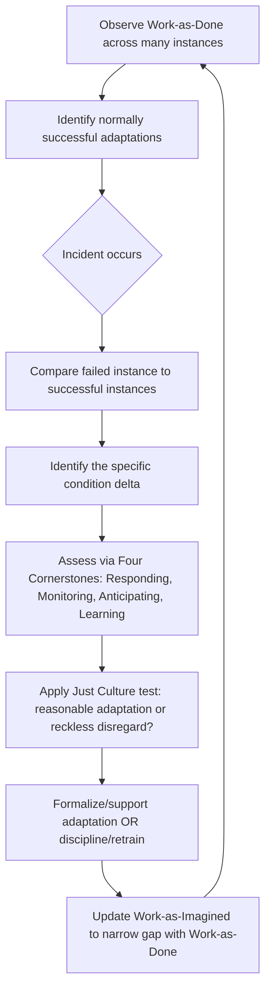

## Resilience Engineering Perspective on Failure

### Definition and Scope

Resilience engineering is a paradigm in safety science that reframes failure not as the breakdown of an otherwise well-functioning system, but as the flip side of the same adaptive capacity that normally allows the system to succeed under varying and unanticipated conditions. It emerged largely from the work of Erik Hollnagel, David Woods, and Sidney Dekker as a response to the limitations of purely linear, component-failure models of accident causation (e.g., simple chains of dominoes or Swiss Cheese-style barrier models).

Where traditional root cause analysis asks "what broke, and why did the barriers fail to stop it," resilience engineering asks a broader question: "how does this system normally succeed despite variability, and under what conditions does that same adaptive behavior fail to keep up?" This reframes the 5 Whys and similar techniques as tools that must be applied with awareness of their limits, since they are well-suited to finding component or procedural breakdowns but less suited to explaining failures that emerge from the interaction of many locally reasonable adaptations.

### Key Points

- **Safety is not the absence of failure; it is an emergent property of a system's ongoing ability to adapt** to gaps between how work is imagined (procedures, plans) and how work actually has to be done to get things done under real conditions.
- **"Work as imagined" vs. "work as done"**: Formal procedures describe an idealized version of a task; actual performance always involves adaptation to handle variability, resource constraints, and ambiguity that the procedure did not anticipate. Most of the time this adaptation is what makes the system succeed, not what causes it to fail.
- **The same behaviors that usually produce success can, in a different combination of circumstances, produce failure** — this is a central claim distinguishing resilience engineering from models that treat "deviant" behavior as inherently unsafe.
- **Traditional RCA and resilience engineering are complementary, not opposed**: the 5 Whys and causal-chain analysis remain useful for finding specific broken components or gaps, but resilience engineering adds a systemic lens for understanding why the overall system's adaptive capacity was insufficient in this instance.

### The Four Cornerstones of Resilience (Hollnagel's Framework)

Hollnagel describes resilient performance as depending on four core abilities, which are useful both diagnostically (assessing a system's resilience) and as categories for locating failure:

1. **Responding** — the capacity to recognize and address regular and irregular disturbances/demands, based on prepared or adjusted routines. Failure mode: the system detects a problem but lacks a rehearsed or improvised response strategy.
2. **Monitoring** — the capacity to watch for developing threats and changes in the environment before they become critical. Failure mode: relevant leading indicators exist but are not tracked, or are tracked but not acted upon.
3. **Anticipating** — the capacity to foresee longer-term developments, threats, and opportunities. Failure mode: the organization is reactive rather than forward-looking, addressing only problems that have already manifested.
4. **Learning** — the capacity to learn from past experience, including successes as well as failures. Failure mode: incident investigations focus only on failures and ignore the far larger set of cases where similar conditions did not produce a bad outcome (see "Safety-II" below).

### Safety-I vs. Safety-II

This distinction, also from Hollnagel, is central to how resilience engineering reframes causation analysis:

|  | Safety-I | Safety-II |
| --- | --- | --- |
| **Definition of safety** | Absence of adverse events | Presence of adaptive capacity to succeed under varying conditions |
| **Focus of investigation** | What went wrong; find and fix the broken component | Why things usually go right; understand normal performance variability |
| **View of human performance** | A hazard to be constrained (source of error) | A resource that creates safety through adaptation |
| **Data used** | Incidents, accidents, near-misses | All performance, including the vast majority of successful, unremarkable outcomes |
| **Underlying model** | Linear or barrier-based causality | Complex, nonlinear, emergent causality |

**Practical implication for RCA**: A Safety-I investigation asks "why did this fail?" A Safety-II-informed investigation additionally asks "why does this normally succeed, and what was different this time?" — often revealing that the same adaptive shortcut being blamed for the incident is used successfully thousands of times elsewhere in the system, meaning the shortcut itself is not the root cause; the specific combination of conditions that made it fail this time is.

### Work-as-Imagined vs. Work-as-Done

This concept directly extends the discussion of procedural root causes:

- **Work-as-imagined (WAI)**: The task as described in the procedure, training material, or management's mental model of how the job is done.
- **Work-as-done (WAD)**: The task as it is actually performed, incorporating adaptations to handle ambiguity, resource shortages, competing priorities, and situational variability that WAI did not anticipate.

A persistent, wide gap between WAI and WAD is not automatically a sign of malfeasance — it is often the reason the system functions at all, since strict literal adherence to WAI would be unworkable under real conditions (this is sometimes called "work-to-rule" being functionally equivalent to a slowdown or strike, because literal procedure-following is often less efficient and sometimes less safe than experienced adaptation).

**Investigative implication**: When an incident occurs, resilience engineering pushes investigators to document WAD directly (through observation and non-judgmental interviews) rather than relying solely on the WAI documented in procedures, because the causal factors are usually found in the mismatch between the two, not in either version alone.

### Diagram: Safety-I vs. Safety-II Investigative Lens (svg_diagram)

<svg xmlns="http://www.w3.org/2000/svg" viewBox="0 0 820 420">
<text x="410" y="30" text-anchor="middle" font-size="18" font-weight="bold" fill="#1a1a1a">Safety-I vs Safety-II Investigative Focus (svg_diagram)</text>
<rect x="60" y="70" width="320" height="300" rx="8" fill="#fde2e2" fill-opacity="0.5" stroke="#c0392b" stroke-width="1.5" />
<text x="220" y="100" text-anchor="middle" font-size="14" font-weight="bold" fill="#7a1f1f">Safety-I Lens</text>
<text x="220" y="130" text-anchor="middle" font-size="11" fill="#333">Narrow slice of data:</text>
<text x="220" y="150" text-anchor="middle" font-size="11" fill="#333">only the failure case</text>
<circle cx="220" cy="220" r="8" fill="#c0392b" />
<text x="240" y="225" font-size="10" fill="#333">The one incident</text>
<text x="220" y="270" text-anchor="middle" font-size="11" fill="#333">Q: What broke?</text>
<text x="220" y="290" text-anchor="middle" font-size="11" fill="#333">Fix: patch the component</text>
<text x="220" y="330" text-anchor="middle" font-size="10" fill="#555">Risk: misses systemic</text>
<text x="220" y="345" text-anchor="middle" font-size="10" fill="#555">adaptive drivers</text>
<rect x="440" y="70" width="320" height="300" rx="8" fill="#e3f5e1" fill-opacity="0.5" stroke="#3a8f3a" stroke-width="1.5" />
<text x="600" y="100" text-anchor="middle" font-size="14" font-weight="bold" fill="#1f5c1f">Safety-II Lens</text>
<text x="600" y="130" text-anchor="middle" font-size="11" fill="#333">Full spectrum of data:</text>
<text x="600" y="150" text-anchor="middle" font-size="11" fill="#333">success and failure</text>
<circle cx="500" cy="200" r="5" fill="#3a8f3a" />
<circle cx="540" cy="230" r="5" fill="#3a8f3a" />
<circle cx="580" cy="190" r="5" fill="#3a8f3a" />
<circle cx="620" cy="240" r="5" fill="#3a8f3a" />
<circle cx="660" cy="205" r="5" fill="#3a8f3a" />
<circle cx="700" cy="225" r="8" fill="#c0392b" />
<text x="600" y="270" text-anchor="middle" font-size="11" fill="#333">Q: Why does this usually work?</text>
<text x="600" y="290" text-anchor="middle" font-size="11" fill="#333">Fix: strengthen adaptive capacity</text>
<text x="600" y="330" text-anchor="middle" font-size="10" fill="#555">Benefit: reveals conditions</text>
<text x="600" y="345" text-anchor="middle" font-size="10" fill="#555">distinguishing success/failure</text>
</svg>

### Applying Resilience Engineering Alongside the 5 Whys

Resilience engineering does not discard the 5 Whys, but it changes how the answers at each step are interpreted:

1. **Why** did the incident occur? → An operator used an unofficial workaround to keep production running.
2. **Why** did the operator use the workaround? → *(Safety-I framing)*: "The operator deviated from procedure." *(Safety-II/resilience framing)*: "The workaround is the normal, adaptive way this task is completed under typical resource conditions, and it succeeds the vast majority of the time."
3. **Why** did it fail this time specifically? → This is the resilience-engineering-critical question: what combination of conditions (fatigue, an unusual input, a coincident secondary demand) pushed a normally successful adaptation past its margin?
4. **Why** did the system's monitoring/anticipation not catch the developing risk? → Points to gaps in one of Hollnagel's four cornerstones (monitoring, anticipating).
5. **Why** does the organization not treat this workaround as a formal, supported practice, if it's how the work is actually and successfully done? → Leads back into organizational and procedural root causes, but with a resilience-informed recommendation: formalize and support the adaptation (redesign the procedure/tooling around WAD) rather than simply prohibiting it, since prohibition without addressing the underlying resource gap typically just pushes the adaptation underground.

### Common Pitfalls When Applying This Perspective

- **Treating resilience engineering as an excuse for eliminating accountability**: it does not replace Just Culture reasoning about individual behavior; it primarily reframes *systemic* analysis, particularly around procedural and design causes.
- **Conflating "adaptive" with "always acceptable"**: some adaptations are genuinely reckless departures rather than reasonable responses to system gaps; resilience engineering still requires distinguishing these (again intersecting with Just Culture behavior classification).
- **Ignoring near-miss and successful-performance data**: an investigation that only studies the failed case, without comparing it to the many successful instances of similar performance, risks misidentifying the adaptation itself (rather than the specific unlucky combination of conditions) as the root cause.
- **Underestimating the difficulty of implementation**: [Inference] Building genuine Safety-II data collection (systematically observing and analyzing normal, successful work) is significantly more resource-intensive than incident-triggered Safety-I investigation, since it requires ongoing observation rather than only reactive analysis after failure — this practical cost is a commonly cited barrier to adoption in safety literature, though the degree of difficulty varies by industry and existing data infrastructure.

### Relationship to the Rest of the Causal Framework

| Prior Concept | Resilience Engineering Reframing |
| --- | --- |
| Immediate cause / unsafe act | Often a normal adaptation that succeeds most of the time; ask what was different this time |
| Procedural root cause | Gap between work-as-imagined and work-as-done is expected, not just an error to eliminate |
| Organizational root cause | Resource/schedule pressure shapes which adaptations become necessary and normal |
| Normalization of deviance | Can be reframed as an unmonitored/unsupported adaptation that drifted past a safe margin without organizational awareness (monitoring/anticipating failure) |
| Just Culture | Still needed to distinguish reasonable adaptation from reckless disregard of known risk |

### Mermaid Diagram: Resilience Engineering Investigative Loop

**Related Topics:**

- Hollnagel's Safety-I / Safety-II framework in depth
- Work-as-imagined vs. work-as-done field observation methods
- High Reliability Organizations (HRO) and their overlap with resilience engineering
- Functional Resonance Analysis Method (FRAM) as a resilience-based investigative tool
- Sidney Dekker's "Field Guide to Understanding Human Error" and the "new view" of human error
- Integrating Safety-II data collection into routine operations monitoring