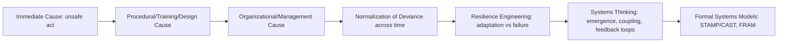

## Introduction to Systems Thinking for Investigators

### Definition and Scope

Systems thinking is an approach to understanding causation that treats an incident not as the end of a linear chain of discrete failures, but as an emergent outcome of interactions among many interdependent components — people, procedures, technology, organizational pressures, and the external environment — operating together as a system. For investigators trained primarily on linear models (a sequence of events, a chain of dominoes, or a 5 Whys chain terminating in a single root cause), systems thinking requires a shift in mental model: causation is often distributed across the system rather than localized in one broken part.

This chapter builds directly on the human factors material already covered (organizational causes, procedural/training/design causes, Just Culture, normalization of deviance, resilience engineering) by providing the formal theoretical foundation underlying why those factors interact the way they do, and why single-cause explanations are frequently insufficient for complex, modern sociotechnical systems.

### Key Points

- **A system is more than the sum of its parts** — behavior emerges from the interactions and relationships between components, not solely from the properties of individual components examined in isolation.
- **Linear causal models (chains, trees) work well for simple, tightly coupled failures** but become inadequate as systems grow more complex, tightly coupled, and interconnected (see "Normal Accident Theory" below).
- **The same system structure that produces success also produces failure** — this directly extends the resilience engineering perspective (Safety-I/Safety-II) into a broader systems framework.
- **Investigators must look for constraints and control structures, not just broken components** — modern systems-based methods (like STAMP/CAST, covered elsewhere in this curriculum) treat accidents as failures of control and enforcement of safety constraints, not merely component failure.

### Why Linear Models Are Insufficient for Complex Systems

Traditional root cause techniques — the 5 Whys, fault trees, fishbone/Ishikawa diagrams, Swiss Cheese layered-barrier models — share an underlying assumption: that an accident results from a sequence of discrete failure events, each caused by the one before it, terminating in one or a few root causes. This model works well when:

- The system is relatively simple and loosely coupled
- Failure modes are well understood and have occurred before
- Components fail independently, in isolation from each other

It becomes strained when:

- **Multiple components are functioning exactly as designed**, yet their interaction produces an unintended and hazardous outcome (this is a hallmark of complex system failures — no single "broken part" can be identified because nothing actually broke)
- **Feedback loops** mean that a cause can also be an effect of something further down the same causal chain, making a strictly linear "why" chain an oversimplification
- **Tight coupling** means a disturbance in one part of the system propagates rapidly to others before it can be detected and contained, leaving no time for a human or safety system to intervene

### Charles Perrow's Normal Accident Theory

A foundational systems-thinking concept for investigators is Perrow's framework, which classifies systems along two dimensions:

|  | **Loose Coupling** | **Tight Coupling** |
| --- | --- | --- |
| **Linear Interactions** | Most manufacturing plants — failures are visible, sequential, time permits intervention | Most assembly lines — dependent, but failures are generally still comprehensible and interceptable |
| **Complex Interactions** | Universities, R&D labs — unexpected interactions occur but slowly, allowing adaptation | Nuclear power plants, chemical plants, air traffic control — unexpected interactions combine with no slack time, making some accidents statistically "normal" (i.e., expected to occur eventually given the system's structure, not attributable to any single fixable defect) |

**Investigative implication**: In complex, tightly coupled systems, the traditional root cause question ("what single thing, if fixed, would have prevented this?") may not have a satisfying single answer — the honest conclusion may be that the system's structural combination of complexity and coupling makes rare accidents inevitable over a long enough time horizon, shifting the useful investigative question toward *how much risk is acceptable and how can coupling or complexity be reduced*, rather than only "who or what failed."

### Emergence and Interaction-Based Failure

A central systems-thinking concept: **emergent behavior** is behavior that arises from the interaction of components and cannot be predicted or explained by examining any single component in isolation.

**Example**: An automated warehouse robot correctly follows its programmed path; a human worker correctly follows their assigned task; a scheduling algorithm correctly optimizes throughput. Individually, all three are functioning as designed. Their interaction — the robot's path intersecting the worker's task location at a moment the scheduling algorithm did not model — produces a collision. No component "failed" in the traditional sense; the hazard emerged from the interaction of correctly functioning parts. A 5-Whys chain applied naively here risks incorrectly assigning blame to whichever component happened to be physically closest to the harm (usually the human), missing that the actual causal factor is the *absence of a mechanism to model or control the interaction* between the three subsystems.

### Diagram: Linear vs. Systemic Causal Model (svg_diagram)

<svg xmlns="http://www.w3.org/2000/svg" viewBox="0 0 820 440">
<text x="410" y="30" text-anchor="middle" font-size="18" font-weight="bold" fill="#1a1a1a">Linear Chain vs Systemic Interaction Model (svg_diagram)</text>

<text x="200" y="65" text-anchor="middle" font-size="13" font-weight="bold" fill="#333">Linear Model</text>

<rect x="60" y="85" width="100" height="45" rx="5" fill="`#e0edfa`" stroke="`#2a6fa8`" />

<text x="110" y="112" text-anchor="middle" font-size="10">Cause A</text>

<line x1="160" y1="107" x2="200" y2="107" stroke="#888" stroke-width="2" marker-end="url(#arrow3)" />

<rect x="200" y="85" width="100" height="45" rx="5" fill="`#e0edfa`" stroke="`#2a6fa8`" />

<text x="250" y="112" text-anchor="middle" font-size="10">Cause B</text>

<line x1="300" y1="107" x2="340" y2="107" stroke="#888" stroke-width="2" marker-end="url(#arrow3)" />

<rect x="340" y="85" width="100" height="45" rx="5" fill="`#fde2e2`" stroke="`#c0392b`" />

<text x="390" y="112" text-anchor="middle" font-size="10">Incident</text>

<text x="600" y="65" text-anchor="middle" font-size="13" font-weight="bold" fill="#333">Systemic Interaction Model</text>

<circle cx="530" cy="150" r="45" fill="#e0edfa" stroke="#2a6fa8" />
<text x="530" y="154" text-anchor="middle" font-size="10">Component A</text>
<circle cx="650" cy="150" r="45" fill="#eef7d4" stroke="#7a9f2a" />
<text x="650" y="154" text-anchor="middle" font-size="10">Component B</text>
<circle cx="590" cy="250" r="45" fill="#fef3d6" stroke="#c9932a" />
<text x="590" y="254" text-anchor="middle" font-size="10">Component C</text>
<line x1="565" y1="175" x2="615" y2="225" stroke="#888" stroke-width="1.5" />
<line x1="615" y1="175" x2="565" y2="225" stroke="#888" stroke-width="1.5" />
<line x1="575" y1="150" x2="605" y2="150" stroke="#888" stroke-width="1.5" />
<rect x="540" y="320" width="100" height="45" rx="5" fill="#fde2e2" stroke="#c0392b" />
<text x="590" y="347" text-anchor="middle" font-size="10">Emergent Failure</text>
<line x1="590" y1="295" x2="590" y2="320" stroke="#888" stroke-width="2" marker-end="url(#arrow3)" />

<text x="590" y="400" text-anchor="middle" font-size="10" fill="#555">No single component "broke" — failure emerged from interaction</text>

</svg>

### Reframing the 5 Whys Within a Systems Perspective

Systems thinking doesn't discard the 5 Whys, but it warns investigators against two common misapplications:

1. **False linearity**: Forcing a genuinely networked, multi-causal situation into a single-chain narrative because the 5 Whys format implies one answer per level. A systems-aware investigator often needs multiple parallel "why" branches at several levels (this is part of why fishbone/Ishikawa diagrams and fault trees were developed as extensions — covered in dedicated technique chapters).
2. **Stopping at the nearest human or component**: In tightly coupled, complex systems, the "why" chain can too easily terminate at whichever component was temporally or spatially closest to the harm, rather than at the systemic condition (lack of interaction modeling, absent feedback loop, insufficient control structure) that actually enabled the failure.

**Systems-aware 5 Whys example**:

1. **Why** did the collision occur? → The robot and worker occupied the same space at the same time.
2. **Why** did they occupy the same space? → The scheduling system did not account for dynamic worker locations, only static zone assignments.
3. **Why** didn't it account for dynamic locations? → The system was designed under an assumption (static zones) that no longer matched actual operations after a workflow change.
4. **Why** wasn't the design assumption revisited after the workflow change? → No feedback mechanism existed to flag that operational reality had diverged from the system's design assumptions (a control/feedback gap, not a component failure).
5. **Why** was there no such feedback mechanism? → (Continues into organizational root causes: no governance process requires system design assumptions to be revalidated against operational drift.)

Note that no step here identifies a single "broken" part — every component worked as designed; the root cause is the absence of a control loop connecting evolving operational reality back to system design assumptions.

### Key Systems-Thinking Concepts Investigators Should Recognize

- **Feedback loops**: Reinforcing (amplifying a trend) or balancing (self-correcting) loops connecting outputs back to inputs; missing or broken feedback loops are common root causes in complex-system investigations.
- **Coupling**: The degree to which a change in one part of the system directly and quickly affects another part, with tight coupling reducing the time available for detection and correction.
- **Boundaries and interfaces**: Many complex-system failures occur specifically at the interface between subsystems or organizations (e.g., a handoff between departments, a shared API, a contractor/client boundary), where no single party has full visibility or ownership.
- **Control structures**: The hierarchy of constraints, procedures, and feedback that is intended to keep system behavior within safe limits — foundational to formal systems-based accident models (STAMP/CAST) covered later in this chapter.
- **Migration toward the boundary of safe operation**: A systems-level echo of normalization of deviance — as local actors optimize for efficiency/cost under pressure, the system as a whole can drift toward the edge of its safe operating envelope even though no individual decision looks unsafe in isolation.

### Common Pitfalls for Investigators New to Systems Thinking

- **Reverting to blame-the-operator by default**: Under time pressure, it is easier to terminate an investigation at "the human in the loop" than to trace the systemic and interactional factors — systems thinking requires deliberate resistance to this default.
- **Treating "systemic" as a synonym for "nobody's fault"**: Systems thinking does not eliminate accountability (see Just Culture); it changes where investigators should look for the *mechanisms* that need fixing, which are often structural (missing feedback, absent interaction modeling) rather than a specific broken part.
- **Applying systems thinking where a linear model actually suffices**: Not every incident requires this level of analysis — a simple, loosely coupled failure with a clear single point of breakdown is still often best explained by a standard 5 Whys or fault tree. [Inference] Overapplying systems-based frameworks to simple failures can add analytical overhead without improving the corrective action, a critique occasionally raised regarding heavier systems-theoretic methods, though views vary by practitioner and industry.
- **Underestimating data requirements**: Understanding interactions across a system typically requires input from multiple departments, disciplines, and data sources, which is more resource-intensive than tracing a single linear chain within one team's domain.

### Mermaid Diagram: From Human Factors to Systems Thinking

**Related Topics:**

- Charles Perrow's Normal Accident Theory in depth
- STAMP (Systems-Theoretic Accident Model and Processes) and CAST investigation technique
- Functional Resonance Analysis Method (FRAM)
- Feedback loops and control structure mapping
- Tight vs. loose coupling assessment in industrial systems
- Migration toward the boundary of safe operation (Rasmussen's dynamic safety model)
- Fishbone/Ishikawa diagrams as a bridge between linear and multi-causal analysis