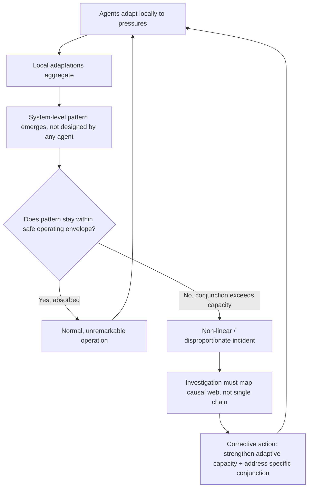

## Complex Adaptive Systems and Non-Linear Causation

### Definition and Scope

A complex adaptive system (CAS) is a system composed of many interacting agents (people, teams, organizations, software components) that adapt their behavior in response to each other and to the environment, producing system-level behavior that cannot be predicted simply by summing or tracing the behavior of individual agents. This concept extends directly from the previous chapter's introduction to systems thinking, sharpening the focus onto *why* causation in such systems is fundamentally non-linear, and what that implies for root cause investigation.

Non-linear causation means that the relationship between cause and effect is not proportional, not necessarily reversible, and not always traceable through a single deterministic path — a small input can produce a disproportionately large output (or vice versa), and the same input can produce different outputs depending on the system's state at the time.

### Key Points

- **Agents in a CAS adapt based on local information and local incentives**, not global system knowledge — this is why locally rational decisions (see resilience engineering, work-as-done) can aggregate into globally hazardous system states without any single agent intending or even perceiving that outcome.
- **Non-linearity breaks the core assumption of the 5 Whys**: that each "why" has one dominant, identifiable prior cause. In a CAS, an effect may have many simultaneous contributing causes of varying magnitude, none of which is individually necessary or sufficient.
- **Small causes can have disproportionately large effects** ("sensitive dependence on initial conditions," informally related to the popular "butterfly effect" framing from chaos theory) — this undermines the intuition that a catastrophic outcome must have had a proportionally large or obviously dangerous root cause.
- **The system's history matters**: because agents adapt over time, the same triggering event can produce different outcomes depending on the system's prior adaptations (compare: normalization of deviance as a path-dependent process).

### Characteristics of Complex Adaptive Systems

| Characteristic | Description | Investigative Implication |
| --- | --- | --- |
| **Multiple interacting agents** | Many components with partial autonomy and local decision rules | No single agent has full visibility into system-wide state |
| **Adaptation** | Agents change behavior based on feedback and experience | Past incidents/near-misses reshape future behavior, sometimes in unintended ways (see normalization of deviance) |
| **Emergence** | System-level patterns arise that are not explicitly programmed or designed into any individual agent | The "root cause" may be a pattern of interaction rather than a defect in any specific agent |
| **Self-organization** | Structure and order can arise without centralized control | Informal workarounds and communication channels often form organically and are invisible to formal organizational charts |
| **Non-linearity / disproportionality** | Small perturbations can cascade into large effects; large perturbations can be absorbed without effect | Severity of an incident does not reliably indicate the "size" or number of its contributing causes |
| **Path dependence** | The system's current state depends on its specific history, not just its current configuration | Two organizations with identical current procedures can have very different risk profiles due to different adaptation histories |

### Why Linear Root Cause Techniques Struggle Here

Standard techniques (5 Whys, fault trees) implicitly assume:

1. A **discoverable, singular causal path** from root cause to effect
2. **Causal proportionality** — bigger effects generally imply we should look for a correspondingly significant failure
3. **Independence** — that if you fix the identified failure, the same causal pathway is closed

In a genuinely complex adaptive system, all three assumptions can fail simultaneously:

- The causal "path" may actually be a **causal web**, where several marginal factors combine multiplicatively rather than additively (none of them individually would have caused the incident, but their conjunction did — sometimes called "conjunctive causation").
- A catastrophic outcome may trace back to a **minor, previously inconsequential** condition that happened to align with several other minor conditions at the same moment (this is one interpretation of why some catastrophic failures appear "disproportionate" to any single identifiable defect).
- Fixing the specific combination identified in the investigation **does not guarantee prevention of a recurrence**, because the system will adapt around the fix, potentially generating a new, unanticipated combination (this is a key argument for resilience engineering's emphasis on adaptive capacity over static barrier-fixing).

### Illustrative Example: Cascading Failure in a Tightly Coupled System

Consider a hospital's patient scheduling and staffing system:

- A minor software update slightly delays how quickly discharge status updates propagate to the bed-management dashboard (small, individually inconsequential change).
- On a normal day, staff compensate by manually checking bed status, absorbing the delay without incident (system's adaptive capacity handles the perturbation).
- On one particular day, the same delay coincides with a nurse shift change, an unusually high admission rate, and a separate IT issue affecting a paging system.
- No single one of these four factors would have caused a serious incident alone. Their conjunction, occurring within the same narrow time window, overwhelms the system's adaptive capacity, resulting in a patient safety incident.

A 5 Whys investigation focused on finding "the" root cause risks arbitrarily selecting one of the four contributing factors (often whichever is most visible or most recent) and treating it as sufficient explanation, when the actual causal structure was conjunctive and path-dependent — the same software delay had existed for weeks without incident.

### Diagram: Conjunctive (Non-Linear) Causation vs. Linear Chain (svg_diagram)

<svg xmlns="http://www.w3.org/2000/svg" viewBox="0 0 820 460">
<text x="410" y="30" text-anchor="middle" font-size="18" font-weight="bold" fill="#1a1a1a">Conjunctive Causation Model (svg_diagram)</text>
<rect x="40" y="70" width="160" height="50" rx="6" fill="#e0edfa" stroke="#2a6fa8" stroke-width="1.5" />
<text x="120" y="100" text-anchor="middle" font-size="10.5" fill="#333">Minor software delay</text>
<rect x="40" y="150" width="160" height="50" rx="6" fill="#eef7d4" stroke="#7a9f2a" stroke-width="1.5" />
<text x="120" y="180" text-anchor="middle" font-size="10.5" fill="#333">Nurse shift change</text>
<rect x="40" y="230" width="160" height="50" rx="6" fill="#fef3d6" stroke="#c9932a" stroke-width="1.5" />
<text x="120" y="260" text-anchor="middle" font-size="10.5" fill="#333">High admission rate</text>
<rect x="40" y="310" width="160" height="50" rx="6" fill="#fbe3c4" stroke="#d97706" stroke-width="1.5" />
<text x="120" y="340" text-anchor="middle" font-size="10.5" fill="#333">Paging system issue</text>
<line x1="200" y1="95" x2="380" y2="220" stroke="#888" stroke-width="1.5" />
<line x1="200" y1="175" x2="380" y2="225" stroke="#888" stroke-width="1.5" />
<line x1="200" y1="255" x2="380" y2="235" stroke="#888" stroke-width="1.5" />
<line x1="200" y1="335" x2="380" y2="240" stroke="#888" stroke-width="1.5" />
<circle cx="410" cy="230" r="40" fill="#f0e6f8" stroke="#7b3fa0" stroke-width="2" />
<text x="410" y="225" text-anchor="middle" font-size="10" fill="#333">Conjunction</text>
<text x="410" y="240" text-anchor="middle" font-size="10" fill="#333">(same window)</text>
<line x1="450" y1="230" x2="580" y2="230" stroke="#888" stroke-width="2.5" marker-end="url(#arrow4)" />
<rect x="580" y="200" width="180" height="60" rx="6" fill="#fde2e2" stroke="#c0392b" stroke-width="2" />
<text x="670" y="225" text-anchor="middle" font-size="11" font-weight="bold" fill="#333">Disproportionate</text>
<text x="670" y="242" text-anchor="middle" font-size="11" font-weight="bold" fill="#333">Incident</text>

<text x="410" y="410" text-anchor="middle" font-size="11" fill="#555">No single factor is individually necessary or sufficient</text>

</svg>

### Applying and Adapting the 5 Whys for Non-Linear Causation

Investigators can still use the 5 Whys productively in a CAS context, but with structural adaptations:

1. **Branch instead of chain**: At any given "why," allow multiple parallel contributing answers rather than forcing a single next cause.
2. **Ask "why did the system's adaptive capacity not absorb this?"** rather than only "why did this fail," directly connecting to the resilience engineering material — most days, a similar combination of minor factors doesn't cause incidents, so the question of what specifically overwhelmed the normal buffering capacity is often more revealing than tracing any one factor.
3. **Ask about timing and coincidence explicitly**: "Why did these factors co-occur in the same window?" is often a legitimate and necessary "why," even though it may point to a probabilistic/environmental factor rather than a clean deterministic cause.
4. **Resist forcing closure at five levels**: The number five is a heuristic, not a rule; conjunctive causal webs often require more branches and more depth than a strictly linear chain of the same apparent severity.

### Diagnostic Signals That a Failure Is Genuinely Non-Linear/Conjunctive

- Each individually identified contributing factor has occurred many times before **without** incident
- No single factor, when investigated in isolation, is judged severe enough to fully explain the outcome
- The specific combination of factors had **not co-occurred before** in the same way, or had done so extremely rarely
- Subject matter experts across different contributing factors each report "my part was working as expected"
- Attempting to trace a single dominant causal chain produces disagreement among investigators about which factor should be called "the" root cause

### Common Pitfalls

- **False reductionism**: Selecting one factor from a genuinely conjunctive set and elevating it to "the root cause" because it is the easiest to explain or assign to a specific team, producing a corrective action that addresses only one of several necessary conditions.
- **Ignoring base rates**: Concluding a factor is "the" cause because it was present at the time of the incident, without checking how often that same factor is present during normal, incident-free operation (a base-rate/near-miss comparison, consistent with the Safety-II approach from resilience engineering).
- **Assuming a fix eliminates the causal pathway**: In an adaptive system, removing one contributing factor from a conjunctive set does not guarantee safety if the system continues operating near the same adaptive-capacity boundary — a different combination can still emerge.
- **Overcorrecting into unfalsifiable complexity**: Labeling every incident as "just complex systems interacting" can become an excuse to avoid identifying any actionable corrective measure at all; genuinely conjunctive causation should still yield specific, testable claims about which combination of factors mattered and why.

### Mermaid Diagram: Adaptive Feedback Loop in a Complex System

**Related Topics:**

- Conjunctive vs. additive causal models in accident analysis
- Chaos theory concepts applied to organizational failure (sensitive dependence, path dependence)
- Rasmussen's dynamic safety model and migration toward the boundary of safe operation
- Functional Resonance Analysis Method (FRAM) for modeling functional variability and resonance
- Base-rate analysis and near-miss comparison (Safety-II data collection)
- STAMP/CAST as a formal method for modeling non-linear, control-based causation