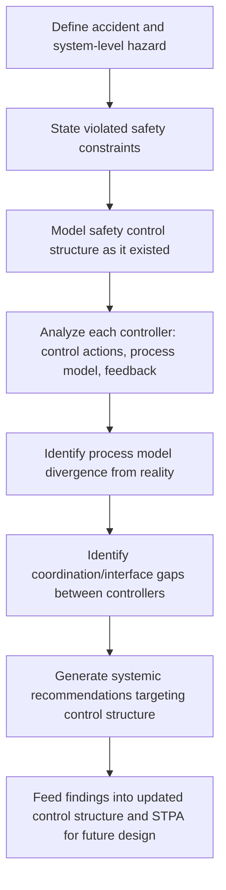

## STAMP: System-Theoretic Accident Model and Processes

### Definition and Scope

STAMP (System-Theoretic Accident Model and Processes) is a formal accident causation model developed by Nancy Leveson at MIT, built explicitly on the systems-thinking and control-theory foundations introduced in the previous two topics. Rather than modeling accidents as chains of failure events (as in Domino models, fault trees, or the 5 Whys) or as layered barrier breaches (Swiss Cheese Model), STAMP models accidents as the result of **inadequate control** over a system's safety constraints. It treats safety as an emergent, dynamic control problem rather than a reliability problem of preventing individual component failure.

STAMP directly operationalizes the concepts introduced earlier in this chapter — non-linear causation, complex adaptive systems, emergence, feedback loops, and control structures — into a structured modeling and investigation method. CAST (Causal Analysis based on System Theory) is the accident-investigation technique built on top of STAMP, used retrospectively after an incident; STPA (System-Theoretic Process Analysis) is the corresponding proactive hazard-analysis technique used during design. This entry focuses primarily on STAMP's underlying model and its investigative application (CAST).

### Key Points

- **Accidents result from inadequate enforcement of safety constraints**, not merely from component failure — this holds even when every individual component functioned exactly as designed, addressing the "emergent failure among correctly functioning parts" problem raised under systems thinking.
- **The central artifact is the safety control structure**: a hierarchical model of controllers (people, automated systems, organizations, regulators) and controlled processes, connected by control actions (commands, procedures) flowing down and feedback (sensor data, reports) flowing up.
- **STAMP explicitly includes the organizational and regulatory levels** in the same causal model as the technical/operational level, formally connecting Organizational and Management Root Causes to the technical failure in a single structured diagram rather than treating them as separate investigative tracks.
- **CAST does not ask "who is to blame" or "find the root cause"** in the singular sense — it asks, for every controller in the hierarchy, "why did this controller's model of the system diverge from reality, and why was the control action inadequate given that flawed model?"

### The Core STAMP Concepts

#### 1. Safety Constraints

A safety constraint is a condition that must hold for the system to remain safe (e.g., "two aircraft must never occupy the same airspace within a defined separation minimum"). STAMP treats an accident as evidence that one or more safety constraints were violated because the control structure failed to enforce them.

#### 2. The Safety Control Structure

A layered hierarchy, typically visualized top-to-bottom, in which each level exercises control over the level below it and receives feedback from it. A simplified generic structure:



```
Government / Regulators
|  (regulations, standards)      ^ (incident reports, audits)
        v                                |
Company Management
|  (policies, resource allocation) ^ (status reports, safety metrics)
        v                                |
Operations Management / Supervisors
|  (procedures, work orders)     ^ (performance data, incident reports)
        v                                |
Frontline Operators / Automation
|  (control actions)             ^ (sensor feedback)
        v                                |
Physical Process
```

Each downward arrow is a **control action**; each upward arrow is **feedback**. An accident, in STAMP terms, occurs when a control action was missing, inadequate, provided at the wrong time, or not properly executed — *or* when feedback that should have informed a control action was missing, delayed, or misinterpreted.

#### 3. Process Models

Every controller (human or automated) operates based on an internal **process model** — its mental or algorithmic understanding of the current state of the system it is controlling. Accidents frequently occur when a controller's process model diverges from the actual state of the controlled process (a formal generalization of "work-as-imagined vs. work-as-done" from the resilience engineering discussion, and of "mode confusion" from the design-causes discussion).

**Example of process model divergence**: An autopilot's internal model assumes airspeed sensors are functioning correctly; when a sensor fails and feeds erroneous data, the autopilot's control actions (based on its now-incorrect process model) become inappropriate for the actual physical state of the aircraft, even though the autopilot is executing its logic exactly as designed.

### Diagram: Generic STAMP Safety Control Structure (svg_diagram)

<svg xmlns="http://www.w3.org/2000/svg" viewBox="0 0 820 480">
<text x="410" y="30" text-anchor="middle" font-size="18" font-weight="bold" fill="#1a1a1a">STAMP Safety Control Structure (svg_diagram)</text>
<rect x="290" y="55" width="240" height="50" rx="6" fill="#f0e6f8" stroke="#7b3fa0" stroke-width="1.5" />
<text x="410" y="85" text-anchor="middle" font-size="12" fill="#333">Government / Regulators</text>
<line x1="360" y1="105" x2="360" y2="140" stroke="#2a6fa8" stroke-width="2" marker-end="url(#arrowd)" />
<text x="330" y="125" font-size="9" fill="#2a6fa8">regulations</text>
<line x1="460" y1="140" x2="460" y2="105" stroke="#c0392b" stroke-width="2" marker-end="url(#arrowu)" />
<text x="465" y="125" font-size="9" fill="#c0392b">audits</text>
<rect x="290" y="140" width="240" height="50" rx="6" fill="#e0edfa" stroke="#2a6fa8" stroke-width="1.5" />
<text x="410" y="170" text-anchor="middle" font-size="12" fill="#333">Company Management</text>
<line x1="360" y1="190" x2="360" y2="225" stroke="#2a6fa8" stroke-width="2" marker-end="url(#arrowd)" />
<text x="325" y="210" font-size="9" fill="#2a6fa8">policy/budget</text>
<line x1="460" y1="225" x2="460" y2="190" stroke="#c0392b" stroke-width="2" marker-end="url(#arrowu)" />
<text x="465" y="210" font-size="9" fill="#c0392b">status reports</text>
<rect x="290" y="225" width="240" height="50" rx="6" fill="#eef7d4" stroke="#7a9f2a" stroke-width="1.5" />
<text x="410" y="255" text-anchor="middle" font-size="12" fill="#333">Operations / Supervisors</text>
<line x1="360" y1="275" x2="360" y2="310" stroke="#2a6fa8" stroke-width="2" marker-end="url(#arrowd)" />
<text x="322" y="295" font-size="9" fill="#2a6fa8">procedures</text>
<line x1="460" y1="310" x2="460" y2="275" stroke="#c0392b" stroke-width="2" marker-end="url(#arrowu)" />
<text x="465" y="295" font-size="9" fill="#c0392b">incident data</text>
<rect x="290" y="310" width="240" height="50" rx="6" fill="#fef3d6" stroke="#c9932a" stroke-width="1.5" />
<text x="410" y="340" text-anchor="middle" font-size="12" fill="#333">Frontline Operator / Automation</text>
<text x="410" y="352" text-anchor="middle" font-size="9" fill="#666">(internal Process Model)</text>
<line x1="360" y1="360" x2="360" y2="395" stroke="#2a6fa8" stroke-width="2" marker-end="url(#arrowd)" />
<text x="330" y="380" font-size="9" fill="#2a6fa8">control action</text>
<line x1="460" y1="395" x2="460" y2="360" stroke="#c0392b" stroke-width="2" marker-end="url(#arrowu)" />
<text x="465" y="380" font-size="9" fill="#c0392b">sensor feedback</text>
<rect x="290" y="395" width="240" height="50" rx="6" fill="#fde2e2" stroke="#c0392b" stroke-width="1.5" />
<text x="410" y="425" text-anchor="middle" font-size="12" fill="#333">Physical Process</text>
</svg>

### CAST: Applying STAMP Retrospectively

CAST provides a structured investigative procedure. A typical sequence:

1. **Identify the system boundary and hazards involved** — define the accident and the system-level hazard(s) that led to it.
2. **Identify the safety constraints violated** — state, for each hazard, what constraint should have prevented it.
3. **Model the safety control structure** as it existed at the time of the incident (not an idealized version).
4. **Analyze each controller in the hierarchy**, from the physical process upward through frontline operators, supervisors, management, and regulators, asking for each:
   - What control actions did this controller provide or fail to provide?
   - What was this controller's process model at the time, and how did it diverge from reality?
   - What feedback did (or didn't) this controller receive, and why was it inadequate?
   - What contextual factors (workload, incentives, resource constraints — echoing organizational root causes) shaped the controller's decisions?
5. **Identify coordination and communication gaps between controllers** — many CAST findings emerge specifically from boundary/interface failures between adjacent levels or parallel controllers, not from any single level in isolation.
6. **Generate systemic recommendations** targeting the control structure itself (new feedback channels, revised authority/responsibility, improved process model accuracy) rather than only individual retraining or component replacement.

### CAST vs. the 5 Whys: A Direct Comparison

| Aspect | 5 Whys | CAST (STAMP-based) |
| --- | --- | --- |
| Causal model | Linear chain | Hierarchical control structure with feedback loops |
| Unit of analysis | Sequential events | Controllers, control actions, process models, feedback |
| Handles emergent/non-linear causation | Poorly — assumes one dominant path | Explicitly designed for this (see prior two topics) |
| Includes organizational/regulatory levels natively | Only if investigator manually extends the chain | Built into the structure from the start |
| Output | A short causal chain, often terminating at one "root cause" | A structured map of control and feedback failures across multiple levels |
| Resource intensity | Low; usable in most routine investigations | High; typically reserved for complex, high-consequence, or systemic incidents |
| Best suited for | Simple, well-understood, loosely coupled failures | Complex, tightly coupled, sociotechnical systems (aviation, healthcare, process safety, software-intensive systems) |

**Practical guidance**: STAMP/CAST is not a replacement for the 5 Whys in all cases — it is the appropriate escalation when an investigation reveals signals of non-linear or conjunctive causation (see prior topic), multiple correctly functioning components producing an emergent hazard, or significant organizational/regulatory involvement that a simple chain cannot adequately represent.

### Mermaid Diagram: CAST Investigative Procedure



### Worked Example Fragment

Using the earlier warehouse robot/worker collision example from the systems-thinking topic:

- **Safety constraint**: Robots and human workers must never occupy overlapping physical space without a mediating control action.
- **Physical process controller (robot)**: Executed its path exactly per its control algorithm — no fault here in isolation.
- **Frontline worker**: Process model assumed the previously static zone assignment was still valid; no feedback informed them of the robot's real-time path.
- **Scheduling system (automated controller)**: Its process model of "worker location" was based on static zone data, diverging from actual dynamic worker movement — a process model flaw.
- **Operations management**: Did not update the scheduling system's design assumptions after a workflow change; received no feedback flagging that operational reality had diverged from design assumptions (a missing feedback loop).
- **Company management**: Resourced the scheduling system's initial design but did not establish a governance process requiring periodic revalidation against operational drift (an organizational-level control gap, directly linking back to Organizational and Management Root Causes).

The CAST conclusion is not "the robot failed" or "the worker was careless," but a structured description of process-model divergence and missing feedback loops distributed across four levels of the control hierarchy, each contributing to why the safety constraint was not enforced.

### Common Pitfalls in Applying STAMP/CAST

- **Reverting to component-failure language mid-analysis**: Investigators trained on linear models often unconsciously translate CAST findings back into "who screwed up" narratives; the discipline of the method requires consistently asking about control actions and process models, not fault.
- **Building an idealized control structure instead of the actual one**: The safety control structure must reflect how control and feedback actually flowed at the time of the incident (including informal channels), not the org chart or procedure manual's idealized version — this echoes the work-as-imagined/work-as-done distinction.
- **Treating CAST as a checklist rather than a structured inquiry**: Mechanically filling in a template for each controller without genuinely investigating process model divergence and feedback adequacy reduces CAST to a relabeled linear analysis.
- **Underestimating time and expertise requirements**: [Inference] CAST investigations are widely reported in the systems-safety literature as significantly more time- and expertise-intensive than a standard 5 Whys or fault tree, since they require constructing and validating a full control structure across multiple organizational levels — this is a practical adoption barrier frequently cited by practitioners, though the specific effort varies substantially with system scope.

**Related Topics:**

- STPA (System-Theoretic Process Analysis) as the proactive, design-phase counterpart to CAST
- Nancy Leveson's "Engineering a Safer World" as the foundational text
- Process model divergence and its relationship to mode confusion and design-related causes
- Feedback loop design and safety control structure mapping
- Comparative case studies: STAMP/CAST applied to aviation, healthcare, and software-intensive system accidents
- Integrating CAST findings with Just Culture behavior classification at each control level