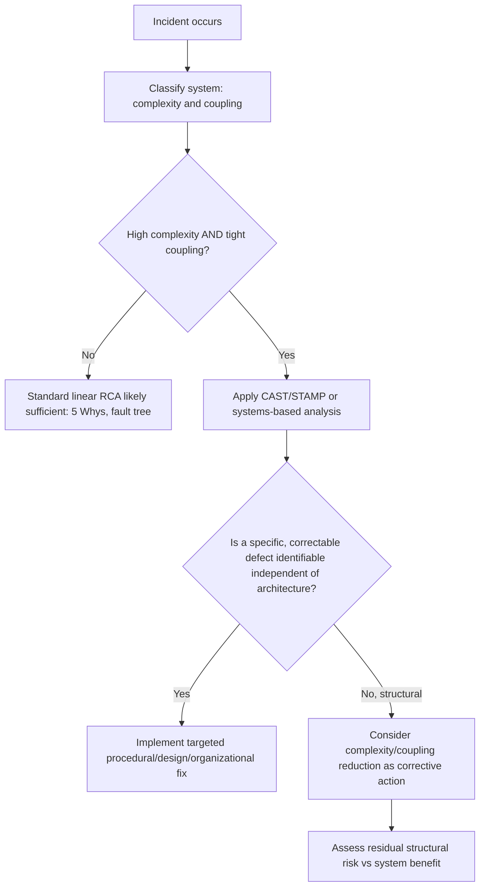

## Normal Accident Theory

### Definition and Scope

Normal Accident Theory (NAT) is a sociological framework developed by Charles Perrow, first presented in his 1984 book *Normal Accidents: Living with High-Risk Technologies*, following his analysis of the Three Mile Island nuclear accident. NAT's central and most provocative claim is that in systems with certain structural properties, accidents are not merely possible but statistically **inevitable** over a sufficiently long time horizon — hence "normal." This directly challenges the premise underlying most root cause techniques (5 Whys, fault trees, CAST/STAMP): that every accident has a preventable, identifiable cause which, once fixed, eliminates the risk of recurrence.

This topic was introduced briefly under Introduction to Systems Thinking for Investigators; here it is developed in full as a standalone analytical framework, since it carries specific and sometimes uncomfortable implications for how investigators should scope their conclusions and recommendations.

### Key Points

- **NAT's core claim**: systems characterized by high **interactive complexity** and **tight coupling** will experience accidents that are structural and statistical properties of the system's design, not the result of correctable individual or organizational failures alone.
- **This does not mean investigation is pointless** — it means the appropriate conclusion for some accidents is that the system's fundamental architecture (not a specific fixable defect) generates residual risk that can be reduced but not eliminated through the same design paradigm.
- **NAT is often positioned in tension with High Reliability Organization (HRO) theory**, which argues that certain organizations achieve remarkably low accident rates *despite* operating complex, tightly coupled systems, through specific organizational practices — the two theories represent an important ongoing debate in safety science about how much of accident causation is structurally determined versus organizationally controllable.
- **NAT reframes the investigative question** from "what defect caused this, and how do we eliminate it" to, for some systems, "does the fundamental architecture of this system make accidents of this class inevitable, and if so, is the residual risk acceptable given the system's benefits?"

### The Two Defining Dimensions

Perrow's framework classifies systems along two independent axes, previously introduced in the Systems Thinking topic and expanded here:

#### 1. Interactive Complexity

The degree to which components interact in ways that are unfamiliar, unplanned, or not visible/comprehensible to operators.

- **Linear interactions**: Components interact in expected, visible, and planned sequences (most assembly-line manufacturing)
- **Complex interactions**: Components interact in ways that may be unfamiliar, indirect, or not immediately observable, including common-mode connections (a single support system affecting many seemingly unrelated components) and feedback loops that are not obvious to operators

#### 2. Coupling

The degree to which processes are time-dependent and inflexible, leaving little slack for intervention.

- **Loose coupling**: Delays are possible, processing order can vary, buffers/redundancies absorb disturbances, alternative methods exist
- **Tight coupling**: Time-dependent processes with no slack, invariant sequences, a single method to achieve a goal, buffers and redundancies are limited or designed-in only

### The Perrow Matrix

|  | **Linear Interactions** | **Complex Interactions** |
| --- | --- | --- |
| **Loose Coupling** | Most manufacturing, most universities/R&D | Universities, some multi-goal agencies (unexpected interactions occur but slowly, allowing adaptation) |
| **Tight Coupling** | Dams, power grids, rail transport (sequential, less slack, but interactions are largely comprehensible) | **Nuclear power plants, chemical plants, aircraft, space missions** — the "normal accident" zone: unexpected interactions combine with essentially no slack time for intervention |

Systems falling in the upper-right of this matrix (high complexity, tight coupling) are where Perrow argues normal accidents are most likely to originate, because:

- Complex interactions mean an operator may not correctly diagnose what is actually happening (their process model, in STAMP terms, diverges from reality) precisely because the interaction was not anticipated in training or design.
- Tight coupling means there is insufficient time to observe, diagnose, and correct before the disturbance propagates into a serious consequence.

### Illustrative Example: Three Mile Island

Perrow's original case study: a relatively minor initial failure (a stuck relief valve) triggered a cascade of confusing, indirect indicator readings that operators misinterpreted, because the plant's complex interactions meant that a single physical fault produced multiple, seemingly unrelated symptoms across the control room — some indicators contradicted others. [Unverified] Perrow's specific interpretation — that the accident was substantially a product of the plant's structural complexity and coupling rather than primarily operator error — has been subject to ongoing debate among safety researchers, some of whom emphasize training and interface design deficiencies (procedural/design causes, as covered earlier) as more correctable factors than NAT's framing suggests; this is a genuine area of disagreement in the safety-science literature rather than a settled consensus.

### Diagram: The Perrow Matrix (svg_diagram)

<svg viewBox="0 0 820 460" xmlns="http://www.w3.org/2000/svg">
<text x="410" y="30" text-anchor="middle" font-size="18" font-weight="bold" fill="#1a1a1a">Perrow's Interaction/Coupling Matrix (svg_diagram)</text>
<line x1="150" y1="80" x2="150" y2="400" stroke="#333" stroke-width="1.5"/>
<line x1="150" y1="400" x2="750" y2="400" stroke="#333" stroke-width="1.5"/>
<text x="450" y="430" text-anchor="middle" font-size="12" fill="#333">Interactive Complexity →</text>
<text x="90" y="240" text-anchor="middle" font-size="12" fill="#333" transform="rotate(-90 90 240)">Coupling →</text>

<text x="250" y="70" text-anchor="middle" font-size="11" fill="#555">Linear</text>

<text x="650" y="70" text-anchor="middle" font-size="11" fill="#555">Complex</text>

<text x="130" y="140" text-anchor="end" font-size="11" fill="#555">Tight</text>

<text x="130" y="340" text-anchor="end" font-size="11" fill="#555">Loose</text>

<rect x="160" y="220" width="280" height="170" fill="#e3f5e1" stroke="#3a8f3a" stroke-width="1"/>
<text x="300" y="300" text-anchor="middle" font-size="11" fill="#333">Universities, R&D</text>
<text x="300" y="316" text-anchor="middle" font-size="10" fill="#555">(loose/linear: highly forgiving)</text>
<rect x="440" y="220" width="300" height="170" fill="#fef3d6" stroke="#c9932a" stroke-width="1"/>
<text x="590" y="300" text-anchor="middle" font-size="11" fill="#333">Multi-goal agencies</text>
<text x="590" y="316" text-anchor="middle" font-size="10" fill="#555">(complex but loose: adapts slowly)</text>
<rect x="160" y="90" width="280" height="130" fill="#eef7d4" stroke="#7a9f2a" stroke-width="1"/>
<text x="300" y="160" text-anchor="middle" font-size="11" fill="#333">Dams, power grids, rail</text>
<text x="300" y="176" text-anchor="middle" font-size="10" fill="#555">(tight but linear: comprehensible)</text>
<rect x="440" y="90" width="300" height="130" fill="#fde2e2" stroke="#c0392b" stroke-width="2"/>
<text x="590" y="150" text-anchor="middle" font-size="12" font-weight="bold" fill="#7a1f1f">Nuclear plants, chemical</text>
<text x="590" y="168" text-anchor="middle" font-size="12" font-weight="bold" fill="#7a1f1f">plants, aircraft</text>
<text x="590" y="186" text-anchor="middle" font-size="10" fill="#7a1f1f">"Normal Accident" zone</text>
</svg>

### Why This Challenges Standard Root Cause Techniques

NAT introduces a specific tension with the 5 Whys and similar linear/singular-cause methods:

1. **The 5 Whys assumes each accident has a preventable cause chain terminating in an actionable fix.** NAT argues that for systems in the high-complexity/tight-coupling quadrant, some accidents result from the *interaction* of the system's structural properties with an essentially unpredictable combination of minor conditions — closely related to the conjunctive, non-linear causation discussed in the previous topic.
2. **"Fixing" the identified proximate cause may not reduce the underlying accident rate** if the fix adds further complexity (e.g., adding another automated safety system, which itself introduces new complex interactions and potential common-mode failure paths) — this is sometimes called the "paradox of safety systems adding complexity."
3. **Investigators must be willing to conclude, in some cases, that residual risk is structural**, and that the organizationally honest recommendation may be to reduce complexity or coupling directly (simplify the system, add genuine slack/buffers) rather than searching for one more specific defect to patch.

### NAT vs. High Reliability Organization (HRO) Theory

|  | Normal Accident Theory | HRO Theory |
| --- | --- | --- |
| **Core claim** | Accidents in complex, tightly coupled systems are structurally inevitable over time | Certain organizations achieve very low accident rates despite complexity/coupling, through specific practices |
| **Locus of risk** | System architecture (complexity × coupling) | Organizational practices (preoccupation with failure, reluctance to simplify, deference to expertise, resilience, sensitivity to operations) |
| **Implication for investigators** | Some residual risk cannot be engineered away without reducing complexity/coupling | Investigation should focus on why organizational practices did or didn't catch the developing problem |
| **Relationship to this chapter** | Extends complex adaptive systems / non-linear causation into a predictive theory of accident inevitability | Complements resilience engineering's emphasis on adaptive capacity as the source of safety |

[Inference] Most contemporary safety researchers treat NAT and HRO theory as complementary rather than strictly opposed — HRO practices can reduce the *frequency* and *severity* of normal accidents without necessarily disproving Perrow's claim that some non-zero residual risk remains structurally embedded in sufficiently complex, tightly coupled systems. This reconciliation is a common position in the literature but individual researchers vary in how much weight they place on each theory.

### Practical Application for Investigators

- **Use the Perrow matrix as a scoping tool early in an investigation**: classifying the system's position on the complexity/coupling matrix helps calibrate expectations about whether a clean, singular root cause is likely to be found, or whether a CAST/STAMP-style multi-controller analysis (or explicit acknowledgment of structural risk) is more appropriate.
- **Distinguish between a normal accident and a preventable one**: not every accident in a complex, tightly coupled system is a "normal accident" in Perrow's sense — many still trace to genuinely correctable organizational, procedural, or design root causes (covered in earlier chapters). NAT should not be invoked as a blanket excuse to avoid identifying correctable factors; it applies specifically when the causal analysis genuinely cannot locate a single fixable defect independent of the system's basic architecture.
- **Consider coupling and complexity reduction as valid corrective actions**: alongside procedural, training, and design fixes, recommendations can include reducing tight coupling (adding buffers, slack, or redundant time) or reducing interactive complexity (simplifying interfaces, reducing common-mode dependencies), rather than only adding more monitoring or automation.

### Common Pitfalls

- **Using NAT as a blanket excuse to avoid accountability**: concluding "this was a normal accident" prematurely, without first exhausting genuinely correctable procedural, training, design, and organizational root causes, undermines both the investigation's credibility and Just Culture principles.
- **Confusing complexity with mere complication**: a system can have many parts (complicated) without having unfamiliar, indirect, or poorly understood interactions (complex in Perrow's specific sense) — the matrix classification depends on interaction *comprehensibility*, not part count.
- **Ignoring coupling when assessing corrective actions**: adding more automated safeguards to a tightly coupled system can inadvertently increase interactive complexity, potentially increasing rather than decreasing normal-accident risk — a corrective action should be evaluated against both matrix dimensions, not just the immediate defect.
- **Treating NAT as fully settled**: as noted above, NAT's specific claims (particularly regarding Three Mile Island and the degree of true inevitability) remain subject to genuine academic debate, and the theory's predictive power versus HRO's organizational-practice explanations is not universally agreed upon.

### Mermaid Diagram: Investigative Decision Point Using NAT

**Related Topics:**

- High Reliability Organization (HRO) theory and its five core practices
- Three Mile Island, Bhopal, and Challenger as classic NAT case studies
- Complexity and coupling reduction as design-phase corrective strategies
- STAMP/CAST as a method suited to high-complexity, tightly-coupled system investigation
- The "paradox of safety systems" — added automation increasing interactive complexity
- Risk acceptance frameworks for structurally embedded residual risk