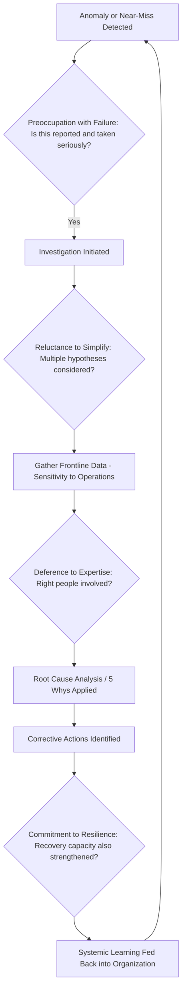

## High Reliability Organization Principles

### Overview

High Reliability Organizations (HROs) are organizations that operate in hazardous, complex domains — nuclear power, aviation, aircraft carriers, air traffic control, emergency medicine — yet sustain far fewer catastrophic failures than their risk profile would predict. HRO theory, developed by researchers including Karl Weick, Kathleen Sutcliffe, Todd LaPorte, and Gene Rochlin, examines how these organizations achieve consistent safety despite operating under trying conditions: tight coupling, high complexity, and severe consequences for error.

For Root Cause Analysis (RCA) and the "5 Whys," HRO principles matter because they reframe causation itself. Instead of treating failures as isolated technical or human errors, HRO thinking treats organizations as complex adaptive systems where causes are distributed, latent, and often organizational or cultural rather than purely mechanical. This directly shapes how deep and how broad a "Why" chain needs to go before a root cause is genuinely found.

---

### The Five Core Principles

Weick and Sutcliffe identified five hallmark practices ("mindful organizing") that distinguish HROs from ordinary organizations.

#### 1. Preoccupation with Failure

HROs treat every small anomaly, near-miss, or deviation as a symptom of a potential systemic problem, rather than as noise to be dismissed.

- **Key Points**
  - Near-misses are actively reported and investigated, not hidden or normalized.
  - Success is not read as proof of safety — it may simply mean latent failures haven't yet aligned.
  - Reporting systems reward disclosure rather than punish it.
- **Example**

  A hospital ICU logs every medication near-miss, even ones caught before reaching the patient, and reviews them weekly to detect drift in procedure — rather than only investigating after an actual adverse event occurs.

#### 2. Reluctance to Simplify Interpretations

HROs resist the human tendency to reduce complex situations to comfortable, familiar explanations.

- **Key Points**
  - Diverse perspectives (different shifts, roles, seniority levels) are deliberately sought out to avoid a single simplified narrative.
  - Skepticism toward "we've seen this before" pattern-matching, since superficially similar events can have different underlying causes.
  - Categorization schemes are treated as provisional, not definitive.
- **Example**

  After a flight delay, an airline's ops team resists attributing it solely to "weather" and instead cross-checks crew scheduling, maintenance logs, and gate availability, since multiple contributing factors are the norm rather than the exception.

#### 3. Sensitivity to Operations

HROs maintain a real-time, ground-level awareness of how work is actually being performed — not just how it is designed on paper.

- **Key Points**
  - Frontline operators' situational awareness is treated as a primary data source, not a secondary one.
  - Gaps between "work as imagined" (procedures, org charts) and "work as done" (actual practice) are actively surfaced.
  - Frequent, informal communication across hierarchy levels supplements formal reporting.
- **Example**

  A nuclear plant control room maintains continuous cross-checking between operators, where any operator can verbally flag an unexpected reading, and that flag is treated as significant even if instrumentation shows nominal values.

#### 4. Commitment to Resilience

HROs assume failures will occur despite prevention efforts, and invest in the capacity to detect, contain, and recover from errors before they escalate.

- **Key Points**
  - Resilience is distinguished from mere robustness: it is the capacity to absorb strain and bounce back, not just resist damage.
  - Cross-training and improvisational capability are cultivated so staff can respond to unanticipated situations.
  - Systems are designed with recovery mechanisms (redundancy, fail-safes, buffers), assuming that prevention alone is insufficient.
- **Example**

  An aircraft carrier flight deck crew trains extensively for degraded-mode operations (partial equipment failure, injured crew) so that if a real event occurs, the team can reorganize its work assignments on the fly rather than freezing.

#### 5. Deference to Expertise

Decision-making authority migrates to the person with the most relevant expertise for the situation at hand, regardless of formal rank.

- **Key Points**
  - Hierarchy governs normal operations, but during anomalies, authority shifts to whoever has the deepest situational knowledge.
  - Senior leaders are expected to listen to frontline experts rather than override them by rank alone.
  - This requires a culture where junior staff feel safe speaking up (related to "psychological safety").
- **Example**

  During an in-flight emergency, a commercial pilot may defer to a flight attendant's or maintenance technician's specific observation about the aircraft's condition, even though the pilot holds ultimate authority.

---

### Structural and Cultural Supports

Beyond the five principles, HRO literature identifies underlying conditions that make mindful organizing possible:

| Support | Description |
| --- | --- |
| Redundancy | Overlapping systems, checks, and personnel so a single failure point does not cascade |
| Decentralization | Local authority for anomaly response, paired with centralized standards for routine work |
| Continuous learning | Systematic after-action review distinct from blame-assignment |
| Just culture | Distinguishes honest error, at-risk behavior, and reckless behavior, applying different responses to each |
| Trust and psychological safety | Staff report concerns without fear of retaliation |

---

### Relationship to Root Cause Analysis and the 5 Whys

HRO principles directly critique naive applications of the 5 Whys technique:

- **Reluctance to simplify** warns against stopping a Why-chain at the first plausible-sounding answer. A single linear chain ("Why did the machine fail? → worn part. Why was it worn? → not replaced on schedule. Why? → maintenance backlog.") may miss parallel contributing factors that a strictly linear method doesn't surface.
- **Preoccupation with failure** argues for investigating near-misses with the same rigor as actual incidents, expanding the scope of what RCA is triggered on.
- **Sensitivity to operations** pushes RCA practitioners to interview frontline staff directly rather than relying solely on procedure documents, since the actual causal chain often runs through informal workarounds.
- **Deference to expertise** implies that RCA teams should include the people with direct operational knowledge of the failure point, not just supervisors or safety officers.
- **Commitment to resilience** shifts some RCA output away from purely eliminating the root cause and toward strengthening detection and recovery capacity, since not all latent conditions can be fully removed.

Practitioners applying 5 Whys within an HRO-informed context often supplement it with branching techniques (fishbone/Ishikawa diagrams, fault tree analysis) precisely because a strictly linear Why-chain can under-represent the multi-causal nature that HRO theory emphasizes. [Inference] The degree to which an organization should branch versus stay linear depends on the complexity and coupling of the specific system under review, and is not fully standardized across industries.

---

### Illustrative Diagram: HRO Principles Feeding into Causal Investigation (svg_diagram)

---

### Common Pitfalls When Applying HRO Thinking to RCA

- **Key Points**
  - Treating HRO principles as a checklist rather than a cultural orientation — genuine mindful organizing requires sustained practice, not a one-time audit.
  - Allowing "commitment to resilience" to become an excuse for not addressing root causes (over-relying on recovery instead of prevention).
  - Letting "deference to expertise" collapse into deference to seniority, which is the opposite of the intended principle.
  - Assuming HRO status is permanent; research indicates reliability can degrade if organizations become complacent after a long incident-free period. [Inference] This drift is documented in case studies (e.g., Columbia shuttle disaster analyses) but the rate and predictors of such drift vary by organization and are not precisely quantifiable in general.

---

### Related Topics

- Normal Accident Theory (Charles Perrow) — contrasting view on inevitability of failure in tightly coupled systems
- Swiss Cheese Model of accident causation
- Just Culture frameworks
- Psychological safety in teams (Amy Edmondson's research)
- Fishbone (Ishikawa) diagrams as a complement to 5 Whys
- Fault Tree Analysis (FTA) for multi-causal systems
- Resilience Engineering as a distinct discipline from traditional safety management
- Work-as-imagined vs. work-as-done gap analysis
- Case studies: Diablo Canyon nuclear plant, U.S. Navy aircraft carrier operations, air traffic control systems