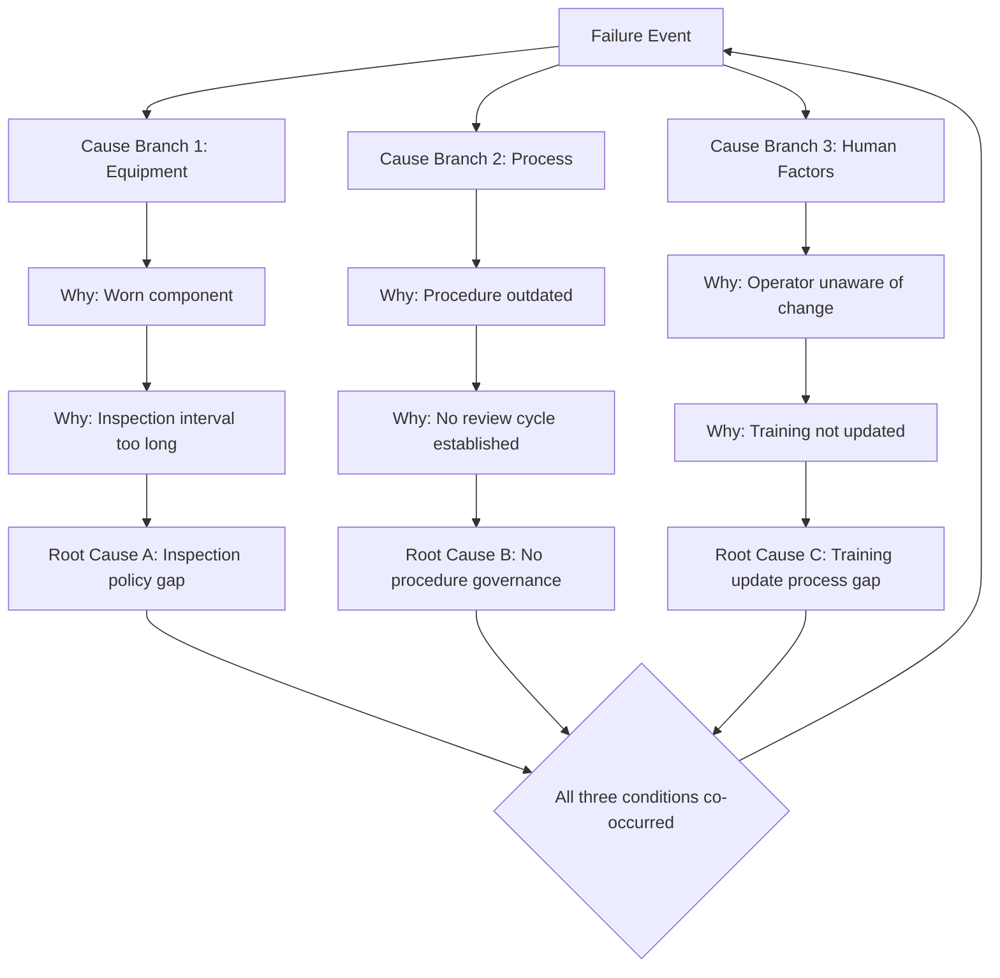

## Multiple Root Causes and Causal Interaction

### Overview

Many failure investigation methods, including the classic 5 Whys, implicitly assume a single linear causal chain: one root cause leads to one intermediate cause leads to the observed failure. In real complex systems, failures frequently arise from the interaction of multiple independent conditions, none of which would have caused the failure alone. This section covers how to identify, represent, and reason about multiple root causes and their interactions, and how this reshapes RCA practice.

---

### Why Single-Cause Models Break Down

- **Key Points**
  - Complex systems (organizational, mechanical, socio-technical) typically have layered defenses; a single failure is usually insufficient to breach all layers.
  - A linear "Why" chain naturally terminates the first time an investigator finds a plausible-sounding answer, which can obscure co-occurring contributing factors.
  - Confirmation bias leads investigators to stop at the first cause that fits a pre-existing narrative, rather than continuing to search for parallel contributors.
  - Tightly coupled systems (per Charles Perrow's Normal Accident Theory) allow small, independent deviations to combine unpredictably, producing outcomes not attributable to any single deviation.

[Inference] The degree to which any specific incident is genuinely multi-causal versus dominated by one overwhelming factor cannot be determined in advance; this must be established empirically per investigation rather than assumed.

---

### Types of Causal Interaction

#### 1. Necessary-but-Insufficient Conditions

Each cause is required for the failure to occur, but no single one is sufficient on its own.

- **Example**

  A server outage requires both (a) a memory leak in an application and (b) disabled auto-restart monitoring. Either condition alone results in either a slow degradation that gets caught, or a memory leak that gets flagged and restarted — neither alone causes an outage.

#### 2. Latent Conditions Activated by a Trigger

A dormant weakness exists in the system for a long time; an unrelated triggering event activates it into a failure.

- **Example**

  A safety interlock was miswired during installation months earlier (latent condition). A power fluctuation (active trigger) causes the interlock to fail exactly when needed.

#### 3. Common-Cause Failures

A single upstream factor independently affects multiple components that were assumed to be independent, defeating redundancy.

- **Example**

  Two supposedly independent backup generators both fail during a flood because they share the same physical location and power supply.

#### 4. Cascading/Escalating Interactions

An initial cause triggers a chain of secondary failures, each of which becomes a cause in its own right, and the causal graph becomes recursive rather than a straight line.

- **Example**

  A software bug causes elevated CPU load → load triggers autoscaling → autoscaling exhausts a connection pool limit → pool exhaustion causes cascading timeouts across dependent services.

#### 5. Reinforcing Feedback Loops

Two or more factors amplify each other over time rather than existing as a simple cause-effect pair.

- **Example**

  Understaffing causes fatigue-related errors, which increase workload for remaining staff (due to error correction), which increases fatigue further, compounding the original condition.

---

### Representing Multi-Causal Structures

#### Fishbone (Ishikawa) Diagram

Groups candidate causes into categories (commonly: People, Process, Equipment, Materials, Environment, Management) branching into a central effect, allowing multiple independent branches to be explored in parallel rather than sequentially.

#### Fault Tree Analysis (FTA)

Uses formal logic gates to represent how causes combine:

- **AND gate**: all input conditions must be present for the output failure to occur (models necessary-but-insufficient conditions).
- **OR gate**: any single input condition is sufficient (models independent alternate pathways to the same failure).

$$P(\text{Top Event}) = \begin{cases} \prod_i P(C_i) & \text{AND gate (independent events)} \\ 1 - \prod_i (1 - P(C_i)) & \text{OR gate (independent events)} \end{cases}$$

Where $P(C_i)$ is the probability of contributing cause $i$. [Inference] These formulas assume statistical independence between contributing causes; in practice, causes are often correlated (e.g., both stemming from the same understaffing condition), which requires more complex joint probability modeling and is a known limitation of naive FTA quantification.

#### Bowtie Model

Combines a fault-tree-style "left side" (multiple causes converging on a central event) with an event-tree-style "right side" (multiple possible consequences diverging from that event), explicitly separating preventive controls from mitigative controls.

#### Branching 5 Whys ("Why Tree")

Extends the standard 5 Whys by allowing each "Why" question to produce multiple parallel answers rather than one, forming a tree instead of a chain.

---

### Illustrative Diagram: Branching Causal Tree vs. Linear 5 Whys (svg_diagram)

---

### Practical Method for Handling Multiple Root Causes in RCA

- **Key Points**
  1. Do not stop the first Why-chain at the first satisfying answer; explicitly ask "are there other independent factors that also had to be true for this to happen?"
  2. For each major contributing factor identified, run a separate Why-chain rather than merging factors prematurely into one narrative.
  3. Classify each identified cause as necessary, sufficient, or contributing, to clarify how it combines with others.
  4. Check for common-cause relationships between seemingly independent branches (e.g., do two "independent" causes trace back to the same understaffing or budget decision?).
  5. Validate the combined causal model against the timeline of the actual incident — the causes and their interaction should reconstruct the specific sequence observed, not just a generic plausible story.
- **Output**

  A validated multi-causal model typically ends in either a fault tree, a bowtie diagram, or an annotated fishbone diagram — rather than a single terminal "root cause" statement — with explicit notation of how the branches combine (AND/OR logic).

---

### Common Pitfalls

- **Premature closure**: stopping at the first identified cause because it is sufficient to explain the failure narratively, even though other necessary conditions existed.
- **False independence**: treating two causes as unrelated when they in fact share an upstream common cause, leading to incomplete corrective actions (fixing only one branch leaves the system vulnerable to the same underlying issue resurfacing differently).
- **Overcomplication**: adding excessive branches for minor contributing factors that had negligible causal weight, diluting focus from the dominant contributors. [Inference] Determining which contributing factors are "negligible" versus "material" is a judgment call that depends on the specific risk tolerance and context of the organization, not a fixed threshold.
- **Blame diffusion**: using "multiple root causes" as a way to spread responsibility so thin that no corrective action is clearly assigned to any single owner.

---

### Related Topics

- Normal Accident Theory (Charles Perrow) and tight coupling
- Fault Tree Analysis (FTA) quantification methods
- Bowtie risk analysis method
- Swiss Cheese Model of accident causation
- Common-cause failure analysis in reliability engineering
- Systems-Theoretic Accident Model and Processes (STAMP/CAST)
- High Reliability Organization principles (preceding topic)
- Fishbone/Ishikawa diagram construction techniques
- Timeline reconstruction and event sequence diagramming in incident investigation