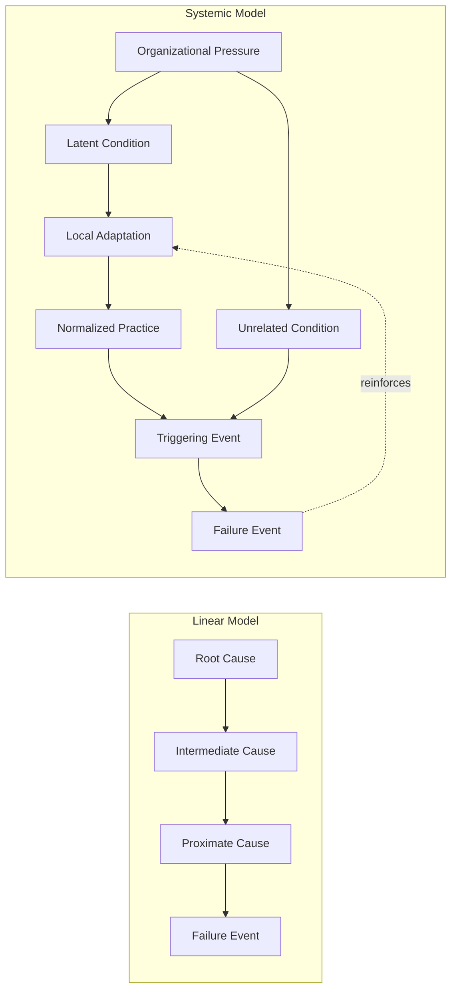

## Limits of Linear RCA in Complex Systems

### Overview

Linear Root Cause Analysis — exemplified by the classic 5 Whys — models failure as a single causal chain: A causes B causes C causes the observed event. This model is effective for simple, tightly-specified technical faults but breaks down as system complexity increases. This section examines where and why linear RCA fails in complex socio-technical systems, and what theoretical frameworks explain the failure.

---

### Defining the Linear Model

The linear model assumes:

$$E \leftarrow C_1 \leftarrow C_2 \leftarrow C_3 \leftarrow \ldots \leftarrow C_n$$

Where $E$ is the observed effect and each $C_i$ is a single necessary and sufficient predecessor cause of $C_{i-1}$, terminating at a single root cause $C_n$. This structure implies: one path, one direction, one terminus, and — critically — that removing $C_n$ prevents recurrence of $E$.

- **Key Points**
  - The model works well for simple, decomposable systems where components fail independently and effects propagate predictably.
  - It assumes causal chains are stable and repeatable — the same cause will reliably produce the same effect.
  - It assumes the investigator can trace backward through a single dominant pathway without loss of information.

---

### Where the Linear Model Breaks Down

#### 1. Non-Decomposability

Complex systems often cannot be understood by analyzing components in isolation, because system-level behavior emerges from component interactions rather than from any individual component's properties.

- **Example**

  An air traffic control near-miss cannot be fully explained by examining the radar system, the controller's workload, and the pilot's response separately — the interaction between delayed radar refresh, controller fatigue, and ambiguous radio phrasing produced a hazard that none of the three would have produced alone.

#### 2. Multiple Simultaneous Causal Paths

As covered under multi-causal analysis, real failures frequently involve several independently necessary conditions combining (AND logic) or several sufficient alternative pathways (OR logic) rather than a single chain. A strictly linear Why-chain forces the investigator to arbitrarily pick one path and suppress the others.

#### 3. Feedback Loops and Circular Causality

Linear chains are inherently acyclic (they terminate). Real systems often contain feedback loops where effects reinforce or dampen their own causes over time, which a terminating Why-chain structurally cannot represent.

- **Example**

  Alarm fatigue: excessive false alarms (effect of poor sensor calibration) cause operators to ignore alarms (adaptive response), which becomes a contributing cause to missing a real alarm later. The "effect" (ignoring alarms) becomes a "cause" (missed detection) in a loop, not a chain.

#### 4. Emergent Behavior

In complex adaptive systems, failure can emerge from the normal, correct functioning of every individual component — there may be no faulty component to find at all.

- **Example**

  In the 2010 "Flash Crash," individual high-frequency trading algorithms each behaved exactly as designed; the crash emerged from their aggregate interaction under specific market conditions, not from any single algorithm malfunctioning.

#### 5. Drift and Latent Conditions Over Time

Linear RCA typically investigates a bounded window around the incident. Many failures result from slow, incremental "practical drift" — small adaptations and normalizations of deviance accumulating over months or years — that a short backward chain does not capture.

- **Example**

  The Space Shuttle Columbia disaster investigation (Vaughan's "Normalization of Deviance") found that foam-shedding had been observed and tolerated across many prior missions; no single Why-chain from the final flight adequately captures a drift process occurring across a decade of organizational history.

#### 6. Hindsight Bias in Chain Construction

Once an outcome is known, investigators tend to retrospectively construct a clean, linear-seeming chain of causes that appears more inevitable and more linear than the situation was as it actually unfolded in real time — a documented cognitive bias in accident investigation literature. [Inference] The precise magnitude of hindsight bias in any specific investigation is not directly measurable; its existence and general direction (making outcomes seem more foreseeable/linear after the fact) is well-supported in the safety science literature, but no universal correction factor exists.

#### 7. Coupling and Interaction Complexity (Perrow's Framework)

Charles Perrow's Normal Accident Theory classifies systems along two axes:

|  | Loose Coupling | Tight Coupling |
| --- | --- | --- |
| **Linear Interactions** | Predictable, recoverable — linear RCA works well | Predictable but fast-moving — requires speed, less analysis time |
| **Complex Interactions** | Unpredictable but recoverable — needs more branching analysis | High-risk zone — Perrow argues accidents are "normal" (statistically inevitable) here |

Linear 5 Whys is best suited to the top-left quadrant and progressively less adequate moving toward the bottom-right.

---

### Illustrative Diagram: Linear Chain vs. Systemic Feedback Model (svg_diagram)

---

### Theoretical Frameworks Addressing These Limits

- **Systems-Theoretic Accident Model and Processes (STAMP)**: Models accidents as failures of control (missing or inadequate constraints) within a hierarchical control structure, rather than as chains of component failures. Uses Causal Analysis based on STAMP (CAST) for investigation.
- **Functional Resonance Analysis Method (FRAM)**: Models system functions and their variability, examining how normal variability in multiple functions can resonate/combine to produce unexpected outcomes, without assuming a predefined cause-effect chain.
- **AcciMap**: A multi-level graphical technique mapping causal factors across societal, regulatory, organizational, and technical levels simultaneously, explicitly avoiding a single-chain narrative.
- **Resilience Engineering**: Shifts focus from "why did it fail" toward "how does the system normally succeed under varying conditions," treating failure and success as products of the same underlying variability.

---

### When Linear RCA (5 Whys) Remains Appropriate

- **Key Points**
  - Well-understood, mechanically simple failures with a single dominant cause (e.g., "why did the pump stop" → seal failure → lack of lubrication → missed maintenance interval).
  - Situations where fast, low-cost analysis is more valuable than exhaustive completeness, and the risk of missing secondary causes is low.
  - As a first-pass triage tool before deciding whether a fuller multi-causal method (fishbone, FTA, STAMP/CAST) is warranted.
- **Conclusion**

  Linear RCA is not invalid — it is a special case of causal analysis that holds when systems are simple, loosely coupled, and non-emergent. Its limits become material precisely as systems become more complex, tightly coupled, and adaptive. Recognizing which regime an investigation falls into is itself a necessary first step, since applying linear 5 Whys to a genuinely complex, emergent failure risks producing a confident-sounding but incomplete or misleading root cause.

---

### Related Topics

- Multiple root causes and causal interaction (preceding topic)
- Systems-Theoretic Accident Model and Processes (STAMP) and CAST
- Functional Resonance Analysis Method (FRAM)
- AcciMap multi-level causal mapping
- Normalization of deviance (Diane Vaughan)
- Normal Accident Theory (Charles Perrow)
- Resilience Engineering as an alternative paradigm to traditional safety
- Hindsight bias and the "outcome bias" in accident investigation
- High Reliability Organization principles (related topic)