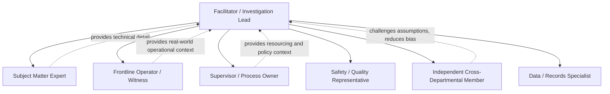

## Assembling a Cross Functional Investigation Team

### Overview

The composition of a root cause analysis investigation team materially affects the quality, credibility, and completeness of the findings. A team drawn from a single function or hierarchy level tends to reproduce that function's blind spots and biases. Cross-functional team assembly is the practice of deliberately selecting investigators and contributors across roles, disciplines, and organizational levels to counteract this, directly operationalizing several High Reliability Organization principles (reluctance to simplify, deference to expertise, sensitivity to operations) in the investigation process itself.

---

### Why Cross-Functional Composition Matters

- **Key Points**
  - A single-discipline team tends to find causes within its own discipline (e.g., engineers find engineering causes, HR finds people/process causes) even when the actual causal structure is multi-domain.
  - Frontline operators possess tacit knowledge of "work as done" that supervisors and process owners often lack, and vice versa (supervisors often see cross-shift or cross-team patterns individual operators cannot).
  - Diverse membership counteracts groupthink and premature causal closure — directly supporting the "reluctance to simplify" HRO principle.
  - External or semi-independent members reduce the risk that the investigation avoids implicating members' own department or management chain.

---

### Core Roles to Include

#### 1. Facilitator / Investigation Lead

Owns the process, not the content. Runs the Why-chain or fishbone session, manages time, and prevents premature closure or blame assignment. Should ideally have RCA methodology training but need not be a subject-matter expert in the failed system.

#### 2. Subject Matter Expert(s) (SME)

Possesses deep technical knowledge of the specific system, process, or equipment involved. Often more than one SME is needed if the failure spans multiple technical domains (e.g., mechanical and software).

#### 3. Frontline Operator(s) / Direct Witnesses

Individuals who were directly performing the work or present when the event occurred. Critical for "sensitivity to operations" — they know the informal workarounds, undocumented shortcuts, and real conditions that formal procedures don't capture.

- **Example**

  In a manufacturing line stoppage investigation, the machine operator may know that a particular sensor has been "flaky" for weeks and that operators have developed an informal workaround — information unlikely to appear in maintenance logs.

#### 4. Supervisor / Process Owner

Provides context on staffing, scheduling, policy, and resource constraints; can authorize access to data and implement corrective actions afterward. Their presence can also suppress candor from frontline staff if not carefully managed (see Facilitation Risks below).

#### 5. Safety / Quality Representative

Brings knowledge of relevant regulatory requirements, prior similar incidents in the organization's history, and standardized RCA methodology.

#### 6. Independent / Cross-Departmental Member

A member with no direct stake in the outcome, often from an unrelated department, added specifically to ask naive-but-important questions and to signal to participants that the investigation is not designed to protect any one group.

#### 7. Data / Records Specialist (as needed)

For investigations requiring log analysis, maintenance records, or system telemetry, someone capable of retrieving and interpreting that data accurately prevents the team from relying on memory or assumption.

---

### Team Sizing Guidance

- **Key Points**
  - Typical effective RCA teams range from 4–8 members; below 4 risks insufficient perspective diversity, above 8–10 risks diminishing returns and facilitation difficulty.
  - Scale team size and composition to incident severity: a minor near-miss may warrant a 3-person quick review; a major incident with regulatory implications may warrant a formal multi-week team with 8+ members and subgroups.
  - [Inference] Optimal team size varies by organizational culture and incident complexity; the ranges above reflect common practitioner guidance rather than a fixed rule validated across all industries.

---

### Selection Criteria Checklist

- **Key Points**
  - Does the team include at least one person who was present or directly involved in the events (not just those who manage the process)?
  - Does the team span at least two organizational levels (e.g., frontline + supervisory, or operational + engineering)?
  - Is there at least one member without a stake in how the findings reflect on their own department?
  - Does the team have someone with authority to pull data, records, or additional witnesses if new lines of inquiry emerge?
  - Is psychological safety addressed — will junior or frontline members feel able to speak candidly in front of supervisors?

---

### Facilitation Risks in Cross-Functional Teams

- **Key Points**
  - **Hierarchy suppression**: presence of a supervisor or manager can cause frontline staff to self-censor. Mitigation: separate initial fact-gathering interviews from the group session, or use anonymous input collection before convening the full team.
  - **Departmental defensiveness**: representatives may unconsciously (or consciously) steer the analysis away from causes implicating their own function. Mitigation: an independent facilitator who is explicitly not evaluated on "protecting" any department, and a stated just-culture ground rule that the goal is systemic learning, not blame.
  - **Expertise imbalance**: a highly technical SME can dominate discussion and crowd out non-technical but relevant observations (e.g., communication or scheduling issues). Mitigation: facilitator actively solicits input from quieter or lower-status members before technical members finalize a causal narrative.
  - **Groupthink under time pressure**: cross-functional teams assembled hastily after a high-visibility incident may converge quickly on a plausible narrative under organizational pressure to "close" the investigation. Mitigation: build in a structured devil's-advocate or "what are we missing" step before finalizing.

---

### Illustrative Diagram: Cross-Functional Team Composition (svg_diagram)

---

### Process for Assembling the Team

- **Key Points**
  1. Scope the incident to identify which functions and systems were plausibly involved (not just the function where the failure was observed).
  2. Identify direct witnesses and frontline participants first, since availability and memory decay quickly.
  3. Select at least one SME per implicated technical domain.
  4. Deliberately add one member without a stake in the outcome.
  5. Confirm the facilitator role is filled by someone trained in RCA facilitation and not personally implicated in the incident.
  6. Establish ground rules up front (just culture, no blame assignment during fact-finding, confidentiality of individual statements) before the investigative session begins.
- **Next Steps**

  Once the team is assembled, the next step is typically structured evidence gathering (timeline reconstruction, interviews, document review) before convening for the causal analysis session itself (5 Whys, fishbone, or fault tree construction).

---

### Related Topics

- Facilitation techniques for 5 Whys workshops
- Just Culture frameworks and blame-free investigation ground rules
- Psychological safety in team settings (Amy Edmondson)
- Timeline reconstruction and evidence gathering methods
- Interview techniques for RCA witness statements
- High Reliability Organization principles (deference to expertise, sensitivity to operations)
- Managing groupthink and confirmation bias in group investigations
- Structuring the RCA workshop agenda and session flow