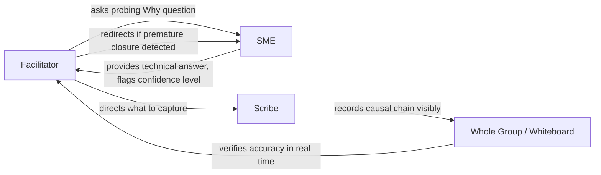

## Facilitator, Scribe, and Subject Matter Expert Roles

### Overview

A well-run RCA workshop depends on clear separation of duties between the people running the process, the people recording it, and the people supplying technical content. Conflating these roles — most commonly, letting the facilitator also act as the SME, or skipping the scribe role entirely — is one of the most common causes of degraded RCA output. This section defines each role's responsibilities, boundaries, and common failure modes.

---

### The Facilitator Role

The facilitator owns the *process* of the investigation, not its technical content or conclusions.

- **Key Points**
  - Guides the group through the chosen method (5 Whys, fishbone, fault tree) without personally asserting causal claims.
  - Manages time, pacing, and turn-taking so no single participant dominates.
  - Actively enforces psychological safety and just-culture ground rules (no blame language, no personal attribution during fact-finding).
  - Detects and interrupts premature closure — when the group converges on a plausible-sounding cause too quickly without testing alternatives.
  - Asks clarifying and probing questions ("What evidence supports that?" "Is that the only reason, or one of several?") rather than answering them.
  - Remains neutral on outcome; is evaluated on process quality, not on whether a satisfying root cause was found.
- **Example**

  When a participant states "the operator made a mistake" as an answer to a Why question, the facilitator redirects: "What in the system or process made that mistake possible or likely?" — pushing the inquiry past individual blame toward systemic conditions, without asserting what that systemic condition actually is.

#### Facilitator Skill Requirements

- Trained in the specific RCA methodology being used (5 Whys, Ishikawa, FTA, etc.).
- Group facilitation skills: managing dominant personalities, drawing out quiet participants, de-escalating defensiveness.
- Sufficient organizational standing to keep senior participants from steering or shutting down the session, without being so senior that junior staff self-censor.
- [Inference] Whether a facilitator should be internal (familiar with context, but potentially biased) or external/independent (neutral, but requires more onboarding time) is a tradeoff that depends on incident severity and organizational trust levels; no single approach is universally superior.

#### Common Facilitator Failure Modes

- **Content leakage**: facilitator begins supplying technical answers rather than eliciting them, collapsing the facilitator/SME boundary.
- **False neutrality**: facilitator has a stake in the outcome (e.g., investigating their own team) and unconsciously steers the chain.
- **Premature convergence**: accepting the first plausible answer at each "Why" step to keep the session moving, rather than testing whether it is fully sufficient.
- **Over-control**: suppressing legitimate tangents that are actually relevant contributing factors, in the name of staying "on script."

---

### The Scribe Role

The scribe owns accurate, real-time capture of what is said and decided, distinct from both facilitating and contributing content.

- **Key Points**
  - Records the causal chain or diagram as it is built live, ideally visible to the whole group (whiteboard, shared screen, flip chart) so the group can verify accuracy in real time.
  - Captures verbatim or near-verbatim key statements, especially factual claims and evidence citations, distinguishing them from opinions or assumptions.
  - Notes areas of disagreement or unresolved questions explicitly, rather than silently resolving them into a single narrative.
  - Timestamps or sequences entries where relevant, particularly for timeline reconstruction.
  - Produces the formal written record (fishbone diagram, Why-chain document, fault tree) that becomes the artifact of the investigation.
- **Example**

  During a session, two participants disagree about whether a procedure was followed. Rather than picking one version, the scribe records both statements attributed to their source and flags it as "disputed — requires evidence check," which the facilitator then assigns as a follow-up action.

#### Why the Scribe Role Is Distinct from the Facilitator

- **Key Points**
  - A facilitator simultaneously running the group *and* writing detailed notes tends to produce degraded output in one function or the other — attention is a limited resource.
  - Having a dedicated scribe allows the facilitator to stay focused on group dynamics and probing questions rather than transcription.
  - A separate scribe record also serves as a check on facilitator bias: participants can see and correct the written chain in real time if it misrepresents what was said.

#### Common Scribe Failure Modes

- **Premature synthesis**: paraphrasing or summarizing statements in a way that loses important nuance or inadvertently resolves ambiguity that should remain flagged.
- **Selective recording**: unconsciously recording statements that fit an emerging narrative more thoroughly than disconfirming statements.
- **Illegible or inaccessible notes**: if the group cannot see the evolving record in real time, errors are not caught until after the session, when memory has already faded.

---

### The Subject Matter Expert (SME) Role

The SME supplies the technical or domain content the facilitator elicits, without controlling the process.

- **Key Points**
  - Provides accurate technical explanations of how the system, process, or equipment is supposed to work and how it actually behaved.
  - Answers "why" questions with domain-grounded evidence rather than speculation, and explicitly flags when an answer is a hypothesis versus a confirmed fact.
  - May be multiple people if the failure spans domains (e.g., a mechanical engineer and a software engineer for a mechatronic failure).
  - Should defer to the facilitator on process matters (pacing, whether to continue down a line of inquiry) even while asserting authority on technical matters — this mirrors the HRO "deference to expertise" principle, scoped specifically to their domain.
- **Example**

  In an investigation into a chemical spill, a process engineer SME explains the expected pressure tolerances of a valve, while a maintenance SME explains the actual inspection history — each staying within their domain of expertise rather than speculating outside it.

#### Distinguishing SME Input from Facilitator Input

| Aspect | Facilitator | SME |
| --- | --- | --- |
| Owns | Process, pacing, neutrality | Technical accuracy, domain evidence |
| Asks | Probing questions | N/A (answers questions) |
| Answers | Should not supply causal content | Supplies causal content when asked |
| Bias risk | Steering the narrative via question framing | Overconfidence in own domain; underweighting other domains |
| Evaluated on | Quality of process, psychological safety maintained | Accuracy and completeness of technical input |

#### Common SME Failure Modes

- **Domain tunnel vision**: attributing the failure entirely to factors within their own expertise, underweighting contributing factors outside it (an engineer over-indexing on mechanical causes, under-weighting a scheduling or communication cause).
- **Authority-driven closure**: because SMEs are seen as authoritative, the group may stop questioning an SME's answer even when it is incomplete, short-circuiting the "reluctance to simplify" principle.
- **Speculation presented as fact**: providing a plausible-sounding technical explanation without flagging that it is unverified, which the scribe then may record as settled fact.

---

### Illustrative Diagram: Role Interaction During a Session (svg_diagram)

---

### Role Assignment Guidance

- **Key Points**
  - Never assign the same person to be both facilitator and primary SME for the incident under investigation — this conflates process neutrality with content authority and is one of the most common structural errors in RCA sessions.
  - The scribe should ideally not also be a primary witness or heavily implicated participant, to preserve attention capacity for accurate recording rather than personal recollection.
  - For small or informal investigations, one person may rotate between light facilitation and scribing, but this tradeoff should be a deliberate choice given resource constraints, not a default.
  - Rotating the facilitator role across different investigations (rather than always using the same person) can help prevent facilitator fatigue and can distribute facilitation skill development across the organization. [Inference] Whether rotation improves or degrades consistency of RCA quality over time likely depends on how well facilitation training is standardized within the organization.

---

### Related Topics

- Assembling a cross-functional investigation team (preceding topic)
- Just Culture and blame-free investigation ground rules
- Structuring the 5 Whys workshop agenda
- Fishbone (Ishikawa) diagram construction techniques
- Managing dominant personalities and groupthink in facilitated sessions
- Evidence documentation standards for RCA records
- Distinguishing fact, hypothesis, and opinion in causal statements
- High Reliability Organization principles (deference to expertise)