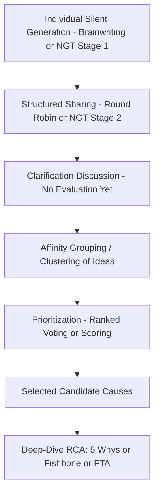

## Structured Brainstorming Techniques

### Overview

Unstructured brainstorming — asking a group to freely suggest causes — reliably underperforms structured techniques in RCA contexts, because it is vulnerable to groupthink, dominant-voice bias, and premature convergence. Structured brainstorming techniques impose explicit rules, sequencing, or anonymity to counteract these failure modes and generate a more complete, less biased set of candidate causes before the group narrows toward the actual root cause(s).

---

### Why Unstructured Brainstorming Underperforms

- **Key Points**
  - Production blocking: only one person can speak at a time, so ideas are lost or forgotten while waiting to contribute.
  - Evaluation apprehension: participants withhold ideas that might seem unlikely or that could implicate colleagues, especially in front of supervisors.
  - Social loafing: some participants mentally disengage and rely on others to generate ideas.
  - Anchoring: the first few ideas voiced disproportionately shape the direction of all subsequent contributions.
  - [Inference] These effects are well-documented in general group psychology and creativity research; their specific magnitude in RCA contexts specifically has not been isolated by dedicated RCA-focused studies, but the underlying mechanisms are directly applicable.

---

### Core Structured Techniques

#### 1. Brainwriting (Silent Generation)

Participants individually write down candidate causes on paper or cards before any group discussion, then submit them anonymously for the facilitator to compile.

- **Key Points**
  - Eliminates production blocking (everyone writes simultaneously) and reduces evaluation apprehension (anonymity).
  - Common variant "6-3-5": 6 participants each write 3 ideas in 5 minutes, then pass their sheet to the next person who builds on those ideas — repeated across several rounds.
  - Particularly effective as an opening step before a group 5 Whys or fishbone session, ensuring the group starts from a wide candidate pool rather than whichever cause the loudest voice raised first.
- **Example**

  Before a fishbone session on a delayed product launch, each of 8 team members privately writes down 3 possible contributing factors on sticky notes. The facilitator collects and clusters all 24 notes by category before opening group discussion — surfacing several factors (e.g., a vendor delay known only to procurement) that might not have surfaced in open discussion.

#### 2. Nominal Group Technique (NGT)

A more formal, four-stage structured method combining silent generation with structured sharing and voting.

- **Key Points**
  1. **Silent generation**: participants individually write ideas without discussion.
  2. **Round-robin sharing**: facilitator goes around the group, one idea per person per turn, recording each without initial discussion or critique.
  3. **Clarification discussion**: group discusses each recorded idea only for clarity, not for evaluation or debate.
  4. **Ranked voting**: each participant privately ranks or scores the ideas; the facilitator aggregates scores to prioritize which candidate causes warrant deeper investigation.
  - NGT is particularly useful when status differences in the room are large (e.g., senior engineers alongside junior operators), since the round-robin structure guarantees every participant is heard before any idea is debated or dismissed.

#### 3. Delphi Technique

An iterative, anonymous, multi-round survey process, typically used when participants cannot meet synchronously or when independence of judgment must be preserved across a wider or more geographically distributed expert group.

- **Key Points**
  - Round 1: experts independently submit candidate causes or assessments in writing (often via a form), without seeing others' input.
  - Facilitator compiles and summarizes results anonymously, then circulates the summary back to all participants.
  - Round 2+: participants revise their own input in light of the anonymized group summary, without knowing who said what.
  - Continues until responses converge or a set number of rounds is reached.
  - Well suited to distributed or multi-site incident investigations where synchronous cross-functional meetings are impractical, or where a small number of very senior/authoritative voices would otherwise dominate a live session.

#### 4. Round-Robin Brainstorming

A lighter-weight, live variant of NGT's second stage: the facilitator goes around the group in turn, requiring each person to contribute one idea (or explicitly pass) before returning for a second round.

- **Key Points**
  - Guarantees participation from quieter members without requiring full NGT formality.
  - Does not include NGT's silent-writing or structured-voting stages, so it retains more risk of anchoring than full NGT or brainwriting.

#### 5. Affinity Diagramming (KJ Method)

After ideas are generated (via brainwriting or round-robin), participants collaboratively cluster related ideas into thematic groups before deeper analysis, often as a bridge into fishbone categorization.

- **Key Points**
  - Ideas are written on individual cards/notes and physically or digitally grouped by similarity, typically done silently at first to avoid premature verbal argument over categorization.
  - Group labels emerging from the clusters often map naturally onto fishbone categories (People, Process, Equipment, Environment, etc.).

#### 6. Anonymous Digital Polling / Idea Collection

Using anonymous digital tools (polling software, anonymous chat/forms) to collect candidate causes or vote on priority, particularly useful in remote or hybrid RCA sessions.

- **Key Points**
  - Replicates brainwriting's anonymity benefit in a distributed/remote setting.
  - Allows real-time aggregation and visualization (e.g., word clouds, ranked lists) that a paper-based method cannot easily provide.

---

### Choosing a Technique

| Technique | Best When | Key Strength | Key Limitation |
| --- | --- | --- | --- |
| Brainwriting | Standard in-person or hybrid session | Simple, fast, reduces anchoring | Requires compilation effort by facilitator |
| Nominal Group Technique | Strong hierarchy/status differences present | Guarantees voice + structured prioritization | Slower, more formally structured |
| Delphi | Distributed experts, cannot meet live | Preserves independence across rounds | Slow (multiple rounds), higher coordination overhead |
| Round-Robin | Quick live session, moderate group size | Lightweight, easy to run | Still vulnerable to anchoring |
| Affinity Diagramming | After idea generation, before categorization | Organizes large idea sets meaningfully | Requires an idea set to already exist |
| Anonymous Digital Polling | Remote/hybrid teams | Fast, scalable anonymity | Requires tooling; less rich than face-to-face clarification |

---

### Illustrative Diagram: Structured Brainstorming Flow into RCA (svg_diagram)

---

### Integration with RCA Methods

- **Key Points**
  - Structured brainstorming is typically used to populate the initial candidate-cause pool feeding into a fishbone diagram's branches, or to generate multiple starting "Why" threads before selecting which to pursue in depth.
  - For 5 Whys specifically, running a brief brainwriting round before starting the Why-chain helps ensure the team doesn't lock onto the first plausible cause without considering alternatives — directly mitigating the "reluctance to simplify" gap discussed in HRO principles.
  - Voting/ranking outputs from NGT or Delphi can be used to decide which of several candidate root causes justify further quantitative investigation (e.g., fault tree probability estimation) versus which can be deprioritized.

---

### Common Pitfalls

- **Skipping silent generation entirely**: jumping straight to open discussion defeats the core purpose of these techniques and reintroduces the biases they are designed to prevent.
- **Facilitator over-summarizing during compilation**: condensing submitted ideas too aggressively can lose nuance or accidentally merge distinct causes into one.
- **Treating voting results as final**: ranked votes from NGT/Delphi indicate priority for further investigation, not a validated root cause — they should not replace evidence-based verification.
- **Using Delphi for time-critical incidents**: its multi-round nature makes it poorly suited to urgent investigations where corrective action is needed quickly.

---

### Related Topics

- Facilitator, scribe, and subject matter expert roles (preceding topic)
- Fishbone (Ishikawa) diagram construction techniques
- Assembling a cross-functional investigation team
- Groupthink and premature closure in group decision-making
- Just Culture and psychological safety in facilitated sessions
- Affinity diagramming and thematic clustering methods
- Multi-voting and prioritization matrices for candidate causes
- Remote and hybrid facilitation techniques for distributed teams