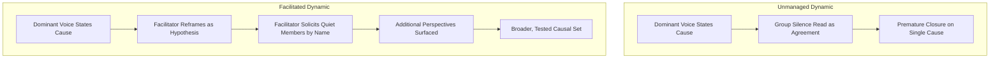

## Managing Dominant Voices and Group Dynamics

### Overview

Even well-composed, cross-functional RCA teams can produce poor results if group dynamics allow one or two voices to dominate the causal narrative. Dominant voices can distort findings not because their input is wrong, but because unchallenged input — regardless of accuracy — short-circuits the "reluctance to simplify" and "deference to expertise" principles central to reliable investigation. This section covers the sources of dominance, their effects on RCA quality, and concrete facilitation countermeasures.

---

### Sources of Dominance in Group Settings

#### 1. Hierarchical Authority

Senior participants (managers, department heads) are given disproportionate credibility regardless of the accuracy of their causal claims, and junior participants may avoid contradicting them.

#### 2. Technical Authority

A subject matter expert's confidence and domain fluency can cause the group to stop questioning their explanation even when it addresses only part of the picture (domain tunnel vision, covered under SME roles).

#### 3. Personality and Communication Style

Naturally assertive, fast-talking, or confident communicators tend to speak more, speak first, and interrupt more — independent of the actual merit of their contributions.

#### 4. First-Mover Anchoring

Whoever speaks first on a given "Why" question disproportionately shapes the group's subsequent thinking, even absent any status difference.

#### 5. Defensive Coalition Formation

When a cause under discussion implicates a particular department or role, members from that group may (consciously or not) coordinate pushback to redirect the narrative elsewhere.

- **Key Points**
  - These sources often compound: a senior SME with a strong communication style presents the single largest risk of premature, incomplete causal closure in a session.
  - [Inference] The relative weight of each source (hierarchy vs. personality vs. technical authority) likely varies significantly by organizational culture; no universal ranking applies across all contexts.

---

### Effects on RCA Quality

- **Key Points**
  - **Narrowed causal scope**: the group settles on the dominant voice's preferred explanation, foreclosing exploration of alternative or parallel causes (violates "reluctance to simplify").
  - **Suppressed frontline knowledge**: operators or junior staff with direct, relevant observations may withhold them if a senior voice has already stated a confident conclusion (violates "sensitivity to operations").
  - **False consensus**: a facilitator or observer may read group silence as agreement, when it may instead reflect social pressure not to dissent.
  - **Blame misdirection**: a dominant voice from one department may steer the causal narrative toward another department's failures rather than a more systemic or shared cause.

---

### Facilitation Countermeasures

#### 1. Structural Countermeasures (Prevent Dominance Before It Occurs)

- Use silent generation techniques (brainwriting, NGT stage 1) before any open discussion, so ideas exist on record independent of who speaks first or loudest.
- Establish explicit ground rules at the session's start: "no interrupting," "every perspective gets addressed before we move to the next Why," "titles are left at the door."
- Consider separating fact-gathering interviews (1-on-1, away from supervisors) from the group synthesis session, so frontline input is captured before hierarchy effects can suppress it.
- Seat/arrange participants (physically or in a video call) to avoid a visual hierarchy that reinforces status dynamics (e.g., avoid placing the most senior person at the head of the table controlling the discussion visually).

#### 2. In-Session Facilitation Techniques

- **Explicit round-robin solicitation**: after a dominant voice offers an explanation, the facilitator directly asks quieter members: "[Name], from what you saw on the floor, does that match, or is there something else going on?"
- **Devil's advocate assignment**: the facilitator assigns a rotating role to explicitly challenge the current leading explanation — "What would have to be true for this NOT to be the full explanation?"
- **Reframing dominant statements as hypotheses**: the facilitator restates a confident assertion as a testable hypothesis rather than a settled fact — "So one hypothesis is X — what evidence would confirm or rule that out?" — reopening space for alternative views.
- **Time-boxing individual contributions**: particularly useful when one participant tends to speak at length; the facilitator sets and enforces a speaking-time norm applied evenly to all participants (not singling out the dominant speaker, which can feel punitive).
- **Parking lot for tangents**: dominant voices sometimes derail sessions into adjacent but off-topic territory; a visible "parking lot" list lets the facilitator redirect without dismissing the point entirely.

#### 3. Addressing Silence and Withdrawal

- **Key Points**
  - Silence should not be interpreted as agreement; the facilitator should distinguish between "no further input" and "input being withheld."
  - Directly and non-confrontationally inviting quiet participants by name, with a specific, answerable question (not a generic "anyone else?"), increases participation more reliably than open invitations.
  - If a participant appears to withdraw after being contradicted or dismissed, the facilitator should re-engage them explicitly rather than allowing the group to move on.

---

### Illustrative Diagram: Dominance Pattern vs. Facilitated Correction (svg_diagram)

---

### Special Considerations for Cross-Functional and Hierarchical Teams

- **Key Points**
  - When a supervisor of the frontline staff under discussion is present, consider whether their presence should be limited to specific portions of the session, or whether a private pre-session interview with frontline staff should substitute for live testimony in front of the supervisor.
  - In investigations involving potential disciplinary implications, the facilitator must be especially explicit that the session's purpose is systemic learning (just culture), since fear of consequence is a strong driver of both dominance (asserting a narrative that protects oneself) and silence (withholding information that could implicate oneself).
  - Cultural norms around hierarchy and directness vary significantly across organizations and regions; a facilitation approach effective in one context (e.g., direct challenge of a senior voice) may be perceived as inappropriate or counterproductive in another. [Inference] Adapting facilitation style to organizational and cultural context is generally recommended in facilitation literature, though the specific adaptations required cannot be generalized without knowing the specific context.

---

### Warning Signs a Facilitator Should Watch For

- **Key Points**
  - One or two participants account for the large majority of speaking time.
  - Quieter participants' body language (in-person) or lack of camera/chat engagement (remote) suggests disengagement rather than agreement.
  - The causal chain converges unusually quickly relative to the complexity of the incident.
  - Explanations offered align suspiciously well with deflecting responsibility away from the explainer's own department.
  - Junior participants visibly look to a senior participant before answering, rather than answering independently.

---

### Related Topics

- Facilitator, scribe, and subject matter expert roles (preceding topic)
- Structured brainstorming techniques (preceding topic)
- Just Culture and psychological safety frameworks
- Groupthink and premature closure in group decision-making
- Reluctance to simplify (High Reliability Organization principle)
- Interview techniques separating fact-gathering from group synthesis
- Cross-cultural facilitation considerations
- Nominal Group Technique and structured voting methods