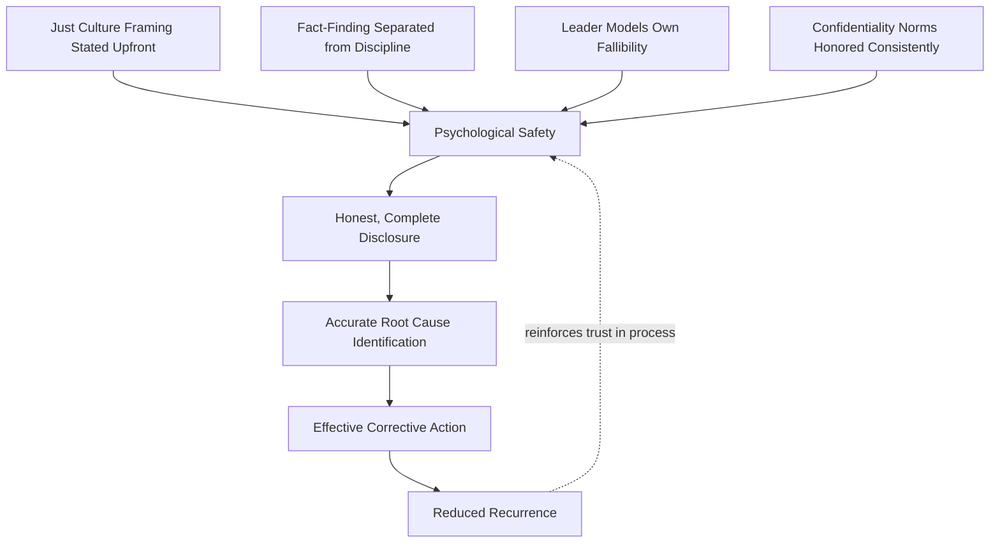

## Building Psychological Safety for Honest Input

### Overview

Psychological safety — a term developed extensively by Amy Edmondson — refers to a shared belief that a team is safe for interpersonal risk-taking: raising concerns, admitting mistakes, or challenging a colleague's or superior's statement without fear of punishment or humiliation. In RCA contexts, psychological safety is the precondition for nearly every other technique in this chapter: cross-functional composition, structured brainstorming, and dominant-voice management all fail to produce honest input if participants do not feel safe providing it in the first place.

---

### Why Psychological Safety Is a Prerequisite, Not a Nice-to-Have

- **Key Points**
  - Investigations frequently touch on actions taken by people in the room, or by their colleagues, supervisors, or reports — creating direct incentive to omit, soften, or reframe information.
  - Without safety, participants default to socially acceptable or self-protective narratives rather than complete, evidence-based accounts, regardless of how well the session is otherwise facilitated.
  - Low psychological safety produces a specific and dangerous failure pattern: the investigation appears to proceed smoothly (no visible conflict, quick convergence) while actually collecting incomplete or distorted information — the process looks successful while the output is compromised.
  - This directly operationalizes the HRO principle of "preoccupation with failure," which depends on people being willing to report anomalies and near-misses without fear of punishment.

---

### Distinguishing Psychological Safety from "Being Nice"

- **Key Points**
  - Psychological safety is not the absence of disagreement, challenge, or accountability — it is the ability to disagree, challenge, or admit error without fear of humiliation or retaliation.
  - A psychologically safe team can still hold individuals accountable for genuine negligence or misconduct; safety concerns the manner and consequence of raising information, not the elimination of consequences altogether.
  - Conflating safety with conflict-avoidance can itself degrade RCA quality, since genuine "reluctance to simplify" requires participants to be willing to challenge an emerging (possibly incorrect) consensus.

---

### Structural Conditions That Build Safety

#### 1. Explicit Just Culture Framing

Stating clearly, before the session begins, how the organization distinguishes honest error, at-risk behavior, and reckless behavior — and that this investigation's purpose is systemic learning, not individual blame.

- **Example**

  A facilitator opens a session: "This investigation is not about who made a mistake — it's about understanding what in our system made that outcome possible, so we can prevent it for anyone in this role. What you share here will be used to fix the system, not to evaluate you."

#### 2. Separating Fact-Finding from Consequence Decisions

Keeping the RCA investigation team and process organizationally separate from any disciplinary process, and communicating that separation explicitly to participants.

- **Key Points**
  - If participants believe RCA findings will directly feed into performance reviews or disciplinary action, candor drops sharply.
  - Some organizations formally decouple these processes (e.g., aviation's use of protected, non-punitive reporting systems) specifically to preserve information flow.

#### 3. Leader Modeling of Fallibility

When senior participants openly acknowledge their own uncertainty, past mistakes, or incomplete knowledge, it signals that admitting error is acceptable at every level.

- **Example**

  A department head opens by saying, "I approved that staffing plan, and I want to understand if that decision contributed here — please don't hold back on that account."

#### 4. Confidentiality and Attribution Norms

Establishing up front how individual statements will (or will not) be attributed in the final report, and honoring that commitment consistently.

- **Key Points**
  - Aggregated or anonymized findings ("staff reported difficulty accessing the updated procedure") versus individually attributed statements carry very different risk profiles for participants.
  - Breaking a stated confidentiality norm — even once — can permanently damage psychological safety for future investigations, not just the current one.

#### 5. Facilitator Behavior During the Session

- Responding to disclosed errors or admissions with curiosity ("tell me more about how that happened") rather than evaluation ("why would you do that") reinforces safety in real time.
- Visibly and consistently redirecting blame-oriented language toward systemic framing, every time it occurs, not selectively.
- Thanking participants explicitly for difficult disclosures, reinforcing that candor is valued behavior.

---

### Recognizing Low Psychological Safety in a Session

- **Key Points**
  - Answers are vague, hedge heavily, or default to "I don't know" on questions the participant plausibly should be able to answer.
  - Participants defer unusually quickly to whatever a senior person has already said, rather than offering independent observations.
  - No one admits to any error, workaround, or deviation from procedure — which is itself a signal, since real-world operations almost always involve some informal adaptation.
  - Body language (in-person) or engagement patterns (remote) suggest discomfort — avoiding eye contact, physically distancing, camera off, minimal chat engagement.
  - Post-session, informal conversations reveal information that was not shared in the formal session — a strong indicator that the session itself was not perceived as safe.

---

### Illustrative Diagram: Conditions Feeding Psychological Safety in RCA (svg_diagram)

---

### Techniques to Actively Build Safety During a Session

- **Key Points**
  1. Open with an explicit, spoken statement of purpose and just-culture framing — do not assume it is understood or remembered from prior sessions.
  2. Use structured, anonymous input methods (brainwriting, anonymous digital polling) for the most sensitive parts of the investigation, reducing the personal risk of speaking first.
  3. Normalize uncertainty explicitly: "It's fine to say 'I'm not sure' or 'I think, but I'm not certain' — partial information is still useful."
  4. Acknowledge and thank participants when they share something that could reflect poorly on themselves or their team, in the moment, not just at the end.
  5. Avoid "why did you" phrasing directed at individuals (which reads as accusatory) in favor of "what made it possible to" phrasing directed at conditions.
  6. Follow through visibly: if findings lead to systemic fixes rather than individual blame, communicate that outcome back to participants, reinforcing that candor was rewarded with real change.

---

### Common Pitfalls

- **Declaring safety without structural support**: stating "this is a safe space" while disciplinary consequences remain openly linked to findings does not create safety — words alone do not overcome misaligned incentives.
- **One-time framing**: psychological safety is built cumulatively across repeated experiences; a single well-run session cannot fully compensate for a broader organizational history of punitive responses to disclosure.
- **Confusing safety with informality**: an unstructured, casual tone is not the same as safety, and can even reduce perceived seriousness or confidentiality of the process.
- **Selective safety**: extending safety norms only to senior or favored participants while frontline staff still feel exposed undermines the principle entirely.
- **Assuming safety transfers automatically**: safety established in one team or context does not automatically extend to a newly assembled cross-functional investigation team; it must be actively (re)established with each new group configuration.

---

### Related Topics

- Managing dominant voices and group dynamics (preceding topic)
- Just Culture frameworks (Sidney Dekker, James Reason)
- High Reliability Organization principles (preoccupation with failure)
- Assembling a cross-functional investigation team
- Confidential and anonymous reporting systems in safety-critical industries
- Amy Edmondson's research on team psychological safety
- Structured brainstorming techniques (anonymity as a safety mechanism)
- Leader behaviors that support or undermine organizational learning culture