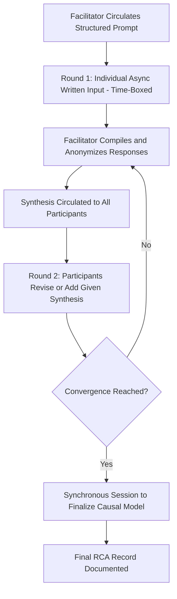

## Facilitating Remote and Asynchronous Investigations

### Overview

Distributed teams, multi-site incidents, and time-zone-spanning organizations increasingly require RCA investigations to be conducted partially or entirely outside a single synchronous, in-person meeting. Remote (synchronous, video-based) and asynchronous (time-shifted, non-live) facilitation each introduce distinct challenges to the techniques covered elsewhere in this chapter — structured brainstorming, dominant-voice management, psychological safety, and clear role separation all require adaptation when the group is not physically co-located or not even online at the same time.

---

### Remote (Synchronous) vs. Asynchronous Investigation

| Dimension | Remote Synchronous | Asynchronous |
| --- | --- | --- |
| Timing | All participants online simultaneously (video call) | Participants contribute at different times over an extended window |
| Best for | Time-sensitive incidents, complex discussion requiring real-time clarification | Distributed time zones, incidents where reflection time improves input quality |
| Tooling | Video conferencing + shared digital whiteboard | Shared documents, forms, threaded discussion tools |
| Facilitation load | High — facilitator manages live dynamics remotely | Different — facilitator manages structure and synthesis over time rather than live pacing |
| Risk profile | Video fatigue, unequal bandwidth/tech access, harder to read body language | Slower resolution, risk of fragmented or duplicated input, weaker real-time clarification |

---

### Adapting Structured Brainstorming for Remote/Async Settings

- **Key Points**
  - Brainwriting and NGT's silent-generation stages translate naturally to remote settings using shared documents, anonymous forms, or digital whiteboard tools (sticky-note style boards) — arguably easier to keep genuinely anonymous online than on a physical whiteboard.
  - Delphi technique is inherently well-suited to asynchronous work, since it was designed for non-co-located expert panels.
  - Round-robin brainstorming requires explicit facilitator management in video calls — using a visible speaking order (e.g., participant list, raised-hand feature) since natural turn-taking cues are weaker over video than in person.
  - Anonymous digital polling tools are generally easier to deploy remotely than in person, since most participants already have a device in front of them.

---

### Adapting Facilitator, Scribe, and SME Roles

- **Key Points**
  - The scribe role becomes more visible and more critical remotely: a shared, live-updated digital document or whiteboard substitutes for a physical flip chart, and all participants should have a visible link to it during the session.
  - Facilitators should explicitly assign and re-confirm the scribe role at the start of a remote session, since it is easier for this role to be silently dropped when not physically visible (no one "at the whiteboard").
  - For asynchronous investigations, the facilitator's role shifts from live pacing toward structuring the sequence of async inputs (e.g., "Round 1 due Wednesday, synthesis circulated Thursday, Round 2 due Friday") and ensuring no single async contributor's input dominates simply by being first or most detailed.
  - SME contributions in asynchronous formats should be explicitly time-boxed and prompted with specific questions, rather than left open-ended, to avoid the async equivalent of a dominant voice — over-long, meandering written contributions that other participants disengage from reading closely.

---

### Managing Dominant Voices and Group Dynamics Remotely

- **Key Points**
  - Video calls make it harder to read the informal social cues (body language, hesitation) that a live facilitator would normally use to detect withdrawal or discomfort — facilitators should compensate with more frequent, explicit check-ins.
  - Mute/unmute dynamics and network lag increase turn-taking friction, which can inadvertently amplify the advantage of assertive speakers who interrupt more successfully; facilitators should establish and enforce explicit speaking-order norms (e.g., chat-based queue, raised-hand feature) rather than relying on unstructured live back-and-forth.
  - In asynchronous formats, dominance shifts from "loudest voice" to "first and most extensive written response," since later async contributors may anchor on earlier ones or feel their input is redundant; facilitators can counter this by collecting all initial async responses before circulating any of them (a written analog to silent generation).
  - Chat-based side channels (private messages during a call) can either help (quiet participants raise a concern privately to the facilitator, who then surfaces it) or hurt (side conversations forming coalitions); facilitators should actively monitor and use chat functionality intentionally.

---

### Building and Maintaining Psychological Safety Remotely

- **Key Points**
  - Remote settings can paradoxically increase psychological safety for some participants (physical distance from a senior figure can feel less intimidating) while decreasing it for others (uncertainty about who else might be reading a shared document, screen recording concerns).
  - Explicitly stating recording, screen-sharing, and document-access policies before the session begins is especially important remotely, since participants may not know who can see a shared document or whether a call is being recorded.
  - Asynchronous, written formats can support safety by giving participants time to formulate careful, complete responses rather than reacting under live social pressure — but can also reduce safety if written statements feel more permanent or easily forwarded than spoken ones.
  - Facilitators should confirm, rather than assume, that anonymity claimed for a digital tool (anonymous polling, form submissions) is genuinely anonymous from the participants' perspective, including whether the facilitator or others can see individual response identities on the backend.

---

### Illustrative Diagram: Async Investigation Workflow (svg_diagram)

---

### Practical Tooling Considerations

- **Key Points**
  - Shared digital whiteboards (for fishbone diagrams, Why-chains, affinity clustering) should support real-time multi-user editing and be accessible across the bandwidth/device constraints of all participants — a tool requiring high bandwidth may inadvertently exclude some contributors.
  - Version history and edit tracking in shared documents is useful for the scribe function, allowing the group to see how the causal narrative evolved and who contributed what, if attribution has been agreed upon.
  - For safety-sensitive or confidential investigations, tool selection should account for who has access to the underlying data (e.g., is the whiteboard hosted on a platform the whole organization can browse, or is it access-restricted to the investigation team only).
  - [Inference] Specific tool recommendations are not made here since tooling changes rapidly and organizational IT/security policies vary; the underlying requirement — real-time collaborative editing with controlled access — is the stable design constraint regardless of which specific product is used.

---

### When to Prefer Synchronous Over Asynchronous (or Vice Versa)

- **Key Points**
  - Prefer **synchronous** when: the incident is time-critical, requires real-time clarification of ambiguous technical details, or involves a small enough group that live facilitation of dynamics is manageable.
  - Prefer **asynchronous** when: participants span incompatible time zones, the topic benefits from reflection time before responding (reducing anchoring and social pressure), or the investigation is exploratory/lower-urgency and can tolerate a longer timeline.
  - A hybrid approach — asynchronous initial data/idea collection (brainwriting-style) followed by a shorter synchronous session to synthesize and finalize — often captures benefits of both: broader, less-anchored initial input, combined with real-time resolution of disagreements.

---

### Common Pitfalls

- **Treating a remote session identically to an in-person one**: failing to adapt turn-taking, scribing, and check-in techniques for the medium typically degrades participation quality.
- **Over-relying on asynchronous formats for genuinely time-critical incidents**: the slower resolution cycle can delay corrective action when speed matters.
- **Neglecting to confirm tool access equity**: assuming all participants have equal bandwidth, device access, or comfort with a given digital tool, which can silently exclude some voices.
- **Under-communicating confidentiality and recording policies**: remote ambiguity about who can see or access shared materials undermines psychological safety more readily than in a visibly bounded physical room.

---

### Related Topics

- Building psychological safety for honest input (preceding topic)
- Structured brainstorming techniques (adapted for remote/async use)
- Facilitator, scribe, and subject matter expert roles
- Managing dominant voices and group dynamics
- Delphi technique for distributed expert panels
- Digital collaboration tooling for cross-functional teams
- Confidentiality and data access policies in sensitive investigations
- Hybrid meeting design (combining synchronous and asynchronous phases)