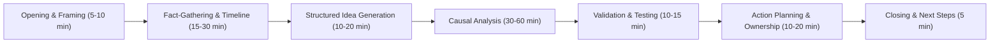

## Time Boxing and Session Structure

### Overview

RCA workshops without deliberate time structure tend to fail in one of two directions: they run long and exhaust participant attention before reaching a validated root cause, or they compress complex causal reasoning into a rushed session that produces premature closure. Time boxing — allocating fixed, pre-committed time blocks to each phase of the investigation — combined with a clear session structure, addresses both failure modes by making time constraints explicit and managed rather than incidental.

---

### Why Time Structure Matters for RCA Specifically

- **Key Points**
  - Unbounded discussion tends to expand to fill available time (Parkinson's Law effect), often on the first plausible cause raised, rather than systematically covering the full candidate space.
  - Conversely, RCA sessions without protected time for each phase are the first casualty when organizational schedules run over, causing investigations to be cut short before validation.
  - Explicit time boxes give the facilitator legitimate authority to move the group forward ("we've allocated 10 minutes for this branch, and we're at time") without this being read as arbitrarily cutting off legitimate discussion.
  - Predictable structure reduces participant anxiety about session length, which can itself support psychological safety — participants are more willing to contribute candidly when they aren't worried the session will run indefinitely.

---

### A Typical RCA Session Structure

#### Phase 1: Opening and Framing (5–10 minutes)

- State the purpose, scope, and just-culture framing explicitly (see psychological safety topic).
- Confirm roles: facilitator, scribe, SME(s), and other participants.
- Restate the specific event or problem statement being investigated, ensuring shared understanding before analysis begins.

#### Phase 2: Fact-Gathering and Timeline Confirmation (15–30 minutes)

- Establish the agreed sequence of events, distinguishing confirmed facts from assumptions or disputed claims.
- This phase should conclude with a shared, visible timeline or fact base before moving into causal analysis — attempting causal analysis on a disputed or incomplete factual record generates weak conclusions.

#### Phase 3: Structured Idea Generation (10–20 minutes)

- Silent generation (brainwriting/NGT stage 1) or round-robin brainstorming to populate the candidate cause pool, as covered under structured brainstorming techniques.
- Time-boxed strictly, since this phase is prone to either rushing (if skipped) or over-running (if allowed to become open discussion prematurely).

#### Phase 4: Causal Analysis (30–60 minutes, often the largest block)

- 5 Whys chains, fishbone categorization, or fault tree construction, depending on the chosen method and complexity of the incident.
- Often subdivided into per-branch time boxes when multiple causal branches are being investigated in parallel (see multi-causal analysis).

#### Phase 5: Validation and Testing (10–15 minutes)

- Explicitly test the proposed root cause(s) against the timeline and evidence: "if we removed this cause, would the event still have occurred?"
- Check for the "reluctance to simplify" gap: has an alternative explanation been seriously considered and ruled out, or just not raised?

#### Phase 6: Action Planning and Ownership (10–20 minutes)

- Assign corrective actions to specific, named owners with target dates — a root cause without an assigned corrective action rarely results in change.
- Distinguish preventive actions (address the root cause) from mitigative actions (reduce impact if it recurs), consistent with bowtie-style thinking.

#### Phase 7: Closing and Next Steps (5 minutes)

- Confirm what will be documented, who will receive the report, and what follow-up (if any) is scheduled.
- Thank participants, particularly those who made difficult disclosures, reinforcing psychological safety for future sessions.
- **Example**

  A 2-hour RCA workshop for a moderate-severity manufacturing incident might allocate: 10 min opening, 25 min fact-gathering, 15 min brainwriming, 45 min fishbone/5 Whys analysis, 15 min validation, 15 min action planning, 5 min closing — with a visible countdown or agenda posted for all participants.

---

### Time Boxing Techniques

#### Fixed Agenda with Visible Time Allocations

Publishing the time budget for each phase in advance (in the meeting invite or opening slide) sets expectations and gives the facilitator a shared reference point to enforce, rather than appearing to impose limits arbitrarily mid-session.

#### Per-Branch Time Boxes for Multi-Causal Investigations

When multiple causal branches are explored (e.g., three fishbone categories investigated in parallel or in sequence), allocate and enforce roughly equal time per branch to prevent the first-discussed branch from consuming disproportionate attention purely by going first.

#### "Parking Lot" for Overflow

Ideas or tangents that exceed their time box are recorded in a visible parking lot rather than dropped, allowing the facilitator to move forward while preserving the idea for later revisit — reducing resistance to time enforcement.

#### Explicit Time Checkpoints

The facilitator calls out remaining time at defined intervals ("5 minutes left in this phase") rather than only at the boundary, giving the group opportunity to converge naturally rather than being cut off abruptly.

#### Buffer Time

Reserving 10–15% of total session time as unallocated buffer absorbs minor overruns in earlier phases without cascading delays through the entire agenda. [Inference] The specific buffer percentage is a general facilitation heuristic rather than a validated figure specific to RCA; actual appropriate buffer size depends on incident complexity and team familiarity with the process.

---

### Illustrative Diagram: RCA Session Time Allocation (svg_diagram)

---

### Adjusting Time Structure for Incident Severity and Complexity

| Incident Type | Suggested Total Duration | Structural Adjustment |
| --- | --- | --- |
| Minor near-miss | 30–45 minutes | Compress fact-gathering and skip formal brainstorming; may use a lightweight linear 5 Whys only |
| Moderate incident | 90–120 minutes | Full structure as outlined above, single session |
| Major/complex incident | Multiple sessions over days/weeks | Split phases across sessions (e.g., fact-gathering as its own session before causal analysis); use asynchronous methods between sessions |
| Regulatory/high-visibility incident | Extended, multi-week | Formal phase gates, external facilitator, dedicated time boxes per causal branch, may include multiple validation rounds |

---

### Facilitator Techniques for Enforcing Time Boxes Without Damaging Trust

- **Key Points**
  - Frame time limits as a shared team commitment established at the outset, not a unilateral facilitator decision imposed mid-discussion.
  - When cutting off a productive but over-time discussion, explicitly acknowledge its value and commit to a specific next step (parking lot, follow-up session) rather than simply moving on.
  - Distinguish between a discussion that is over time because it is unproductive (appropriately redirected) versus over time because it has surfaced a genuinely important, previously unrecognized branch (a candidate for extending that specific time box, drawing from reserved buffer time).
  - Avoid rigidly enforcing time boxes in a way that recreates the "premature closure" failure mode this chapter otherwise warns against — time structure should protect thoroughness, not substitute for it.

---

### Common Pitfalls

- **No time structure at all**: sessions expand indefinitely or get cut short unpredictably, undermining both thoroughness and participant trust in the process.
- **Overly rigid enforcement**: treating time boxes as absolute regardless of what is being cut off can suppress exactly the kind of dissenting or complicating information the process needs (conflicts with reluctance to simplify).
- **No buffer time**: any overrun in an early phase cascades through the entire session, typically compressing the most important phase (causal analysis) to accommodate it.
- **Skipping validation to save time**: cutting phase 5 (validation and testing) under time pressure is a common but costly shortcut, since it is precisely the step that catches premature or incomplete causal conclusions.
- **Time-boxing without a visible agenda**: enforcing time limits that participants were not told about in advance feels arbitrary and can damage trust in the facilitator's neutrality.

---

### Related Topics

- Facilitating remote and asynchronous investigations (preceding topic)
- Facilitator, scribe, and subject matter expert roles
- Structured brainstorming techniques
- Validating root causes against timeline and evidence
- Action planning and corrective action ownership
- Multiple root causes and causal interaction (per-branch time allocation)
- Building psychological safety for honest input
- Bowtie model (preventive vs. mitigative action planning)