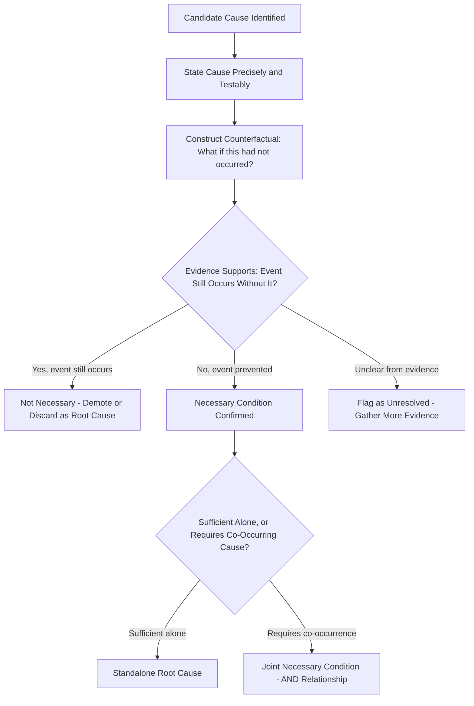

## The Removal Test for Candidate Root Causes

### Overview

The removal test (sometimes called the counterfactual test or "but-for" test) is a validation technique for confirming whether a candidate cause identified during a 5 Whys or fishbone analysis is genuinely a root cause, rather than merely a correlated or contributing factor. The test asks a single, precise question: if this candidate cause had not been present, would the failure event still have occurred? A rigorously applied removal test is one of the primary safeguards against the premature closure and false-simplification failure modes discussed throughout this course.

---

### The Core Logic

The removal test formalizes counterfactual reasoning already implicit in causal analysis:

$$\text{If } \neg C \Rightarrow \neg E, \text{ then } C \text{ is (at least) a necessary condition for } E$$

Where $C$ is the candidate cause and $E$ is the observed failure event. If removing $C$ (hypothetically) would still have allowed $E$ to occur, then $C$ is not a necessary cause — it may be a contributing factor, a coincidental correlate, or entirely irrelevant.

- **Key Points**
  - The test evaluates **necessity**, not sufficiency — a cause can pass the removal test (was necessary) without being sufficient on its own (see multiple root causes and causal interaction).
  - This is why the removal test is typically applied to *each* candidate cause in a multi-causal model individually, rather than only to a single terminal "root cause."
  - The test is counterfactual and therefore inherently a thought experiment grounded in evidence, not a literal experiment (in most RCA contexts, the failure cannot be safely or ethically re-run with the candidate cause removed).

---

### How to Apply the Removal Test

#### Step 1: State the Candidate Cause Precisely

Vague causes ("poor communication," "human error") cannot be meaningfully tested. The candidate must be specific enough that its presence or absence is a clear, checkable proposition.

- **Example**

  Weak: "Communication was poor." Testable: "The shift-change handoff did not include the abnormal sensor reading logged 40 minutes prior."

#### Step 2: Construct the Counterfactual Scenario

Explicitly describe what would have been different if the candidate cause had not occurred, holding all other known conditions constant.

- **Example**

  "If the shift-change handoff had included the abnormal sensor reading, would the incoming operator have taken different action?"

#### Step 3: Evaluate Against Evidence, Not Assumption

Answering the counterfactual requires evidence — procedure documents, similar historical incidents, operator testimony about standard practice — rather than the investigation team's intuition about what "probably" would have happened.

- **Key Points**
  - If evidence indicates the incoming operator would have taken the same action even with the information (e.g., the reading was ambiguous and within a range operators are trained to disregard), the candidate cause fails the removal test as a root cause, even though it remains worth noting as a process weakness.
  - If evidence indicates the incoming operator would very likely have investigated further or taken a different action, the candidate cause passes the removal test.

#### Step 4: Explicitly Record the Test Result

Document the removal test question, the evidence considered, and the conclusion (necessary / not necessary / insufficient evidence to determine) as part of the formal RCA record — not just the final accepted causes.

---

### Distinguishing Necessity from Sufficiency in the Test

| Result | Interpretation | Implication |
| --- | --- | --- |
| Removing $C$ would have prevented $E$ | $C$ is necessary | Retain as a root cause candidate; check if sufficient alone or requires co-occurring conditions |
| Removing $C$ would NOT have prevented $E$ | $C$ is not necessary | Demote to contributing factor or discard; investigate what remains necessary |
| Removing $C$ alone insufficient, but combined with removing another factor $C_2$ prevents $E$ | $C$ and $C_2$ are jointly necessary (AND relationship) | Both must appear in the causal model; corrective action may need to address either or both |
| Uncertain / evidence does not clearly resolve the counterfactual | Insufficient evidence | Flag explicitly as unresolved; do not silently default to inclusion or exclusion |

- **Example**

  In an outage investigation: removing the memory leak alone would not have prevented the outage (auto-restart monitoring would have caught it) — fails removal test alone. Removing the disabled monitoring alone also would not have prevented it (no leak, nothing to catch) — also fails alone. But removing either one, given the other's presence, would have prevented the specific outage — establishing an AND relationship between the two necessary conditions, consistent with multi-causal modeling.

---

### Illustrative Diagram: Removal Test Decision Flow (svg_diagram)

---

### Applying the Removal Test Within a 5 Whys Chain

- **Key Points**
  - The removal test should be applied at each level of a Why-chain, not only at the terminal answer — an intermediate "Why" answer that fails the removal test invalidates everything built on top of it in that chain.
  - This catches a common 5 Whys failure: constructing a plausible-sounding narrative chain where an early link doesn't actually hold up under counterfactual scrutiny, even though the final answer sounds reasonable.
- **Example**

  Chain: "Machine stopped → Why? Sensor failed → Why? Sensor was old → Why? Replacement schedule was missed → Root cause: maintenance scheduling gap." Applying the removal test to the second link: "If the sensor had not been old, would it still have failed?" If evidence shows sensor age was not actually correlated with the failure mode observed (e.g., the failure was due to a firmware bug unrelated to age), this link fails the removal test and the entire downstream chain (ending in "maintenance scheduling gap") is invalidated, even though it sounds like a coherent story.

---

### Relationship to Other Validation Concepts

- **Key Points**
  - The removal test operationalizes the "reluctance to simplify" HRO principle by forcing an evidence-based check rather than accepting a narratively satisfying chain.
  - It complements, rather than replaces, fault tree AND/OR logic — the removal test is how each individual node's necessity in that logic is empirically justified, rather than asserted.
  - It differs from a **sufficiency test** (would this cause, by itself, reliably produce this exact failure?), which is a separate and complementary validation step — a full validation typically checks both necessity (removal test) and sufficiency for each candidate cause or combination.

---

### Limitations of the Removal Test

- **Key Points**
  - Counterfactual reasoning is inherently uncertain — the test relies on evidence-based estimation of what "would have" happened, not observed fact, since the event cannot be re-run.
  - In systems with significant randomness or emergent behavior (see limits of linear RCA), the counterfactual may be genuinely indeterminate — removing one condition might have prevented this specific failure while leaving the system just as likely to fail via a different pathway shortly after.
  - The quality of the removal test is bounded by the quality of available evidence; in the absence of strong evidence (historical data, clear procedural standards, reliable testimony), the test risks becoming another vehicle for the investigation team's prior assumptions rather than a genuine check on them.
  - [Inference] The removal test is a widely taught RCA validation heuristic; its formal name and framing vary across methodologies (some sources use "counterfactual test," others "but-for test," borrowing from legal causation analysis), though the underlying logic is consistent across these framings.

---

### Common Pitfalls

- **Testing vague causes**: applying the removal test to imprecisely stated causes ("bad communication," "lack of training") produces an untestable, unfalsifiable result.
- **Substituting intuition for evidence**: answering the counterfactual based on what "feels right" to the investigation team rather than checking against actual historical patterns, procedures, or testimony.
- **Only testing the final root cause**: skipping the removal test on intermediate links in a Why-chain, allowing an invalid early link to silently support an unjustified final conclusion.
- **Conflating necessity with sufficiency**: concluding a cause is "the" root cause because it passes the removal test, without checking whether it was sufficient alone or required co-occurring conditions.

---

### Related Topics

- Time boxing and session structure (preceding topic)
- Multiple root causes and causal interaction
- Fault Tree Analysis AND/OR gate logic
- Limits of linear RCA in complex systems
- Sufficiency testing for candidate causes
- Evidence standards and distinguishing fact from hypothesis in RCA
- Reluctance to simplify (High Reliability Organization principle)
- Corrective action validation and effectiveness checks