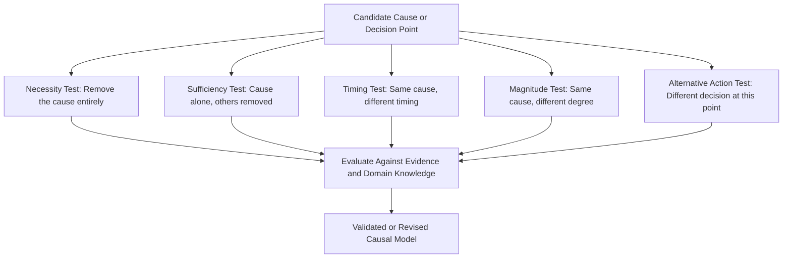

## Counterfactual Reasoning in Causal Validation

### Overview

Counterfactual reasoning is the general logical framework underlying causal validation techniques in RCA, including the removal test covered previously. It involves reasoning about what would have happened in a hypothetical scenario that differs from actual events in one specific respect, holding everything else constant. While the removal test applies counterfactual reasoning to test necessity of a single candidate cause, this topic covers the broader theory, formal structure, and range of applications of counterfactual reasoning across RCA validation activities.

---

### Formal Structure of a Counterfactual Claim

A counterfactual causal claim takes the general form:

$$\text{If } C \text{ had not occurred (holding all else equal)}, \text{ then } E \text{ would not have occurred}$$

This is distinct from a purely observational or correlational claim, which only states that $C$ and $E$ occurred together, without asserting what would have happened in $C$'s absence.

- **Key Points**
  - The counterfactual is inherently unobservable directly — the actual world had $C$ present, so the "$C$ absent" world is a constructed hypothesis, evaluated using evidence and domain knowledge rather than direct observation.
  - "Holding all else equal" (the *ceteris paribus* clause) is doing significant work and is often where counterfactual reasoning goes wrong — in complex systems, removing one condition may not leave "everything else" unchanged (see limits of linear RCA and feedback loops).
  - This framework traces to philosophical work on causation (notably David Lewis's possible-worlds semantics for counterfactuals) but is applied in RCA in a practical, evidence-grounded rather than formal-logical way.

---

### The Role of "Nearest Possible World" Reasoning

Philosophically, evaluating a counterfactual involves imagining the "nearest possible world" in which the antecedent (the candidate cause's absence) holds, while otherwise resembling the actual world as closely as possible.

- **Key Points**
  - In RCA practice, this translates to: "What is the most plausible way this specific condition could have been different, given everything else we know about the situation?" — not an arbitrary or maximally different alternative scenario.
  - Choosing an implausible or overly distant counterfactual scenario (e.g., "if the entire safety culture had been different") produces a less useful validation than a closely matched one (e.g., "if this specific alarm threshold had been set 5% lower").
  - [Inference] This philosophical grounding is rarely made explicit in RCA training materials, which tend to teach counterfactual testing as a practical heuristic (the removal test) rather than derive it from formal counterfactual logic — the connection is presented here for conceptual completeness rather than as standard RCA curriculum content.

---

### Applications of Counterfactual Reasoning in RCA Validation

#### 1. Necessity Testing (The Removal Test)

As covered in the prior topic: "would $E$ still have occurred without $C$?" Establishes whether $C$ is a necessary condition.

#### 2. Sufficiency Testing

The complementary counterfactual: "would $C$ alone, without other contributing factors, have been enough to produce $E$?"

- **Example**

  Testing whether a single sensor malfunction alone (without any concurrent staffing shortage) would have been sufficient to cause a missed alarm, by checking whether backup detection mechanisms would have caught it under normal staffing.

#### 3. Timing and Sequence Counterfactuals

Testing whether altering the *timing* of a condition, rather than its presence/absence, would have changed the outcome.

- **Example**

  "If the maintenance inspection had occurred one week earlier as originally scheduled (rather than being delayed), would the worn component have been identified before failure?"

#### 4. Magnitude/Threshold Counterfactuals

Testing whether a different magnitude of a continuous factor (not just presence/absence) would have changed the outcome — relevant when a factor exists on a spectrum rather than as a binary condition.

- **Example**

  "If staffing had been at 90% rather than 70% of planned levels, would the workload have remained manageable enough to catch the anomaly?"

#### 5. Alternative Action Counterfactuals

Testing whether a different decision or action at a specific point (rather than a different background condition) would have changed the outcome — commonly used when evaluating human decision points in the causal chain.

- **Example**

  "If the operator had escalated to a supervisor at the first anomalous reading rather than the third, would the outcome have differed?" This must be evaluated against what was reasonably knowable and expected at that decision point (avoiding hindsight bias), not simply whether a different action would have helped in retrospect.

---

### Illustrative Diagram: Types of Counterfactual Tests in RCA (svg_diagram)

---

### Guarding Against Hindsight Bias in Counterfactual Reasoning

- **Key Points**
  - Counterfactual reasoning is especially vulnerable to hindsight bias: once the outcome is known, alternative actions or conditions can seem more obviously correct or available than they actually were at the time.
  - Rigorous counterfactual validation asks "what would a reasonable person have known and done at that point in time, given only the information available then?" rather than "what do we now know would have worked?"
  - This is why alternative-action counterfactuals (testing human decisions) require particular care — evaluating a past decision using present knowledge of the outcome tends to unfairly indict reasonable decisions and can also let genuinely poor decision *processes* off the hook if they happened to produce an acceptable outcome by chance.
- **Example**

  If an operator did not escalate a reading that was, at the time, within the documented normal range (even though it later proved to be an early warning sign), a rigorous counterfactual analysis distinguishes "the operator made a reasonable decision given available information" from "the documented normal range itself should be reconsidered" — locating the corrective action in the threshold definition rather than in the individual's judgment.

---

### Evidence Standards for Evaluating Counterfactuals

- **Key Points**
  - **Strongest evidence**: comparable historical incidents where the candidate condition was genuinely absent, allowing direct comparison of outcomes.
  - **Moderate evidence**: documented procedures, engineering specifications, or design tolerances indicating expected behavior under the counterfactual condition.
  - **Weaker but still useful evidence**: expert/SME judgment grounded in domain experience, explicitly flagged as expert estimation rather than empirical fact.
  - **Weakest, use with caution**: unstructured team intuition or consensus without grounding in any of the above — this is where counterfactual reasoning risks collapsing into unfalsifiable assertion.
  - The scribe should record which evidence tier supported each counterfactual conclusion, since this materially affects how much confidence should be placed in the resulting causal model.

---

### Relationship to Broader RCA and Systems Thinking Concepts

- **Key Points**
  - Counterfactual reasoning underpins the removal test but extends further into how corrective actions are justified: an effective corrective action is typically one that would have altered the counterfactual outcome, and post-implementation review can retrospectively check this logic.
  - In multi-causal models (AND/OR structures), each edge in the causal graph should, in principle, be justified by a counterfactual claim — "if this specific link had not held, would the downstream node still have occurred?"
  - Complex, tightly-coupled, or emergent systems (per the limits of linear RCA) complicate counterfactual reasoning specifically because the "holding all else equal" assumption becomes less tenable — removing one condition in a tightly coupled system may cascade into changes elsewhere that a simple counterfactual does not capture. [Inference] This is a recognized theoretical tension between counterfactual causal reasoning and complex systems thinking; how individual RCA methodologies resolve it in practice varies, and no single resolution is universally adopted.

---

### Common Pitfalls

- **Distant or implausible counterfactuals**: constructing a hypothetical scenario so different from actual events that the comparison provides little validation value.
- **Hindsight contamination**: evaluating past decisions or conditions using knowledge only available after the outcome, inflating the apparent obviousness of an alternative path.
- **Ignoring ceteris paribus violations**: assuming other conditions would have remained unchanged when, in a tightly coupled system, removing one factor plausibly would have changed others as well.
- **Treating counterfactual conclusions as certain**: presenting a counterfactual judgment (inherently a hypothesis about an unobserved scenario) with the same confidence as a directly observed fact, without noting the evidence tier it rests on.

---

### Related Topics

- The removal test for candidate root causes (preceding topic)
- Sufficiency testing for candidate causes
- Hindsight bias in accident investigation
- Multiple root causes and causal interaction (AND/OR logic justification)
- Limits of linear RCA in complex systems (ceteris paribus challenges)
- Evidence standards and distinguishing fact from hypothesis in RCA
- Fault Tree Analysis quantification
- Corrective action effectiveness validation