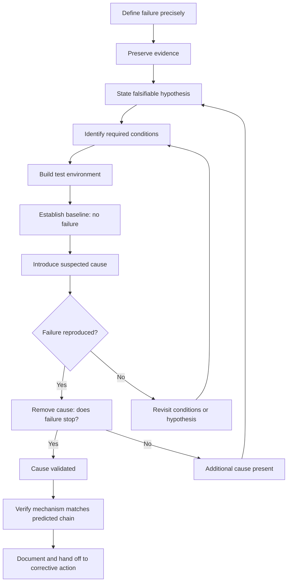
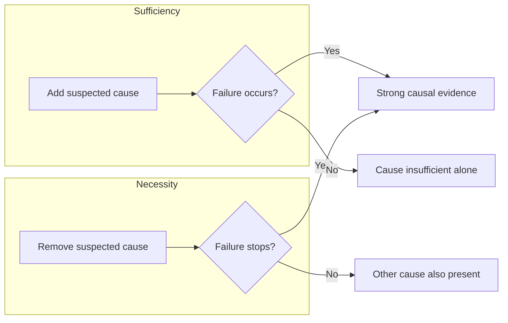
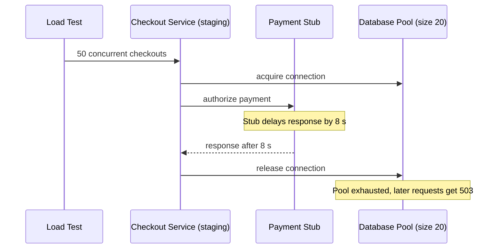

## Reproducing or Simulating the Failure Condition


### Purpose and Role in Root Cause Validation

A candidate root cause from a "5 Whys" chain or any other RCA technique is only a hypothesis until it has been tested. Reproducing or simulating the failure condition is the strongest form of validation available: if you can **cause** the failure on demand by introducing the suspected cause, and **prevent** it by removing that cause, you have direct causal evidence rather than a plausible narrative.

Reproduction answers three questions:

1. **Sufficiency**: Does the suspected cause, in the suspected context, produce the failure?
2. **Necessity**: Does removing or neutralizing the suspected cause eliminate the failure?
3. **Mechanism**: Does the failure unfold through the same causal chain the analysis predicted?

**Key Points**

- Reproduction converts a "we believe" into a "we demonstrated."
- A failure that reproduces only when the suspected cause is present is strong evidence. A failure that reproduces without it means the analysis is incomplete or wrong.
- Failure to reproduce is itself informative: it means a relevant condition has not yet been identified.
- Reproduction must be safe. Never attempt to reproduce a failure in production if it could cause harm, data loss, or regulatory exposure.

### Reproduction vs. Simulation vs. Replay

| Approach | Definition | Typical Use | Fidelity | Risk |
| --- | --- | --- | --- | --- |
| **Direct reproduction** | Recreate the failure in the original or an identical environment using the same inputs and conditions | Software bugs, repeatable mechanical faults | Highest | Can be high if run in production |
| **Simulation** | Model the system (physical, numerical, or behavioral) and inject the suspected condition | Systems too dangerous, costly, or slow to test directly | Depends on model validity | Low |
| **Replay** | Feed recorded real inputs (logs, traffic, sensor data) back into a system | Distributed systems, data pipelines, network incidents | High for input-driven failures | Low to moderate |
| **Partial or component reproduction** | Isolate one subsystem and test only the suspected cause | Complex assemblies, microservices | Moderate | Low |
| **Analogical or surrogate testing** | Test a similar system or material under equivalent conditions | Destroyed evidence, one-time events | Lower | Low |
| **Tabletop or walk-through** | Step through the scenario with people and documents instead of live systems | Process, procedural, and human-factors failures | Lowest technical fidelity | Very low |

### Prerequisites Before Attempting Reproduction

#### 1. A Precise Failure Definition

Vague symptoms cannot be reproduced. Write the failure as an observable, falsifiable statement.

- Poor: "The checkout service was flaky."
- Better: "Between 14:02 and 14:19 UTC, 12% of `POST /checkout` requests returned HTTP 503 with a `connection pool exhausted` error."

#### 2. A Falsifiable Root Cause Hypothesis

State the hypothesis so that an experiment can prove it wrong.

> *If* the database connection pool is limited to 20 connections *and* request concurrency exceeds 20 for longer than the 30 s acquisition timeout, *then* requests will fail with pool exhaustion errors.

#### 3. Evidence Preservation

Before altering anything, capture:

- Logs, metrics, traces, core dumps, and configuration snapshots
- Physical evidence (failed parts, photographs, chain-of-custody records)
- Environment state (versions, feature flags, data volumes, time and clock state)

#### 4. A Baseline

Establish that the system behaves correctly under known-good conditions, so that later differences are attributable to your intervention.

### The Reproduction Workflow



### Identifying the Conditions That Must Be Recreated

A failure is rarely caused by a single factor. Enumerate all categories of conditions and decide which are essential.

| Category | Examples |
| --- | --- |
| **Inputs** | Payload contents, user actions, sensor values, edge-case data |
| **State** | Database contents, cache warmth, session data, queue depth |
| **Environment** | OS version, library versions, hardware, network topology, temperature, humidity |
| **Configuration** | Timeouts, limits, feature flags, permissions |
| **Load and concurrency** | Request rate, parallelism, resource contention |
| **Timing** | Race windows, clock skew, ordering of events, time of day, scheduled jobs |
| **Human and procedural** | Shift changes, missing steps, ambiguous instructions, fatigue |
| **External dependencies** | Third-party API latency, upstream outages, supplier material batches |

**Key Points**

- Start by recreating as much of the original condition as possible, then **reduce** (minimize) to find the smallest set of conditions that still triggers the failure.
- Track which conditions you could not recreate and treat them as threats to validity.

### Techniques by Domain

#### Software and Distributed Systems

**Deterministic reproduction**

- Reproduce using the exact inputs, versions, configuration, and data snapshot from the incident.
- Pin dependencies and container image digests rather than mutable tags.
- Control randomness with fixed seeds and control time with injectable clocks.

```python
import random
from datetime import datetime, timezone

def make_clock(fixed_iso):
    fixed = datetime.fromisoformat(fixed_iso).replace(tzinfo=timezone.utc)
    return lambda: fixed

# Reproduce a bug that only occurs at a DST or month-end boundary
clock = make_clock("2024-03-31T23:59:59")
random.seed(42)
result = process_invoices(clock=clock)
```

**Log and traffic replay**

- Capture production requests (with sensitive fields scrubbed) and replay against a staging copy.
- Tools in this category include GoReplay, `tcpreplay`, Kafka topic re-consumption, and HTTP archive (HAR) replay. Exact capabilities vary by tool version.

**Load and concurrency reproduction**

```bash
# Reproduce suspected connection pool exhaustion
# 50 concurrent clients for 60 seconds against a pool sized at 20
hey -z 60s -c 50 -m POST -d '{"cart_id": 123}' https://staging.example.com/checkout
```

**Fault injection and chaos experiments**

Deliberately introduce the suspected fault to test the hypothesis:

- Add network latency or packet loss: `tc qdisc add dev eth0 root netem delay 300ms loss 5%`
- Kill a dependency or restart a node
- Exhaust disk, memory, or file descriptors
- Skew the system clock

**Race conditions and timing bugs**

- Insert deliberate delays (`sleep`) at suspected race windows to widen them.
- Run the test thousands of times; report a failure *rate* rather than a single pass or fail.
- Use thread sanitizers, deterministic schedulers, or record-and-replay debuggers where available.

```python
import concurrent.futures, collections

def hammer(fn, n=5000, workers=32):
    outcomes = collections.Counter()
    with concurrent.futures.ThreadPoolExecutor(workers) as pool:
        for ok in pool.map(lambda _: fn(), range(n)):
            outcomes["pass" if ok else "fail"] += 1
    return outcomes
```

**Minimal reproduction case**

Reduce the reproduction until removing any element makes the failure disappear. Techniques include manual bisection, delta debugging, and `git bisect` for regressions.

```bash
git bisect start
git bisect bad HEAD
git bisect good v2.3.0
git bisect run ./reproduce_failure.sh
```

#### Mechanical and Physical Systems

- **Accelerated life and stress testing**: Apply elevated load, temperature, vibration, or cycle count to reproduce fatigue, wear, or thermal failures faster than field conditions.
- **Materials analysis**: Examine fracture surfaces, corrosion products, and metallurgy on failed parts, then test surrogate parts under the suspected loading.
- **Bench and rig testing**: Recreate the assembly and load path on a test rig with instrumentation (strain gauges, thermocouples, accelerometers).
- **Finite element and physics simulation**: Model stress, heat flow, or fluid dynamics to see whether the suspected condition produces the observed failure location and mode.

Accelerated testing relies on an acceleration model. A common example for thermally driven failures is the Arrhenius relationship:

$$AF = \exp\left[\frac{E_a}{k}\left(\frac{1}{T_{use}} - \frac{1}{T_{stress}}\right)\right]$$

where $AF$ is the acceleration factor, $E_a$ is the activation energy in eV, $k$ is Boltzmann's constant ($8.617 \times 10^{-5}$ eV/K), and temperatures are in kelvin. [Inference] The validity of any acceleration factor depends on the failure mechanism staying the same at stress levels as in the field; if the mechanism changes, the result does not transfer.

#### Process, Manufacturing, and Quality Failures

- **Designed experiments (DOE)**: Vary suspected factors systematically (for example, machine speed, material lot, operator) to isolate which produce defects.
- **Process replay with controlled variables**: Run production with the suspected input (a specific supplier lot, a skipped step) under supervision and observe defect rates.
- **Gemba walk and process observation**: Watch the actual work being done to see conditions that documentation does not capture.
- **Measurement system analysis**: Confirm the measurement itself is reliable before concluding a process reproduces a defect.

#### Human and Procedural Failures

Human-factors failures should be simulated in ways that respect people and avoid blame.

- **Tabletop exercises**: Walk a team through the incident timeline using only the information available at each decision point.
- **Simulator or drill reproduction**: Recreate the conditions (alarm floods, ambiguous displays, time pressure) in a training simulator.
- **Procedure walkthrough**: Have someone unfamiliar follow the written procedure literally to expose ambiguity or missing steps.
- **Hindsight-bias control**: Present participants with only the cues available at the time, not the known outcome.

#### Data and Analytical Failures

- Recompute the report or model from the raw inputs at the time of the failure.
- Re-run the pipeline with the suspected malformed record, schema change, or late-arriving data.
- Compare outputs against a known-good baseline dataset.

### Designing a Sound Experiment

#### Necessity and Sufficiency Tests



| Result of Adding Cause | Result of Removing Cause | Interpretation |
| --- | --- | --- |
| Failure occurs | Failure stops | Strong evidence the cause is both sufficient and necessary in this context |
| Failure occurs | Failure persists | Cause is sufficient but not the only cause; look for additional causes |
| No failure | Failure stops (in original system) | Cause is necessary but requires additional enabling conditions |
| No failure | Failure persists | Hypothesis likely wrong; reconsider the chain |

#### Controls and Variables

- Change **one variable at a time** wherever practical.
- Use a **control group** or control run with no intervention.
- **Randomize** run order to avoid drift or time-of-day effects.
- **Blind** the observers when subjective judgment is involved.

#### Repeatability and Statistics

For intermittent failures, one success or one failure proves little. Report rates and confidence.

If a failure occurred in $k$ of $n$ trials, the observed failure rate is:

$$\hat{p} = \frac{k}{n}$$

To estimate how many trials are needed to be reasonably confident that a failure of true probability $p$ would appear at least once:

$$n \geq \frac{\ln(1 - C)}{\ln(1 - p)}$$

where $C$ is the desired confidence. For example, with $p = 0.01$ (1% failure rate) and $C = 0.95$, $n \geq \ln(0.05)/\ln(0.99) \approx 298$ trials.

The "rule of three" gives a quick upper bound: if zero failures occur in $n$ trials, the 95% upper confidence bound on the failure probability is approximately $3/n$.

### Worked Example: Intermittent Checkout Failures

**Incident**: Between 14:02 and 14:19 UTC, 12% of checkout requests returned HTTP 503.

**5 Whys chain (hypothesis)**

1. Why did checkouts fail? The service returned 503 errors.
2. Why 503? The service could not obtain a database connection.
3. Why no connection? The connection pool was exhausted.
4. Why exhausted? Each request held a connection while calling a slow payment API.
5. Why slow? The payment provider latency rose from 200 ms to 8 s, and there was no timeout on the payment call.

**Root cause hypothesis**: A missing timeout on the payment API call causes connections to be held during provider slowdowns, exhausting the pool.

**Reproduction plan**



**Steps**

1. **Baseline**: Run 50 concurrent clients against staging with the payment stub responding in 200 ms. Expected: 0 errors.
2. **Introduce cause**: Configure the stub to respond in 8 s. Rerun. Expected: pool exhaustion and 503s.
3. **Remove cause (fix)**: Add a 2 s timeout to the payment call. Rerun with the 8 s stub. Expected: no pool exhaustion; timeouts return a controlled error.
4. **Verify mechanism**: Confirm from metrics that active connections hit 20 and wait time exceeded the acquisition timeout, matching production traces.

**Sample results**

| Run | Payment stub latency | Payment timeout | Requests | 503 count | Failure rate |
| --- | --- | --- | --- | --- | --- |
| Baseline | 200 ms | none | 3,000 | 0 | 0.0% |
| Cause introduced | 8 s | none | 3,000 | 1,410 | 47.0% |
| Fix applied | 8 s | 2 s | 3,000 | 0 (controlled 504s instead) | 0.0% |

**Conclusion**: The failure reproduces only when slow payment responses coincide with no timeout, and disappears when the timeout is added. The observed staging failure rate (47%) exceeds production (12%) because the staging test held the slowdown constant, while production experienced a partial slowdown. [Inference] Matching the production rate would require reproducing the actual latency distribution rather than a constant delay.

### Reproduction Report Template

```markdown
#### Reproduction Record

- **Failure statement**: <observable, time-bounded description>
- **Hypothesis**: <falsifiable root cause statement>
- **Environment**: <versions, config, data snapshot, hardware>
- **Differences from incident environment**: <known gaps>
- **Procedure**: <numbered, repeatable steps>
- **Variables changed**: <one per run>
- **Controls**: <baseline and negative controls>
- **Trials and results**: <n, k, rate, dates>
- **Necessity test result**: <cause removed → outcome>
- **Mechanism match**: <does observed chain match predicted chain?>
- **Threats to validity**: <what could not be recreated>
- **Verdict**: Confirmed / Partially confirmed / Refuted / Inconclusive
- **Artifacts**: <scripts, logs, data links>
```

### Interpreting Outcomes

| Outcome | Meaning | Next Action |
| --- | --- | --- |
| **Reproduced and fixed by removing cause** | Root cause validated | Proceed to corrective and preventive actions |
| **Reproduced, but a different mechanism** | Root cause chain was wrong at some link | Revise the 5 Whys and retest |
| **Reproduced only with extra conditions** | Contributing or enabling factors exist | Add them to the causal model |
| **Not reproduced** | Missing condition, wrong hypothesis, or truly rare event | Widen conditions, add observability, or use probabilistic bounds |
| **Reproduced, but fix does not resolve it** | Additional cause present | Continue the analysis |

### Common Pitfalls

1. **Confirmation bias**: Designing a test that can only succeed. Include tests that could disprove the hypothesis.
2. **Reproducing a different failure**: The symptom looks similar, but the mechanism differs. Always compare the mechanism, not just the symptom.
3. **Over-simplified environment**: A local test with an empty database will not reproduce a failure that depends on table size or cache state.
4. **Heisenbugs**: Adding logging or a debugger changes timing and hides the failure. Prefer low-overhead tracing.
5. **Single-run conclusions**: One pass does not show a fix works for an intermittent fault.
6. **Unsafe reproduction**: Reproducing a safety-critical, security, or data-destroying failure in production.
7. **Destroying evidence**: Running experiments on the only failed part or the only copy of the data.
8. **Ignoring the human context**: Treating a procedural failure as purely technical, or blaming individuals instead of conditions.
9. **Stopping at the first cause**: Reproduction of one cause does not prove it is the *only* cause.
10. **Unrecorded conditions**: Results that cannot be repeated because environment details were not captured.

### Safety, Ethics, and Governance

- Use isolated, production-like environments rather than production wherever possible.
- Scrub or synthesize personal and confidential data in replayed traffic.
- Obtain approvals for destructive tests, and define abort criteria and rollback plans.
- For regulated or safety-critical industries (aviation, medical devices, energy), follow applicable investigation protocols and evidence rules, which vary by jurisdiction and industry.
- Preserve chain of custody for physical evidence, and document who handled it and when.

### When Reproduction Is Not Possible

Some failures cannot be recreated: the evidence is destroyed, the event was unique, or reproduction is unsafe or prohibitively expensive. Alternatives, in rough order of evidentiary strength:

1. **Simulation or modeling** of the suspected mechanism
2. **Surrogate testing** on similar components or systems
3. **Forensic analysis** of remaining artifacts (fracture analysis, log forensics, memory dumps)
4. **Historical and statistical correlation** across similar incidents (for example, the failure occurs only on one supplier lot or software version)
5. **Expert review and elimination reasoning**, ruling out alternative causes using evidence
6. **Detection by instrumentation**: Add observability so that if the failure recurs, the cause can be confirmed directly

**Key Points**

- Clearly label conclusions reached without reproduction as lower confidence.
- Record which alternative hypotheses were ruled out and how.
- Treat added instrumentation and monitoring as part of the corrective action when reproduction is impossible.

### Checklist

- [ ] Failure defined precisely and measurably
- [ ] Evidence preserved before any intervention
- [ ] Hypothesis stated in falsifiable form
- [ ] Required conditions enumerated (inputs, state, environment, load, timing, human factors)
- [ ] Safe, isolated environment prepared
- [ ] Baseline run shows no failure
- [ ] Single-variable interventions with controls
- [ ] Sufficient number of trials for intermittent failures
- [ ] Necessity test performed (cause removed, failure stops)
- [ ] Mechanism compared to the predicted causal chain
- [ ] Threats to validity documented
- [ ] Results recorded in a repeatable, shareable format

**Conclusion**

Reproducing or simulating the failure condition is the most direct way to move a root cause from plausible to demonstrated. Effective reproduction depends on a precise failure definition, a falsifiable hypothesis, faithful recreation of the essential conditions, controlled experiments that test both sufficiency and necessity, and honest documentation of what could not be recreated. When reproduction is impossible, use the strongest available substitute and state the reduced confidence explicitly.

**Related Topics**

- Hypothesis testing and falsification in RCA
- Counterfactual analysis ("what if the cause had been absent?")
- Fault injection and chaos engineering
- Design of experiments (DOE) for process failures
- Delta debugging and minimal reproduction cases
- Accelerated life and stress testing
- Distinguishing root causes from contributing factors
- Verifying corrective action effectiveness
- Evidence preservation and chain of custody
- Fault tree analysis and Fishbone (Ishikawa) diagrams as cross-checks
- Observability design for future failure diagnosis