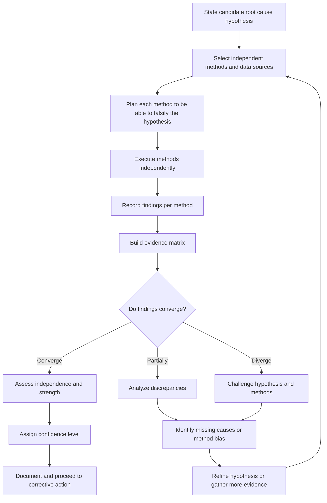
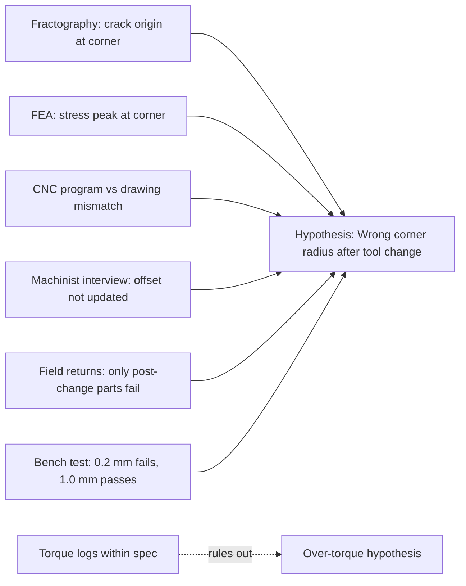

## Triangulating Findings Across Multiple Methods


### Purpose and Role in Root Cause Validation

A single analytical method can mislead. A "5 Whys" chain reflects the analyst's assumptions, a fishbone diagram reflects the brainstorming group's imagination, log analysis reflects only what was instrumented, and a reproduction experiment reflects only the conditions that were recreated. **Triangulation** is the practice of testing the same root cause hypothesis with multiple, independent methods, data sources, analysts, or perspectives, and treating **convergence** as evidence of validity and **divergence** as a signal that the analysis is incomplete or wrong.

The term comes from surveying and navigation: one bearing gives a line of position, two or more bearings intersecting give a fix. In RCA, each method contributes a "line of evidence," and confidence in a root cause grows where independent lines intersect.

**Key Points**

- Triangulation validates a *conclusion*, not just data. It asks whether different routes lead to the same causal explanation.
- The value of triangulation comes from **independence**. Three methods that share the same biased input add little confidence.
- Disagreement between methods is useful information; it locates gaps, hidden assumptions, and missing causes.
- Triangulation does not prove a cause with certainty. It raises or lowers confidence in a structured, documented way.

### Types of Triangulation

Social science and evidence-based investigation commonly distinguish several forms. All apply to RCA.

| Type | Definition | RCA Example |
| --- | --- | --- |
| **Method triangulation** | Use different analytical techniques on the same question | 5 Whys, fault tree, and log forensics all pointing to a missing timeout |
| **Data triangulation** | Use different data sources, times, or populations | Application logs, network traces, and customer tickets |
| **Investigator triangulation** | Have multiple analysts work independently | Two teams analyze the incident without seeing each other's conclusions |
| **Theory triangulation** | Interpret the evidence through competing hypotheses or frameworks | Comparing a technical-cause model with a human-factors model |
| **Environmental triangulation** | Test across different conditions, sites, or contexts | Same defect analyzed on line A, line B, and in the field returns |
| **Temporal triangulation** | Compare across different points in time | Incident data compared with prior near-misses and post-fix data |

### Categories of Evidence and Method Families

Effective triangulation draws lines of evidence from different families, because each family fails in different ways.

| Evidence Family | Example Methods | Typical Strength | Typical Weakness |
| --- | --- | --- | --- |
| **Testimonial** | Interviews, 5 Whys workshops, surveys, post-incident reviews | Captures context, intent, undocumented practice | Memory distortion, hindsight bias, social pressure |
| **Documentary** | Procedures, change tickets, design specs, maintenance records, audit trails | Objective, time-stamped, reviewable | May differ from real practice; may be incomplete |
| **Physical or empirical** | Failed part analysis, reproduction, bench tests, measurements | Direct causal evidence | Costly; may not represent field conditions |
| **Digital or telemetry** | Logs, metrics, traces, sensor data, database records | High volume, precise timing | Only covers what was instrumented; can be altered or lost |
| **Statistical** | Pareto analysis, regression, control charts, correlation across incidents | Shows patterns and prevalence | Correlation is not causation; requires adequate sample size |
| **Structural or logical** | Fault tree analysis, FMEA, causal maps, barrier analysis | Exposes causal structure and missing branches | Depends on the analyst's model of the system |
| **Observational** | Gemba walks, job shadowing, simulation exercises | Reveals work-as-done versus work-as-imagined | Observer effect; limited sampling |

**Key Points**

- Aim for at least **three lines of evidence from at least two different families** for any high-stakes root cause.
- Weight lines of evidence by reliability, directness, and independence rather than counting them equally.

### The Triangulation Workflow



### Step-by-Step Procedure

#### 1. State the Hypothesis Precisely

Write the candidate root cause as a specific, testable causal statement, including the mechanism.

> Missing timeout on the payment API call lets slow provider responses hold database connections, exhausting the pool and causing HTTP 503 errors.

#### 2. Derive Testable Predictions

Each method should test a *different consequence* of the hypothesis. If the hypothesis is true, what must also be true?

| Prediction | Method That Can Test It |
| --- | --- |
| Active DB connections reached the pool limit before errors began | Metrics and traces |
| Payment API latency rose before pool saturation | Telemetry timeline comparison |
| Payment client code has no timeout configured | Code review and configuration audit |
| Introducing a slow stub in staging reproduces the failure | Reproduction experiment |
| Adding a timeout eliminates the failure under the same test | Reproduction (necessity test) |
| Engineers report no timeout requirement was documented | Interviews and design document review |
| Earlier, smaller slowdowns produced smaller error spikes | Historical incident comparison |

#### 3. Select Independent Methods

Independence means the methods do not rely on the same underlying assumption, data source, or person. Check for:

- **Shared data**: two analyses built from the same log file are one line of evidence, not two.
- **Shared analyst bias**: the same person running all methods may repeat the same blind spot.
- **Shared model**: a fault tree and a 5 Whys derived from the same mental model are correlated.
- **Shared tooling artifacts**: the same monitoring tool may share the same sampling gap.

#### 4. Execute and Record Independently

- Where practical, have different analysts run different methods and record conclusions **before** comparing.
- Record raw findings separately from interpretation.
- Note the confidence, limitations, and conditions for each finding.

#### 5. Build an Evidence Matrix

Cross-tabulate hypotheses against evidence and mark each cell as supports, contradicts, or neutral.

| Evidence / Method | H1: Missing timeout | H2: Payment provider outage only | H3: DB failover event | H4: Traffic spike |
| --- | --- | --- | --- | --- |
| Pool metrics show saturation before errors | Supports | Supports | Neutral | Supports |
| Payment latency rose 200 ms → 8 s | Supports | Supports | Neutral | Neutral |
| Code has no payment call timeout | Supports | Neutral | Neutral | Neutral |
| Staging reproduction with slow stub | Supports | Neutral | Neutral | Neutral |
| Fix with timeout stops failure in staging | Supports | Contradicts | Neutral | Neutral |
| No DB failover in event log | Neutral | Neutral | Contradicts | Neutral |
| Request rate normal during incident | Neutral | Neutral | Neutral | Contradicts |
| Interviews: no timeout standard existed | Supports | Neutral | Neutral | Neutral |

**Reading the matrix**

- H1 has multiple supporting lines from different families and no contradictions.
- H2 (provider outage) is a *contributing trigger* but is contradicted by the fix test: the outage alone does not explain the impact without the missing timeout.
- H3 and H4 are contradicted by independent data and can be ruled out.

#### 6. Analyze Convergence and Divergence

| Pattern | Interpretation | Response |
| --- | --- | --- |
| **Full convergence from independent methods** | High confidence | Document and proceed |
| **Convergence but methods not truly independent** | Confidence overstated | Add an independent line of evidence |
| **Partial convergence** | Some causes right, others missing | Investigate the discrepancy and look for contributing factors |
| **Divergence** | At least one method is flawed, or the hypothesis is wrong | Audit each method's assumptions and data quality |
| **Convergence on a different cause than the original hypothesis** | Original hypothesis refuted | Restart from the new hypothesis |

#### 7. Assign and Document a Confidence Level

Use a defined scale so that confidence is consistent and reviewable.

| Level | Criteria |
| --- | --- |
| **High** | 3+ independent lines from 2+ evidence families; a necessity or sufficiency test passed; no unexplained contradictions |
| **Moderate** | 2 independent lines; minor unexplained discrepancies; no direct test performed |
| **Low** | Single line of evidence, or lines that are not independent; hypothesis remains plausible |
| **Refuted** | Direct contradiction from reliable evidence |

### Worked Example: Manufacturing Defect

**Incident**: A batch of machined brackets shows cracks after 3 weeks in service.

**5 Whys result (initial hypothesis)**: Operators over-torqued the assembly bolts, causing stress cracking.

**Triangulation lines**

| Line | Method | Finding | Family |
| --- | --- | --- | --- |
| 1 | Fractography on failed parts | Fracture surface shows fatigue beach marks originating at a machined corner radius, not at bolt holes | Physical |
| 2 | Torque logs from assembly tool | Torque within specification for all units in the batch | Digital |
| 3 | Finite element simulation | Peak stress concentration at the sharp corner exceeds fatigue limit under normal load; bolt preload alone does not | Structural |
| 4 | Drawing and CNC program review | Program cuts a 0.2 mm corner radius; drawing specifies 1.0 mm | Documentary |
| 5 | Interview with machinist | Tool was changed mid-shift; offset not updated | Testimonial |
| 6 | Field returns comparison | Only parts machined after the tool change fail | Statistical |
| 7 | Bench fatigue test | Parts with 0.2 mm radius fail at expected cycle count; parts with 1.0 mm radius do not | Empirical |

**Outcome**

- The original hypothesis (over-torque) is **contradicted** by torque logs, fractography, and simulation.
- Six independent lines converge on an **incorrect corner radius from an uncorrected tool offset after a tool change**.
- The 5 Whys, taken alone, would have led to retraining operators, and the failure would have recurred.



### Quantifying Confidence

Triangulation is usually qualitative, but it can be supported by simple quantitative reasoning.

#### Bayesian Updating of Confidence

Each independent line of evidence updates the probability of a hypothesis. For a hypothesis $H$ and evidence $E$:

$$P(H \mid E) = \frac{P(E \mid H)\,P(H)}{P(E)}$$

In odds form, with likelihood ratio $LR = \dfrac{P(E \mid H)}{P(E \mid \neg H)}$:

$$\text{posterior odds} = \text{prior odds} \times LR_1 \times LR_2 \times \cdots \times LR_n$$

The multiplication is valid only if the pieces of evidence are **conditionally independent** given the hypothesis. [Inference] In real investigations, evidence is often partially correlated, so multiplying likelihood ratios tends to overstate confidence; treat the result as a rough guide rather than an exact probability.

**Example**: prior odds of H1 = 1:1 (50%). Three independent lines each have $LR = 4$.

$$\text{posterior odds} = 1 \times 4 \times 4 \times 4 = 64 \Rightarrow P(H) = \frac{64}{65} \approx 0.985$$

If two of those lines actually share the same underlying data, the effective number of independent lines is two, giving odds of 16 and $P(H) \approx 0.94$. This illustrates why independence matters.

#### Semi-Quantitative Scoring

A weighted scoring approach can make judgments explicit:

$$S = \sum_{i=1}^{n} w_i \, c_i$$

where $w_i$ is the weight (reliability and directness) of line $i$, and $c_i \in \{+1, 0, -1\}$ indicates supports, neutral, or contradicts. [Unverified] There is no universal standard for weights; teams should agree on them beforehand and document the rationale to avoid post-hoc rationalization.

### Inter-Rater Agreement for Investigator Triangulation

When several analysts independently classify causes, agreement can be measured. Cohen's kappa for two raters is:

$$\kappa = \frac{p_o - p_e}{1 - p_e}$$

where $p_o$ is observed agreement and $p_e$ is agreement expected by chance. Values near 1 indicate strong agreement; low values suggest ambiguous evidence, unclear cause definitions, or divergent mental models. Interpretation thresholds vary by field and are conventions rather than hard rules.

### Practical Tools and Artifacts

#### Evidence Matrix Template

```markdown
| Evidence ID | Source | Method | Family | Date/Time | Reliability (H/M/L) | Independent of? | H1 | H2 | H3 |
|---|---|---|---|---|---|---|---|---|---|
| E1 | App logs | Log forensics | Digital | 2024-05-01 | H | E2 | + | 0 | - |
| E2 | Metrics | Dashboard review | Digital | 2024-05-01 | H | E1 | + | + | 0 |
```

#### Timeline Reconciliation

Align events from separate sources on a common clock, correcting for time zone and clock skew, and look for consistent ordering.

```python
import pandas as pd

def merge_timelines(sources, skew_seconds=None):
    """Merge multiple event sources onto one clock. sources: {name: DataFrame[ts, event]}"""
    skew_seconds = skew_seconds or {}
    frames = []
    for name, df in sources.items():
        d = df.copy()
        d["ts"] = pd.to_datetime(d["ts"], utc=True) - pd.to_timedelta(skew_seconds.get(name, 0), unit="s")
        d["source"] = name
        frames.append(d)
    return pd.concat(frames).sort_values("ts").reset_index(drop=True)

timeline = merge_timelines(
    {"app": app_df, "payments": pay_df, "db": db_df},
    skew_seconds={"payments": 2.4},
)
```

#### Discrepancy Log

Record every unexplained disagreement, what was done about it, and the resolution. Unresolved discrepancies must be visible in the final report, not omitted.

### Facilitation Practices for Group Triangulation

- **Separate then merge**: individuals or subteams analyze independently before a joint session.
- **Devil's advocate or red team**: assign someone to argue for the strongest alternative hypothesis.
- **Pre-mortem for the conclusion**: ask, "If this root cause turns out to be wrong, what is the most likely reason?"
- **Blind review**: give reviewers the evidence without the proposed conclusion.
- **Structured analytic techniques**: use Analysis of Competing Hypotheses (ACH), which emphasizes **disconfirming** evidence rather than accumulating confirming evidence.
- **Time-box hindsight**: reconstruct decisions using only the information available at that time.

### Common Pitfalls

1. **Pseudo-triangulation**: Counting several analyses of the same data as independent confirmation.
2. **Confirmation bias**: Selecting methods and evidence that support the initial 5 Whys answer.
3. **Method shopping**: Running methods until one agrees, and ignoring those that do not.
4. **Ignoring disconfirming evidence**: Explaining away contradictions rather than investigating them.
5. **Equal weighting of unequal evidence**: Treating a rumor and a measured test result as equivalent.
6. **Anchoring on the first method**: Later methods are designed only to confirm the earliest finding.
7. **Groupthink and authority bias**: Junior analysts adjust findings to match the senior person's view.
8. **Over-reliance on quantification**: False precision from probabilities based on subjective inputs.
9. **Stopping at agreement**: Convergence on a *proximate* cause may hide a deeper systemic cause.
10. **Undocumented reasoning**: Conclusions that cannot be audited or reproduced by another reviewer.
11. **Time-inconsistent data**: Merging sources with unreconciled clocks or reporting periods.
12. **Treating absence of evidence as evidence of absence**: A missing log entry may mean nothing was recorded, not that nothing happened.

### Triangulation Across RCA Techniques

| Technique | What It Contributes | What Triangulation Adds |
| --- | --- | --- |
| **5 Whys** | Fast causal chain, captures tacit knowledge | Tests whether each "why" is supported by data and not only by opinion |
| **Fishbone (Ishikawa)** | Broad candidate cause space | Prioritizes which branches evidence actually supports |
| **Fault Tree Analysis** | Logical structure of causes and gates | Verifies each basic event against independent data |
| **FMEA** | Anticipated failure modes and effects | Compares predicted modes with observed failure evidence |
| **Pareto analysis** | Frequency-based prioritization | Checks that frequent causes are also causal, not just correlated |
| **Change analysis** | Differences between working and failing states | Cross-checks against timelines and telemetry |
| **Barrier analysis** | Which defenses failed or were absent | Confirms with documents, observation, and interviews |
| **Reproduction and simulation** | Direct causal test | Confirms mechanism against independent data |

### When Methods Disagree: Diagnostic Questions

- Are the methods measuring the same thing at the same scope and time?
- Does one method rely on a data source with known gaps or sampling limits?
- Could each method be correct if there are **multiple interacting causes**?
- Was one method executed with a different definition of the failure?
- Are there conditions present in one context (lab, staging) that are absent in another (field)?
- Could the disagreement reflect the difference between work-as-imagined and work-as-done?
- Is there a common-cause factor that would explain both agreement and disagreement?

### Reporting Triangulated Findings

A triangulated RCA report should include:

1. **Hypothesis and alternatives considered**
2. **Methods and data sources used**, with a note on independence
3. **Evidence matrix** with support and contradiction per hypothesis
4. **Convergence summary**: where lines agree
5. **Discrepancy log**: where lines disagree, with resolution or status
6. **Confidence level** and the basis for it
7. **Residual uncertainty** and what evidence would change the conclusion
8. **Recommended corrective actions**, tied to validated causes
9. **Monitoring plan** to detect whether the fix works in practice

### Checklist

- [ ] Hypothesis stated as a specific, falsifiable causal mechanism
- [ ] Testable predictions derived from the hypothesis
- [ ] At least three lines of evidence, from at least two families
- [ ] Independence of methods, data, and analysts explicitly checked
- [ ] At least one method designed to try to disprove the hypothesis
- [ ] Alternative hypotheses evaluated in the same matrix
- [ ] Timelines reconciled to a common clock
- [ ] Disconfirming and unexplained evidence logged and addressed
- [ ] Confidence level assigned using a defined scale
- [ ] Residual uncertainty stated
- [ ] Reasoning documented so another analyst can audit it

**Conclusion**

Triangulation turns root cause analysis from a single-perspective narrative into an evidence-tested conclusion. By deriving distinct predictions from a hypothesis, testing them through independent methods and data sources, and giving explicit weight to disconfirming evidence, teams reduce the risk of acting on a plausible but wrong cause. Confidence should be earned from independent convergence, recorded transparently, and revised when new evidence appears.

**Related Topics**

- Analysis of Competing Hypotheses (ACH)
- Hypothesis testing and falsification in RCA
- Reproducing or simulating the failure condition
- Counterfactual and necessity/sufficiency testing
- Bayesian reasoning in incident investigation
- Cognitive biases in RCA (confirmation, hindsight, anchoring)
- Evidence quality assessment and chain of custody
- Distinguishing root causes, contributing factors, and triggers
- Verifying effectiveness of corrective and preventive actions
- Work-as-imagined versus work-as-done analysis
- Peer review and independent audit of RCA reports