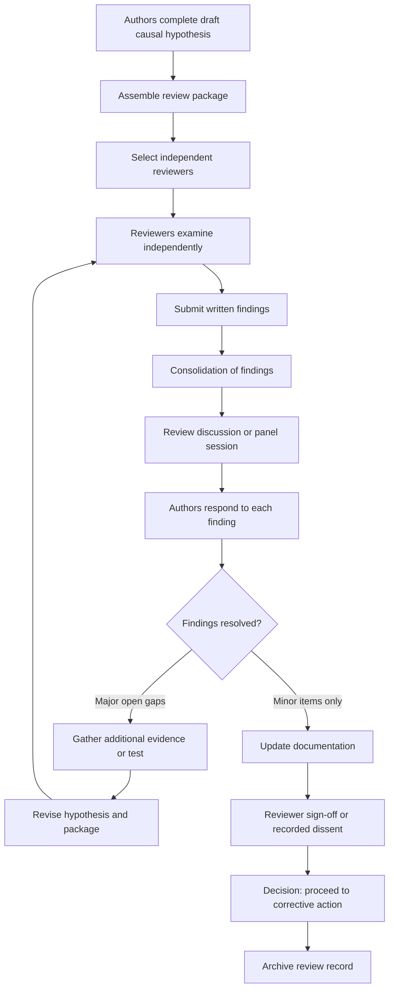

## Peer Review of Causal Hypotheses

### Purpose and Role in Root Cause Validation

A causal hypothesis produced by a "5 Whys" session, a fishbone workshop, or an individual investigator reflects the perspective, knowledge, and blind spots of the people who produced it. **Peer review** is the structured, independent examination of that hypothesis (its evidence, logic, assumptions, and proposed corrective actions) by people who were not part of building it. The goal is to find weaknesses **before** resources are committed to corrective action, not to approve or reject the investigators.

Peer review complements other validation techniques. Reproduction tests whether the mechanism works, triangulation tests whether independent evidence converges, and peer review tests whether the **reasoning and evidence chain** survives scrutiny from informed outsiders.

**Key Points**

- Peer review targets the *argument*: the claim, the evidence for it, the reasoning linking them, and the alternatives that were ruled out.
- Reviewers add value mainly through **independence, different expertise, and fresh assumptions**.
- The output is a documented set of findings, disposition of each finding, and a decision on whether the hypothesis is ready to act on.
- Review is a check on quality, not a substitute for evidence. Reviewers can expose a gap but cannot fill it without further investigation.

### What Peer Review Catches That Authors Miss

| Failure in the Analysis | How Review Exposes It |
| --- | --- |
| Confirmation bias in evidence selection | Reviewers ask what evidence was *not* collected and what would disprove the claim |
| Hindsight bias in the causal narrative | Reviewers question whether each step was knowable at the time of the decision |
| Stopping at a proximate cause | Reviewers ask "why" once more and check for systemic factors |
| Unsupported "why" links in a 5 Whys chain | Reviewers request evidence for each link |
| Causal leaps from correlation | Reviewers ask for mechanism, temporal order, and ruling out confounders |
| Blame-oriented conclusions ("operator error") | Reviewers challenge whether conditions, tools, or procedures shaped the behavior |
| Missing contributing factors | Reviewers with domain differences spot omitted branches |
| Weak or unrealistic corrective actions | Reviewers test whether actions address the validated cause |
| Ambiguous or inconsistent terminology | Reviewers flag unclear cause definitions |
| Unstated assumptions | Reviewers surface them and ask for justification |

### Forms of Peer Review

| Form | Description | Best For | Limitations |
| --- | --- | --- | --- |
| **Informal desk check** | A colleague reads the analysis and comments | Low-severity incidents, early drafts | Inconsistent depth; reviewer may be too familiar |
| **Structured written review** | Reviewers complete a checklist and submit written findings | Moderate-severity incidents, distributed teams | Slower; may miss interactive discovery |
| **Review meeting or panel** | Authors present and reviewers challenge live | High-severity incidents, cross-functional causes | Susceptible to groupthink and authority bias |
| **Independent blind review** | Reviewers receive the evidence without the proposed conclusion | Testing whether the evidence supports the claim on its own | Costly; requires organized evidence packages |
| **Red team or adversarial review** | Reviewers are assigned to construct the strongest alternative explanation | Safety-critical, high-cost, or contested findings | Can become combative without ground rules |
| **External or third-party review** | Reviewers from outside the organization | Regulated industries, major incidents, credibility concerns | Access, confidentiality, and onboarding overhead |
| **Cross-functional review board** | Standing group (quality, safety, engineering, operations) | Organizations with recurring high-stakes RCA | Can become a bottleneck or rubber stamp |

### Reviewer Selection and Independence

The quality of a review depends on who performs it.

**Recommended reviewer mix**

- **Domain expert** who understands the technical system in depth
- **Adjacent-domain expert** who does not share the team's assumptions (for example, operations reviewing an engineering conclusion)
- **RCA methodology reviewer** who checks logic, evidence standards, and technique use
- **Human factors or process specialist** where behavior or procedures are involved
- **Skeptic or devil's advocate** with an explicit mandate to challenge

**Independence checks**

| Question | Concern If "Yes" |
| --- | --- |
| Did the reviewer participate in the incident or the analysis? | Personal stake and shared assumptions |
| Does the reviewer report to someone implicated in the conclusion? | Pressure to soften findings |
| Does the reviewer own the system or process blamed? | Conflict of interest |
| Did the reviewer build or approve the original design or change? | Defensive bias |
| Is the reviewer far more junior than the authors? | May not challenge freely |

Independence is a matter of degree. When full independence is impossible, disclose the relationship and add a reviewer who is independent.

### The Peer Review Workflow

### Building the Review Package

Reviewers can only assess what they can see. A complete package makes the reasoning auditable.

**Contents**

1. **Problem statement**: precise, observable, time-bounded description of the failure
2. **Scope and impact**: what happened, where, to whom, and severity
3. **Timeline**: reconciled sequence of events with sources and times
4. **Causal hypothesis**: specific mechanism, with the causal chain (5 Whys, fault tree, or causal map)
5. **Evidence register**: each item with source, date, reliability, and what it supports
6. **Alternatives considered**: other hypotheses and the evidence used to accept or reject them
7. **Validation performed**: reproduction, simulation, triangulation, statistical checks
8. **Assumptions and limitations**: what was assumed, what could not be checked
9. **Proposed corrective and preventive actions**, each linked to a validated cause
10. **Open questions and known gaps**

**Key Points**

- Provide the evidence itself, or a reliable route to it, not only the authors' summary of it.
- For blind review, provide items 1 to 3 and 5, and withhold the conclusion (item 4) until reviewers have formed their own view.

### Review Criteria

Reviewers should assess the hypothesis against explicit criteria, not general impressions.

#### 1. Problem Definition

- Is the failure described in observable, measurable terms?
- Is the scope bounded (what is in and out)?
- Is the failure distinguished from its symptoms and consequences?

#### 2. Evidence Quality

- Is each claim linked to specific evidence?
- Is evidence primary (direct observation, measurement, records) or secondary (recollection, inference)?
- Is evidence complete for the period and area of interest?
- Was evidence preserved and handled reliably?
- Are conflicts in the evidence acknowledged?

#### 3. Causal Logic

- Does each link in the chain follow from the previous one?
- Is temporal order correct (cause precedes effect)?
- Is a plausible mechanism identified, not only an association?
- Could a confounder or common cause explain the pattern?
- Is the chain sufficient to produce the failure, and were necessary conditions identified?

#### 4. Alternatives and Disconfirmation

- Were credible alternative hypotheses considered?
- Was evidence sought that could *disprove* the favored hypothesis?
- Are rejected alternatives rejected on evidence, not preference?

#### 5. Depth and Systemic Coverage

- Does the analysis go beyond the proximate cause?
- Were organizational, procedural, design, and environmental factors examined?
- Is the conclusion free from assigning cause to individual error without examining conditions?

#### 6. Validation

- Was the hypothesis tested (reproduction, simulation, triangulation)?
- Is the confidence level stated and justified?

#### 7. Corrective Action Fit

- Does each action address a validated cause?
- Would the action have prevented or mitigated this failure?
- Are unintended consequences and new risks considered?
- Are ownership, timing, and verification defined?

### Reviewer Question Bank

**Challenging the evidence**

- What is your strongest evidence, and what is your weakest?
- How do you know this happened, as opposed to being inferred?
- What data would you expect to see if this cause were true that you have not yet looked at?
- What would you have expected to see if this cause were **false**?

**Challenging the logic**

- If this cause had been removed, would the failure still have occurred?
- Why did this same condition not cause failures on previous occasions?
- What else changed at the same time?
- Is this a cause, or is it a description of what went wrong?

**Challenging depth**

- Why did the safeguards or barriers not stop this?
- Why did the decision seem reasonable to the person at the time?
- What made this error easy to make?
- Where else in the system could this same cause be present?

**Challenging alternatives**

- What is the best argument that your conclusion is wrong?
- Which alternative explanation are you least comfortable dismissing?
- What would convince you that you are wrong?

**Challenging actions**

- How will you know the corrective action worked?
- What new failure could this fix introduce?
- Does this action rely on people remembering to do something?

### Recording Review Findings

Use a consistent format so findings can be tracked to closure.

| Field | Description |
| --- | --- |
| **ID** | Unique identifier (for example, PR-07) |
| **Reviewer** | Name or role |
| **Location** | Section, causal link, or evidence item referenced |
| **Finding** | Specific observation or challenge |
| **Category** | Evidence, logic, alternatives, depth, validation, action fit, clarity |
| **Severity** | Critical, major, minor, or suggestion |
| **Requested response** | Additional evidence, revision, test, or explanation |
| **Author response** | Accepted, rejected with rationale, or partially accepted |
| **Resolution** | What was changed or done |
| **Status** | Open, resolved, or deferred with owner |
| **Reviewer verification** | Reviewer confirms resolution or records disagreement |

**Severity definitions**

| Severity | Meaning | Effect on Decision |
| --- | --- | --- |
| **Critical** | The conclusion may be wrong or unsupported | Must be resolved before acting |
| **Major** | Significant gap in evidence, logic, or action fit | Resolve, or accept risk with explicit sign-off |
| **Minor** | Clarity, completeness, or presentation issue | Resolve before finalizing |
| **Suggestion** | Optional improvement | Author discretion |

### Worked Example: Reviewing a 5 Whys Chain

**Original hypothesis (submitted by authors)**

Incident: A production deployment overwrote a live database configuration, causing 40 minutes of downtime.

1. Why the downtime? The wrong configuration file was deployed.
2. Why the wrong file? The engineer selected the staging config for a production release.
3. Why did the engineer select it? They were not careful.
4. Why not careful? They were rushed.
5. Why rushed? Deadline pressure.

**Proposed action**: Remind engineers to double-check configuration files.

**Reviewer findings**

| ID | Location | Finding | Category | Severity |
| --- | --- | --- | --- | --- |
| PR-01 | Why 3 | "Not careful" is a judgment, not an observed cause; no evidence supports it | Logic | Critical |
| PR-02 | Why 2 | No evidence shows how the file was selected (manual path entry, tool default, naming collision) | Evidence | Major |
| PR-03 | Why 5 | Deadline pressure is asserted without data; no check of whether other releases under similar pressure succeeded | Evidence | Major |
| PR-04 | Whole chain | No examination of why the pipeline allowed a staging config to reach production | Depth | Critical |
| PR-05 | Alternatives | No alternative hypotheses considered (for example, ambiguous file naming, missing validation, tool defaults) | Alternatives | Major |
| PR-06 | Action | Reminder-based action relies on human memory and does not change the system | Action fit | Major |
| PR-07 | Validation | No reproduction or check of pipeline behavior with a mismatched config | Validation | Major |

**Author follow-up and revised analysis**

- Pipeline review showed configuration paths for staging and production differed by one character and the deployment tool accepted any path without an environment check.
- Reproduction in a sandbox showed the pipeline deployed a staging config to a production-labelled target without warning.
- Change log showed three earlier near-misses from the same cause, none reported.

**Revised root cause**: The deployment pipeline lacks an environment-to-configuration validation gate, and near-miss reporting did not surface earlier warnings.

**Revised actions**: Add automated environment validation in the pipeline (verify the config's environment tag matches the target), rename configs to make environment explicit, and add near-miss reporting to the release process.

**Outcome**: Peer review moved the conclusion from an individual-behavior explanation with a weak reminder-based action to a validated systemic cause with engineering controls.

### Running an Effective Review Session

**Before the session**

- Circulate the package with enough lead time for individual review.
- Ask reviewers to submit written findings in advance so that dominant voices do not shape independent views.
- Consolidate and group findings by theme and severity.

**During the session**

- State ground rules: critique the argument, not the authors; findings are requests for evidence, not accusations.
- Authors present briefly, and most time goes to reviewer challenges.
- Take challenges in order of severity, starting with critical items.
- Record each finding and the agreed action in the shared log.
- Have a designated facilitator keep discussion on evidence and reasoning.
- Invite dissent explicitly. Record disagreements rather than forcing consensus.

**After the session**

- Authors respond to every finding, including those rejected, with rationale.
- Reviewers verify that resolutions address the finding.
- The decision-maker records the conclusion, residual risk, and any dissent.

### Handling Disagreement

| Situation | Approach |
| --- | --- |
| Reviewer and author disagree on interpretation | Design a test or gather evidence that discriminates between the views |
| Reviewers disagree with each other | Compare assumptions and evidence, and consider that multiple causes may be present |
| Author rejects a critical finding | Require documented rationale and independent confirmation by another reviewer |
| Consensus is unreachable | Record the minority position and the residual uncertainty; consider a limited-scope corrective action while investigation continues |
| Hierarchical pressure to accept the conclusion | Escalate to a neutral chair or independent review body |

### Measuring Review Quality

Organizations can monitor the effectiveness of peer review through simple indicators.

| Indicator | What It Suggests |
| --- | --- |
| Percentage of RCAs receiving independent review | Coverage of the process |
| Findings per review by severity | Depth of scrutiny (very few findings may indicate superficial review) |
| Proportion of critical or major findings that changed the conclusion or actions | Practical impact of review |
| Repeat incidents from the same cause after an RCA closed | Effectiveness of validation and review |
| Time from draft to review closure | Process efficiency |
| Reviewer inter-rater agreement on severity classification | Consistency of criteria |

Inter-rater agreement between two reviewers on categorical judgments can be measured with Cohen's kappa:

$$\kappa = \frac{p_o - p_e}{1 - p_e}$$

where $p_o$ is observed agreement and $p_e$ is the agreement expected by chance. [Inference] Low agreement usually points to unclear criteria or ambiguous evidence rather than reviewer error, though this depends on the sample and context.

### Scaling Review to Severity

| Incident Severity | Suggested Review Level |
| --- | --- |
| **Low** (minor, no recurrence risk) | Informal desk check by one peer |
| **Moderate** (customer or operational impact) | Structured written review by two independent reviewers |
| **High** (major outage, safety event, financial or regulatory impact) | Panel review with cross-functional reviewers and a designated skeptic |
| **Critical** (fatality, serious harm, regulatory investigation) | Formal independent or external review with documented evidence standards |

Actual thresholds, required approvals, and evidence standards vary by organization, industry, and jurisdiction.

### Cultural and Psychological Considerations

- **Psychological safety**: Reviewers and authors must feel safe raising and accepting challenges. Blame-oriented cultures suppress honest review.
- **Ego and ownership**: Frame findings as improving the shared conclusion, not scoring the authors.
- **Authority bias**: Junior reviewers may defer to senior authors. Collect written findings before discussion and rotate who speaks first.
- **Groupthink**: Assign explicit challenger roles and invite dissenting written comments.
- **Review fatigue**: Overuse of heavyweight review for minor incidents leads to rubber-stamping. Scale the effort.
- **Confidentiality and legal context**: Some jurisdictions or contracts affect how RCA documents are shared and retained. Consult applicable policy and legal guidance.

### Common Pitfalls

1. **Rubber-stamp review**: Reviewers approve without examining the evidence.
2. **Reviewing the format instead of the reasoning**: Comments focus on grammar and layout rather than causal logic.
3. **Insufficient independence**: Reviewers share the authors' assumptions or reporting line.
4. **No disconfirmation mandate**: Nobody is assigned to argue against the hypothesis.
5. **Reviewing the conclusion without the evidence**: Reviewers see only a summary.
6. **Late review**: Review occurs after corrective actions are already committed.
7. **Findings without closure**: Issues are logged but never resolved or verified.
8. **Consensus at any cost**: Genuine disagreement is suppressed to reach sign-off.
9. **Personalizing the critique**: Feedback becomes about the investigators rather than the argument.
10. **Ignoring the corrective actions**: Review examines the cause but not whether the actions address it.
11. **One-time review**: The hypothesis is not revisited when new evidence emerges.
12. **Overstating reviewer approval**: Sign-off is interpreted as proof, when it only indicates that the reasoning withstood scrutiny at that time.

### Peer Review Checklist

- [ ] Review package includes problem statement, timeline, evidence register, causal chain, alternatives, validation results, and proposed actions
- [ ] Reviewers are independent of the incident and analysis, or dependencies are disclosed
- [ ] At least one reviewer brings a different expertise or perspective
- [ ] A skeptic or devil's advocate role is assigned for high-severity cases
- [ ] Reviewers submit written findings before group discussion
- [ ] Each finding has severity, category, and requested response
- [ ] Authors respond to every finding with rationale
- [ ] Critical and major findings are resolved or explicitly risk-accepted
- [ ] Reviewers verify resolutions
- [ ] Dissenting views and residual uncertainty are recorded
- [ ] Corrective actions are checked for fit to validated causes
- [ ] The review record is archived with the RCA report
- [ ] A trigger exists to reopen review if new evidence appears

**Conclusion**

Peer review of causal hypotheses provides an independent check on the reasoning and evidence behind a root cause conclusion. By using independent reviewers with varied expertise, explicit criteria, structured findings, and documented resolution, organizations reduce the risk of acting on biased, shallow, or unsupported causal claims. Effective review depends as much on culture (psychological safety, welcome dissent, and scaling effort to risk) as on procedure, and it works best alongside reproduction and triangulation rather than in place of them.

**Related Topics**

- Reproducing or simulating the failure condition
- Triangulating findings across multiple methods
- Analysis of Competing Hypotheses (ACH)
- Cognitive biases in RCA (confirmation, hindsight, anchoring, groupthink)
- Red teaming and pre-mortem analysis
- Evidence quality assessment and chain of custody
- Just culture and blame-free investigation practices
- Distinguishing root causes, contributing factors, and triggers
- Verifying effectiveness of corrective and preventive actions
- RCA report writing and documentation standards
- Independent and external investigation protocols in regulated industries