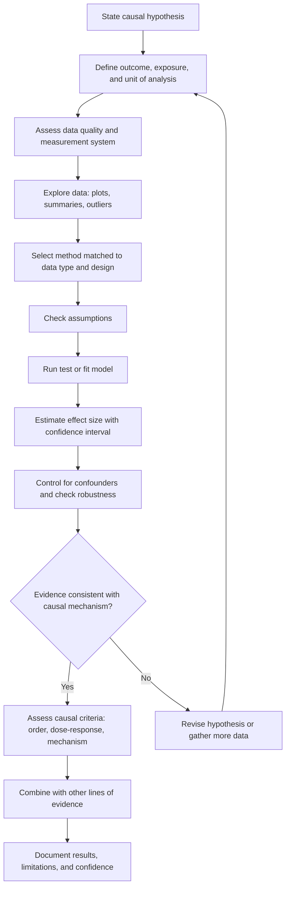
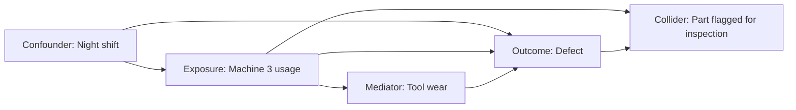

## Statistical Validation of Proposed Causes


### Purpose and Role in Root Cause Validation

A proposed cause from a "5 Whys" chain, fishbone diagram, or fault tree is a claim about how the world works. When the failure is recurring, intermittent, or spread across many units, events, or time periods, **statistics** provides the tools to test whether the data actually support that claim, to quantify how strongly, and to separate signal from random variation.

Statistical validation asks questions that anecdotes and single cases cannot answer:

1. **Association**: Does the failure rate differ when the suspected cause is present versus absent?
2. **Magnitude**: How large is the effect, and how precisely is it estimated?
3. **Temporal order**: Does the cause precede the effect?
4. **Dose-response**: Does more of the cause produce more of the effect?
5. **Confounding**: Could something else explain the association?
6. **Sufficiency of explanation**: How much of the variation in failures does the cause account for?

**Key Points**

- Statistics can strengthen or weaken a causal hypothesis, but **statistical association alone does not establish causation**. Causal claims require design (experiments, controls), mechanism, and elimination of confounders.
- A statistically significant result is not necessarily a practically important one, and a non-significant result is not proof of no effect (especially with small samples).
- The method must match the data type, the sampling process, and the question being asked.
- Statistical evidence is one line of evidence and belongs alongside reproduction, triangulation, and peer review.

### From Hypothesis to Statistical Question

Translate the causal hypothesis into a testable, quantitative statement.

| Causal Hypothesis (Qualitative) | Statistical Form |
| --- | --- |
| "Supplier lot B causes cracking" | Defect proportion for lot B differs from other lots |
| "Higher temperature increases failures" | Failure probability increases with temperature (dose-response) |
| "The new release introduced the latency regression" | Mean or median latency differs before vs. after release |
| "Night shift has more errors" | Error rate differs across shifts after adjusting for workload |
| "Machine 3 is the source of variation" | Variance or mean of the output differs for machine 3 |
| "Missing timeout causes pool exhaustion" | Failure rate conditional on slow upstream latency and no timeout |

**Specify before analyzing**

- The **outcome** (response variable) and how it is measured
- The **exposure** (suspected cause) and how it is defined
- The **comparison** (exposed vs. unexposed, before vs. after, high vs. low)
- The **unit of analysis** (part, request, shift, day, site)
- The **null hypothesis** $H_0$ (no effect) and alternative $H_1$
- The **significance level** $\alpha$ and required power, decided in advance

Deciding these before looking at results reduces the risk of post hoc rationalization.

### The Statistical Validation Workflow



### Data Foundations

#### Data Quality and Measurement System

Statistical results are only as reliable as the data.

- **Measurement system analysis (MSA) or Gauge R&R**: Confirm that measurement variation is small relative to process variation before drawing conclusions from measured data.
- **Missing data**: Determine whether data are missing at random or in a pattern related to the failure.
- **Selection and survivorship bias**: Check whether the sample excludes failed or removed items.
- **Time alignment**: Reconcile clocks, reporting periods, and batching.
- **Data provenance**: Record source, extraction date, filters, and transformations.

#### Data Types and Matching Methods

| Outcome Type | Exposure Type | Common Methods |
| --- | --- | --- |
| Binary (fail/pass) | Binary | Chi-square test, Fisher's exact test, risk ratio, odds ratio |
| Binary | Continuous | Logistic regression |
| Count (defects, incidents) | Categorical or continuous | Poisson or negative binomial regression, rate comparison |
| Continuous | Binary (2 groups) | t-test, Welch's t-test, Mann-Whitney U |
| Continuous | Categorical (3+ groups) | ANOVA, Kruskal-Wallis |
| Continuous | Continuous | Correlation, linear regression |
| Time-to-failure | Any | Survival analysis (Kaplan-Meier, log-rank, Cox regression, Weibull analysis) |
| Time series | Event or intervention | Interrupted time series, change-point detection, control charts |
| Categorical | Categorical | Chi-square test of independence, association measures |

### Exploratory Analysis Before Testing

Always look at the data before formal testing.

- **Histograms and box plots** for distribution and outliers
- **Scatter plots** for relationships and non-linearity
- **Run charts and control charts** for time patterns and process shifts
- **Stratified summaries** by shift, lot, site, version, or operator
- **Pareto charts** to see which categories dominate the failure count
- **Cross-tabulations** for categorical exposures

```python
import pandas as pd
import matplotlib.pyplot as plt

df = pd.read_csv("failures.csv", parse_dates=["timestamp"])

# Failure rate by suspected factor
summary = (df.groupby("supplier_lot")["failed"]
             .agg(n="count", failures="sum", rate="mean")
             .sort_values("rate", ascending=False))
print(summary)

# Time pattern
df.set_index("timestamp")["failed"].resample("D").mean().plot()
plt.ylabel("Daily failure rate")
plt.show()
```

### Core Statistical Techniques

#### 1. Comparing Proportions (Binary Outcomes)

**Scenario**: Do parts from lot B fail more often than parts from other lots?

|  | Failed | Not Failed | Total |
| --- | --- | --- | --- |
| Lot B | 18 | 82 | 100 |
| Other lots | 9 | 391 | 400 |

**Risk (failure proportion)**

$$p_B = \frac{18}{100} = 0.18, \qquad p_{other} = \frac{9}{400} = 0.0225$$

**Risk ratio**

$$RR = \frac{p_B}{p_{other}} = \frac{0.18}{0.0225} = 8.0$$

**Odds ratio**

$$OR = \frac{18 \times 391}{82 \times 9} = \frac{7038}{738} \approx 9.54$$

**Chi-square statistic** for a 2×2 table:

$$\chi^2 = \sum \frac{(O - E)^2}{E}$$

When expected counts are small (commonly any expected cell count below 5), prefer **Fisher's exact test**.

```python
from scipy import stats
import numpy as np

table = np.array([[18, 82],
                  [9, 391]])

chi2, p, dof, expected = stats.chi2_contingency(table, correction=False)
odds_ratio, p_fisher = stats.fisher_exact(table)

rr = (18/100) / (9/400)
print(f"Risk ratio: {rr:.2f}")
print(f"Odds ratio: {odds_ratio:.2f}, Fisher p = {p_fisher:.4g}")
print(f"Chi-square p = {p:.4g}")
```

**Confidence interval for the log odds ratio** (Woolf method):

$$\text{SE}(\ln OR) = \sqrt{\frac{1}{a} + \frac{1}{b} + \frac{1}{c} + \frac{1}{d}}, \qquad CI = \exp\left(\ln OR \pm z_{1-\alpha/2}\,\text{SE}\right)$$

#### 2. Comparing Means or Distributions (Continuous Outcomes)

**Welch's t-test** (does not assume equal variances) for two groups:

$$t = \frac{\bar{x}_1 - \bar{x}_2}{\sqrt{\dfrac{s_1^2}{n_1} + \dfrac{s_2^2}{n_2}}}$$

```python
from scipy import stats

before = df.loc[df.release == "v1", "latency_ms"]
after  = df.loc[df.release == "v2", "latency_ms"]

t, p = stats.ttest_ind(after, before, equal_var=False)

# Non-parametric alternative when distributions are skewed
u, p_mw = stats.mannwhitneyu(after, before, alternative="two-sided")

# Standardized effect size (Cohen's d, pooled SD approximation)
pooled_sd = ((after.std(ddof=1)**2 + before.std(ddof=1)**2) / 2) ** 0.5
d = (after.mean() - before.mean()) / pooled_sd
print(t, p, p_mw, d)
```

Latency and time data are often right-skewed; consider log transformation, medians, or percentile-based comparisons (for example, p95, p99).

#### 3. Multiple Groups: ANOVA and Kruskal-Wallis

For a continuous outcome across three or more levels of a categorical factor (machines, shifts, suppliers):

$$F = \frac{MS_{between}}{MS_{within}}$$

```python
from scipy import stats

groups = [g["thickness_mm"].values for _, g in df.groupby("machine")]
F, p = stats.f_oneway(*groups)
H, p_kw = stats.kruskal(*groups)
```

A significant overall test should be followed by **post hoc comparisons** (for example, Tukey HSD) with multiplicity control.

**Variance comparisons**: If the hypothesis concerns variability rather than average level, use Levene's or Brown-Forsythe test, or compare variance components in a nested model.

#### 4. Correlation and Simple Regression

**Pearson correlation** measures linear association:

$$r = \frac{\sum (x_i - \bar{x})(y_i - \bar{y})}{\sqrt{\sum (x_i - \bar{x})^2 \sum (y_i - \bar{y})^2}}$$

**Spearman rank correlation** handles monotonic, non-linear, or outlier-affected relationships.

Interpretation cautions:

- Correlation does not imply causation.
- A small $r$ can be practically important; a large $r$ can arise from a confounder or a single outlier.
- $r^2$ is the proportion of variance in $y$ linearly explained by $x$, and does not measure causal contribution.

**Simple linear regression**:

$$y_i = \beta_0 + \beta_1 x_i + \varepsilon_i$$

The slope $\beta_1$ estimates the expected change in $y$ per unit change in $x$, under model assumptions.

#### 5. Multivariable Regression to Control for Confounders

Real failures usually depend on several factors. Regression estimates the association of the suspected cause while holding other measured variables constant.

**Logistic regression** for a binary failure outcome:

$$\ln\left(\frac{p}{1-p}\right) = \beta_0 + \beta_1 x_1 + \beta_2 x_2 + \cdots + \beta_k x_k$$

Here $e^{\beta_j}$ is the adjusted odds ratio for predictor $j$.

```python
import statsmodels.formula.api as smf

model = smf.logit(
    "failed ~ C(supplier_lot) + temperature_c + C(shift) + machine_age_years",
    data=df
).fit()

print(model.summary())

import numpy as np
odds_ratios = np.exp(model.params)
conf_int = np.exp(model.conf_int())
```

**Poisson or negative binomial regression** for counts of defects or incidents with an exposure offset:

```python
import statsmodels.api as sm
import statsmodels.formula.api as smf

model = smf.glm("defects ~ C(line) + C(shift)",
                data=df, family=sm.families.Poisson(),
                offset=np.log(df["units_produced"])).fit()
```

Check for **overdispersion** (variance greater than the mean) and switch to negative binomial when present.

**Model diagnostics to check**

- Linearity of the relationship (or of log-odds)
- Independence of observations (clustering by machine, site, or time violates this)
- Multicollinearity (variance inflation factors)
- Influential points and outliers
- Calibration and discrimination for classification models (for example, ROC/AUC)
- Sample size relative to the number of predictors

#### 6. Time-to-Failure and Reliability Analysis

When failures occur over time, and some units are still operating (censored data), use survival methods.

**Kaplan-Meier estimator** of survival probability:

$$\hat{S}(t) = \prod_{t_i \le t}\left(1 - \frac{d_i}{n_i}\right)$$

where $d_i$ is the number of failures at time $t_i$ and $n_i$ is the number at risk.

**Log-rank test** compares survival curves between groups (for example, with and without the suspected cause).

**Cox proportional hazards model**:

$$h(t \mid x) = h_0(t)\exp(\beta_1 x_1 + \cdots + \beta_k x_k)$$

The hazard ratio $e^{\beta_j}$ quantifies how the suspected cause changes the instantaneous failure rate.

**Weibull analysis** characterizes failure behavior:

$$F(t) = 1 - \exp\left[-\left(\frac{t}{\eta}\right)^{\beta}\right]$$

where $\beta$ is the shape parameter (roughly: $\beta < 1$ suggests early-life failures, $\beta \approx 1$ random failures, $\beta > 1$ wear-out) and $\eta$ is the characteristic life. [Inference] Interpreting $\beta$ as indicating a specific failure mechanism is a heuristic and should be supported by physical evidence.

```python
from lifelines import KaplanMeierFitter, CoxPHFitter
from lifelines.statistics import logrank_test

kmf = KaplanMeierFitter()
for name, g in df.groupby("has_suspect_component"):
    kmf.fit(g["hours"], event_observed=g["failed"], label=str(name))
    kmf.plot_survival_function()

exposed   = df[df.has_suspect_component == 1]
unexposed = df[df.has_suspect_component == 0]
res = logrank_test(exposed["hours"], unexposed["hours"],
                   exposed["failed"], unexposed["failed"])
print(res.p_value)

cph = CoxPHFitter().fit(df[["hours", "failed", "has_suspect_component", "temperature_c"]],
                        duration_col="hours", event_col="failed")
cph.print_summary()
```

#### 7. Time Series, Control Charts, and Change Detection

For failures tied to a change in time (deployment, maintenance, supplier switch):

- **Statistical process control (SPC)**: Use control charts (for example, individuals, p-chart, c-chart, u-chart) to distinguish common-cause from special-cause variation. Rule-based signals (points beyond limits, runs, trends) flag when the process shifted.
- **Interrupted time series**: Fit a model with a level and slope change at the intervention point.
- **Change-point detection**: Locate when the process behavior changed, then check whether the date matches the proposed cause.

Control limits for a Shewhart individuals chart are commonly set at:

$$\bar{x} \pm 3\,\hat{\sigma}$$

where $\hat{\sigma}$ is estimated from within-subgroup or moving-range variation, not the overall standard deviation, so that shifts are not absorbed into the limits.

```python
import numpy as np

x = df["metric"].values
mr = np.abs(np.diff(x))
sigma_hat = mr.mean() / 1.128        # d2 constant for moving range of size 2
center = x.mean()
ucl, lcl = center + 3*sigma_hat, center - 3*sigma_hat
signals = np.where((x > ucl) | (x < lcl))[0]
```

**Temporal precedence check**: A cause must precede its effect. Confirm that the change in the exposure occurred before the shift in the outcome, and consider lag effects.

#### 8. Designed Experiments (DOE)

When causes can be manipulated safely, **designed experiments** provide the strongest statistical basis for causation because randomization breaks confounding.

- **Full and fractional factorial designs** test multiple factors and their interactions efficiently.
- **Randomization** of run order guards against drift and hidden variables.
- **Blocking** controls known nuisance variables.
- **Replication** provides an estimate of pure error.

For a two-level factorial with factors $A$ and $B$, the model is:

$$y = \beta_0 + \beta_A A + \beta_B B + \beta_{AB} AB + \varepsilon$$

Factor effects are estimated as differences between mean responses at high and low levels, and tested against the error term.

#### 9. Bayesian Approaches

Bayesian methods update belief in a hypothesis using data and prior knowledge:

$$P(H \mid D) = \frac{P(D \mid H)\,P(H)}{P(D)}$$

Advantages for RCA include direct probability statements about effect sizes, natural use of prior incident history, and better behavior with small samples. Results depend on the choice of prior, which should be stated and tested for sensitivity.

### Effect Size, Confidence Intervals, and Practical Significance

**p-values** answer: if the null hypothesis were true, how surprising would data this extreme be? They do not give the probability that the hypothesis is true, and they do not measure the size of the effect.

Report, for every test:

- **Effect size** (risk ratio, odds ratio, mean difference, hazard ratio, standardized effect such as Cohen's $d$)
- **Confidence interval** for the effect size
- **Sample size** and the number of events
- **p-value** if useful, with the exact test used

**Practical significance**: Ask whether the estimated effect, at the lower and upper ends of its confidence interval, is large enough to explain the observed failures and to justify the corrective action.

**Attributable fraction**: To estimate how much of the failure burden the proposed cause could explain:

$$AF_{exposed} = \frac{RR - 1}{RR}, \qquad PAF = \frac{p_e(RR - 1)}{1 + p_e(RR - 1)}$$

where $p_e$ is the proportion of the population exposed. [Inference] Attributable fractions have a causal interpretation only if the association is causal and unconfounded; otherwise they describe association.

### Sample Size, Power, and Rare Events

**Power** is the probability of detecting a real effect of a given size. Underpowered analyses are a common reason a real cause is dismissed.

For comparing two proportions $p_1$ and $p_2$ (approximate, per group):

$$n \approx \frac{\left(z_{1-\alpha/2}\sqrt{2\bar{p}(1-\bar{p})} + z_{1-\beta}\sqrt{p_1(1-p_1) + p_2(1-p_2)}\right)^2}{(p_1 - p_2)^2}$$

with $\bar{p} = (p_1 + p_2)/2$.

For rare failures, the number of **events** matters more than the number of units. A common rule of thumb for regression is roughly 10 events per predictor variable, though this is a heuristic and modern guidance recommends more careful sample size assessment.

**Zero failures observed**: The "rule of three" gives an approximate 95% upper confidence bound on the failure probability of $3/n$ after $n$ failure-free trials.

**Poisson rate comparison** for two counts over exposure times $T_1$ and $T_2$: compare $\lambda_1 = k_1/T_1$ and $\lambda_2 = k_2/T_2$ using an exact conditional test (binomial test on $k_1$ given $k_1 + k_2$).

### Confounding, Bias, and Causal Structure

Statistical association can be produced by factors other than direct causation.

| Threat | Description | Example | Mitigation |
| --- | --- | --- | --- |
| **Confounding** | A third variable influences both cause and effect | Night shift uses a specific machine and also has more errors | Stratify, adjust in regression, randomize, match |
| **Selection bias** | The analyzed sample differs systematically from the population | Only returned parts are analyzed | Sample from the full population; model selection |
| **Survivorship bias** | Failed or removed units are missing | Only surviving units are inspected | Include failed and censored units |
| **Reverse causation** | The outcome influences the exposure | High-error teams get assigned to more complex tasks | Establish temporal order |
| **Simpson's paradox** | A trend reverses when data are aggregated | Overall rate is lower for one supplier due to mix of products | Analyze within strata |
| **Measurement error** | Exposure or outcome recorded inaccurately | Different defect definitions across sites | MSA; standardized definitions |
| **Multiple comparisons** | Many tests increase chance of false positives | Testing 40 factors and reporting the one with $p<0.05$ | Pre-specify; correct for multiplicity |
| **Regression to the mean** | Extreme values tend to move toward average | Improvement after an unusually bad week | Use control groups or long baselines |
| **Ecological fallacy** | Group-level pattern is assumed to hold for individuals | Site-level defect rate linked to site-level factor | Use individual-level data where possible |

#### Causal Diagrams (DAGs)

A directed acyclic graph makes assumptions about causal structure explicit and shows what to adjust for.



**Guidance from the graph**

- Adjust for **confounders** (they open a non-causal path).
- Do **not** adjust for **mediators** if you want the total effect of the exposure.
- Do **not** adjust for **colliders** (conditioning on them can create spurious associations).

[Inference] DAGs encode the analyst's assumptions and are only as valid as the domain knowledge behind them; they should be reviewed by domain experts.

### Assessing Causal Plausibility: Beyond p-values

Use structured causal criteria (adapted from Bradford Hill's considerations) as a checklist, not as a scoring formula.

| Criterion | Question |
| --- | --- |
| **Strength** | Is the association large (for example, high RR or HR)? |
| **Consistency** | Is it observed across sites, times, datasets, and methods? |
| **Temporality** | Does the cause precede the effect? |
| **Dose-response** | Does more exposure produce more effect? |
| **Specificity** | Does the cause explain the specific failure mode observed? |
| **Plausibility and coherence** | Is there a credible physical, technical, or behavioral mechanism? |
| **Experiment** | Does removing or introducing the cause change the outcome? |
| **Analogy** | Are similar causes known to produce similar failures? |
| **Alternative explanations** | Have confounders and competing hypotheses been addressed? |

Among these, **temporality** is necessary; **experimental evidence** and **mechanism** carry particular weight in engineering RCA.

### Multiple Testing and Data Dredging

Testing many candidate causes against one outcome inflates the chance of false positives. With $m$ independent tests each at level $\alpha$, the probability of at least one false positive is:

$$1 - (1 - \alpha)^m$$

For $m = 20$ and $\alpha = 0.05$, this is about $0.64$.

**Controls**

- **Bonferroni**: use $\alpha/m$ per test (conservative)
- **Holm**: step-down procedure, uniformly more powerful than Bonferroni
- **Benjamini-Hochberg**: controls the false discovery rate, appropriate for exploratory screening

```python
from statsmodels.stats.multitest import multipletests

reject, p_adj, _, _ = multipletests(p_values, alpha=0.05, method="holm")
```

**Good practice**: Separate **exploratory** analysis (generating hypotheses from the data) from **confirmatory** analysis (testing a pre-specified hypothesis on new or held-out data). Findings from exploration should be validated on independent data or by experiment.

### Worked Example: Validating a Suspected Supplier Cause

**Situation**: A manufacturer sees an increase in field failures of an assembled sensor. A 5 Whys session proposes that components from Supplier X's new lot are the cause.

**Step 1: State the hypothesis and analysis plan**

- Outcome: failure within 90 days of installation (binary), plus time-to-failure
- Exposure: contains component from Supplier X lot 47
- Confounders considered: production line, installation site climate, month of manufacture
- $H_0$: failure risk is the same for units with and without lot 47; $\alpha = 0.05$

**Step 2: Simple comparison**

| Group | Units | Failures | 90-day failure rate |
| --- | --- | --- | --- |
| Lot 47 | 600 | 66 | 11.0% |
| Other lots | 3,400 | 102 | 3.0% |

$$RR = \frac{0.110}{0.030} \approx 3.67$$

Fisher's exact test gives $p < 0.001$; the 95% confidence interval for the risk ratio is roughly 2.7 to 5.0 (approximate, computed with a log-based interval).

**Step 3: Check confounding**

Lot 47 units were built mostly on Line 2 and shipped mainly to a humid region.

| Line | Lot 47 failure rate | Other lots failure rate |
| --- | --- | --- |
| Line 1 | 10.5% | 2.8% |
| Line 2 | 11.2% | 3.4% |

Within each line the effect persists, which argues against Line as the sole explanation.

**Step 4: Adjusted model**

```python
import statsmodels.formula.api as smf
import numpy as np

m = smf.logit("failed_90d ~ lot47 + C(line) + humidity_index + C(month_built)",
              data=df).fit()
print(np.exp(m.params["lot47"]), np.exp(m.conf_int().loc["lot47"]))
```

Suppose the adjusted odds ratio for lot 47 is about 3.4 (95% CI 2.4 to 4.8), attenuated slightly from the crude estimate, while humidity has an independent modest effect.

**Step 5: Time-to-failure analysis**

Kaplan-Meier curves separate early, and a Cox model gives a hazard ratio near 3.2 for lot 47 after adjustment. The proportional hazards assumption is checked using Schoenfeld residuals.

**Step 6: Dose-response and specificity**

Units with a higher measured contaminant level in the component (from incoming inspection records) show a monotonic increase in failure rate across quartiles, and failures cluster in the failure mode (corrosion) that the contaminant is expected to produce.

**Step 7: Causal criteria and next validation**

- Strength: large and consistent effect
- Temporality: lot 47 installed before failures
- Dose-response: present
- Mechanism: plausible (contaminant leading to corrosion)
- Confounding: measured confounders addressed; unmeasured confounding remains possible
- Experiment: a bench test of lot 47 components under humidity confirms accelerated corrosion (from the reproduction chapter)

**Conclusion**: Statistical, mechanistic, and experimental evidence converge on lot 47 contamination as the primary cause, with humidity as a contributing factor. Residual uncertainty: possible unmeasured confounders and some failures in non-lot-47 units that indicate other causes.

### Reporting Statistical Validation

A statistical validation summary should state:

1. **Hypothesis** and the specific statistical question
2. **Data**: source, period, inclusion/exclusion criteria, sample sizes, event counts
3. **Data quality** checks and known limitations
4. **Methods**: tests and models, with reasons for their choice and assumption checks
5. **Results**: effect sizes with confidence intervals, and p-values where useful
6. **Adjustments**: confounders considered and how they were handled
7. **Sensitivity and robustness checks**: alternative specifications, exclusion of outliers, different time windows
8. **Interpretation**: what the results support and do not support
9. **Residual uncertainty** and alternative explanations
10. **Recommended follow-up**: experiments, additional data, monitoring

### Common Pitfalls

1. **Confusing correlation with causation**: Treating an association as proof without design, temporality, or mechanism.
2. **p-hacking and data dredging**: Testing many factors and reporting only the significant ones.
3. **Ignoring effect size**: Celebrating a tiny but "significant" difference from a huge sample.
4. **Treating non-significance as no effect**: Small samples may lack power to detect a real cause.
5. **Wrong test for the data**: Using a t-test on heavily skewed, censored, or count data.
6. **Violating independence**: Ignoring clustering by machine, site, or time (pseudo-replication).
7. **Aggregating over strata**: Missing Simpson's paradox.
8. **Adjusting for a mediator or collider**: Removing or creating bias through inappropriate covariate selection.
9. **Ignoring censored data**: Dropping units still in service in reliability analysis.
10. **Small-number overinterpretation**: Drawing strong conclusions from a handful of events.
11. **Extrapolating beyond the data range**: Applying a fitted relationship to conditions never observed.
12. **Overlooking measurement error**: Analyzing noisy or inconsistent defect classifications as if exact.
13. **Post hoc storytelling**: Building a mechanism to explain an observed pattern without testing it.
14. **Relying only on p-values**: Not reporting intervals, effect sizes, or assumptions.
15. **Neglecting practical significance**: Not checking whether the cause explains enough of the failures to justify action.
16. **Assuming stable systems**: Applying historical data to a system that has since changed.

### Practical Tool Landscape

| Need | Common Tools |
| --- | --- |
| General statistics and modeling | R, Python (`scipy`, `statsmodels`, `scikit-learn`, `pandas`), Minitab, JMP, SAS, SPSS |
| Survival and reliability | R (`survival`), Python (`lifelines`), Weibull++ and similar reliability software |
| SPC and control charts | Minitab, JMP, R (`qcc`), Python (`statsmodels`, custom) |
| Design of experiments | JMP, Minitab, R (`FrF2`, `rsm`), Python (`pyDOE2`) |
| Bayesian modeling | Stan, PyMC, brms |
| Causal inference | R (`dagitty`), Python (`DoWhy`, `causalml`) |
| Visualization | `matplotlib`, `seaborn`, `ggplot2`, BI dashboards |

Tool features and version behavior vary; verify function names, defaults, and assumptions against current documentation.

### Statistical Validation Checklist

- [ ] Causal hypothesis translated into a specific statistical question with pre-specified $H_0$, $H_1$, and $\alpha$
- [ ] Outcome, exposure, unit of analysis, and comparison group clearly defined
- [ ] Measurement system and data quality assessed
- [ ] Exploratory plots reviewed before formal testing
- [ ] Method matched to data type, distribution, and design
- [ ] Assumptions (independence, distribution, proportional hazards, linearity) checked
- [ ] Effect size and confidence interval reported, not only p-values
- [ ] Confounders identified (for example, with a causal diagram) and addressed
- [ ] Temporal precedence confirmed
- [ ] Dose-response and specificity examined where possible
- [ ] Multiple-comparison issues handled or exploratory status disclosed
- [ ] Power or sample size adequacy considered, especially for negative results
- [ ] Robustness and sensitivity analyses performed
- [ ] Statistical results reconciled with mechanism, reproduction, and other evidence
- [ ] Limitations and residual uncertainty documented

**Conclusion**

Statistical validation gives root cause analysis a quantitative basis for judging whether a proposed cause is consistent with the observed pattern of failures, how large its effect is, and how confident we can be. Its strength depends on sound problem framing, quality data, methods matched to the data, careful control of confounding and multiplicity, and honest reporting of uncertainty. Because statistics alone cannot prove causation, its results are most convincing when they align with temporal order, dose-response, a plausible mechanism, and experimental or reproduction evidence.

**Related Topics**

- Reproducing or simulating the failure condition
- Triangulating findings across multiple methods
- Peer review of causal hypotheses
- Design of experiments (DOE) for cause isolation
- Measurement system analysis (Gauge R&R)
- Statistical process control and control chart interpretation
- Survival analysis and reliability engineering
- Causal inference and directed acyclic graphs
- Bayesian methods in failure analysis
- Hypothesis testing, power, and sample size planning
- Pareto analysis and stratification
- Regression diagnostics and model validation
- Verifying effectiveness of corrective actions with statistical monitoring