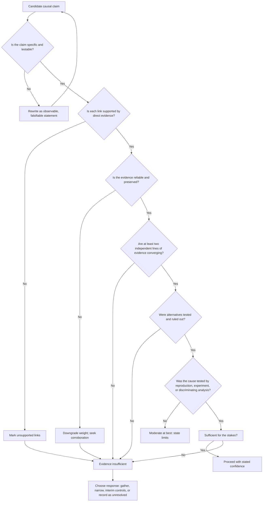

## Recognizing Insufficient Evidence


### Purpose and Role in Root Cause Validation

Every technique in this chapter (reproduction, triangulation, peer review, statistical validation) exists to answer one question: **is the evidence strong enough to support acting on this causal claim?** The complementary skill is recognizing when the answer is **no**. An RCA that concludes confidently on thin evidence is often worse than one that admits uncertainty, because it directs corrective effort at the wrong target, creates false assurance, and allows the real cause to recur.

Recognizing insufficient evidence means detecting, explicitly and early, that a hypothesis is **unsupported, weakly supported, or untestable with the information at hand**, and responding with the right action: gather more evidence, narrow the claim, reduce the confidence rating, take interim protective measures, or record the cause as unresolved.

**Key Points**

- "Insufficient evidence" is a legitimate, professional RCA outcome, not a failure of the investigation.
- Absence of evidence for a cause is not evidence that the cause is absent, and absence of evidence against a cause is not evidence that it is present.
- The strength of evidence required should scale with the **cost of being wrong** (safety, financial, regulatory, reputational, and recurrence risk).
- The most dangerous insufficiency is the kind nobody notices: a coherent story that feels complete.

### Why Insufficient Evidence Is Hard to See

| Driver | How It Hides Gaps |
| --- | --- |
| **Narrative coherence** | A story where each "why" flows smoothly feels true, whether or not each link is evidenced |
| **Confirmation bias** | Evidence that fits is noticed and recorded; evidence that does not is dismissed or never sought |
| **Hindsight bias** | Knowing the outcome makes the causal chain look obvious and inevitable |
| **Anchoring** | The first plausible explanation dominates later analysis |
| **Pressure for closure** | Deadlines, management expectations, and regulatory timelines reward a definite answer |
| **Expert overconfidence** | Experienced people fill gaps with pattern-matched assumptions |
| **Availability bias** | Recent or memorable causes are favored over statistically likelier ones |
| **Group dynamics** | Social pressure, authority, and groupthink suppress doubts |
| **Data abundance illusion** | Large volumes of data feel like strong evidence even when they do not bear on the hypothesis |
| **Sunk cost** | After investing effort in a hypothesis, abandoning it feels costly |

### Categories of Evidence Insufficiency

| Category | Description | Example |
| --- | --- | --- |
| **Missing evidence** | Data that would be expected to exist was never collected or was lost | Logs rotated out before the incident review |
| **Unreliable evidence** | Data exists but its accuracy or integrity is doubtful | Testimony from memory weeks later; uncalibrated instrument readings |
| **Indirect evidence** | Evidence is consistent with the cause but does not test it | Config shows no timeout, but no evidence a timeout was the limiting factor |
| **Non-discriminating evidence** | Evidence fits several hypotheses equally well | "Latency rose" fits provider slowness, network issues, or traffic spikes |
| **Insufficient quantity** | Too few observations or events to distinguish signal from noise | Three failures in one lot of eight units |
| **Insufficient scope** | Evidence covers only part of the system, period, or population | Only failed units inspected, no comparison group |
| **Untested link** | A causal step was assumed, not verified | "Operator fatigue" asserted with no rest or shift data |
| **Contradicted evidence** | Reliable data conflicts with the hypothesis and is unexplained | Torque logs in spec, yet over-torque proposed as cause |
| **Circular evidence** | The cause is inferred from the failure and the failure is explained by the cause | "It failed because it was defective; we know it was defective because it failed" |
| **Non-independent evidence** | Multiple items rely on the same source | Three reports quoting one original witness |
| **Unfalsifiable claim** | The hypothesis cannot be disproved by any conceivable evidence | "Human error" or "poor safety culture" with no observable indicators |

### Warning Signs in a Causal Analysis

#### In the Causal Chain (5 Whys, Fault Tree)

- A "why" answered with a **judgment or label** ("careless," "inadequate training," "poor communication") rather than an observed condition
- Links supported by **"probably," "likely," "must have,"** or **"it seems"**
- The chain **stops at a person** or at a vague organizational trait
- Different analysts produce **different chains** from the same evidence
- A step **cannot be phrased as a testable prediction**
- The chain rests on **one witness, one log line, or one measurement**
- Every link is **necessary in the story, but none has been independently verified**

#### In the Evidence Itself

- Evidence is **secondhand or recollected** without corroboration
- **Time gaps** between the event and the evidence collection
- **Gaps in logs, records, or telemetry** at critical moments
- **Chain of custody** is unclear or broken
- Key data comes from **a single system or a single measurement method**
- Measurements lack **calibration, resolution, or sampling** appropriate to the phenomenon
- Sample sizes are **too small** to distinguish from chance
- **No control or baseline** for comparison

#### In the Validation

- The hypothesis has **not been tested** by reproduction, experiment, or discriminating analysis
- **No alternative hypotheses** were seriously considered
- Only **confirming** evidence was sought
- **Contradictions** are explained away without investigation
- Peer reviewers raised **critical or major findings** that remain open
- Statistical results show **wide confidence intervals** that include no effect and large effects

#### In the Process and Language

- The report says **"root cause confirmed"** but contains no validation record
- **Certainty grows** as the report moves up the approval chain, while evidence does not
- Corrective actions are **generic** ("retrain staff," "be more careful," "add a reminder")
- Confidence is expressed in **emphatic language** rather than stated evidence

### The Evidence Sufficiency Assessment



### A Practical Sufficiency Framework

Rate each dimension for the causal claim. Any dimension rated **Weak** on a high-stakes claim should trigger further work or explicit risk acceptance.

| Dimension | Strong | Moderate | Weak |
| --- | --- | --- | --- |
| **Directness** | Direct observation or measurement of the mechanism | Indirect but mechanism-consistent | Inferred from symptoms only |
| **Reliability** | Instrumented, calibrated, preserved, time-stamped | Some uncertainty in accuracy or completeness | Recollection, undocumented, unverifiable |
| **Independence** | 3+ independent lines from 2+ evidence families | 2 independent lines | Single source, or non-independent sources |
| **Discrimination** | Evidence fits the favored hypothesis and contradicts alternatives | Fits favored, partly fits alternatives | Fits several hypotheses equally |
| **Testing** | Reproduced or experimentally manipulated (add and remove cause) | Correlational or observational support | Untested |
| **Completeness** | Covers the relevant time, population, and conditions | Partial coverage, gaps acknowledged | Major gaps or selective sampling |
| **Consistency** | No unexplained contradictions | Minor unexplained discrepancies | Significant unresolved contradictions |
| **Mechanism** | Plausible, specific, and demonstrated | Plausible, not demonstrated | Vague or speculative |

#### Matching Required Strength to Stakes

| Stakes | Consequence of Wrong Conclusion | Minimum Expected Evidence |
| --- | --- | --- |
| **Low** | Minor rework, easily reversible | One or two supporting lines, mechanism plausible |
| **Moderate** | Cost, customer impact, wasted corrective effort | Multiple independent lines; alternatives considered; some test |
| **High** | Major outage, financial or regulatory exposure | Independent convergence plus reproduction or statistical validation; peer review |
| **Critical** | Harm to people, safety-critical recurrence | Experimental or reproduction evidence, independent review, and formal evidence standards |

Actual thresholds vary by organization, industry, and jurisdiction.

### Confidence and Evidence: Quantifying Uncertainty

#### Rough Bayesian View

Evidence $E$ supports hypothesis $H$ to the extent it is more likely under $H$ than under alternatives. The likelihood ratio is:

$$LR = \frac{P(E \mid H)}{P(E \mid \neg H)}$$

- $LR \approx 1$: the evidence **does not discriminate**, and is insufficient to change belief.
- $LR > 1$: supports $H$; $LR < 1$: undermines $H$.

Evidence that is equally expected whether or not the hypothesis is true carries no weight, however abundant it is. Posterior odds are:

$$\text{posterior odds} = \text{prior odds} \times LR_1 \times LR_2 \times \cdots$$

The product is valid only when the evidence items are conditionally independent. [Inference] Correlated evidence overstates confidence when multiplied, so treat the result as an upper bound on the confidence that can be claimed.

#### Sample Size and Failure-Free Evidence

If no failures are observed in $n$ independent trials, the approximate 95% upper bound on the failure probability is:

$$p_{upper} \approx \frac{3}{n}$$

This means a clean result from a small test is **weak evidence** that a fix works. For example, 30 failure-free trials only limits the failure probability to about 10% at 95% confidence.

To claim with confidence $C$ that the true failure probability is below $p$ after zero failures:

$$n \geq \frac{\ln(1 - C)}{\ln(1 - p)}$$

For $p = 0.01$ and $C = 0.95$, $n \geq 299$ trials.

#### Wide Intervals as a Signal

A statistical estimate whose confidence interval spans both "no effect" and "large effect" is a direct indicator of insufficient evidence. For a risk ratio, an interval such as 0.8 to 12 says the data cannot yet rule out no effect, and cannot rule out a very large one.

#### Power

An analysis that finds "no significant association" but had low **statistical power** (the probability of detecting a real effect of the relevant size) does not support the conclusion "this is not a cause." It supports "this analysis could not tell."

$$\text{Power} = 1 - \beta = P(\text{reject } H_0 \mid H_1 \text{ true})$$

### Distinguishing Conclusions: A Vocabulary of Evidence Strength

Use precise language so readers understand the actual level of support.

| Term | Appropriate When |
| --- | --- |
| **Confirmed** | Reproduced or experimentally manipulated, with independent convergence and no unexplained contradictions |
| **Supported** | Multiple independent lines converge; no direct experimental test yet |
| **Probable** | Most evidence favors it; some gaps remain |
| **Plausible** | Consistent with the evidence but not discriminated from alternatives |
| **Possible** | Cannot be excluded; little positive evidence |
| **Unlikely** | Some evidence against; not fully excluded |
| **Ruled out** | Contradicted by reliable evidence |
| **Undetermined** | Evidence is insufficient to distinguish among hypotheses |

Avoid definitive language ("the cause was," "proven") for anything below **Confirmed**. Where uncertainty is judgment-based, label it clearly in the report.

### Worked Example: Recognizing Insufficiency in a Draft RCA

**Incident**: An analytics dashboard displayed incorrect revenue totals for four hours.

**Draft 5 Whys (as submitted)**

1. Why were totals wrong? A data pipeline job produced duplicate rows.
2. Why duplicates? The job ran twice.
3. Why twice? The scheduler misfired due to a network glitch.
4. Why the glitch? An unstable network link.
5. Why unstable? Infrastructure was underinvested.

**Root cause claimed**: Underinvestment in infrastructure. **Action proposed**: Increase network budget.

**Sufficiency review**

| Link | Evidence Cited | Assessment | Gap |
| --- | --- | --- | --- |
| 1. Duplicate rows | Row counts higher than source | Direct, measured | None significant |
| 2. Job ran twice | Two log entries at 02:00 and 02:03 | Direct, but is it two runs or one run logged twice? | Job IDs and run IDs not checked |
| 3. Scheduler misfired due to glitch | "Network glitch" from an engineer's recollection | Weak: recollection, no network logs | Network telemetry not examined |
| 4. Unstable link | Two prior tickets about latency | Indirect, non-discriminating | Prior tickets involve a different link |
| 5. Underinvestment | Asserted | Unfalsifiable, no observable indicators | Not testable as stated |

**Additional checks that revealed gaps**

- Alternative hypotheses (retry logic without idempotency, manual rerun by an operator, scheduler configuration change) were **not considered**.
- No **reproduction** of a double run was attempted.
- A **change log** showed a scheduler configuration update at 01:55 that was not examined.
- The proposed action (network budget) is **not linked** to a validated cause.

**Assessment**: Links 1 and 2 are moderately supported. Links 3 to 5 are **insufficiently evidenced**, and the claimed root cause is **undetermined**.

**Appropriate response**

1. Reclassify the claim from "root cause: underinvestment" to "**undetermined beyond link 2**."
2. Gather evidence: scheduler audit logs, run IDs, network telemetry, change records for 01:55.
3. Test the alternatives (idempotency failure, manual rerun, config change).
4. Implement an **interim control** that is justified regardless of the final cause: make the job idempotent (deduplicate on a stable key) so any duplicate run cannot corrupt totals.
5. Record the open questions and set a review date.

**Later finding**: The scheduler config change at 01:55 introduced a retry policy that re-triggered the job upon a slow (not failed) response. The network was not involved. The original conclusion would have wasted budget and left the real cause in place.

### Responses When Evidence Is Insufficient

| Response | When to Use | Notes |
| --- | --- | --- |
| **Gather more evidence** | Data can still be obtained; time and cost are reasonable | Define what evidence would confirm or refute each hypothesis before collecting it |
| **Design a discriminating test** | Several hypotheses fit current evidence | Choose a test whose outcome differs between hypotheses |
| **Narrow the claim** | Only part of the chain is supported | Report the validated portion and mark the rest as hypothesis |
| **Lower and state the confidence** | Evidence is moderate | Use the evidence-strength vocabulary and list what is unverified |
| **Pursue multiple hypotheses in parallel** | Several remain plausible | Track them in an evidence matrix; avoid premature commitment |
| **Apply interim containment** | Risk of recurrence is significant while investigation continues | Choose controls that are effective regardless of which hypothesis is right |
| **Add instrumentation and monitoring** | Evidence was lost or never captured | Design detection so a recurrence produces the missing evidence |
| **Record as undetermined** | Evidence cannot be obtained or the event is unrecoverable | Document what was ruled out, what remains possible, and the basis for corrective choices |
| **Escalate or seek independent review** | Stakes are high and evidence is contested | Use external or cross-functional review |
| **Accept risk explicitly** | Cost of further investigation exceeds the risk | A named decision-maker signs off with the uncertainty visible |

**Key Points**

- Prefer corrective actions that are **robust to uncertainty**: they help under several plausible causes (idempotent processing, validation gates, monitoring, redundancy).
- Avoid corrective actions that are **only justified if one uncertain cause is true**, unless the cost is low.
- When acting under uncertainty, **label the action's rationale** ("interim control while root cause is undetermined") so it is not later mistaken for a validated fix.

### Discriminating Tests: Making Evidence Sufficient

Evidence becomes sufficient when it can tell hypotheses apart. For each competing hypothesis, ask what would be observed if it were true and if it were false, then choose observations where the answers differ.

| Hypothesis | If True, Expect | If False, Expect | Discriminating Observation |
| --- | --- | --- | --- |
| H1: Scheduler retry policy | Duplicate run within retry interval of a slow response | No pattern in timing | Timing of duplicates vs. response latency |
| H2: Manual rerun | Operator audit entry near the second run | No audit entry | Access and audit logs |
| H3: Network glitch | Packet loss or connection resets at 02:00 to 02:03 | Clean network telemetry | Network monitoring data |
| H4: Non-idempotent write | Duplicates whenever the job retries, on any cause | Duplicates only with the specific trigger | Replay the job twice in staging |

An observation is **non-discriminating** if it would be expected under every hypothesis. Collecting more of it does not help.

### Special Situations

#### Evidence Destroyed or Unavailable

- Document exactly what evidence is missing, why, and when it was lost.
- Use surrogate methods: simulation, testing of similar units, comparison with similar incidents.
- Rely on elimination reasoning, but state which hypotheses were eliminated by which evidence.
- Treat conclusions as lower-confidence, and place more weight on monitoring and interim controls.

#### One-Off Events

- Focus on **mechanism plausibility** and **barriers analysis**.
- Statistical methods have little power for single events; use them for related populations if available.
- Record the conclusion as the most probable explanation, with alternatives, not as fact.

#### Complex, Multi-Causal Failures

- Avoid forcing a single root cause. Evidence may support several **contributing factors** but no single necessary cause.
- Rate the evidence separately for each factor.

#### Human and Organizational Factors

- Claims about attention, fatigue, culture, or morale often lack observable indicators. Seek concrete evidence (schedules, workload data, task design, alarm rates, interface observations).
- Treat "human error" as the **start** of the investigation. Evidence should explain why the action made sense in context.

#### Intermittent or Rare Failures

- Low event counts limit statistical inference. State the number of events, and avoid strong claims from few cases.
- Emphasize instrumentation to catch the next occurrence.

### Reporting Insufficient Evidence

Include a dedicated section in the RCA report:

```markdown
#### Evidence Sufficiency Statement

- **Claim**: <causal claim being assessed>
- **Confidence level**: Confirmed / Supported / Probable / Plausible / Possible / Undetermined
- **Supporting evidence**: <list, with source and reliability>
- **Contradicting or unexplained evidence**: <list>
- **Evidence gaps**: <what is missing, and why>
- **Untested assumptions**: <list>
- **Alternative hypotheses still open**: <list, with status>
- **Tests or data needed to resolve**: <specific, discriminating>
- **Interim controls in place**: <actions justified regardless of the final cause>
- **Decision-maker and risk acceptance**: <name, date, rationale>
- **Review trigger**: <date or event that reopens the analysis>
```

### Organizational Practices That Support Honest Uncertainty

- **Reward calibration, not certainty**: Recognize investigators who say "we do not yet know" and explain why.
- **Separate findings from conclusions**: Keep raw evidence, interpretation, and recommendation distinct in the report.
- **Standardize an evidence-strength scale**: Use the same vocabulary across investigations.
- **Require a disconfirmation section**: Every RCA lists what would prove the hypothesis wrong and what was done to check.
- **Pre-mortem the conclusion**: Ask, "If this turns out to be wrong, why?"
- **Allow open RCAs**: Support "undetermined with monitoring" as a formal closure state with a review date.
- **Track recurrence**: Use repeat incidents to reopen and re-test earlier conclusions.
- **Protect psychological safety**: Teams that fear blame overstate certainty to close cases.

### Common Pitfalls

1. **Treating a coherent story as proof**: Narrative fit is mistaken for evidential support.
2. **Mistaking volume for strength**: Large datasets that do not bear on the hypothesis are treated as validation.
3. **Reading absence of contrary evidence as confirmation**: "We found nothing against it" is not "we found evidence for it."
4. **Reading a failure to detect as proof of absence**: Low-powered or limited tests dismiss real causes.
5. **Concluding from a single data point or witness**: One log line or account carries the whole chain.
6. **Counting non-independent evidence**: Several reports derived from one source are treated as corroboration.
7. **Filling gaps with expertise**: "It must have been X" from pattern recognition, not data.
8. **Accepting unfalsifiable root causes**: "Culture," "complacency," and "human error" without observable indicators.
9. **Ignoring contradicting evidence**: Discrepancies are explained away rather than investigated.
10. **Stopping when the story feels complete**: Closure pressure ends the analysis before evidence is adequate.
11. **Overconfident language in reports**: Certainty is stated that the evidence does not support.
12. **Corrective actions that presume an unproven cause**: Large investments made on an untested hypothesis.
13. **Silent drift in certainty**: Qualified findings become firm conclusions as they are summarized upward.
14. **Never revisiting**: Conclusions remain fixed after new evidence arrives.
15. **Confusing "no evidence of X" with "evidence of no X"**: Blurring lack of data with a negative finding.

### Recognizing Insufficient Evidence: Checklist

- [ ] Each link in the causal chain has a cited, specific piece of evidence
- [ ] No link rests only on a judgment, label, or "probably"
- [ ] Evidence is direct where possible, and indirect evidence is identified as such
- [ ] Evidence reliability (source, calibration, preservation, time gap) has been assessed
- [ ] At least two independent lines of evidence converge for high-stakes claims
- [ ] Evidence discriminates between the favored hypothesis and named alternatives
- [ ] Alternative hypotheses were considered and tested, not only listed
- [ ] The hypothesis was tested by reproduction, experiment, or discriminating analysis where feasible
- [ ] Sample sizes, event counts, and statistical power are adequate, or limits are stated
- [ ] Confidence intervals and uncertainty are reported, not only point estimates
- [ ] Contradictions and unexplained evidence are logged and addressed
- [ ] Unverified assumptions are listed explicitly
- [ ] Peer review findings of critical or major severity are resolved
- [ ] The confidence level uses a defined scale and matches the stakes
- [ ] Corrective actions are robust to residual uncertainty or clearly labelled as interim
- [ ] Open questions, needed evidence, and a review trigger are documented

**Conclusion**

Recognizing insufficient evidence is the discipline of separating what has been demonstrated from what has merely been assumed. It relies on inspecting each causal link for direct, reliable, independent, and discriminating evidence; matching the strength of evidence to the stakes; quantifying uncertainty where possible; and choosing an honest response (gather more data, narrow the claim, apply robust interim controls, or record the cause as undetermined) rather than manufacturing certainty. Organizations that treat calibrated uncertainty as a strength, and that plan for revisiting conclusions, avoid the costly cycle of fixing the wrong thing and seeing the failure return.

**Related Topics**

- Reproducing or simulating the failure condition
- Triangulating findings across multiple methods
- Peer review of causal hypotheses
- Statistical validation of proposed causes
- Cognitive biases in RCA (confirmation, hindsight, anchoring, availability)
- Analysis of Competing Hypotheses (ACH)
- Falsifiability and testable hypotheses
- Evidence preservation and chain of custody
- Designing observability to capture evidence for future incidents
- Interim containment and robust corrective actions under uncertainty
- Verifying effectiveness of corrective and preventive actions
- Reopening and updating closed RCAs
- Just culture and psychological safety in investigations