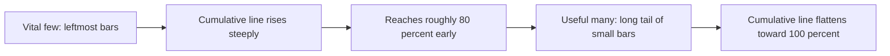
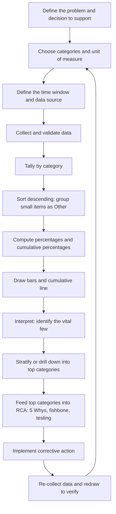
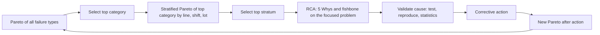

## Pareto Analysis and the Eighty Twenty Principle


### Purpose and Role in Root Cause Analysis

Pareto analysis is a prioritization technique that ranks categories of problems, defects, or causes by their contribution to a total effect, so that limited investigation and improvement effort is aimed where it will deliver the largest gain. In Root Cause Analysis (RCA), it answers a question that precedes and follows any "5 Whys" session: **which problem, or which cause, deserves analysis first?**

The technique rests on the observation, often called the **80/20 rule** or the **Pareto principle**, that in many systems a minority of causes (the "vital few") produces a majority of effects, while the remaining causes (the "useful many" or "trivial many") each contribute little.

Pareto analysis supports RCA at several points:

1. **Selecting the problem to analyze**: Choose the defect type, failure mode, or incident category with the greatest impact before running a "5 Whys."
2. **Prioritizing candidate causes**: After brainstorming (for example, a fishbone diagram), rank the causes by measured contribution.
3. **Validating a proposed cause**: Check whether the cause accounts for a large share of the observed failures.
4. **Verifying corrective action**: Compare Pareto charts before and after to confirm that the targeted category shrank.
5. **Focusing recurring improvement**: Re-run the analysis after each fix, because removing the top category exposes the next one.

**Key Points**

- Pareto analysis is **descriptive and prioritizing**, not causal. It shows *where* the effect is concentrated, not *why*.
- The 80/20 split is an **empirical pattern, not a law of nature**. Actual concentrations vary widely and must be measured.
- The quality of a Pareto chart depends on the **categories chosen**, the **measure used**, and the **data period**. Poor choices produce misleading priorities.
- A Pareto chart is a starting point for root cause work, not a conclusion.

### Origins and the Principle

**Vilfredo Pareto** (1848 to 1923), an Italian economist, observed that roughly 80% of the land in Italy was owned by about 20% of the population. **Joseph Juran** later generalized the idea to quality management, coining the phrase "the vital few and the trivial many" and applying it to defect analysis. The term "80/20 rule" is a popularization.

The ratio is illustrative. Real data may show 70/30, 90/10, 95/5, or a much flatter distribution. The two numbers do not need to sum to 100 (for example, 80% of effects from 10% of causes is possible).

| Domain | Illustrative Concentration Pattern (Typical, Not Universal) |
| --- | --- |
| Manufacturing quality | A few defect types account for most rejects |
| Software | A small share of modules holds most bugs; a few errors generate most log volume |
| Incident management | A few services or change types account for most outages |
| Customer support | A few issue categories generate most tickets |
| Maintenance | A few assets or failure modes cause most downtime |
| Safety | A few hazard types account for most injuries |

[Inference] Concentration patterns of this kind are widely reported in practice, but the exact ratio depends on how categories are defined and should be measured for each data set rather than assumed.

### Anatomy of a Pareto Chart

A Pareto chart combines two elements on shared categories:

1. **Bars** showing the magnitude of each category, sorted in **descending order** from left to right
2. **A cumulative line** (an ogive) showing the running percentage of the total



**Elements**

| Element | Description |
| --- | --- |
| **Left vertical axis** | Count, cost, time, or other measure, from 0 to the total |
| **Right vertical axis** | Cumulative percentage from 0% to 100% |
| **Category bars** | One per category, sorted from largest to smallest |
| **"Other" category** | Aggregated small categories, placed last regardless of size |
| **Cumulative line** | Plotted at the right edge (or top) of each bar |
| **80% reference line** | Optional guide to see how many categories reach 80% |

**Mathematical definition**

For categories sorted so that $x_1 \ge x_2 \ge \cdots \ge x_k$, with total $T = \sum_{i=1}^{k} x_i$:

$$\text{Share}_i = \frac{x_i}{T}, \qquad \text{Cumulative}_j = \frac{\sum_{i=1}^{j} x_i}{T}$$

The key quantity is the smallest number of categories $m$ such that:

$$\frac{\sum_{i=1}^{m} x_i}{T} \ge 0.80$$

The ratio $m/k$ shows how concentrated the effect is.

### Step-by-Step Procedure



#### 1. Define the Purpose

State the decision the chart will inform. Examples: "Which defect type should the improvement team address first?" or "Which incident category consumed the most engineering hours last quarter?"

#### 2. Choose Categories

Categories should be **mutually exclusive** and **collectively exhaustive**, at a level of granularity that matches the possible actions.

- Too broad ("Quality problems") hides the vital few.
- Too narrow (hundreds of one-off codes) flattens the distribution and produces a meaningless long tail.
- Categories should reflect something that can be acted upon (defect type, failure mode, process step, machine, shift, supplier, service, change type).

#### 3. Choose the Measure

The measure determines the priorities. The same data ranked differently can point to different targets.

| Measure | Emphasizes | Example |
| --- | --- | --- |
| **Frequency (count)** | How often | Number of defects by type |
| **Cost** | Financial impact | Scrap and rework cost by defect type |
| **Time or downtime** | Operational impact | Minutes of outage by service |
| **Severity-weighted score** | Risk or harm | Injuries weighted by seriousness |
| **Customers affected** | Business impact | Users impacted by incident type |
| **Effort** | Resource drain | Engineering hours by ticket category |

#### 4. Define the Time Window and Scope

Choose a period long enough to be representative and short enough to reflect the current process. Record the window on the chart.

#### 5. Collect and Validate Data

Check measurement quality: consistent definitions, correct classification, no duplicates, and no systematic omission. Poorly coded data (for example, too many items in "Miscellaneous") undermines the chart.

#### 6. Tally, Sort, and Compute

**Worked data set: defects on an assembly line (one month)**

| Defect Type | Count | Percent | Cumulative Percent |
| --- | --- | --- | --- |
| Solder bridge | 182 | 36.4% | 36.4% |
| Cold joint | 121 | 24.2% | 60.6% |
| Missing component | 74 | 14.8% | 75.4% |
| Misaligned part | 46 | 9.2% | 84.6% |
| Cracked board | 29 | 5.8% | 90.4% |
| Wrong polarity | 22 | 4.4% | 94.8% |
| Contamination | 14 | 2.8% | 97.6% |
| Other | 12 | 2.4% | 100.0% |
| **Total** | **500** | **100%** |  |

**Reading**: The top three defect types (3 of 8 categories) account for about 75% of defects, and the top four for about 85%. The team should begin RCA on solder bridges and cold joints, which together account for over 60%.

#### 7. Draw the Chart

```python
import pandas as pd
import matplotlib.pyplot as plt

data = {
    "Solder bridge": 182, "Cold joint": 121, "Missing component": 74,
    "Misaligned part": 46, "Cracked board": 29, "Wrong polarity": 22,
    "Contamination": 14,
}
other = 12

s = pd.Series(data).sort_values(ascending=False)
s["Other"] = other                       # "Other" always last

cum_pct = s.cumsum() / s.sum() * 100

fig, ax = plt.subplots(figsize=(9, 5))
ax.bar(s.index, s.values, color="steelblue")
ax.set_ylabel("Defect count")
ax.tick_params(axis="x", rotation=45)

ax2 = ax.twinx()
ax2.plot(s.index, cum_pct.values, color="darkorange", marker="o")
ax2.set_ylim(0, 105)
ax2.set_ylabel("Cumulative %")
ax2.axhline(80, color="gray", linestyle="--", linewidth=1)

plt.title("Pareto chart of defects by type")
plt.tight_layout()
plt.show()
```

**Spreadsheet approach**: Sort descending, compute a running sum column, divide by the total, then insert a combo chart (columns for counts, line on a secondary axis for cumulative percent). Most spreadsheet and statistics packages also include a built-in Pareto chart type.

#### 8. Interpret and Drill Down

Identify the vital few. Then ask how the top category behaves, using **stratification** (breaking the data down by another factor).

- Solder bridges by **line**, **shift**, **operator**, **solder paste lot**, **stencil age**, **time of day**, **board type**
- Present a **second-level Pareto** of the top category

A common finding is that the top category itself concentrates in a subset (for example, 70% of solder bridges come from one line), narrowing the RCA focus further.

### The Pareto Loop in an RCA Workflow



This repeated narrowing turns a broad, unfocused problem ("too many defects") into a specific, testable problem statement suitable for a "5 Whys" analysis.

### Variants and Extensions

| Variant | Description | Use Case |
| --- | --- | --- |
| **Weighted (cost or severity) Pareto** | Rank by cost, downtime, or a severity-weighted score instead of count | When a rare category is expensive or dangerous |
| **Stratified Pareto** | Repeat the chart within subgroups (line, shift, supplier) | Locating where a top category concentrates |
| **Comparative (before and after) Pareto** | Side-by-side charts, same categories and scale | Verifying that corrective action worked |
| **Pareto of causes** | Rank candidate causes from a fishbone by measured contribution | Prioritizing which causes to validate |
| **Multi-level (nested) Pareto** | Drill from category to sub-category to root-cause code | Complex processes with many failure modes |
| **Pareto over time** | A series of charts by period, or a heat map of category by period | Spotting shifts and emerging categories |
| **Risk-weighted Pareto** | Rank by risk priority number or expected loss | Safety and reliability prioritization |
| **Pareto of effort vs. impact** | Rank improvement options by benefit per unit effort | Choosing among corrective actions |

#### Frequency vs. Impact: Combining Measures

A category can rank differently by count and by cost. A practical approach is to build both charts and compare.

| Defect | Count Rank | Cost Rank | Comment |
| --- | --- | --- | --- |
| Solder bridge | 1 | 3 | Frequent but cheap to rework |
| Cracked board | 5 | 1 | Rare but requires scrapping the assembly |
| Missing component | 3 | 2 | Moderate frequency, moderate cost |

Selecting solely by frequency would miss the category with the highest financial impact.

A weighted score can combine dimensions:

$$W_i = \sum_{d} w_d \, s_{i,d}$$

where $s_{i,d}$ is the normalized score of category $i$ on dimension $d$ (frequency, cost, severity) and $w_d$ is an agreed weight. [Unverified] There is no universal weighting scheme, so the weights and their rationale should be documented and reviewed to avoid arbitrary results.

### Quantifying Concentration

The visual chart can be supplemented with numerical measures of inequality, which are useful for comparing distributions across periods or sites.

#### Cumulative Share and the Pareto Ratio

Compute the smallest proportion of categories that account for 80% of the effect. A small proportion means strong concentration.

#### Lorenz Curve and Gini Coefficient

The Lorenz curve plots the cumulative share of the effect against the cumulative share of categories, ordered from smallest to largest. The **Gini coefficient** measures the area between the Lorenz curve and the line of perfect equality:

$$G = \frac{2\sum_{i=1}^{n} i\,x_{(i)}}{n\sum_{i=1}^{n} x_{(i)}} - \frac{n+1}{n}$$

where $x_{(i)}$ are the values sorted in **ascending** order. $G = 0$ means perfectly even contributions, and $G$ approaching 1 means all of the effect comes from one category.

```python
import numpy as np

def gini(x):
    x = np.sort(np.asarray(x, dtype=float))       # ascending
    n = x.size
    i = np.arange(1, n + 1)
    return (2 * np.sum(i * x)) / (n * x.sum()) - (n + 1) / n

counts = [182, 121, 74, 46, 29, 22, 14, 12]
print(round(gini(counts), 3))
```

For the earlier defect data, $G$ is roughly 0.5, indicating moderate to strong concentration. [Inference] The Gini value depends on the number of categories chosen, so comparisons are only meaningful when the category scheme is held constant.

#### Statistical Fit to a Power-Law or Heavy-Tailed Model

Some distributions of failures or incidents follow a heavy-tailed (power-law-like) form, where the size $x$ of the effect is proportional to rank $r$ to a negative power:

$$x_r \propto r^{-\alpha}$$

A larger $\alpha$ implies stronger concentration. [Speculation] Fitting such a model may help in some domains, but distinguishing power laws from other heavy-tailed distributions (such as log-normal) requires care and adequate data, and is rarely necessary for practical RCA prioritization.

#### Pareto Distribution (Statistical)

The continuous **Pareto distribution** has the survival function:

$$P(X > x) = \left(\frac{x_m}{x}\right)^{\alpha}, \quad x \ge x_m$$

For a Pareto distribution with shape $\alpha$, the fraction of the total contributed by the top proportion $p$ of individuals is $p^{(\alpha - 1)/\alpha}$, valid for $\alpha > 1$. Setting this to 0.80 with $p = 0.20$ gives:

$$0.20^{(\alpha-1)/\alpha} = 0.80 \;\Rightarrow\; \alpha = \frac{\ln 0.20}{\ln 0.20 - \ln 0.80} \approx 1.16$$

This connects the "80/20" rule to a specific shape parameter of about 1.16 in the idealized case. Real category data seldom follows the distribution precisely, so this is a conceptual link rather than a fitting recommendation.

### Worked Example: Software Incident Prioritization

**Situation**: An engineering organization reviews 90 days of production incidents to decide where to focus RCA effort.

**Step 1: Classify by service and measure by total customer-impact minutes**

| Service | Incidents | Impact Minutes | Percent | Cumulative |
| --- | --- | --- | --- | --- |
| Checkout | 9 | 1,860 | 41.3% | 41.3% |
| Search | 14 | 980 | 21.8% | 63.1% |
| Auth | 6 | 620 | 13.8% | 76.9% |
| Notifications | 19 | 410 | 9.1% | 86.0% |
| Recommendations | 11 | 290 | 6.4% | 92.4% |
| Reporting | 8 | 210 | 4.7% | 97.1% |
| Other | 7 | 130 | 2.9% | 100.0% |
| **Total** | **74** | **4,500** | **100%** |  |

**Observation**: By incident count, Notifications ranks first (19), but by impact minutes it ranks fourth. Checkout has fewer incidents but the largest impact. The choice of measure changes the priority.

**Step 2: Drill down into Checkout by trigger type**

| Trigger | Incidents | Impact Minutes | Cumulative |
| --- | --- | --- | --- |
| Downstream payment slowness | 4 | 1,180 | 63.4% |
| Deployment regression | 2 | 410 | 85.5% |
| Database saturation | 2 | 200 | 96.2% |
| Other | 1 | 70 | 100% |

**Step 3: Feed into RCA**

The top stratum ("downstream payment slowness in Checkout") becomes the focused problem statement for a "5 Whys" and for the validation methods covered elsewhere in this curriculum (reproduction, statistical testing, triangulation). The analysis is now aimed at roughly 26% of all customer impact minutes (1,180 of 4,500), a much higher-yield target than a random incident.

**Step 4: Verify after corrective action**

After adding timeouts and circuit breakers to the payment calls, the team re-collects 90 days of data. A comparative Pareto shows Checkout impact minutes fell substantially and the ranking changed, with Search now leading. The process repeats with the new top category.

### Using Pareto Analysis to Prioritize Causes (Fishbone Follow-Up)

After a fishbone session, a team may list 20 to 30 candidate causes. Pareto analysis converts the list into a ranked, evidence-based priority.

**Method**

1. For each candidate cause, define a measurable indicator (for example, "defects with bent pins traced to the fixture").
2. Collect data on how many failures each cause explains (through inspection, sampling, or coded root-cause fields).
3. Plot the Pareto chart of causes.
4. Focus validation and corrective action on the top causes.

**Caution**: If the cause data is derived from opinions (for example, a survey of who thinks what is responsible) rather than observed attribution, the resulting chart reflects belief, not evidence. Label such charts accordingly.

### Interpreting Charts Carefully

| Observation | Possible Interpretation | Action |
| --- | --- | --- |
| Steep rise, few bars dominate | Strong concentration; clear priorities | Focus RCA on top categories |
| Nearly flat bars | No dominant category; categories may be too granular or the problem systemic | Regroup categories, change the stratification, or look for a common underlying cause |
| Large "Other" bar | Categories not defined well; hidden vital few | Break "Other" into finer categories |
| Top category is a catch-all ("Miscellaneous," "Unknown") | Poor classification | Improve data capture before deciding |
| Ranking changes with the measure | Frequency and impact diverge | Use multiple charts or a weighted score |
| Ranking changes across periods | Unstable process or seasonal effects | Extend the window, stratify by period, or use a control chart |
| Top category unchanged after "fixes" | Fixes address symptoms, or the classification masks the cause | Re-run RCA; check whether the category is a symptom shared by several causes |
| New category appears after fixing the top one | Normal shifting of priorities, or a side effect of the change | Verify no new failure was introduced by the fix |

### Limitations and Cautions

1. **Descriptive, not causal**: A large bar does not identify why failures occur. Follow with RCA and validation.
2. **Category definition drives results**: Different groupings produce different rankings. Choices should be justified and stable.
3. **Historical data only**: It shows past distribution and may not predict future or emerging problems.
4. **Ignores dependencies**: Categories may be related (one failure causing another), and separate bars may double-count the same underlying cause.
5. **Ignores effort to fix**: The biggest bar may be the hardest to address, and a smaller category may be a quick win. Combine with a cost-benefit or effort-impact assessment.
6. **Ignores rare catastrophic events**: Low-frequency, high-severity events sit in the tail and may be overlooked when ranking by count. Use severity-weighted measures or a separate risk analysis (for example, FMEA).
7. **Not everything follows 80/20**: Forcing the data into an 80/20 story misleads. Report what the data show.
8. **Sampling and reporting bias**: Underreported categories appear smaller than they are.
9. **Single snapshot**: One period can mislead. Check stability over time.
10. **Aggregation hides mechanisms**: The top category may combine multiple distinct failure mechanisms that need separate causal analysis.

### Relationship to Other Quantitative and RCA Tools

| Tool | Relationship to Pareto Analysis |
| --- | --- |
| **Check sheets** | Provide the tally data that feeds a Pareto chart |
| **Histogram** | Shows the distribution of a continuous measure; Pareto ranks categorical contributions |
| **Fishbone diagram** | Generates candidate causes; Pareto prioritizes them with data |
| **5 Whys** | Digs into the mechanism behind the top Pareto category |
| **Scatter plot and correlation** | Tests relationships between a suspected cause and the effect for a top category |
| **Control chart (SPC)** | Monitors stability over time; Pareto shows composition at a point in time |
| **FMEA** | Prospective risk ranking; Pareto is retrospective and data driven |
| **Stratification** | Splits data by factor to find where the top category concentrates |
| **Regression and hypothesis tests** | Test whether apparent concentration reflects a real effect or chance |
| **Cost-benefit and effort-impact analysis** | Combine with Pareto to select actions by return, not just by size |

### Statistical Caution: Is the Concentration Real?

With small counts, apparent dominance of a category can arise by chance. Consider a **chi-square goodness-of-fit test** against an expectation of equal (or exposure-proportional) rates, or compute confidence intervals for proportions.

For a category with observed proportion $\hat{p}$ from $n$ events, an approximate 95% confidence interval (Wilson or normal approximation for reasonable counts) is:

$$\hat{p} \pm 1.96\sqrt{\frac{\hat{p}(1-\hat{p})}{n}}$$

**Exposure adjustment**: A category may have the most failures simply because it has the most units or operating hours. Normalize by exposure (for example, failures per 1,000 units or per operating hour) to compare true failure rates.

```python
from scipy.stats import chisquare

observed = [182, 121, 74, 46, 29, 22, 14, 12]
stat, p = chisquare(observed)     # default expectation: equal counts
print(stat, p)
```

For exposure-adjusted comparison, supply the expected counts in proportion to exposure through the `f_exp` argument.

### Best Practices

- **Start with the decision**, then choose the category scheme and measure.
- **Use consistent, documented definitions** for categories and time windows.
- **Prefer 5 to 10 categories** plus "Other," and keep "Other" small (often kept below about 10% to 15% of the total, as a rule of thumb rather than a fixed limit).
- **Show both counts and cumulative percentages**, and label the total and the period.
- **Build multiple views** (frequency, cost, downtime, severity) when priorities may differ.
- **Stratify** the top category to find where it concentrates.
- **Redraw after each improvement** to confirm impact and reveal the next priority.
- **Combine with domain knowledge**, because the chart cannot judge feasibility, safety criticality, or regulatory obligations.
- **Do not ignore low-frequency, high-consequence risks** just because they appear in the tail.
- **Treat the chart as an input to RCA**, and record how each top category feeds into a specific investigation.

### Common Pitfalls

1. **Treating the 80/20 ratio as a rule to force**: Reporting "80/20" when the data show something different.
2. **Unsorted bars**: A Pareto chart requires descending order (except "Other").
3. **Dominant "Other" or "Miscellaneous"**: Hides the categories that matter.
4. **Categories at the wrong level**: Too broad to act on, or so granular that no pattern emerges.
5. **Mismatched measure**: Ranking by count when cost or safety impact is the real concern.
6. **Non-comparable periods or scopes**: Comparing before and after charts with different volumes, scales, or definitions.
7. **Mistaking priority for cause**: Concluding that the largest category's cause is known.
8. **Ignoring exposure**: Failing to normalize when categories have different volumes.
9. **Data collected only where problems are noticed**: Selection bias in what is counted.
10. **Stopping at the first chart**: Not drilling down or stratifying.
11. **Chasing yesterday's problem**: Historical data may not reflect current process or emerging issues.
12. **Overlooking interactions**: Double counting failures that involve multiple categories.
13. **Presentation errors**: Truncated axes, misleading scales, or a cumulative line that does not start at the first bar.

### Pareto Analysis Checklist

- [ ] Decision or problem to be informed by the chart is stated
- [ ] Categories are mutually exclusive, exhaustive, and actionable
- [ ] Measure (count, cost, time, severity, impact) is chosen deliberately and justified
- [ ] Time window and scope are defined and documented
- [ ] Data are validated for classification consistency, duplicates, and omissions
- [ ] Categories sorted descending with "Other" last, and "Other" kept small
- [ ] Percentages and cumulative percentages computed correctly
- [ ] Chart shows bars, cumulative line, totals, period, and source
- [ ] Alternative measures examined where priorities may differ
- [ ] Exposure normalization applied where category volumes differ
- [ ] Top categories stratified to locate where they concentrate
- [ ] Concentration checked against chance for small counts
- [ ] Low-frequency, high-severity risks reviewed separately
- [ ] Top categories linked to specific RCA investigations
- [ ] Follow-up chart planned to verify the effect of corrective action

**Conclusion**

Pareto analysis converts a mass of failure, defect, or incident data into a ranked view that shows where effort will pay off most. Its power comes from disciplined choices about categories, measures, and time windows, from stratifying the top categories to find precisely where the problem concentrates, and from repeating the analysis to verify improvement. Because it is descriptive rather than causal, it works best as the front end and the feedback loop of RCA: it selects and narrows the problem for techniques like the "5 Whys," and confirms afterward whether the validated corrective actions actually reduced the effect. The 80/20 ratio should be treated as a common pattern to be measured, not a result to be assumed.

**Related Topics**

- Check sheets and structured data collection
- Stratification and data segmentation
- Histograms and distribution analysis
- Control charts and statistical process control (SPC)
- Fishbone (Ishikawa) diagrams and cause prioritization
- Failure Mode and Effects Analysis (FMEA) and risk priority numbers
- Scatter plots, correlation, and regression for cause testing
- Lorenz curves and the Gini coefficient
- Hypothesis testing and confidence intervals for proportions
- Cost-benefit and effort-impact prioritization matrices
- Measurement system analysis and data quality
- Statistical validation of proposed causes
- Verifying effectiveness of corrective actions with before-and-after comparison