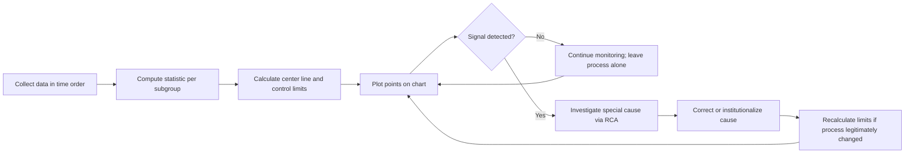
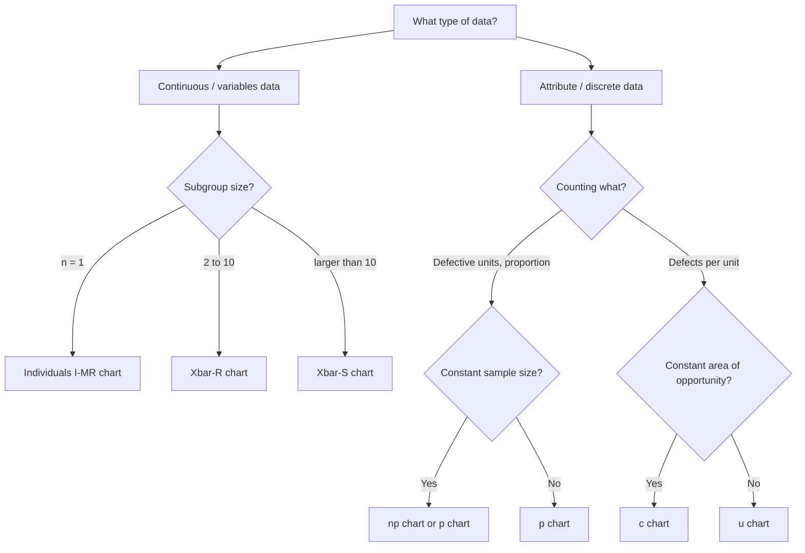
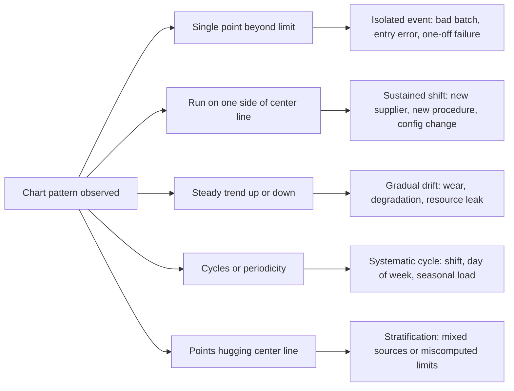
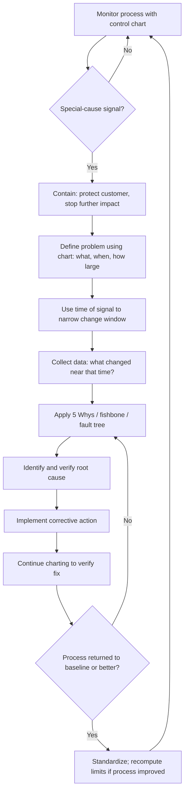
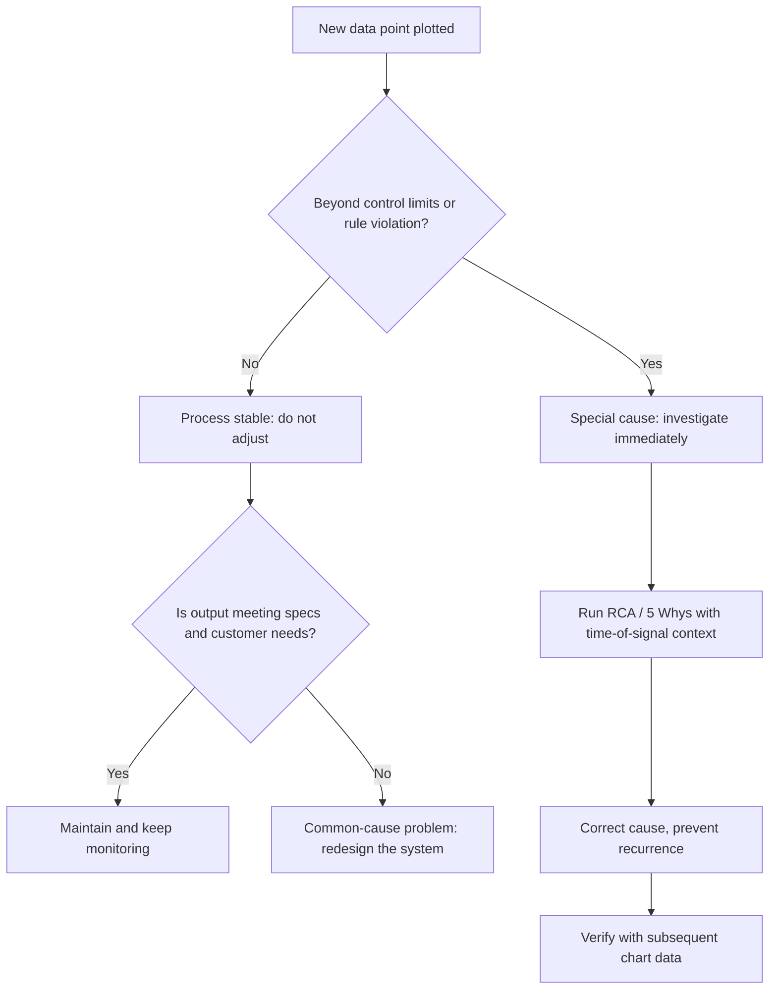

## Basic Statistical Process Control Concepts


### Overview

Statistical Process Control (SPC) is a set of quantitative methods for monitoring and controlling a process by analyzing its output data over time. Developed by Walter A. Shewhart at Bell Telephone Laboratories in the 1920s and popularized by W. Edwards Deming, SPC distinguishes between **normal, inherent process variation** and **abnormal, assignable variation** that signals something has changed.

In the context of Root Cause Analysis (RCA) and the "5 Whys", SPC provides the quantitative foundation for three critical questions:

1. **Is there actually a problem?** (Is the process behaving differently from its established baseline?)
2. **When did it start?** (Where does the signal appear in time, narrowing the search window for causes?)
3. **Did the fix work?** (Has the process returned to, or improved beyond, its baseline?)

Without SPC, teams often perform RCA on noise, chasing random fluctuations as though they were meaningful events, or miss genuine shifts hidden in the scatter of data.

**Key Points**

- SPC separates **signal** (special cause) from **noise** (common cause).
- Control charts are the primary SPC tool.
- Control limits describe what the process **is doing** (voice of the process); specification limits describe what the customer **wants** (voice of the customer). They are not the same thing.
- Reacting to common-cause variation as if it were special-cause (tampering) makes processes worse.
- Ignoring special-cause variation allows problems to persist and escalate.

---

### Variation: The Foundation of SPC

Every process exhibits variation. No two outputs are exactly identical, whether measuring response time of an API, fill volume of a bottle, or defect counts per shift.

#### Common Cause Variation

Common cause variation (also called **natural**, **inherent**, or **random** variation) is the variation built into the process by its design, materials, methods, equipment, and environment.

Characteristics:

- Present at all times, in all outputs
- Stable and predictable within a range
- Produced by many small, individually insignificant sources
- Fixing it requires **changing the system** (management-level action), not reacting to individual data points

Examples:

- Minor variation in server response times due to normal load fluctuation
- Small differences in raw material properties within supplier tolerance
- Operator-to-operator differences within trained standard work

#### Special Cause Variation

Special cause variation (also called **assignable cause** variation) arises from a specific, identifiable factor that is **not** part of the normal process.

Characteristics:

- Intermittent or sudden; not present all the time
- Produces unusual points, patterns, shifts, or trends
- Usually has an identifiable root cause discoverable through RCA
- Fixing it means **finding and eliminating (or institutionalizing) the specific cause**

Examples:

- A tool that suddenly wears out and shifts dimensions
- A bad batch of raw material
- A configuration change deployed to production that raises error rates
- An untrained temporary operator on one shift

#### Comparison Table

| Attribute | Common Cause | Special Cause |
| --- | --- | --- |
| Source | System design | Specific external event/factor |
| Pattern | Random, stable | Unusual, unstable |
| Predictability | Predictable within limits | Unpredictable |
| Who acts | Management (system change) | Operators/engineers (RCA) |
| Response | Redesign process | Investigate and fix specific cause |
| Risk if misdiagnosed | Tampering increases variation | Problem persists undetected |

#### Two Types of Error in Reaction

|  | Process is stable (common cause only) | Process has special cause |
| --- | --- | --- |
| **Treat as special cause** | **Type I / Tampering**: waste effort, increase variation | Correct action |
| **Treat as common cause** | Correct action | **Type II / Under-reaction**: miss the signal |

Deming's funnel experiment demonstrates that adjusting a stable process in response to each deviation (Rule 2, 3, 4 of the funnel) increases variance compared to leaving it alone (Rule 1).

---

### The Concept of Statistical Control

A process is said to be **in statistical control** (or **stable**) when its variation is due only to common causes. In practice, this means the data fall within control limits in a random pattern with no non-random signals.

**Important distinctions:**

- **In control** does not mean **good**. A process can be stable and consistently produce defective output.
- **Out of control** does not mean **bad**. An unexpected improvement is also a special-cause signal worth investigating (so it can be replicated).
- **Capable** refers to whether the stable process meets specifications, a separate question from control.

The four combinations:

|  | Capable (meets specs) | Not capable |
| --- | --- | --- |
| **In control** | Ideal: monitor and maintain | Stable but inadequate: requires fundamental redesign |
| **Out of control** | Meets specs by luck: unpredictable, investigate | Worst case: unstable and inadequate |

---

### Control Charts

A control chart is a time-ordered plot of a process statistic with a **center line** (CL) and **upper and lower control limits** (UCL, LCL).

#### Anatomy



Components:

- **Center line (CL):** The process average (or median) of the plotted statistic
- **Upper Control Limit (UCL):** Typically CL + 3σ
- **Lower Control Limit (LCL):** Typically CL - 3σ
- **Data points:** Individual measurements or subgroup statistics in time order

#### Why Three Sigma?

Three-sigma limits were chosen by Shewhart as an economic compromise. For a normally distributed statistic, approximately 99.73% of points fall within $\mu \pm 3\sigma$ when the process is stable, giving a false alarm rate of about 0.27% per point (roughly 1 in 370). The limits balance:

- The cost of investigating false alarms (too-tight limits)
- The cost of missing real signals (too-wide limits)

This does not depend on the data being perfectly normal; Shewhart charts are reasonably robust, though heavily skewed data can affect false-alarm rates.

$$\text{UCL} = \bar{x} + 3\sigma, \quad \text{CL} = \bar{x}, \quad \text{LCL} = \bar{x} - 3\sigma$$

**Key Points**

- Control limits are calculated from **process data**, never from specification limits.
- Control limits are **not** the same as standard deviation of individual values in every chart type; for subgroup-mean charts, the limits use the standard error of the mean.
- Limits should be computed from a period when the process is believed stable (baseline), then extended forward for monitoring.

---

### Rational Subgrouping

A **subgroup** is a small sample of consecutive or closely related measurements taken together. **Rational subgrouping** means selecting subgroups so that:

- Variation **within** a subgroup reflects only common cause variation
- Variation **between** subgroups will reveal special causes

Example: Sample 5 consecutive parts from one machine every hour. Within-subgroup variation captures short-term machine variation; between-subgroup variation captures drift, shift changes, and material lots.

Poor subgrouping (e.g., mixing parts from two machines or two shifts into one subgroup) inflates within-subgroup variation, widens control limits, and hides real signals.

---

### Types of Control Charts

Chart selection depends on the **type of data**.



#### Variables (Continuous) Data Charts

**Individuals and Moving Range (I-MR) chart**

- Used when data are collected one at a time (subgroup size = 1)
- Examples: daily revenue, weekly incident count treated as continuous, batch yield, monthly response time average
- Two panels: individual values (I chart) and moving range (MR chart), where the moving range is $MR_i = |x_i - x_{i-1}|$

Formulas:

$$\overline{MR} = \frac{\sum_{i=2}^{k} MR_i}{k-1}$$


$$\text{UCL}_X = \bar{x} + 2.66\,\overline{MR}, \quad \text{LCL}_X = \bar{x} - 2.66\,\overline{MR}$$


$$\text{UCL}_{MR} = 3.267\,\overline{MR}, \quad \text{LCL}_{MR} = 0$$

The constant $2.66 = 3/d_2$ where $d_2 = 1.128$ for a moving range of span 2.

**Xbar-R chart** (subgroup mean and range; n = 2 to 10)

$$\text{CL}_{\bar{X}} = \bar{\bar{x}}, \quad \text{UCL}_{\bar{X}} = \bar{\bar{x}} + A_2\bar{R}, \quad \text{LCL}_{\bar{X}} = \bar{\bar{x}} - A_2\bar{R}$$


$$\text{CL}_R = \bar{R}, \quad \text{UCL}_R = D_4\bar{R}, \quad \text{LCL}_R = D_3\bar{R}$$

Selected constants:

| n | A₂ | D₃ | D₄ | d₂ |
| --- | --- | --- | --- | --- |
| 2 | 1.880 | 0 | 3.267 | 1.128 |
| 3 | 1.023 | 0 | 2.574 | 1.693 |
| 4 | 0.729 | 0 | 2.282 | 2.059 |
| 5 | 0.577 | 0 | 2.114 | 2.326 |
| 6 | 0.483 | 0 | 2.004 | 2.534 |
| 7 | 0.419 | 0.076 | 1.924 | 2.704 |
| 8 | 0.373 | 0.136 | 1.864 | 2.847 |
| 9 | 0.337 | 0.184 | 1.816 | 2.970 |
| 10 | 0.308 | 0.223 | 1.777 | 3.078 |

Always interpret the **R chart first**. If within-subgroup variability is unstable, the Xbar chart limits are unreliable.

**Xbar-S chart** (subgroup mean and standard deviation; larger subgroups, typically n > 10)

Uses the subgroup standard deviation $s$ instead of the range, since the range becomes an inefficient estimator of spread as subgroup size grows.

#### Attributes (Discrete) Data Charts

| Chart | Plots | Data type | Sample size |
| --- | --- | --- | --- |
| **p chart** | Proportion defective | Binomial | Variable or constant |
| **np chart** | Number defective | Binomial | Constant |
| **c chart** | Count of defects | Poisson | Constant area of opportunity |
| **u chart** | Defects per unit | Poisson | Variable area of opportunity |

Formulas:

$$\bar{p} = \frac{\sum \text{defectives}}{\sum n}, \quad \text{UCL}_p = \bar{p} + 3\sqrt{\frac{\bar{p}(1-\bar{p})}{n}}, \quad \text{LCL}_p = \bar{p} - 3\sqrt{\frac{\bar{p}(1-\bar{p})}{n}}$$


$$\text{UCL}_c = \bar{c} + 3\sqrt{\bar{c}}, \quad \text{LCL}_c = \bar{c} - 3\sqrt{\bar{c}}$$


$$\text{UCL}_u = \bar{u} + 3\sqrt{\frac{\bar{u}}{n}}, \quad \text{LCL}_u = \bar{u} - 3\sqrt{\frac{\bar{u}}{n}}$$

If a computed LCL is negative, it is set to 0.

**Defective vs. defect:** A *defective* is a unit that fails (a binary judgment on the whole unit). A *defect* is an individual nonconformity; one unit can contain several defects.

**Key Points**

- Match the chart to the data type; the wrong chart produces misleading limits.
- For rare-event counts (e.g., incidents per month), the individuals chart is often a practical, robust choice, though g-charts and t-charts are alternatives for very rare events [Inference: preference depends on event rarity and audience familiarity].
- When in doubt with single-observation data, start with the I-MR chart.

---

### Detecting Signals: Rules for Out-of-Control Conditions

A point outside the control limits is the classic signal, but patterns within the limits can also indicate special causes. The most common rule sets are the **Western Electric rules** and the **Nelson rules**.

Divide the chart into zones, with each zone one standard deviation wide:

- **Zone C:** within 1σ of the center line
- **Zone B:** between 1σ and 2σ
- **Zone A:** between 2σ and 3σ

#### Western Electric Rules

1. One point beyond Zone A (outside the 3σ limits)
2. Two out of three consecutive points in Zone A or beyond, on the same side of the center line
3. Four out of five consecutive points in Zone B or beyond, on the same side of the center line
4. Eight consecutive points on the same side of the center line

#### Nelson Rules (Common Set)

| Rule | Pattern | Typical Interpretation |
| --- | --- | --- |
| 1 | One point more than 3σ from the mean | Sudden large disturbance |
| 2 | Nine consecutive points on the same side of the mean | Sustained shift in the mean |
| 3 | Six consecutive points steadily increasing or decreasing | Trend or drift (e.g., tool wear) |
| 4 | Fourteen consecutive points alternating up and down | Overcontrol, or alternating systematic factors |
| 5 | Two of three consecutive points more than 2σ from the mean (same side) | Emerging shift |
| 6 | Four of five consecutive points more than 1σ from the mean (same side) | Emerging small shift |
| 7 | Fifteen consecutive points within 1σ of the mean (either side) | Stratification; limits may be too wide or data mixed |
| 8 | Eight consecutive points more than 1σ from the mean (either side) | Mixture of two populations |

**Key Points**

- Each additional rule increases sensitivity to small shifts but also raises the overall false-alarm rate. Use a limited, agreed set of rules for operational monitoring.
- Software implementations vary in the exact rule definitions and defaults; confirm settings in your tool.

#### Common Pattern Interpretations



---

### Control Limits vs. Specification Limits

This is among the most frequently misunderstood SPC concepts.

| Attribute | Control Limits | Specification Limits |
| --- | --- | --- |
| Source | Calculated from process data | Set by customer, engineering, or regulation |
| Voice of | The process | The customer |
| Applies to | Plotted statistic (e.g., subgroup mean) | Individual units/outputs |
| Answers | "Is the process stable?" | "Does the output meet requirements?" |
| Can be changed by | Improving/changing the process | Customer/design decision |

A process can be:

- **Within control limits but outside specifications** (stable but incapable)
- **Outside control limits but within specifications** (unstable but currently acceptable, risky)

Never draw specification limits on an Xbar chart as though they were comparable to control limits. Subgroup means have less spread than individual values, so specification limits on a mean chart are misleading.

---

### Process Capability

Once a process is demonstrated to be stable, **capability analysis** quantifies how well its natural variation fits within specification limits. Capability is only meaningful for a stable process; computing it on an unstable process yields numbers that do not predict future performance.

#### Capability Indices

With lower spec limit $LSL$, upper spec limit $USL$, process mean $\mu$, and short-term standard deviation $\sigma$ estimated from within-subgroup variation:

$$C_p = \frac{USL - LSL}{6\sigma}$$

$C_p$ measures potential capability, the ratio of the specification width to the process spread, ignoring centering.

$$C_{pk} = \min\left(\frac{USL - \mu}{3\sigma}, \frac{\mu - LSL}{3\sigma}\right)$$

$C_{pk}$ accounts for centering by using the distance from the mean to the **nearest** specification limit.

When long-term overall standard deviation $s$ is used instead, the analogous indices are $P_p$ and $P_{pk}$ (performance indices), which reflect both within- and between-subgroup variation.

| $C_{pk}$ Value | Common Interpretation |
| --- | --- |
| < 1.00 | Not capable; significant nonconforming output expected |
| 1.00 to 1.33 | Marginally capable |
| ≥ 1.33 | Generally considered capable (a common industry minimum) |
| ≥ 1.67 | Highly capable |
| ≥ 2.00 | Six Sigma level (with the conventional 1.5σ shift allowance) |

[Inference: Acceptance thresholds vary by industry, customer, and criticality; the values above are widely cited conventions, not universal standards.]

**Key Points**

- $C_p \geq C_{pk}$ always; equality holds only when the process is perfectly centered.
- A large gap between $C_p$ and $C_{pk}$ indicates a centering problem that is often cheaper to fix than reducing variation.
- Capability indices assume approximate normality; heavily non-normal data may require transformation or non-normal capability methods.

---

### Building a Control Chart: Step-by-Step

1. **Define the characteristic to monitor.** Choose a measurable, meaningful process output or input tied to the problem.
2. **Verify the measurement system.** If measurement error is large relative to process variation, the chart will reflect the gauge, not the process (see Measurement System Analysis).
3. **Select the chart type** based on data type and subgroup structure.
4. **Define rational subgroups** and sampling frequency.
5. **Collect baseline data.** A commonly cited guideline is at least 20 to 25 subgroups (or roughly 100 individual observations) for computing initial limits [Inference: guidelines vary by source].
6. **Compute statistics and limits** using the appropriate formulas.
7. **Plot the data in time order** with CL, UCL, LCL.
8. **Assess stability.** Apply the chosen rule set. Investigate special causes.
9. **Remove points with confirmed assignable causes** (only if the cause is understood and corrected) and recalculate limits. Do not delete points without justification.
10. **Extend limits forward** and monitor in real time.
11. **Document actions.** Annotate the chart with events (e.g., deployments, material changes) to support future RCA.
12. **Revise limits only when the process is deliberately and demonstrably changed.**

---

### Worked Example: I-MR Chart

**Example**

A support team tracks daily average ticket resolution time (in hours) for 15 consecutive days:

| Day | Hours |
| --- | --- |
| 1 | 8.2 |
| 2 | 7.9 |
| 3 | 8.5 |
| 4 | 8.0 |
| 5 | 8.3 |
| 6 | 7.8 |
| 7 | 8.1 |
| 8 | 8.4 |
| 9 | 8.0 |
| 10 | 8.2 |
| 11 | 8.6 |
| 12 | 7.9 |
| 13 | 8.3 |
| 14 | 12.1 |
| 15 | 8.1 |

**Step 1: Compute the mean of the individual values.**

Sum = 8.2 + 7.9 + 8.5 + 8.0 + 8.3 + 7.8 + 8.1 + 8.4 + 8.0 + 8.2 + 8.6 + 7.9 + 8.3 + 12.1 + 8.1 = 125.4

$$\bar{x} = \frac{125.4}{15} = 8.36$$

**Step 2: Compute moving ranges.**

| Pair | MR |
| --- | --- |
| 1 to 2 | 0.3 |
| 2 to 3 | 0.6 |
| 3 to 4 | 0.5 |
| 4 to 5 | 0.3 |
| 5 to 6 | 0.5 |
| 6 to 7 | 0.3 |
| 7 to 8 | 0.3 |
| 8 to 9 | 0.4 |
| 9 to 10 | 0.2 |
| 10 to 11 | 0.4 |
| 11 to 12 | 0.7 |
| 12 to 13 | 0.4 |
| 13 to 14 | 3.8 |
| 14 to 15 | 4.0 |

Sum of MR = 0.3 + 0.6 + 0.5 + 0.3 + 0.5 + 0.3 + 0.3 + 0.4 + 0.2 + 0.4 + 0.7 + 0.4 + 3.8 + 4.0 = 12.7

$$\overline{MR} = \frac{12.7}{14} \approx 0.907$$

**Step 3: Compute control limits (initial, including the outlier).**

$$\text{UCL}_X = 8.36 + 2.66 \times 0.907 \approx 10.77$$


$$\text{LCL}_X = 8.36 - 2.66 \times 0.907 \approx 5.95$$

Day 14 (12.1 hours) exceeds the UCL of 10.77, a special-cause signal.

**Step 4: Investigate and recompute.**

Suppose RCA reveals that Day 14 coincided with a major outage that flooded the queue. This is a confirmed assignable cause. Excluding Day 14 and recomputing:

Sum without Day 14 = 125.4 − 12.1 = 113.3, over 14 points:

$$\bar{x} = \frac{113.3}{14} \approx 8.09$$

The moving ranges involving Day 14 (3.8 and 4.0) are removed, and the new pair 13 to 15 has $MR = 0.2$. Remaining ranges: 0.3, 0.6, 0.5, 0.3, 0.5, 0.3, 0.3, 0.4, 0.2, 0.4, 0.7, 0.4, 0.2 (13 ranges), sum = 5.1:

$$\overline{MR} = \frac{5.1}{13} \approx 0.392$$


$$\text{UCL}_X = 8.09 + 2.66 \times 0.392 \approx 9.13, \quad \text{LCL}_X = 8.09 - 2.66 \times 0.392 \approx 7.05$$

**Output**

The revised baseline limits (roughly 7.05 to 9.13 hours) now describe the stable process. Future points outside this band, or exhibiting Nelson-rule patterns, trigger investigation. The Day 14 spike was **not** common cause variation and warranted RCA.

**Conclusion**

The original inflated limits (5.95 to 10.77) would have been too wide to detect moderate future shifts. Removing a *confirmed and understood* special-cause point tightens the limits to represent the true stable process. Removing points without understanding the cause would be data manipulation.

---

### Worked Example: p Chart

**Example**

A QA team inspects 200 units per day and records the number of defective units over 10 days:

| Day | Defectives |
| --- | --- |
| 1 | 8 |
| 2 | 6 |
| 3 | 10 |
| 4 | 7 |
| 5 | 9 |
| 6 | 5 |
| 7 | 8 |
| 8 | 24 |
| 9 | 7 |
| 10 | 6 |

Total defectives = 90, total inspected = 2000.

$$\bar{p} = \frac{90}{2000} = 0.045$$


$$\text{UCL}_p = 0.045 + 3\sqrt{\frac{0.045 \times 0.955}{200}} = 0.045 + 3(0.01466) \approx 0.089$$


$$\text{LCL}_p = 0.045 - 0.0440 \approx 0.001$$

Daily proportions: Day 8 = 24/200 = 0.120, which exceeds the UCL of 0.089. All others fall between 0.025 and 0.050.

**Output**

Day 8 is a special-cause signal. The team launches an RCA (see next section) to identify what differed on that day.

---

### SPC and RCA: Integration

SPC and RCA are complementary. SPC detects and locates the signal; RCA explains it.



#### How SPC Strengthens the 5 Whys

| RCA Challenge | SPC Contribution |
| --- | --- |
| Vague problem statement | Chart quantifies size and timing of the deviation |
| Reacting to noise | Control limits prevent investigation of common-cause fluctuations |
| Unknown onset time | The point where the signal first appears bounds the search window ("what changed between subgroup 11 and 12?") |
| Unverified fixes | Post-fix chart data confirms (or refutes) that the shift ended |
| Conflicting hypotheses | Stratified charts (by machine, shift, region) test whether a "why" is supported by data |
| Recurring problems | Chart history reveals whether the special cause is periodic or one-off |

#### Illustrative 5 Whys Chain Triggered by an SPC Signal

**Example**

Signal: The p chart (above) shows Day 8 defective proportion of 12.0%, well above the UCL of 8.9%.

1. **Why was the defect rate abnormally high on Day 8?** Because a large number of units failed the dimensional inspection.
2. **Why did units fail the dimensional inspection?** Because a critical dimension drifted out of tolerance on the machine used that day.
3. **Why did the dimension drift?** Because the cutting tool had exceeded its wear limit.
4. **Why was the worn tool still in use?** Because the tool change interval was not enforced on that shift.
5. **Why was the interval not enforced?** Because the tool-life counter was not part of the shift checklist after the checklist was revised last month.

Root cause (process-level): The tool-life check was inadvertently removed from the shift checklist during revision. Corrective action: restore the check, add a change-control review for checklist edits, and continue plotting the p chart to confirm return to baseline.

[Inference: This chain is illustrative. Actual whys must be verified with evidence at each step rather than assumed.]

---

### Common Pitfalls and Misuses

| Pitfall | Consequence | Remedy |
| --- | --- | --- |
| Using specification limits as control limits | Wrong signal detection; process instability hidden | Compute limits from data |
| Computing limits from a period that includes special causes and never revisiting them | Inflated limits, missed future signals | Investigate, remove confirmed assignable points, recompute |
| Recomputing limits every time new data arrives | Limits chase the data; signals absorbed | Fix limits from a stable baseline; revise only on deliberate process change |
| Wrong chart type for the data | Incorrect limits and false alarms | Follow the chart selection guide |
| Poor rational subgrouping (mixing sources) | Wide limits, hidden shifts | Subgroup so that within-subgroup variation is common cause only |
| Ignoring the range/MR chart | Unreliable mean chart limits | Assess variability chart first |
| Autocorrelated data treated as independent | Excess false alarms | Check autocorrelation; consider time-series-adjusted methods [Inference: severity depends on strength of autocorrelation] |
| Too many rules applied simultaneously | Alarm fatigue | Use a limited agreed rule set |
| Tampering (adjusting on every deviation) | Increased variation | Act only on signals |
| Poor measurement system | Chart reflects gauge noise | Perform measurement system analysis |
| Computing capability on an unstable process | Meaningless capability numbers | Establish control first |
| Treating rounding or coarse resolution as real variation | Artifacts such as many zero moving ranges | Ensure adequate measurement resolution |

---

### Beyond the Basics: Awareness

These advanced chart families extend the fundamentals; a brief orientation follows:

- **CUSUM (Cumulative Sum):** Accumulates deviations from a target, making it more sensitive to small sustained shifts than a Shewhart chart.
- **EWMA (Exponentially Weighted Moving Average):** Weights recent data more heavily; also effective at detecting small shifts.
- **Short-run charts:** Normalize data for low-volume, high-mix production.
- **Multivariate charts (e.g., Hotelling's $T^2$):** Monitor several correlated characteristics simultaneously.
- **g and t charts:** Designed for very rare events, plotting the count of opportunities or the time between events.

Shewhart charts are best at detecting large shifts (roughly 1.5σ and above); CUSUM and EWMA are preferred when small shifts (roughly 0.5σ to 1.5σ) matter. [Inference: exact detection performance depends on the rule set and shift size; consult average-run-length tables for specifics.]

---

### Implementation Sketch in Python

**Example**

```python
import numpy as np
import matplotlib.pyplot as plt

data = np.array([8.2, 7.9, 8.5, 8.0, 8.3, 7.8, 8.1, 8.4,
                 8.0, 8.2, 8.6, 7.9, 8.3, 12.1, 8.1])

# I-MR chart calculations
mr = np.abs(np.diff(data))
x_bar = data.mean()
mr_bar = mr.mean()

E2 = 2.66   # 3 / d2 for span-2 moving range
D4 = 3.267

ucl_x = x_bar + E2 * mr_bar
lcl_x = x_bar - E2 * mr_bar
ucl_mr = D4 * mr_bar

print(f"Mean: {x_bar:.3f}, MR-bar: {mr_bar:.3f}")
print(f"I chart limits: LCL={lcl_x:.3f}, UCL={ucl_x:.3f}")
print(f"MR chart UCL: {ucl_mr:.3f}")

# Simple rule 1 check: points beyond 3-sigma limits
violations = np.where((data > ucl_x) | (data < lcl_x))[0] + 1
print("Points beyond control limits (day numbers):", violations)

# Plot I chart
fig, ax = plt.subplots(figsize=(9, 4))
ax.plot(range(1, len(data) + 1), data, marker="o")
ax.axhline(x_bar, linestyle="-", label="CL")
ax.axhline(ucl_x, linestyle="--", label="UCL")
ax.axhline(lcl_x, linestyle="--", label="LCL")
ax.set_xlabel("Day")
ax.set_ylabel("Resolution time (hours)")
ax.set_title("Individuals Chart")
ax.legend()
plt.tight_layout()
plt.show()
```

**Output**

```text
Mean: 8.360, MR-bar: 0.907
I chart limits: LCL=5.948, UCL=10.773
MR chart UCL: 2.964
Points beyond control limits (day numbers): [14]
```

[Inference: Exact printed values may differ slightly by rounding and library versions.]

Note that Day 14 also produces moving-range values (3.8 and 4.0) that exceed the MR chart UCL of 2.964, corroborating the signal on the range chart.

---

### Decision Guide: When to Act



---

### Key Terminology Summary

| Term | Definition |
| --- | --- |
| **SPC** | Use of statistical methods to monitor and control a process |
| **Common cause** | Inherent variation of a stable process |
| **Special cause** | Assignable, non-random source of variation |
| **Control chart** | Time-ordered plot with center line and control limits |
| **UCL / LCL** | Upper/lower control limits, typically ±3σ from the center line |
| **Rational subgroup** | Sample grouped so within-group variation is common cause only |
| **In statistical control** | Only common-cause variation present |
| **Tampering** | Adjusting a stable process in response to noise |
| **Specification limits** | Customer-defined acceptable range for individual units |
| **Process capability** | Ability of a stable process to meet specifications ($C_p$, $C_{pk}$) |
| **Run** | Consecutive points on the same side of the center line |
| **Moving range** | Absolute difference between consecutive individual observations |
| **ARL** | Average run length: expected number of points before a signal |

---

**Related Topics**

- Control chart selection and construction in depth (I-MR, Xbar-R, p, c, u)
- Process capability analysis ($C_p$, $C_{pk}$, $P_p$, $P_{pk}$) and sigma levels
- Measurement System Analysis (Gage R&R)
- CUSUM and EWMA charts for small-shift detection
- Pareto analysis and stratification for focusing RCA
- Run charts and time-series analysis for problem timing
- Hypothesis testing to validate suspected root causes
- Design of Experiments (DOE) for confirming cause-effect relationships
- Verifying corrective actions with before/after control charts
- Integrating SPC signals into incident management and 5 Whys workflows