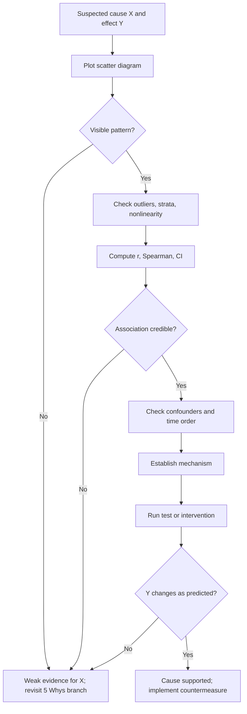

## Scatter Diagrams and Correlation Analysis


### Overview

A **scatter diagram** (scatter plot) is a graph of paired observations $(x_i, y_i)$ that reveals whether two variables move together, and how. **Correlation analysis** quantifies that relationship. In Root Cause Analysis (RCA), these tools test whether a suspected cause (an input, condition, or process variable) is statistically associated with an observed effect (a defect rate, downtime, cycle time). They convert a "Why?" hypothesis in a 5 Whys chain into something that can be checked against data.

**Key Points**

- A scatter diagram is one of the seven basic quality tools and is used to test cause-and-effect hypotheses visually.
- Correlation measures the strength and direction of an association. It does not prove causation.
- Correlation results support or weaken a candidate cause. They do not confirm a root cause without further evidence (mechanism, temporal order, intervention).
- Always plot the data before computing a coefficient. Numbers alone can hide structure, outliers, and nonlinearity.

### Role in RCA and the 5 Whys

The 5 Whys produces a causal chain based on reasoning and observation. Scatter diagrams and correlation analysis strengthen individual links in that chain.

| 5 Whys step | Statistical question | Tool |
| --- | --- | --- |
| "Why did defects increase?" | Does defect rate vary with any process input? | Scatter diagram of defect rate vs. candidate input |
| "Because oven temperature drifted" | Is temperature associated with defects, and how strongly? | Correlation coefficient with confidence interval |
| "Because the thermostat is failing" | Does the association persist after controlling for other factors? | Stratified scatter, partial correlation, regression |
| Countermeasure verification | Did the association disappear after the fix? | Before/after scatter comparison |

**Example (5 Whys link tested with data)**

A packaging line shows seal failures. The team's chain reaches "Why? Because the sealing bar temperature is inconsistent." Before acting, they plot seal-failure percentage (Y) against measured bar temperature (X) across 40 production runs. A visible negative trend for temperatures below 170 °C supports the link and suggests a target operating band.

### Constructing a Scatter Diagram

#### Procedure

1. **Define the hypothesis.** Identify the suspected cause (X, independent/explanatory variable) and the effect (Y, dependent/response variable).
2. **Collect paired data.** Each point must be a simultaneous or logically matched pair. A minimum of about 30 pairs is a common rule of thumb for stable interpretation. [Inference: this is a practical guideline, not a strict threshold.]
3. **Choose axes.** X (cause) on the horizontal axis, Y (effect) on the vertical axis. Label with units.
4. **Scale sensibly.** Use axis ranges that fill the plot area without distorting the relationship.
5. **Plot the points.** Mark overlapping points (jitter, transparency, or a count annotation).
6. **Annotate.** Note data source, period, sample size, and any known special events.
7. **Interpret.** Assess direction, form, strength, and outliers before computing any statistic.

#### Reading the Pattern

| Pattern | Description | RCA implication |
| --- | --- | --- |
| Strong positive | Y rises as X rises, tight cloud | Strong candidate cause; verify mechanism |
| Weak positive | Upward drift, wide scatter | X may contribute alongside other causes |
| Strong negative | Y falls as X rises, tight cloud | Same as above, inverse direction |
| Weak negative | Downward drift, wide scatter | Partial contributor at best |
| No correlation | Random cloud | X is unlikely to be a cause (linear sense) |
| Curvilinear | U-shape, arch, or saturation | Nonlinear cause; Pearson $r$ may mislead |
| Clusters/strata | Distinct groups | Hidden factor (shift, machine, supplier) |

#### Diagram (svg_diagram)

<svg xmlns="http://www.w3.org/2000/svg" viewBox="0 0 760 300" width="760" height="300" font-family="sans-serif" font-size="12">
<text x="380" y="20" text-anchor="middle" font-size="14" font-weight="bold">Common Scatter Patterns (svg_diagram)</text>
<g transform="translate(20,40)">
<rect width="220" height="200" fill="none" stroke="#555" />
<line x1="20" y1="180" x2="200" y2="180" stroke="#555" />
<line x1="20" y1="180" x2="20" y2="20" stroke="#555" />
<circle cx="40" cy="160" r="3" /><circle cx="60" cy="150" r="3" /><circle cx="75" cy="135" r="3" />
<circle cx="95" cy="120" r="3" /><circle cx="110" cy="115" r="3" /><circle cx="130" cy="90" r="3" />
<circle cx="150" cy="80" r="3" /><circle cx="170" cy="55" r="3" /><circle cx="185" cy="45" r="3" />
<text x="110" y="215" text-anchor="middle">Positive correlation</text>
</g>
<g transform="translate(270,40)">
<rect width="220" height="200" fill="none" stroke="#555" />
<line x1="20" y1="180" x2="200" y2="180" stroke="#555" />
<line x1="20" y1="180" x2="20" y2="20" stroke="#555" />
<circle cx="45" cy="60" r="3" /><circle cx="60" cy="140" r="3" /><circle cx="80" cy="90" r="3" />
<circle cx="100" cy="150" r="3" /><circle cx="115" cy="50" r="3" /><circle cx="135" cy="120" r="3" />
<circle cx="155" cy="70" r="3" /><circle cx="170" cy="155" r="3" /><circle cx="185" cy="100" r="3" />
<text x="110" y="215" text-anchor="middle">No correlation</text>
</g>
<g transform="translate(520,40)">
<rect width="220" height="200" fill="none" stroke="#555" />
<line x1="20" y1="180" x2="200" y2="180" stroke="#555" />
<line x1="20" y1="180" x2="20" y2="20" stroke="#555" />
<circle cx="40" cy="150" r="3" /><circle cx="60" cy="100" r="3" /><circle cx="80" cy="65" r="3" />
<circle cx="105" cy="45" r="3" /><circle cx="130" cy="55" r="3" /><circle cx="155" cy="90" r="3" />
<circle cx="175" cy="125" r="3" /><circle cx="190" cy="155" r="3" />
<text x="110" y="215" text-anchor="middle">Curvilinear (r near 0)</text>
</g>
</svg>

### Correlation Coefficients

#### Pearson Product-Moment Correlation ($r$)

Measures the strength and direction of a **linear** relationship between two continuous variables.

$$r = \frac{\sum_{i=1}^{n}(x_i - \bar{x})(y_i - \bar{y})}{\sqrt{\sum_{i=1}^{n}(x_i - \bar{x})^2}\sqrt{\sum_{i=1}^{n}(y_i - \bar{y})^2}}$$

Equivalent form using the sample covariance and standard deviations:

$$r = \frac{s_{xy}}{s_x s_y}, \qquad s_{xy} = \frac{1}{n-1}\sum_{i=1}^{n}(x_i - \bar{x})(y_i - \bar{y})$$

**Properties**

- $-1 \le r \le +1$.
- $r = +1$: perfect positive linear relationship; $r = -1$: perfect negative; $r = 0$: no linear relationship.
- $r$ is unitless and invariant to linear rescaling of X or Y (e.g., °C to °F).
- $r$ is symmetric: $r_{xy} = r_{yx}$.
- $r$ is sensitive to outliers.

**Assumptions**

- Both variables are continuous and approximately linearly related.
- Observations are independent pairs.
- For hypothesis testing and confidence intervals, the pair $(X, Y)$ is approximately bivariate normal. [Inference: moderate departures from normality are often tolerated with large $n$, but behavior varies.]
- No extreme outliers dominating the result.

#### Interpretation Guide

Cutoffs are conventions and depend on the field. Treat them as rough guides. [Inference]

| $|r|$ | Common descriptor |

|---|---|

| 0.00 – 0.19 | Very weak / negligible |

| 0.20 – 0.39 | Weak |

| 0.40 – 0.59 | Moderate |

| 0.60 – 0.79 | Strong |

| 0.80 – 1.00 | Very strong |

#### Coefficient of Determination ($r^2$)

$r^2$ is the proportion of variance in Y that is linearly associated with X (in simple linear regression, the proportion explained by the fitted line).

**Example:** $r = 0.70 \Rightarrow r^2 = 0.49$. About 49% of the variation in Y is associated with X. In RCA terms, the remaining ~51% points to other causes worth investigating.

#### Spearman Rank Correlation ($\rho$ or $r_s$)

Computes Pearson's $r$ on the **ranks** of the data. It measures **monotonic** (consistently increasing or decreasing, not necessarily linear) association.

$$r_s = 1 - \frac{6\sum d_i^2}{n(n^2 - 1)}$$

where $d_i$ is the difference between the ranks of $x_i$ and $y_i$. This shortcut formula is exact only when there are no tied ranks; with ties, compute Pearson's $r$ on the (average) ranks.

**Use when:** data are ordinal, contain outliers, are skewed, or the relationship is monotonic but curved.

#### Kendall's Tau ($\tau$)

Based on concordant and discordant pairs.

$$\tau_a = \frac{C - D}{\binom{n}{2}}$$

where $C$ is the number of concordant pairs and $D$ the number of discordant pairs. Variants ($\tau_b$, $\tau_c$) adjust for ties. Kendall's $\tau$ is often preferred for small samples or many ties. Its magnitude is typically smaller than Spearman's for the same data, so the two are not directly comparable.

#### Choosing a Coefficient

| Situation | Recommended measure |
| --- | --- |
| Continuous, linear, roughly normal, no big outliers | Pearson $r$ |
| Ordinal data, skewed data, outliers, monotonic curve | Spearman $r_s$ |
| Small $n$, many ties | Kendall $\tau$ |
| Binary variable vs. continuous | Point-biserial (Pearson with a 0/1 variable) |
| Two categorical variables | Chi-square / Cramér's V (not covered by $r$) |
| Nonlinear, non-monotonic | Plot first; consider transformation, regression with polynomial terms, or mutual information [Inference: applicability depends on data] |

### Statistical Significance and Confidence Intervals

#### Hypothesis Test for Pearson $r$

- $H_0: \rho = 0$ (population correlation is zero)
- $H_1: \rho \ne 0$ (two-sided)

Test statistic:

$$t = r\sqrt{\frac{n-2}{1-r^2}}, \qquad \text{df} = n - 2$$

Reject $H_0$ when $|t|$ exceeds the critical value at the chosen significance level $\alpha$.

**Example:** $n = 25$, $r = 0.52$.

$$t = 0.52\sqrt{\frac{23}{1-0.2704}} = 0.52\sqrt{31.53} \approx 0.52 \times 5.615 \approx 2.92$$

With $\text{df} = 23$, the two-sided critical value at $\alpha = 0.05$ is about 2.069, so $|t| = 2.92$ exceeds it and the correlation is statistically significant.

#### Confidence Interval via Fisher's z-Transformation

$$z' = \tfrac{1}{2}\ln\!\left(\frac{1+r}{1-r}\right) = \operatorname{arctanh}(r), \qquad SE = \frac{1}{\sqrt{n-3}}$$

Compute $z' \pm z_{\alpha/2}\cdot SE$, then back-transform each bound with $r = \tanh(z')$.

**Example:** $r = 0.52$, $n = 25$: $z' \approx 0.576$, $SE = 1/\sqrt{22} \approx 0.213$. A 95% interval on $z'$ is $0.576 \pm 1.96(0.213) = [0.158,\ 0.994]$. Back-transforming gives $r \in [0.157,\ 0.759]$ approximately.

**Key Points**

- A wide interval, as above, warns that the true strength of the relationship is poorly determined at this sample size.
- **Statistical significance is not practical significance.** With very large $n$, trivially small correlations become "significant." Judge the magnitude of $r$ and the context.
- With many candidate variables tested, some will appear significant by chance (multiple comparisons problem). Adjust or confirm with follow-up data.

### Correlation Is Not Causation

In RCA, this is the central caution. A strong $r$ between X and Y can arise from several structures:

| Structure | Description | Example |
| --- | --- | --- |
| X causes Y | The hypothesis being tested | Higher machine speed causes more scrap |
| Y causes X | Reverse causation | Operators slow the line when scrap rises; speed appears negatively related to scrap |
| Common cause (confounder) | A third variable Z drives both | Ambient humidity affects both adhesive cure time and label misalignment |
| Coincidence | Chance association | Spurious match over a short time window |
| Common trend | Both variables trend over time | Both call volume and defect count rise as the company grows |
| Selection/range effects | Restricted or biased sampling | Only inspecting units that already failed screening |

#### Diagram (Mermaid)



#### Evidence Ladder for Establishing Causality

1. **Association:** correlation exists (this topic).
2. **Temporal precedence:** X changes before Y.
3. **Plausible mechanism:** a physical, chemical, or procedural explanation.
4. **Dose-response:** larger X produces proportionally larger (or smaller) Y.
5. **Confounder control:** stratification, partial correlation, or regression adjustment.
6. **Intervention:** deliberately change X and observe Y (experiment, pilot, or fix-and-verify).

### Pitfalls and Diagnostic Checks

#### Outliers and Influential Points

A single extreme point can create or destroy a correlation.

**Example:** Ten points show no relationship ($r \approx 0.05$). Adding one point far out at high X and high Y raises $r$ to roughly 0.70. Conversely, one aberrant point can suppress an otherwise strong trend. [Inference: exact values depend on the data; the direction of the effect is general.]

**Response:** investigate each outlier. Determine whether it is a recording error, a special-cause event (which may itself be valuable RCA evidence), or a legitimate observation. Report $r$ with and without it when the point is retained for cause-related reasons.

#### Nonlinearity

Pearson $r$ can be near zero for a strong but nonlinear relationship (e.g., a parabola). Always inspect the plot. Consider transforming variables (log, square root), using Spearman for monotonic curves, or fitting a nonlinear model.

#### Stratification (Simpson's Paradox)

Pooling data from different machines, shifts, or suppliers can hide or reverse a relationship visible within each group.

**Example:** Within Machine A and within Machine B, higher pressure is associated with fewer defects (negative slope). Machine B runs at higher pressure but is inherently worse. Pooled data show a positive correlation between pressure and defects. Plotting each stratum in a different marker reveals the truth.

#### Restricted Range

If X is only observed over a narrow band (e.g., operators always keep temperature within ±1 °C), the observed $r$ will understate the true influence of temperature. A weak correlation in a tightly controlled variable does not prove the variable is unimportant.

#### Measurement Error

Noise in X or Y (poor gauge repeatability, transcription errors) attenuates the observed correlation toward zero. [Inference: attenuation is a well-known effect, but its magnitude depends on the error structure.] Verify measurement system capability before dismissing a weak correlation.

#### Autocorrelation in Time-Ordered Data

Sequential process data (hourly readings) are often serially correlated, violating the independence assumption. Significance tests and confidence intervals become overly optimistic. Consider sampling at wider intervals, using time-series methods, or checking residual autocorrelation.

#### Ecological Fallacy

Correlation across group averages (e.g., plant-level averages) does not necessarily hold at the individual-unit level.

### Extending Beyond Two Variables

#### Correlation Matrix and Scatter Plot Matrix

When many candidate causes exist, compute pairwise correlations among all variables and display a **scatter plot matrix** (SPLOM). This screens for both X–Y associations and X–X relationships (multicollinearity).

**Example correlation matrix (illustrative)**

|  | Temp | Pressure | Speed | Defect rate |
| --- | --- | --- | --- | --- |
| Temp | 1.00 | 0.15 | -0.08 | -0.61 |
| Pressure | 0.15 | 1.00 | 0.72 | 0.10 |
| Speed | -0.08 | 0.72 | 1.00 | 0.05 |
| Defect rate | -0.61 | 0.10 | 0.05 | 1.00 |

Interpretation: temperature has the strongest association with defects. Pressure and speed are highly correlated with each other ($r = 0.72$), so their separate effects cannot be untangled from this table alone.

#### Partial Correlation

Measures the association between X and Y after removing the linear effect of a third variable Z.

$$r_{xy\cdot z} = \frac{r_{xy} - r_{xz}\,r_{yz}}{\sqrt{(1-r_{xz}^2)(1-r_{yz}^2)}}$$

**Use in RCA:** test whether an apparent cause remains associated with the effect once a suspected confounder is held constant.

#### Simple Linear Regression Connection

The least-squares line $\hat{y} = b_0 + b_1 x$ has slope

$$b_1 = r\,\frac{s_y}{s_x}, \qquad b_0 = \bar{y} - b_1\bar{x}$$

Correlation quantifies the strength of association; regression quantifies the size of the effect (how many units Y changes per unit X) and enables prediction and target setting.

**Caution:** extrapolating beyond the observed X range is unreliable. Regression and correlation do not demonstrate causation on their own.

### Worked Example

**Scenario:** A call center investigates why average call handling time (AHT) rose. A 5 Whys chain suggests: *Why is AHT up? Because agents spend more time searching the knowledge base. Why? Because the search tool returns slow results.* The team measures average search response time (X, seconds) and AHT (Y, minutes) for 12 agents over one week.

| Agent | X: Search time (s) | Y: AHT (min) |
| --- | --- | --- |
| 1 | 2.1 | 6.2 |
| 2 | 2.8 | 6.9 |
| 3 | 3.0 | 7.1 |
| 4 | 3.5 | 7.4 |
| 5 | 3.9 | 7.9 |
| 6 | 4.2 | 8.1 |
| 7 | 4.6 | 8.6 |
| 8 | 5.0 | 8.8 |
| 9 | 5.4 | 9.4 |
| 10 | 5.9 | 9.6 |
| 11 | 6.3 | 10.2 |
| 12 | 6.8 | 10.5 |

**Step 1: Summary statistics**

$\bar{x} = 4.30$ s and $\bar{y} = 8.39$ min (approximately, from the sums $\sum x = 51.5$ and $\sum y = 100.7$).

**Step 2: Plot.** The scatter diagram shows a tight upward linear cloud, no obvious outliers, and no clusters.

**Step 3: Compute.** Carrying out the sums of squares and cross-products gives $r \approx 0.998$. [Inference: computed by hand from the table above; verify with software.] $r^2 \approx 0.996$.

**Step 4: Test.** With $n = 12$ and $r$ this high, the $t$-statistic is very large ($\text{df} = 10$) and the correlation is significant at any conventional level.

**Step 5: Interpret critically.**

- The relationship is strong and linear, consistent with the 5 Whys link.
- Only 12 agents from one week were measured. The near-perfect $r$ is unusually high for real operational data, so check for data-preparation artifacts (averaging, shared calls, a common time window).
- Confounders to check: call complexity, agent tenure, time of day. All could affect both search time and AHT.
- The slope is $b_1 \approx 0.95$ min per second of search time (approximate, from the data). [Inference: the fitted slope should be confirmed with software.] This is a candidate lever, but the causal claim requires a follow-up: for example, improve search performance for a subset of agents and observe AHT.

**Conclusion:** The data strongly support the "slow search" link, but the root cause is confirmed only after an intervention shows AHT falling when search time is reduced.

### Software Implementation

#### Python

```python
import numpy as np
import pandas as pd
import matplotlib.pyplot as plt
from scipy import stats

x = np.array([2.1, 2.8, 3.0, 3.5, 3.9, 4.2, 4.6, 5.0, 5.4, 5.9, 6.3, 6.8])
y = np.array([6.2, 6.9, 7.1, 7.4, 7.9, 8.1, 8.6, 8.8, 9.4, 9.6, 10.2, 10.5])

# Scatter diagram with least-squares line
slope, intercept, r, p, se = stats.linregress(x, y)
plt.scatter(x, y)
xs = np.linspace(x.min(), x.max(), 100)
plt.plot(xs, intercept + slope * xs)
plt.xlabel("Search response time (s)")
plt.ylabel("Average handling time (min)")
plt.title(f"AHT vs. search time (r = {r:.3f})")
plt.show()

# Coefficients
pearson_r, pearson_p = stats.pearsonr(x, y)
spearman_r, spearman_p = stats.spearmanr(x, y)
kendall_t, kendall_p = stats.kendalltau(x, y)
print(f"Pearson  r = {pearson_r:.3f}, p = {pearson_p:.4g}")
print(f"Spearman r = {spearman_r:.3f}, p = {spearman_p:.4g}")
print(f"Kendall  t = {kendall_t:.3f}, p = {kendall_p:.4g}")

# 95% CI for Pearson r via Fisher z
n = len(x)
z = np.arctanh(pearson_r)
se_z = 1 / np.sqrt(n - 3)
lo, hi = np.tanh([z - 1.96 * se_z, z + 1.96 * se_z])
print(f"95% CI: [{lo:.3f}, {hi:.3f}]")

# Correlation matrix and scatter plot matrix for many variables
df = pd.DataFrame({"search": x, "aht": y})
print(df.corr(method="pearson"))
pd.plotting.scatter_matrix(df, figsize=(6, 6))
plt.show()
```

**Output (approximate; values depend on the exact data and library version)**



```
Pearson  r = 0.998, p = <very small>
Spearman r = 1.000, p = <very small>
Kendall  t = 1.000, p = <very small>
95% CI: [0.992, 0.999]
```

`scipy.stats.pearsonr` in recent versions also exposes a `confidence_interval()` method on its result object. [Unverified: availability depends on the installed SciPy version.]

#### Excel

| Task | Function / Feature |
| --- | --- |
| Scatter diagram | Insert → Charts → Scatter (X, Y) |
| Trendline with $r^2$ | Right-click series → Add Trendline → Display R-squared |
| Pearson $r$ | `=CORREL(x_range, y_range)` or `=PEARSON(x_range, y_range)` |
| $r^2$ | `=RSQ(y_range, x_range)` |
| Slope / intercept | `=SLOPE(y_range, x_range)`, `=INTERCEPT(y_range, x_range)` |
| Correlation matrix | Data → Data Analysis → Correlation (requires Analysis ToolPak) |
| Spearman | Rank each column with `RANK.AVG`, then apply `CORREL` to the ranks |

#### R

```r
x <- c(2.1, 2.8, 3.0, 3.5, 3.9, 4.2, 4.6, 5.0, 5.4, 5.9, 6.3, 6.8)
y <- c(6.2, 6.9, 7.1, 7.4, 7.9, 8.1, 8.6, 8.8, 9.4, 9.6, 10.2, 10.5)

plot(x, y, xlab = "Search time (s)", ylab = "AHT (min)")
abline(lm(y ~ x))

cor.test(x, y, method = "pearson")   # r, t, df, p, 95% CI
cor.test(x, y, method = "spearman")
cor.test(x, y, method = "kendall")
```

### Practical RCA Workflow

1. **Generate hypotheses** from the 5 Whys or a fishbone (Ishikawa) diagram.
2. **Select variables** that are measurable, with adequate measurement system quality.
3. **Collect data** in a way that captures natural variation in X and records context (shift, machine, batch, date).
4. **Plot first** and stratify by suspected grouping factors.
5. **Compute** the appropriate coefficient with a confidence interval.
6. **Screen multiple candidates** with a scatter plot matrix, prioritizing by strength and plausibility, not by $r$ alone.
7. **Challenge the result:** confounders, reverse causation, outliers, time trends, measurement error.
8. **Confirm** with a designed test, pilot, or fix-and-verify step.
9. **Document** the evidence (plot, coefficient, CI, sample, period, checks performed) alongside the 5 Whys chain.
10. **Monitor** after the countermeasure: the association should weaken or vanish if the cause was real and removed.

### Reporting Template

| Element | Content |
| --- | --- |
| Hypothesis | X (cause) → Y (effect) |
| Data | Source, period, $n$, unit of observation |
| Plot | Scatter diagram with stratification markers |
| Statistic | $r$ (or $r_s$, $\tau$), 95% CI, $p$-value |
| Checks | Outliers, nonlinearity, strata, autocorrelation, measurement error |
| Interpretation | Direction, strength, practical meaning ($r^2$, slope) |
| Limitations | Confounders not controlled, sample size, observational design |
| Decision | Supports / weakens / inconclusive; next verification step |

### Common Mistakes

- Computing $r$ without looking at the plot.
- Treating a significant $p$-value as proof of a strong or causal relationship.
- Dismissing a variable because $r$ is near zero when the relationship is nonlinear or the range is restricted.
- Pooling heterogeneous groups without stratifying.
- Reporting $r$ without sample size or confidence interval.
- Screening dozens of variables and reporting only the "significant" ones.
- Using correlation across time-ordered data without checking for common trends or autocorrelation.
- Stopping at correlation and closing the RCA without a verification step.

### Conclusion

Scatter diagrams give an immediate visual test of a suspected cause-and-effect link, and correlation coefficients put a number on its strength and direction. Used together they let an RCA team rank candidate causes, expose hidden factors, and decide which 5 Whys branches deserve verification. Their limits are just as important: they show association, not causation, and they must be paired with mechanism, time order, confounder control, and ideally an intervention before a cause is declared a root cause.

**Related Topics**

- Regression analysis and residual diagnostics
- Design of Experiments (DOE) for causal verification
- Pareto analysis and stratification
- Fishbone (Ishikawa) diagrams as hypothesis generators
- Control charts and special-cause detection
- Measurement System Analysis (Gauge R&R)
- Multiple regression and multicollinearity (VIF)
- Time-series analysis, lagged correlation, and Granger-type reasoning
- Hypothesis testing and multiple-comparison corrections
- Causal inference frameworks (DAGs, counterfactuals)