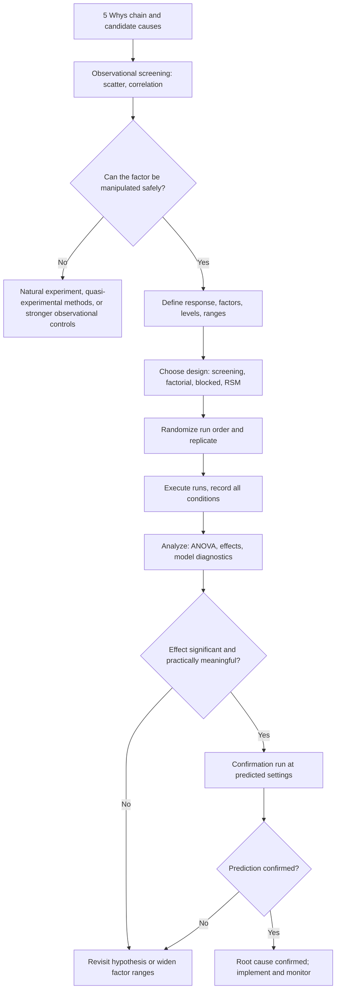

## Design of Experiments for Causal Confirmation


### Overview

**Design of Experiments (DOE)** is the discipline of planning deliberate, structured changes to process inputs (factors) and observing the resulting changes in outputs (responses), so that cause-and-effect relationships can be established with quantified confidence. In Root Cause Analysis (RCA), DOE is the step that moves a candidate cause from "associated with the effect" to "confirmed as producing the effect."

The 5 Whys and observational tools (scatter diagrams, correlation, stratification) generate and prioritize hypotheses. They cannot fully rule out confounding, because the analyst did not control which units received which condition. DOE closes that gap: the experimenter sets the levels of X, and randomization breaks links between X and every other variable, so that any systematic difference in Y can be attributed to X.

**Key Points**

- Observational data can show that X and Y move together. A designed experiment shows what happens to Y when X is deliberately changed.
- Three principles underpin valid causal inference in DOE: **randomization**, **replication**, and **blocking** (Fisher's principles).
- DOE is efficient: factorial designs estimate the effects of several factors and their interactions from far fewer runs than one-factor-at-a-time (OFAT) testing.
- A confirmed causal effect within the tested region does not automatically generalize outside it. External validity must be argued separately.

### Where DOE Fits in the RCA Flow

| RCA stage | Question | Typical tool |
| --- | --- | --- |
| Problem definition | What is failing, where, how much? | Data collection, Pareto |
| Hypothesis generation | What could cause it? | 5 Whys, fishbone diagram |
| Screening with existing data | Which candidates are associated with the effect? | Scatter diagrams, correlation, stratification |
| **Causal confirmation** | **Does changing X actually change Y?** | **DOE, pilot/fix-and-verify, A/B test** |
| Countermeasure | How do we remove the cause? | Corrective action |
| Verification | Did the effect go away and stay away? | Control charts, follow-up study |

#### Diagram (Mermaid)



### Core Concepts and Terminology

| Term | Definition |
| --- | --- |
| **Response (Y)** | The measured outcome (defect rate, cycle time, strength) |
| **Factor (X)** | A controlled input varied on purpose (temperature, supplier, procedure) |
| **Level** | A specific setting of a factor (e.g., 170 °C and 190 °C) |
| **Treatment** | A specific combination of factor levels |
| **Run / experimental unit** | One execution of a treatment on one unit of material, time, or subject |
| **Replication** | Independent repeats of the same treatment; estimates pure error |
| **Randomization** | Assigning run order or units to treatments by chance |
| **Blocking** | Grouping runs into homogeneous sets (day, batch, operator) to remove known nuisance variation |
| **Main effect** | Average change in Y when a factor moves from its low to high level |
| **Interaction** | The effect of one factor depends on the level of another |
| **Confounding / aliasing** | Two or more effects that cannot be separated by the design |
| **Resolution** | A measure of which effects are aliased in a fractional design |
| **Center point** | A run at midpoint levels of all continuous factors; detects curvature |
| **Nuisance factor** | A variable that affects Y but is not of interest; handled by blocking, randomization, or holding constant |

### Fisher's Three Principles

#### Randomization

Randomly assigning treatments to runs (or randomizing run order) ensures that unknown and unmeasured factors are, on average, balanced across treatment groups. This is what licenses a causal interpretation: any systematic difference in Y can be attributed to the treatment rather than to a lurking variable.

**Example:** Testing two lubricants across a day. Running all Lubricant A trials in the morning and all Lubricant B trials in the afternoon confounds lubricant with time of day (temperature, operator fatigue, warm-up). Randomizing the order breaks that link.

**Restrictions:** Some factors are hard to change (e.g., furnace temperature). Complete randomization may be impractical, and the design becomes a **split-plot** design, which needs a different error structure in the analysis.

#### Replication

Replication means repeating treatments independently, so that the experimental error (background noise) can be estimated. Without it, there is no basis for judging whether a difference is larger than noise.

**Distinguish replication from repeated measurement.** Measuring the same part five times is repeated measurement (it estimates gauge noise). Making five separate parts under the same settings is replication (it estimates process-plus-measurement variation). Treating repeated measurements as replicates is called **pseudoreplication** and inflates apparent significance.

#### Blocking

When a known nuisance source (batch, day, machine, operator) is unavoidable, group runs within blocks and include the block in the analysis. Comparisons are then made within homogeneous blocks, removing block-to-block variation from the error term.

> "Block what you can; randomize what you cannot." (Widely attributed guidance from the DOE literature.)

### Why Not One-Factor-at-a-Time (OFAT)?

OFAT varies one factor while holding all others fixed, then moves to the next factor.

| Aspect | OFAT | Factorial DOE |
| --- | --- | --- |
| Interactions | Cannot be detected | Estimated directly |
| Efficiency | Uses many runs per unit of information | Every run contributes to every main-effect estimate |
| Precision | Each effect estimated from a subset of runs | Each effect estimated from all runs (hidden replication) |
| Risk of missing the optimum | High when interactions exist | Lower |
| Causal inference | Vulnerable to drift over the long experiment | Strengthened by randomization |

**Example:** A 2-factor experiment with 2 levels each. OFAT with 3 runs at baseline plus 1 change each uses roughly 6 runs to get two effect estimates, each based on 2 observations. A $2^2$ factorial with 4 runs gives both main effects, each estimated using all 4 observations, plus the interaction.

### Design Families

#### Comparative (Two-Sample) Experiments

The simplest causal test: two conditions (control vs. treatment), randomly assigned.

- **Analysis:** two-sample $t$-test (or Welch's), or a nonparametric equivalent (Mann–Whitney).
- **Paired designs** (each unit receives both conditions, order randomized) reduce noise from unit-to-unit variability. Analyze with a paired $t$-test.
- **Use in RCA:** confirm that a single suspected cause (a supplier, a procedure step) changes the outcome.

#### One-Factor, Multi-Level Designs (Completely Randomized)

Compare $a$ levels of one factor (e.g., four suppliers).

Model:

$$y_{ij} = \mu + \tau_i + \varepsilon_{ij}, \qquad \varepsilon_{ij} \sim N(0, \sigma^2)$$

where $\tau_i$ is the effect of level $i$. One-way ANOVA tests $H_0: \tau_1 = \cdots = \tau_a = 0$. Follow-up comparisons use Tukey HSD or Dunnett (against a control), which control the family-wise error rate.

#### Randomized Complete Block Design (RCBD)

Every treatment appears once in each block.

$$y_{ij} = \mu + \tau_i + \beta_j + \varepsilon_{ij}$$

where $\beta_j$ is the block effect. Block is treated as a nuisance factor in the ANOVA. Latin square designs extend this to two blocking factors.

#### Full Factorial Designs ($2^k$)

All combinations of $k$ factors at two levels each, coded $-1$ (low) and $+1$ (high). Requires $2^k$ runs per replicate.

| Run | A | B | C | Response |
| --- | --- | --- | --- | --- |
| 1 | -1 | -1 | -1 | $y_1$ |
| 2 | +1 | -1 | -1 | $y_2$ |
| 3 | -1 | +1 | -1 | $y_3$ |
| 4 | +1 | +1 | -1 | $y_4$ |
| 5 | -1 | -1 | +1 | $y_5$ |
| 6 | +1 | -1 | +1 | $y_6$ |
| 7 | -1 | +1 | +1 | $y_7$ |
| 8 | +1 | +1 | +1 | $y_8$ |

(Standard order shown; actual execution order must be randomized.)

**Effect estimates.** The main effect of factor A is the difference between the mean response at A high and the mean response at A low:

$$\text{Effect}_A = \bar{y}_{A+} - \bar{y}_{A-}$$

The AB interaction effect is half the difference between the A effect at B high and the A effect at B low:

$$\text{Effect}_{AB} = \tfrac{1}{2}\left[(\bar{y}_{A+B+} - \bar{y}_{A-B+}) - (\bar{y}_{A+B-} - \bar{y}_{A-B-})\right]$$

Regression coefficients in the coded model are half the effect estimates: $\hat{\beta}_A = \text{Effect}_A / 2$.

**Regression model for a $2^2$ design:**

$$y = \beta_0 + \beta_A x_A + \beta_B x_B + \beta_{AB} x_A x_B + \varepsilon$$

#### Fractional Factorial Designs ($2^{k-p}$)

When $k$ is large, a fraction of the full design is run, at the cost of **aliasing** (some effects become inseparable).

| Resolution | Meaning | Typical use |
| --- | --- | --- |
| III | Main effects aliased with two-factor interactions | Early screening; assumes interactions are negligible |
| IV | Main effects clear of two-factor interactions; two-factor interactions aliased with each other | Screening with some protection |
| V | Main effects and two-factor interactions clear of each other | Confirmation and modeling |

**Example:** A $2^{5-1}$ design (Resolution V) tests 5 factors in 16 runs instead of 32, while keeping main effects and two-factor interactions estimable, assuming three-factor and higher interactions are negligible. [Inference: the negligible-higher-order-interaction assumption is a common sparsity-of-effects assumption and may not hold for a given process.]

**Fold-over.** If a fractional design leaves an important effect ambiguous, running a complementary fraction (fold-over) can de-alias it and works as a sequential confirmation step.

#### Plackett–Burman and Definitive Screening Designs

Highly economical Resolution III-type designs for screening many factors with few runs. Definitive Screening Designs (DSD) additionally allow estimation of curvature for continuous factors and keep main effects unaliased with two-factor interactions. [Inference: exact properties depend on the number of factors and the construction used; verify in software output.]

#### Response Surface Methodology (RSM)

Used after key factors are identified, to model curvature and locate optimal settings.

$$y = \beta_0 + \sum_i \beta_i x_i + \sum_i \beta_{ii} x_i^2 + \sum_{i<j} \beta_{ij} x_i x_j + \varepsilon$$

Common designs: Central Composite Design (CCD) and Box–Behnken. RSM is generally an optimization step rather than a root-cause confirmation step, but it is useful when the causal relationship is nonlinear.

#### Split-Plot and Nested Designs

- **Split-plot:** hard-to-change factors are applied to whole plots, easy-to-change factors to subplots. Two error terms are needed (whole-plot and subplot).
- **Nested (hierarchical):** levels of one factor exist only within levels of another (e.g., operators within shifts). Common in variance-component studies.

### Designing a Causal-Confirmation Experiment

#### Step-by-Step Procedure

1. **State the causal hypothesis precisely.** Example: "Increasing sealing-bar temperature from 160 °C to 180 °C reduces seal-failure rate."
2. **Define the response** and how it will be measured. Confirm the measurement system is capable (Gauge R&R) before experimenting.
3. **Select factors and levels.** Include the suspected cause and key alternatives or confounders as additional factors, if feasible. Choose levels wide enough to produce a detectable effect but within safe operating limits.
4. **Set the required effect size and power.** Decide the smallest change $\delta$ that matters practically, the acceptable noise level $\sigma$, significance level $\alpha$ (commonly 0.05), and desired power $1-\beta$ (commonly 0.80–0.90).
5. **Choose the design** (see the selection table below).
6. **Determine replication** using a power calculation.
7. **Randomize and block.** Generate a randomized run order and assign blocks for known nuisance sources.
8. **Plan controls.** Hold constant what can be held constant; record what cannot (ambient conditions, material lot).
9. **Write the protocol** including run sheet, stopping rules, safety limits, and data-recording form.
10. **Execute** exactly as planned. Log deviations.
11. **Analyze** (ANOVA, effect plots, model diagnostics).
12. **Confirm** at predicted settings with independent confirmation runs.
13. **Report and implement**, then monitor with control charts.

#### Design Selection Guide

| Situation | Suggested design |
| --- | --- |
| One suspected cause, two conditions | Randomized two-sample or paired comparison |
| One factor, 3+ levels | One-way ANOVA (completely randomized), or RCBD if a nuisance source exists |
| 2–4 factors, interactions plausible | Full factorial $2^k$ |
| 5+ factors, screening | Fractional factorial, Plackett–Burman, or DSD |
| Known nuisance variable (batch, day) | Blocked design |
| Hard-to-change factor | Split-plot |
| Curvature suspected | Add center points; consider RSM |
| Factor cannot be randomized | Quasi-experimental or observational causal methods (see below) |

### Sample Size and Power

Power is the probability of detecting a true effect of a specified size. For a two-sample comparison of means with equal group size $n$ per group and common standard deviation $\sigma$, an approximate required sample size is:

$$n \approx \frac{2\,\sigma^2\,(z_{1-\alpha/2} + z_{1-\beta})^2}{\delta^2}$$

**Example:** $\sigma = 4$, $\delta = 3$, $\alpha = 0.05$ (two-sided, $z = 1.96$), power $= 0.80$ ($z = 0.84$).

$$n \approx \frac{2(16)(1.96 + 0.84)^2}{9} = \frac{32 \times 7.84}{9} \approx 27.9$$

About 28 runs per group. [Inference: this normal-approximation formula slightly understates the requirement for small samples; using the $t$-distribution in statistical software gives a marginally larger $n$.]

**Key Points**

- Underpowered experiments frequently yield "no significant effect," which is not evidence that the factor is harmless.
- Power increases with larger $\delta$, smaller $\sigma$, larger $n$, and higher $\alpha$.
- Reduce $\sigma$ through blocking, better measurement, and tighter control of nuisance variables.

### Analysis of Experimental Data

#### ANOVA for a Factorial Experiment

The total variation is partitioned:

$$SS_{Total} = SS_{Factors} + SS_{Interactions} + SS_{Error}$$

The $F$-statistic for each term compares its mean square to the error mean square:

$$F = \frac{MS_{term}}{MS_{Error}}$$

A small $p$-value indicates that the term explains more variation than expected from noise alone.

#### Reading Effect Plots

| Plot | What it shows |
| --- | --- |
| Main effects plot | Mean response at each level of each factor; steeper slope means larger effect |
| Interaction plot | Mean response by level of one factor, with separate lines for levels of another; non-parallel lines indicate interaction |
| Pareto chart of effects | Standardized effects ranked by magnitude versus a significance threshold |
| Normal (or half-normal) probability plot of effects | Active effects deviate from the straight line formed by inert effects; useful for unreplicated designs |
| Residual plots | Diagnose model adequacy |

#### Interpreting Interactions

When an interaction is significant, main effects cannot be interpreted in isolation.

**Example:** Temperature has a strong benefit at high pressure but no effect at low pressure. Reporting only the average temperature effect would understate its importance at high pressure and overstate it at low pressure. The correct RCA conclusion is conditional: "the cause operates when pressure is high."

#### Model Diagnostics

Verify the assumptions behind ANOVA and regression:

| Assumption | Check | Remedy if violated |
| --- | --- | --- |
| Independence | Residuals vs. run order | Better randomization; time-series methods |
| Constant variance | Residuals vs. fitted values | Transform Y (log, square root, Box–Cox); weighted analysis |
| Normality of errors | Normal probability plot of residuals | Transformation; generalized linear models (e.g., binomial or Poisson responses) |
| Model adequacy | Lack-of-fit test; center-point curvature test | Add terms; augment with axial points (RSM) |
| No influential points | Cook's distance, leverage | Investigate; do not delete without a documented reason |

**Attribute responses** (defect counts, pass/fail) often violate normal-error assumptions. Use logistic regression (binary outcomes) or Poisson/negative binomial regression (counts), or ensure large enough counts for approximate normality. [Inference: the appropriate model depends on the data-generating process.]

#### Multiple Comparisons

Testing many effects inflates the false-positive rate. Use Tukey, Dunnett, Bonferroni, or Holm adjustments for pairwise comparisons, and treat borderline effects in screening experiments as hypotheses for confirmation runs.

### Statistical vs. Practical Significance

A statistically significant effect may be too small to matter economically or operationally. Report:

- Effect size with confidence interval (not just $p$).
- Percentage of variation explained ($R^2$, adjusted $R^2$, predicted $R^2$).
- Cost-benefit of implementing the change.

### Confirmation Runs

The final and often skipped step. After the model predicts an outcome at specific settings, run new, independent experiments at those settings and compare with the prediction interval.

**Example:** The model predicts a seal-failure rate of $2.1\%$ with a 95% prediction interval of $[0.8\%,\ 3.9\%]$ at 180 °C and 2.5 bar. Three confirmation runs give $1.6\%$, $2.4\%$, and $1.9\%$, all within the interval. The causal model is supported. If the results fall outside the interval, the model is incomplete: an important factor, an interaction, or a nonlinearity is missing.

**Key Points**

- Confirmation runs test the model's predictive validity, not only its fit to existing data.
- The strongest causal confirmation is a **reversal test**: remove the suspected cause and see the problem disappear; reintroduce it and see the problem return.

### Worked Example

**Scenario.** A bottling line has intermittent under-filled bottles. A 5 Whys chain proposes: *Why under-filled? Because the fill volume varies. Why? Because line pressure fluctuates. Why? Because the pump speed setting differs between shifts.* Observational data show correlation between pump speed and fill variation, but shift, operator, and product batch also differ. The team designs a $2^2$ factorial with replication and blocking to confirm.

**Design**

- Factor A: Pump speed (Low = 60%, High = 80%)
- Factor B: Nozzle type (Standard, New)
- Response: Standard deviation of fill volume (mL) across 30 bottles per run
- Replicates: 3, each replicate run in a separate block (day)
- Order within each block: randomized

**Run table (illustrative data)**

| Block | A | B | Response (mL) |
| --- | --- | --- | --- |
| 1 | -1 | -1 | 2.9 |
| 1 | +1 | -1 | 1.6 |
| 1 | -1 | +1 | 2.7 |
| 1 | +1 | +1 | 1.5 |
| 2 | -1 | -1 | 3.1 |
| 2 | +1 | -1 | 1.8 |
| 2 | -1 | +1 | 2.6 |
| 2 | +1 | +1 | 1.4 |
| 3 | -1 | -1 | 3.0 |
| 3 | +1 | -1 | 1.7 |
| 3 | -1 | +1 | 2.8 |
| 3 | +1 | +1 | 1.6 |

**Cell means**

|  | B = -1 | B = +1 |
| --- | --- | --- |
| A = -1 | 3.00 | 2.70 |
| A = +1 | 1.70 | 1.50 |

**Effect estimates**

$$\text{Effect}_A = \frac{1.70 + 1.50}{2} - \frac{3.00 + 2.70}{2} = 1.60 - 2.85 = -1.25 \text{ mL}$$


$$\text{Effect}_B = \frac{2.70 + 1.50}{2} - \frac{3.00 + 1.70}{2} = 2.10 - 2.35 = -0.25 \text{ mL}$$


$$\text{Effect}_{AB} = \tfrac{1}{2}\left[(1.50 - 2.70) - (1.70 - 3.00)\right] = \tfrac{1}{2}(-1.20 + 1.30) = +0.05 \text{ mL}$$

**Interpretation**

- Raising pump speed from 60% to 80% reduces fill variation by about 1.25 mL on average, a large effect relative to the replicate noise (replicates within a cell differ by about 0.1–0.3 mL).
- The new nozzle gives a smaller improvement (about 0.25 mL).
- The interaction is negligible (0.05 mL), so the effects are approximately additive.
- With replicates and a blocked design, a formal ANOVA would test each term against the error mean square. [Inference: with noise this small, pump speed would be expected to be highly significant, but the exact $F$ and $p$ values require the full ANOVA calculation.]

**Confirmation.** Run the line at 80% pump speed for two further days, randomly alternating standard and new nozzles across sub-periods. Fill-variation standard deviation stays near 1.5–1.7 mL, matching prediction.

**Conclusion.** Pump speed setting is confirmed as a cause of fill variation. The RCA action is to standardize and lock the pump speed setting across shifts, then verify with a control chart on fill volume.

### Software Implementation

#### Python (statsmodels)

```python
import pandas as pd
import statsmodels.api as sm
import statsmodels.formula.api as smf
from statsmodels.stats.anova import anova_lm

df = pd.DataFrame({
    "block": [1,1,1,1, 2,2,2,2, 3,3,3,3],
    "A":     [-1,1,-1,1, -1,1,-1,1, -1,1,-1,1],
    "B":     [-1,-1,1,1, -1,-1,1,1, -1,-1,1,1],
    "y":     [2.9,1.6,2.7,1.5, 3.1,1.8,2.6,1.4, 3.0,1.7,2.8,1.6],
})

# Blocked 2^2 factorial model
model = smf.ols("y ~ C(block) + A * B", data=df).fit()
print(anova_lm(model, typ=2))
print(model.summary())

# Effects are twice the coded coefficients
print("Effect A :", 2 * model.params["A"])
print("Effect B :", 2 * model.params["B"])
print("Effect AB:", 2 * model.params["A:B"])

# Residual diagnostics
sm.qqplot(model.resid, line="s")
```

Generating a randomized run order:

```python
import numpy as np
rng = np.random.default_rng(seed=42)  # record the seed for reproducibility
runs = df.sample(frac=1, random_state=42).reset_index(drop=True)
```

Power calculation for a two-sample comparison:

```python
from statsmodels.stats.power import TTestIndPower
n = TTestIndPower().solve_power(effect_size=3/4, alpha=0.05, power=0.80)
print(round(n))  # per-group sample size; effect_size = delta / sigma
```

Dedicated DOE libraries such as `pyDOE2` (design generation) exist for creating factorial and response-surface matrices. [Unverified: package maintenance status and API details vary by version; consult current documentation.]

#### R

```r
fit <- aov(y ~ factor(block) + A * B, data = df)
summary(fit)
TukeyHSD(fit, "factor(block)")
plot(fit)  # residual diagnostics

# Generate designs
# library(FrF2)
# FrF2(nruns = 16, nfactors = 5, randomize = TRUE)
```

#### Commercial Tools

Minitab (Stat → DOE), JMP (DOE platform, Custom Designer), and Design-Expert provide design generation, randomization, aliasing tables, effect plots, and optimization. Exact menu names differ between versions.

### When Experiments Are Not Possible

Some root causes cannot be manipulated (rare failures, safety-critical processes, historical events, patient harm, or things outside the organization's control). Alternatives that strengthen causal evidence:

| Approach | Description | Caveat |
| --- | --- | --- |
| **Natural experiment** | Exploit a change that happened for reasons unrelated to the outcome (policy change, supplier switch) | Assignment may not be truly random |
| **Before/after with control group** | Compare change in a treated group to change in an untreated group (difference-in-differences) | Requires parallel-trends assumption |
| **Interrupted time series** | Model trend before and after an intervention | Sensitive to concurrent events |
| **Matched or stratified comparison** | Compare units similar on measured confounders | Unmeasured confounders remain |
| **Regression adjustment / propensity methods** | Statistically adjust for confounders | Only measured confounders adjusted |
| **Instrumental variables** | Use a variable that affects X but not Y directly | Valid instruments are hard to find |
| **Bench, simulation, or lab replication** | Reproduce the mechanism under controlled conditions | May not represent the real process |
| **Failure reproduction / reversal test** | Reintroduce and remove the suspected cause | Only feasible if safe |

[Inference: these methods provide weaker causal evidence than randomization. Their validity rests on untestable assumptions, and their applicability depends on the setting.]

### Threats to Validity

| Threat | Description | Mitigation |
| --- | --- | --- |
| **Confounding** | A lurking variable changes with the treatment | Randomize; block; record covariates |
| **Drift over time** | Equipment wear, temperature, or material aging trends during the study | Randomize run order; include center points across the run sequence |
| **Hawthorne effect** | People perform differently when observed | Blind where possible; standardize observation |
| **Carryover** | Earlier treatment influences later runs | Washout periods; randomize order |
| **Measurement error** | Poor gauge repeatability/reproducibility | Run Gauge R&R first; use the same instruments |
| **Pseudoreplication** | Treating repeated measures as independent replicates | Define the experimental unit carefully |
| **Interference** | One unit's treatment affects another's outcome | Separate units; account for clustering |
| **Narrow inference space** | Effects hold only within the tested ranges and conditions | State the range; extend with follow-up studies |
| **Hard-to-change factors** | Full randomization impractical | Split-plot design and analysis |
| **Ethical and safety limits** | Levels that risk harm cannot be tested | Use safe levels, simulations, or historical evidence |

### Practical Guidance and Common Mistakes

- **Skipping the measurement system check.** Noisy measurement can hide real effects.
- **Choosing factor levels too close together.** The effect is lost in noise. Choose levels wide enough to matter but within safe limits.
- **Ignoring interactions** and reporting only main effects.
- **Not randomizing** because it is inconvenient, then attributing time trends to factors.
- **Too few replicates** and concluding "no effect" from a null result.
- **Deleting outliers without cause.** Investigate them as potential special-cause evidence.
- **Confusing statistical fit with causal proof.** A good model fit on the experimental data does not replace confirmation runs.
- **Failing to document deviations** from the protocol.
- **Stopping at a significant $p$-value** without checking effect size and practical relevance.
- **Skipping post-implementation monitoring.** The root cause may be confirmed, but the fix still needs verification in normal operation.

### Reporting Template

| Element | Content |
| --- | --- |
| Causal hypothesis | Precise statement linked to the 5 Whys link tested |
| Response and measurement | Definition, units, gauge capability |
| Factors and levels | With rationale and safety limits |
| Design | Type, runs, replicates, blocks, randomization method and seed |
| Power analysis | Target effect size, assumed $\sigma$, $\alpha$, power |
| Execution notes | Deviations, anomalies, environmental conditions |
| Results | ANOVA table, effect estimates with confidence intervals, plots |
| Diagnostics | Residual checks, lack of fit, influential points |
| Confirmation runs | Predicted vs. observed, prediction interval |
| Conclusion | Cause confirmed / rejected / inconclusive, with scope of inference |
| Action | Countermeasure, owner, verification plan |

### Conclusion

Design of experiments is the bridge between a plausible cause and a proven one. By deliberately manipulating factors under randomization, replication, and blocking, DOE isolates the effect of a suspected cause from confounders that observational data cannot untangle. Factorial and fractional-factorial designs deliver this with efficiency and reveal interactions that one-factor-at-a-time testing misses. A complete causal-confirmation effort ends with independent confirmation runs and post-implementation monitoring, so that an RCA conclusion rests on evidence that the effect can be switched on and off by changing the cause, not merely on an observed association.

**Related Topics**

- Analysis of Variance (ANOVA) and post-hoc comparison procedures
- Response Surface Methodology and process optimization
- Measurement System Analysis (Gauge R&R)
- Statistical power analysis and sample size determination
- Split-plot and mixed-effects models
- Logistic and Poisson regression for attribute responses
- Causal inference frameworks (DAGs, potential outcomes, difference-in-differences)
- A/B testing and online controlled experiments
- Control charts and statistical process control for post-fix verification
- Taguchi methods and robust parameter design
- Sequential experimentation and Bayesian optimization