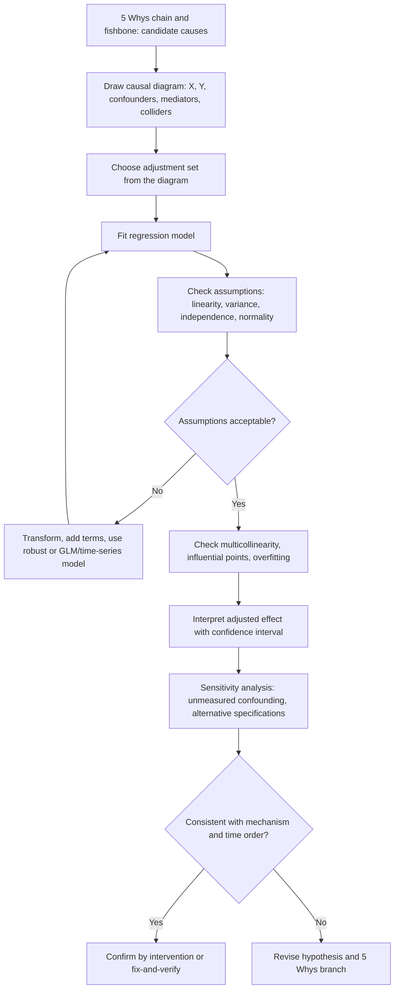

## Regression Analysis in Causal Investigation


### Overview

**Regression analysis** models the relationship between a response variable $Y$ and one or more explanatory variables $X_1, \dots, X_k$. In Root Cause Analysis (RCA), regression serves three linked purposes:

1. **Quantify** how much the effect changes per unit change in a suspected cause (effect size, not just association).
2. **Adjust** for confounders, so the estimated influence of a suspected cause is isolated from other measured factors.
3. **Rank and screen** multiple candidate causes from a 5 Whys tree or fishbone diagram against real data.

Regression sits between correlation analysis (which measures association strength) and designed experiments (which manipulate causes directly). It is the standard workhorse for causal investigation when experiments are impractical, and it is also the analysis engine for most designed experiments.

**Key Points**

- Regression estimates conditional associations. A regression coefficient has a **causal** interpretation only under additional assumptions (no unmeasured confounding, correct model form, correct time order, no bad controls).
- A high $R^2$ measures predictive fit, not causal validity.
- The choice of which variables to include should be driven by causal reasoning (a causal diagram or the 5 Whys chain), not by maximizing fit or by purely automated selection.
- Regression results in RCA are evidence to be triangulated with mechanism, time order, and intervention (fix-and-verify).

### Regression in the RCA Flow

| RCA stage | Question | Regression role |
| --- | --- | --- |
| Hypothesis screening | Which candidate causes matter most? | Multiple regression with standardized coefficients; regularized or stepwise screening (with caveats) |
| Effect quantification | How much does Y change per unit of X? | Slope coefficient with confidence interval |
| Confounder control | Does X still matter after accounting for Z? | Adjusted (multivariable) coefficients |
| Interaction discovery | Does X matter only under certain conditions? | Interaction terms; stratified models |
| Experimental analysis | Which factors are active in a DOE? | Coded-factor regression, ANOVA |
| Verification | Did the fix shift Y as predicted? | Interrupted time series / segmented regression |

#### Diagram (Mermaid)



### Simple Linear Regression

#### Model

$$y_i = \beta_0 + \beta_1 x_i + \varepsilon_i, \qquad \varepsilon_i \sim N(0, \sigma^2)$$

- $\beta_0$: intercept (expected $Y$ when $X = 0$; may lie outside the observed range and be uninterpretable).
- $\beta_1$: slope (expected change in $Y$ per one-unit increase in $X$).
- $\varepsilon_i$: error term capturing everything not in the model.

#### Least-Squares Estimation

Estimates minimize the sum of squared residuals $\sum (y_i - \hat{y}_i)^2$:

$$\hat{\beta}_1 = \frac{\sum_{i=1}^{n}(x_i - \bar{x})(y_i - \bar{y})}{\sum_{i=1}^{n}(x_i - \bar{x})^2} = r\,\frac{s_y}{s_x}, \qquad \hat{\beta}_0 = \bar{y} - \hat{\beta}_1\bar{x}$$

Residual variance estimate:

$$\hat{\sigma}^2 = \frac{SSE}{n-2}, \qquad SSE = \sum_{i=1}^{n}(y_i - \hat{y}_i)^2$$

#### Inference on the Slope

$$SE(\hat{\beta}_1) = \frac{\hat{\sigma}}{\sqrt{\sum (x_i - \bar{x})^2}}, \qquad t = \frac{\hat{\beta}_1}{SE(\hat{\beta}_1)}, \quad \text{df} = n-2$$

A $(1-\alpha)$ confidence interval is $\hat{\beta}_1 \pm t_{\alpha/2,\,n-2}\, SE(\hat{\beta}_1)$.

#### Goodness of Fit

$$R^2 = 1 - \frac{SSE}{SST} = \frac{SSR}{SST}$$

**Example:** In an RCA of call-handling delays, a simple regression of average handling time (minutes) on search-tool response time (seconds) yields $\hat{\beta}_1 = 0.95$ with a narrow confidence interval. Interpretation: each additional second of search latency is associated with about 0.95 additional minutes of handling time, on average, across the observed range. Causal language ("causes") requires further support from confounder control, mechanism, and intervention.

### Multiple Linear Regression

#### Model

$$y_i = \beta_0 + \beta_1 x_{i1} + \beta_2 x_{i2} + \cdots + \beta_k x_{ik} + \varepsilon_i$$

In matrix form, with design matrix $\mathbf{X}$ ($n \times (k+1)$):

$$\mathbf{y} = \mathbf{X}\boldsymbol{\beta} + \boldsymbol{\varepsilon}, \qquad \hat{\boldsymbol{\beta}} = (\mathbf{X}^{\top}\mathbf{X})^{-1}\mathbf{X}^{\top}\mathbf{y}$$

#### Interpreting a Coefficient

$\beta_j$ is the expected change in $Y$ for a one-unit increase in $X_j$ **holding the other included variables constant**. This "holding constant" is statistical adjustment, not a physical intervention. It is only as good as the variables included and the model form.

#### Overall and Individual Tests

- **Overall $F$-test:** $H_0: \beta_1 = \cdots = \beta_k = 0$.

$$F = \frac{SSR/k}{SSE/(n-k-1)}$$

- **Individual $t$-tests:** $H_0: \beta_j = 0$, conditional on the other predictors.
- **Adjusted $R^2$** penalizes for the number of predictors:

$$R^2_{adj} = 1 - \frac{SSE/(n-k-1)}{SST/(n-1)}$$

#### Standardized Coefficients

To compare relative influence of predictors with different units, fit the model on standardized variables (mean 0, SD 1). Standardized coefficients express the change in $Y$ (in SDs) per one-SD change in $X_j$.

**Caution:** Relative importance from standardized coefficients is ambiguous when predictors are correlated. [Inference: no single "importance" measure is universally accepted in that setting; consider dominance analysis or Shapley-based decomposition as supplements.]

#### Categorical Predictors

Encode categories (shift, machine, supplier) with dummy (indicator) variables using $m-1$ indicators for $m$ categories. Each coefficient is the difference in expected $Y$ relative to the reference category.

**Example:** Machine (A, B, C) with A as reference: $\beta_B$ is the expected difference in defect rate between machine B and machine A, adjusting for other terms.

#### Interaction Terms

To test whether the effect of $X_1$ depends on $X_2$:

$$y = \beta_0 + \beta_1 x_1 + \beta_2 x_2 + \beta_{12} x_1 x_2 + \varepsilon$$

The effect of $x_1$ is $\beta_1 + \beta_{12}x_2$. Center continuous predictors before forming products to reduce artificial collinearity and to make main-effect coefficients interpretable at the average level of the other variable.

#### Nonlinear Terms

Add polynomial terms (e.g., $x^2$), use log or other transformations, or use splines when the relationship is curved. Check with residual-versus-fitted and component-plus-residual plots.

### Assumptions and Diagnostics

| Assumption | Consequence if violated | Diagnostic | Remedy |
| --- | --- | --- | --- |
| **Linearity** (mean of $Y$ is linear in parameters) | Biased coefficients, poor fit | Residuals vs. fitted; partial residual plots | Transform; polynomial or spline terms; interactions |
| **Independence of errors** | Standard errors too small; inflated significance | Residuals vs. order; Durbin–Watson; ACF plot | Time-series models (ARIMA errors); GLS; clustered standard errors |
| **Constant variance (homoscedasticity)** | Inefficient estimates; invalid standard errors | Residuals vs. fitted (funnel shape); Breusch–Pagan | Transform $Y$; weighted least squares; heteroscedasticity-robust standard errors |
| **Normality of errors** | Mainly affects small-sample inference | Normal Q–Q plot of residuals | Transform; robust or bootstrap inference; GLM |
| **No perfect multicollinearity** | Unstable, unestimable coefficients | Correlation matrix; VIF | Drop or combine variables; ridge/PCR |
| **No influential outliers** | Results driven by a few points | Leverage, Cook's distance, DFBETAS | Investigate; robust regression |
| **Correct specification** | Omitted-variable and functional-form bias | Domain reasoning; RESET test; sensitivity checks | Add relevant variables; revise form |

**Key Points**

- Residual plots are the primary diagnostic. Formal tests supplement, not replace, plots.
- Under large samples, normality of residuals matters less, but independence and correct specification still matter.
- Point estimates require only correct specification and uncorrelated errors. Valid standard errors also need the variance assumptions (or robust alternatives).

#### Multicollinearity

When predictors are highly correlated, coefficient estimates become unstable with inflated standard errors, although predictions may remain fine.

$$VIF_j = \frac{1}{1 - R_j^2}$$

where $R_j^2$ is the $R^2$ from regressing $X_j$ on the other predictors. A common rule of thumb flags $VIF > 5$ or $> 10$ as concerning. [Inference: these cutoffs are conventions, not strict thresholds.]

**RCA implication:** if pump speed and line pressure are strongly correlated, regression cannot cleanly separate their contributions from observational data alone. A designed experiment that varies them independently can.

#### Influential Points

- **Leverage** $h_{ii}$: how extreme a point's $X$ values are.
- **Cook's distance** $D_i$: how much the fit changes if point $i$ is removed. Values well above the rest (or above roughly $4/n$ as a rough screen) merit investigation. [Inference: this cutoff is a heuristic.]

In RCA, an influential point may be a recording error or a genuine special-cause event that is itself informative. Do not delete without documented justification.

### From Association to Causation

#### The Confounding Problem

A confounder $Z$ influences both the suspected cause $X$ and the effect $Y$. Omitting it biases the coefficient of $X$ (omitted-variable bias). For a simple case, if the true model is $y = \beta_0 + \beta_1 x + \beta_2 z + \varepsilon$ but $z$ is omitted and $z$ relates to $x$ through slope $\delta_1$ (i.e., $z \approx \delta_0 + \delta_1 x$), then the estimated slope on $x$ converges to:

$$\beta_1 + \beta_2\,\delta_1$$

The bias term $\beta_2\delta_1$ is nonzero whenever $z$ affects $y$ and is correlated with $x$.

**Example:** Ambient humidity ($Z$) affects both adhesive cure time ($X$) and label misalignment ($Y$). A regression of misalignment on cure time alone attributes humidity's influence to cure time. Including humidity in the model, or stratifying by it, removes this bias (to the extent humidity is measured well and is the only such confounder).

#### Causal Roles of Variables

The correct adjustment set depends on the structure of causal relationships, not on statistical significance.

| Role | Definition | Adjust for it? |
| --- | --- | --- |
| **Confounder** | Common cause of $X$ and $Y$ | Yes |
| **Mediator** | Lies on the path $X \to M \to Y$ | No, if estimating the total effect of $X$ (adjusting blocks part of the effect) |
| **Collider** | Caused by both $X$ and $Y$ (or their descendants) | No (adjusting creates spurious association) |
| **Instrument-like/precision variable** | Affects $Y$ but not $X$ | Optional; can improve precision |
| **Descendant of the outcome** | Effect of $Y$ | No |

**Example (mediator):** In a 5 Whys chain "Understaffing → Long queues → Rushed inspections → Defects," adjusting for "rushed inspections" when estimating the effect of understaffing on defects removes the pathway through which understaffing acts, understating its total effect.

**Example (collider):** Analyzing only units that failed final inspection (conditioning on a collider caused by both a process fault and a material fault) can produce a spurious negative association between the two faults.

#### Diagram (svg_diagram)

<svg xmlns="http://www.w3.org/2000/svg" viewBox="0 0 760 300" width="760" height="300" font-family="sans-serif" font-size="12">
<text x="380" y="20" text-anchor="middle" font-size="14" font-weight="bold">Variable Roles in a Causal Model (svg_diagram)</text>

<g transform="translate(20,40)">
<text x="100" y="12" text-anchor="middle" font-weight="bold">Confounder: adjust</text>
<circle cx="100" cy="50" r="22" fill="none" stroke="#333" /><text x="100" y="54" text-anchor="middle">Z</text>
<circle cx="30" cy="150" r="22" fill="none" stroke="#333" /><text x="30" y="154" text-anchor="middle">X</text>
<circle cx="170" cy="150" r="22" fill="none" stroke="#333" /><text x="170" y="154" text-anchor="middle">Y</text>
<line x1="88" y1="70" x2="44" y2="132" stroke="#333" marker-end="url(#arr)" />
<line x1="112" y1="70" x2="156" y2="132" stroke="#333" marker-end="url(#arr)" />
<line x1="54" y1="150" x2="144" y2="150" stroke="#333" stroke-dasharray="5,3" marker-end="url(#arr)" />
</g>

<g transform="translate(270,40)">
<text x="100" y="12" text-anchor="middle" font-weight="bold">Mediator: do not adjust</text>
<circle cx="100" cy="50" r="22" fill="none" stroke="#333" /><text x="100" y="54" text-anchor="middle">M</text>
<circle cx="30" cy="150" r="22" fill="none" stroke="#333" /><text x="30" y="154" text-anchor="middle">X</text>
<circle cx="170" cy="150" r="22" fill="none" stroke="#333" /><text x="170" y="154" text-anchor="middle">Y</text>
<line x1="44" y1="132" x2="88" y2="70" stroke="#333" marker-end="url(#arr)" />
<line x1="112" y1="70" x2="156" y2="132" stroke="#333" marker-end="url(#arr)" />
</g>

<g transform="translate(520,40)">
<text x="100" y="12" text-anchor="middle" font-weight="bold">Collider: do not adjust</text>
<circle cx="30" cy="50" r="22" fill="none" stroke="#333" /><text x="30" y="54" text-anchor="middle">X</text>
<circle cx="170" cy="50" r="22" fill="none" stroke="#333" /><text x="170" y="54" text-anchor="middle">Y</text>
<circle cx="100" cy="150" r="22" fill="none" stroke="#333" /><text x="100" y="154" text-anchor="middle">C</text>
<line x1="44" y1="68" x2="88" y2="132" stroke="#333" marker-end="url(#arr)" />
<line x1="156" y1="68" x2="112" y2="132" stroke="#333" marker-end="url(#arr)" />
</g>
</svg>

#### Assumptions Required for a Causal Reading

| Assumption | Meaning |
| --- | --- |
| **Exchangeability (no unmeasured confounding)** | After adjustment, units with different $X$ are comparable in all other causal factors |
| **Positivity** | Every level of $X$ occurs across the relevant confounder strata |
| **Consistency** | The "treatment" $X$ is well defined; the observed outcome equals the potential outcome under the observed $X$ |
| **Correct functional form** | The model form adequately captures how $Y$ depends on $X$ and confounders |
| **Correct temporal order** | $X$ precedes $Y$ |
| **No interference** | One unit's $X$ does not alter another unit's $Y$ |
| **Measurement adequacy** | Variables are measured without serious error (error in a confounder leaves residual confounding) |

These are untestable in full from the data alone. They must be argued from process knowledge.

### Variable Selection: Purpose Determines Method

| Purpose | Appropriate approach | Pitfall |
| --- | --- | --- |
| **Prediction** (forecast $Y$) | Cross-validation, regularization (ridge, LASSO), stepwise with validation | Predictors selected for prediction may not be causes |
| **Causal effect of one $X$** | Adjustment set chosen from a causal diagram; sensitivity analysis | Automated selection may drop confounders or include colliders |
| **Screening many candidate causes** | LASSO/elastic net, or all-subsets, then confirm experimentally | Selected variables are hypotheses, not confirmed causes |

**Stepwise selection caveats:** it produces biased coefficients, understated standard errors, and unstable models; it is unsuitable for confirmatory causal inference. [Inference: this is widely reported in the statistical literature; the size of the problem depends on the data.]

#### Regularization

Ridge and LASSO add a penalty that shrinks coefficients:

$$\hat{\boldsymbol{\beta}}^{ridge} = \arg\min_{\boldsymbol\beta}\left\{\sum (y_i - \mathbf{x}_i^{\top}\boldsymbol\beta)^2 + \lambda\sum\beta_j^2\right\}$$


$$\hat{\boldsymbol{\beta}}^{lasso} = \arg\min_{\boldsymbol\beta}\left\{\sum (y_i - \mathbf{x}_i^{\top}\boldsymbol\beta)^2 + \lambda\sum|\beta_j|\right\}$$

Regularized coefficients are biased by design and do not come with standard confidence intervals. Use them for screening or prediction, then refit and validate for inference.

### Extensions Beyond Ordinary Least Squares

#### Generalized Linear Models (GLM)

For non-normal responses, use the appropriate link function.

| Response type | Model | Link | Example in RCA |
| --- | --- | --- | --- |
| Binary (defect / no defect) | Logistic regression | logit | Probability a unit fails inspection |
| Count (defects per lot) | Poisson or negative binomial | log | Number of incidents per week |
| Proportion with known $n$ | Binomial GLM | logit | Rejects out of $n$ inspected |
| Positive continuous, skewed | Gamma GLM | log or inverse | Repair time |
| Time to event | Survival models (Cox, Weibull) | (hazard) | Time to failure |

**Logistic regression:**

$$\log\frac{p_i}{1-p_i} = \beta_0 + \beta_1 x_{i1} + \cdots + \beta_k x_{ik}$$

$e^{\beta_j}$ is the **odds ratio** for a one-unit increase in $X_j$, holding others constant. Odds ratios are not risk ratios when the outcome is common. [Inference: they approximate risk ratios only when the outcome is rare.]

**Poisson regression:** $\log \mu_i = \beta_0 + \sum\beta_j x_{ij}$, with $e^{\beta_j}$ the rate ratio. Use an **offset** ($\log$ exposure) when counts arise over unequal exposure periods. Check overdispersion; if variance greatly exceeds the mean, use negative binomial or quasi-Poisson.

#### Time-Ordered Data and Interrupted Time Series

For process data recorded over time, ordinary regression assumes independent errors, which is often false. Segmented (interrupted time series) regression tests whether a change in level or trend followed an intervention (the fix):

$$y_t = \beta_0 + \beta_1 t + \beta_2 D_t + \beta_3 (t - T_0) D_t + \varepsilon_t$$

where $D_t = 1$ for $t \ge T_0$ (after the intervention) and 0 otherwise. $\beta_2$ is the immediate level change, $\beta_3$ the change in slope. Account for autocorrelation with ARIMA errors, GLS, or Newey–West standard errors.

**RCA use:** verifying that a countermeasure produced a shift beyond pre-existing trends and seasonality. This is strong but not conclusive evidence: concurrent events can still confound the timing.

#### Mixed-Effects (Multilevel) Models

When observations cluster (bottles within batches, patients within wards, agents within teams), errors are correlated within clusters. Random intercepts (and slopes) model this structure:

$$y_{ij} = \beta_0 + \beta_1 x_{ij} + u_j + \varepsilon_{ij}, \qquad u_j \sim N(0, \sigma_u^2)$$

Ignoring clustering understates standard errors. Fixed-effects (cluster indicators) or cluster-robust standard errors are alternatives.

#### Fixed-Effects Panel Regression and Difference-in-Differences

For units observed over time (machines, sites), unit fixed effects absorb all time-invariant differences between units, removing their confounding. **Difference-in-differences** compares the before/after change in treated units to that in untreated controls:

$$y_{it} = \alpha_i + \gamma_t + \delta\,(\text{Treated}_i \times \text{Post}_t) + \varepsilon_{it}$$

$\delta$ is the treatment effect under the parallel-trends assumption (absent treatment, both groups would have evolved similarly). [Inference: parallel trends cannot be proven, only assessed with pre-period data and domain reasoning.]

#### Instrumental Variables and Regression Discontinuity

- **Instrumental variables (IV):** use a variable $W$ that affects $Y$ only through $X$, to isolate exogenous variation in $X$. Valid instruments are rare and the exclusion restriction is untestable.
- **Regression discontinuity (RD):** when treatment is assigned by a cutoff on a running variable (e.g., inspection triggered when a score exceeds a threshold), compare units just above and just below the cutoff.

[Inference: both methods can identify causal effects under stringent assumptions; their applicability in ordinary RCA settings is limited.]

### Regression for Designed Experiments

Data from a DOE are analyzed by regression on coded factors ($-1$/$+1$). Because randomization removes confounding by design, coefficients have a causal interpretation within the tested region. See the design-of-experiments material for factorial models, ANOVA, and confirmation runs.

**Key Points**

- With orthogonal designs, coefficient estimates are uncorrelated, avoiding the multicollinearity problems typical of observational data.
- Regression on DOE data is the confirmatory step, whereas regression on historical data is exploratory or supportive.

### Worked Example

**Scenario.** A hospital's medication-administration errors per 1,000 doses rose. A 5 Whys chain proposes: *Why did errors rise? Because nurses were interrupted more often. Why? Because staffing ratios worsened on certain wards.* The team has weekly data for 40 ward-weeks: error rate ($Y$), interruptions per shift ($X_1$), patients per nurse ($X_2$), and whether a new electronic prescribing interface was live ($X_3$, 0/1).

**Step 1: Draw the causal diagram (from the 5 Whys and process knowledge).**

- Staffing ($X_2$) → Interruptions ($X_1$) → Errors ($Y$)
- Staffing ($X_2$) → Errors ($Y$) directly (fatigue, rushing)
- New interface ($X_3$) → Errors ($Y$), and independent of staffing (assumed from rollout policy)

Here interruptions are a **mediator** of staffing's effect. The question determines the model:

- *Total effect of staffing on errors:* regress $Y$ on $X_2$ and $X_3$ (do not adjust for interruptions).
- *Effect of interruptions on errors:* staffing is a confounder of that relationship, so include $X_2$.

**Step 2: Fit models (illustrative results).**

| Model | Predictors | $\hat\beta$ for staffing | $\hat\beta$ for interruptions | $R^2_{adj}$ |
| --- | --- | --- | --- | --- |
| M1 | Interruptions only | n/a | 0.42 | 0.48 |
| M2 | Interruptions + staffing | 0.31 | 0.18 | 0.61 |
| M3 | Interruptions + staffing + interface | 0.29 | 0.17 | 0.66 |
| M4 (total effect) | Staffing + interface | 0.47 | n/a | 0.58 |

(Values are illustrative constructed numbers for teaching, not real data.)

**Step 3: Interpret.**

- The interruption coefficient shrinks from 0.42 (M1) to 0.18 (M2) once staffing is included, showing that much of the naive association reflected staffing as a confounder.
- M4 gives the total effect of staffing (0.47 additional errors per 1,000 doses per additional patient per nurse), including the pathway through interruptions.
- The interface coefficient (not shown) indicates an independent contribution.

**Step 4: Diagnostics.** Residuals versus time show mild positive autocorrelation. The team refits with heteroscedasticity- and autocorrelation-consistent (Newey–West) standard errors and cluster-robust errors by ward. Significance of staffing remains, though confidence intervals widen.

**Step 5: Sensitivity and confirmation.** Ask what unmeasured factor (e.g., patient acuity) could plausibly bias the result and how strong it would need to be to erase the effect. Then implement a pilot: raise staffing on two wards, keep two comparable wards unchanged, and compare changes using difference-in-differences over eight weeks.

**Conclusion.** Regression supports staffing as an upstream cause acting partly through interruptions, but confirmation rests on the pilot, not on the regression alone.

### Software Implementation

#### Python (statsmodels)

```python
import numpy as np
import pandas as pd
import statsmodels.api as sm
import statsmodels.formula.api as smf
from statsmodels.stats.outliers_influence import variance_inflation_factor
from statsmodels.stats.diagnostic import het_breuschpagan
from statsmodels.stats.stattools import durbin_watson

# df columns: err_rate, interrupts, pts_per_nurse, new_ui, ward, week
model = smf.ols("err_rate ~ interrupts + pts_per_nurse + new_ui", data=df).fit()
print(model.summary())

# Robust (HAC) standard errors for autocorrelation and heteroscedasticity
robust = model.get_robustcov_results(cov_type="HAC", maxlags=2)
print(robust.summary())

# Cluster-robust by ward
cluster = smf.ols("err_rate ~ interrupts + pts_per_nurse + new_ui", data=df).fit(
    cov_type="cluster", cov_kwds={"groups": df["ward"]}
)

# Diagnostics
X = sm.add_constant(df[["interrupts", "pts_per_nurse", "new_ui"]])
vifs = [variance_inflation_factor(X.values, i) for i in range(1, X.shape[1])]
print("VIF:", vifs)
print("Breusch-Pagan p:", het_breuschpagan(model.resid, model.model.exog)[1])
print("Durbin-Watson:", durbin_watson(model.resid))
infl = model.get_influence()
cooks_d = infl.cooks_distance[0]

# Interaction and categorical terms
m_int = smf.ols("err_rate ~ interrupts * new_ui + C(ward)", data=df).fit()

# Logistic regression for a binary outcome
logit = smf.logit("defect ~ temp + pressure + C(shift)", data=df2).fit()
print(np.exp(logit.params))       # odds ratios
print(np.exp(logit.conf_int()))   # CIs for odds ratios

# Poisson regression with exposure offset
pois = smf.glm("incidents ~ staffing + new_ui", data=df3,
               family=sm.families.Poisson(),
               offset=np.log(df3["doses"])).fit()

# Mixed-effects model with random intercept by ward
mixed = smf.mixedlm("err_rate ~ interrupts + pts_per_nurse", df,
                    groups=df["ward"]).fit()

# Segmented regression (interrupted time series)
df["post"] = (df["t"] >= T0).astype(int)
df["t_post"] = (df["t"] - T0) * df["post"]
its = smf.ols("y ~ t + post + t_post", data=df).fit(cov_type="HAC", cov_kwds={"maxlags": 2})
```

#### R

```r
fit <- lm(err_rate ~ interrupts + pts_per_nurse + new_ui, data = df)
summary(fit)
confint(fit)
plot(fit)                       # residual diagnostics

library(car);     vif(fit)
library(lmtest);  bptest(fit);  dwtest(fit)
library(sandwich); coeftest(fit, vcov = NeweyWest(fit))
cooks.distance(fit)

glm(defect ~ temp + pressure + factor(shift), family = binomial, data = df2)
glm(incidents ~ staffing + new_ui + offset(log(doses)), family = poisson, data = df3)

library(lme4);  lmer(err_rate ~ interrupts + pts_per_nurse + (1 | ward), data = df)
```

#### Excel

| Task | Method |
| --- | --- |
| Simple regression | Chart trendline; `=SLOPE`, `=INTERCEPT`, `=RSQ` |
| Multiple regression | Data → Data Analysis → Regression (Analysis ToolPak) |
| Residual plots | Tick "Residuals" and "Residual Plots" in the Regression dialog |
| Advanced features (GLM, robust SEs) | Not native; use Python, R, or statistical packages |

### Model Validation and Overfitting

- **Train/test split or cross-validation** to assess out-of-sample performance:

$$CV_{(k)} = \frac{1}{k}\sum_{i=1}^{k}\text{MSE}_i$$

- **Information criteria** (AIC, BIC) compare models; lower is better. AIC favors predictive accuracy, BIC favors parsimony.
- **Rule of thumb:** many observations per predictor (often 10–20 events or observations per parameter) to avoid overfitting. [Inference: guideline only; requirements vary with effect size and noise.]
- **Predicted $R^2$** (PRESS-based) reveals overfit models whose ordinary $R^2$ looks good.

Predictive validation does not validate causal claims. A model can predict well while its coefficients misattribute effects.

### Sensitivity Analysis for Unmeasured Confounding

Because unmeasured confounding cannot be ruled out from data, quantify how fragile the conclusion is:

- **E-value:** the minimum strength of association (risk-ratio scale) an unmeasured confounder would need with both $X$ and $Y$ to fully explain away the observed effect. [Inference: originally developed in epidemiology; interpretation requires domain judgment.]
- **Omitted-variable bias bounds:** use the relation $\text{bias} = \beta_2\,\delta_1$ to reason about plausible magnitudes.
- **Negative controls:** test an outcome that $X$ should not affect (or an exposure that should not affect $Y$). A nonzero "effect" signals residual confounding.
- **Placebo tests / falsification:** apply the same model to periods or units where no effect is expected.
- **Alternative specifications:** check that conclusions hold across reasonable models.

### Common Pitfalls

| Pitfall | Description | Mitigation |
| --- | --- | --- |
| **Confusing prediction and causation** | High $R^2$ or significant coefficient read as proof of cause | State assumptions; confirm by intervention |
| **Adjusting for mediators or colliders** | Distorts the effect being estimated | Draw the causal diagram first |
| **Omitted confounders** | Biased coefficients | Broaden data collection; sensitivity analysis; experiment |
| **Extrapolation** | Predicting outside the observed $X$ range | Restrict claims to the data range |
| **Ecological fallacy** | Group-level regression applied to individuals | Use unit-level data or multilevel models |
| **Data dredging** | Testing many predictors, reporting only significant ones | Pre-specify hypotheses; adjust for multiple comparisons; hold-out validation |
| **Ignoring autocorrelation** | Time-ordered errors invalidate standard errors | Time-series methods; robust errors |
| **Treating $p < 0.05$ as importance** | Statistical vs. practical significance | Report effect sizes with CIs and cost-benefit |
| **Dichotomizing continuous variables** | Loses information and can create artifacts | Keep continuous, use splines if needed |
| **Regression to the mean** | Extreme values naturally drift toward average, mimicking a fix's effect | Use control groups; compare with untreated units |
| **Simpson's paradox** | Pooled trend reverses within strata | Stratify or include the grouping variable |
| **Measurement error in predictors** | Attenuates coefficients; leaves residual confounding | Improve measurement; errors-in-variables methods |
| **Reverse causation** | $Y$ influences $X$ | Use time order, lagged predictors, or experiments |

### Reporting Template

| Element | Content |
| --- | --- |
| Causal question | Precise statement tied to a 5 Whys link |
| Causal diagram | Variables, arrows, assumed roles (confounder, mediator, collider) |
| Data | Source, period, unit, sample size, missing-data handling |
| Model | Form, predictors, adjustment set with rationale, transformations |
| Estimates | Coefficients with 95% CIs, units, standardized values if relevant |
| Fit and validation | $R^2_{adj}$, cross-validation, AIC/BIC |
| Diagnostics | Linearity, variance, independence, normality, VIF, influence |
| Sensitivity | Unmeasured-confounding analysis, alternative models |
| Interpretation | Practical effect size; limits on causal reading |
| Confirmation plan | Experiment, pilot, or fix-and-verify with metrics |

### Conclusion

Regression analysis turns a suspected cause into a quantified, adjustable effect estimate, and it lets an RCA team separate overlapping influences that simple scatter diagrams and pairwise correlations cannot disentangle. Its causal value depends entirely on the quality of the model's assumptions: the right variables adjusted for (guided by a causal diagram, not fit statistics), correct functional form, adequate measurement, proper time order, and valid error structure. Used carefully, regression prioritizes causes, sizes their effects, and generates predictions that can be tested. Used carelessly, it produces confident-looking but misleading attributions. In every case, a regression-supported cause should be confirmed by intervention (experiment, pilot, or fix-and-verify) before it is declared a root cause.

**Related Topics**

- Design of Experiments and confirmation runs
- Causal diagrams (DAGs), the backdoor criterion, and d-separation
- Potential outcomes framework and propensity score methods
- Difference-in-differences, synthetic control, and interrupted time series
- Instrumental variables and regression discontinuity
- Generalized linear models and survival analysis
- Mixed-effects (multilevel) modeling
- Regularization (ridge, LASSO, elastic net) and cross-validation
- Multicollinearity handling and dominance analysis
- Sensitivity analysis and E-values
- Time-series analysis and Granger-type reasoning
- Bayesian regression and hierarchical causal models