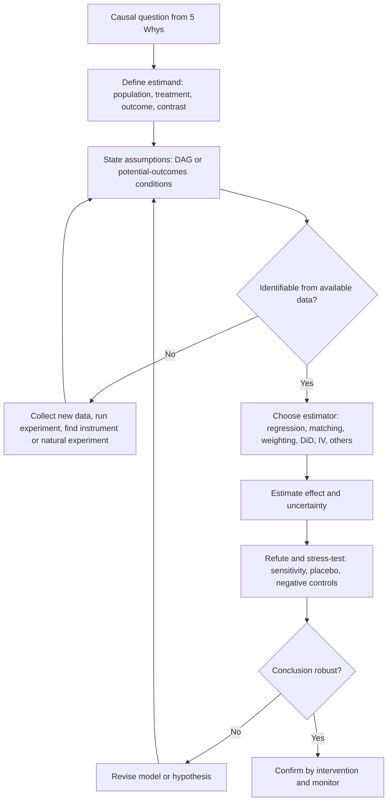

## Introduction to Formal Causal Inference Frameworks


### Overview

**Causal inference** is the body of methods for answering "what would happen to $Y$ if we changed $X$?" from data, experimental or observational. Earlier tools in Root Cause Analysis (RCA) (scatter diagrams, correlation, regression, designed experiments) each answer part of that question. **Formal causal inference frameworks** supply the shared language and logic that explains *when* those tools yield causal answers and *when* they do not.

Two major frameworks dominate the field, and they are complementary rather than competing:

| Framework | Originators (commonly credited) | Core idea | Primary language |
| --- | --- | --- | --- |
| **Potential outcomes (Rubin causal model)** | Neyman, Rubin | A cause is a comparison between what would have happened to the same unit under different treatments | Counterfactual outcomes $Y(1), Y(0)$ |
| **Structural causal models (SCM) and causal graphs** | Pearl, Spirtes/Glymour/Scheines | A cause is a variable that, when set by intervention, changes another; structure is encoded in a directed graph and equations | DAGs, the $do(\cdot)$ operator |

Related frameworks (Granger causality, mediation analysis, target trial emulation, Bayesian causal models) build on or specialize these two.

**Key Points**

- Correlation, regression, and even a well-fitted model describe **associations**. A causal claim needs additional assumptions that come from outside the data (process knowledge, study design).
- Formal frameworks make those assumptions **explicit and inspectable**, instead of leaving them implicit in a choice of regression covariates.
- Every causal method answers a defined **estimand** (a precise causal quantity). Naming the estimand comes before choosing an estimator.
- In RCA, the 5 Whys chain is an informal causal graph. Formal frameworks convert it into testable structure and quantified effects.

### Mapping the 5 Whys to Formal Causal Language

| RCA concept | Formal counterpart |
| --- | --- |
| Problem statement (effect) | Outcome variable $Y$ |
| Suspected root cause | Treatment/exposure variable $X$ (or $T$) |
| Each "Why?" link | A directed edge in a causal graph ($A \rightarrow B$) |
| Alternative explanations | Confounders, competing paths |
| "Because of this, that happened" | Mediation ($X \rightarrow M \rightarrow Y$) |
| Countermeasure | Intervention, $do(X = x)$ |
| "Would the problem have occurred had the cause not been present?" | Counterfactual $Y(0)$ vs. observed $Y(1)$ |
| Verifying the fix | Estimating an effect, ideally with an experiment or quasi-experiment |

**Example:** "Why did the batch fail? Because the reactor overheated. Why? Because the cooling valve stuck." The chain becomes the graph *Valve stuck → Overheating → Batch failure*. Formal causal thinking then asks: is there a common cause of valve failures and overheating (e.g., contaminated coolant)? Is overheating the *only* route from valve sticking to failure? What would the failure rate be if valves were prevented from sticking?

### The Ladder of Causation

Pearl's three-rung hierarchy classifies causal questions by the information needed to answer them.

| Rung | Activity | Question form | Example in RCA | Needs |
| --- | --- | --- | --- | --- |
| 1. **Association** | Seeing | $P(Y \mid X)$: what does observing $X$ tell about $Y$? | Failed batches tend to have higher reactor temperature | Data alone |
| 2. **Intervention** | Doing | $P(Y \mid do(X))$: what happens if we set $X$? | Failure rate if we cap temperature at 90 °C | Causal model or experiment |
| 3. **Counterfactual** | Imagining | $P(Y_{x'} \mid X = x, Y = y)$: given what happened, what would have happened otherwise? | Would *this* batch have failed had the valve not stuck? | Structural equations |

Statistical methods that use only observed data cannot move from rung 1 to rung 2 without additional causal assumptions. Randomized experiments earn rung 2 by design.

#### Diagram (Mermaid)



### Framework 1: Potential Outcomes (Rubin Causal Model)

#### Core Definitions

For each unit $i$ and a binary treatment $T_i \in \{0, 1\}$ define two **potential outcomes**:

- $Y_i(1)$: the outcome if unit $i$ receives treatment.
- $Y_i(0)$: the outcome if unit $i$ receives control.

The **individual treatment effect** is

$$\tau_i = Y_i(1) - Y_i(0)$$

The **fundamental problem of causal inference**: for each unit, only one of $Y_i(1)$ or $Y_i(0)$ is ever observed, so $\tau_i$ cannot be computed directly. The observed outcome is

$$Y_i = T_i\, Y_i(1) + (1 - T_i)\, Y_i(0)$$

Causal inference therefore relies on comparing *groups* and on assumptions that make groups comparable.

#### Common Estimands

| Estimand | Definition | Meaning |
| --- | --- | --- |
| **ATE** (average treatment effect) | $E[Y(1) - Y(0)]$ | Average effect over the whole population |
| **ATT** (average effect on the treated) | $E[Y(1) - Y(0) \mid T = 1]$ | Effect among those who actually received treatment |
| **ATC** (average effect on the controls) | $E[Y(1) - Y(0) \mid T = 0]$ | Effect among those who did not |
| **CATE** (conditional average effect) | $E[Y(1) - Y(0) \mid X = x]$ | Effect for a subgroup defined by covariates |
| **LATE** (local average effect) | Effect among "compliers" in an instrumental-variable design | Effect for those whose treatment is shifted by the instrument |

The estimand should match the RCA question. "What would happen if we changed the supplier for *all* lots?" is an ATE question. "How much harm did the new supplier cause among the lots that used it?" is an ATT question.

#### Why Naive Comparison Fails

The simple difference in means decomposes as

$$E[Y \mid T=1] - E[Y \mid T=0] = \underbrace{E[Y(1) - Y(0) \mid T=1]}_{\text{ATT}} + \underbrace{E[Y(0) \mid T=1] - E[Y(0) \mid T=0]}_{\text{selection bias}}$$

Selection bias is nonzero when treated and untreated units would have had different outcomes even without treatment, for example when the machines chosen for a new lubricant were already the worst performers.

#### Key Identifying Assumptions

| Assumption | Statement | Comment |
| --- | --- | --- |
| **SUTVA** (Stable Unit Treatment Value Assumption) | No interference between units, and no hidden versions of the treatment | Violated when one unit's treatment affects another's outcome (shared equipment, queues) |
| **Consistency** | Observed outcome equals the potential outcome under the treatment received | Requires a well-defined treatment |
| **Ignorability / unconfoundedness** | $\{Y(0), Y(1)\} \perp T \mid X$ | Given measured covariates $X$, treatment assignment is as-if random |
| **Positivity (overlap)** | $0 < P(T=1 \mid X=x) < 1$ for all relevant $x$ | Every covariate profile has a chance of both treatments |

Randomization guarantees ignorability unconditionally. In observational data, ignorability is an untestable assumption that must be defended with process knowledge.

#### Identification Under Ignorability

If the assumptions hold, the ATE is identified by the **adjustment formula** (standardization):

$$ATE = E_X\big[\,E[Y \mid T=1, X] - E[Y \mid T=0, X]\,\big]$$

Different estimation strategies implement this formula in different ways.

#### Estimation Strategies

| Method | Idea | Notes |
| --- | --- | --- |
| **Regression adjustment** | Model $E[Y \mid T, X]$; average predicted differences | Sensitive to model misspecification |
| **Matching** | Pair treated units with untreated units having similar $X$ | Improves comparability; check covariate balance |
| **Propensity score methods** | Use $e(x) = P(T=1 \mid X=x)$ to balance groups (matching, stratification, weighting) | Rosenbaum and Rubin showed $T \perp X \mid e(X)$; correct only if the propensity model is adequate |
| **Inverse probability weighting (IPW)** | Weight units by $1/e(x)$ for treated and $1/(1-e(x))$ for controls | Extreme weights inflate variance; trimming or stabilization is common |
| **Doubly robust estimators (AIPW, TMLE)** | Combine outcome model and propensity model | Consistent if either model is correctly specified |
| **Stratification** | Estimate effects within covariate strata and combine | Simple; limited by the number of strata |

**IPW estimator for the ATE:**

$$\widehat{ATE}_{IPW} = \frac{1}{n}\sum_{i=1}^{n}\left[\frac{T_i Y_i}{\hat{e}(X_i)} - \frac{(1 - T_i) Y_i}{1 - \hat{e}(X_i)}\right]$$

#### Balance Diagnostics

After matching or weighting, check that covariate distributions are similar across treatment groups. The **standardized mean difference** for covariate $j$:

$$SMD_j = \frac{\bar{x}_{j,T=1} - \bar{x}_{j,T=0}}{\sqrt{(s^2_{j,1} + s^2_{j,0})/2}}$$

A common screening rule treats $|SMD| < 0.1$ as acceptable balance. [Inference: this is a convention, not a strict threshold.] Balance on measured covariates does not imply balance on unmeasured ones.

#### Randomized Experiments in this Framework

Under random assignment, $T \perp \{Y(0), Y(1)\}$, so the simple difference in means is an unbiased estimator of the ATE:

$$\widehat{ATE} = \bar{Y}_{T=1} - \bar{Y}_{T=0}$$

This is why designed experiments are the reference standard for causal confirmation in RCA.

### Framework 2: Structural Causal Models and Causal Graphs

#### Structural Causal Model

An SCM consists of variables, functions, and exogenous noise:

$$V_j = f_j(\text{Pa}_j,\; U_j)$$

where $\text{Pa}_j$ are the direct causes (parents) of $V_j$ and $U_j$ captures unmodeled influences. Each function is an autonomous mechanism, so changing one (an intervention) leaves the others intact.

#### Directed Acyclic Graphs (DAGs)

A DAG has nodes (variables) and directed edges ($A \rightarrow B$ meaning $A$ is a direct cause of $B$), with no cycles. It encodes qualitative causal assumptions, including the **absence** of edges, which is often the more informative content.

**Basic structures**

| Structure | Pattern | Statistical behavior |
| --- | --- | --- |
| **Chain** (mediator) | $X \rightarrow M \rightarrow Y$ | $X$ and $Y$ are associated; conditioning on $M$ blocks the path |
| **Fork** (confounder) | $X \leftarrow Z \rightarrow Y$ | $X$ and $Y$ are associated through $Z$; conditioning on $Z$ blocks the path |
| **Collider** | $X \rightarrow C \leftarrow Y$ | $X$ and $Y$ are independent; conditioning on $C$ (or its descendants) **opens** a spurious association |

#### Diagram (svg_diagram)

<svg xmlns="http://www.w3.org/2000/svg" viewBox="0 0 780 320" width="780" height="320" font-family="sans-serif" font-size="12">
<text x="390" y="20" text-anchor="middle" font-size="14" font-weight="bold">Three Building Blocks of Causal Graphs (svg_diagram)</text>
<g transform="translate(20,40)">
<text x="110" y="14" text-anchor="middle" font-weight="bold">Chain</text>
<circle cx="30" cy="110" r="22" fill="none" stroke="#333" /><text x="30" y="114" text-anchor="middle">X</text>
<circle cx="110" cy="110" r="22" fill="none" stroke="#333" /><text x="110" y="114" text-anchor="middle">M</text>
<circle cx="190" cy="110" r="22" fill="none" stroke="#333" /><text x="190" y="114" text-anchor="middle">Y</text>
<line x1="52" y1="110" x2="86" y2="110" stroke="#333" marker-end="url(#a2)" />
<line x1="132" y1="110" x2="166" y2="110" stroke="#333" marker-end="url(#a2)" />
<text x="110" y="180" text-anchor="middle">Adjusting for M blocks the path</text>
</g>
<g transform="translate(270,40)">
<text x="110" y="14" text-anchor="middle" font-weight="bold">Fork</text>
<circle cx="110" cy="60" r="22" fill="none" stroke="#333" /><text x="110" y="64" text-anchor="middle">Z</text>
<circle cx="40" cy="150" r="22" fill="none" stroke="#333" /><text x="40" y="154" text-anchor="middle">X</text>
<circle cx="180" cy="150" r="22" fill="none" stroke="#333" /><text x="180" y="154" text-anchor="middle">Y</text>
<line x1="97" y1="79" x2="54" y2="132" stroke="#333" marker-end="url(#a2)" />
<line x1="123" y1="79" x2="166" y2="132" stroke="#333" marker-end="url(#a2)" />
<text x="110" y="200" text-anchor="middle">Adjusting for Z removes confounding</text>
</g>
<g transform="translate(520,40)">
<text x="110" y="14" text-anchor="middle" font-weight="bold">Collider</text>
<circle cx="40" cy="60" r="22" fill="none" stroke="#333" /><text x="40" y="64" text-anchor="middle">X</text>
<circle cx="180" cy="60" r="22" fill="none" stroke="#333" /><text x="180" y="64" text-anchor="middle">Y</text>
<circle cx="110" cy="150" r="22" fill="none" stroke="#333" /><text x="110" y="154" text-anchor="middle">C</text>
<line x1="54" y1="78" x2="97" y2="132" stroke="#333" marker-end="url(#a2)" />
<line x1="166" y1="78" x2="123" y2="132" stroke="#333" marker-end="url(#a2)" />
<text x="110" y="200" text-anchor="middle">Adjusting for C creates bias</text>
</g>
</svg>

#### d-Separation

A path between $X$ and $Y$ is **blocked** by a set $\mathbf{S}$ if it contains:

- a chain $A \rightarrow M \rightarrow B$ or fork $A \leftarrow M \rightarrow B$ where $M \in \mathbf{S}$, or
- a collider $A \rightarrow C \leftarrow B$ where neither $C$ nor any descendant of $C$ is in $\mathbf{S}$.

$X$ and $Y$ are **d-separated** by $\mathbf{S}$ if every path between them is blocked. In a DAG consistent with the data-generating process, d-separation implies conditional independence: $X \perp Y \mid \mathbf{S}$. This gives **testable implications** of a graph, which can be compared with data to refute a proposed 5 Whys structure (though not to prove it).

#### The do-Operator and Interventions

$P(Y \mid do(X = x))$ denotes the distribution of $Y$ when $X$ is set to $x$ by intervention, overriding the mechanism that normally determines $X$. In graph terms, an intervention removes all arrows into $X$ ("graph surgery"). It differs from conditioning, $P(Y \mid X = x)$, which merely selects units where $X$ happened to equal $x$.

#### Backdoor Criterion and Adjustment

A set $\mathbf{Z}$ satisfies the **backdoor criterion** relative to $(X, Y)$ if:

1. no node in $\mathbf{Z}$ is a descendant of $X$, and
2. $\mathbf{Z}$ blocks every path between $X$ and $Y$ that contains an arrow into $X$ (a "backdoor path").

Then the causal effect is identified by the adjustment formula:

$$P(Y = y \mid do(X = x)) = \sum_{\mathbf{z}} P(Y = y \mid X = x, \mathbf{Z} = \mathbf{z})\, P(\mathbf{Z} = \mathbf{z})$$

This formalizes "which variables should I include in the regression?" The answer comes from the graph, not from significance tests or model fit.

#### Front-Door Criterion and do-Calculus

When a confounder of $X$ and $Y$ is unmeasured, the effect may still be identified if a mediator $M$ fully carries the effect of $X$ on $Y$ and is itself unconfounded by the unmeasured variable (the **front-door criterion**). Pearl's **do-calculus** is a complete set of rules for deciding whether a causal effect is identifiable from observational data given a graph, and for deriving the identifying expression.

[Inference: front-door conditions are rarely met exactly in ordinary operational settings; they are conceptually important and occasionally applicable.]

#### Instrumental Variables in Graph Language

A valid instrument $W$ affects $X$, affects $Y$ only through $X$ (exclusion restriction), and shares no unmeasured common cause with $Y$ (independence). Graph: $W \rightarrow X \rightarrow Y$ with an unmeasured $U \rightarrow X$, $U \rightarrow Y$. Under monotonicity, the Wald estimator recovers the LATE:

$$\widehat{LATE} = \frac{E[Y \mid W=1] - E[Y \mid W=0]}{E[X \mid W=1] - E[X \mid W=0]}$$

#### Counterfactuals in SCMs

Counterfactuals are computed in three steps (**abduction, action, prediction**):

1. **Abduction:** update the exogenous noise $U$ given the observed evidence.
2. **Action:** modify the model by the hypothetical intervention.
3. **Prediction:** compute the outcome in the modified model.

This supports "would this batch have failed had the valve not stuck?" style RCA questions, provided the structural equations are credible. [Inference: counterfactual conclusions depend on functional-form assumptions that are typically untestable.]

### Relating the Two Frameworks

| Aspect | Potential outcomes | Structural causal models |
| --- | --- | --- |
| Primary object | Unit-level counterfactual outcomes | Graph and structural equations |
| Strength | Clear estimands; rich estimation theory for treatment effects | Encodes assumptions transparently; supports identification analysis and variable selection |
| Confounder selection | Often left to the analyst ("include relevant covariates") | Derived from the graph (backdoor criterion) |
| Mediation, complex pathways | Requires additional structure | Natural representation |
| Typical use | Randomized trials, propensity-score analyses, econometric designs | Causal discovery, identification, complex systems |
| Formal link | Ignorability given $\mathbf{Z}$ corresponds to $\mathbf{Z}$ satisfying the backdoor criterion in a graph | Equivalent in expressive power for many standard problems |

In practice, analysts often use the graph to decide *what to adjust for* and the potential-outcomes toolkit to decide *how to estimate*.

### Mediation Analysis

Mediation decomposes a total effect into effects transmitted through an intermediate variable $M$ and effects that bypass it. In RCA it addresses "how" the root cause produces the effect.

**Potential-outcomes definitions (binary treatment):**

$$TE = E[Y(1, M(1)) - Y(0, M(0))]$$


$$NDE = E[Y(1, M(0)) - Y(0, M(0))] \quad (\text{natural direct effect})$$


$$NIE = E[Y(1, M(1)) - Y(1, M(0))] \quad (\text{natural indirect effect})$$

so that $TE = NDE + NIE$.

**Identification requires** no unmeasured confounding of (i) treatment–outcome, (ii) mediator–outcome, and (iii) treatment–mediator relationships, and no mediator–outcome confounder affected by treatment. These are strong assumptions. In linear models without interactions, the indirect effect equals the product of coefficients ($a \times b$ from $X \rightarrow M$ and $M \rightarrow Y \mid X$). [Inference: the product-of-coefficients decomposition is valid only under the linear, no-interaction, no-confounding conditions.]

**Example:** Understaffing → Interruptions → Medication errors. If interruptions account for 60% of the total effect of understaffing, then improving interruption control may recover part of the benefit even without hiring, provided the mediation assumptions are credible.

### Quasi-Experimental Designs

When randomization is not possible, research designs that exploit natural sources of as-if random variation strengthen causal claims.

| Design | Source of identification | Key assumption | RCA example |
| --- | --- | --- | --- |
| **Difference-in-differences** | Before/after change in treated vs. untreated groups | Parallel trends absent treatment | New procedure rolled out at some sites but not others |
| **Interrupted time series** | Level/trend change at a known intervention time | No concurrent events; stable pre-trend | Defect rate before/after a process change |
| **Regression discontinuity** | Units just above/below an assignment cutoff | No manipulation of the running variable | Inspection triggered when a score exceeds a threshold |
| **Instrumental variables** | Variation in treatment induced by an instrument | Relevance, exclusion, independence, monotonicity | Random shift assignment affecting exposure to a condition |
| **Synthetic control** | Weighted combination of untreated units as counterfactual | Pre-period fit implies valid post-period counterfactual | One plant adopts a change; other plants form the control |
| **Natural experiments** | Exogenous events (outage, policy change) | Event unrelated to outcome determinants | Sudden supplier disruption |

### Causal Discovery

Causal discovery algorithms attempt to learn graph structure from data.

| Family | Examples | Idea |
| --- | --- | --- |
| **Constraint-based** | PC, FCI | Use conditional-independence tests to prune edges and orient colliders |
| **Score-based** | GES | Search graph space maximizing a fit score (e.g., BIC) |
| **Functional-form-based** | LiNGAM, additive noise models | Exploit non-Gaussianity or asymmetries to orient edges |
| **Continuous optimization** | NOTEARS | Learn a DAG via differentiable acyclicity constraint |

**Key limits:** Observational data typically identify a graph only up to a **Markov equivalence class** (graphs sharing the same conditional independences). Results rely on assumptions such as causal sufficiency (no hidden confounders, unless FCI-type methods are used), faithfulness, correct independence tests, and adequate sample size. [Inference: reported performance varies widely with data and assumptions.] In RCA, discovery outputs are best treated as **hypothesis generators** to be reconciled with process knowledge and tested by experiment, never as verdicts.

### Time-Series Causality

**Granger causality** asks whether past values of $X$ improve prediction of $Y$ beyond the past of $Y$ alone:

$$y_t = \sum_{i=1}^{p}\alpha_i y_{t-i} + \sum_{i=1}^{p}\beta_i x_{t-i} + \varepsilon_t$$

If the $\beta_i$ are jointly nonzero (F-test), $X$ "Granger-causes" $Y$. This is **predictive precedence**, not intervention-based causation: an omitted common driver or sampling-rate effects can produce spurious Granger results. Stationarity and appropriate lag choice are required. [Inference: interpretation as true causation needs additional assumptions.]

### Target Trial Emulation

For observational data, specify the hypothetical randomized trial that would answer the question (eligibility, treatment strategies, assignment, time zero, follow-up, outcome, estimand) and then emulate each component with the data. This discipline prevents common design errors such as **immortal time bias** (misaligning treatment start with follow-up start) and clarifies which assumptions replace randomization.

### Causal Effect Estimation Workflow

| Step | Activity | RCA link |
| --- | --- | --- |
| 1 | Define the causal question and estimand | Translate a 5 Whys link into $X \rightarrow Y$ with a population and contrast |
| 2 | Draw a causal graph | Convert the 5 Whys chain and fishbone into a DAG; add confounders |
| 3 | Check identifiability | Backdoor criterion, IV, front-door, or do-calculus |
| 4 | Choose the design and data | Experiment if possible; otherwise quasi-experiment or adjusted observational analysis |
| 5 | Estimate | Regression, matching, weighting, DiD, IV, doubly robust |
| 6 | Quantify uncertainty | Confidence intervals; bootstrap; robust or clustered standard errors |
| 7 | Refute and stress-test | Sensitivity analysis, placebo/negative-control tests, alternative graphs |
| 8 | Triangulate | Mechanism, time order, dose–response, independent evidence |
| 9 | Intervene and verify | Pilot the countermeasure and monitor |

### Refutation and Sensitivity Analyses

| Technique | Purpose |
| --- | --- |
| **Placebo treatment** | Replace the treatment with a random variable; the estimated effect should be near zero |
| **Placebo outcome / negative control outcome** | Test an outcome the treatment should not affect |
| **Negative control exposure** | Test an exposure that should not affect the outcome |
| **Random common cause** | Add a random confounder; the estimate should be stable |
| **Data subset validation** | Re-estimate on random subsets; the effect should persist |
| **E-value** | Minimum confounder strength (on the risk-ratio scale) needed to explain away the estimated effect |
| **Rosenbaum bounds** | Sensitivity of matched-study conclusions to hidden bias of a stated magnitude |
| **Alternative graphs** | Check whether conclusions hold under plausible alternative structures |

### Worked Example

**Scenario.** A manufacturing plant sees a rise in solder-joint defects ($Y$, defects per 1,000 boards). The 5 Whys chain ends with: *Why? Because a new flux (treatment $T$) was introduced. Why was defect rate higher with it? Because the flux leaves residue that impairs joint formation.* However, the new flux was adopted first on the newest oven lines ($Z$: oven age) and by night-shift operators ($S$), and humidity ($H$) varies seasonally.

**Step 1: Estimand.** ATT of new flux vs. old flux on defects per 1,000 boards, among boards produced with the new flux.

**Step 2: Graph.**

- $Z \rightarrow T$ (new ovens adopted first), $Z \rightarrow Y$ (new ovens have a break-in period with more defects)
- $S \rightarrow T$, $S \rightarrow Y$ (night-shift procedures differ)
- $H \rightarrow Y$ (humidity affects soldering); $H \rightarrow T$ (flux switched during a dry season)
- $T \rightarrow Y$ (the hypothesized effect), $T \rightarrow R \rightarrow Y$ (residue $R$ as mediator)

**Step 3: Identifiability.** Backdoor paths run through $Z$, $S$, and $H$. Adjusting for $\{Z, S, H\}$ blocks them. The mediator $R$ is a descendant of $T$ and should **not** be adjusted for when estimating the total effect.

**Step 4: Estimation (illustrative).**

| Estimate | Value (defects/1,000) | Comment |
| --- | --- | --- |
| Naive difference in means | +9.0 | Includes confounding |
| Regression adjusted for $Z, S, H$ | +4.5 | Total effect of flux (through residue and directly) |
| IPW estimate (propensity model with $Z, S, H$) | +4.2 | Similar; check weight distribution |
| Adding mediator $R$ to the model | +1.1 | Direct effect only; not the total effect |

(Numbers are illustrative constructed values for teaching.)

**Step 5: Diagnostics.** Covariate balance after weighting: all $|SMD| < 0.1$. Overlap plot: propensity scores for old-oven day-shift boards under the new flux are sparse, so positivity is weak in that stratum and the estimate is extrapolating there.

**Step 6: Refutation.** Placebo test using defects in a stage before soldering (which the flux cannot affect): estimated effect near zero, as expected. E-value analysis suggests an unmeasured confounder would need to be substantially associated with both flux choice and defects to explain away the effect. [Inference: the size judged "substantial" depends on what plausible confounders exist in this plant.]

**Step 7: Mediation.** About $(4.5 - 1.1)/4.5 \approx 76\%$ of the total effect appears to operate through residue, under the mediation assumptions (no unmeasured confounding of the residue–defect relationship, in particular).

**Step 8: Confirmation.** Run a randomized pilot: randomly assign flux type to boards within the same oven and shift blocks over two weeks. The pilot difference (+4.0, 95% CI wide but excluding zero) agrees with the adjusted estimates, supporting the causal claim. The countermeasure is to return to the old flux (or add a cleaning step), then monitor with a control chart.

**Conclusion.** The formal framework clarified what to adjust for (confounders), what not to adjust for (the mediator), what assumptions the estimate relied on, and how to stress-test them, before a costly process change.

### Software Implementation

#### Python: DoWhy (graph-based workflow)

```python
import pandas as pd
from dowhy import CausalModel

# df columns: defects, flux_new, oven_age, night_shift, humidity
gml_graph = """
graph [directed 1
  node [id "flux_new" label "flux_new"]
  node [id "defects" label "defects"]
  node [id "oven_age" label "oven_age"]
  node [id "night_shift" label "night_shift"]
  node [id "humidity" label "humidity"]
  edge [source "flux_new" target "defects"]
  edge [source "oven_age" target "flux_new"]
  edge [source "oven_age" target "defects"]
  edge [source "night_shift" target "flux_new"]
  edge [source "night_shift" target "defects"]
  edge [source "humidity" target "flux_new"]
  edge [source "humidity" target "defects"]
]
"""

model = CausalModel(data=df, treatment="flux_new", outcome="defects", graph=gml_graph)
estimand = model.identify_effect(proceed_when_unidentifiable=False)
print(estimand)

estimate = model.estimate_effect(
    estimand,
    method_name="backdoor.linear_regression",
    target_units="att",
)
print(estimate.value)

# Refutations
model.refute_estimate(estimand, estimate, method_name="placebo_treatment_refuter")
model.refute_estimate(estimand, estimate, method_name="random_common_cause")
model.refute_estimate(estimand, estimate, method_name="data_subset_refuter")
```

[Unverified: DoWhy's API, parameter names, and available estimators change between versions; consult current documentation.]

#### Python: Propensity scores and IPW (manual)

```python
import numpy as np
import statsmodels.api as sm
import statsmodels.formula.api as smf

ps_model = smf.logit("flux_new ~ oven_age + night_shift + humidity", data=df).fit()
df["ps"] = ps_model.predict(df)
df["ps"] = df["ps"].clip(0.02, 0.98)          # trim extreme weights (sensitivity check advised)

df["w"] = np.where(df["flux_new"] == 1, 1 / df["ps"], 1 / (1 - df["ps"]))
ipw = smf.wls("defects ~ flux_new", data=df, weights=df["w"]).fit(cov_type="HC1")
print(ipw.params["flux_new"], ipw.conf_int().loc["flux_new"].values)

# Standardized mean differences (balance) before and after weighting
def smd(x, t, w=None):
    w = np.ones(len(x)) if w is None else w
    m1 = np.average(x[t == 1], weights=w[t == 1])
    m0 = np.average(x[t == 0], weights=w[t == 0])
    s = np.sqrt((x[t == 1].var() + x[t == 0].var()) / 2)
    return (m1 - m0) / s
```

#### Python: Difference-in-differences

```python
did = smf.ols("y ~ treated * post + C(unit) + C(period)", data=panel).fit(
    cov_type="cluster", cov_kwds={"groups": panel["unit"]}
)
print(did.params["treated:post"])
```

(With unit and period fixed effects, the standalone `treated` and `post` terms are absorbed; software may drop them automatically.)

#### R

```r
library(dagitty)
g <- dagitty("dag {
  oven_age -> flux_new; oven_age -> defects
  night_shift -> flux_new; night_shift -> defects
  humidity -> flux_new;  humidity -> defects
  flux_new -> residue -> defects
  flux_new -> defects
}")

adjustmentSets(g, exposure = "flux_new", outcome = "defects", effect = "total")
impliedConditionalIndependencies(g)   # testable implications
dseparated(g, "flux_new", "defects", c("oven_age", "night_shift", "humidity"))

library(MatchIt)
m <- matchit(flux_new ~ oven_age + night_shift + humidity, data = df, method = "nearest")
summary(m)
matched <- match.data(m)
lm(defects ~ flux_new, data = matched, weights = weights)

library(WeightIt); library(cobalt)      # weighting and balance assessment
library(AER); ivreg(defects ~ flux_new | instrument, data = df)   # instrumental variables
library(dosearch)                        # do-calculus identification (where applicable)
```

Other commonly used tools include `causalml`, `EconML`, `CausalNex`, and `causal-learn` in Python; `tmle`, `grf`, and `pcalg` in R; and DAGitty (web application) for drawing graphs and deriving adjustment sets. [Unverified: maintenance status and features vary; check each project's current documentation.]

### Choosing an Approach

| Situation | Suggested approach |
| --- | --- |
| Factor can be manipulated safely | Randomized experiment or pilot |
| Rich covariate data, plausible ignorability | Graph-guided adjustment, propensity or doubly robust methods |
| Group-level rollout with before/after data | Difference-in-differences, synthetic control |
| Single intervention with long pre/post series | Interrupted time series |
| Assignment by a cutoff rule | Regression discontinuity |
| Plausible instrument available | Instrumental variables |
| Unmeasured confounding suspected | Sensitivity analysis; instrument, front-door, or negative controls |
| Complex mechanism | Mediation analysis with explicit assumptions |
| Structure unknown | Domain-driven DAG first; causal discovery as a supplement |

### Limitations and Common Pitfalls

| Pitfall | Explanation | Mitigation |
| --- | --- | --- |
| **Estimand ambiguity** | Analysis answers a different question than the RCA needs | State the estimand explicitly (ATE, ATT, direct, total) |
| **Untestable assumptions treated as facts** | Ignorability, exclusion restriction, parallel trends | Justify from process knowledge; test implications; run sensitivity analysis |
| **Adjusting for mediators or colliders** | Biases the effect | Use the graph to choose adjustment sets |
| **Positivity violations** | No comparable units in some strata | Check overlap; restrict the population; report the change in estimand |
| **Post-treatment selection** | Conditioning on variables affected by treatment | Define covariates before treatment; use time ordering |
| **Interference** | Units affect each other's outcomes | Redefine units; use cluster designs; network-aware methods |
| **Measurement error** | Mismeasured confounders leave residual confounding | Improve measurement; sensitivity analysis |
| **Overreliance on causal discovery** | Algorithms return equivalence classes under strong assumptions | Combine with domain knowledge; confirm experimentally |
| **Model dependence** | Results change with the specification | Use doubly robust and multiple estimators; report ranges |
| **Confusing prediction with causation** | Machine-learning importance scores read as causal effects | Use causal estimands and identification arguments |
| **Ignoring heterogeneity** | Average effects mask subgroups where the cause acts strongly | Estimate CATEs cautiously with pre-specified subgroups |
| **External validity** | Effects estimated in one setting may not transport | State the target population; assess transportability |

**Key Points**

- A causal estimate is the product of **data plus assumptions**. Better data can sometimes weaken the assumptions required, but assumptions can never be eliminated in observational work.
- Transparency matters more than any single estimator: state the graph, the estimand, the adjustment set, and the checks performed so others can challenge them.
- Agreement across independent lines of evidence (design, mechanism, time order, dose–response, intervention) is the practical standard for concluding a root cause.

### Reporting Template

| Element | Content |
| --- | --- |
| Causal question and estimand | Population, treatment, outcome, contrast (ATE, ATT, etc.) |
| Causal graph | Nodes, edges, and justification for each assumed edge and each omitted edge |
| Identification strategy | Backdoor set, instrument, front-door, or design-based (experiment, DiD, RD) |
| Assumptions | Ignorability, positivity, SUTVA, parallel trends, exclusion restriction, as applicable |
| Data and measurement | Sources, variable definitions, missingness, measurement quality |
| Estimation | Method, model specification, software and version |
| Results | Point estimate with confidence or credible interval; effect on a practical scale |
| Diagnostics | Balance, overlap, residual checks, influence |
| Robustness | Placebo tests, sensitivity analysis, alternative graphs and estimators |
| Triangulation | Mechanism, temporal order, additional evidence |
| Decision and verification | Countermeasure, pilot design, monitoring plan |

### Conclusion

Formal causal inference frameworks provide the logical scaffolding that connects the informal reasoning of the 5 Whys to quantitative evidence. The potential outcomes framework defines causal effects as comparisons between counterfactual states and supplies the estimation toolkit (randomization, matching, weighting, doubly robust methods). Structural causal models and DAGs make causal assumptions explicit, determine which variables to adjust for, and identify when a causal effect can be computed at all. Quasi-experimental designs, mediation analysis, and sensitivity methods extend these ideas to realistic operational settings where randomization is limited. Used together, they turn RCA from a narrative exercise into an auditable argument: a stated causal question, explicit assumptions, an identification strategy, an estimate with uncertainty, stress tests, and finally a verified intervention.

**Related Topics**

- Directed acyclic graphs: d-separation, backdoor and front-door criteria in depth
- Potential outcomes: propensity scores, matching, and doubly robust estimation
- Counterfactual reasoning and structural equation models
- Mediation and moderation analysis
- Difference-in-differences, synthetic control, and regression discontinuity
- Instrumental variables and local average treatment effects
- Sensitivity analysis: E-values, Rosenbaum bounds, negative controls
- Causal discovery algorithms (PC, FCI, LiNGAM, NOTEARS)
- Heterogeneous treatment effects and causal machine learning (causal forests, meta-learners)
- Target trial emulation
- Bayesian causal inference and probabilistic graphical models
- Transportability and external validity of causal effects