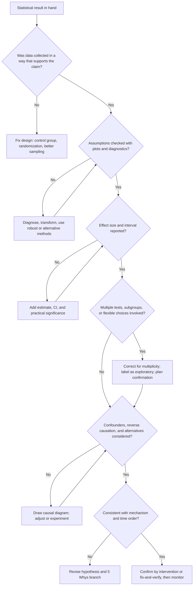

## Avoiding Statistical Misinterpretation

### Overview

Statistical misinterpretation is the gap between what an analysis actually shows and what the analyst, the team, or management believes it shows. In Root Cause Analysis (RCA), this gap is costly: a misread scatter diagram, correlation coefficient, regression, or experiment can send a team to fix the wrong cause, declare a root cause confirmed when it is not, or dismiss a real cause because a test was underpowered.

Misinterpretation rarely comes from arithmetic errors. It comes from four sources:

| Source | Description | Typical RCA symptom |
| --- | --- | --- |
| **Conceptual** | Misunderstanding what a statistic or test means | "$p = 0.03$ means a 97% chance the cause is real" |
| **Design** | Data collected in a way that cannot support the conclusion | Comparing a fixed machine to a broken one chosen because it was broken |
| **Analytical** | Wrong method, violated assumptions, flexible analysis | Testing 30 variables and reporting the significant ones |
| **Cognitive** | Human reasoning biases applied to data | Stopping the 5 Whys at the first plausible cause |

**Key Points**

- A statistic is a summary of the data under a model. Its meaning depends on the design, the assumptions, and the question asked.
- Most errors are avoidable with a small number of habits: plot first, state the estimand, check assumptions, quantify uncertainty, consider alternatives, and confirm by intervention.
- No statistical procedure can rescue a poorly designed data collection or an unexamined assumption.

### Misinterpreting the Basics

#### Correlation Read as Causation

A strong association between $X$ and $Y$ is compatible with several structures: $X$ causes $Y$, $Y$ causes $X$, a third variable causes both, a shared trend, selection, or chance.

| Structure | Example |
| --- | --- |
| Reverse causation | Operators slow the line when scrap rises, so speed and scrap appear negatively related |
| Confounding | Humidity affects both adhesive cure time and label misalignment |
| Common trend | Both complaints and headcount rise as the company grows |
| Selection | Only failed units are analyzed |
| Coincidence | Two unrelated series match by chance over a short window |

**Remedy:** treat correlation as a hypothesis generator. Apply the evidence ladder: association, time order, mechanism, dose-response, confounder control, intervention.

#### Non-Significant Read as "No Effect"

Failing to reject $H_0$ is not evidence that $H_0$ is true. It may reflect low power, high noise, or a narrow range of the factor.

**Example:** A test on 8 units per group finds $p = 0.18$ for a new fixture. The 95% confidence interval for the mean difference runs from $-2.1$ to $+9.8$ units, and the smallest practically important difference is 3 units. The data are compatible with both no effect and an important effect. The correct conclusion is "inconclusive", not "the fixture does nothing".

**Remedy:** report confidence intervals, compute power in advance, and interpret the interval relative to the smallest effect that matters. Equivalence tests (such as TOST) are the formal tool for arguing that an effect is negligibly small. [Inference: the appropriate equivalence margin must come from domain judgment, not from the data.]

#### Significant Read as Important

With large samples, trivial differences become "significant". With small samples, large differences may not.

$$t = \frac{\hat{\theta}}{SE(\hat{\theta})}, \qquad SE \propto \frac{1}{\sqrt{n}}$$

As $n \to \infty$, $SE \to 0$, and any nonzero $\hat\theta$ eventually yields a large $|t|$.

**Remedy:** always report the **effect size in original units**, its confidence interval, and cost-benefit context.

### Misinterpreting $p$-Values

#### What a $p$-Value Is

A $p$-value is the probability, computed assuming the null hypothesis and all model assumptions are true, of obtaining a result at least as extreme as the one observed:

$$p = P(\text{data at least this extreme} \mid H_0,\ \text{assumptions})$$

#### Common Misreadings

| Misreading | Why it is wrong |
| --- | --- |
| "$p = 0.03$ means a 3% chance $H_0$ is true" | $p$ is a probability of data given $H_0$, not of $H_0$ given data |
| "$p = 0.03$ means a 97% chance the effect is real" | Same confusion; the posterior probability depends on prior plausibility |
| "$p > 0.05$ means no difference" | Absence of evidence is not evidence of absence |
| "$p < 0.05$ means the result will replicate" | Replication probability depends on power and true effect size |
| "A smaller $p$ means a larger effect" | $p$ mixes effect size, variability, and sample size |
| "$p$ measures the probability the result is due to chance" | It assumes chance alone as the model; it is not the probability that chance explains this result |

The American Statistical Association's 2016 statement on $p$-values emphasizes that $p$-values do not measure the probability that a hypothesis is true or the size or importance of an effect, and that scientific conclusions should not rest on whether $p$ crosses a threshold alone.

#### Prior Plausibility and False Discoveries

When many candidate causes are screened, most of which are truly inert, a substantial share of "significant" results can be false positives even at $\alpha = 0.05$. The **false positive risk** depends on the prior probability $\pi$ that a tested hypothesis is real, power $1 - \beta$, and $\alpha$:

$$\text{FDR}_{\text{approx}} = \frac{\alpha\,(1 - \pi)}{\alpha\,(1 - \pi) + (1 - \beta)\,\pi}$$

**Example:** Screening 100 candidate causes, of which 10 are real ($\pi = 0.10$), with power $0.80$ and $\alpha = 0.05$:

$$\text{FDR}_{\text{approx}} = \frac{0.05 \times 0.90}{0.05 \times 0.90 + 0.80 \times 0.10} = \frac{0.045}{0.125} = 0.36$$

About 36% of the significant findings would be false positives. [Inference: this is an illustrative calculation under stated assumptions; real rates depend on unknown priors and true power.]

**Remedy:** treat screening results as hypotheses; confirm with new data or experiments.

### Misinterpreting Confidence Intervals

| Misreading | Correct reading |
| --- | --- |
| "There is a 95% probability the true value lies in this interval" | The 95% refers to the long-run performance of the procedure: 95% of intervals constructed this way would cover the true value (frequentist interpretation) |
| "Values outside the interval are impossible" | They are less compatible with the data under the model, not impossible |
| "Overlapping intervals mean no significant difference" | Two 95% intervals can overlap while the difference is still significant; compare the interval of the difference directly |
| "A narrow interval means an accurate estimate" | It reflects precision under the model; bias from confounding or measurement error is not shown |

**Example:** Group A mean $= 50$, 95% CI $[46, 54]$. Group B mean $= 57$, 95% CI $[53, 61]$. The intervals overlap on $[53, 54]$, yet the CI for the difference may still exclude zero. Always test or estimate the difference itself.

### Design-Related Misinterpretation

#### Selection Bias

The sample is not representative of the population the conclusion is about.

| Type | Description | Example |
| --- | --- | --- |
| **Survivorship bias** | Only units that survived are observed | Analyzing only components returned after warranty, missing those that failed silently |
| **Selection on the outcome** | Cases enter the dataset because of the effect | Studying only customers who complained |
| **Volunteer/self-selection** | Participants choose the condition | Best operators adopt the new procedure first |
| **Restriction of range** | Factor observed over a narrow band | Temperature always held within ±1 °C; the weak correlation understates its importance |
| **Attrition** | Units drop out non-randomly | Failed test units excluded as "invalid" |

#### Confounding and Simpson's Paradox

Pooled data can show a trend that reverses within every subgroup.

**Illustrative data (defect rate by machine and pressure setting):**

|  | Low pressure | High pressure |
| --- | --- | --- |
| **Machine A** (good machine) | 4% (10 of 250) | 2% (40 of 2000) |
| **Machine B** (poor machine) | 10% (200 of 2000) | 8% (20 of 250) |
| **Pooled** | $\frac{210}{2250} \approx 9.3\%$ | $\frac{60}{2250} \approx 2.7\%$ |

Within each machine, high pressure reduces the rate (improvement in both). In this example the pooled direction agrees, so to display the paradox one needs a different mix. A classic reversal arises when the group with the worse baseline also receives more of the "better" treatment. The essential lesson: **stratify by plausible lurking variables (machine, shift, supplier, batch) before aggregating**. [Inference: whether pooling or stratifying is correct depends on the causal structure; a mediator should not be conditioned away when estimating a total effect.]

#### Regression to the Mean

Extreme observations tend to be followed by less extreme ones, purely from random variation. If a problem is addressed *because* it was extreme, improvement may follow with or without the countermeasure.

**Example:** The five worst-performing machines in March are given a new maintenance routine. In April their average defect rate drops 30%. Without a control group, this drop cannot be attributed to the routine, because those machines were selected for having an unusually bad month.

**Remedy:** use a concurrent control group, select units on a baseline period separate from the evaluation period, or model the expected regression using the test-retest reliability of the measure.

#### Before/After Comparisons Without Controls

A change over time may reflect seasonality, other interventions, trends, or novelty effects. Use control groups, difference-in-differences, or interrupted time series with a modeled pre-trend.

#### Hawthorne and Novelty Effects

People change behavior when observed or when something new is introduced. Improvements may fade after the study. Verify effects persist over adequate follow-up.

#### Pseudoreplication

Treating non-independent observations as independent replicates.

**Example:** Measuring the same 5 parts 20 times each and analyzing as $n = 100$. The effective sample size is closer to 5 for questions about part-to-part differences. Standard errors are understated and significance is inflated.

**Remedy:** identify the true experimental unit; use mixed-effects models or aggregate to the unit level.

#### Measurement Problems

Poor measurement can hide real effects (attenuation toward zero) or create artificial ones (systematic bias correlated with a factor).

**Remedy:** conduct a Measurement System Analysis (Gauge R&R) before drawing causal conclusions, use the same instruments and procedures across conditions, and blind evaluators where feasible.

### Analytical Misinterpretation

#### Multiple Comparisons and Data Dredging

Testing $m$ independent hypotheses at level $\alpha$ gives a family-wise error rate of:

$$FWER = 1 - (1 - \alpha)^m$$

**Example:** $m = 20$, $\alpha = 0.05$: $FWER = 1 - 0.95^{20} \approx 0.64$. There is about a 64% chance of at least one false positive when all nulls are true.

| Correction | Controls | Note |
| --- | --- | --- |
| Bonferroni | FWER | Simple, conservative: test at $\alpha/m$ |
| Holm | FWER | Uniformly more powerful than Bonferroni |
| Tukey HSD | FWER for pairwise comparisons | Used after ANOVA |
| Dunnett | FWER for comparisons against a control | Designed experiments |
| Benjamini-Hochberg | False discovery rate (FDR) | Suited to screening many candidates |

**Related practices to avoid:**

- **$p$-hacking:** trying analyses (transformations, outlier exclusions, subgroups, covariates) until $p < 0.05$.
- **HARKing:** hypothesizing after results are known and presenting the hypothesis as if it were pre-specified.
- **Garden of forking paths:** analytic choices made after seeing the data, even unconsciously, inflate false positives.

**Remedy:** pre-specify hypotheses and analysis plans, record all analyses run, apply corrections, and confirm exploratory findings on independent data.

#### Subgroup Fishing

Slicing the data into many subgroups and reporting the one with an "effect".

**Remedy:** limit subgroups to those pre-specified on mechanistic grounds, test for interaction (not "significant in one subgroup, not in the other"), and treat post-hoc subgroup results as hypotheses.

#### The Difference Between "Significant" and "Significantly Different"

"Significant in group A ($p = 0.03$) but not in group B ($p = 0.20$)" does not establish that A and B differ. The difference between "significant" and "not significant" is not itself statistically significant. Test the interaction directly.

#### Violated Assumptions

| Method | Key assumptions | Consequence of violation | Check |
| --- | --- | --- | --- |
| $t$-test / ANOVA | Independence, approximate normality, equal variance | Invalid $p$-values and intervals, especially with small or unbalanced groups | Residual plots, Levene test, run-order plots |
| Pearson $r$ | Linearity, no dominant outliers, bivariate normality for inference | Misleading strength; near-zero $r$ for curved relations | Scatter plot |
| Linear regression | Linearity, independent errors, constant variance, correct specification | Bias, wrong standard errors | Residual diagnostics |
| Control charts | Rational subgrouping, independence | False signals or missed signals from autocorrelation | ACF plots, subgroup design |
| Chi-square | Adequate expected counts, independent observations | Unreliable $p$-values | Expected-count check; Fisher's exact test |

**Remedy:** verify assumptions with plots first, use robust or nonparametric alternatives, transformations, generalized linear models, or resampling methods (bootstrap, permutation tests) when assumptions fail.

#### Outliers

Deleting outliers to improve fit, or keeping them without inspection, both distort inference.

**Remedy:** investigate each; correct recording errors; treat genuine special-cause observations as potentially informative RCA evidence; report results with and without them; use robust methods. Never remove values solely because they contradict the hypothesis.

#### Overfitting

A model with many parameters relative to observations fits noise.

**Signs:** high $R^2$ but poor prediction on new data; coefficients that change wildly with small data changes.

**Remedy:** cross-validation, hold-out data, penalized methods, parsimony, and adjusted or predicted $R^2$. Prediction accuracy does not validate causal claims.

#### Extrapolation

Predictions outside the observed range of $X$ rely on the assumed functional form, which is untested there.

**Example:** A line fitted for oven temperatures from 170 to 190 °C should not be used to predict defects at 230 °C.

#### Misuse of $R^2$

| Misreading | Correction |
| --- | --- |
| "High $R^2$ means the model is correct" | $R^2$ can be high for a misspecified model |
| "Low $R^2$ means $X$ is unimportant" | A real, practically important effect can coexist with large noise |
| "Adding variables increases $R^2$, so the model improved" | $R^2$ never decreases when variables are added; use adjusted $R^2$, AIC/BIC, or cross-validation |
| "$R^2$ shows causal contribution" | It measures variance explained, which is not a causal effect |

#### Multicollinearity Misread

With strongly correlated predictors, individual coefficients are unstable and their signs may flip. "Not significant" for each predictor individually does not mean the predictors jointly are unimportant. Check the overall $F$-test and VIF, and consider whether the design can separate the factors (a designed experiment can).

#### Misinterpreting Interaction and Main Effects

When an interaction is present, a main effect averages over levels of the other factor and may describe no real condition.

**Example:** Temperature has a strong benefit at high pressure and no effect at low pressure. The "average temperature effect" hides that the cause acts only under high pressure.

#### Ecological Fallacy and Its Reverse

- **Ecological fallacy:** inferring individual-level relationships from group-level data (plant averages, ward averages).
- **Atomistic fallacy:** inferring group-level relationships from individual-level data.

Match the level of analysis to the level of the causal claim, or use multilevel models.

#### Misreading Control Charts and Process Data

- Reacting to common-cause variation as if it were special cause (**tampering**) can increase variability.
- Ignoring genuine signals because points are within specification limits. Control limits describe process behavior; specification limits describe requirements.
- Using autocorrelated data with standard limits gives too many false signals. [Inference: the magnitude depends on the strength of autocorrelation.]

### Misinterpreting Rates, Percentages, and Risk

| Error | Description | Remedy |
| --- | --- | --- |
| **Relative vs. absolute change** | "Defects doubled" from 0.1% to 0.2% is a tiny absolute change | Report both absolute and relative differences |
| **Base rate neglect** | Ignoring how rare an event is when interpreting a test or alarm | Use Bayes' theorem with the base rate |
| **Percent vs. percentage points** | 4% to 6% is a 2 percentage-point rise and a 50% relative rise | State units precisely |
| **Odds ratio vs. risk ratio** | Odds ratios overstate risk ratios when the outcome is common | Report risks or marginal effects for common outcomes |
| **Denominator neglect** | Comparing counts without exposure (units, hours) | Use rates with an exposure offset |
| **Averaging ratios** | Mean of percentages differs from the pooled percentage | Aggregate numerators and denominators |
| **Mean vs. median** | Mean is distorted by skewed data (repair times, waiting times) | Report the median and spread; plot the distribution |

**Base-rate example (Bayes):** A detection rule flags a defect with sensitivity $0.95$ and false-positive rate $0.05$. The true defect rate is $1\%$.

$$P(\text{defect} \mid \text{flag}) = \frac{0.95 \times 0.01}{0.95 \times 0.01 + 0.05 \times 0.99} = \frac{0.0095}{0.0095 + 0.0495} \approx 0.16$$

Only about 16% of flagged items are truly defective, despite the accurate-looking test. The same reasoning applies to alarm-driven investigations and inspection rules.

### The Prosecutor's Fallacy and Related Logic Errors

| Fallacy | Description | Example |
| --- | --- | --- |
| **Prosecutor's fallacy** | Confusing $P(\text{evidence} \mid \text{innocent})$ with $P(\text{innocent} \mid \text{evidence})$ | "There is a 1-in-1000 chance of seeing this pattern by chance, so there is a 99.9% chance the supplier is at fault" |
| **Post-hoc ergo propter hoc** | Assuming that because $B$ followed $A$, $A$ caused $B$ | Defects rose after the new shift schedule, so the schedule is the cause |
| **Texas sharpshooter** | Drawing the target after seeing where the data landed | Defining "the problem cluster" after noticing it |
| **Gambler's fallacy** | Expecting a random process to "correct" itself | "Three failures in a row, so the next will surely pass" |
| **Hot-hand/cluster illusion** | Seeing meaningful streaks in random sequences | Treating a run of adjacent failures as evidence of a cause |
| **Ecological/composition fallacy** | Inferring across levels | See above |
| **Conjunction fallacy** | Rating a specific story as more likely than a general one | Detailed causal narratives feel more plausible but are less probable than simpler ones |

**Random clusters:** In truly random data, apparent clusters and streaks are expected. Formal cluster tests and control-chart run rules protect against reading meaning into noise. [Inference: the specific run-rule thresholds are conventions with known false-alarm rates that depend on the rule set.]

### Cognitive Biases in Interpreting RCA Data

| Bias | Effect on interpretation | Countermeasure |
| --- | --- | --- |
| **Confirmation bias** | Seeking and favoring data that supports the favored cause | Explicitly test alternative hypotheses; assign a devil's advocate; seek disconfirming evidence |
| **Anchoring** | First explanation dominates subsequent reasoning | Generate multiple hypotheses before analyzing data |
| **Availability bias** | Recent or vivid failures are overweighted | Use systematic data, not memory |
| **Hindsight bias** | "It was obvious" after the fact; false certainty about causes | Document predictions before analysis |
| **Narrative bias** | A coherent story feels true regardless of evidence | Require quantitative support for each causal link |
| **Blame/attribution bias** | Preference for human-error explanations | Examine system and process causes first; apply the "why did this make sense at the time?" question |
| **Premature closure** | Stopping the 5 Whys at the first plausible answer | Continue until a process-level, controllable cause is reached and verified |
| **Overconfidence** | Underestimating uncertainty in estimates | Report intervals and sensitivity analyses |
| **Sunk-cost bias** | Continuing to defend an investigation direction because of prior effort | Set decision criteria in advance |
| **Outcome bias** | Judging decision quality by result | Separate process quality from outcome luck |

### Visualization Pitfalls

| Pitfall | Effect | Remedy |
| --- | --- | --- |
| **Truncated axes** (bar charts not starting at zero) | Exaggerates differences | Start bar charts at zero; label truncated line plots clearly |
| **Dual axes** | Suggests correlation through scale choice | Avoid or annotate carefully; prefer separate panels |
| **Cherry-picked time window** | A trend appears or disappears by choice of range | Show the full relevant history; state why the window was chosen |
| **Overplotting** | Density hidden in scatter plots | Use transparency, jitter, or hexbin plots |
| **Aggregation hiding structure** | Means conceal distributions and clusters | Show distributions (dot plots, box plots, histograms) |
| **Smoothing artifacts** | Trend lines create patterns that are not there | Show raw data with the fit |
| **Pie charts and 3-D effects** | Hard-to-compare quantities | Use sorted bar charts |
| **Misleading aspect ratio** | Changes apparent slopes | Choose ratio to reflect the data, and be consistent |
| **Log vs. linear axes** | Changes visual impression of growth | Label the scale prominently |
| **Omitting uncertainty** | Point estimates look exact | Add intervals or bands |

Anscombe's quartet illustrates the point: four datasets with nearly identical means, variances, correlations, and regression lines that look completely different when plotted (a linear trend, a curve, a line with one outlier, and a vertical cluster with one leverage point). **Always plot before summarizing.**

#### Diagram (Mermaid)

### Diagram (svg_diagram)

<svg xmlns="http://www.w3.org/2000/svg" viewBox="0 0 760 330" width="760" height="330" font-family="sans-serif" font-size="12">
<text x="380" y="20" text-anchor="middle" font-size="14" font-weight="bold">Same Summary Statistics, Different Data (svg_diagram)</text>
<g transform="translate(20,40)">
<rect width="170" height="230" fill="none" stroke="#555" />
<line x1="15" y1="205" x2="155" y2="205" stroke="#555" /><line x1="15" y1="205" x2="15" y2="20" stroke="#555" />
<circle cx="35" cy="175" r="3" /><circle cx="50" cy="160" r="3" /><circle cx="65" cy="150" r="3" />
<circle cx="80" cy="120" r="3" /><circle cx="95" cy="115" r="3" /><circle cx="110" cy="85" r="3" />
<circle cx="125" cy="75" r="3" /><circle cx="140" cy="55" r="3" />
<text x="85" y="225" text-anchor="middle">Linear trend</text>
</g>
<g transform="translate(210,40)">
<rect width="170" height="230" fill="none" stroke="#555" />
<line x1="15" y1="205" x2="155" y2="205" stroke="#555" /><line x1="15" y1="205" x2="15" y2="20" stroke="#555" />
<circle cx="30" cy="170" r="3" /><circle cx="48" cy="120" r="3" /><circle cx="65" cy="80" r="3" />
<circle cx="85" cy="55" r="3" /><circle cx="105" cy="55" r="3" /><circle cx="122" cy="80" r="3" />
<circle cx="138" cy="120" r="3" /><circle cx="150" cy="165" r="3" />
<text x="85" y="225" text-anchor="middle">Curved relationship</text>
</g>
<g transform="translate(400,40)">
<rect width="170" height="230" fill="none" stroke="#555" />
<line x1="15" y1="205" x2="155" y2="205" stroke="#555" /><line x1="15" y1="205" x2="15" y2="20" stroke="#555" />
<circle cx="35" cy="165" r="3" /><circle cx="50" cy="160" r="3" /><circle cx="65" cy="155" r="3" />
<circle cx="80" cy="150" r="3" /><circle cx="95" cy="145" r="3" /><circle cx="110" cy="140" r="3" />
<circle cx="125" cy="135" r="3" /><circle cx="140" cy="35" r="4" fill="#c00" />
<text x="85" y="225" text-anchor="middle">One outlier drives fit</text>
</g>
<g transform="translate(590,40)">
<rect width="150" height="230" fill="none" stroke="#555" />
<line x1="15" y1="205" x2="135" y2="205" stroke="#555" /><line x1="15" y1="205" x2="15" y2="20" stroke="#555" />
<circle cx="60" cy="170" r="3" /><circle cx="60" cy="150" r="3" /><circle cx="60" cy="130" r="3" />
<circle cx="60" cy="115" r="3" /><circle cx="60" cy="100" r="3" /><circle cx="60" cy="85" r="3" />
<circle cx="60" cy="70" r="3" /><circle cx="125" cy="45" r="4" fill="#c00" />
<text x="75" y="225" text-anchor="middle">Leverage point</text>
</g>

<text x="380" y="310" text-anchor="middle">Similar means, variances, and r can arise from very different structures; plot first.</text>

</svg>

### Worked Example

**Scenario.** A logistics company investigates rising late deliveries. A 5 Whys chain concludes: *Why late? Because drivers take longer routes. Why? Because the new routing software gives poor routes.* An analyst reports: "Depots using the new software have a 12% late rate versus 7% for depots on the old system ($p = 0.02$). The software causes lateness." The team prepares a costly rollback.

**Audit of the claim**

| Check | Finding | Implication |
| --- | --- | --- |
| Design | The software was rolled out first to the busiest urban depots, not at random | Selection: urban depots have more traffic and tighter windows (confounding) |
| Confounders | Depot size, urbanicity, traffic, parcel volume, weather, and driver tenure were not considered | The comparison is not like-for-like |
| Time order | Some depots had rising lateness before adopting the software | The effect may pre-date the cause |
| Unit of analysis | Depot-level averages were compared ($n = 14$) while claims concern individual deliveries | Ecological fallacy risk; small $n$ |
| Effect size | 5 percentage points difference; the CI (illustratively) is $[0.8, 9.2]$ points | Wide interval: effect could be tiny or large |
| Multiple testing | The analyst had compared 9 depot attributes and reported the one that "stood out" | Garden of forking paths; the software flag was not pre-specified |
| Regression to the mean | Depots were chosen for the software because of poor prior months | Improvement or worsening may partly reflect mean reversion |
| Measurement | "Late" defined differently between old and new systems (time-stamp source changed) | Measurement artifact possible |
| Mechanism | No route-level analysis demonstrating longer routes | The second "Why" is unverified |

**Reanalysis plan**

1. Draw a causal graph including urbanicity, volume, traffic, and software adoption.
2. Use panel data (depot-week) with depot fixed effects and a difference-in-differences comparison, examining pre-trends.
3. Harmonize the definition of "late" across both systems.
4. Examine route-level distance and duration by software version, with a randomized or staggered pilot if possible.
5. Report the effect with a confidence interval and sensitivity analysis for unmeasured confounding.
6. Pre-specify the primary analysis and correct for any secondary exploratory tests.

**Illustrative result.** After adjustment and fixed effects, the estimated software effect shrinks to $+0.9$ percentage points (95% CI $[-1.1, +2.9]$), and the pre-trend test shows lateness was already rising at adopting depots. The primary driver found in route-level data is a change in delivery-window policy affecting urban depots. (These numbers are constructed for teaching.)

**Conclusion.** The initial claim confused selection, confounding, and time-order problems with causation. A rollback would have cost money and left the real cause untouched. The structured checks changed the root-cause conclusion, and the revised hypothesis was then verified with a pilot.

### Practical Safeguards

#### Before Analysis

- Write the causal question and the estimand.
- Draw a causal graph or fishbone showing suspected confounders and mediators.
- Verify the measurement system.
- Decide the primary hypothesis, analysis method, and decision rule in advance; separate exploratory from confirmatory work.
- Plan the sample size using power analysis.

#### During Analysis

- Plot raw data first; inspect distributions, outliers, and time patterns.
- Check assumptions with diagnostics, not only formal tests.
- Report effect sizes with confidence intervals.
- Record every analysis performed, including those that did not work.
- Apply multiplicity corrections where relevant.
- Stress-test: alternative models, subsets, outlier handling, and negative controls.

#### After Analysis

- Distinguish association from causation explicitly in the wording of conclusions.
- State limitations, including untestable assumptions.
- Seek disconfirming evidence and alternative explanations.
- Have an independent reviewer challenge the analysis.
- Confirm by intervention or fix-and-verify, and monitor over time.
- Replicate on new data where feasible.

### Language for Reporting Conclusions

| Instead of | Prefer |
| --- | --- |
| "The data prove that X causes Y" | "The data are consistent with X contributing to Y; a pilot intervention supports this" |
| "No effect was found" | "The estimated effect was $\hat\theta$ (95% CI $[a, b]$); effects smaller than $c$ cannot be excluded/ruled out" |
| "Statistically significant, so important" | "The effect is $\hat\theta$ units, which represents ... in practical terms" |
| "$p = 0.049$, therefore real; $p = 0.051$, therefore not" | Report the estimate and interval; treat $p$ as a continuous measure of compatibility |
| "X explains 70% of the defects" | "A model with $X$ explains about 70% of the variance in defects; the causal contribution has not been established" |
| "Chance alone cannot explain this" | "Under a model of chance alone, results this extreme would be rare; other explanations remain to be excluded" |

### Checklist: Ten Questions Before Accepting a Statistical Claim

1. What exactly is the causal question, and does the analysis answer it?
2. How were the data collected, and who or what is missing?
3. Is the comparison fair (randomized, matched, controlled), or could selection explain it?
4. What confounders, mediators, and colliders exist, and how were they handled?
5. Could the relationship run in the other direction or be a shared trend?
6. How large is the effect, how uncertain is it, and does it matter practically?
7. How many analyses were tried, and were they pre-specified?
8. Do the assumptions of the method hold, according to diagnostics?
9. Is there a plausible mechanism, correct time order, and dose-response pattern?
10. Has anyone tested the conclusion by intervention or on independent data?

### Conclusion

Statistical misinterpretation arises from unexamined design, misunderstood statistics, flexible analysis, and ordinary human reasoning biases. In RCA these errors are amplified by time pressure, the appeal of a tidy narrative, and the cost of acting on the wrong cause. The safeguards are systematic rather than exotic: plot the data, define the estimand, check how the data were generated, quantify uncertainty, correct for multiple looks, examine confounding and alternative explanations, phrase conclusions with appropriate humility, and verify by intervention. A statistical result earns its place in a root-cause argument only when it survives these checks and converges with mechanism, time order, and experimental evidence.

**Related Topics**

- The ASA statement on $p$-values and the movement toward estimation and interval reporting
- Statistical power analysis and sample size planning
- Multiple-testing procedures and false discovery rate control
- Pre-registration, analysis plans, and reproducible workflows
- Bayesian inference and posterior probabilities as an alternative reading of evidence
- Equivalence and non-inferiority testing
- Measurement System Analysis (Gauge R&R)
- Causal diagrams and confounder selection
- Sensitivity analysis and bias quantification
- Cognitive biases and structured problem-solving debiasing techniques
- Data visualization best practices (Tufte, Cleveland principles)
- Replication and meta-analytic thinking