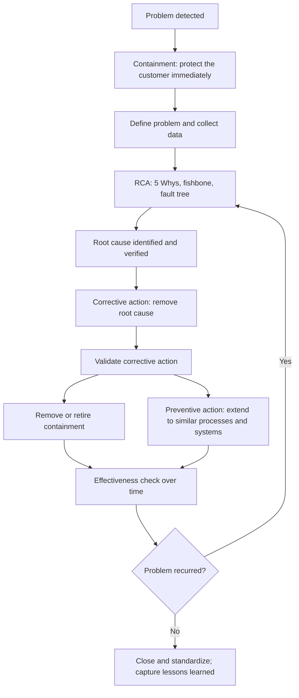
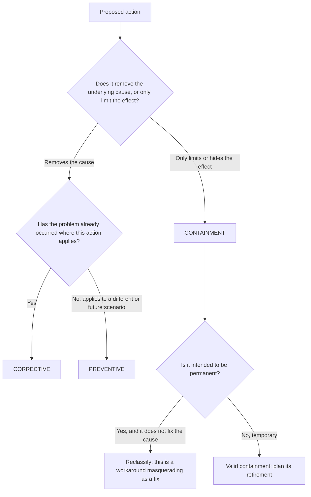

## Differentiating Corrective, Preventive, and Containment Actions


### Overview

Root Cause Analysis (RCA) does not end when a cause is identified. Its value is realized only when the findings translate into **actions** that (a) protect the customer right now, (b) eliminate the cause of the problem that occurred, and (c) prevent similar problems from occurring elsewhere. These three purposes correspond to three distinct categories of action:

| Action Type | Core Question | Target |
| --- | --- | --- |
| **Containment** | "How do we stop the problem from reaching or harming anyone *right now*?" | The **symptom / effect** and its spread |
| **Corrective** | "How do we eliminate the root cause of the problem that *did* occur so it does not recur?" | The **detected root cause** of an existing problem |
| **Preventive** | "How do we eliminate causes of *potential* problems before they occur, in this or other areas?" | A **potential** cause, or the same cause elsewhere |

Confusing these categories is one of the most common failure modes in quality and incident management. Teams frequently implement a containment action, declare the issue "fixed," and close the record, leaving the root cause fully intact. The "5 Whys" technique drives toward root cause; this chapter's distinction determines **what you do with what the 5 Whys finds**.

**Key Points**

- **Containment** manages the *effect*; it is temporary and does not remove the cause.
- **Corrective action** removes the *cause* of an *existing or occurred* nonconformity or incident.
- **Preventive action** removes the cause of a *potential* nonconformity, or applies a learned corrective solution to *similar* processes, products, or systems.
- A complete response to a significant problem typically includes all three, sequenced correctly.
- The categories are defined by **purpose and timing**, not by how large or expensive the action is.

---

### Formal Definitions

The terminology below reflects widely used quality-management vocabulary (for example, the ISO 9000 family and related sector standards). Exact wording varies by standard, industry, and organization, so always confirm against the definitions your governing procedure or standard uses.

#### Containment Action (Correction / Interim Action)

An action taken to **isolate, limit, or neutralize** the effects of a problem while the investigation is underway or the permanent fix is being developed. In ISO 9000 terminology, an action to eliminate a detected nonconformity is called a **correction**, which is the closest formal analogue to containment. Automotive and manufacturing contexts (for example, 8D methodology, where it is the D3 step, "Interim Containment Action") use the term *containment* directly.

Characteristics:

- **Fast**: implemented in hours or days
- **Temporary**: expected to be removed once the permanent corrective action is verified
- **Symptom-focused**: does not address why the problem occurred
- **Often costly to sustain**: typically adds inspection, rework, or manual effort

Examples:

- Quarantining and 100% inspecting suspect inventory
- Rolling back a faulty software release
- Manually failing over traffic to a healthy region
- Issuing a customer advisory or recalling shipped units
- Adding a temporary manual approval gate

#### Corrective Action

An action to **eliminate the cause of a detected nonconformity, incident, or other undesirable situation** in order to **prevent recurrence** (consistent with the ISO 9000 definition of corrective action).

Characteristics:

- **Root-cause-focused**: directly tied to a verified root cause from RCA
- **Permanent**: intended to remain in place
- **Reactive in trigger**: initiated *because a problem already occurred*
- **Verifiable**: effectiveness must be demonstrated over time

Examples:

- Redesigning a fixture so the part can only be inserted in the correct orientation (poka-yoke)
- Adding input validation that eliminates the class of malformed request that caused the outage
- Revising the shift checklist to restore a missing mandatory tool-life check
- Changing the supplier specification and adding incoming material verification

#### Preventive Action

An action to **eliminate the cause of a potential nonconformity or other undesirable potential situation** to **prevent occurrence** (ISO 9000 definition).

Characteristics:

- **Proactive**: the problem has not (yet) occurred in the target area
- **Risk-driven**: triggered by trend data, risk assessment, near-misses, audit findings, lessons learned, or by the discovery that a root cause exists in *other* places
- **Broadening**: extends the learning beyond the original incident

Examples:

- After discovering a tool-life check was dropped from Line A's checklist, auditing Lines B through F and standardizing the checklist template
- Running a failure mode and effects analysis (FMEA) on a new process before launch
- Load-testing services before peak season based on capacity trend data
- Adding an automated linter rule after a near-miss code defect was caught in review

#### A Note on Modern Standards Terminology

Some current management-system standards have shifted vocabulary. For example, ISO 9001:2015 removed the standalone "preventive action" clause and folded the concept into **risk-based thinking** and the **actions to address risks and opportunities** requirement, while retaining **corrective action** as an explicit requirement. Other frameworks (such as regulated medical device and pharmaceutical quality systems) continue to use the combined **CAPA** (Corrective and Preventive Action) term explicitly. [Inference: Which terminology applies depends on the specific standard, regulator, or internal policy governing your organization.]

---

### Comparative Summary

| Dimension | Containment | Corrective | Preventive |
| --- | --- | --- | --- |
| **Primary aim** | Stop impact/spread now | Eliminate root cause of an *occurred* problem | Eliminate cause of a *potential* problem |
| **Addresses root cause?** | No | Yes | Yes (of potential or replicated cause) |
| **Timing** | Immediate (hours/days) | After root cause is verified (days/weeks) | Ongoing / after lessons learned or risk analysis |
| **Trigger** | Detection of a problem | Confirmed problem and verified root cause | Risk assessment, trend, near-miss, similar-process review |
| **Duration** | Temporary | Permanent | Permanent |
| **Scope** | The affected product/service/system | The failed process/system | Other processes, products, sites, or future designs |
| **Typical cost profile** | High recurring cost (labor, inspection) | One-time or modest sustaining cost | Investment up front, avoided cost later |
| **Verification** | Confirm suspect output is contained | Confirm problem does not recur (effectiveness check) | Confirm risk is reduced or problem does not appear |
| **Relation to RCA** | Precedes or runs parallel to RCA | Output of RCA | Extension of RCA learning |
| **Risk if omitted** | Customer harm continues | Problem recurs | Same problem appears elsewhere |
| **Risk if mistaken for the others** | "Fixed" problem returns | Symptom treated as cause | Effort wasted or gaps left |

---

### Sequencing: Where Each Action Fits in the Problem-Solving Timeline



Key sequencing principles:

1. **Contain first.** Do not wait for the RCA to finish before protecting the customer. Containment and investigation run in parallel.
2. **Do not stop at containment.** A closed containment-only record is an open problem.
3. **Verify the corrective action before retiring containment.** Removing containment prematurely re-exposes the customer.
4. **Preventive action follows learning.** The root cause found is the raw material for asking, "Where else could this happen?"
5. **Confirm effectiveness over a defined period**, not just at implementation.

---

### Mapping Actions to the "5 Whys"

A useful mental model: different Why levels tend to suggest different action types.

| Why Level | Nature of the Answer | Typical Action Type |
| --- | --- | --- |
| Problem statement / Why 1 | Immediate, visible effect | **Containment** |
| Why 2–3 | Intermediate or technical cause | Short-term fix or partial corrective action |
| Why 4–5 (root cause) | Systemic / process / management cause | **Corrective action** |
| "Where else does this cause exist?" | Extrapolation beyond the incident | **Preventive action** |

**Example**

Problem: A batch of 500 units shipped with a missing safety label.

| Step | Why / Question | Answer | Action Category |
| --- | --- | --- | --- |
| Problem | Units shipped without safety labels |  |  |
| Immediate response | Stop the impact | Halt shipments; quarantine 1,200 units in the warehouse; recall 500 shipped units; 100% label check | **Containment** |
| Why 1 | Why were unlabeled units shipped? | Final inspection did not catch them |  |
| Why 2 | Why did inspection miss them? | Label presence is a visual check with no forced verification |  |
| Why 3 | Why is there no forced verification? | Label station has no sensor or interlock |  |
| Why 4 | Why was no sensor specified? | Original process design assumed manual placement was reliable |  |
| Why 5 | Why did the design not assess this risk? | The design review process did not require a mistake-proofing review for regulatory labels |  |
| Root cause |  | Design review process lacks a mistake-proofing requirement for regulatory-critical steps |  |
| Fix the cause | Install a vision-system interlock at the label station; add a mistake-proofing checkpoint to the design review procedure |  | **Corrective** |
| Extend the learning | Audit all other lines and products for regulatory-critical manual steps; apply the mistake-proofing checkpoint to all new designs |  | **Preventive** |

**Conclusion**

Only the third row group (corrective and preventive) prevents recurrence. The containment actions protected customers but would have needed to continue indefinitely (at high cost) without the process-level fix.

---

### Classification Test: How to Tell Which Category an Action Belongs To

Ask these questions in order for any proposed action:



**Diagnostic questions**

1. **If we removed this action tomorrow, would the problem return?** If yes, it is containment (or a workaround), not a corrective action.
2. **Does it require ongoing effort to keep working (extra inspection, manual step)?** Likely containment.
3. **Is it tied to a verified root cause from the RCA?** If not, it cannot be classified as corrective.
4. **Is it applied where the failure has *not* occurred?** Likely preventive.
5. **Would it have prevented the original problem if it had existed beforehand?** If yes for the same process, it is the corrective action; if it protects a *different* process with the same weakness, it is preventive.

---

### Common Confusions and How to Resolve Them

#### Confusion 1: Correction vs. Corrective Action

- **Correction** fixes the *nonconforming output* (rework, scrap, repair). It deals with the instance.
- **Corrective action** fixes the *cause* so the nonconformity does not recur.

Example: Reworking 50 defective units is a correction/containment. Changing the process that produced the defects is corrective action.

#### Confusion 2: Workaround Passed Off as Corrective Action

A permanent extra inspection step is not a root-cause fix; it compensates for a process that continues to produce defects. It may be a legitimate **long-term control** while a real fix is engineered, but it should be documented as such and not recorded as a closed corrective action. [Inference: Some organizations formally distinguish "interim controls" from "permanent corrective actions" to avoid this misclassification.]

#### Confusion 3: Corrective vs. Preventive When the Same Fix Is Applied Broadly

- Applied to the process that failed → **corrective**.
- Applied (same or adapted) to *other* processes that have not failed → **preventive**.

The same engineering change can be both, depending on where it is deployed and whether failure has occurred there.

#### Confusion 4: Training as an Action

"Retrain the operator" is usually **weak**, whether labeled corrective or preventive, because human reliability is not a robust control. It is rarely an effective standalone corrective action unless the root cause is genuinely a verified skill or knowledge gap and is accompanied by a system-level change (see Action Strength Hierarchy below).

#### Confusion 5: Detection Controls vs. Cause Elimination

Adding a check that *detects* the defect before it ships reduces escape risk but does not stop the defect from being created. Detection is typically containment-like or a mitigating control, unless it is a mistake-proofing mechanism that makes the error impossible or immediately corrects it.

---

### Action Strength Hierarchy

Not all corrective and preventive actions are equally effective. A widely used concept ranks actions by how much they rely on human vigilance versus system design (adapted from safety and patient-safety literature, including the action hierarchy used in RCA frameworks):

| Strength | Type | Examples |
| --- | --- | --- |
| **Strong** | Architectural / forcing functions, elimination of the hazard, automation, standardization of equipment or process, simplification | Interlocks, poka-yoke, removing the failure mode by design, automated validation that blocks bad input |
| **Intermediate** | Redundancy, software enhancements, checklists with cognitive aids, reduced workload, standardized communication tools | Two-person verification, decision-support prompts, better UI defaults |
| **Weak** | Reliance on individual behavior | Training, warnings, policy reminders, memos, "be more careful" |

**Key Points**

- Prefer strong actions for corrective and preventive work wherever feasible.
- Containment actions are frequently weak or intermediate by nature (manual inspection, sorting), another reason they should not be the final answer.
- A robust action plan often combines a strong systemic fix with supporting intermediate or weak actions.

---

### Domain Examples

#### Software / IT Operations

**Incident:** A deployment caused a 40-minute outage because a database migration locked a critical table.

| Category | Action |
| --- | --- |
| **Containment** | Roll back the release; route traffic to the previous stable version; post a status page notice |
| **Corrective** | Modify the migration approach to use non-locking, online schema changes; add a pre-deployment migration lock-impact check to the CI/CD pipeline that blocks unsafe migrations |
| **Preventive** | Scan all pending and historical migrations across services for the same lock-prone patterns; add the check to the shared pipeline template so every service inherits it; run game-day exercises for migration failures |

#### Manufacturing

**Issue:** Customer complaint for a cracked housing traced to inconsistent injection-molding cooling time.

| Category | Action |
| --- | --- |
| **Containment** | Sort and inspect all stock and in-transit product; add 100% crack inspection at shipping until the fix is verified |
| **Corrective** | Install a process-parameter lock and automatic reject on cooling-time deviation; revise the work instruction |
| **Preventive** | Apply the parameter-lock and monitoring approach to other molding machines and products with critical thermal parameters; add cooling-time verification to the new-product launch checklist |

#### Healthcare / Regulated Environments

**Event:** A medication was administered at the wrong concentration due to look-alike vials.

| Category | Action |
| --- | --- |
| **Containment** | Segregate the affected stock; notify and monitor the affected patient; alert staff immediately |
| **Corrective** | Change the storage and labeling standard (tall-man lettering, physical separation, barcode scanning verification) for the affected medication |
| **Preventive** | Review all look-alike/sound-alike medications across the formulary and apply the same controls; incorporate look-alike screening into the purchasing process |

---

### Structuring Actions in a CAPA Record

A well-formed action record makes classification explicit and auditable.

| Field | Purpose |
| --- | --- |
| **Action ID** | Unique reference for tracking |
| **Linked problem / RCA reference** | Ties the action to the evidence |
| **Action type** | Containment / Corrective / Preventive (explicitly declared) |
| **Description** | Specific, unambiguous statement of what will be done |
| **Root cause addressed** | Which verified cause the action targets (blank or "N/A" for containment) |
| **Owner** | Single accountable person |
| **Due date** | Time-bound commitment |
| **Scope / extent** | Products, sites, systems, or processes covered |
| **Verification method** | How completion will be confirmed |
| **Effectiveness criteria** | Measurable evidence the action worked (e.g., "zero recurrences in 90 days," "process $C_{pk}$ ≥ 1.33") |
| **Effectiveness review date** | When the check occurs |
| **Retirement condition (containment)** | Criteria for removing the temporary measure |
| **Status** | Open / In progress / Implemented / Verified / Closed |

#### Example CAPA Record Skeleton (Markdown Template)

```markdown
### CAPA-2026-0142

- **Problem:** Unlabeled safety units shipped (500 units)
- **RCA reference:** RCA-2026-0142 (5 Whys + fishbone)
- **Root cause:** Design review procedure lacks a mistake-proofing requirement for regulatory-critical steps

| ID | Type | Description | Owner | Due | Effectiveness Criteria |
|----|------|-------------|-------|-----|------------------------|
| A1 | Containment | Quarantine and 100% inspect 1,200 warehouse units; recall shipped units | Ops Manager | Day 2 | 100% of suspect units dispositioned |
| A2 | Corrective | Install vision interlock at label station | Process Eng. | Day 30 | Zero missing labels across 90 days |
| A3 | Corrective | Add mistake-proofing checkpoint to design review procedure | Quality Mgr | Day 45 | Checkpoint present in 100% of subsequent design reviews |
| A4 | Preventive | Audit all lines/products for manual regulatory-critical steps | Quality Eng. | Day 60 | Audit complete; gaps remediated or risk-accepted |
| A5 | Containment retirement | Remove 100% manual label check | Ops Manager | After A2 verified | A2 effectiveness criteria met |
```

---

### Verification vs. Validation vs. Effectiveness

These three checks are distinct and frequently conflated:

| Check | Question | Example |
| --- | --- | --- |
| **Verification** | Was the action implemented as planned? | The interlock is installed and passes commissioning |
| **Validation** | Does the action, as implemented, work as intended under realistic conditions? | Interlock reliably rejects unlabeled units in trial runs |
| **Effectiveness review** | Did the action actually eliminate the problem over time? | No recurrence across the defined monitoring period |

Statistical Process Control ties in directly: after a corrective action, a control chart on the affected characteristic should show the process returning to (or improving on) its baseline. Recurrence signals, such as points beyond control limits or Nelson-rule patterns, indicate the action was ineffective or the true root cause was missed.

$$\text{Recurrence rate} = \frac{\text{Number of recurrences in monitoring period}}{\text{Number of opportunities in monitoring period}}$$

[Inference: The appropriate monitoring period depends on failure frequency; for rare events, longer windows or leading indicators may be needed to draw a meaningful conclusion.]

---

### Common Pitfalls

| Pitfall | Consequence | Mitigation |
| --- | --- | --- |
| Closing the record after containment | Problem recurs; cost of continued containment persists | Require a verified root cause and corrective action before closure |
| Retiring containment too early | Customer re-exposed | Tie retirement to a defined effectiveness criterion |
| Labeling everything "corrective" | Loss of clarity; preventive work never happens | Force explicit classification at record creation |
| Preventive actions with no owner or trigger | Stagnant, never executed | Assign owners and due dates; tie to risk register |
| Relying on training and memos as the fix | Weak control; recurrence | Use the action strength hierarchy; pair with system changes |
| Actions that do not map to a root cause | Effort without impact | Require a documented cause-to-action linkage |
| No effectiveness check | Unknown whether the problem is solved | Define measurable criteria and dates up front |
| Over-scoping preventive action | Resource dilution; nothing completes | Prioritize using risk ranking (severity, occurrence, detection) |
| Under-scoping corrective action | Same cause persists in sibling processes | Ask "where else could this happen?" explicitly |
| Treating a 5 Whys answer at Why 1 as the root cause | Fix targets a symptom | Continue questioning until a systemic, actionable cause is verified |

---

### Prioritizing Preventive Actions with Risk Scoring

Because there are usually more potential problems than resources, preventive actions are often prioritized using a risk model such as FMEA's Risk Priority Number (RPN):

$$\text{RPN} = S \times O \times D$$

where $S$ is severity, $O$ is occurrence likelihood, and $D$ is detection difficulty, each typically scored on a 1 to 10 scale. Higher RPN values indicate higher-priority candidates for preventive action.

[Inference: Some current practice (for example, the harmonized AIAG-VDA FMEA approach) replaces RPN with an Action Priority (AP) ranking that weights severity more heavily; check the methodology your organization or customer requires.]

**Example**

| Failure Mode | S | O | D | RPN |
| --- | --- | --- | --- | --- |
| Missing label on Line B | 9 | 4 | 6 | 216 |
| Wrong label revision on Line C | 7 | 3 | 5 | 105 |
| Label smudge on Line D | 3 | 5 | 2 | 30 |

Preventive effort should focus first on the Line B failure mode.

---

### Implementation Sketch: Tracking Action Types Programmatically

A minimal Python structure for enforcing classification rules in an action-tracking tool:

**Example**

```python
from dataclasses import dataclass
from enum import Enum
from typing import Optional


class ActionType(Enum):
    CONTAINMENT = "containment"
    CORRECTIVE = "corrective"
    PREVENTIVE = "preventive"


@dataclass
class Action:
    action_id: str
    action_type: ActionType
    description: str
    owner: str
    due_date: str
    root_cause_id: Optional[str] = None
    effectiveness_criteria: Optional[str] = None
    retirement_condition: Optional[str] = None


def validate_action(a: Action) -> list[str]:
    """Return a list of rule violations for a proposed action."""
    problems = []

    if a.action_type == ActionType.CORRECTIVE and not a.root_cause_id:
        problems.append("Corrective action must reference a verified root cause.")

    if a.action_type == ActionType.CONTAINMENT and not a.retirement_condition:
        problems.append("Containment action must define a retirement condition.")

    if a.action_type in (ActionType.CORRECTIVE, ActionType.PREVENTIVE) \
            and not a.effectiveness_criteria:
        problems.append("Corrective/preventive action needs measurable effectiveness criteria.")

    return problems


def can_close_case(actions: list[Action]) -> bool:
    """A case should not close with containment only."""
    has_corrective = any(a.action_type == ActionType.CORRECTIVE for a in actions)
    return has_corrective


plan = [
    Action("A1", ActionType.CONTAINMENT, "Quarantine suspect stock", "Ops", "2026-10-01",
           retirement_condition="A2 effectiveness verified"),
    Action("A2", ActionType.CORRECTIVE, "Install vision interlock", "Process Eng", "2026-10-30",
           root_cause_id="RC-17", effectiveness_criteria="0 recurrences in 90 days"),
]

for a in plan:
    print(a.action_id, validate_action(a))
print("Can close:", can_close_case(plan))
```

**Output**

```text
A1 []
A2 []
Can close: True
```

[Inference: Real systems typically add workflow states, approvals, and audit trails; this sketch only illustrates enforcing classification rules.]

---

### Best Practices Checklist

- Declare the **action type explicitly** on every record.
- Start containment **immediately**, before the RCA is complete.
- Tie every corrective action to a **verified root cause** (evidence, not assumption).
- Ask "**where else?**" after every corrective action to seed preventive work.
- Prefer **strong, system-level** actions over training and reminders.
- Define **measurable effectiveness criteria** and review dates before implementation.
- Define **retirement conditions** for every containment action.
- Use **control charts** and trend data to verify effectiveness objectively.
- Assign a **single owner** and due date per action.
- Capture **lessons learned** in a shared repository so preventive learning compounds.
- Review CAPA metrics (recurrence rate, on-time closure, effectiveness pass rate) at management review.

---

**Related Topics**

- Designing effective corrective actions and the action strength hierarchy in depth
- Verifying root causes before acting (hypothesis testing and evidence standards)
- Effectiveness checks and closing the loop on CAPA
- 8D problem-solving methodology (D3 interim containment, D5 to D7 corrective and preventive)
- Poka-yoke and mistake-proofing design principles
- FMEA and risk-based prioritization for preventive action
- Lessons learned and knowledge management for horizontal deployment
- CAPA in regulated environments (medical devices, pharmaceuticals, aerospace, automotive)
- Using control charts to verify corrective action effectiveness
- Change management and control for implementing corrective actions safely