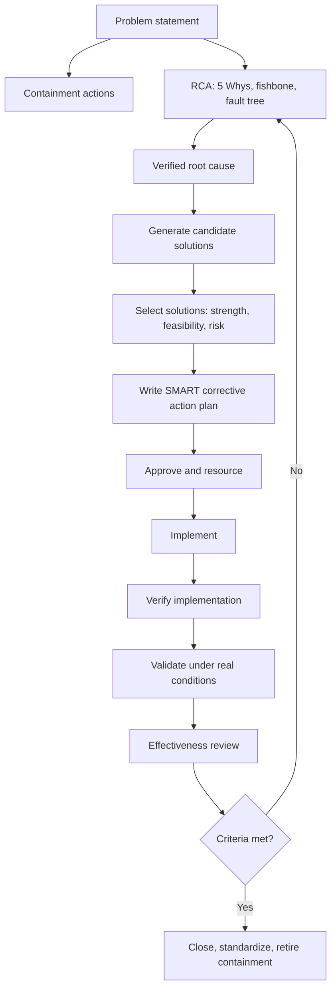
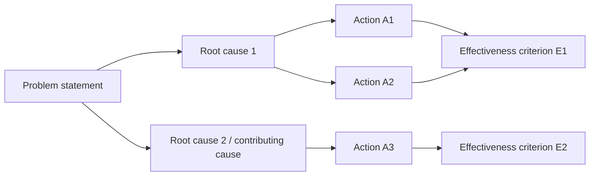
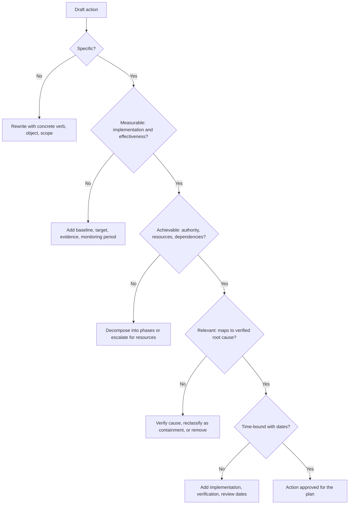

## Writing SMART Corrective Action Plans


### Overview

A corrective action plan (CAP) is the document that converts the output of Root Cause Analysis into accountable, executable work. The RCA and the "5 Whys" identify *why* a problem occurred; the corrective action plan defines *what will be changed*, *by whom*, *by when*, and *how anyone will know it worked*.

The most common failure in corrective action is not a flawed analysis but a flawed plan: vague commitments ("improve communication"), missing owners, open-ended deadlines, and no measure of success. Such plans cannot be executed consistently, cannot be audited, and cannot be verified. The **SMART** framework provides a discipline for writing actions that are specific enough to execute and measurable enough to verify.

**SMART** is an acronym that, in its most widely cited form, stands for:

| Letter | Criterion | Core Question |
| --- | --- | --- |
| **S** | Specific | What exactly will be done, where, and to what? |
| **M** | Measurable | How will completion and effectiveness be quantified? |
| **A** | Achievable | Can it realistically be done with available authority, skills, and resources? |
| **R** | Relevant | Does it directly address the verified root cause? |
| **T** | Time-bound | By when will it be implemented and verified? |

[Inference: Several SMART variants exist in practice, for example Assignable, Actionable, Realistic, or Results-oriented in place of the A and R terms. The precise wording is not standardized; what matters is that the plan satisfies the intent of all five properties.]

**Key Points**

- SMART is a **quality test applied to each action line**, not a template for the whole report.
- **Relevance** is the criterion that ties the plan back to RCA: an action that does not address a verified root cause is not a corrective action, however well written.
- SMART must be applied to **two things**: the *implementation* of the action and the *effectiveness* criteria that prove it worked.
- A plan can be perfectly SMART and still be **weak** (for example, "retrain all operators by Friday"). SMART tests clarity and accountability; the action strength hierarchy tests durability.

---

### Where the Corrective Action Plan Fits in the RCA Workflow



The plan is written **after** the root cause is verified and **before** implementation begins. Writing it earlier usually results in actions aimed at symptoms; writing it later results in undocumented, unaccountable changes.

---

### Applying Each SMART Criterion

#### S: Specific

A specific action states **what** changes, **where**, **on what**, and to what **standard**. A reader who was not part of the investigation should be able to tell exactly what will exist after the action that did not exist before.

Elements of specificity:

- **Object:** the system, process, document, equipment, or component being changed
- **Change:** the concrete modification (add, remove, replace, redesign, automate)
- **Location/scope:** which line, site, service, product family, or team
- **Standard:** the requirement the change must satisfy

| Weak (Vague) | Strong (Specific) |
| --- | --- |
| Improve the deployment process | Add an automated pre-deployment check to the CI pipeline for all production services that blocks any database migration acquiring an exclusive table lock |
| Fix the label problem | Install a vision-system interlock at Label Station 3 on Line B that halts the conveyor when the safety label is absent or misaligned |
| Be more careful with reviews | Add a mandatory mistake-proofing checkpoint (form DR-14) to the design review procedure for every regulatory-critical process step |
| Communicate better with suppliers | Revise purchase specification PS-220 to require a certificate of analysis for each lot of resin, and add incoming verification of melt index at receiving |

**Test for specificity:** Could two different people read the action and implement materially different things? If yes, it is not specific enough.

Language guidance:

- Use **concrete verbs**: install, revise, replace, automate, add, remove, validate, configure.
- Avoid **fuzzy verbs**: improve, enhance, review, consider, look into, ensure, strengthen, address.
- "Review" and "ensure" are acceptable only when the deliverable of the review is itself defined (for example, "Complete a documented audit of all six lines against checklist AC-03").

#### M: Measurable

Measurability applies at two levels, and both must be defined:

1. **Implementation measure:** Was the action completed? (Binary or percentage completion)
2. **Effectiveness measure:** Did the action eliminate or sufficiently reduce the problem? (Outcome metric)

| Level | Question | Example Measure |
| --- | --- | --- |
| **Implementation** | Is it done? | Interlock installed and commissioned; procedure revision approved and released; 100% of affected staff signed off |
| **Effectiveness (lagging)** | Did the problem stop? | Zero missing-label escapes over 90 consecutive production days |
| **Effectiveness (leading)** | Is the control functioning? | Interlock rejects 100% of seeded test failures; rejection log reviewed weekly |
| **Process performance** | Is the process stable and capable? | Control chart shows no special-cause signals for 25 consecutive subgroups; $C_{pk} \geq 1.33$ |

Useful measurement forms:

- **Counts:** number of recurrences, number of failed checks
- **Rates:** defects per million opportunities, error rate per 1,000 transactions
- **Percentages:** completion percentage, compliance rate
- **Time-based:** mean time to detect, mean time to resolve
- **Binary evidence:** approved document exists, configuration enabled in production

A simple recurrence measure:

$$\text{Recurrence rate} = \frac{\text{Recurrences in monitoring period}}{\text{Opportunities in monitoring period}}$$

For an effectiveness target expressed against a baseline defect proportion $p_0$ and a post-action proportion $p_1$, the relative reduction is:

$$\text{Relative reduction} = \frac{p_0 - p_1}{p_0} \times 100\%$$

**Example**

Baseline defect proportion $p_0 = 0.045$ (4.5%). Post-action proportion $p_1 = 0.009$ (0.9%).

$$\text{Relative reduction} = \frac{0.045 - 0.009}{0.045} \times 100\% = 80\%$$

**Key Points**

- Establish a **baseline** before the action is implemented. Without a baseline, an improvement cannot be demonstrated.
- Choose measures that reflect the **problem**, not just activity. "Training delivered to 100% of staff" measures activity; "zero recurrence" measures outcome.
- Where events are rare, a short monitoring window may not be informative. [Inference: For rare events, combine lagging measures with leading indicators (such as test-case pass rates or control-function checks) rather than relying on absence of events alone.]
- Where the characteristic is continuous, use a **control chart** to distinguish real improvement from common-cause variation.

#### A: Achievable

An achievable action is one the owner **has the authority, skills, budget, and time** to complete. Achievability protects the plan from becoming a wish list.

Assess achievability against:

| Factor | Question |
| --- | --- |
| **Authority** | Does the owner control the process, or must someone else approve changes? |
| **Resources** | Are budget, tooling, and personnel available? |
| **Skills** | Does the owner or team have the necessary expertise? |
| **Dependencies** | What must be finished first (vendor delivery, change window, regulatory approval)? |
| **Risk** | Could the change itself introduce new failure modes? |
| **Capacity** | Does the owner have bandwidth alongside other commitments? |

Achievability is **not** a license to choose only easy or weak actions. When the right fix is large, the plan should either break it into achievable phases with an interim control, or escalate for resources and authority.

**Example: Splitting an unachievable action**

| Not Achievable as Written | Achievable Decomposition |
| --- | --- |
| "Replace the entire legacy ERP within 30 days" | (1) Within 7 days, add a manual duplicate-order check as **containment**; (2) within 30 days, implement an automated validation rule in the existing ERP as an **interim corrective control**; (3) within 12 months, complete ERP replacement under a separately funded project with its own plan |

**Key Points**

- Phased plans should label each phase's category (containment, interim control, permanent corrective) so a temporary measure is never mistaken for the final fix.
- If an action requires resources the owner cannot commit, the plan should identify the **approver** and record the escalation.

#### R: Relevant

Relevance is the criterion most specific to corrective action and the one most often skipped. A relevant action **directly addresses a verified root cause** (or a verified contributing cause) identified by the RCA. It answers: "If this action were fully implemented, would it prevent the causal chain we documented from occurring again?"

Traceability practice:



Every action should trace **backward** to a cause and **forward** to an effectiveness criterion. Actions with no upstream cause are "orphan actions"; causes with no action are "unaddressed causes."

| Relevance Check | Result |
| --- | --- |
| Action maps to a verified root cause | Relevant |
| Action maps only to a symptom | Containment, not corrective |
| Action maps to an unverified hypothesis | Not yet justified; verify the cause first |
| Action is unrelated to the documented cause chain | Remove, or treat as separate improvement work |

**Relevance vs. Strength:** An action can be relevant yet weak. For example, "retrain operators" may relate to a cause involving a knowledge gap, but if the deeper root cause is a missing process control, training alone will not prevent recurrence. Evaluate relevance first, then strength.

#### T: Time-bound

Every action requires **calendar-specific deadlines**, not open-ended phrases. Time-boundedness should cover three points:

1. **Implementation due date**
2. **Verification/validation date**
3. **Effectiveness review date** (after enough operating time to observe results)

| Weak | Strong |
| --- | --- |
| "As soon as possible" | "Complete by 2026-11-06" |
| "Ongoing" | "Review monthly; first review 2026-11-30; effectiveness assessment 2027-02-28" |
| "After the next release" | "Within 5 business days of release 4.2 deployment, not later than 2026-12-15" |
| "Soon" | "Within 30 calendar days of plan approval" |

Guidance for setting deadlines:

- Tie deadlines to **risk**: high-severity issues warrant short interim controls and tight permanent-fix dates.
- Include **milestones** for long actions so slippage is visible early.
- Ensure the **effectiveness review window** is long enough to observe the failure mode. [Inference: The appropriate window depends on how frequently the original problem occurred. A failure that occurred roughly once a quarter cannot be judged effective after two weeks.]
- Define a **deadline-extension procedure** (who may approve, with what justification), so slippage is managed rather than silent.

---

### Beyond SMART: Elements a Complete Corrective Action Plan Needs

SMART governs the quality of individual action statements. A full plan also needs supporting structure.

| Element | Purpose |
| --- | --- |
| **Problem statement** | Concise, quantified description of what went wrong (what, where, when, extent) |
| **Reference to RCA** | Links to evidence, analysis, and verified root cause |
| **Root cause statement(s)** | Explicit causes the plan addresses |
| **Containment status** | Interim actions in place, and conditions for retirement |
| **Action list** | The SMART actions, each with owner and due date |
| **Risk assessment of the change** | What could the corrective action itself break? |
| **Resource requirements** | Budget, tooling, personnel |
| **Communication plan** | Who must be informed and when |
| **Verification/validation plan** | How implementation and function will be confirmed |
| **Effectiveness plan** | Metrics, baseline, target, monitoring period, reviewer |
| **Approval** | Sponsor or authority sign-off |
| **Status tracking** | Open, in progress, implemented, verified, closed |

---

### Writing Action Statements: A Repeatable Pattern

A reliable structure for an action line:

> **[Owner]** will **[concrete verb + object + change]** at **[scope/location]** to meet **[standard]** by **[date]**, demonstrated by **[implementation evidence]**, with success measured by **[effectiveness criterion]** over **[monitoring period]**.

**Example**

> **The Process Engineering Manager** will **install and commission a vision-system interlock** at **Label Station 3 on Line B** so the conveyor **halts on any missing or misaligned safety label** by **2026-11-13**, demonstrated by **a signed commissioning record showing 100% rejection of 30 seeded test failures**, with success measured by **zero missing-label escapes** over **90 consecutive production days ending 2027-02-11**.

#### Before-and-After Rewrites

| # | Weak Action | SMART Rewrite |
| --- | --- | --- |
| 1 | "Improve monitoring." | "Platform SRE lead will add an alert on p95 API latency > 800 ms sustained for 5 minutes for the checkout service, routed to the on-call rotation, by 2026-10-16. Success: alert fires in 100% of three simulated latency-injection tests, and mean time to detect for latency incidents is ≤ 5 minutes over the next 90 days." |
| 2 | "Train staff on the new procedure." | "Quality Manager will revise work instruction WI-088 to add step 7 (tool-life counter check) and add the check as a mandatory field in the shift checklist by 2026-10-30. Verification: 100% of shift checklists in the 30 days after release contain a completed step-7 entry; effectiveness: zero out-of-tolerance escapes traced to tool wear over 90 days." |
| 3 | "Ensure suppliers meet requirements." | "Supplier Quality Engineer will issue revision C of supplier specification PS-220 requiring a lot-level certificate of analysis for melt index, and implement receiving-inspection verification on every lot, by 2026-11-20. Effectiveness: ≥ 99% of lots arrive with a compliant certificate and zero lots fail melt index in-process over 6 months." |
| 4 | "Look into why data was lost." | "Database Reliability Engineer will enable point-in-time recovery with 5-minute granularity on the orders database and complete a documented restore test to a prior timestamp by 2026-10-23. Effectiveness: restore test recovers data within 15 minutes and is repeated quarterly." |

---

### Worked Example: From RCA to SMART Plan

**Example**

**Problem statement:** Between 2026-08-01 and 2026-08-14, 3.1% of customer orders (up from a 0.4% baseline) were shipped to an outdated address because address changes made in the customer portal were not propagated to the fulfillment system.

**Verified root cause (from 5 Whys):** The nightly synchronization job silently skips records when the address payload exceeds a field-length limit in the fulfillment system, and no alert exists for skipped records.

**Containment (already in place):**

| ID | Action | Retirement Condition |
| --- | --- | --- |
| C1 | Manually compare portal and fulfillment addresses for all open orders daily | Retire after A1 and A2 are validated and 14 days of clean sync reports |

**Corrective actions:**

| ID | Action | Root Cause Addressed | Owner | Due | Implementation Evidence | Effectiveness Criterion |
| --- | --- | --- | --- | --- | --- | --- |
| A1 | Modify the sync job to fail loudly (nonzero exit and pager alert) on any skipped record, instead of silently continuing | No alert for skipped records | Integration Engineer | 2026-10-09 | Code merged; alert fires in 3 of 3 injected-failure tests | Zero silent skips; 100% of skipped records generate an alert within 10 minutes |
| A2 | Align the field-length limit and add input validation at the portal so payloads exceeding the fulfillment system limit are rejected at entry with a user message | Payload exceeds field limit | Portal Lead Developer | 2026-10-16 | Validation deployed; boundary tests pass | Zero sync skips caused by length over 90 days |
| A3 | Add a daily reconciliation report comparing portal and fulfillment addresses, reviewed by Order Operations each morning | Detection gap | Order Operations Manager | 2026-10-23 | Report live; first 5 reports reviewed and signed | Mismatch rate ≤ 0.1% for 90 consecutive days |

**Preventive action:**

| ID | Action | Owner | Due | Effectiveness Criterion |
| --- | --- | --- | --- | --- |
| P1 | Audit all other portal-to-backend sync jobs (7 identified) for silent-skip behavior and field-limit mismatches; remediate or record risk acceptance | Engineering Manager | 2026-11-27 | Audit complete for 7 of 7 jobs; all high-risk findings remediated |

**Effectiveness review:** 2027-01-15, comparing the wrong-address shipment rate against the 0.4% baseline. Target: ≤ 0.4% sustained, with a control chart showing no special-cause signals.

**Output**

The plan is SMART at the line level: each action has a named owner, a concrete change, a date, implementation evidence, and a measured outcome. It traces to a single verified root cause and includes a preventive extension and a containment retirement condition.

**Conclusion**

Note the root cause has two contributing elements (silent failure and length mismatch). The plan addresses both plus the detection gap, rather than fixing only the most visible symptom.

---

### Checking a Plan: SMART Review Checklist

Apply this checklist to each action line.

| Criterion | Pass Test |
| --- | --- |
| **Specific** | Two people would implement it the same way; object, change, scope, and standard are named |
| **Measurable** | Both an implementation measure and an effectiveness measure are defined, with a baseline and a target |
| **Achievable** | Owner has authority, resources, and skills; dependencies are identified |
| **Relevant** | Traces to a verified root cause; would have prevented the documented causal chain |
| **Time-bound** | Calendar dates exist for implementation, verification, and effectiveness review |
| **Owner** | Exactly one accountable person (not a team or department) |
| **Category** | Explicitly labeled containment, corrective, or preventive |
| **Strength** | Prefers strong or intermediate controls over training and reminders alone |
| **Side effects** | Change risk assessed; no new hazards introduced |



---

### Common Pitfalls

| Pitfall | Why It Fails | Remedy |
| --- | --- | --- |
| Vague verbs ("improve," "ensure," "review") | Cannot be executed or verified consistently | Use concrete verbs and define deliverables |
| Effectiveness criterion = "action completed" | Measures activity, not whether the problem stopped | Add an outcome metric with a baseline |
| No baseline | Improvement cannot be demonstrated | Capture pre-action performance |
| Team or department as owner | Diffused accountability | Assign a single named owner |
| Open-ended deadlines | Actions drift indefinitely | Use calendar dates and milestones |
| Effectiveness review too soon | Rare failures not yet observable | Set monitoring window based on failure frequency |
| Action not linked to a verified cause | Effort wasted on symptoms | Require cause-to-action traceability |
| Relying on training or memos alone | Weak, human-dependent control | Pair with system-level change |
| Overloaded plan (dozens of actions) | Nothing completes; focus lost | Prioritize by impact on root cause; defer or separate the rest |
| Ignoring the risk of the fix | Creates new problems | Perform change-risk assessment |
| Closing on implementation | Unknown whether it worked | Require effectiveness review before closure |
| Retiring containment with no criteria | Customer re-exposed, or containment lingers | Define explicit retirement conditions |
| Unrealistic ambition | Plans become fiction | Apply the achievability test; phase the work |
| Copy-paste actions across incidents | Actions don't match the specific cause | Derive each action from the specific RCA |

---

### Governance: Tracking and Reporting

Corrective action plans should be managed, not merely filed.

Suggested practices:

- **Central register:** All actions tracked in a system of record with status, owner, due date, and evidence links.
- **Regular review cadence:** Weekly for high-severity items, monthly for routine.
- **Escalation rules:** Automatic escalation when actions are overdue by a defined interval.
- **Metrics:** On-time completion rate, average time to close, effectiveness pass rate, recurrence rate, and count of overdue actions.
- **Audit trail:** Record changes to scope, owner, or dates, including justification.

Useful program metrics:

$$\text{On-time completion rate} = \frac{\text{Actions completed by due date}}{\text{Actions due in period}} \times 100\%$$


$$\text{Effectiveness pass rate} = \frac{\text{Actions meeting effectiveness criteria at review}}{\text{Actions reviewed}} \times 100\%$$

A high on-time completion rate paired with a low effectiveness pass rate is a diagnostic signal: the organization is finishing actions but choosing the wrong ones (or weak ones), which points back to RCA quality and action strength.

---

### Implementation Sketch: Validating SMART Fields Programmatically

A small script can enforce structural SMART properties on an action register. It cannot judge whether an action is *truly* specific or relevant, but it can catch missing fields, vague verbs, and undated commitments.

**Example**

```python
import re
from dataclasses import dataclass
from datetime import date
from typing import Optional

VAGUE_VERBS = {"improve", "ensure", "review", "consider", "look into",
               "strengthen", "enhance", "address", "monitor"}

@dataclass
class CorrectiveAction:
    action_id: str
    statement: str
    owner: str
    root_cause_id: Optional[str]
    due_date: Optional[date]
    implementation_evidence: Optional[str]
    effectiveness_criterion: Optional[str]
    baseline: Optional[str]
    review_date: Optional[date]


def check_smart(a: CorrectiveAction) -> list[str]:
    issues = []

    # Specific: flag vague leading verbs
    first_words = " ".join(a.statement.lower().split()[:3])
    for verb in VAGUE_VERBS:
        if re.search(rf"\b{verb}\b", first_words):
            issues.append(f"Specific: statement begins with vague verb '{verb}'.")
            break

    # Measurable
    if not a.implementation_evidence:
        issues.append("Measurable: no implementation evidence defined.")
    if not a.effectiveness_criterion:
        issues.append("Measurable: no effectiveness criterion defined.")
    if not a.baseline:
        issues.append("Measurable: no baseline recorded.")

    # Relevant
    if not a.root_cause_id:
        issues.append("Relevant: action not linked to a verified root cause.")

    # Time-bound
    if not a.due_date:
        issues.append("Time-bound: no implementation due date.")
    if not a.review_date:
        issues.append("Time-bound: no effectiveness review date.")
    elif a.due_date and a.review_date <= a.due_date:
        issues.append("Time-bound: review date must be after implementation date.")

    # Owner (single accountable person heuristic)
    if not a.owner or any(sep in a.owner for sep in (",", "/", " and ")):
        issues.append("Owner: assign exactly one accountable person.")

    return issues


action = CorrectiveAction(
    action_id="A1",
    statement="Improve the sync job monitoring",
    owner="Integration Team",
    root_cause_id=None,
    due_date=date(2026, 10, 9),
    implementation_evidence=None,
    effectiveness_criterion=None,
    baseline=None,
    review_date=None,
)

for issue in check_smart(action):
    print("-", issue)
```

**Output**

```text
- Specific: statement begins with vague verb 'improve'.
- Measurable: no implementation evidence defined.
- Measurable: no effectiveness criterion defined.
- Measurable: no baseline recorded.
- Relevant: action not linked to a verified root cause.
- Time-bound: no effectiveness review date.
```

Note that "Integration Team" passes the simple owner heuristic because it contains no separator, illustrating a limitation: automated checks catch structure but not semantics. Human review remains necessary. [Inference: Real tools typically combine field validation with reviewer sign-off rather than attempting to automate judgment.]

---

### Templates

#### Corrective Action Plan Header (Markdown)

```markdown
## Corrective Action Plan: <Problem Title>

- **Plan ID:** CAP-YYYY-NNNN
- **Problem statement:** <what, where, when, extent, quantified>
- **RCA reference:** <link to RCA record and evidence>
- **Verified root cause(s):** <RC1, RC2>
- **Sponsor / approver:** <name, role>
- **Date approved:** <YYYY-MM-DD>

### Containment

| ID | Action | Owner | Status | Retirement Condition |
|----|--------|-------|--------|----------------------|

### Corrective Actions

| ID | Action (SMART) | Root Cause | Owner | Due | Evidence | Effectiveness Criterion | Baseline | Review Date | Status |
|----|----------------|------------|-------|-----|----------|-------------------------|----------|-------------|--------|

### Preventive Actions

| ID | Action (SMART) | Scope | Owner | Due | Effectiveness Criterion | Review Date | Status |
|----|----------------|-------|-------|-----|-------------------------|-------------|--------|

### Change Risk Assessment

| Action ID | Potential Adverse Effect | Mitigation |
|-----------|--------------------------|------------|

### Effectiveness Review

- **Metric(s):** 
- **Baseline:** 
- **Target:** 
- **Monitoring period:** 
- **Reviewer:** 
- **Result:**
```

---

### Best Practices Summary

- Write actions **after** the root cause is verified, and trace every action to a cause.
- Use **concrete verbs** and define deliverables and standards.
- Define **both implementation and effectiveness measures**, with a baseline and a target.
- Assign **one owner** and **calendar dates** for implementation, verification, and effectiveness review.
- Test **achievability** honestly; phase large fixes and label interim controls as such.
- Prefer **strong, system-level** controls; treat training and reminders as supporting measures.
- Assess **the risk of the change** before implementing it.
- Pair corrective actions with **preventive extension** ("where else could this occur?") and a **containment retirement condition**.
- **Do not close** a plan on implementation alone; close on demonstrated effectiveness.
- Track program-level metrics to detect systemic weaknesses in RCA or action selection.

---

**Related Topics**

- Action strength hierarchy and selecting robust solutions
- Verifying root causes before writing actions
- Effectiveness checks and closing the loop on CAPA
- Differentiating corrective, preventive, and containment actions
- Using control charts and capability analysis to verify improvement
- Change risk assessment and change control for corrective actions
- Poka-yoke and mistake-proofing design
- Assigning ownership and accountability (RACI) in action plans
- Horizontal deployment of lessons learned
- CAPA metrics, dashboards, and management review