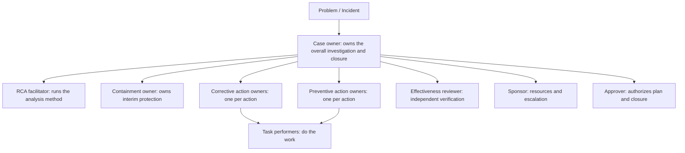
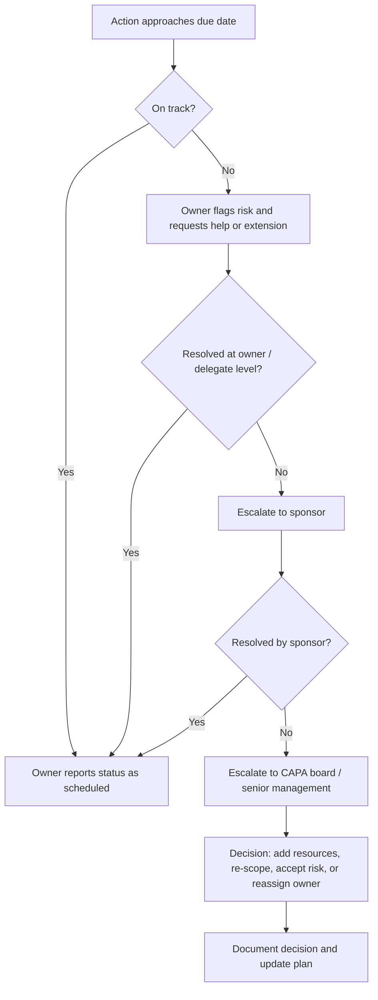

## Assigning Ownership and Accountability


### Overview

A corrective or preventive action with no clear owner is, in practice, an action that will not be completed. Root Cause Analysis (RCA) and the "5 Whys" can identify the correct cause and the correct fix, but the organization's ability to convert that finding into a real change depends on **who is answerable for making it happen, who has the authority to do so, and how progress is made visible**.

Ownership and accountability address a set of recurring failure modes in CAPA programs:

- Actions assigned to "the team," "Engineering," or "everyone," so no individual feels responsible
- Owners named without the **authority** or **resources** to execute
- Actions overdue with no escalation path
- Owners changing (reorganization, attrition) with no handover, orphaning actions
- Blame-oriented cultures that discourage honest RCA and cause owners to conceal problems
- Confusion between who *does* the work, who *decides*, and who is *ultimately answerable*

This topic covers how to define roles, assign owners, distribute responsibility using structured models (such as RACI), grant matching authority, establish escalation and governance, and sustain accountability without undermining the just, blame-free culture that effective RCA depends on.

**Key Points**

- **Responsibility** is doing the work; **accountability** is being answerable for the outcome. They can, and often should, sit with different people.
- Every action needs **exactly one accountable owner**, a named individual rather than a team or department.
- **Accountability without authority** is a setup for failure; **authority without accountability** is a governance risk.
- Accountability should focus on **system outcomes and follow-through**, not on assigning personal blame for the original event.
- Ownership must be **maintained over time**: reassigned on turnover, escalated on slippage, and closed only on demonstrated effectiveness.

---

### Core Definitions

| Term | Definition | Practical Implication |
| --- | --- | --- |
| **Ownership** | Being the single named person who drives an action or problem from assignment to verified closure | One name per action; owner tracks status and unblocks issues |
| **Responsibility** | Obligation to perform a task | Multiple people may share responsibility for parts of the work |
| **Accountability** | Being answerable for the result and for reporting on it | Exactly one person; cannot be split without diluting it |
| **Authority** | The right to make decisions and commit resources | Must be sufficient for the action assigned |
| **Sponsor** | Senior person who provides resources, removes obstacles, and receives escalations | Typically a manager or director above the owner |
| **Approver** | Person or body that authorizes plans and closure | May be a CAPA board, quality authority, or change-control board |
| **Stakeholder** | Anyone affected by the action or its outcome | Must be consulted or informed |
| **Delegate** | Person authorized to act in the owner's absence | Named in advance to prevent orphaned actions |

**Owner vs. Doer**

The owner is not necessarily the person who performs every task. A production manager may own an action to install an interlock while a maintenance technician and a vendor perform the installation. The owner remains answerable for completion and for reporting status.

---

### Levels of Ownership in an RCA and CAPA Lifecycle

Ownership exists at several levels. Confusing them is a common cause of gaps.



| Level | Owner Role | Typical Responsibilities |
| --- | --- | --- |
| **Case / problem** | Case owner (often a quality or engineering lead, or incident commander in IT) | Coordinates the whole effort; ensures a verified root cause and a complete plan; drives closure |
| **Investigation** | RCA facilitator | Leads the structured analysis; ensures evidence-based whys; remains neutral |
| **Containment** | Containment owner | Implements and maintains interim controls; defines retirement criteria |
| **Each action** | Action owner | Implements one specific action; reports status; provides evidence |
| **Verification** | Effectiveness reviewer | Independently assesses whether criteria were met |
| **Governance** | Sponsor and approver | Resources, escalation handling, plan approval, closure authorization |

**Independence principle:** Wherever practical, the person verifying effectiveness should not be the same person who implemented the action, to reduce confirmation bias. [Inference: In small teams, strict independence may not be feasible; a peer or manager review can serve as a compensating control.]

---

### Principles for Assigning an Owner

#### 1. One Name Per Action

Assign a single, named individual to each action, not a role alone, department, or committee.

| Weak | Strong |
| --- | --- |
| "Quality Team" | "J. Rivera, Quality Manager" |
| "Engineering" | "M. Okafor, Platform Engineering Lead" |
| "Ops and IT" | "S. Tanaka, IT Operations Manager (with Ops liaison: P. Singh as Responsible for procedure updates)" |

If two people seem jointly accountable, the action is usually too large. Split it into two actions, each with a single owner.

#### 2. Match Authority to Accountability

An owner must be able to:

- Change the process, system, document, or equipment in question
- Commit the budget and personnel required (or secure them from a named approver)
- Coordinate across boundaries when the fix crosses departments

If an action spans functions, either assign it to the person with authority over the primary change and formally require the other functions' support (via the sponsor), or split it so each function owns its portion.

#### 3. Assign to the Process Owner Where Possible

The person who owns the process is usually best positioned to change it and to sustain the change. Assigning fixes to someone outside the process, such as a quality auditor "fixing" a production procedure, often results in changes that are not adopted.

#### 4. Confirm Acceptance

Ownership should be **explicitly accepted**, not merely assigned. A person who first learns of an action through an automated notification may not consider it theirs. Record acceptance (acknowledgment in the tracking system or sign-off in the plan).

#### 5. Consider Capacity

Overloaded owners are a leading cause of overdue actions. Before assigning, check the owner's current CAPA load and competing commitments.

#### 6. Name a Delegate

Designate a backup so that vacations, illness, or turnover do not orphan the action.

#### Owner Selection Checklist

| Question | Desired Answer |
| --- | --- |
| Is the owner a named individual? | Yes |
| Does the owner control the process or system being changed? | Yes, or has a sponsor who does |
| Does the owner have or can obtain the required resources? | Yes |
| Does the owner have the necessary skill or access to it? | Yes |
| Has the owner accepted the assignment? | Yes, recorded |
| Is the owner's workload realistic? | Yes |
| Is a delegate named? | Yes |
| Is the owner independent of verification (for the effectiveness review)? | Yes, where practical |

---

### Responsibility Assignment Models

Structured models make roles explicit, particularly for cross-functional actions.

#### RACI

RACI is a widely used responsibility assignment matrix. Its four roles:

| Letter | Role | Meaning | Rule |
| --- | --- | --- | --- |
| **R** | Responsible | Performs the work | One or more per task |
| **A** | Accountable | Ultimately answerable; approves the work; owns the outcome | **Exactly one** per task |
| **C** | Consulted | Provides input before decisions (two-way communication) | As needed |
| **I** | Informed | Kept updated on progress or outcome (one-way communication) | As needed |

Rules for a valid RACI:

- Every task has **exactly one A**.
- Every task has **at least one R**. The A may also be an R.
- Keep the C and I lists short; too many consulted parties slows decisions.

**Example**

Action: Install a vision-system interlock at Label Station 3.

| Task / Activity | Process Eng. Manager | Maintenance Tech | Vision Vendor | Quality Manager | Ops Manager | Regulatory Affairs |
| --- | --- | --- | --- | --- | --- | --- |
| Approve interlock specification | **A** | C | C | C | C | I |
| Install and wire hardware | A | **R** | **R** | I | I |  |
| Commission and validate | **A/R** | R | R | C | I | I |
| Update work instruction | A | I |  | **R** | C | I |
| Effectiveness review | I |  |  | **A/R** | I | I |

[Inference: Here the Quality Manager is both accountable and responsible for the effectiveness review, which is intentional to preserve independence from the implementation owner.]

#### Variants

| Model | Expansion | Notes |
| --- | --- | --- |
| **RASCI** | Adds **S** (Supportive) for those who provide resources or assistance | Useful when support roles need explicit recognition |
| **RACI-VS** | Adds Verifies and Signs off | Emphasizes quality review roles |
| **DACI** | Driver, Approver, Contributors, Informed | Oriented toward decision-making rather than task execution |
| **RAPID** | Recommend, Agree, Perform, Input, Decide | Decision-rights framework used for complex organizational decisions |
| **RASI / PARIS** | Various rearrangements | Similar intent; naming varies by organization |

[Inference: Acronym expansions for the less common variants differ among sources; use the definitions adopted by your organization.]

#### Choosing a Model

| Situation | Suggested Approach |
| --- | --- |
| Single-function fix with a clear owner | Simple owner + due date; RACI likely unnecessary |
| Cross-functional action with several contributors | RACI |
| Decision-heavy actions (for example, selecting among design options) | DACI or RAPID |
| Regulated CAPA requiring approvals and independent verification | RACI with explicit approver and verifier roles |

---

### Ownership Across Action Types

| Action Type | Typical Owner | Special Considerations |
| --- | --- | --- |
| **Containment** | Operations lead, incident commander, or the person with immediate control of the affected output | Speed matters; ownership must be assigned within hours; retirement criteria and owner for retirement must be named |
| **Corrective** | Process owner for the failed process | Must trace to a verified root cause; authority to change the process is essential |
| **Preventive** | Owner of the *other* process, product, or system being protected | Often distinct from the corrective owner; requires cross-functional sponsorship |
| **Effectiveness review** | Independent reviewer (quality function, peer, or manager) | Independence and objectivity |
| **Lessons learned / horizontal deployment** | Knowledge management or a designated coordinator | Requires a mechanism to reach other teams |

Preventive actions are frequently orphaned because the target process owner did not experience the original problem and sees little urgency. The sponsor should explicitly assign the preventive actions and hold owners to them through the same governance as corrective actions.

---

### Accountability Structures and Governance

#### Ownership Documentation Elements

Each action record should capture:

| Field | Purpose |
| --- | --- |
| **Owner (named individual)** | Single point of accountability |
| **Delegate** | Backup when the owner is unavailable |
| **Sponsor** | Escalation contact and resource provider |
| **Approver** | Authorizes plan and closure |
| **Date assigned / date accepted** | Confirms acknowledgment |
| **Due dates and milestones** | Basis for tracking |
| **Status and status history** | Audit trail |
| **Escalation history** | Evidence that slippage was managed |
| **Change log** | Records reassignments and date changes with justification |

#### Cadence and Forums

| Mechanism | Purpose | Typical Frequency |
| --- | --- | --- |
| **Action stand-up / status check** | Surface blockers early | Weekly (higher for critical items) |
| **CAPA board or review meeting** | Review open actions, overdue items, and effectiveness results | Monthly or as risk demands |
| **Management review** | Assess CAPA program performance and resourcing | Quarterly or per governing standard |
| **Post-incident review** | Confirm actions were assigned and owners accepted | Shortly after RCA completion |

#### Escalation Path

A clear escalation ladder prevents silent slippage.



Suggested escalation triggers (calibrate to your organization):

| Condition | Escalation Level |
| --- | --- |
| Milestone at risk | Owner notifies sponsor |
| Overdue by a defined short interval | Sponsor engaged |
| Overdue by a longer interval or repeatedly extended | CAPA board or senior management |
| Owner unavailable or unresponsive | Delegate takes over; sponsor reassigns if needed |
| Resource conflict blocking the action | Sponsor or senior management decides priority |

**Key Points**

- Escalation is a **normal process mechanism**, not a punishment. Owners should be encouraged to flag risks early.
- Extensions should require **written justification** and approval at a defined level.
- Repeated extensions are a signal about **achievability** or **resourcing**, and should trigger reassessment of the plan.

---

### Balancing Accountability with a Just, Blame-Free Culture

Effective RCA depends on honest disclosure. If people expect punishment for reporting problems or admitting errors, they will conceal information, and the RCA will stop at a superficial cause (frequently "human error"), leaving systemic causes unaddressed.

A useful distinction:

| Focus | Question | Effect |
| --- | --- | --- |
| **Backward-looking blame** | "Who caused this?" | Encourages concealment; RCA stalls at individuals |
| **Forward-looking accountability** | "Who will make sure this is fixed and stays fixed?" | Encourages ownership of the solution |

**Just culture** (a concept from safety-critical industries) separates:

- **Human error** (unintentional slip or lapse): console, and redesign the system
- **At-risk behavior** (drift, shortcut taken with underestimated risk): coach, and examine why the system encouraged it
- **Reckless behavior** (conscious disregard of a known substantial risk): may warrant disciplinary action

[Inference: Exact category names and disciplinary frameworks vary by organization and industry; treat this as a general model rather than a universal standard.]

Practical guidance:

- Assign **action ownership to people positioned to fix the system**, rather than to the person who made the original error, unless that person owns the relevant process.
- Do not use CAPA ownership as a hidden penalty. Assigning a difficult action to a person "to teach them a lesson" undermines trust.
- Separate the **accountability for actions** (forward-looking, tracked in the CAPA system) from **performance management** (handled through HR channels, when warranted by just-culture principles).
- When RCA repeatedly concludes "operator error," challenge it. The 5 Whys should continue to the system conditions that made the error likely.

---

### Ownership Anti-Patterns and Remedies

| Anti-Pattern | Description | Consequence | Remedy |
| --- | --- | --- | --- |
| **Diffusion of responsibility** | "The team owns it" | No one acts; bystander effect | One named owner per action |
| **Accountability without authority** | Owner cannot change the process or commit resources | Chronic delays and frustration | Match owner to authority or attach a sponsor with authority |
| **Authority without accountability** | Decision-maker not answerable for outcomes | Poor follow-through, weak governance | Assign an accountable owner and sponsor |
| **Ownership by assignment only** | Owner unaware or never accepted | Action ignored | Require documented acceptance |
| **Orphaned actions** | Owner left or changed roles | Actions stagnate | Delegates, handover procedures, periodic ownership audits |
| **Perpetual owner overload** | Same few people assigned everything | Burnout and slippage | Monitor load; distribute; escalate resourcing |
| **Committee ownership** | Board or committee named as owner | Diffuse accountability | Committee approves; an individual owns |
| **Owner = verifier** | Same person implements and judges effectiveness | Confirmation bias | Independent effectiveness review |
| **Quality owns everything** | All actions assigned to the quality department | Business does not take ownership of its processes | Assign to process owners; quality facilitates and verifies |
| **Blame-driven assignment** | Actions given to those who erred as consequences | Concealment; degraded RCA | Assign to those who can fix the system; use just-culture principles |
| **Ownerless preventive actions** | No one accountable for extending fixes elsewhere | Learning not deployed | Sponsor assigns preventive owners explicitly |
| **Silent date changes** | Deadlines shifted without record | Loss of trust and auditability | Change log with justification and approval |

---

### Worked Example: Assigning Ownership After an Outage RCA

**Example**

**Problem:** A production database migration locked a critical table, causing a 40-minute outage of the order service.

**Verified root cause:** The deployment pipeline has no automated check for lock-inducing migrations, and the migration review checklist does not include lock analysis.

**Roles:**

| Role | Person |
| --- | --- |
| Case owner | A. Nguyen, Head of Reliability Engineering |
| RCA facilitator | L. Petrov, Senior SRE (not involved in the migration) |
| Sponsor | D. Alvarez, VP Engineering |
| Approver | CAPA/Change Advisory Board |
| Effectiveness reviewer | R. Chen, Quality and Risk Lead |

**Action assignments:**

| ID | Type | Action | Owner | Delegate | Due |
| --- | --- | --- | --- | --- | --- |
| C1 | Containment | Roll back release; freeze non-essential migrations until A1 is live | On-call Incident Commander (K. Osei) | T. Brandt | Done (Day 0) |
| A1 | Corrective | Add a CI pipeline check that blocks migrations acquiring exclusive table locks | J. Mbeki, Platform Engineering Lead | S. Ito | 2026-10-16 |
| A2 | Corrective | Add lock-impact analysis as a mandatory item in migration review template | H. Schmidt, Database Reliability Lead | N. Farouk | 2026-10-09 |
| P1 | Preventive | Scan all services' historical and pending migrations for lock-prone patterns and remediate | A. Nguyen, Head of Reliability | J. Mbeki | 2026-11-20 |
| P2 | Preventive | Adopt the pipeline check as a shared template inherited by all services | J. Mbeki | S. Ito | 2026-11-06 |
| V1 | Verification | Independently assess effectiveness at 90 days | R. Chen |  | 2027-01-29 |

**RACI for A1 (pipeline check):**

| Activity | J. Mbeki (Platform Lead) | Service Teams | DB Reliability | Security | VP Eng (Sponsor) |
| --- | --- | --- | --- | --- | --- |
| Define lock-detection rules | **A** | C | **R** | I | I |
| Implement pipeline check | **A/R** | I | C | C | I |
| Roll out to all services | **A** | **R** | C | I | I |
| Approve exceptions process | C | C | R | C | **A** |

**Conclusion**

Each action has one accountable owner with authority over the relevant system, a named delegate, and a due date. The effectiveness review is assigned to someone independent of implementation, and the sponsor holds escalation authority.

---

### Handling Ownership Changes and Handover

Owner turnover is a known risk over a multi-month CAPA lifecycle.

Handover procedure:

1. **Trigger:** Role change, departure, extended leave, or reorganization
2. **Inventory:** Owner (or manager) lists all open actions and their status
3. **Reassign:** Sponsor assigns a new named owner for each action
4. **Brief:** Outgoing owner shares context, evidence, dependencies, and pending commitments
5. **Accept:** New owner explicitly acknowledges
6. **Record:** Change log updated with date, reason, and new owner
7. **Notify:** Stakeholders and verifier informed

Preventive controls:

- Run a **periodic report of actions grouped by owner** and cross-check against the current organizational roster.
- Include **open CAPA actions** in offboarding and role-transition checklists.
- Require a **delegate** on every action.

---

### Measuring Ownership and Accountability Effectiveness

Program metrics reveal whether ownership practices are working.

| Metric | Formula / Definition | Signal |
| --- | --- | --- |
| **On-time completion rate** | Actions completed by due date ÷ actions due | Follow-through |
| **Overdue action count and age** | Number and days overdue | Escalation effectiveness |
| **Owner load** | Open actions per owner | Overload risk |
| **Acceptance latency** | Time from assignment to owner acceptance | Engagement |
| **Extension rate** | Actions with one or more date changes ÷ total | Achievability and planning quality |
| **Orphan rate** | Actions with a departed or invalid owner ÷ open actions | Handover quality |
| **Effectiveness pass rate** | Actions meeting criteria ÷ actions reviewed | Whether owned actions actually solve problems |
| **Recurrence rate** | Recurrences of closed problems ÷ closed problems | Overall CAPA system health |

$$\text{On-time completion rate} = \frac{\text{Actions completed by due date}}{\text{Actions due in period}} \times 100\%$$


$$\text{Extension rate} = \frac{\text{Actions with at least one date change}}{\text{Total actions in period}} \times 100\%$$


$$\text{Orphan rate} = \frac{\text{Open actions with no valid active owner}}{\text{Total open actions}} \times 100\%$$

**Interpretation notes**

- High on-time rates with low effectiveness pass rates suggest actions are being completed but are weak or poorly targeted (an RCA or action selection issue, not an ownership issue).
- High extension rates suggest unrealistic dates or insufficient authority and resources.
- A rising orphan rate suggests weak handover discipline.
- Metrics should be used to **improve the system**, not to rank individuals punitively.

Statistical Process Control can be applied to these metrics: plotting on-time completion rate on a p chart, for example, distinguishes normal month-to-month variation from a real deterioration in follow-through, and prevents overreaction to noise.

---

### Domain Considerations

#### Software / IT Operations

- **Incident commander** owns the response during an incident; ownership of post-incident actions transfers to service or team owners.
- Post-incident action items (often tracked in ticketing systems) frequently decay without owners; assign each item a named engineer and due date, and review completion in a recurring reliability meeting.
- Tag actions with the **service owner** from a service catalog to avoid orphaning when teams reorganize.

#### Manufacturing

- Assign corrective actions to the **process owner** (line manager, process engineer) rather than defaulting to quality.
- Use **customer-facing timelines** (for example, containment within 24 hours, root cause and corrective action plan within defined windows) where customer requirements specify them. [Inference: Specific timelines depend on customer or industry requirements such as those in automotive supplier quality manuals.]

#### Healthcare and Regulated Industries

- Regulatory expectations typically require **documented responsibility, approval, and verification** of corrective and preventive actions, with records available for inspection.
- Assign an **executive sponsor** for significant events, with accountability for resources and cultural follow-through.
- Ensure just-culture reporting protections are understood, so staff continue to report events and near-misses.

---

### Template: Ownership Register Entry

```markdown
### Action AC-2026-0207-A1

- **Linked problem / RCA:** INC-2026-0207 / RCA-0207
- **Action type:** Corrective
- **Action statement:** Add a CI pipeline check that blocks database migrations acquiring exclusive table locks across all production services
- **Root cause addressed:** RC-1 (no automated lock-impact check in pipeline)

| Role | Name | Accepted (date) |
|------|------|-----------------|
| Owner (Accountable) | J. Mbeki, Platform Engineering Lead | 2026-09-25 |
| Delegate | S. Ito, Senior Platform Engineer | 2026-09-25 |
| Sponsor | D. Alvarez, VP Engineering | 2026-09-25 |
| Approver | Change Advisory Board | 2026-09-26 |
| Effectiveness reviewer | R. Chen, Quality and Risk Lead | 2026-09-26 |

- **Authority confirmed:** Owner controls CI pipeline configuration; budget for tooling pre-approved by sponsor
- **Milestones:** Design 2026-10-02; implement 2026-10-12; rollout 2026-10-16
- **Escalation contact:** D. Alvarez
- **Change log:**

| Date | Change | Reason | Approved by |
|------|--------|--------|-------------|
| | | | |
```

---

### Implementation Sketch: Enforcing Ownership Rules Programmatically

A small script can flag structural ownership problems in an action register, such as missing owners, unaccepted assignments, multiple owners, self-verification, and orphaned actions.

**Example**

```python
from dataclasses import dataclass
from datetime import date
from typing import Optional

@dataclass
class ActionRecord:
    action_id: str
    owner: Optional[str]
    delegate: Optional[str]
    sponsor: Optional[str]
    verifier: Optional[str]
    accepted_on: Optional[date]
    due: Optional[date]
    status: str  # "open", "closed"

ACTIVE_STAFF = {"J. Mbeki", "S. Ito", "H. Schmidt", "R. Chen", "A. Nguyen"}

def check_ownership(a: ActionRecord, today: date) -> list[str]:
    issues = []

    if not a.owner:
        issues.append("No owner assigned.")
    elif any(sep in a.owner for sep in (",", "/", " and ", "&")):
        issues.append("Multiple owners listed; assign exactly one accountable owner.")
    elif a.owner not in ACTIVE_STAFF:
        issues.append(f"Owner '{a.owner}' not in active roster (possible orphaned action).")

    if a.owner and not a.accepted_on:
        issues.append("Owner has not accepted the assignment.")

    if not a.delegate:
        issues.append("No delegate named.")
    elif a.delegate == a.owner:
        issues.append("Delegate must differ from owner.")

    if not a.sponsor:
        issues.append("No sponsor for escalation.")

    if a.verifier and a.verifier == a.owner:
        issues.append("Verifier is the owner; independent verification recommended.")

    if a.status == "open" and a.due and a.due < today:
        issues.append(f"Overdue since {a.due}; escalation required.")

    return issues


register = [
    ActionRecord("A1", "J. Mbeki", "S. Ito", "D. Alvarez", "R. Chen",
                 date(2026, 9, 25), date(2026, 10, 16), "open"),
    ActionRecord("A2", "Ops Team", None, None, "Ops Team",
                 None, date(2026, 9, 1), "open"),
    ActionRecord("A3", "T. Brandt", "S. Ito", "D. Alvarez", "R. Chen",
                 date(2026, 9, 10), date(2026, 10, 30), "open"),
]

today = date(2026, 9, 24)
for rec in register:
    print(rec.action_id)
    for issue in check_ownership(rec, today):
        print("  -", issue)
```

**Output**

```text
A1
A2
  - Owner 'Ops Team' not in active roster (possible orphaned action).
  - Owner has not accepted the assignment.
  - No delegate named.
  - No sponsor for escalation.
  - Verifier is the owner; independent verification recommended.
  - Overdue since 2026-09-01; escalation required.
A3
  - Owner 'T. Brandt' not in active roster (possible orphaned action).
```

The script illustrates structural checks only. It cannot determine whether an owner truly has authority or capacity; those judgments require human review. [Inference: Production tools typically integrate with HR or directory systems to keep the roster current and with workflow engines to route escalations automatically.]

---

### Best Practices Checklist

- Assign **one named, accountable individual** to every action, plus a named delegate.
- Ensure the owner has **authority and resources**, or attach a sponsor who does.
- Prefer **process owners** over quality or audit functions as owners of process changes.
- Record **explicit acceptance** of ownership.
- Use **RACI** (or equivalent) for cross-functional actions, with **exactly one Accountable** per task.
- Keep **verification independent** of implementation where practical.
- Define **escalation triggers, paths, and timelines** in advance, and treat escalation as routine.
- Require **written justification and approval** for date changes or reassignments.
- Assign **preventive action owners** explicitly; do not assume they will emerge.
- Run **periodic ownership audits** against the active roster and include CAPA in handover checklists.
- Monitor **workload** to avoid overloading a few owners.
- Apply **just-culture principles**: hold people accountable for follow-through and system improvement, not for reporting problems honestly.
- Track **program metrics** (on-time completion, extensions, orphan rate, effectiveness pass rate) and use SPC to interpret trends.
- Close actions only on **demonstrated effectiveness**, not simply on implementation.

---

**Related Topics**

- Writing SMART corrective action plans
- Differentiating corrective, preventive, and containment actions
- Effectiveness checks and closing the loop on CAPA
- Just culture and psychological safety in RCA
- RACI matrices and decision-rights frameworks in depth
- Escalation management and CAPA board governance
- Change management and change control for corrective actions
- CAPA program metrics and management review
- Handover and knowledge-transfer practices for long-running actions
- Facilitating cross-functional RCA and building stakeholder buy-in