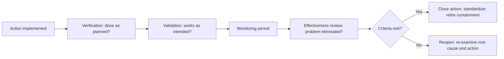
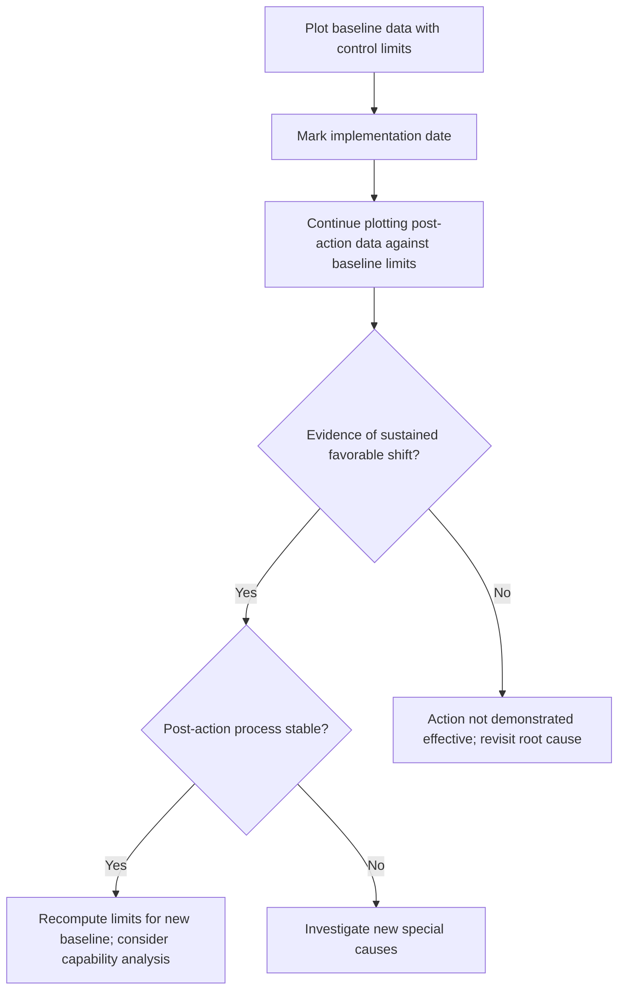
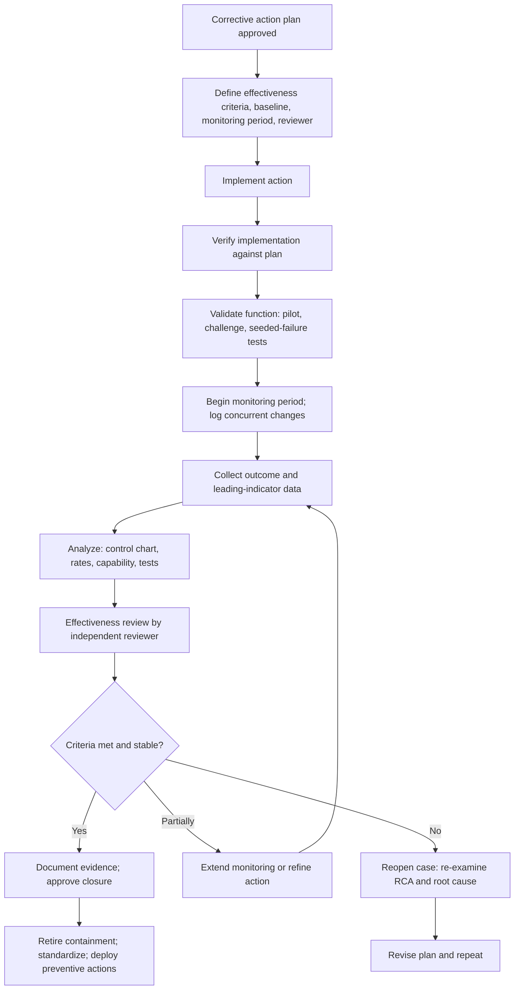

## Verifying Corrective Action Effectiveness


### Overview

Implementing a corrective action is not the same as solving the problem. Verification of effectiveness is the step that closes the loop in Root Cause Analysis (RCA): it answers the question, **"Did the change we made actually eliminate the cause and prevent recurrence?"** Without it, an organization cannot distinguish a genuine fix from a plausible-sounding but ineffective change, a misdiagnosed root cause, or a problem that simply went quiet by chance.

The "5 Whys" and other RCA techniques produce a *hypothesis* about causation. A corrective action is an *intervention* based on that hypothesis. Effectiveness verification is the *test* of the hypothesis. If the problem persists after a correctly implemented action, the most likely explanation is that the root cause was wrong, incomplete, or only one of several contributing causes.

This topic covers the distinction between verification, validation, and effectiveness review; how to design effectiveness criteria and monitoring windows; quantitative methods (baselines, control charts, capability analysis, statistical tests); handling rare events and confounding factors; documenting evidence; and deciding whether to close, extend, or reopen an action.

**Key Points**

- **Implementation ≠ effectiveness.** Completing a task (installing a sensor, revising a procedure) only shows the action was *done*, not that it *worked*.
- Effectiveness criteria should be defined **before** implementation, along with a **baseline** and a **monitoring period**.
- Effectiveness is demonstrated by **outcome data**, not by activity records or the absence of complaints.
- A short quiet period is weak evidence. The monitoring window must be long enough that the original problem would **likely have recurred** had the action been ineffective.
- Failed effectiveness checks are **valuable information**, not failures of the person; they send the investigation back to the RCA.
- Verification should be **independent** of implementation wherever practical.

---

### Verification, Validation, and Effectiveness: Three Distinct Checks

These terms are often used interchangeably, but they answer different questions and occur at different times.

| Check | Core Question | Timing | Typical Evidence |
| --- | --- | --- | --- |
| **Verification (of implementation)** | Was the action implemented as planned? | At or immediately after implementation | Change records, commissioning report, signed procedure, deployed configuration |
| **Validation (of function)** | Does the change work as intended under realistic conditions? | Before or shortly after release to full operation | Test results, pilot data, challenge tests, seeded-failure tests |
| **Effectiveness review** | Did the change eliminate the problem and prevent recurrence over time? | After a defined monitoring period | Outcome metrics, recurrence data, control charts, capability indices |

**Example**

Action: Install a vision interlock that halts the line when a safety label is missing.

- **Verification:** The interlock is installed, wired, and documented per the change record.
- **Validation:** In a trial, 30 of 30 seeded unlabeled units are rejected, and no correctly labeled units are falsely rejected in a 1,000-unit run.
- **Effectiveness:** Over 90 production days, zero missing-label escapes reach the customer, and the internal reject log shows the interlock catching real events.

An action can pass verification and validation yet fail effectiveness (for example, if labels go missing through a *different* mechanism the interlock does not detect, which would indicate the root cause analysis was incomplete).



---

### Defining Effectiveness Criteria

Effectiveness criteria are the pre-agreed, measurable conditions that, if satisfied, demonstrate the action worked. They are written at the time the corrective action plan is created (see SMART action planning), not after the results are known, to avoid moving the goalposts.

#### Characteristics of Good Criteria

| Property | Description | Example |
| --- | --- | --- |
| **Outcome-based** | Measures the problem, not the activity | "Zero recurrences" rather than "training completed" |
| **Measurable** | Quantified with a defined data source | "Wrong-address shipment rate ≤ 0.4%" |
| **Baselined** | Compared against pre-action performance | "Reduced from 3.1% to ≤ 0.4%" |
| **Time-bound** | A defined monitoring period and review date | "Over 90 consecutive production days" |
| **Sensitive** | Capable of detecting failure if the action did not work | Window long enough for the problem to reappear |
| **Attributable** | Linked plausibly to the action, not only to other changes | Stratified by the affected line/system |
| **Agreed** | Accepted by the owner, sponsor, and reviewer in advance | Recorded in the plan |

#### Types of Measures

| Type | Description | Examples | Strength / Limitation |
| --- | --- | --- | --- |
| **Lagging (outcome)** | Measures the actual result | Recurrence count, defect rate, incident frequency, customer complaints | Directly relevant; may take long to accumulate for rare events |
| **Leading (process)** | Measures whether the control is functioning | Interlock rejection rate, alert fire rate, checklist compliance, audit pass rate | Fast feedback; does not prove the ultimate outcome |
| **Surrogate** | Correlated stand-in for the true outcome | Near-miss counts, in-process reject rate | Useful for rare events; validity depends on the correlation |
| **Capability / stability** | Statistical characterization of the process | Control chart stability, $C_{pk}$ | Strong for continuous processes; requires adequate data |

Best practice is to define **at least one lagging measure and one leading measure**. The leading measure provides early evidence the mechanism is working; the lagging measure confirms the real-world result.

#### Criteria: Weak vs. Strong

| Weak Criterion | Why It Fails | Strong Criterion |
| --- | --- | --- |
| "No complaints received." | Absence of complaints may reflect low reporting, low volume, or luck | "Zero missing-label escapes across ≥ 90 production days covering ≥ 50,000 units, with complaint monitoring and an internal audit sample of 200 units per week." |
| "Operators trained." | Measures activity | "Zero out-of-tolerance escapes traced to tool wear over 90 days, and 100% of shift checklists contain a completed tool-life entry." |
| "Issue resolved." | Undefined | "Sync-skip alerts: zero unalerted skips; mismatch rate ≤ 0.1% for 90 consecutive days." |
| "Process improved." | No baseline or target | "Process $C_{pk}$ increases from 0.82 (baseline, n = 125) to ≥ 1.33 (post-action, n ≥ 125), with a stable control chart." |

---

### Establishing a Baseline

Effectiveness cannot be judged without knowing what performance looked like before the action.

Baseline practices:

- Capture baseline data **before** implementing the action (or reconstruct it from historical records).
- Ensure the baseline period is **representative** (covers normal variation, shifts, seasons, and product mix).
- Record the **measurement method** and confirm it will be identical in the post-action period.
- Note **known special-cause events** in the baseline (such as the incident that triggered the RCA), and treat them explicitly rather than folding them silently into the average.
- Where practical, compute baseline **variability**, not just the mean, so the post-action shift can be judged against normal fluctuation.

If there is no baseline, effectiveness can still be judged against an **absolute target** (for example, "zero recurrences" or a specification), but claims of "improvement" cannot be quantified.

---

### Determining the Monitoring Period

A frequent error is closing an action after a monitoring period too short to be informative. If a defect historically appeared about once every three months, then a two-week quiet period says almost nothing.

#### Rule-of-Thumb Reasoning

The monitoring period should be long enough that, **if the action were ineffective, the problem would very likely have reappeared**.

If failures historically occur as a Poisson process with rate $\lambda$ events per unit time, the probability of observing zero events in a period $t$ when the process has *not* improved is:

$$P(\text{zero events in } t) = e^{-\lambda t}$$

To be confident (say, probability $\alpha$ of a false "all clear") that a quiet period reflects real improvement, choose $t$ such that:

$$e^{-\lambda t} \leq \alpha \quad \Rightarrow \quad t \geq \frac{-\ln(\alpha)}{\lambda}$$

**Example**

Historically, the problem occurred at $\lambda = 2$ events per month. To keep the false-clear probability at or below $\alpha = 0.05$:

$$t \geq \frac{-\ln(0.05)}{2} = \frac{2.996}{2} \approx 1.5 \text{ months}$$

So roughly 1.5 months of zero events would be moderately convincing. For a rarer problem with $\lambda = 0.25$ events per month (about one every four months):

$$t \geq \frac{2.996}{0.25} \approx 12 \text{ months}$$

**Output**

Rarer problems require substantially longer monitoring windows, or the use of leading and surrogate measures, to reach comparable confidence.

[Inference: This calculation assumes a stationary Poisson process with a known baseline rate. Real failure processes may cluster, vary seasonally, or have uncertain historical rates, so treat the result as a planning guide rather than a precise threshold.]

#### The "Rule of Three" for Zero-Event Observations

When zero failures are observed in $n$ independent trials, an approximate 95% upper confidence bound on the true failure probability is:

$$p_{\text{upper}} \approx \frac{3}{n}$$

**Example**

Zero defects in 1,000 inspected units gives an approximate 95% upper bound on the defect probability of $3/1000 = 0.3\%$. If the prior baseline was 0.45%, this shows improvement but only modestly, and a larger sample would strengthen the conclusion.

**Key Points**

- Zero events is **evidence only in proportion to the exposure** (units produced, time in service, transactions processed).
- Report exposure alongside event counts (for example, "0 escapes in 62,000 units over 90 days").

#### Practical Monitoring Windows

| Situation | Typical Approach |
| --- | --- |
| High-frequency defect (daily) | Weeks; use control charts |
| Moderate-frequency (weekly to monthly) | Months, covering multiple cycles |
| Rare events (quarterly or less) | Long windows plus leading/surrogate measures and challenge tests |
| Seasonal or cyclical problems | At least one full cycle including the peak period |
| Regulatory or high-severity events | Per governing procedure; often longer with staged reviews |

[Inference: Specific durations (for example, 30, 60, 90 days) are common conventions in many organizations, but are not universally mandated; set them by failure frequency and risk.]

---

### Quantitative Methods for Assessing Effectiveness

#### 1. Control Charts (Before/After)

Statistical Process Control provides the most defensible method for continuous or count data. Plot the affected characteristic over time, marking the date of implementation.

Signals of effectiveness:

- A **sustained shift** in the center line toward the desired direction, evidenced by a run of points (for example, 8 to 9 consecutive points) on the favorable side of the *old* center line
- **Narrower variation** (a reduction in the range or moving-range chart)
- **Absence of special-cause signals** after the change, meaning the process is stable at the new level
- **Recomputed control limits** for the new stable period (only after establishing stability)

Signals of ineffectiveness:

- Points continue beyond the old control limits
- Nelson-rule patterns persist
- No shift in the center line
- Improvement that fades over time (regression to the old level)



Use the chart matching the data type: I-MR for individual values, Xbar-R or Xbar-S for subgrouped continuous data, and p, np, c, or u charts for attribute data.

#### 2. Capability Comparison

For characteristics with specification limits, compare capability before and after:

$$C_{pk} = \min\left(\frac{USL - \mu}{3\sigma}, \frac{\mu - LSL}{3\sigma}\right)$$

An effective action aimed at centering or variation reduction should raise $C_{pk}$ (and/or $C_p$). Calculate capability only when the post-action process is demonstrated stable.

**Example**

| Period | Mean | $\sigma$ | $C_p$ | $C_{pk}$ |
| --- | --- | --- | --- | --- |
| Baseline | 10.32 | 0.11 | 1.52 | 0.67 |
| Post-action | 10.01 | 0.09 | 1.85 | 1.67 |

Here the action both recentered the process (mean moved close to the 10.00 target) and reduced variation, and $C_{pk}$ improved from 0.67 (not capable) to 1.67 (highly capable). (Assumes $LSL = 9.65$, $USL = 10.35$.)

#### 3. Comparing Proportions (Before vs. After)

For attribute data, a two-proportion comparison tests whether the defect rate fell beyond what chance alone would explain.

Given baseline proportion $\hat{p}_1 = x_1/n_1$ and post-action proportion $\hat{p}_2 = x_2/n_2$, the pooled proportion and test statistic are:

$$\hat{p} = \frac{x_1 + x_2}{n_1 + n_2}$$


$$z = \frac{\hat{p}_1 - \hat{p}_2}{\sqrt{\hat{p}(1-\hat{p})\left(\frac{1}{n_1} + \frac{1}{n_2}\right)}}$$

**Example**

Baseline: 90 defectives in 2,000 units ($\hat{p}_1 = 0.045$). Post-action: 12 defectives in 2,000 units ($\hat{p}_2 = 0.006$).

$$\hat{p} = \frac{90 + 12}{4000} = 0.0255$$


$$z = \frac{0.045 - 0.006}{\sqrt{0.0255 \times 0.9745 \times \left(\frac{1}{2000} + \frac{1}{2000}\right)}} = \frac{0.039}{\sqrt{0.02485 \times 0.001}} = \frac{0.039}{0.004985} \approx 7.82$$

**Output**

A $z$ of about 7.8 corresponds to a vanishingly small one-sided $p$-value, strong statistical evidence that the defect proportion decreased. The relative reduction is:

$$\frac{0.045 - 0.006}{0.045} \times 100\% \approx 86.7\%$$

[Inference: This test assumes independent units and stable conditions in each period. If the baseline includes an unusual spike (such as the triggering incident), it may overstate the historical average, so consider comparing against a baseline drawn from typical operation.]

#### 4. Comparing Means (Before vs. After)

For continuous measurements, a two-sample $t$ test (Welch's version when variances differ) can test whether the mean shifted:

$$t = \frac{\bar{x}_1 - \bar{x}_2}{\sqrt{\frac{s_1^2}{n_1} + \frac{s_2^2}{n_2}}}$$

Use an F-test or Levene's test (or simply compare control chart ranges) to evaluate whether variability changed. [Inference: Statistical tests assume approximate normality and independence; time-ordered process data can be autocorrelated, in which case control charts and time-series methods are generally more appropriate than simple two-sample tests.]

#### 5. Rate Comparison for Count Data

For incident counts over differing exposures, compare event *rates* per unit exposure:

$$\text{Rate} = \frac{\text{Events}}{\text{Exposure}}$$

**Example**

Baseline: 9 incidents in 6 months of operation (rate 1.5/month). Post-action: 1 incident in 6 months (rate ≈ 0.17/month).

$$\text{Rate reduction} = \frac{1.5 - 0.167}{1.5} \times 100\% \approx 88.9\%$$

With small counts, uncertainty is large; report confidence intervals (for example, exact Poisson intervals) rather than a bare point estimate. [Inference: With 1 observed event, the exact 95% Poisson interval for the count is wide (roughly 0.03 to 5.6 events), illustrating why small-number comparisons should be interpreted cautiously.]

#### 6. Challenge and Seeded-Defect Testing

For controls whose purpose is detection or prevention, deliberately introduce known failures and confirm the control responds.

**Example**

- Inject 30 units with missing labels; the interlock should reject all 30.
- Inject latency into a service; the alert should fire within the target detection time.
- Attempt to submit an oversized address payload; validation should reject it with the intended message.

Challenge tests provide **fast, direct evidence** of the mechanism when natural recurrence is too rare to observe. They complement, but do not replace, outcome data.

#### Method Selection Guide

| Data Situation | Preferred Methods |
| --- | --- |
| Continuous, time-ordered process data | Control charts; capability analysis |
| Attribute data with adequate volume | p/u charts; two-proportion test |
| Rare events | Leading/surrogate indicators; challenge tests; exposure-adjusted rate with confidence intervals; longer windows |
| Detection or alerting controls | Seeded-failure tests; detection-time metrics |
| Human procedural controls | Audit compliance sampling plus outcome data |
| Design or configuration controls | Configuration verification; automated compliance scans |

---

### Pitfalls in Interpreting Effectiveness Data

| Pitfall | Description | Mitigation |
| --- | --- | --- |
| **Regression to the mean** | Problems often trigger action when performance is at an extreme; subsequent performance tends to move back toward average regardless of the action | Use a representative baseline; use control charts; compare with a control group if possible |
| **Confounding changes** | Other changes (new supplier, seasonal shift, staffing) coincide with the action | Log all concurrent changes; stratify data; use before/after with contemporaneous comparison where feasible |
| **Insufficient exposure** | Quiet period too short relative to failure frequency | Compute a monitoring window; report exposure |
| **Measurement change** | Detection or reporting practices changed, altering apparent rates | Keep the measurement system constant; verify with measurement system analysis |
| **Hawthorne effect** | Attention temporarily improves behavior | Extend monitoring; look for sustained change |
| **Selection of favorable windows** | Cherry-picking periods or subsets that look good | Pre-define the window and metrics in the plan |
| **Under-reporting** | Fewer reports mistaken for fewer events | Track reporting culture; use independent detection sources |
| **Novelty decay** | Improvement fades as attention wanes | Include follow-up reviews at extended intervals |
| **Ignoring displacement** | The problem shifts elsewhere (for example, defects move to another station) | Monitor related metrics and downstream/upstream processes |
| **Treating absence of evidence as evidence of absence** | No recurrence is assumed to prove effectiveness | Require adequate exposure and, where possible, positive evidence of mechanism |
| **Statistical significance mistaken for practical significance** | A tiny but "significant" shift may not matter | Define a target effect size in advance |
| **Post-hoc criteria** | Criteria adjusted after seeing results | Fix criteria in the plan before implementation |

**Key Points**

- Where feasible, use a **comparison group** (a similar line, site, or service that did not receive the change) to separate the action's effect from background trends.
- If a **phased rollout** is used, the staggered timing itself provides natural evidence: improvement should follow implementation in each group.

---

### Verification Process: Step-by-Step



1. **Predefine** criteria, baseline, monitoring period, data source, and reviewer in the corrective action plan.
2. **Implement** the action and record the effective date precisely.
3. **Verify implementation:** confirm the change exists as specified (configuration, document release, hardware installed).
4. **Validate function:** test under realistic conditions, including challenge or seeded-failure tests where applicable.
5. **Monitor:** collect the agreed data for the full period. Log any concurrent changes or unusual events.
6. **Analyze:** use the appropriate quantitative method for the data type.
7. **Review independently:** the effectiveness reviewer assesses evidence against the pre-agreed criteria.
8. **Decide:** close, extend, refine, or reopen (see the decision framework below).
9. **Document:** attach evidence, analysis, and the decision to the record.
10. **Retire containment** only after effectiveness is demonstrated (or an approved risk acceptance exists).
11. **Propagate learning:** trigger preventive actions and lessons learned.

---

### Decision Framework: Close, Extend, Refine, or Reopen

| Outcome | Evidence Pattern | Decision |
| --- | --- | --- |
| **Effective** | Criteria met; post-action process stable; mechanism confirmed; no displacement | **Close**; retire containment; standardize; recompute control limits if the process legitimately changed |
| **Probably effective, insufficient exposure** | Favorable trend but monitoring window or sample too small | **Extend monitoring** with a defined new review date; keep containment or leading indicators active |
| **Partially effective** | Improvement short of the target; residual problem | **Refine**: strengthen the action, add a complementary action, or investigate contributing causes |
| **Ineffective** | No meaningful change, or recurrence | **Reopen**: return to RCA; question the root cause; check implementation fidelity; consider that the true cause is different or that multiple causes exist |
| **New problem introduced** | Original problem resolved but side effects appear | **Refine or reopen**: assess change risk; add compensating actions |
| **Cannot be assessed** | Data missing or measurement compromised | **Repair the measurement**, then reassess; do not close on absence of data |

**Conclusion**

When an action is ineffective, the correct response is to return to the evidence and ask why the causal model failed. Common explanations are:

1. The action was not implemented as intended (verify again).
2. The root cause was incomplete; multiple causes contribute.
3. The root cause was wrong (the 5 Whys stopped at a plausible but unverified answer).
4. The action was weak (relied on human vigilance rather than system change).
5. A different failure mode is producing the same symptom.

---

### Worked Example: Effectiveness Review with a p Chart and Rate Comparison

**Example**

**Background:** Wrong-address shipments averaged 3.1% during the incident period against a typical baseline of 0.4%. The root cause was a sync job that silently skipped records exceeding a field-length limit. Corrective actions A1 (loud failure with alerting), A2 (input validation), and A3 (daily reconciliation) were implemented on 2026-10-23.

**Effectiveness criteria (predefined):**

| Measure | Type | Target | Window |
| --- | --- | --- | --- |
| Wrong-address shipment rate | Lagging | ≤ 0.4% with no special-cause signals on p chart | 90 days |
| Silent sync skips | Leading | 0 | 90 days |
| Alert fire rate on injected failures | Leading (validation) | 100% within 10 minutes | Pre-release and quarterly |
| Reconciliation mismatch rate | Leading | ≤ 0.1% | 90 consecutive days |

**Data (post-action, 90 days):**

- Orders shipped: 45,000
- Wrong-address shipments: 130
- Silent skips: 0; alerted skips: 14 (all resolved same day)
- Seeded-failure alert tests: 3 of 3 fired within 6 minutes
- Reconciliation mismatch rate: 0.06%

**Analysis:**

$$\hat{p}_{\text{post}} = \frac{130}{45000} \approx 0.00289 \; (0.29\%)$$

The observed rate is below the 0.4% target. To check for stability, the p chart for the post-action period uses:

$$\bar{p} = 0.00289, \quad n_{\text{avg}} = 500 \text{ per day}$$


$$\text{UCL}_p = 0.00289 + 3\sqrt{\frac{0.00289 \times 0.99711}{500}} = 0.00289 + 3(0.002400) \approx 0.01009$$

No daily proportions exceeded the UCL of about 1.0%, and no Nelson-rule patterns were detected. (Daily proportions were computed from each day's shipment count.)

Comparison against the incident-period rate of 3.1%:

$$\text{Relative reduction} = \frac{0.031 - 0.00289}{0.031} \times 100\% \approx 90.7\%$$

Comparison against the typical 0.4% baseline shows the process has returned to, and slightly improved on, normal performance.

**Review determination:**

| Criterion | Result | Met? |
| --- | --- | --- |
| Wrong-address rate ≤ 0.4%, stable | 0.29%, no special-cause signals | Yes |
| Silent skips = 0 | 0 | Yes |
| Alert validation 100% within 10 min | 3 of 3 within 6 min | Yes |
| Mismatch rate ≤ 0.1% | 0.06% | Yes |

**Output**

All predefined criteria were met over the full 90-day window, with adequate exposure (45,000 orders), a stable chart, and confirmation that the alerting mechanism works. The reviewer approves closure, containment action C1 (manual daily address comparison) is retired, and the p chart limits are recomputed for ongoing monitoring. Preventive action P1 (audit of the other seven sync jobs) proceeds under its own effectiveness plan.

**Conclusion**

Evidence combined outcome data, leading indicators, seeded-failure validation, and a stable control chart. This layered approach is more persuasive than any single measure.

---

### Documenting Effectiveness Evidence

Well-formed records support audits, regulatory inspection, and future learning.

| Record Element | Content |
| --- | --- |
| **Action reference** | ID and linked RCA |
| **Criteria** | The predefined criteria, baseline, target, and window |
| **Implementation record** | Date implemented, verification evidence |
| **Validation evidence** | Test protocols and results |
| **Monitoring data** | Raw or summarized data with source references |
| **Analysis** | Charts, calculations, and statistical outputs |
| **Concurrent changes** | Log of other changes during the period |
| **Reviewer and date** | Independent reviewer identity and review date |
| **Determination** | Effective, extended, refined, or reopened, with rationale |
| **Follow-up** | Preventive actions triggered; long-term monitoring |
| **Approvals** | Closure sign-off |

#### Template: Effectiveness Review Record

```markdown
### Effectiveness Review: AC-2026-0142-A2

- **Linked RCA:** RCA-2026-0142
- **Action implemented:** 2026-10-23
- **Review date:** 2027-01-21
- **Reviewer (independent):** R. Chen, Quality and Risk Lead

| Criterion | Baseline | Target | Result | Met? |
|-----------|----------|--------|--------|------|
| Wrong-address rate (lagging) | 3.1% (incident) / 0.4% (typical) | ≤ 0.4%, stable | 0.29%, stable | Yes |
| Silent skips (leading) | Unknown | 0 | 0 | Yes |
| Alert test (validation) | N/A | 100% within 10 min | 3/3 within 6 min | Yes |

- **Exposure:** 45,000 orders over 90 days
- **Concurrent changes logged:** Portal UI update on 2026-11-12 (no impact on address handling)
- **Analysis reference:** p chart file and two-proportion test attached
- **Determination:** Effective; close action
- **Follow-up:** Retire containment C1; recompute chart limits; continue quarterly alert tests
```

---

### Domain Considerations

#### Software and IT Operations

- Use **service-level indicators** (error rate, latency percentiles, saturation) as outcome measures; compare against pre-fix baselines with awareness of traffic seasonality.
- **Chaos engineering, game days, and fault injection** serve as challenge tests for reliability fixes.
- Track **recurrence of the same incident class** (tagging incidents by root-cause category) rather than only overall incident counts.
- Automated **regression tests and policy-as-code checks** provide continuous leading-indicator evidence.

#### Manufacturing

- Combine **control charts** on the affected characteristic with **capability studies** ($C_{pk}$, $P_{pk}$).
- Use **customer-facing indicators** (returns, complaints, PPM) as lagging measures and **in-process reject rates** as leading measures.
- In customer-driven programs, effectiveness verification is often required for a defined period before the customer accepts closure. [Inference: exact durations and formats are set by customer or industry requirements.]

#### Healthcare and Regulated Environments

- Regulatory frameworks generally expect documented verification or validation that corrective actions are effective and do not adversely affect the product or patient outcome; records must be retrievable for inspection.
- Use **audit sampling**, compliance rates, and **event recurrence tracking**; combine with independent review.
- Consider **staged follow-up** (for example, short-term, mid-term, and long-term reviews) for high-severity events.

---

### Implementation Sketch: Automating a Post-Action Check

A small Python example that compares baseline and post-action proportions and evaluates predefined criteria.

**Example**

```python
from math import sqrt

def two_proportion_z(x1, n1, x2, n2):
    p1, p2 = x1 / n1, x2 / n2
    p_pool = (x1 + x2) / (n1 + n2)
    se = sqrt(p_pool * (1 - p_pool) * (1 / n1 + 1 / n2))
    return p1, p2, (p1 - p2) / se

def rule_of_three_upper(n_trials):
    """Approximate 95% upper bound on failure probability after 0 failures."""
    return 3 / n_trials

# Baseline vs post-action
x1, n1 = 90, 2000
x2, n2 = 12, 2000
p1, p2, z = two_proportion_z(x1, n1, x2, n2)

relative_reduction = (p1 - p2) / p1 * 100

criteria = {
    "target_rate": 0.004,       # <= 0.4%
    "min_exposure": 40000,      # minimum units in monitoring window
    "max_silent_skips": 0,
}

post_events, post_exposure, silent_skips = 130, 45000, 0
post_rate = post_events / post_exposure

results = {
    "Rate meets target": post_rate <= criteria["target_rate"],
    "Exposure adequate": post_exposure >= criteria["min_exposure"],
    "No silent skips": silent_skips <= criteria["max_silent_skips"],
}

print(f"Baseline rate: {p1:.4f}, Post rate (test sample): {p2:.4f}")
print(f"z = {z:.2f}, relative reduction = {relative_reduction:.1f}%")
print(f"Monitoring-window rate: {post_rate:.5f}")
for name, ok in results.items():
    print(f"  {name}: {'PASS' if ok else 'FAIL'}")
print("Overall:", "EFFECTIVE" if all(results.values()) else "NOT DEMONSTRATED")

print(f"Zero-event upper bound (n=1000): {rule_of_three_upper(1000):.4f}")
```

**Output**

```text
Baseline rate: 0.0450, Post rate (test sample): 0.0060
z = 7.82, relative reduction = 86.7%
Monitoring-window rate: 0.00289
  Rate meets target: PASS
  Exposure adequate: PASS
  No silent skips: PASS
Overall: EFFECTIVE
Zero-event upper bound (n=1000): 0.0030
```

This script checks quantitative criteria only. It does not evaluate chart stability, concurrent changes, or displacement effects, which require human review and additional analysis. [Inference: Production implementations would typically pull data directly from monitoring systems and attach chart output to the CAPA record.]

---

### Common Pitfalls and Remedies

| Pitfall | Consequence | Remedy |
| --- | --- | --- |
| Closing on implementation | Unknown whether the problem is solved | Require an effectiveness review before closure |
| No predefined criteria | Post-hoc rationalization | Write criteria in the plan |
| No baseline | Cannot quantify improvement | Capture baseline before implementation |
| Monitoring window too short | False assurance | Size window from failure frequency and exposure |
| Only activity metrics | Measures effort rather than results | Add outcome measures |
| Self-verification | Confirmation bias | Independent reviewer |
| Ignoring concurrent changes | Misattributed success or failure | Change log; comparison groups |
| Relying on absence of complaints | Under-reporting mistaken for success | Independent detection and sampling |
| Removing containment prematurely | Customer re-exposure | Retire only after criteria met |
| Treating a failed check as a personal failure | Discourages honest reporting | Frame as learning; return to RCA |
| Not looking for displacement | Problem moves elsewhere | Monitor adjacent processes |
| Failing to recompute control limits after real change | Old limits mask or mis-signal | Recompute after demonstrated stability |
| No follow-up after closure | Novelty decay goes unnoticed | Schedule long-term periodic checks |
| Overreliance on a single statistical test | Misses time-ordered patterns | Combine control charts, rates, and mechanism evidence |

---

### Program-Level Metrics

Tracking effectiveness across the CAPA portfolio reveals the health of the RCA and action-selection process.

$$\text{Effectiveness pass rate} = \frac{\text{Actions meeting criteria at first review}}{\text{Actions reviewed}} \times 100\%$$


$$\text{Recurrence rate} = \frac{\text{Closed problems that recurred within the tracking window}}{\text{Closed problems}} \times 100\%$$


$$\text{Review timeliness} = \frac{\text{Effectiveness reviews completed by scheduled date}}{\text{Reviews due}} \times 100\%$$

Interpretation:

- **Low first-pass effectiveness** suggests weak root cause verification or weak action types (for example, overreliance on training).
- **High recurrence** among closed items indicates premature closure or inadequate monitoring windows.
- **Poor review timeliness** indicates resourcing or ownership problems in the verification step.

Plot these metrics on control charts to distinguish real deterioration or improvement from month-to-month noise. Compare effectiveness pass rates by **action strength** (strong, intermediate, weak) to determine empirically whether the organization's weak actions underperform; [Inference: such analysis commonly shows stronger system-level controls outperforming training-only actions, but results depend on the organization's data].

---

### Best Practices Checklist

- Define **effectiveness criteria, baseline, monitoring window, data source, and reviewer** before implementing the action.
- Distinguish **verification, validation, and effectiveness review**; complete all three.
- Use **outcome (lagging) and process (leading) measures** together.
- Size the **monitoring window** to failure frequency and report **exposure** alongside event counts.
- Use **control charts, capability analysis, rate comparisons, and appropriate statistical tests** matched to the data type.
- Apply **challenge or seeded-failure tests** for rare events and for detection or alerting controls.
- Log **concurrent changes** and guard against regression to the mean, measurement changes, and displacement.
- Use an **independent reviewer** wherever practical.
- Make a clear **decision** (close, extend, refine, reopen) and document the evidence and rationale.
- **Retire containment** only after effectiveness is demonstrated.
- When an action fails, **return to the RCA** and challenge the causal model rather than blaming individuals.
- Schedule **long-term follow-up** to detect novelty decay and recurrence.
- Track **program-level effectiveness metrics** and use them to improve RCA quality and action selection.

---

**Related Topics**

- Writing SMART corrective action plans
- Differentiating corrective, preventive, and containment actions
- Assigning ownership and accountability
- Control charts for before-and-after analysis
- Process capability analysis ($C_p$, $C_{pk}$) and capability comparison
- Hypothesis testing and confidence intervals for effectiveness claims
- Measurement System Analysis and data integrity
- Challenge testing, fault injection, and chaos engineering
- Horizontal deployment of lessons learned and preventive action follow-up
- CAPA metrics, dashboards, and management review