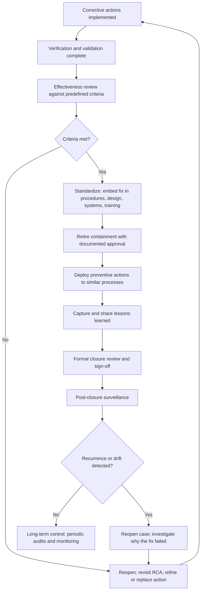
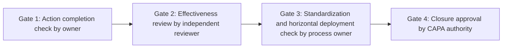
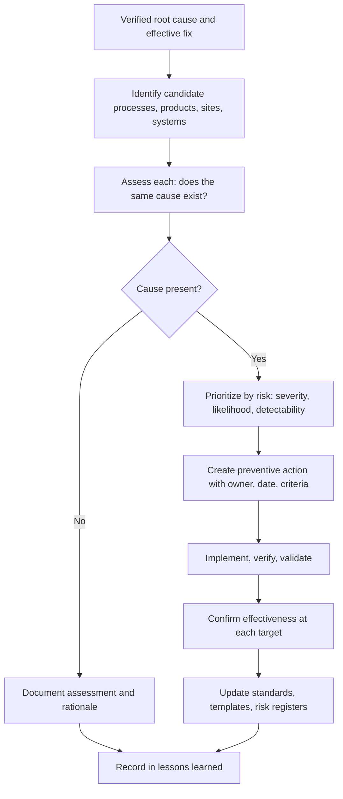
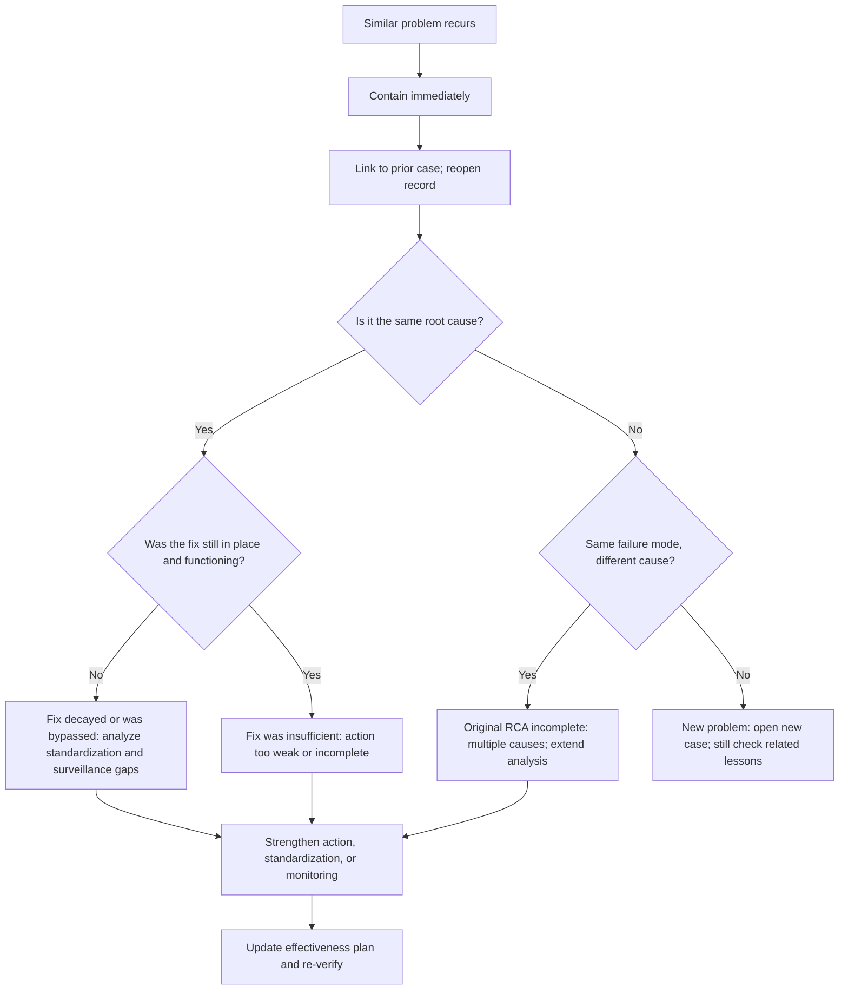

## Closing the Loop and Preventing Recurrence


### Overview

Root Cause Analysis (RCA) and the "5 Whys" are only valuable if the learning they produce **changes the system and stays changed**. "Closing the loop" is the final phase of the corrective and preventive action (CAPA) lifecycle: it converts a verified fix into a **sustained state of control**, ensures the organization **learns** from the event, and confirms the problem **does not return** in the original location or in similar ones.

Closure is often mishandled in two opposite ways:

- **Premature closure**: the record is closed when the action is *implemented*, before effectiveness has been demonstrated or the fix has been embedded in standard work.
- **Endless-open records**: actions linger indefinitely because no one defined what "done" means, obscuring real risk and creating audit noise.

A well-run closure process defines **explicit closure criteria**, verifies them with evidence, **standardizes** the change so it survives turnover and time, **retires** temporary containment, **deploys** the learning horizontally, and **monitors** for recurrence after closure. Recurrence is treated as diagnostic information about the RCA and action quality, not merely as a repeat event.

**Key Points**

- **Closure is a decision based on evidence**, not a date on a schedule or the completion of tasks.
- **Standardization** (institutionalizing the fix) is what prevents recurrence over the long term; a fix that lives only in someone's memory decays.
- **Containment must be retired deliberately**, after effectiveness is proven, to avoid both premature exposure and permanent hidden cost.
- **Horizontal deployment** ("where else could this happen?") multiplies the value of each RCA.
- **Recurrence after closure** should trigger a structured reopening, with a review of why the original analysis and action failed.
- **Learning must be captured and shared**, or the organization will repeat the same problem in a different place or era.

---

### The Closure Lifecycle



The lifecycle after implementation has seven stages:

| Stage | Purpose | Key Output |
| --- | --- | --- |
| **1. Effectiveness confirmation** | Prove the fix worked | Evidence against predefined criteria |
| **2. Standardization** | Make the fix durable | Updated procedures, designs, configurations, training, controls |
| **3. Containment retirement** | Remove temporary controls safely | Documented retirement decision |
| **4. Horizontal deployment** | Extend the fix to similar risks | Preventive actions with owners and dates |
| **5. Knowledge capture** | Preserve and share learning | Lessons-learned record, searchable repository |
| **6. Formal closure** | Authorize closing the record | Signed closure decision with evidence |
| **7. Post-closure surveillance** | Detect recurrence and drift | Monitoring plan, periodic audits, trend reviews |

---

### Closure Criteria: Defining "Done"

A case should not close until **all applicable criteria** are satisfied and documented. Defining the criteria in advance prevents both premature closure and indefinite delay.

#### Standard Closure Criteria

| Criterion | Question | Evidence |
| --- | --- | --- |
| **Root cause verified** | Was the cause confirmed with evidence, not assumed? | RCA record with supporting data |
| **All actions completed** | Are containment, corrective, and preventive actions done or formally deferred? | Action register with completion evidence |
| **Implementation verified** | Was each action implemented as specified? | Change records, commissioning reports |
| **Validation performed** | Does the fix work under realistic conditions? | Test and challenge results |
| **Effectiveness demonstrated** | Did the problem stop over an adequate monitoring window? | Outcome data, control charts, rate comparisons |
| **Standardization complete** | Is the fix embedded in standard work? | Released documents, design changes, configuration baselines |
| **Containment retired (or risk accepted)** | Has temporary protection been removed with approval? | Retirement record |
| **Horizontal deployment addressed** | Have similar risks been assessed and actioned? | Preventive action records, audit results |
| **Lessons learned captured** | Has the learning been documented and shared? | Repository entry, communications |
| **No new risks introduced** | Did the fix create adverse side effects? | Change risk review, monitoring data |
| **Records complete** | Can an auditor reconstruct the story? | Complete case file |
| **Approval obtained** | Has the designated authority signed off? | Closure sign-off |

**Key Points**

- Where a criterion is **not applicable**, record why rather than leaving it blank.
- Where a criterion cannot be met in the expected time, record a **formal, risk-assessed deferral** with an owner and date, rather than silently closing.

#### Closure Quality Gates

A common practice is to separate closure into gates so that responsibility is clear:



---

### Standardization: Making the Fix Durable

A corrective action that is not embedded in the organization's standard work depends on individual memory and goodwill. It will erode with turnover, reorganization, schedule pressure, and simple forgetting. **Standardization** is the discipline of converting a fix into a permanent, self-sustaining part of how work is done.

#### Where Fixes Must Be Embedded

| Layer | Examples of Embedding |
| --- | --- |
| **Design and architecture** | Design specification updated; component or interface redesigned; default configuration changed |
| **Documented procedures** | Work instructions, SOPs, runbooks, checklists revised and released under document control |
| **Systems and automation** | Validation rules, pipeline checks, interlocks, alerts, and policy-as-code implemented |
| **Training and onboarding** | Curriculum and onboarding materials updated so new personnel learn the corrected method |
| **Equipment and tooling** | Fixtures, tooling, and maintenance schedules revised |
| **Supplier and customer agreements** | Specifications, contracts, and service-level agreements updated |
| **Risk documentation** | FMEA, risk register, and control plans updated to reflect the new failure mode and control |
| **Audit and monitoring** | Audit checklists and monitoring dashboards updated to cover the new control |
| **Templates and shared components** | Project templates, code templates, and shared libraries updated so new work inherits the fix |

#### Prefer Structural Standardization

Consistent with the action strength hierarchy, favor embedding that does not rely on human recall:

| Strength | Standardization Approach | Example |
| --- | --- | --- |
| **Strong** | Build the fix into the design, tooling, or automation so the wrong path is impossible or blocked | Pipeline gate that rejects unsafe migrations; fixture that only accepts correct orientation |
| **Intermediate** | Embed in workflows with forced checks, defaults, and cognitive aids | Mandatory field in checklist; templated change request with lock-impact section |
| **Weak** | Rely on reminders, memos, or one-time training | Email announcement; toast-notification reminder |

[Inference: Weak measures are still useful as supplements, but a standardization plan that consists only of weak measures is likely to decay over time.]

#### Document Control and Change Management

Standardization should pass through the organization's change-control process so that the change is reviewed, approved, versioned, and communicated. Key elements:

- **Version control** and a clear effective date for revised documents
- **Communication and read-and-acknowledge** for affected personnel
- **Removal of obsolete versions** from points of use
- **Traceability** from the revised document back to the case that motivated it

**Example**

After the pipeline lock-check fix, standardization includes:

1. Pipeline template updated so all new services inherit the check
2. Migration review template revised to include lock-impact analysis
3. Engineering onboarding guide revised
4. Runbook updated with rollback steps for migration incidents
5. Service risk register updated to add "exclusive-lock migration" as a controlled failure mode
6. Quarterly audit checklist updated to verify the pipeline check is active on all services

---

### Retiring Containment

Containment measures (extra inspection, manual checks, temporary freezes, redundant approvals) are expensive and typically imperfect. They should be **removed deliberately and safely**, not left in place indefinitely and not dropped casually.

#### Retirement Conditions

Retire containment only when:

1. The corrective action is **implemented, validated, and shown effective** against predefined criteria.
2. The process is **demonstrated stable** (for example, control chart shows no special-cause signals in the post-action period).
3. Standardization has **embedded the fix**, so the containment is no longer protecting against a live gap.
4. The **retirement is approved** by the designated authority, and the owner is named.

#### Retirement Approaches

| Approach | Description | Suitable When |
| --- | --- | --- |
| **Direct removal** | Remove containment on the retirement date | Fix is strong, well validated, and low risk |
| **Step-down** | Reduce intensity gradually (for example, 100% inspection → sampling → normal audit) | Moderate confidence; want continued evidence |
| **Parallel run** | Keep containment while the new control operates, comparing outputs | New control is complex or high consequence |
| **Extended watch** | Remove containment but add a heightened monitoring period with defined triggers to reinstate it | Risk of hidden failure modes remains |

**Example: Step-down schedule**

| Phase | Duration | Containment Level | Reinstatement Trigger |
| --- | --- | --- | --- |
| 1 | Days 1 to 30 | 100% manual label check (continue) | Any interlock miss |
| 2 | Days 31 to 60 | Sample inspection (50 units per shift) | Any nonconformance found |
| 3 | Days 61 to 90 | Normal audit sampling | Any customer complaint or audit finding |
| 4 | After day 90 | Standard controls only | Recurrence of the failure mode |

**Key Points**

- Document the **retirement decision, date, approver, and rationale**.
- Define **reinstatement triggers**: the conditions under which containment returns automatically.
- Untracked, forgotten containment is a form of hidden technical or operational debt; audit for it.

---

### Horizontal Deployment: Extending the Learning

The root cause found in one place often exists elsewhere. **Horizontal deployment** (also called *replication*, *lateral transfer*, *yokoten* in lean practice, or *extent-of-condition review*) systematically asks: **"Where else could this happen, and have we fixed those places too?"**

#### Dimensions of Extent-of-Condition

| Dimension | Question |
| --- | --- |
| **Same process, other locations** | Do other lines, sites, or shifts run the same process? |
| **Same product family** | Do sibling products share the design or component? |
| **Same failure mode, different process** | Does a different process contain the same type of weakness (for example, silent failure of sync jobs)? |
| **Same cause category** | Does the cause type (missing validation, unclear ownership, absent alert) recur in other systems? |
| **Same supplier or technology** | Do other items use the same supplier, tool, or library? |
| **Past and future** | Were past releases affected? Will upcoming designs inherit the weakness? |

#### Deployment Workflow



#### Prioritization

Rank candidate targets with a risk model such as FMEA. The Risk Priority Number is:

$$\text{RPN} = S \times O \times D$$

where $S$ is severity, $O$ is occurrence, and $D$ is detection difficulty (each typically 1 to 10). [Inference: Some current practice (for example, the harmonized AIAG-VDA FMEA approach) uses Action Priority rather than RPN, weighting severity more heavily; use the method your organization or customer requires.]

**Example**

Following the label-station failure on Line B:

| Target | Same Manual Regulatory Step? | S | O | D | RPN | Priority |
| --- | --- | --- | --- | --- | --- | --- |
| Line C (safety label) | Yes | 9 | 4 | 6 | 216 | High |
| Line D (revision label) | Yes | 7 | 3 | 5 | 105 | Medium |
| Line E (packaging insert) | Similar | 5 | 3 | 4 | 60 | Low |
| Line F (fully automated) | No | n/a | n/a | n/a | n/a | No action; documented |

#### Ownership and Follow-Through

Horizontal deployment is where actions most often stall, because the target process owners did not experience the original problem. Sponsors should assign preventive actions explicitly, give them due dates, and review them through the same governance forum as the original corrective actions.

**Key Points**

- Record **negative findings** (places assessed where the cause does not exist), not only positive ones; this shows the extent-of-condition review was performed.
- Deployment is not complete until **effectiveness is confirmed** at the target locations, or a risk-based justification is documented.

---

### Lessons Learned: Capturing and Sharing Knowledge

Organizations repeat problems when the learning stays with the investigation team. **Lessons-learned capture** preserves the knowledge in a form others can find and use.

#### Content of a Lessons-Learned Record

| Element | Purpose |
| --- | --- |
| **Summary** | What happened, in a few sentences |
| **Impact** | Customer, safety, financial, or operational consequences |
| **Root cause(s)** | Verified causal explanation, including systemic factors |
| **What worked** | Effective detection, response, and recovery practices |
| **What did not** | Missed signals, ineffective steps, delays |
| **Actions taken** | Containment, corrective, preventive |
| **Effectiveness result** | Evidence the fix worked |
| **Generalized principles** | Reusable insight beyond this specific case |
| **Applicability** | Which processes, products, or teams should apply the lesson |
| **Keywords / taxonomy tags** | Searchability |
| **Links** | RCA, evidence, related cases |

#### Making Lessons Reach People

| Mechanism | Description |
| --- | --- |
| **Searchable repository** | Central knowledge base with taxonomy (failure mode, cause category, process, technology) |
| **Design and review checklists** | Convert lessons into checklist items used at design review, code review, or launch |
| **Templates and standards** | Bake lessons into templates that new work starts from |
| **Onboarding and training** | Include real cases in curricula |
| **Regular sharing forums** | Reliability reviews, quality forums, post-incident review sessions |
| **Pre-mortem and FMEA inputs** | Feed lessons into risk assessments for new projects |
| **Trend review** | Aggregate lessons to identify recurring cause categories |

**Key Points**

- Write lessons at two levels: the **specific fix** and the **general principle** ("automated checks should fail loudly rather than skip silently").
- A repository nobody searches is not a control. Tie lessons to **workflow touchpoints** (checklists, templates, reviews) where they will be encountered.
- Treat sharing as **blameless**: focus on system conditions, not individuals.

---

### Post-Closure Surveillance

Closure marks the end of the active case, not the end of vigilance. **Post-closure surveillance** detects recurrence, drift, and decay of the fix.

#### Mechanisms

| Mechanism | Description | Example |
| --- | --- | --- |
| **Control charts and trend monitoring** | Continue plotting the affected characteristic against limits | p chart for wrong-address shipment rate; reviewed monthly |
| **Periodic audits** | Scheduled verification that the control is present and functioning | Quarterly audit that the pipeline lock-check is enabled on all services |
| **Leading indicators** | Ongoing measures of control health | Interlock reject log; alert fire counts; checklist compliance |
| **Challenge tests** | Periodic seeded-failure tests | Quarterly alert test with injected failures |
| **Recurrence tracking** | Tag incidents by root-cause category and count repeats | Dashboard of repeat causes over 12 months |
| **Change-triggered review** | Re-verify the control after relevant changes | Re-test after pipeline upgrades or tooling migrations |
| **Customer and field feedback** | Watch complaints, returns, and support tickets | Complaint trend by category |

#### Surveillance Frequency

Base frequency on **risk and stability**:

| Situation | Suggested Intensity |
| --- | --- |
| High severity, recent fix | Frequent (weekly or monthly) initially, tapering as confidence grows |
| Moderate severity, stable | Quarterly |
| Low severity, strongly automated control | Annual or event-triggered |
| Process undergoing change | Re-baseline and increase monitoring |

[Inference: Specific intervals are conventions rather than universal requirements; calibrate to failure frequency, consequence, and regulatory expectations.]

#### Detecting Drift and Decay

Fixes degrade for predictable reasons:

| Decay Mechanism | Description | Countermeasure |
| --- | --- | --- |
| **Turnover** | Knowledge leaves with people | Embed in documents, automation, and onboarding |
| **Workarounds** | Users bypass a control under time pressure | Make the right way the easy way; monitor bypass rates |
| **Configuration drift** | Systems change and silently disable controls | Configuration baselines; automated compliance scans |
| **Scope creep** | New products or services are launched without the control | Templates and launch checklists that include the control |
| **Complacency** | Attention fades as time passes without incident | Periodic audits and challenge tests |
| **Requirement changes** | Standards or specifications evolve | Change-triggered reviews |
| **Tool or vendor changes** | New tools lack the old safeguards | Include controls in migration checklists |

SPC ties in directly: continued plotting on a control chart with established limits provides an objective **early-warning signal**. A special-cause signal after closure suggests the fix has weakened or a new cause has emerged, and triggers investigation.

---

### Handling Recurrence

Recurrence after closure is uncomfortable but informative. The correct response is a structured reopening, not a fresh, disconnected investigation and not blame.

#### Recurrence Triage



#### Questions to Ask When a Problem Recurs

| Question | What It Reveals |
| --- | --- |
| Was the corrective action implemented as documented and still in place? | Implementation fidelity; decay |
| Was the root cause actually verified, or assumed? | RCA rigor |
| Was there more than one contributing cause? | Completeness of analysis |
| Was the action weak (training or reminders) rather than structural? | Action strength |
| Was the monitoring window long enough to have detected residual risk? | Effectiveness design |
| Did a change elsewhere reintroduce the weakness? | Change control gaps |
| Did horizontal deployment miss this location? | Extent-of-condition rigor |
| Were lessons learned accessible at the time of the original design or change? | Knowledge transfer |
| Did production or delivery pressure encourage a bypass? | Cultural and organizational factors |

**Key Points**

- Recurrence should trigger a review of the **process that produced the closure decision**, not only the technical problem.
- Track recurrence at the **cause category** level. Repeated recurrence of the same category (for example, "missing validation") points to a systemic weakness that individual fixes will not cure.
- Recurrence rates are useful **system health metrics**; they should be used for improvement, not for punishing owners.

---

### Metrics for Closure and Recurrence Prevention

| Metric | Formula / Definition | Interpretation |
| --- | --- | --- |
| **Recurrence rate** | Closed problems that recurred within tracking window ÷ closed problems | Overall CAPA system effectiveness |
| **Repeat-cause rate** | Incidents whose root-cause category matches a prior closed case ÷ total incidents | Systemic learning failures |
| **Effectiveness first-pass rate** | Actions meeting criteria at first review ÷ actions reviewed | RCA and action quality |
| **Closure cycle time** | Median days from case opening to formal closure | Responsiveness (balance against premature closure) |
| **Premature-closure reopen rate** | Closed cases reopened due to ineffectiveness ÷ closed cases | Closure discipline |
| **Horizontal deployment completion** | Preventive actions completed ÷ preventive actions planned | Learning transfer |
| **Containment age** | Days temporary controls remain active beyond planned retirement | Hidden operational debt |
| **Lessons-learned utilization** | Design or change reviews referencing lessons ÷ total reviews | Knowledge reuse |
| **Audit finding rate on closed controls** | Controls found missing or degraded in audits ÷ controls audited | Fix durability |

$$\text{Recurrence rate} = \frac{\text{Closed problems that recurred within window}}{\text{Total closed problems}} \times 100\%$$


$$\text{Repeat-cause rate} = \frac{\text{Incidents with a root-cause category matching a prior closed case}}{\text{Total incidents}} \times 100\%$$

Plot these metrics over time on control charts (for example, a p chart for recurrence rate) to distinguish genuine deterioration from normal variation before reacting.

**Example**

| Quarter | Cases Closed | Recurred within 12 Months | Recurrence Rate |
| --- | --- | --- | --- |
| Q1 | 40 | 6 | 15.0% |
| Q2 | 45 | 5 | 11.1% |
| Q3 | 38 | 3 | 7.9% |

A downward trend is encouraging, but with counts this small the chart should be checked for special-cause signals before concluding that practice has genuinely improved. [Inference: Small-number rates are noisy; consider longer windows or pooled analysis.]

---

### Worked Example: End-to-End Closure

**Example**

**Case:** 3.1% of orders shipped to outdated addresses (baseline 0.4%) because the nightly sync job silently skipped records exceeding a field-length limit.

**Timeline and closure activities:**

| Date | Activity | Category |
| --- | --- | --- |
| 2026-08-15 | Daily manual address comparison begins (C1) | Containment |
| 2026-10-09 to 2026-10-23 | A1 (loud-fail alerting), A2 (portal validation), A3 (daily reconciliation report) implemented and validated | Corrective |
| 2026-10-23 to 2027-01-21 | 90-day monitoring; p chart stable; 0.29% rate on 45,000 orders; 0 silent skips | Effectiveness |
| 2027-01-21 | Reviewer confirms criteria met | Effectiveness review |
| 2027-01-22 | Standardization: sync-job template updated to fail loudly by default; field-length limits documented in the integration contract; onboarding guide updated; monitoring dashboard and audit checklist updated | Standardization |
| 2027-01-25 | C1 retired via step-down (daily → weekly → none) with reinstatement trigger: any mismatch rate above 0.1% for 2 consecutive days | Containment retirement |
| 2027-01-27 to 2027-02-20 | P1: 7 other sync jobs audited; 2 found with silent-skip behavior; both remediated; 5 documented as not affected | Horizontal deployment |
| 2027-02-24 | Lessons learned published: general principle "automated jobs must fail loudly and alert; silent skipping is prohibited"; added to design review checklist | Knowledge capture |
| 2027-02-26 | Closure review: all criteria met; CAPA authority signs off | Formal closure |
| 2027-03 onward | Monthly p chart review; quarterly seeded-failure alert test; annual audit of all integration jobs | Post-closure surveillance |

**Closure checklist result:**

| Criterion | Status |
| --- | --- |
| Root cause verified | Met |
| All actions completed | Met |
| Effectiveness demonstrated | Met (90 days, 45,000 orders, stable chart) |
| Standardization complete | Met |
| Containment retired with approval | Met |
| Horizontal deployment addressed | Met (7 of 7 assessed; 2 remediated) |
| Lessons learned captured | Met |
| No new risks introduced | Met (no adverse effects observed) |
| Records complete | Met |
| Approval | Met |

**Output**

The case is closed with documented evidence, a standardized fix that survives turnover, two additional latent defects eliminated elsewhere, a reusable design principle, and ongoing surveillance that will detect decay.

**Conclusion**

The most valuable outputs of this closure went beyond the original defect: the horizontal deployment found two other jobs with the same weakness, and the lessons-learned principle now prevents the design pattern at its source.

---

### Formal Closure Record

#### Template: Closure Record

```markdown
### Closure Record: CAPA-2026-0142

- **Problem:** Wrong-address shipments (3.1% vs 0.4% baseline)
- **RCA reference:** RCA-2026-0142
- **Closure review date:** 2027-02-26
- **Closure authority:** CAPA Board (Chair: M. Alvarez)

| Closure Criterion | Status | Evidence Link |
|-------------------|--------|---------------|
| Root cause verified | Met | RCA-2026-0142 |
| Corrective actions complete | Met | Action register |
| Effectiveness demonstrated | Met | Effectiveness review record |
| Standardization complete | Met | DOC-INT-014 rev C; template v2.3 |
| Containment retired | Met | Retirement record C1 |
| Horizontal deployment | Met | P1 audit report |
| Lessons learned captured | Met | KB-2027-011 |
| No adverse side effects | Met | Change risk review |
| Records complete | Met | Case file index |

- **Open items / deferrals:** None
- **Post-closure surveillance plan:**

| Mechanism | Frequency | Owner |
|-----------|-----------|-------|
| p chart trend review | Monthly | Order Operations Manager |
| Seeded-failure alert test | Quarterly | Integration Engineer |
| Integration job audit | Annual | Quality Engineer |

- **Reopen triggers:** Mismatch rate above 0.1% for 2 consecutive days; any unalerted skip; special-cause signal on p chart
- **Approved by:** ______________________  Date: __________
```

---

### Implementation Sketch: Closure Gate and Surveillance Automation

A short Python example that evaluates closure criteria and monitors a post-closure signal.

**Example**

```python
from dataclasses import dataclass, field
from typing import Optional
from math import sqrt

@dataclass
class CaseState:
    root_cause_verified: bool
    actions_complete: bool
    effectiveness_met: bool
    standardization_done: bool
    containment_retired_or_accepted: bool
    horizontal_review_done: bool
    lessons_captured: bool
    no_adverse_effects: bool
    records_complete: bool
    approver: Optional[str] = None
    open_deferrals: list = field(default_factory=list)


def closure_gate(c: CaseState) -> tuple[bool, list[str]]:
    checks = {
        "Root cause verified": c.root_cause_verified,
        "All actions complete": c.actions_complete,
        "Effectiveness demonstrated": c.effectiveness_met,
        "Standardization complete": c.standardization_done,
        "Containment retired or risk accepted": c.containment_retired_or_accepted,
        "Horizontal deployment assessed": c.horizontal_review_done,
        "Lessons learned captured": c.lessons_captured,
        "No adverse effects": c.no_adverse_effects,
        "Records complete": c.records_complete,
        "Approver recorded": c.approver is not None,
        "No unresolved deferrals": len(c.open_deferrals) == 0,
    }
    failures = [name for name, ok in checks.items() if not ok]
    return (len(failures) == 0), failures


def p_chart_signal(daily_defects, daily_n, p_bar, n_avg):
    """Flag post-closure days above the p chart upper control limit."""
    ucl = p_bar + 3 * sqrt(p_bar * (1 - p_bar) / n_avg)
    return [
        (i + 1, d / n)
        for i, (d, n) in enumerate(zip(daily_defects, daily_n))
        if d / n > ucl
    ], ucl


# Closure decision
case = CaseState(True, True, True, True, True, True, True, True, True,
                 approver="M. Alvarez")
ok, failures = closure_gate(case)
print("Closure approved:", ok, failures)

# Post-closure surveillance (example month of data)
defects = [1, 0, 2, 1, 0, 1, 9, 1]
volumes = [500, 480, 510, 495, 505, 500, 490, 500]
signals, ucl = p_chart_signal(defects, volumes, p_bar=0.0029, n_avg=500)
print(f"UCL = {ucl:.4f}")
for day, prop in signals:
    print(f"Day {day}: proportion {prop:.4f} exceeds UCL -> reopen review")
```

**Output**

```text
Closure approved: True []
UCL = 0.0101
Day 7: proportion 0.0184 exceeds UCL -> reopen review
```

The sketch shows the pattern of a **hard closure gate** and an **automated surveillance trigger**. Real systems typically integrate with case-management tools, monitoring platforms, and notification workflows, and a human reviewer should evaluate any signal before deciding whether to reopen. [Inference: The p chart limit here uses a fixed average sample size for simplicity; variable daily volumes are more accurately handled with per-point limits.]

---

### Common Pitfalls and Remedies

| Pitfall | Consequence | Remedy |
| --- | --- | --- |
| Closing on task completion | Unverified effectiveness; hidden recurrence | Require an evidence-based effectiveness decision |
| No definition of "done" | Endless-open or arbitrarily closed cases | Predefine closure criteria in the plan |
| Fix not standardized | Decay with turnover and time | Embed in design, systems, documents, and templates |
| Containment never retired | Ongoing cost and complacency | Define retirement conditions and owners; audit containment age |
| Containment retired too early | Customer re-exposure | Tie retirement to effectiveness; use step-down and reinstatement triggers |
| Skipping horizontal deployment | Same problem appears elsewhere | Mandatory extent-of-condition review; record negative findings |
| Lessons kept in a report nobody reads | Repeated problems | Push lessons into checklists, templates, and reviews |
| No post-closure monitoring | Decay goes undetected | Surveillance plan with triggers and owners |
| Blaming individuals for recurrence | Concealment; weaker RCA | Analyze the system: fix strength, verification, standardization |
| Treating each recurrence as a new case | Loses history; repeat mistakes in analysis | Link and reopen; review why the prior closure failed |
| Ignoring drift and workarounds | Silent erosion of controls | Monitor bypass rates; make the correct path easy |
| Closing with unresolved deferrals | Latent risk | Require risk-assessed, time-bound deferral with an owner |
| Over-extending the scope of closure work | Cases never close | Prioritize by risk; split low-risk improvement into separate work |
| Incomplete records | Cannot defend closure in an audit | Maintain a complete, traceable case file |
| Metrics used punitively | Gaming and hidden problems | Use metrics for system improvement and just-culture principles |

---

### Best Practices Checklist

- **Define closure criteria in advance** and require evidence for each.
- **Verify effectiveness** with outcome data over a monitoring window sized to the failure frequency.
- **Standardize** the fix in design, automation, documents, training, templates, and risk records; prefer structural over reminder-based controls.
- **Retire containment deliberately**, with approval, step-down where appropriate, and reinstatement triggers.
- **Run an extent-of-condition review** and drive preventive actions to completion at each affected target.
- **Capture lessons at both the specific and general level**, and place them where people will encounter them (checklists, templates, reviews).
- **Use independent review and formal sign-off** for closure.
- **Set up post-closure surveillance** using control charts, audits, leading indicators, and challenge tests.
- **Treat recurrence as information**: reopen linked cases and examine RCA quality, action strength, standardization, and monitoring.
- **Track program metrics** (recurrence rate, repeat-cause rate, first-pass effectiveness, containment age) and interpret them with SPC.
- **Sustain a blame-free, learning-oriented culture** so problems are reported and analyzed honestly.

---

**Related Topics**

- Verifying corrective action effectiveness
- Writing SMART corrective action plans
- Assigning ownership and accountability
- Differentiating corrective, preventive, and containment actions
- Lessons-learned systems and organizational knowledge management
- Extent-of-condition and horizontal deployment methods (yokoten)
- Change management and document control
- Control charts and statistical monitoring for post-closure surveillance
- FMEA and risk-based prioritization of preventive actions
- Building a learning organization and sustaining a just culture