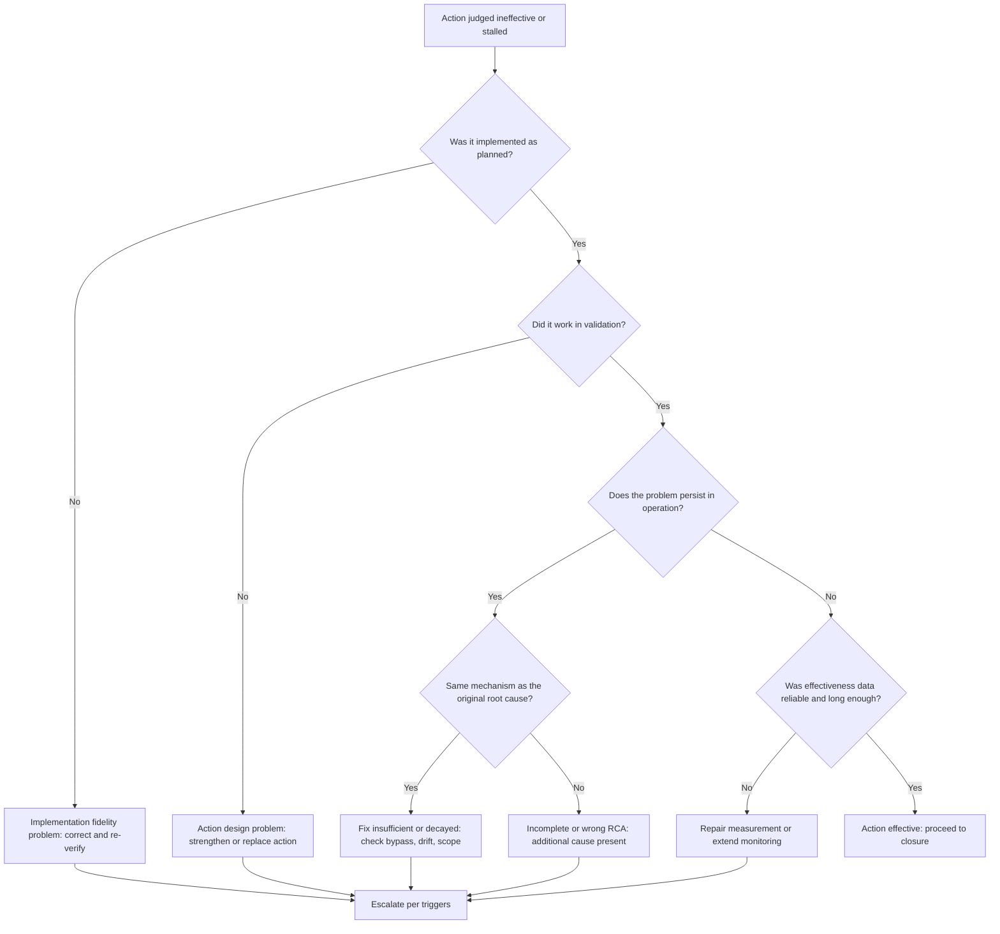
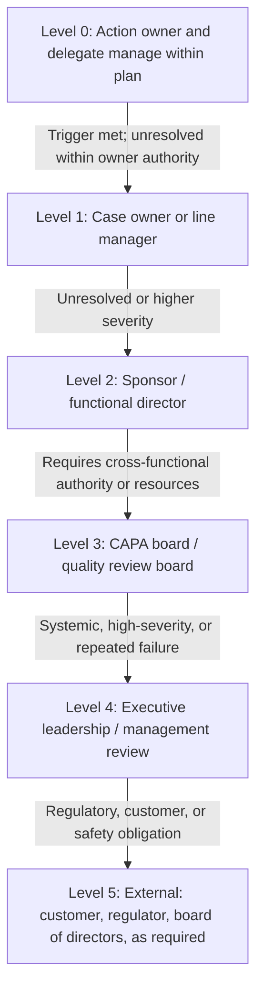
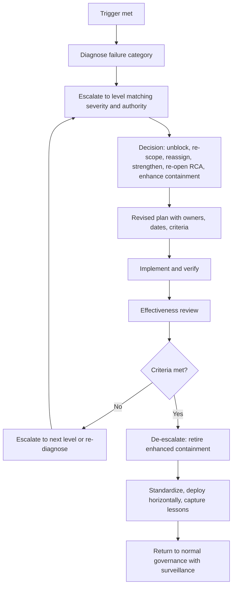

## Escalation Paths for Ineffective Actions


### Overview

Not every corrective action works. A control that was validated in testing may fail in production; a root cause that seemed verified may prove incomplete; a well-written plan may stall because the owner lacks authority or capacity. When an action is **ineffective** (it was implemented, but the problem persists or returns) or **stalled** (it cannot be completed as planned), the organization needs a defined, predictable way to **raise the issue to people who can change the outcome**. That mechanism is an **escalation path**.

Escalation in the context of Root Cause Analysis (RCA) and corrective and preventive action (CAPA) serves three distinct purposes:

1. **Authority:** Bring in decision-makers who can re-scope, fund, prioritize, or reassign work the current owner cannot resolve alone.
2. **Rigor:** Trigger a deeper, often independent, re-analysis when the original RCA or action has demonstrably failed.
3. **Risk visibility:** Ensure leadership knows about persistent risk to customers, safety, compliance, or operations, rather than allowing it to remain hidden in a tracking system.

Without defined escalation, ineffective actions tend to follow a predictable and damaging pattern: the problem recurs, the team re-applies the same weak fix, deadlines are quietly extended, and the record accumulates until an audit, a customer, or an incident forces attention.

**Key Points**

- Escalation is a **normal, expected process mechanism**, not a punishment or an admission of personal failure.
- Escalation should be triggered by **objective conditions** (evidence of ineffectiveness, missed milestones, recurrence, severity), not by personal discretion alone.
- An **ineffective action** most often signals a problem in the **RCA, the action's strength, or the resources behind it**, so escalation should widen the lens beyond the individual owner.
- Every escalation level needs a **named role, defined authority, expected response time, and required output**.
- **De-escalation and closure** criteria matter as much as escalation triggers; otherwise, escalations become permanent.
- Escalation must coexist with a **just, blame-free culture**; a path that punishes owners for raising problems will suppress reporting.

---

### Defining "Ineffective" and "Stalled"

Escalation applies to several distinct situations. Naming them precisely avoids treating every problem the same way.

| Situation | Definition | Example | Primary Concern |
| --- | --- | --- | --- |
| **Ineffective action** | Implemented as planned, but effectiveness criteria are not met | Interlock installed and validated, but missing-label escapes continue | RCA or action design is wrong or incomplete |
| **Recurrence after closure** | Problem returns after a case was closed as effective | Same incident class reappears months later | Premature closure, decay, or missed cause |
| **Stalled action** | Not implemented on time; blocked by lack of resources, authority, or dependencies | Tooling purchase not approved; owner reassigned | Governance and resourcing |
| **Partially effective action** | Improvement is real but short of the target | Defect rate falls from 3.1% to 1.2% against a 0.4% target | Residual causes; action strength |
| **Implementation deviation** | Action implemented differently from plan, or not as validated | Vendor installs a different sensor model | Change control and fidelity |
| **Adverse side effect** | Original problem improves but the fix causes a new problem | Validation rule blocks legitimate orders | Change risk assessment |
| **Unassessable action** | Effectiveness cannot be determined because data is missing or compromised | Monitoring metric was changed mid-period | Measurement integrity |
| **Escalating severity** | Risk increases while an action is in progress | Recurring event now causes customer harm | Urgency and containment adequacy |

**Key Points**

- **Ineffective** and **stalled** need different responses: the first calls for **re-analysis**, the second for **unblocking**.
- Reapplying the same action with a new due date is rarely a valid response to ineffectiveness. If an action failed, understand *why* before trying again.

---

### Why Actions Fail: Diagnostic Framework for Escalation

Escalation is most productive when it is paired with a structured diagnosis of why the action failed. The most common failure categories are listed below.

| Failure Category | Description | Typical Evidence | Typical Response |
| --- | --- | --- | --- |
| **Wrong root cause** | The RCA stopped at a plausible but unverified cause | Problem persists despite correct implementation | Re-open RCA with independent facilitator; gather stronger evidence |
| **Incomplete root cause** | Multiple contributing causes; only one addressed | Partial improvement; residual failures with different mechanisms | Extend analysis; add complementary actions |
| **Weak action** | Relied on training, reminders, or vigilance | Compliance drifts; human-error recurrences | Replace with stronger, system-level control |
| **Poor implementation fidelity** | Action not implemented as intended | Verification finds deviations | Correct implementation; strengthen change control |
| **Inadequate validation** | Fix worked in test but not in real conditions | Challenge test passes; production fails | Test under representative conditions |
| **Insufficient scope** | Fix applied to one location; problem exists elsewhere | Recurrence at an untreated site or product | Horizontal deployment |
| **Decay or bypass** | Control degraded or users worked around it | Audits find control disabled or bypassed | Standardize; monitor bypass; simplify correct path |
| **Environmental change** | Something changed after the fix (supplier, volume, technology) | New special-cause signals on control chart | Change-triggered re-analysis |
| **Resource or authority gap** | Owner cannot execute | Repeated extensions; unresolved dependencies | Sponsor or leadership intervention |
| **Measurement problem** | Effectiveness data unreliable | Measurement system changed; inconsistent data | Repair measurement; reassess |
| **Organizational or cultural factors** | Priorities, incentives, or norms undermine the fix | Fix bypassed under production pressure | Leadership-level review of incentives and constraints |



---

### Escalation Triggers

Triggers make escalation **objective and predictable**. Define them in the CAPA procedure so owners are not forced to decide, case by case, whether raising an issue will be viewed as a failure.

#### Categories of Triggers

| Category | Trigger Examples |
| --- | --- |
| **Effectiveness-based** | Effectiveness criteria not met at scheduled review; special-cause signals persist after the action; recurrence within the monitoring window; partial improvement below target |
| **Schedule-based** | Milestone at risk; action overdue by a defined interval; second or subsequent deadline extension |
| **Severity-based** | Recurrence involves safety, regulatory, or customer harm; severity rating increases; near-miss with high potential consequence |
| **Recurrence-based** | Same root-cause category appears in a second (or third) incident; a closed case reopens |
| **Resource or authority-based** | Owner lacks authority or budget; cross-functional conflict unresolved; required approval not granted |
| **Quality-of-evidence-based** | Measurement compromised; data unavailable; disagreement on whether criteria are met |
| **Compliance-based** | Regulatory or customer deadline at risk; audit finding on CAPA effectiveness |
| **Cumulative** | A single owner or area has multiple overdue or failed actions |

#### Example Trigger Matrix

| Condition | Severity Low | Severity Medium | Severity High / Critical |
| --- | --- | --- | --- |
| Milestone at risk | Owner notifies sponsor | Owner notifies sponsor within 2 business days | Immediate sponsor notification; same-day review |
| Overdue by defined interval | Sponsor review | Sponsor plus CAPA board | Executive escalation |
| Effectiveness criteria not met | Refine action; sponsor informed | CAPA board review; re-open RCA | Executive review; independent RCA; enhanced containment |
| Recurrence after closure | CAPA board review | CAPA board plus independent RCA | Executive review; formal problem review; consider external expertise |
| Second deadline extension | Sponsor approval | CAPA board approval | Executive approval with risk acceptance |

[Inference: The specific intervals, thresholds, and severity classes above are illustrative. Calibrate them to your organization's risk profile, regulatory obligations, and customer requirements.]

**Key Points**

- Tie trigger **timing** to severity; high-severity issues should escalate faster and higher.
- Include **"second failure"** triggers. A first failure is expected sometimes; a second failure on the same problem indicates a deeper systemic issue.
- Where feasible, **automate** trigger detection (overdue reports, control chart signals, incident tagging) so escalation does not depend on individuals remembering.

---

### Designing an Escalation Path

An escalation path is a **ladder of levels**, each with a role, authority, response time, and expected output.

#### Typical Escalation Levels



| Level | Role | Authority | Typical Response Time | Expected Output |
| --- | --- | --- | --- | --- |
| **0** | Action owner and delegate | Manage tasks within plan; request help | Immediate | Status update; early risk flag |
| **1** | Case owner / line manager | Adjust tasks, reassign work within team, coach | 1 to 2 business days | Recovery plan; clarified priorities |
| **2** | Sponsor / functional director | Allocate resources, resolve cross-team conflicts, approve extensions | 2 to 5 business days | Decision: unblock, re-scope, reassign, or escalate further |
| **3** | CAPA board / quality review board | Re-open RCA; approve significant plan changes; assign independent investigators; approve risk acceptance | Next scheduled meeting or ad hoc for urgent cases | Documented decision and revised plan |
| **4** | Executive leadership / management review | Fund major changes; set strategic priorities; accept enterprise risk | Defined by risk (days for critical) | Directive, resourcing decision, risk acceptance |
| **5** | External parties | Regulatory reports, customer notifications, board disclosure | Per regulation or contract | Formal notification; corrective commitments |

[Inference: Organizations differ in structure. Small teams may collapse levels (for example, combining sponsor and board), and regulated industries may require specific notification timelines governed by law or contract.]

#### Design Principles

| Principle | Explanation |
| --- | --- |
| **Predefined and documented** | Owners know when and how to escalate before they need to |
| **Trigger-driven** | Objective conditions, not personal comfort, initiate escalation |
| **Clear authority at each level** | Each level can make specific decisions; avoid "escalation to nowhere" |
| **Time-boxed** | Each level has a response deadline to prevent stalling |
| **Severity-scaled** | Higher risk skips levels or moves faster |
| **Bypass allowed for safety** | Any person may escalate directly to senior leadership for imminent safety, legal, or regulatory risk |
| **Documented decisions** | Every escalation produces a recorded decision and rationale |
| **Blame-free by design** | Escalation is framed as accessing help, not assigning fault |
| **Closed with feedback** | Escalating parties are told the outcome |

#### Parallel Escalation Tracks

Some situations warrant escalating along more than one dimension at once:

| Track | Focus |
| --- | --- |
| **Technical track** | Re-analysis of root cause; independent investigation; specialized expertise |
| **Governance track** | Resourcing, priority, authority, and accountability decisions |
| **Risk track** | Customer or regulatory communication; enhanced containment; risk acceptance |

---

### Actions Available at Each Escalation Level

Escalation should result in a **decision**, not merely a status report. The available responses form a decision menu.

| Response | When Appropriate | Example |
| --- | --- | --- |
| **Unblock** | Action is sound but obstructed | Sponsor approves budget or resolves a cross-team dependency |
| **Re-scope** | Action is too large or unachievable as written | Split into interim control and long-term project |
| **Reassign owner** | Owner lacks authority, capacity, or is no longer available | Appoint a new owner with process authority |
| **Strengthen the action** | Action is weak or partially effective | Replace training-only fix with an interlock or automated check |
| **Add complementary actions** | Multiple causes exist | Add an action targeting a second cause |
| **Re-open RCA** | Evidence suggests the causal model is wrong or incomplete | Assign an independent facilitator to redo the analysis with new data |
| **Enhance containment** | Risk persists while fix is developed | Return to 100% inspection; add customer notification |
| **Extend monitoring** | Improvement likely but evidence inconclusive | Lengthen window; add leading indicators |
| **Extend deadline** | Delay is justified and risk-assessed | Approve a new date with documented reason |
| **Accept residual risk** | Remaining risk is tolerable and formally approved | Executive risk acceptance with review date |
| **Escalate further** | Level lacks authority or severity warrants | Move to next level |
| **Stop or cancel** | Action no longer relevant or superseded | Document rationale and closure |

**Key Points**

- **Risk acceptance** should be an explicit, **time-limited, documented** decision by someone with authority, not a passive outcome of inaction.
- Extending a deadline without changing the plan, evidence, or resources is the weakest response and should require justification.

---

### Independent Re-Analysis of Ineffective Actions

When an action fails its effectiveness review, the original investigators may be poorly positioned to see what they missed. Common biases include **anchoring** on the original root cause, **confirmation bias**, and **defensiveness**. Higher escalation levels should therefore consider bringing in **independent investigators**.

#### When Independence Is Warranted

- Second failure on the same problem
- High-severity or regulated events
- Persistent disagreement about root cause
- Suspected organizational or cultural contributors to the failure

#### Re-Analysis Approach

| Step | Activity |
| --- | --- |
| 1 | Freeze and preserve the original evidence and analysis |
| 2 | Assemble a fresh team including an independent facilitator and subject-matter experts not previously involved |
| 3 | Restate the problem with **new data**, including what has occurred since the action |
| 4 | Test the original causal chain: for each "why," ask what evidence supports it and whether alternative explanations were excluded |
| 5 | Use complementary methods (for example, fishbone, fault tree analysis, change analysis, is/is-not comparison, barrier analysis) rather than repeating only the 5 Whys |
| 6 | Examine **why the previous actions failed** as a diagnostic question |
| 7 | Verify the revised root cause with data or experiment before writing new actions |
| 8 | Develop stronger actions and update the effectiveness plan |

**Example**

Original 5 Whys concluded: "Defects occurred because operators skipped the calibration step; retrain operators." Defects recurred after training.

Independent re-analysis finds that the calibration step is skipped because the calibration tool takes 12 minutes per use and line rate targets penalize downtime; operators adapt to meet output targets. The verified root cause is a **conflict between production incentives and process requirements**, not a knowledge gap.

Revised actions: redesign the fixture to include a fast-calibration feature, adjust line-rate accounting to include calibration time, and add an automated calibration-status interlock. Training alone is retired as the primary control.

**Conclusion**

The escalation succeeded not by demanding more effort from operators but by revealing an organizational cause that only leadership-level authority could change.

---

### Statistical Signals That Should Trigger Escalation

Statistical Process Control provides objective, early evidence of ineffectiveness and helps avoid both overreaction and underreaction.

| Signal | Interpretation | Escalation Consideration |
| --- | --- | --- |
| Points beyond control limits after action | Special cause still present | Investigate immediately; escalate if unresolved |
| Run of points on the unfavorable side of the center line | Sustained adverse shift | Action likely ineffective or environment changed |
| Center line has not shifted after action | No measurable effect | Action not demonstrated effective |
| Improvement that fades over time | Novelty decay or degradation | Review standardization and surveillance |
| Variation unchanged (range chart flat) | Variation cause unaddressed | Possible incomplete root cause |
| Capability index remains below target | Process stable but inadequate | Redesign; higher-level resourcing |
| Rising trend in recurrence rate | System-level learning failure | Management review of CAPA effectiveness |

For attribute data, a simple check of whether the post-action proportion has fallen below target can use the two-proportion approach:

$$z = \frac{\hat{p}_1 - \hat{p}_2}{\sqrt{\hat{p}(1-\hat{p})\left(\frac{1}{n_1} + \frac{1}{n_2}\right)}}$$

where $\hat{p}_1$ is the baseline proportion, $\hat{p}_2$ the post-action proportion, and $\hat{p}$ the pooled proportion.

For rare events, use exposure-adjusted rates and exact confidence intervals rather than raw counts. [Inference: With very small counts, a single additional event may or may not be statistically distinguishable from the improved rate; escalation decisions for rare events should weigh severity and mechanism evidence, not only statistics.]

**Key Points**

- Do not escalate on **single points inside control limits**; that is tampering.
- Do escalate on **pre-defined signals** such as rule violations, failure to meet effectiveness criteria, or recurrence, especially when severity is high.

---

### Worked Example: Escalation of an Ineffective Action

**Example**

**Background:** A hospital pharmacy experienced medication-dispensing errors due to look-alike vials. Original RCA concluded "staff selected the wrong vial." Corrective action A1: retrain pharmacy staff and issue a memo. Effectiveness criterion: zero wrong-vial dispensing events over 90 days.

**Timeline:**

| Day | Event | Escalation Response |
| --- | --- | --- |
| 0 | A1 implemented (training completed 100%) | Verification complete |
| 34 | Wrong-vial event reported (near miss caught at bedside) | **Level 1**: Case owner reviews; notes recurrence within monitoring window; flags to sponsor |
| 41 | Second event: wrong vial dispensed, patient received incorrect concentration; no lasting harm | Severity rises; **Level 2 and 3** convened same day; enhanced containment (independent double-check, separate storage) |
| 44 | CAPA board assigns independent facilitator; re-opens RCA | **Level 3** decision |
| 52 | Re-analysis finds root cause: identical packaging, adjacent storage, and no barcode scan at dispensing | Systemic causes |
| 55 | Board approves stronger actions: physical separation, tall-man lettering, barcode verification at dispensing, supplier packaging change request | Actions assigned, funded by sponsor |
| 60 | Executive review of medication-safety program; horizontal review of all look-alike/sound-alike drugs approved | **Level 4** |
| 60 to 180 | Implementation and 90-day monitoring | Effectiveness review scheduled |

**Analysis of the escalation:**

| Aspect | Observation |
| --- | --- |
| **Why did A1 fail?** | Weak, human-dependent action that did not address storage or packaging conditions |
| **What did escalation add?** | Independent re-analysis, funding for system changes, and cross-departmental authority (procurement, informatics, pharmacy operations) |
| **What made escalation timely?** | Recurrence within the monitoring window was a predefined trigger; severity increase accelerated to Level 3 |
| **What was avoided?** | Repeating training with a new date, which would likely have failed again |

**Output**

The escalation converted a stalled, training-only response into a set of strong, system-level controls, and triggered a wider look at similar drug pairs. Effectiveness was later verified with a stable control chart and zero events over the monitoring window. [Inference: This scenario is illustrative and simplified; real events would include additional regulatory reporting and disclosure requirements that vary by jurisdiction.]

---

### Escalation Rules for Common Problem Patterns

| Pattern | Recommended Escalation Approach |
| --- | --- |
| **Recurrence of a "human error" problem** | Challenge the human-error conclusion; escalate to CAPA board for independent re-analysis focusing on system conditions |
| **Repeated deadline extensions** | Escalate to sponsor after the first, CAPA board after the second; review achievability, authority, and resourcing |
| **Cross-functional deadlock** | Sponsor or executive resolves priority conflict; document decision |
| **Supplier-related ineffectiveness** | Escalate through supplier management (supplier corrective action request, business review, potentially sourcing changes) |
| **Chronic problems with no clear owner** | Executive assigns owner and sponsor; consider forming a dedicated problem-solving team |
| **Disagreement about whether criteria are met** | Independent reviewer or CAPA board adjudicates using predefined criteria and evidence |
| **Regulatory or customer commitment at risk** | Immediate executive and regulatory affairs involvement; document communication |
| **Multiple failed actions in the same area** | Management review of area capability, resources, and culture; consider a systemic diagnostic |
| **Data or measurement failures** | Escalate to measurement system owner; repair before reassessing effectiveness |

---

### Governance Structures Supporting Escalation

#### CAPA Board or Review Forum

A standing cross-functional body provides a consistent decision point for escalated items.

| Element | Guidance |
| --- | --- |
| **Membership** | Quality, operations, engineering, and other relevant functions, with authority to commit resources or escalate to those who can |
| **Cadence** | Regular (for example, weekly to monthly) plus ad hoc for urgent items |
| **Standing agenda** | Overdue actions; failed effectiveness reviews; recurrences; extension requests; risk acceptances |
| **Decision recording** | Minutes capture decision, rationale, owner, and due date |
| **Metrics review** | Effectiveness pass rate, recurrence rate, overdue count, extension rate, escalation cycle time |
| **Rules of engagement** | Focus on system causes; owners are supported, not interrogated |

#### RACI for Escalation

| Activity | Action Owner | Case Owner | Sponsor | CAPA Board | Executive |
| --- | --- | --- | --- | --- | --- |
| Recognize trigger and flag | **R** | A | I |  |  |
| Diagnose why the action failed | R | **A** | C | C | I |
| Unblock resources / re-scope | C | R | **A** | C | I |
| Re-open RCA / assign independent team | C | R | C | **A** | I |
| Approve risk acceptance | C | R | C | R | **A** |
| Communicate to customers / regulators |  | R | C | C | **A** |
| Record decisions and update plan | R | **A** | I | I | I |

[Inference: Role assignments vary by organization; ensure exactly one Accountable per activity.]

---

### Documenting Escalations

A complete record supports audits, learning, and accountability.

| Field | Purpose |
| --- | --- |
| **Escalation ID and linked case** | Traceability |
| **Date and trigger** | Which condition initiated escalation |
| **Escalated by** | Who raised it |
| **Severity assessment** | Basis for speed and level |
| **Evidence of ineffectiveness** | Data, charts, findings |
| **Diagnosis** | Suspected failure category |
| **Escalation level and recipients** | Where it went |
| **Decision** | Selected response from the decision menu |
| **Rationale** | Why the decision was made |
| **Revised plan** | New actions, owners, dates, effectiveness criteria |
| **Risk acceptance (if any)** | Approver, scope, expiration date |
| **Response time** | Time from trigger to decision |
| **Outcome and follow-up** | Result and next review |

#### Template: Escalation Record

```markdown
### Escalation ESC-2026-0311

- **Linked case / action:** CAPA-2026-0207 / A1
- **Date raised:** 2026-11-12
- **Raised by:** J. Mbeki (Action Owner)
- **Trigger:** Effectiveness criterion not met (2 recurrences within 90-day window)
- **Severity:** High (customer-impacting)
- **Escalation level:** 3 (CAPA Board), with Level 2 sponsor notified same day

**Evidence**
- p chart shows 4 special-cause signals post-action
- Rate 1.4% vs target ≤ 0.4%; baseline 3.1%

**Diagnosis:** Incomplete root cause (second failure mechanism suspected)

**Decision (CAPA Board, 2026-11-14)**
1. Re-open RCA with independent facilitator (L. Petrov)
2. Enhance containment: reinstate daily reconciliation
3. Sponsor to fund additional monitoring instrumentation
4. New effectiveness review date: 2027-02-12

| Revised Action | Owner | Due |
|----------------|-------|-----|
| Independent RCA report | L. Petrov | 2026-12-05 |
| Reinstated containment C1 | K. Osei | 2026-11-15 |
| Monitoring instrumentation | D. Alvarez (Sponsor) | 2026-12-01 |

- **Risk acceptance:** None
- **Response time (trigger to decision):** 2 days
- **Follow-up:** Board review 2026-12-12
```

---

### Handling Human and Cultural Factors

Escalation systems succeed or fail on trust. If owners fear punishment, they will delay escalation, minimize findings, or reclassify problems to avoid triggering thresholds.

| Risk | Manifestation | Countermeasure |
| --- | --- | --- |
| **Fear of blame** | Owners delay raising problems | Frame escalation as help; recognize early flagging; apply just-culture principles |
| **Normalization of deviance** | Repeated failures become accepted | Automatic triggers on recurrence; independent review |
| **Gaming thresholds** | Redefining criteria or data to avoid escalation | Predefine criteria; independent review; audit trails |
| **Escalation fatigue** | Too many escalations desensitize leaders | Calibrate triggers to severity; consolidate; track signal-to-noise |
| **Escalation as blame transfer** | Owners push responsibility upward to avoid work | Require a diagnosis and recommended response with each escalation |
| **Leaders dismissing escalations** | No decisions, or "try harder" responses | Time-boxed response; required documented decisions; executive metrics |
| **Hierarchy barriers** | Junior staff cannot raise concerns | Direct-access route for safety-critical issues; anonymous reporting where appropriate |

**Key Points**

- An escalation that returns only "work harder" or "be more careful" is a **non-response**. Leaders should be expected to provide **resources, authority, or decisions**.
- Measure and review **escalation response time** and **escalation outcomes** to ensure the mechanism has teeth.
- Recognize and reward **early, honest flagging** to reinforce the behavior the system depends on.

---

### Metrics for the Escalation System

| Metric | Definition | Interpretation |
| --- | --- | --- |
| **Escalation rate** | Escalated actions ÷ total open actions | Too low may indicate suppression; too high may indicate poor planning or overload |
| **Escalation response time** | Time from trigger to decision | Responsiveness of governance |
| **Escalation resolution rate** | Escalations resolved within target time ÷ escalations | Effectiveness of the mechanism |
| **Repeat-escalation rate** | Cases escalated more than once ÷ escalated cases | Quality of decisions and root cause work |
| **Ineffective-action rate** | Actions failing first effectiveness review ÷ actions reviewed | RCA and action quality |
| **Recurrence rate** | Closed problems that recurred ÷ closed problems | System-level learning |
| **Deadline-extension rate** | Actions with one or more extensions ÷ total actions | Achievability and planning realism |
| **Time to independent re-analysis** | Time from failed effectiveness review to start of independent RCA | Speed of rigorous response |
| **Risk acceptance count and age** | Number and duration of active risk acceptances | Hidden risk exposure |

$$\text{Escalation rate} = \frac{\text{Actions escalated in period}}{\text{Open actions in period}} \times 100\%$$


$$\text{Repeat-escalation rate} = \frac{\text{Cases escalated more than once}}{\text{Cases escalated}} \times 100\%$$

Plot key metrics on control charts to separate genuine change from month-to-month noise. A sudden jump in escalation rate may reflect a real deterioration, a new detection capability, or a cultural improvement in willingness to report, so investigate before drawing conclusions. [Inference: Interpreting escalation metrics requires context; a rising rate is not automatically negative.]

---

### Domain Considerations

#### Software and IT Operations

- Escalation often aligns with **incident severity levels** (for example, Sev 1 to Sev 4), with defined response and executive notification requirements at each level.
- **Repeat incidents** in the same service or cause category should trigger problem-management review and possibly an architecture review.
- Action items from post-incident reviews that remain open past due are commonly reviewed in reliability forums, with escalation to engineering leadership when systemic.
- Use **error budgets** and reliability targets as an organizational lever: exhausting an error budget can formally trigger prioritization of reliability work over feature work. [Inference: This mechanism is common in site reliability engineering practice but its specific rules vary by organization.]

#### Manufacturing

- Customer-driven programs commonly specify **problem-solving timelines** and require escalation when responses or effectiveness are late. Supplier corrective action processes typically include escalation tiers up to business-level review.
- **Repeat customer complaints** on the same failure mode often trigger formal escalation levels defined by customer quality requirements. [Inference: Exact tiers, names, and timelines are defined by individual customers and sector standards.]

#### Healthcare and Regulated Environments

- Serious events may require **mandatory internal escalation to executive and governing-body level** and **external reporting** within legally defined timeframes.
- Ineffective actions after serious events carry heightened scrutiny; documentation of escalation, decisions, and rationale is important for regulatory review.
- Protect **reporting culture** with just-culture principles to ensure escalation is not suppressed.

---

### Implementation Sketch: Automated Escalation Rules

A short Python example that evaluates action status and recommends escalation levels based on triggers and severity.

**Example**

```python
from dataclasses import dataclass
from datetime import date
from typing import Optional

SEVERITY_RANK = {"low": 1, "medium": 2, "high": 3, "critical": 4}

@dataclass
class ActionStatus:
    action_id: str
    severity: str                 # low / medium / high / critical
    due: date
    extensions: int
    effectiveness_met: Optional[bool]   # None = not yet reviewed
    recurrences_in_window: int
    same_cause_prior_cases: int
    owner_has_authority: bool


def recommend_escalation(a: ActionStatus, today: date) -> tuple[int, list[str]]:
    """Return (recommended escalation level 0-4, reasons)."""
    level = 0
    reasons = []
    sev = SEVERITY_RANK[a.severity]

    days_overdue = (today - a.due).days
    if days_overdue > 0:
        lvl = 1 if days_overdue <= 7 else 2
        level = max(level, lvl)
        reasons.append(f"Overdue by {days_overdue} days.")

    if a.extensions >= 1:
        level = max(level, 2)
        reasons.append(f"{a.extensions} deadline extension(s); review achievability.")
    if a.extensions >= 2:
        level = max(level, 3)
        reasons.append("Repeated extensions; CAPA board review.")

    if a.effectiveness_met is False:
        level = max(level, 3)
        reasons.append("Effectiveness criteria not met; re-open RCA.")

    if a.recurrences_in_window > 0:
        level = max(level, 2 + (1 if sev >= 3 else 0))
        reasons.append(f"{a.recurrences_in_window} recurrence(s) inside monitoring window.")

    if a.same_cause_prior_cases >= 1:
        level = max(level, 3)
        reasons.append("Same root-cause category as prior closed case; systemic issue.")

    if not a.owner_has_authority:
        level = max(level, 2)
        reasons.append("Owner lacks authority; sponsor intervention required.")

    if sev == 4 and level > 0:
        level = 4
        reasons.append("Critical severity: executive escalation.")

    return level, reasons


a = ActionStatus(
    action_id="A1",
    severity="high",
    due=date(2026, 10, 16),
    extensions=2,
    effectiveness_met=False,
    recurrences_in_window=2,
    same_cause_prior_cases=0,
    owner_has_authority=True,
)

level, reasons = recommend_escalation(a, today=date(2026, 11, 12))
print(f"Recommended escalation level: {level}")
for r in reasons:
    print(" -", r)
```

**Output**

```text
Recommended escalation level: 3
 - Overdue by 27 days.
 - 2 deadline extension(s); review achievability.
 - Repeated extensions; CAPA board review.
 - Effectiveness criteria not met; re-open RCA.
 - 2 recurrence(s) inside monitoring window.
```

This script shows the **pattern** of translating written triggers into consistent, auditable recommendations. Human judgment must confirm the recommendation and choose the response. [Inference: Production tools typically integrate with case-management, monitoring, and notification systems and store the decision trail.]

---

### Common Pitfalls and Remedies

| Pitfall | Consequence | Remedy |
| --- | --- | --- |
| No defined escalation path | Ineffective actions linger; recurring problems | Document levels, triggers, roles, and timelines |
| Escalation depends on owner discretion | Delayed or suppressed escalation | Objective, automated triggers |
| Escalation seen as punishment | Concealment; late reporting | Just-culture framing; reward early flagging |
| Reapplying the same action with a new date | Repeated failure | Require a diagnosis of why the action failed |
| Escalating without a diagnosis or proposal | Leaders cannot decide; delays | Require evidence and a recommended response |
| Escalation to a level with no authority | "Escalation to nowhere" | Match levels to decision rights; include resource authority |
| No response deadlines | Escalations stall | Time-box each level |
| Same team re-analyzes its own failure | Anchoring, confirmation bias | Independent facilitator for repeat or high-severity failures |
| Treating partial improvement as success | Residual risk persists | Compare to predefined criteria; refine or add actions |
| Extending deadlines silently | Loss of accountability | Written justification and approval per extension |
| Risk acceptance by default | Hidden exposure | Explicit, time-limited, documented risk acceptance |
| Failing to communicate outcomes | Owners lose trust in the system | Close the loop with the escalating party |
| Over-escalation of low-risk items | Fatigue; lost focus | Severity-scaled triggers and levels |
| Ignoring cultural and incentive causes | Same failures recur | Include organizational factors in re-analysis; involve leadership |
| Never de-escalating | Permanent crisis mode | Define exit criteria and return to normal governance |

---

### De-Escalation and Return to Normal Governance

Escalation is a temporary elevation of attention and authority. Define how it ends.

| De-Escalation Condition | Evidence |
| --- | --- |
| Revised actions implemented and verified | Verification and validation records |
| Enhanced containment retired per criteria | Retirement record |
| Effectiveness criteria met on the revised plan | Effectiveness review |
| Root cause and action strength independently confirmed | Re-analysis report accepted by the board |
| Standardization and horizontal deployment complete | Closure criteria checklist |
| Surveillance plan in place | Monitoring plan with owners and triggers |



Lessons from each escalation should feed back into **CAPA procedures, action-selection guidance, and RCA training**, so that the same categories of failure become less likely over time.

---

### Best Practices Checklist

- **Define escalation levels, triggers, roles, authority, and response times** in the CAPA procedure before they are needed.
- Use **objective triggers** tied to effectiveness, schedule, recurrence, severity, resource gaps, and data quality.
- **Scale speed and level to severity**, with a direct route to senior leaders for imminent safety, legal, or regulatory risk.
- Require every escalation to include **evidence, a diagnosis of why the action failed, and a recommended response**.
- Ensure each level can make **real decisions** (resources, priorities, reassignments, risk acceptance) and that decisions are **recorded with rationale**.
- Use **independent re-analysis** for repeat failures, high-severity events, or contested root causes, and apply multiple methods rather than repeating only the 5 Whys.
- Prefer **stronger, system-level actions** over repeating training or reminders when an action has failed.
- Treat **risk acceptance** as explicit, time-limited, and approved at the appropriate authority level.
- Use **control charts and objective criteria** to avoid both tampering and under-reaction.
- **Protect reporting culture** with just-culture principles, and recognize early flagging.
- **Time-box** escalations and **close the loop** with the escalating party.
- Define **de-escalation criteria** and return to normal governance with a surveillance plan.
- Monitor **escalation metrics** and use them, together with recurrence and effectiveness metrics, to improve the CAPA system itself.

---

**Related Topics**

- Verifying corrective action effectiveness
- Closing the loop and preventing recurrence
- Assigning ownership and accountability
- Differentiating corrective, preventive, and containment actions
- Independent and multi-method RCA (fishbone, fault tree, change analysis, barrier analysis)
- Just culture and psychological safety in problem solving
- CAPA board governance and management review
- Risk acceptance and residual risk management
- Incident severity classification and problem management in IT operations
- Supplier corrective action escalation and customer problem-solving requirements