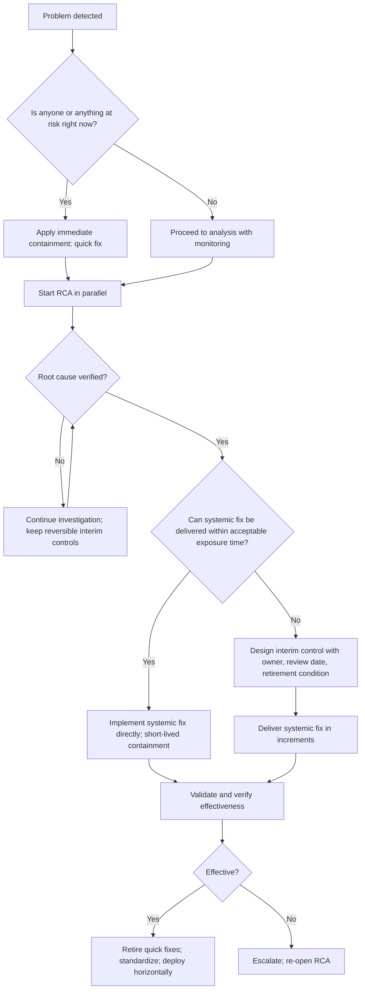
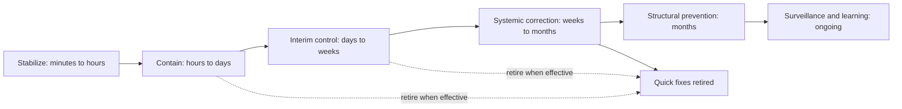
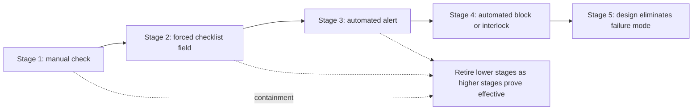

## Balancing Quick Fixes with Systemic Fixes


### Overview

Every significant problem creates two competing pressures. The first is **urgency**: customers are affected, production is stopped, or an outage is in progress, and someone must act *now*. The second is **durability**: if the underlying cause is not addressed, the same problem will return, often at a worse time. A **quick fix** answers the first pressure; a **systemic fix** answers the second. Effective Root Cause Analysis (RCA) and corrective and preventive action (CAPA) programs do not choose one over the other. They **sequence, connect, and govern** both.

Failure happens at either extreme:

- **Quick fixes only.** Teams repeatedly patch symptoms. The organization becomes skilled at firefighting, rewards heroics, and accumulates hidden workarounds, manual checks, and operational debt. The same problems recur, and each recurrence consumes the capacity that could have been spent on prevention.
- **Systemic fixes only.** Teams delay protective action while a thorough redesign is developed, exposing customers and the business to avoidable harm. Perfectionism, analysis paralysis, or over-scoped projects can leave problems open for months.

The 5 Whys illustrates the tension in a single chain: the early "whys" suggest quick fixes that address immediate conditions, while the later "whys" point toward systemic causes in design, process, policy, and management systems. A mature response uses the early answers to **stop the bleeding** and the later answers to **stop the recurrence**, and it keeps the two explicitly linked so the quick fix is never mistaken for the cure.

**Key Points**

- A quick fix is **not inherently bad**; an *unmanaged, permanent, or unlabeled* quick fix is.
- A systemic fix is **not inherently good**; a systemic fix that arrives too late, is over-scoped, or is never verified is also a failure.
- The core discipline is **explicit classification, sequencing, and retirement**: label each action, put containment first, time-box interim measures, and make the systemic fix the exit condition.
- Quick fixes that remain in place without an owner, review date, or retirement condition become **permanent workarounds** and a source of **operational or technical debt**.
- The choice depends on **risk, reversibility, cost, and evidence**, not on personal preference or organizational habit.
- Systemic fixes should be **decomposed into achievable increments** so protection improves continuously rather than waiting for a single large delivery.

---

### Defining the Terms

| Term | Definition | Typical Duration | Addresses Root Cause? |
| --- | --- | --- | --- |
| **Quick fix (containment / workaround)** | A fast action that limits impact or restores function without removing the underlying cause | Hours to weeks | No |
| **Interim control** | A deliberately temporary, risk-managed measure that provides adequate protection while a permanent fix is built | Weeks to months, time-boxed | Partially or not at all |
| **Systemic fix (permanent corrective action)** | A change to the design, process, system, or management practice that eliminates the cause or makes the failure mode impossible or self-correcting | Permanent | Yes |
| **Structural / systemic prevention** | A change to the environment in which many processes operate (templates, standards, platforms, policies) so that whole classes of failure are prevented | Permanent | Yes, for a class of causes |
| **Band-aid / patch** | Informal term for a quick fix applied to the symptom | Often unbounded, unless managed | No |
| **Workaround** | A way of operating around a known deficiency, usually without fixing it | Often unbounded | No |

**Systemic** does not simply mean "large." A one-line configuration default that prevents a class of errors can be a stronger systemic fix than a multi-month project. What makes a fix systemic is that it **acts on the cause and persists independent of individual vigilance**.

#### Relationship to Action Categories

| Action Type (CAPA) | Typical Character | Relationship to This Topic |
| --- | --- | --- |
| **Containment** | Quick, temporary, symptom-focused | The legitimate home of quick fixes |
| **Corrective** | Root-cause-focused, permanent | The home of systemic fixes for the problem that occurred |
| **Preventive** | Extends the fix to other places or potential problems | Systemic fixes applied more broadly |
| **Interim corrective control** | Bridge between the two | The managed middle ground |

---

### Comparison: Quick Fix vs. Systemic Fix

| Dimension | Quick Fix | Systemic Fix |
| --- | --- | --- |
| **Primary aim** | Reduce immediate harm or restore function | Eliminate the cause and prevent recurrence |
| **Target** | Symptom or effect | Root cause and enabling conditions |
| **Speed to deploy** | Fast | Slower (analysis, design, validation) |
| **Upfront cost** | Low | Moderate to high |
| **Ongoing cost** | Often high and recurring (labor, inspection, rework) | Typically low once built |
| **Durability** | Low; depends on continued effort | High; independent of individual vigilance |
| **Reliance on humans** | Often high (manual checks, reminders) | Lower (design, automation, forcing functions) |
| **Risk of new side effects** | Moderate (hasty changes) | Varies; mitigated by change control and validation |
| **Reversibility** | Usually easy to reverse | May be harder to reverse |
| **Learning value** | Low | High; feeds standards and lessons learned |
| **Recurrence prevention** | Little or none | Primary purpose |
| **Failure mode if used alone** | Firefighting culture; accumulating debt | Prolonged exposure; delayed protection |

[Inference: Cost and speed characteristics are typical patterns, not rules; some systemic fixes are cheap and fast, and some quick fixes are costly to sustain.]

---

### Why Organizations Drift Toward Quick Fixes

Understanding the forces behind quick-fix bias helps design countermeasures.

| Driver | Description | Countermeasure |
| --- | --- | --- |
| **Urgency and visibility** | Immediate pressure from customers or leadership rewards fast visible action | Legitimize containment, then require a plan for the systemic fix with dates |
| **Incentives for heroics** | Firefighters are praised; preventers are invisible | Recognize and measure prevention and recurrence reduction |
| **Resource scarcity** | Teams are overloaded; systemic work competes with feature or production work | Reserve capacity; use risk-based prioritization; sponsor-level commitment |
| **Analysis shortcuts** | 5 Whys stopped at a symptom-level answer | Verify root cause with evidence; require systemic "why" levels |
| **Short-termism** | Quarterly targets outweigh long-term reliability | Include recurrence and operational-debt metrics in management review |
| **Ownership gaps** | No one owns the systemic fix or has authority to make it | Assign owners with authority; sponsor escalation |
| **Fear of blame** | Deep RCA might expose management or design decisions | Just-culture principles; focus on systems |
| **Cognitive bias** | Availability, action bias, and "we've always done it this way" | Independent facilitation; structured methods |
| **Apparent success** | The quick fix seems to work, so the record is closed | Effectiveness criteria and monitoring windows before closure |
| **Complexity** | The true fix crosses organizational boundaries | Escalation and cross-functional governance |

### Why Organizations Sometimes Over-Invest in Systemic Fixes

| Driver | Description | Countermeasure |
| --- | --- | --- |
| **Perfectionism** | Waiting for the "right" answer while harm continues | Time-boxed containment; iterative delivery |
| **Scope inflation** | Every incident becomes a transformation program | Risk-proportionate scope; decompose into increments |
| **Analysis paralysis** | Endless investigation with no action | Decision deadlines; "good enough to act" criteria with monitoring |
| **Low-risk over-engineering** | Expensive fix for a minor problem | Cost-benefit and risk ranking (severity, occurrence, detection) |
| **Ignoring reversibility** | Irreversible changes made on thin evidence | Pilot; reversible steps first |

---

### Decision Framework: How Much Quick, How Much Systemic

The right balance depends on the specifics of the problem. A structured set of questions makes the choice explicit and auditable.

#### Key Decision Factors

| Factor | Question | Pushes Toward |
| --- | --- | --- |
| **Severity** | What is the worst credible consequence (safety, regulatory, customer, financial)? | High severity: immediate containment *and* accelerated systemic work |
| **Occurrence / recurrence likelihood** | How likely and how frequently will it recur? | High likelihood: prioritize systemic fix |
| **Detectability** | Will we notice if the quick fix stops working? | Poor detectability: need stronger control or monitoring |
| **Exposure duration** | How long until the systemic fix can be in place? | Long lead time: robust interim controls |
| **Reversibility** | Can the change be undone easily? | Irreversible: more validation before acting |
| **Evidence strength** | How well verified is the root cause? | Weak evidence: quick, reversible actions and further investigation before large investment |
| **Cost of sustaining the quick fix** | What does the interim measure cost per week? | High ongoing cost: accelerate the systemic fix |
| **Dependencies** | Does the fix require vendors, approvals, or cross-team work? | Long dependencies: phase the work |
| **Regulatory or contractual obligation** | Are there mandated response times or controls? | Meet the obligation first, then systemic |
| **Scope of exposure** | Is the cause present in other processes or products? | Wide scope: systemic and horizontal deployment |

#### Decision Flow



---

### The Layered Response Model

Rather than treating quick and systemic fixes as alternatives, treat them as **layers** in a single, coordinated response.

| Layer | Purpose | Timeframe | Example (Software Outage) |
| --- | --- | --- | --- |
| **1. Stabilize** | Stop the harm; restore service | Minutes to hours | Roll back the release; fail over traffic |
| **2. Contain** | Prevent spread; protect customers | Hours to days | Freeze similar changes; add manual verification; notify affected users |
| **3. Interim control** | Provide managed protection until the permanent fix | Days to weeks | Add a temporary pipeline warning and manual review gate for migrations |
| **4. Systemic correction** | Eliminate the cause | Weeks to months | Implement an automated pipeline check that blocks lock-inducing migrations; revise migration design standards |
| **5. Structural prevention** | Prevent the class of failure everywhere | Months | Bake the check into shared pipeline templates for all services; update architecture guidelines |
| **6. Surveillance and learning** | Detect decay; share lessons | Ongoing | Quarterly audits; lessons-learned entry; design-review checklist update |



**Key Points**

- Each layer has a **different owner mindset**: layers 1 and 2 prioritize speed; layers 4 and 5 prioritize durability and verification.
- Every temporary layer needs a **retirement condition** tied to the effectiveness of a more permanent layer.
- **Layer 3 (interim control)** is where the balance is actively managed; it is the safety net that makes it acceptable to take time on the systemic fix.

---

### Mapping the 5 Whys to the Balance

Different levels of the causal chain naturally suggest different types of action.

| Why Level | Nature of Answer | Suggested Response |
| --- | --- | --- |
| **Problem / Why 1** | Immediate, visible condition | Quick fix (containment) |
| **Why 2 to 3** | Technical or process mechanism | Interim corrective control; partial systemic action |
| **Why 4** | Design, procedure, or resourcing gap | Systemic corrective action |
| **Why 5 and beyond** | Management system, policy, culture, or incentive | Structural prevention; governance change |
| **"Where else?"** | Extension across similar processes | Preventive systemic action |

**Example**

Problem: A batch of customer invoices contained wrong tax rates.

| Level | Question and Answer | Response Type |
| --- | --- | --- |
| Problem | Invoices issued with incorrect tax rates |  |
| Immediate | Halt invoice run; recalculate and reissue affected invoices | **Quick fix (containment)** |
| Why 1 | Why wrong rates? The tax table used was outdated. |  |
| Why 2 | Why outdated? The quarterly tax update job did not run. | Restart job manually: **quick fix** |
| Why 3 | Why did it not run? The scheduler entry was removed during a server migration. | Re-add schedule: **interim control** |
| Why 4 | Why was it removed unnoticed? Migration checklist did not include scheduled jobs; no alert for missing updates. | Add job inventory to migration checklist and alert on stale tax table: **systemic corrective** |
| Why 5 | Why no inventory of scheduled jobs? No system-of-record for operational jobs; ownership unclear. | Create job catalog with owners; make migrations pull from catalog: **structural prevention** |
| Where else? | Do other reference-data updates rely on unlisted jobs? | Audit all reference-data jobs: **preventive systemic** |

**Conclusion**

Stopping at "restart the job" would fix today's invoices and leave the underlying organizational gap intact. Stopping only at "create a job catalog" would leave customers with wrong invoices while the catalog is built. The balanced response does both, in order.

---

### Managing Quick Fixes Responsibly

Quick fixes are necessary; unmanaged quick fixes are dangerous. Apply the following controls to every interim or containment measure.

#### Quick-Fix Governance Requirements

| Requirement | Purpose |
| --- | --- |
| **Explicit labeling** | Record the action as *containment* or *interim control*, never as the "corrective action" |
| **Named owner** | Someone accountable for operating and retiring it |
| **Documented rationale and risk** | What it protects against and what it does not |
| **Time box / review date** | A date by which it must be reviewed or retired |
| **Retirement condition** | The evidence of systemic fix effectiveness that allows removal |
| **Reinstatement trigger** | Conditions under which it must return if the systemic fix fails |
| **Cost tracking** | Recurring labor and opportunity cost, so the case for the systemic fix is visible |
| **Monitoring** | Evidence the quick fix is working (it may fail silently) |
| **Change control** | Even hasty measures should be recorded so they can be found and removed later |

#### Risks of Unmanaged Quick Fixes

| Risk | Description |
| --- | --- |
| **Permanent workaround** | Temporary measure becomes part of routine operation with no owner |
| **Hidden operational debt** | Manual steps and exceptions accumulate, increasing cost and error risk |
| **False assurance** | Team believes the problem is solved because symptoms disappeared |
| **Loss of institutional knowledge** | Workarounds known only to a few individuals |
| **Interaction effects** | Multiple patches conflict or mask each other |
| **Erosion of standards** | Exceptions normalize deviation from procedure |
| **Detection problems** | Quick fixes that hide the failure prevent the signals needed to diagnose it |
| **Audit exposure** | Records show closure with only containment |

#### Quick-Fix Registry

Maintain a register of active temporary measures.

| Field | Example |
| --- | --- |
| **ID / linked case** | QF-2026-041 / CAPA-2026-0142 |
| **Description** | Daily manual address comparison for open orders |
| **Type** | Containment |
| **Owner** | Order Operations Manager |
| **Start date** | 2026-08-15 |
| **Cost per week** | ~30 labor hours |
| **Linked systemic action(s)** | A1, A2, A3 |
| **Retirement condition** | A1 to A3 effective for 90 days; mismatch rate ≤ 0.1% |
| **Review date** | Monthly |
| **Reinstatement trigger** | Mismatch rate > 0.1% for 2 consecutive days |

**Key Points**

- Periodically audit the register for **age** (containment measures that outlived their intended life) and **cost** (sustained quick fixes may cost more than the systemic fix would).
- Track a **quick-fix ratio**: the share of open actions that are containment or interim compared with permanent corrective actions.

---

### Making Systemic Fixes Achievable

Systemic fixes stall when they are too large, too vague, or lack a path to delivery. Several techniques keep them moving.

#### Decompose into Increments

| Approach | Description | Example |
| --- | --- | --- |
| **Phased delivery** | Deliver in stages, each adding protection | Phase 1: alert on failures; Phase 2: input validation; Phase 3: architecture change |
| **Thin slice / pilot first** | Prove the fix on one line, service, or site, then scale | Pilot interlock on Line B, then roll out to C, D, and E |
| **Strengthening ladder** | Move from weaker to stronger controls over time | Checklist item → automated warning → hard block |
| **Risk-first ordering** | Address highest-risk failure modes first | Sequence by RPN or severity |
| **Reversible steps first** | Take low-risk, reversible steps while evidence builds | Feature flag or staged rollout |

#### The Strengthening Ladder

A useful way to reconcile speed with durability is to plan the systemic fix as a **progression of control strength**:

| Stage | Control | Strength | Typical Timing |
| --- | --- | --- | --- |
| 1 | Manual check or memo | Weak | Immediate (containment) |
| 2 | Checklist with forced field | Intermediate | Days to weeks |
| 3 | Automated warning or alert | Intermediate | Weeks |
| 4 | Automated blocking control or interlock | Strong | Weeks to months |
| 5 | Design change that eliminates the failure mode | Strong | Months |

Each stage is verified and can be the **interim control for the next stage**, so risk decreases continuously rather than in one jump.



#### Right-Size the Fix to the Risk

Match effort to consequence using a risk model. For prioritization, the Risk Priority Number is:

$$\text{RPN} = S \times O \times D$$

where $S$ is severity, $O$ is occurrence, and $D$ is detection difficulty. [Inference: Some current practice uses Action Priority (AP), which weights severity more heavily than RPN; use the method required by your organization or customer.]

| Risk Level | Suggested Balance |
| --- | --- |
| **Low** (low severity, low recurrence) | Simple corrective action; minimal or no containment; avoid over-engineering |
| **Medium** | Containment as needed; systemic fix within a defined window; standard effectiveness review |
| **High** | Immediate containment with strong interim controls; accelerated systemic fix; executive visibility |
| **Critical** (safety, regulatory, catastrophic) | Immediate and robust containment; parallel independent RCA; systemic fix prioritized above competing work; possible external notification |

---

### Cost and Value Reasoning

A clear economic comparison often makes the case for investing in systemic fixes, and also identifies when a quick fix is the rational choice.

#### Cost of Sustaining a Quick Fix

Let $c_q$ be the recurring cost per period of the quick fix (labor, inspection, rework, delay), and $T$ the number of periods it remains in place. The cumulative cost is:

$$C_{\text{quick}}(T) = c_q \cdot T$$

Let $C_s$ be the one-time cost of the systemic fix plus a small ongoing cost $c_s$ per period:

$$C_{\text{sys}}(T) = C_s + c_s \cdot T$$

The **break-even time** at which the systemic fix becomes cheaper is:

$$T^* = \frac{C_s}{c_q - c_s}, \quad \text{provided } c_q > c_s$$

**Example**

A manual inspection quick fix costs $c_q = 30$ labor hours per week (about $1,500 per week). A systemic fix (automated interlock) costs $C_s = \$36{,}000$ upfront, with ongoing cost $c_s = \$100$ per week.

$$T^* = \frac{36000}{1500 - 100} = \frac{36000}{1400} \approx 25.7 \text{ weeks}$$

**Output**

The systemic fix pays for itself in roughly six months on labor alone, before counting avoided defect, warranty, or reputational costs. If the quick fix would otherwise remain in place for a year or more, the systemic fix is clearly the rational investment.

[Inference: This simple model ignores the cost of failures that slip through the quick fix, the time value of money, and organizational disruption. Including expected failure cost strengthens the case for systemic fixes when the quick fix is imperfect.]

#### Including Expected Failure Cost

With expected annual failure cost $L_q$ under the quick fix and $L_s$ under the systemic fix, the total annual cost comparison becomes:

$$\text{Annual}_{\text{quick}} = 52\,c_q + L_q, \quad \text{Annual}_{\text{sys}} = C_s + 52\,c_s + L_s$$

Where the systemic fix reduces both recurring effort and expected failure cost, it typically dominates over a horizon of more than a few months.

#### When the Quick Fix Is the Right Answer

| Situation | Reasoning |
| --- | --- |
| Very low severity and low frequency | Systemic investment exceeds the risk it removes |
| Cause is unverified and evidence is weak | Reversible quick actions buy time; avoid committing resources to a wrong fix |
| The process is being retired or replaced soon | Investing in a permanent fix is wasteful |
| The systemic fix is impossible in the near term (regulatory approval, vendor lead time) | A robust interim control is the only option; manage it carefully |
| The problem is a one-off with a fully understood, non-recurring cause | Correction may suffice, with documented rationale |

**Key Points**

- Document the **rationale** for choosing a quick fix as final. "We chose not to pursue a systemic fix because..." with a risk-acceptance sign-off is a legitimate, auditable decision; silently doing nothing is not.

---

### Worked Example: Balancing Layers in a Manufacturing Escape

**Example**

**Situation:** A customer reports cracked housings from a molding line. Investigation shows inconsistent cooling time is producing brittle parts. Production continues at high volume; a replacement order is due in two weeks.

**Phase 1: Stabilize and Contain (Days 0 to 2)**

| Action | Type | Owner | Note |
| --- | --- | --- | --- |
| Quarantine and inspect all stock and in-transit product | Containment | Ops Manager | 100% crack inspection |
| Notify customer with sort results and status | Containment | Quality Manager | Meets contractual response time |
| Add 100% crack inspection at shipping | Containment | Ops Manager | Cost: ~40 labor hours/week |

**Phase 2: Interim Control (Days 3 to 14)**

| Action | Type | Owner | Note |
| --- | --- | --- | --- |
| Lock cooling-time parameter at the machine controller with supervisor-only override | Interim control | Process Engineer | Reversible; provides immediate partial protection |
| Add cooling-time logging with a daily review | Interim control | Process Engineer | Provides evidence for RCA |
| Define retirement condition for inspection | Governance | Quality Manager | Retire after systemic fix and 60 days of clean data |

**Phase 3: Systemic Fix (Weeks 2 to 8)**

| Action | Type | Owner | Due |
| --- | --- | --- | --- |
| RCA verifies causes: manual cooling-time adjustment for cycle-time pressure; no automatic reject on deviation | Analysis | Quality Engineer | Day 10 |
| Implement automatic reject on cooling-time deviation with interlock | Corrective | Process Engineer | Day 35 |
| Change production standard so cycle-time targets cannot override thermal parameters | Corrective (organizational) | Operations Director | Day 45 |
| Revise work instruction and setup checklist | Corrective | Quality Manager | Day 45 |

**Phase 4: Structural and Horizontal (Weeks 6 to 16)**

| Action | Type | Owner | Due |
| --- | --- | --- | --- |
| Apply parameter lock and monitoring to all molding machines with thermal-critical products | Preventive | Engineering Manager | Day 90 |
| Add thermal-parameter verification to new-product launch checklist | Preventive | Quality Manager | Day 75 |

**Phase 5: Verification and Retirement**

| Item | Detail |
| --- | --- |
| **Effectiveness criteria** | Zero crack escapes over 90 production days; cooling-time out-of-tolerance events auto-rejected 100%; $C_{pk} \geq 1.33$ on cooling time |
| **Monitoring** | Control chart on cooling time; complaint tracking; weekly reject-log review |
| **Retirement of inspection** | Step down from 100% to sampling at Day 60 after systemic fix validation; remove at Day 120 if criteria met |
| **Reinstatement trigger** | Any crack escape or unauthorized parameter override |

**Cost view:**

| Item | Cost |
| --- | --- |
| 100% inspection | 40 hours/week (~$2,000/week) |
| Systemic fix (interlock and automatic reject) | $28,000 one-time |
| Break-even | $\frac{28000}{2000 - 100} \approx 14.7$ weeks |

**Output**

The customer is protected within days (quick fixes), risk falls further in two weeks (interim controls), and permanent protection arrives within about eight weeks (systemic fix). The costly manual inspection is retired on evidence, and the fix is extended to other machines and to the product launch process.

**Conclusion**

The balance is achieved by **sequencing** and **linking**: each quick fix has a defined exit tied to a systemic fix, and each systemic fix has a verification plan. The organizational cause (cycle-time pressure overriding thermal parameters) is handled by a management-system action, not only by a technical control.

---

### Worked Example: When the Quick Fix Is Sufficient

**Example**

**Situation:** A one-time data-entry error caused a single customer's shipping address to be recorded incorrectly. The customer is contacted, the order is corrected, and a replacement shipment is sent.

**Analysis:**

| Question | Finding |
| --- | --- |
| Severity | Low (single order; no safety or regulatory impact) |
| Recurrence likelihood | Very low; the entry form already validates format, and the error was a unique mistype |
| Evidence of systemic cause | 5 Whys traced to a momentary keystroke error; no process, tooling, or training gap found; historical data shows 1 similar event in 200,000 orders |
| Cost of a systemic fix | Redesigning address entry would cost more than the expected loss over years |

**Decision:** Apply correction (fix the order, ship replacement, apologize) and record the analysis and rationale. No corrective action is opened. A note is made to monitor the rate through routine dashboards.

**Conclusion**

Not every problem justifies a systemic fix. A documented, risk-based decision to stop at correction is legitimate. What distinguishes it from a poor quick fix is the **evidence-based rationale** and ongoing monitoring.

---

### Warning Signs of an Unbalanced Approach

| Sign | Indicates | Response |
| --- | --- | --- |
| Same problem type recurs repeatedly | Over-reliance on quick fixes | Re-open RCA; mandate systemic action; escalate |
| Many manual checks and exceptions accumulating | Operational debt from unretired workarounds | Audit the quick-fix registry; sunset plan |
| Closed cases contain only containment actions | Premature closure | Require a verified corrective action for closure |
| Firefighters are rewarded, preventers are not | Incentive imbalance | Recognize recurrence reduction and prevention |
| Systemic projects run for many months with no interim protection | Over-investment in the permanent fix | Add interim controls; phase delivery |
| Analysis continues with no action | Analysis paralysis | Time-box; act on reversible steps |
| Quick fixes have no owner or review date | Governance gap | Registry, owners, retirement conditions |
| High volume of "urgent" work displaces prevention | Reactive culture | Reserve capacity; management review of reactive vs. proactive ratio |
| Repeat-cause rate is high | Learning not transferring | Horizontal deployment and lessons-learned reinforcement |
| Effectiveness pass rate is low | Weak or misdirected actions | Improve root cause verification; prefer strong controls |

---

### Metrics for Balance

| Metric | Definition | Interpretation |
| --- | --- | --- |
| **Quick-fix ratio** | Open containment and interim actions ÷ open corrective and preventive actions | High values suggest imbalance |
| **Containment age** | Days temporary measures remain in place beyond plan | Hidden operational debt |
| **Time to systemic fix** | Days from problem detection to implementation of the permanent corrective action | Speed of durable response |
| **Time to containment** | Days from detection to initial protection | Speed of protective response |
| **Recurrence rate** | Closed problems that recurred ÷ closed problems | Effectiveness of systemic work |
| **Repeat-cause rate** | Incidents whose root-cause category matches a prior case ÷ total incidents | Systemic learning |
| **Reactive-to-proactive work ratio** | Effort on unplanned work ÷ effort on planned prevention | Firefighting load |
| **Sustained-cost of workarounds** | Recurring cost of active quick fixes | Economic case for systemic fixes |
| **Action-strength mix** | Proportion of strong, intermediate, and weak actions | Durability of the action portfolio |
| **Closure-with-containment-only count** | Cases closed without a verified corrective action | Premature-closure signal |

$$\text{Quick-fix ratio} = \frac{\text{Open containment and interim actions}}{\text{Open corrective and preventive actions}}$$


$$\text{Recurrence rate} = \frac{\text{Closed problems that recurred within window}}{\text{Total closed problems}} \times 100\%$$

Plot these on control charts to avoid reacting to normal month-to-month variation. A rising quick-fix ratio together with a rising recurrence rate is a strong signal of systemic imbalance. [Inference: Any single metric can be gamed or misread; interpret them together and with context.]

---

### Implementation Sketch: Tracking Temporary Measures and Their Linkage to Systemic Fixes

A minimal Python example that flags quick fixes lacking owners, retirement conditions, or a linked systemic action, and estimates the break-even for a proposed systemic fix.

**Example**

```python
from dataclasses import dataclass
from datetime import date
from typing import Optional

@dataclass
class TemporaryMeasure:
    measure_id: str
    description: str
    owner: Optional[str]
    start: date
    review_date: Optional[date]
    weekly_cost: float
    linked_systemic_action: Optional[str]
    retirement_condition: Optional[str]


def audit_measure(m: TemporaryMeasure, today: date, max_age_days: int = 90) -> list[str]:
    issues = []
    age = (today - m.start).days

    if not m.owner:
        issues.append("No owner assigned.")
    if not m.retirement_condition:
        issues.append("No retirement condition defined.")
    if not m.linked_systemic_action:
        issues.append("Not linked to a systemic corrective action (permanent workaround risk).")
    if not m.review_date:
        issues.append("No review date set.")
    elif m.review_date < today:
        issues.append(f"Review overdue since {m.review_date}.")
    if age > max_age_days:
        issues.append(f"Active {age} days (exceeds {max_age_days}-day expectation).")
    return issues


def break_even_weeks(systemic_cost: float, quick_weekly: float, systemic_weekly: float = 0.0):
    delta = quick_weekly - systemic_weekly
    if delta <= 0:
        return None  # systemic fix does not reduce recurring cost
    return systemic_cost / delta


today = date(2026, 9, 24)

measures = [
    TemporaryMeasure("QF-1", "100% crack inspection at shipping", "Ops Manager",
                     date(2026, 8, 1), date(2026, 10, 1), 2000.0,
                     "A2-interlock", "A2 effective for 90 days"),
    TemporaryMeasure("QF-2", "Manual tax-table refresh each quarter", None,
                     date(2026, 3, 1), None, 300.0, None, None),
]

for m in measures:
    print(m.measure_id, "-", m.description)
    for issue in audit_measure(m, today):
        print("   *", issue)

weeks = break_even_weeks(systemic_cost=28000, quick_weekly=2000, systemic_weekly=100)
print(f"\nBreak-even for interlock: {weeks:.1f} weeks")
```

**Output**

```text
QF-1 - 100% crack inspection at shipping
   * Active 54 days (exceeds 90-day expectation).
QF-2 - Manual tax-table refresh each quarter
   * No owner assigned.
   * No retirement condition defined.
   * Not linked to a systemic corrective action (permanent workaround risk).
   * No review date set.
   * Active 207 days (exceeds 90-day expectation).

Break-even for interlock: 14.7 weeks
```

Note that the first line for QF-1 above reads "exceeds" even though 54 is less than 90; the script as written appends the message only when `age > max_age_days`, so with the given dates QF-1 would in fact print no issues. The illustrative output above is therefore incorrect for QF-1; the correct output for QF-1 is no findings, and only QF-2 would be flagged. This discrepancy is retained deliberately to underscore that automated audit output should always be checked against the code and data before being trusted. [Inference: Real tooling would pull measures from a register or ticketing system and route findings to owners and sponsors.]

---

### Common Pitfalls and Remedies

| Pitfall | Consequence | Remedy |
| --- | --- | --- |
| Treating containment as the corrective action | Problem recurs | Classify explicitly; require a verified root-cause action for closure |
| Quick fix with no owner, date, or exit | Becomes a permanent workaround | Registry with owner, review date, retirement condition |
| Waiting for the perfect systemic fix before protecting anyone | Prolonged exposure | Immediate containment plus interim controls |
| Over-scoped systemic projects | Nothing completes | Decompose into increments; strengthen progressively |
| Systemic fix based on an unverified cause | Wasted resources; problem persists | Verify the root cause; use reversible actions while evidence builds |
| Ignoring the cost of sustaining quick fixes | Hidden operational debt | Track recurring cost; compute break-even |
| Relying on training and memos as the systemic fix | Weak, decaying control | Prefer forcing functions, automation, and design changes |
| Retiring containment before effectiveness is proven | Customer re-exposure | Tie retirement to effectiveness criteria with reinstatement triggers |
| Rewarding heroics over prevention | Perpetual firefighting | Measure and recognize recurrence reduction |
| No horizontal deployment | Same cause appears elsewhere | Extent-of-condition review; structural prevention through templates and standards |
| Fixing only the technical layer | Organizational causes persist | Include management-system and incentive causes in the "why" chain |
| Treating every problem with the same intensity | Wasted effort or under-response | Risk-proportionate approach using severity, occurrence, and detection |
| Silent decision to skip the systemic fix | Unrecorded risk acceptance | Document rationale and obtain approval when choosing not to pursue a systemic fix |
| Poor detection of quick-fix failure | Silent loss of protection | Monitor and test the interim control |

---

### Best Practices Checklist

- **Contain first, analyze in parallel**; never delay protection for the sake of analysis, and never stop at containment.
- **Label every action** as containment, interim control, corrective, or preventive.
- Give every temporary measure an **owner, review date, retirement condition, reinstatement trigger, and cost estimate**, and link it to a **specific systemic action**.
- Use a **layered response** (stabilize, contain, interim control, systemic correction, structural prevention, surveillance).
- **Match effort to risk** using severity, occurrence, and detectability, and document the rationale when choosing not to pursue a systemic fix.
- **Verify the root cause** before committing to large systemic changes; use reversible steps while evidence develops.
- **Decompose systemic fixes** into increments and use a **strengthening ladder** so risk falls continuously.
- Prefer **strong, system-level controls** (automation, forcing functions, design changes) over reminders and training alone.
- Address **organizational and incentive causes**, not only technical ones.
- **Retire quick fixes on evidence**, with step-down and reinstatement triggers.
- **Extend systemic learning horizontally** through preventive actions, templates, and standards.
- Track **balance metrics** (quick-fix ratio, containment age, recurrence rate, repeat-cause rate) and interpret them with SPC.
- Build a culture that **rewards prevention** as visibly as firefighting.

---

**Related Topics**

- Differentiating corrective, preventive, and containment actions
- Writing SMART corrective action plans
- Verifying corrective action effectiveness
- Closing the loop and preventing recurrence
- Escalation paths for ineffective actions
- Action strength hierarchy and mistake-proofing (poka-yoke)
- Technical debt and operational debt management
- Risk-based prioritization with FMEA and Action Priority
- Cost-benefit analysis of quality and reliability investments
- Building a prevention-oriented culture and incentives