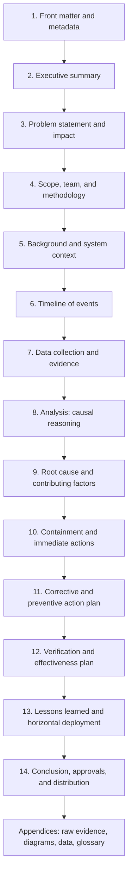
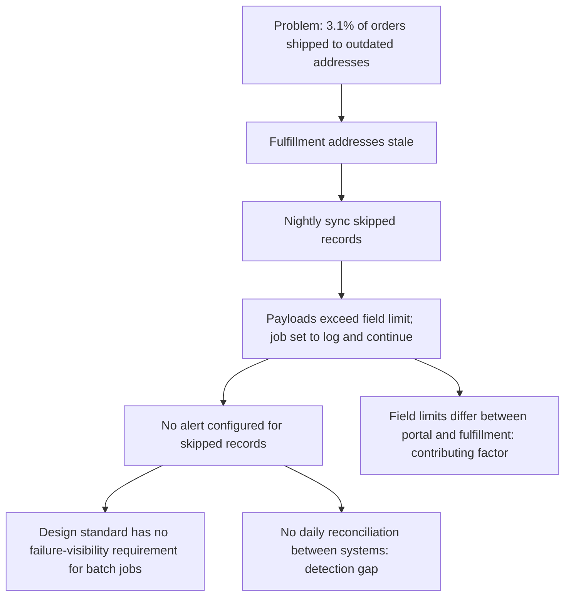
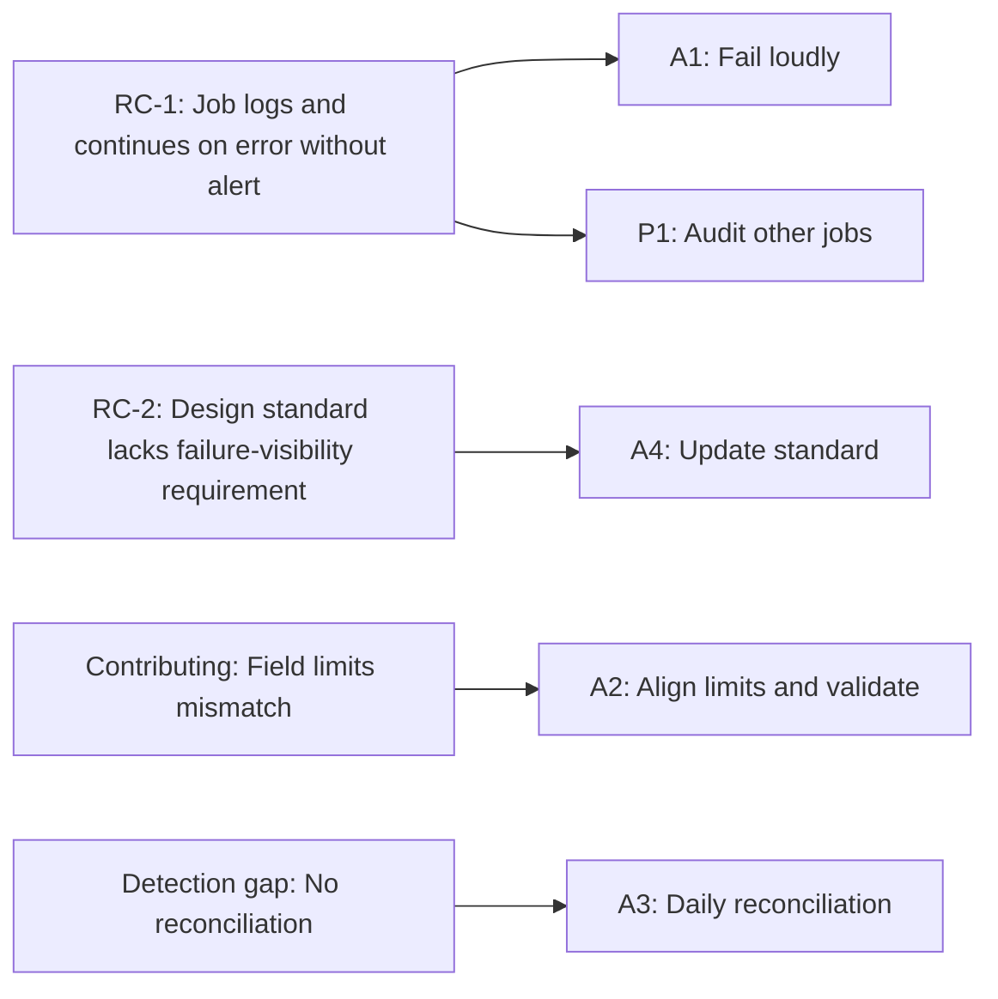
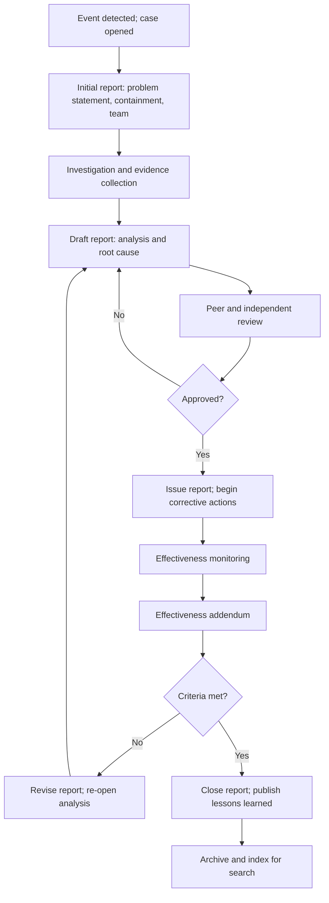

## Standard Structure of an RCA Report


### Overview

A Root Cause Analysis (RCA) report is the durable record of an investigation. It captures **what happened**, **why it happened**, **what was done about it**, and **how the organization knows the fix worked**. The analysis itself (whether a "5 Whys" chain, a fishbone diagram, or a fault tree) is only the middle of the story. Without a well-structured report, the analysis cannot be reviewed, challenged, audited, acted upon, or learned from.

A standard report structure serves several distinct purposes:

| Purpose | What the Structure Provides |
| --- | --- |
| **Communication** | Executives, engineers, auditors, and customers can each find what they need quickly |
| **Reproducibility** | A reader can trace each conclusion back to evidence and reasoning |
| **Accountability** | Actions, owners, dates, and effectiveness criteria are explicit |
| **Consistency** | Reports from different investigators and teams can be compared and aggregated |
| **Compliance** | Regulators, customers, and standards often expect specific record content |
| **Organizational learning** | Findings are searchable and reusable in design reviews, checklists, and training |
| **Quality control of the RCA itself** | Gaps in reasoning become visible when a section cannot be completed |

**Key Points**

- A report is **not a narrative diary** of the investigation; it is a structured argument from evidence to root cause to action.
- The **most important sections** are the problem statement, the evidence-backed causal analysis, the root cause statements, and the action plan with effectiveness criteria.
- Structure should be **standardized across the organization** but **scaled to severity**: a minor issue may need a one-page form, while a serious incident requires a full report.
- Every claim about cause should be **traceable to evidence**, and every action should be **traceable to a cause**.
- The report should be readable by someone who **was not involved** in the event.
- Reports should be **blame-free in tone**, focusing on system conditions, decisions in context, and controls, rather than individual fault.

---

### Report Architecture at a Glance



The sections fall into four logical groups:

| Group | Sections | Question Answered |
| --- | --- | --- |
| **Orientation** | 1 to 2 | What is this and what is the bottom line? |
| **Situation** | 3 to 7 | What happened, how bad was it, and what do we know? |
| **Reasoning** | 8 to 9 | Why did it happen? |
| **Response and learning** | 10 to 14 | What did we do, will it work, and what did we learn? |

---

### Section 1: Front Matter and Metadata

Front matter identifies the report and controls its lifecycle. It should be compact and machine-searchable.

| Field | Purpose | Example |
| --- | --- | --- |
| **Report title** | Concise, descriptive, free of blame | "Wrong-address shipments from nightly sync failure" |
| **Report ID** | Unique reference for traceability | RCA-2026-0142 |
| **Linked records** | Related incident, complaint, CAPA, or change IDs | INC-2026-0207; CAPA-2026-0142 |
| **Version and status** | Draft, in review, approved, closed | v1.2, Approved |
| **Date of event / detection** | When it happened and when it was found | Event: 2026-08-01; detected 2026-08-14 |
| **Date opened / date issued** | Timeline of the investigation | Opened 2026-08-15; issued 2026-09-12 |
| **Severity / classification** | Impact category | High (customer-impacting) |
| **Report owner / lead investigator** | Single accountable author | A. Nguyen |
| **Facilitator** | Person who led the analysis method | L. Petrov |
| **Sponsor** | Senior leader providing resources | D. Alvarez |
| **Distribution list** | Who receives the report | Engineering, Ops, Quality, Customer Support |
| **Confidentiality** | Handling restrictions | Internal; contains customer data references |
| **Change history** | Revision log | v1.0 draft 2026-09-05; v1.1 added evidence; v1.2 approval comments |

**Key Points**

- Use **stable identifiers** so the report can be linked from action trackers, dashboards, and knowledge bases.
- Record **version history**, especially if conclusions change as evidence emerges. A revised root cause is a normal outcome of good investigation, not an embarrassment.

---

### Section 2: Executive Summary

The executive summary is the section most readers will read, and for many readers the only one. It must **stand alone**.

#### Recommended Contents

| Element | Guidance |
| --- | --- |
| **What happened** | One or two sentences, quantified |
| **Impact** | Customers, safety, cost, duration, regulatory implications |
| **Root cause(s)** | Plain-language statement at the system level |
| **Key actions** | Most important containment, corrective, and preventive actions with owners and dates |
| **Current status** | What is complete and what is outstanding |
| **Effectiveness expectation** | How and when success will be verified |
| **Decisions or support needed** | Explicit asks of leadership, if any |

#### Example Executive Summary

> **Summary.** Between 2026-08-01 and 2026-08-14, 3.1% of customer orders (baseline 0.4%) shipped to outdated addresses, affecting approximately 1,400 orders and generating 212 customer contacts. The root cause was a nightly synchronization job that silently skipped records exceeding a fulfillment-system field-length limit, combined with no alert for skipped records and no reconciliation between systems. Containment (daily manual address comparison) has been in place since 2026-08-15. Three corrective actions (loud-fail alerting, portal input validation, daily reconciliation) are scheduled for completion by 2026-10-23, with a 90-day effectiveness review ending 2027-01-21. A preventive audit of seven similar sync jobs is planned by 2026-11-27. No leadership decisions are currently required.

**Key Points**

- Keep it to roughly **half a page** (or about 150 to 300 words).
- Avoid jargon, acronyms, and references to sections the reader has not seen.
- Include **numbers** and **dates**, not vague statements like "significant impact."
- Write it **last**, after the analysis is complete.

---

### Section 3: Problem Statement and Impact

A precise problem statement is the foundation of the analysis. A vague problem statement produces a vague root cause.

#### Elements of a Good Problem Statement

| Element | Question | Example |
| --- | --- | --- |
| **What** | What is the deviation from expected? | Orders shipped to outdated addresses |
| **Where** | Location, system, product, or process | Fulfillment workflow, all warehouses |
| **When** | First occurrence, duration, and pattern | 2026-08-01 to 2026-08-14 |
| **How much** | Magnitude, frequency, and trend | 3.1% of orders vs. 0.4% baseline |
| **Expected vs. actual** | The standard and the observed state | Expected: address matches customer's latest; actual: mismatch |
| **Detection** | How and by whom it was found | Customer complaints; support ticket analysis |

A common template:

> **[Object] exhibited [deviation] at [location], first observed [date], affecting [quantity/proportion], compared to expected [standard].**

#### Impact Assessment

| Impact Dimension | Example Content |
| --- | --- |
| **Customer** | Number affected, severity, complaints, churn risk |
| **Safety** | Injuries, near-misses, hazards |
| **Regulatory / compliance** | Reportable events, violations, notification obligations |
| **Financial** | Direct cost (rework, refunds, downtime) and indirect cost |
| **Operational** | Downtime, delay, capacity consumed |
| **Reputational** | Public visibility, media, social channels |
| **Data / security** | Data exposure or integrity implications |

A simple formulation of duration-weighted impact can be helpful for incident-style reports:

$$\text{Customer-minutes impacted} = \sum_{i} \text{users}_i \times \text{minutes}_i$$

**Key Points**

- State the problem in **observable facts**, not causes ("orders shipped to wrong addresses," not "sync job failed").
- Do not embed the solution in the problem statement.
- Use **baseline comparisons** (for example, control chart limits) to show that the event is genuinely abnormal rather than normal variation.

---

### Section 4: Scope, Team, and Methodology

This section establishes credibility and boundaries.

| Sub-element | Content |
| --- | --- |
| **Scope of investigation** | What is included and explicitly excluded (for example, "customer-portal and fulfillment integration; excludes carrier delivery errors") |
| **Investigation team** | Names, roles, and relevant expertise; note independence where appropriate |
| **Stakeholders consulted** | Interviewed personnel, customers, vendors, and subject-matter experts |
| **Methods used** | 5 Whys, fishbone, fault tree, change analysis, barrier analysis, timeline reconstruction, statistical analysis |
| **Rationale for method selection** | Why these methods suit the problem's complexity |
| **Data sources** | Logs, records, interviews, physical evidence, monitoring systems |
| **Limitations and assumptions** | Data gaps, inaccessible evidence, time constraints |
| **Investigation timeline** | Dates for key steps and milestones |

**Example**

> The investigation used a timeline reconstruction, change analysis (comparing system state before and after the 2026-07-28 platform migration), and a 5 Whys analysis validated against log evidence. Interviews were conducted with the integration engineer, two order-operations supervisors, and the portal product owner. Fulfillment-system logs prior to 2026-07-25 were unavailable due to retention limits; conclusions about pre-migration behavior rely on configuration records.

**Key Points**

- Explicitly listing **limitations** builds trust and prevents over-interpretation.
- Note where the team **lacked independence** (for example, the investigator was involved in the original change) and what mitigations were used.
- For complex events, combine methods rather than relying on the 5 Whys alone; the 5 Whys is a reasoning aid, not a substitute for evidence.

---

### Section 5: Background and System Context

Readers who were not involved need enough context to understand the event.

| Element | Purpose |
| --- | --- |
| **Process or system description** | How the process normally works, at the level needed to follow the analysis |
| **Relevant design and controls** | Existing safeguards, checks, alerts, and procedures |
| **Recent changes** | Deployments, migrations, staffing, supplier or material changes preceding the event |
| **Relevant history** | Prior similar incidents, known issues, previous corrective actions |
| **Roles and responsibilities** | Who normally does what in the process |
| **Definitions and terminology** | Terms the reader needs |

A simple diagram or data-flow description helps enormously. When diagrams are used, label them clearly and keep them consistent with the narrative.

**Key Points**

- Include the **"as designed" versus "as actually operated"** distinction; many failures occur in the gap between them.
- Summarize **prior related cases** and link to them. Repeated causes are a strong signal of systemic weaknesses.

---

### Section 6: Timeline of Events

A precise, evidence-based timeline is often the most valuable part of an RCA. It shows sequence, reveals gaps in detection and response, and helps eliminate false hypotheses.

#### Timeline Table Format

| Timestamp | Event | Source / Evidence | Actor or System | Notes |
| --- | --- | --- | --- | --- |
| 2026-07-28 02:00 | Platform migration completes; scheduler configuration re-imported | Change record CHG-4471 | Platform team | Sync job schedule not in import manifest |
| 2026-08-01 03:00 | First nightly sync executes with new scheduler; records with long addresses skipped | Job log | Sync job | No error raised |
| 2026-08-07 | First customer complaint about wrong address | Ticket T-88213 | Support | Not linked to sync issue |
| 2026-08-14 10:15 | Support analytics flags complaint spike | Dashboard | Support lead | Escalated to engineering |
| 2026-08-14 15:40 | Engineering identifies skipped records in logs | Log review | Integration engineer | Root cause investigation begins |
| 2026-08-15 09:00 | Containment: daily manual address comparison begins | Ops runbook | Order operations |  |

#### Timeline Best Practices

- Use a **single time zone** (state it) and consistent format.
- Distinguish **facts (with sources)** from **inferences** (label as such).
- Mark **decision points**: what information people had and what they chose to do. This supports blame-free analysis of *why the decisions made sense at the time*.
- Include **detection and response milestones** (time to detect, time to contain, time to resolve).
- Note **missed signals** and **missing signals** (alerts that should have fired but did not).

Useful response metrics:

$$\text{Time to detect (TTD)} = t_{\text{detected}} - t_{\text{onset}}$$


$$\text{Time to contain (TTC)} = t_{\text{contained}} - t_{\text{detected}}$$

**Example**

Onset 2026-08-01 03:00; detection 2026-08-14 10:15:

$$\text{TTD} = 13 \text{ days } 7 \text{ h } 15 \text{ min} \approx 319 \text{ hours}$$

The long detection delay is itself a finding: the process lacked a mechanism to detect the failure early.

**Key Points**

- Where timestamps are approximate or reconstructed from memory, **say so**.
- A timeline should support later sections: every causal claim should be traceable to timeline entries or other evidence.

---

### Section 7: Data Collection and Evidence

This section documents the factual foundation of the analysis.

#### Evidence Register

| Evidence ID | Type | Description | Source | Collected By / Date | Location | Reliability Note |
| --- | --- | --- | --- | --- | --- | --- |
| E-01 | Log | Nightly sync job logs, 2026-07-25 to 2026-08-14 | Log platform | Integration engineer / 2026-08-15 | Case folder /E-01 | Complete after 2026-07-25 |
| E-02 | Config | Scheduler export before and after migration | Configuration repo | Platform team / 2026-08-16 | /E-02 | Version-controlled |
| E-03 | Data | Portal vs. fulfillment address mismatch extract | Database query | Data analyst / 2026-08-16 | /E-03 | Query reviewed |
| E-04 | Interview | Notes with order-operations supervisors | Interviews | Investigator / 2026-08-18 | /E-04 | Two independent sources |
| E-05 | Chart | p chart of daily wrong-address proportion | Analytics | Quality engineer / 2026-08-20 | /E-05 | Baseline 2026-05 to 2026-07 |

#### Types of Evidence

| Type | Examples | Strengths | Cautions |
| --- | --- | --- | --- |
| **Physical** | Failed parts, tools, equipment, samples | Direct observation | Preserve chain of custody; avoid contamination |
| **Documentary** | Procedures, records, change tickets, configurations | Objective | May differ from actual practice |
| **Digital / system** | Logs, telemetry, database extracts, traces | Timestamped, granular | Retention limits; clock skew; missing events |
| **Testimonial** | Interviews, statements | Context and decision reasoning | Memory bias; hindsight bias; power dynamics |
| **Statistical** | Control charts, capability studies, trend analyses | Quantifies abnormality | Requires sound sampling and measurement |
| **Experimental** | Reproduction tests, controlled trials | Tests causal claims | Must be representative and safe |

#### Evidence Quality Considerations

- Prefer **primary sources** (logs, physical evidence) over recollection.
- Corroborate claims with **at least two independent sources** where possible.
- Record **evidence gaps** and how they were handled.
- Preserve **chain of custody** for physical and security-relevant evidence.
- Use **statistical tools** (for example, control charts) to show that the event is a genuine signal.

**Key Points**

- Each key claim in the analysis should reference an evidence ID (for example, "[E-01]").
- Keep raw evidence in **appendices or an external case folder**, and reference it from the body.

---

### Section 8: Analysis: Causal Reasoning

This is the analytical core. It shows how the team moved from facts to causes.

#### What This Section Contains

| Element | Description |
| --- | --- |
| **Analysis method output** | 5 Whys chain, fishbone diagram, fault tree, causal factor chart, or other artifacts |
| **Hypotheses considered** | Candidate causes, including those tested and rejected |
| **Evidence for and against** | How each hypothesis was tested |
| **Causal chain** | Ordered explanation from root cause to observed effect |
| **Barrier analysis** | Which controls should have prevented or detected the failure and why they did not |
| **Change analysis** | What changed relative to the last known good state |
| **Human factors and organizational factors** | Workload, incentives, communication, procedures, training, culture |

#### Presenting a 5 Whys Chain with Evidence

| Level | Why? | Answer | Evidence | Verified? |
| --- | --- | --- | --- | --- |
| Problem | Why were orders shipped to outdated addresses? | Fulfillment system held stale addresses | E-03 | Yes |
| Why 1 | Why were addresses stale? | Nightly sync skipped affected records | E-01 | Yes |
| Why 2 | Why were records skipped? | Address payloads exceeded the fulfillment field limit and the job continued on error | E-01, E-02 | Yes |
| Why 3 | Why did the job continue silently? | Error handling was set to "log and continue"; no alert configured for skipped records | E-02 | Yes |
| Why 4 | Why was there no alert? | Alerting was not part of the integration design standard | E-04, design doc | Partially (documented; interview corroborates) |
| Why 5 | Why did the standard omit alerting? | Standard focused on functional correctness; no requirement for failure visibility in batch jobs | Design standard v2 | Yes |



#### Testing Hypotheses

For each candidate cause, document:

| Hypothesis | Prediction if True | Test / Evidence | Result | Conclusion |
| --- | --- | --- | --- | --- |
| Carrier error | Mismatches only after handoff | Compared pre-ship address in system to intended | Address wrong before shipping | Rejected |
| Portal bug not saving changes | Portal DB shows old address | Query showed portal DB correct | Portal correct | Rejected |
| Sync job skipping records | Skipped-record log entries correlate with mismatches | Match rate 98% | Strong correlation | Supported |
| Migration removed the job | Job absent from scheduler | Job present but with altered error handling | Partial | Contributing: error handling changed |

**Key Points**

- **Do not stop at the first plausible cause.** Show that alternatives were considered and excluded.
- Distinguish **root cause**, **contributing factors**, and **incidental findings** (things that were wrong but did not cause this event).
- Mark reasoning that rests on inference rather than direct evidence, using labels such as **[Inference]** and note what would confirm it.
- Include the **systemic and organizational layer**. If the chain ends at "operator error" or "developer mistake," the analysis has probably stopped too early.
- Show that the cause is **necessary and sufficient enough**: if it were removed, would the event likely not have occurred (counterfactual test)?

---

### Section 9: Root Cause and Contributing Factors

State conclusions clearly and separately from the analysis narrative.

#### Root Cause Statement Format

A well-formed root cause statement describes a **system condition** and its **causal link to the outcome**, avoiding blame and vague terms.

> **Because [systemic condition], [failure mechanism] occurred, resulting in [effect].**

| Weak Statement | Strong Statement |
| --- | --- |
| "Developer error" | "The integration design standard did not require failure visibility for batch jobs, so the job was configured to log and continue on record errors without alerting, allowing silent data loss." |
| "Poor communication" | "The change-management template did not require confirmation that scheduled-job configuration was included in migration manifests, so the sync job's error-handling settings were reset to defaults during migration." |
| "Operator did not follow procedure" | "The procedure required a manual check that was not enforced by the tooling and conflicted with line-rate targets, so the check was routinely skipped during high-volume periods." |

#### Categories of Causes

| Category | Meaning | Example |
| --- | --- | --- |
| **Root cause** | Fundamental system condition that, if corrected, would prevent recurrence | Design standard omits failure-visibility requirement |
| **Contributing factor** | Condition that increased likelihood or severity but was not sufficient alone | Field-length limits differ between systems |
| **Detection gap** | Reason the failure was not caught earlier | No reconciliation between portal and fulfillment |
| **Escape / response factor** | Reason impact was larger or longer than necessary | Complaints not correlated with system events |
| **Incidental finding** | Unrelated issue discovered during the investigation | Documentation typo in runbook |

#### Confidence and Verification

| Field | Content |
| --- | --- |
| **Confidence level** | High / medium / low, with rationale |
| **Verification method** | How the cause was confirmed (reproduction, log correlation, controlled test, configuration comparison) |
| **Open questions** | What remains uncertain and what would resolve it |

**Key Points**

- Number the root causes (RC-1, RC-2) so actions and effectiveness criteria can reference them.
- Write in **plain, specific language** and avoid vague terms such as "lack of awareness" or "insufficient attention" unless supported by concrete evidence and mapped to system changes.
- If confidence is limited, say so and describe what monitoring or further testing will resolve it, rather than overstating certainty.

---

### Section 10: Containment and Immediate Actions

Record what was done to protect people and operations while the investigation and permanent fixes were underway.

| ID | Action | Purpose | Owner | Date | Status | Retirement Condition |
| --- | --- | --- | --- | --- | --- | --- |
| C1 | Daily manual comparison of portal and fulfillment addresses for open orders | Prevent further wrong-address shipments | Order Operations Manager | 2026-08-15 | Active | Retire after A1 to A3 effective for 90 days |
| C2 | Customer outreach and reshipment for affected orders | Repair customer impact | Customer Support Lead | 2026-08-16 | Complete | N/A |
| C3 | Hold on migrating additional jobs to the new scheduler | Prevent repeat elsewhere | Platform Manager | 2026-08-17 | Active | Retire after migration checklist revision |

**Key Points**

- Clearly separate **containment** from **corrective action** so the report cannot be misread as claiming a permanent fix.
- Include the **effect of containment** (for example, "wrong-address rate fell from 3.1% to 0.5% after C1") to document the interim state.
- Define **retirement conditions** and owners.

---

### Section 11: Corrective and Preventive Action Plan

This section converts findings into accountable work. It should reflect SMART principles and link each action to a root cause.

#### Action Register

| ID | Type | Action | Root Cause | Owner | Due | Implementation Evidence | Status |
| --- | --- | --- | --- | --- | --- | --- | --- |
| A1 | Corrective | Modify sync job to fail loudly and page on-call when any record is skipped | RC-1 | J. Mbeki | 2026-10-09 | Merged code; 3 of 3 injected-failure tests alert | In progress |
| A2 | Corrective | Align field limits and add portal input validation | RC-1 (contrib.) | H. Schmidt | 2026-10-16 | Validation deployed; boundary tests | Planned |
| A3 | Corrective | Add daily reconciliation report reviewed each morning | Detection gap | S. Tanaka | 2026-10-23 | Report live; five reviews signed | Planned |
| A4 | Corrective | Add failure-visibility requirement to integration design standard | RC-2 | Architecture Lead | 2026-11-06 | Standard v3 released | Planned |
| P1 | Preventive | Audit seven other sync jobs for silent-skip behavior | RC-1 (extent) | Engineering Manager | 2026-11-27 | Audit report; remediation tickets | Planned |

#### Traceability



#### Requirements for Each Action

| Attribute | Guidance |
| --- | --- |
| **SMART** | Specific, measurable, achievable, relevant, time-bound |
| **Single owner** | One accountable named individual, with a delegate |
| **Root cause linkage** | Explicit reference to the cause it addresses |
| **Strength** | Prefer strong, system-level controls; note when an action relies on human vigilance |
| **Risk of change** | Note any risks introduced by the action |
| **Dependencies** | Resources, approvals, or other actions required |

**Key Points**

- Every root cause should have **at least one action**, and every action should trace to a **cause or finding**. Orphaned actions and unaddressed causes are red flags.
- Include **preventive actions** that extend the learning to other systems and processes.
- If a recommended action is **not being pursued** (for example, due to cost), document the decision and the **risk acceptance** with the approver.

---

### Section 12: Verification and Effectiveness Plan

Specify in advance how the organization will know the actions worked.

| Element | Content |
| --- | --- |
| **Effectiveness criteria** | Measurable outcome targets (for example, wrong-address rate ≤ 0.4%, stable on p chart, zero silent skips) |
| **Baseline** | Pre-action performance (for example, 3.1% during the event; 0.4% typical) |
| **Leading indicators** | Control-health measures (alert fire rate on seeded failures; reconciliation mismatch rate) |
| **Monitoring window** | Duration sized to failure frequency (for example, 90 days, 45,000 orders) |
| **Method of analysis** | Control chart, rate comparison, capability analysis, challenge tests |
| **Reviewer** | Independent person or function |
| **Review date** | Scheduled date of effectiveness review |
| **Containment retirement plan** | Conditions and step-down approach |
| **Reopen triggers** | Conditions that reopen the case (for example, mismatch rate > 0.1% for two consecutive days) |

A simple relative-reduction measure is often included:

$$\text{Relative reduction} = \frac{p_0 - p_1}{p_0} \times 100\%$$

**Key Points**

- The plan should be **written before the outcome is known** to avoid moving the goalposts.
- If the report is issued before effectiveness data exist, this section is the **commitment**; a later **effectiveness addendum** records the results.

---

### Section 13: Lessons Learned and Horizontal Deployment

This section captures reusable knowledge.

| Element | Content |
| --- | --- |
| **What went well** | Effective detection, response, collaboration, and recovery practices |
| **What did not go well** | Delays, missed signals, ineffective steps |
| **Where we got lucky** | Near-misses or mitigating circumstances that should not be relied upon |
| **Generalized principles** | Reusable insight beyond this case (for example, "automated jobs must fail loudly; silent skipping is prohibited") |
| **Extent-of-condition review** | Other processes, products, sites, or systems assessed and results (including negative findings) |
| **Applicability** | Which teams should apply the lesson |
| **Updates to standards, templates, and checklists** | Where the learning is being embedded |
| **Knowledge-base tags** | Taxonomy terms for search (failure mode, cause category, technology, process) |

**Key Points**

- Write lessons at both the **specific** and **general** level.
- Link lessons to **workflow touchpoints** (design-review checklists, templates, onboarding) so they are encountered, not just archived.

---

### Section 14: Conclusion, Approvals, and Distribution

| Element | Content |
| --- | --- |
| **Conclusion** | Brief restatement of root cause(s), actions, and status |
| **Open items** | Outstanding tasks, deferrals, and risk acceptances with owners and dates |
| **Approvals** | Signatures or recorded approvals from author, reviewer, sponsor, and approving authority |
| **Distribution and communication plan** | Who receives the report, in what form, and when |
| **Follow-up schedule** | Next review dates and effectiveness review |
| **Report closure criteria** | Conditions under which the RCA record will be formally closed |

Approval block example:

| Role | Name | Decision | Date |
| --- | --- | --- | --- |
| Lead investigator | A. Nguyen | Submitted | 2026-09-12 |
| Independent reviewer | R. Chen | Approved | 2026-09-14 |
| Sponsor | D. Alvarez | Approved | 2026-09-15 |
| CAPA board chair | M. Alvarez | Approved | 2026-09-16 |

---

### Appendices

Appendices hold detail that would clutter the main narrative but is needed for verification.

| Appendix | Contents |
| --- | --- |
| **A. Evidence register and raw evidence index** | Full list with locations and chain of custody |
| **B. Detailed timeline** | Full log-level or minute-level chronology |
| **C. Analysis artifacts** | Complete 5 Whys tables, fishbone diagrams, fault trees, barrier and change analyses |
| **D. Data and statistical analysis** | Control charts, capability calculations, data extracts, methodology notes |
| **E. Interview summaries** | Sanitized notes, with consent and confidentiality handled |
| **F. Reference documents** | Procedures, specifications, design standards, change records |
| **G. Action tracking details** | Extended action register with milestone history |
| **H. Glossary and acronyms** | Terms used |
| **I. Photographs, screenshots, and diagrams** | Supporting visuals |

---

### Scaling the Structure to Severity

Not every problem needs a 30-page report. Match depth to risk.

| Tier | Typical Use | Suggested Format | Contents |
| --- | --- | --- | --- |
| **Tier 1: Brief / one-page** | Low-severity, low-recurrence issues; minor nonconformances | One-page form or ticket template | Problem, impact, containment, 5 Whys with evidence, root cause, actions, effectiveness criteria |
| **Tier 2: Standard report** | Moderate-severity events; customer complaints; repeat issues | 3 to 8 pages | Sections 1 through 14 in concise form; key evidence in appendices |
| **Tier 3: Full report** | High-severity, safety, regulatory, or high-cost events | 10+ pages with appendices | All sections in full; multi-method analysis; independent review; executive briefing |
| **Tier 4: Formal investigation / board-level** | Catastrophic or externally reportable events | Comprehensive with formal review and legal considerations | Full report plus governance, external communication, and regulatory submissions |

[Inference: Tier boundaries and page counts are illustrative; define tiers in your organization's procedure based on severity classification, regulatory obligations, and customer requirements.]

#### Minimum Viable Report Contents

Regardless of tier, a report should at least contain:

1. Problem statement with quantified impact
2. Timeline or sequence of events
3. Evidence supporting the causal chain
4. Root cause statement(s)
5. Containment and corrective/preventive actions with owners and dates
6. Effectiveness criteria and review date
7. Approval and status

---

### Writing Quality: Style and Tone

| Principle | Guidance |
| --- | --- |
| **Blame-free, system-focused** | Describe conditions, decisions in context, and controls, rather than individual failings |
| **Factual and precise** | Use quantities, dates, and named systems; avoid vague terms |
| **Evidence-linked** | Reference evidence IDs for claims |
| **Distinguish fact from inference** | Label uncertain reasoning explicitly |
| **Active, clear language** | Avoid passive constructions that hide who or what acted |
| **Consistent terminology** | Define terms once and use them consistently |
| **Neutral tone** | Avoid emotional or defensive language |
| **Audience-aware** | Executive summary for leaders; detail for engineers; appendices for auditors |
| **Concise** | Include what supports the argument; move bulk to appendices |
| **Hindsight-aware** | Evaluate decisions based on what people knew at the time, not what is known now |

#### Language Substitutions

| Avoid | Prefer |
| --- | --- |
| "Human error" (as a root cause) | The system conditions that made the error likely and undetected |
| "Failed to follow procedure" | "The procedure was difficult to follow because...; the step was not enforced by tooling" |
| "Careless" / "negligent" | Specific, observable behavior and context |
| "Obviously" / "clearly" | The evidence that makes it evident |
| "Should have known" | What information was available and how it was presented |

---

### Common Report Templates

#### Full Report Skeleton (Markdown)

```markdown
## RCA Report: <Title>

### 1. Report Information
- **Report ID:**
- **Linked records:**
- **Version / status:**
- **Event date / detection date:**
- **Severity:**
- **Lead investigator / facilitator / sponsor:**
- **Distribution:**

### 2. Executive Summary
<What happened, impact, root cause, key actions, status, decisions needed>

### 3. Problem Statement and Impact
- **What / where / when / how much:**
- **Expected vs. actual:**
- **Impact (customer, safety, regulatory, financial, operational):**

### 4. Scope, Team, and Methodology
- **Scope / exclusions:**
- **Team and stakeholders:**
- **Methods and rationale:**
- **Limitations and assumptions:**

### 5. Background and Context
<Process description, controls, recent changes, prior related cases>

### 6. Timeline of Events
| Timestamp | Event | Evidence | Notes |
|---|---|---|---|

### 7. Evidence Summary
| ID | Type | Description | Source | Reliability |
|---|---|---|---|---|

### 8. Analysis
<Hypotheses tested, causal chain, 5 Whys with evidence, barrier and change analysis>

### 9. Root Causes and Contributing Factors
- **RC-1:**
- **Contributing factors:**
- **Detection gaps:**
- **Confidence and verification:**

### 10. Containment and Immediate Actions
| ID | Action | Owner | Date | Retirement condition |
|---|---|---|---|---|

### 11. Corrective and Preventive Action Plan
| ID | Type | Action | Root cause | Owner | Due | Evidence of completion |
|---|---|---|---|---|---|---|

### 12. Verification and Effectiveness Plan
- **Criteria / baseline / window / method / reviewer / review date:**
- **Reopen triggers:**

### 13. Lessons Learned and Horizontal Deployment
<What went well, what did not, general principles, extent-of-condition results>

### 14. Conclusion and Approvals
| Role | Name | Decision | Date |
|---|---|---|---|

### Appendices
- A: Evidence register
- B: Detailed timeline
- C: Analysis artifacts
- D: Data and statistical analysis
- E: References
- F: Glossary
```

#### Condensed One-Page Template (Tier 1)

```markdown
### RCA Summary: <Title> (ID: ____)

- **Problem (what/where/when/how much):**
- **Impact:**
- **Containment (owner, date):**
- **5 Whys (with evidence):**
  1. Why?
  2. Why?
  3. Why?
  4. Why?
  5. Why?
- **Root cause (system-level):**
- **Actions:** ID | Type | Action | Owner | Due
- **Effectiveness criteria and review date:**
- **Approved by / date:**
```

---

### Implementation Sketch: Report Completeness Checker

A small Python script can validate that a report contains required sections and that traceability rules hold, which is useful for quality gates in a document-management or CAPA system.

**Example**

```python
import re

REQUIRED_SECTIONS = [
    "Report Information", "Executive Summary", "Problem Statement",
    "Scope", "Timeline", "Evidence", "Analysis", "Root Cause",
    "Containment", "Corrective and Preventive Action",
    "Verification and Effectiveness", "Lessons Learned", "Conclusion",
]

def check_sections(markdown_text: str) -> list[str]:
    missing = []
    for section in REQUIRED_SECTIONS:
        if not re.search(rf"^#+\s.*{re.escape(section)}", markdown_text,
                         flags=re.IGNORECASE | re.MULTILINE):
            missing.append(section)
    return missing

def check_traceability(root_causes: set[str], actions: dict[str, set[str]]) -> list[str]:
    """actions maps action ID -> set of root cause IDs it addresses."""
    issues = []
    addressed = set().union(*actions.values()) if actions else set()
    for rc in sorted(root_causes - addressed):
        issues.append(f"Root cause {rc} has no linked action.")
    for aid, rcs in actions.items():
        if not rcs:
            issues.append(f"Action {aid} is not linked to any root cause (orphan action).")
        unknown = rcs - root_causes
        if unknown:
            issues.append(f"Action {aid} references unknown cause(s): {sorted(unknown)}")
    return issues

sample_report = """
## RCA Report: Wrong-address shipments
### 1. Report Information
### 2. Executive Summary
### 3. Problem Statement and Impact
### 6. Timeline of Events
### 8. Analysis
### 9. Root Causes and Contributing Factors
### 11. Corrective and Preventive Action Plan
"""

print("Missing sections:")
for m in check_sections(sample_report):
    print(" -", m)

root_causes = {"RC-1", "RC-2"}
actions = {
    "A1": {"RC-1"},
    "A2": {"RC-1"},
    "A3": set(),
}
print("\nTraceability issues:")
for issue in check_traceability(root_causes, actions):
    print(" -", issue)
```

**Output**

```text
Missing sections:
 - Scope
 - Evidence
 - Containment
 - Verification and Effectiveness
 - Lessons Learned
 - Conclusion

Traceability issues:
 - Root cause RC-2 has no linked action.
 - Action A3 is not linked to any root cause (orphan action).
```

The script demonstrates **structural** quality checks only. It cannot judge whether the analysis is sound or the evidence adequate, which requires human review. [Inference: Production systems typically embed such checks as workflow gates and combine them with peer review and approval steps.]

---

### Review and Quality Assurance of the Report

Before issuing, review the report against a checklist.

| Review Question | Pass Criterion |
| --- | --- |
| Does the problem statement quantify the deviation and reference a baseline? | Yes |
| Can a newcomer understand the event from the executive summary alone? | Yes |
| Is the timeline evidence-based, with sources and consistent time zone? | Yes |
| Does each causal claim reference evidence? | Yes |
| Were alternative hypotheses considered and excluded with reasons? | Yes |
| Does the causal chain reach a system-level, actionable cause? | Yes |
| Are root causes separated from contributing factors and detection gaps? | Yes |
| Is uncertainty acknowledged and labeled? | Yes |
| Does every root cause have at least one action, and every action a linked cause? | Yes |
| Are actions SMART with a single owner and date? | Yes |
| Are containment and corrective actions clearly distinguished? | Yes |
| Are effectiveness criteria, baseline, window, and reviewer defined in advance? | Yes |
| Was extent-of-condition assessed, including negative findings? | Yes |
| Is the tone blame-free and system-focused? | Yes |
| Have independent review and approvals been obtained? | Yes |
| Are sensitive data and confidentiality handled appropriately? | Yes |

**Key Points**

- Use **peer or independent review** to catch anchoring, gaps in reasoning, and unsupported claims.
- Have someone **not involved** in the event read the summary and problem statement and confirm they understand it.

---

### Report Lifecycle



Many organizations use **staged reporting** for serious events, such as an **initial notification** within hours, an **interim report** within days containing containment and preliminary findings, and a **final report** once the root cause is verified. [Inference: Timelines for staged reports are often set by customer contracts, regulators, or internal policy; follow the requirements applicable to your context.]

---

### Domain Adaptations

#### Software and IT Operations (Post-Incident Reviews)

- Reports often use titles such as **postmortem** or **post-incident review**, with sections for summary, impact, timeline, root causes and contributing factors, detection and response analysis, what went well and poorly, and action items.
- Emphasize **blameless** framing, **customer-minutes impacted**, **TTD/TTC/TTR**, and **action items with owners in the ticketing system**.
- Include **error budget** or service-level objective impact where relevant.

#### Manufacturing and Quality (8D, CAPA Reports)

- The **8D** format maps to the standard structure: team formation (D1), problem description (D2), containment (D3), root cause (D4), corrective action selection (D5), implementation (D6), prevention of recurrence (D7), and team recognition/closure (D8).
- Customer-specific formats may prescribe fields and timelines. [Inference: Requirements vary by customer and industry; follow the applicable specification.]

#### Healthcare and Regulated Environments

- Serious event reports typically require **documented root cause analysis, action plans with measures of success, and leadership involvement**, with confidentiality and patient-privacy protections.
- Follow applicable **regulatory reporting formats and deadlines**, and involve compliance and legal functions as required.

#### Safety and Process Industries

- Incident investigation reports typically include **causal factor charting**, **barrier analysis**, **human performance analysis**, and **management-system causes**, with recommendations tracked to closure.

---

### Common Pitfalls and Remedies

| Pitfall | Consequence | Remedy |
| --- | --- | --- |
| Narrative diary instead of structured argument | Reader cannot follow reasoning | Use the standard structure; separate facts, analysis, and conclusions |
| Vague problem statement | Vague root cause | Quantify what/where/when/how much and cite the baseline |
| Root cause stated without evidence | Unverifiable conclusion; wrong fixes | Link claims to evidence IDs; document hypothesis testing |
| Stopping at "human error" | Systemic causes persist | Continue the causal chain to system conditions |
| Mixing containment with corrective action | Premature closure | Separate sections and labels |
| Actions with no linked cause or owner | Ineffective, untracked work | Enforce traceability and single owners |
| No effectiveness plan | Unknown whether the fix worked | Define criteria, baseline, window, and reviewer up front |
| Executive summary that cannot stand alone | Leaders miss key facts | Write last; test with a naive reader |
| Blaming language | Concealment; degraded future RCAs | Blame-free, system-focused writing |
| Hiding uncertainty | Overconfident, fragile conclusions | Label inferences; document confidence and open questions |
| Overlong report burying key points | Not read | Use summary, tiering, and appendices |
| Missing timeline or unsourced timeline | Weak reconstruction | Evidence-based timeline with a single time zone |
| No lessons-learned or horizontal deployment | Repeat problems elsewhere | Include extent-of-condition and general principles |
| Report never updated after new evidence | Stale or incorrect record | Version control; revision history; effectiveness addendum |
| Unclear distribution and confidentiality | Leakage or lost learning | State distribution and handling requirements |
| Inconsistent formats across teams | Cannot aggregate or trend | Standard templates with tiering |

---

### Best Practices Checklist

- Adopt a **standard template** with defined sections, and **scale it by severity tier**.
- Write a **quantified problem statement** and an **evidence-based timeline** before analyzing causes.
- Maintain an **evidence register** and cite evidence IDs for every key claim.
- Show **hypotheses considered and excluded**, not just the winning explanation.
- Carry the causal chain to a **system-level, actionable root cause**, and separate root causes, contributing factors, and detection gaps.
- **Label inferences** and state confidence and open questions.
- Keep **containment, corrective, and preventive actions** distinct, each with a **single owner, date, root-cause linkage, and effectiveness criterion**.
- Define the **verification and effectiveness plan** before implementation, and append results in an **effectiveness addendum**.
- Include **lessons learned and extent-of-condition results**, including negative findings.
- Write the **executive summary last** and test it with a reader outside the event.
- Use **blame-free, precise, evidence-linked language**.
- Obtain **independent review and formal approval**; maintain **version history**.
- Use **appendices** for bulk evidence and detailed analysis.
- Store reports in a **searchable repository** with consistent taxonomy so patterns can be trended.

---

**Related Topics**

- Writing clear problem statements and quantifying impact
- Building evidence-based timelines
- Documenting the 5 Whys with supporting evidence
- Fishbone, fault tree, and causal factor charting in reports
- Blameless postmortems and just-culture writing
- Presenting RCA findings to executives and customers
- 8D reports and customer-specific problem-solving formats
- Tracking and reporting action status and effectiveness
- Building a searchable RCA and lessons-learned knowledge base
- Peer review and quality assurance of RCA reports